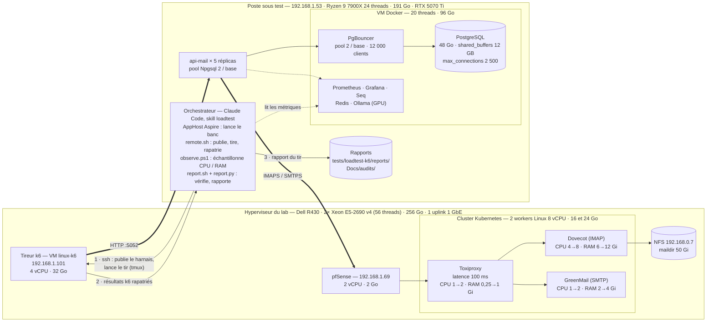

# Banc de charge api-mail — infrastructure

> Relevé le 2026-10-01.

```mermaid
flowchart LR
    subgraph ESXI["Hyperviseur du lab — Dell R430 · 2× Xeon E5-2690 v4 (56 threads) · 256 Go · 1 uplink 1 GbE"]
        direction TB
        K6["Tireur k6 — VM linux-k6<br/>192.168.1.101<br/>4 vCPU · 32 Go"]
        PFS["pfSense — 192.168.1.69<br/>2 vCPU · 2 Go"]
        subgraph K8S["Cluster Kubernetes — 2 workers Linux 8 vCPU · 16 et 24 Go"]
            TOX["Toxiproxy<br/>latence 100 ms<br/>CPU 1→2 · RAM 0,25→1 Gi"]
            DOV["Dovecot (IMAP)<br/>CPU 4→8 · RAM 6→12 Gi"]
            GM["GreenMail (SMTP)<br/>CPU 1→2 · RAM 2→4 Gi"]
        end
        NFS[("NFS 192.168.0.7<br/>maildir 50 Gi")]
    end

    subgraph POSTE["Poste sous test — 192.168.1.53 · Ryzen 9 7900X 24 threads · 191 Go · RTX 5070 Ti"]
        direction TB
        ORCH["Orchestrateur — Claude Code, skill loadtest<br/>AppHost Aspire : lance le banc<br/>remote.sh : publie, tire, rapatrie<br/>observe.ps1 : échantillonne CPU / RAM<br/>report.sh + report.py : vérifie, rapporte"]
        REP[("Rapports<br/>tests/loadtest-k6/reports/<br/>Docs/audits/")]
        API["api-mail × 5 réplicas<br/>pool Npgsql 2 / base"]
        subgraph WSL["VM Docker — 20 threads · 96 Go"]
            PGB["PgBouncer<br/>pool 2 / base · 12 000 clients"]
            PG[("PostgreSQL<br/>48 Go · shared_buffers 12 GB<br/>max_connections 2 500")]
            OBS["Prometheus · Grafana · Seq<br/>Redis · Ollama (GPU)"]
        end
    end

    ORCH -- "1 · ssh : publie le harnais,<br/>lance le tir (tmux)" --> K6
    K6 -- "2 · résultats k6 rapatriés" --> ORCH
    ORCH -. "lit les métriques" .-> OBS
    ORCH -- "3 · rapport du tir" --> REP
    K6 == "HTTP :5052" ==> API
    API --> PGB --> PG
    API -.-> OBS
    API == "IMAPS / SMTPS" ==> PFS
    PFS --> TOX
    TOX --> DOV
    TOX --> GM
    DOV --> NFS
```

Les valeurs `x→y` des pods sont les *requests* → *limits*.
