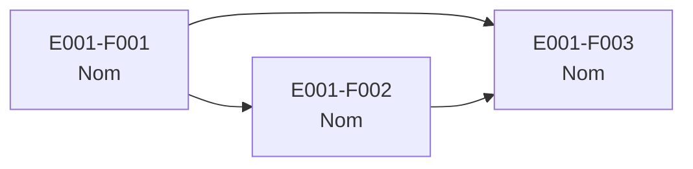

# E000 — Template d'EPIC

> **Statut** : 🟡 Brouillon
> **Version** : 0.1
> **Auteur** : *Nom du PO*
> **Dernière mise à jour** : *AAAA-MM-JJ*

---

## 1. Vision

<!--
  Décrivez en 2-3 phrases la vision de cet EPIC.
  Quel problème résout-il pour le médecin généraliste ?
  Quelle valeur apporte-t-il ?
-->

*À compléter.*

---

## 2. Objectifs métier

<!--
  Listez les objectifs mesurables que cet EPIC doit atteindre.
-->

- [ ] Objectif 1 : *…*
- [ ] Objectif 2 : *…*
- [ ] Objectif 3 : *…*

---

## 3. Acteurs concernés

| Acteur | Rôle dans l'EPIC |
|--------|------------------|
| Médecin généraliste | *Utilisateur principal* |
| Patient | *…* |
| *Autre acteur* | *…* |

---

## 4. Features de l'EPIC

<!--
  Listez toutes les Features qui composent cet EPIC.
  Indiquez l'ordre logique et les dépendances.
-->

| # | Feature | Description courte | Dépendances |
|---|---------|-------------------|-------------|
| E001-F001 | *Nom de la feature* | *Description en une phrase* | *Aucune / EXXX-FYYY* |
| E001-F002 | *Nom de la feature* | *Description en une phrase* | *E001-F001* |
| E001-F003 | *Nom de la feature* | *Description en une phrase* | *E001-F001* |

---

## 5. Workflow entre Features

<!--
  Décrivez le flux de travail entre les Features de cet EPIC.
  Utilisez un diagramme Mermaid pour illustrer les enchaînements.
-->

**Description du workflow** :

1. **E001-F001** : *Description de l'étape et de son rôle dans le flux.*
2. **E001-F002** : *Description de l'étape. Dépend de E001-F001 car…*
3. **E001-F003** : *Description de l'étape. Dépend de E001-F001 et E001-F002 car…*

---

## 6. Règles métier transverses

<!--
  Listez les règles métier qui s'appliquent à l'ensemble de l'EPIC
  (pas spécifiques à une seule Feature ou un seul Use Case).
-->

| ID | Règle | Description |
|----|-------|-------------|
| RG-E000-01 | *Nom de la règle* | *Description de la règle* |
| RG-E000-02 | *Nom de la règle* | *Description de la règle* |

---

## 7. Contraintes et hypothèses

### Contraintes
- *Contrainte 1 : …*
- *Contrainte 2 : …*

### Hypothèses
- *Hypothèse 1 : …*
- *Hypothèse 2 : …*

---

## 8. Critères d'acceptation de l'EPIC

<!--
  Conditions à remplir pour considérer l'EPIC comme terminé.
-->

- [ ] Toutes les Features sont implémentées et validées.
- [ ] *Critère spécifique 1*
- [ ] *Critère spécifique 2*

---

## 9. Hors périmètre

<!--
  Listez explicitement ce qui N'EST PAS dans le périmètre de cet EPIC.
  Cela évite les ambiguïtés.
-->

- *Élément hors périmètre 1*
- *Élément hors périmètre 2*

---

*Ce template est un modèle. Copiez le répertoire `E000-template/` et adaptez-le à votre EPIC.*
