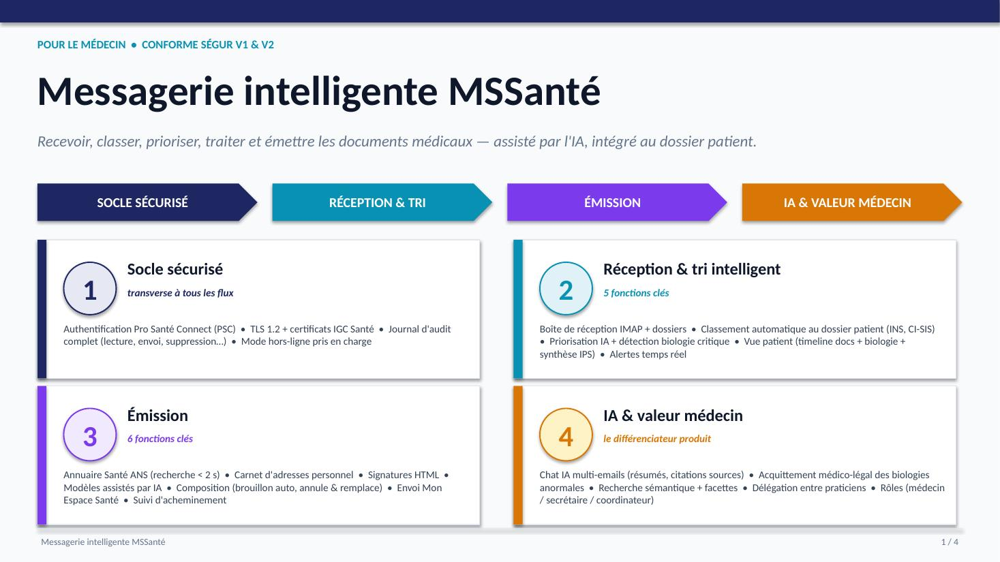
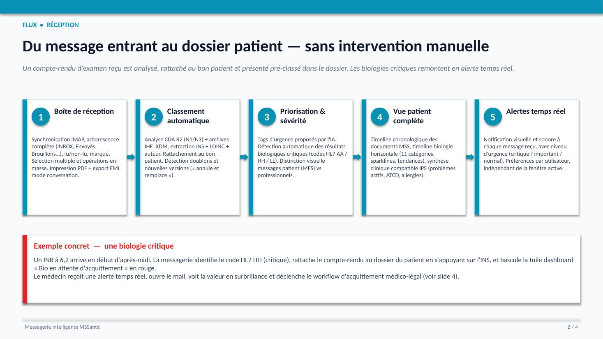
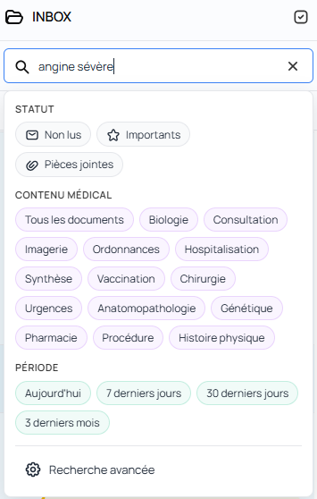
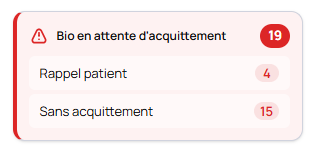
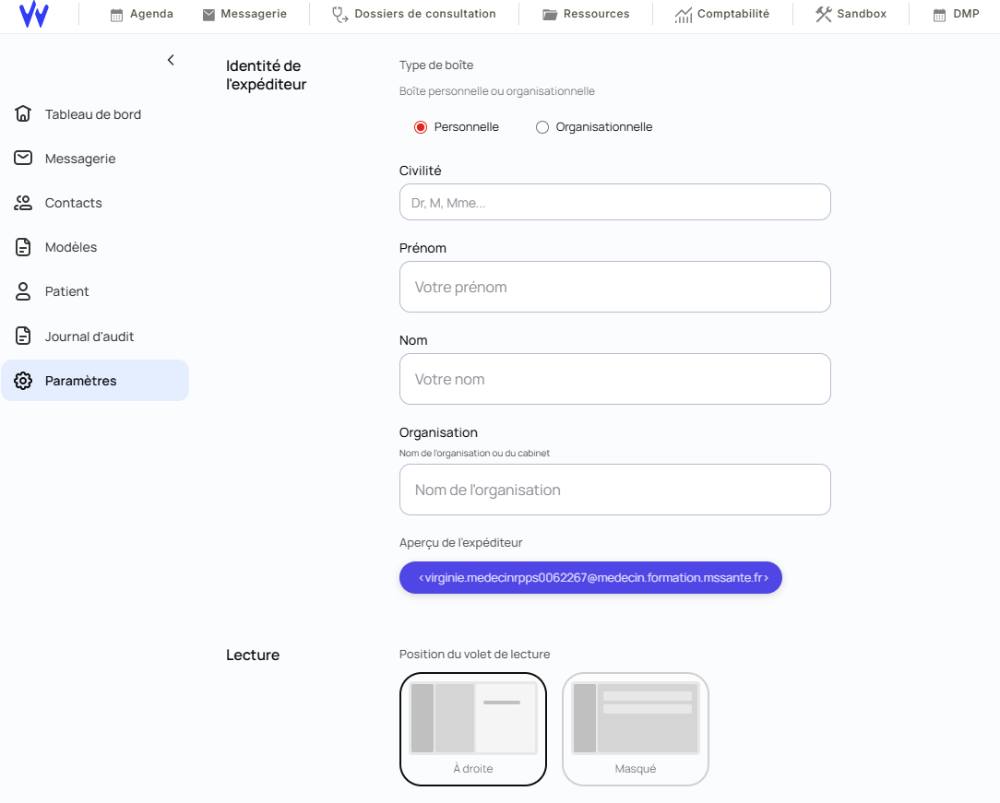
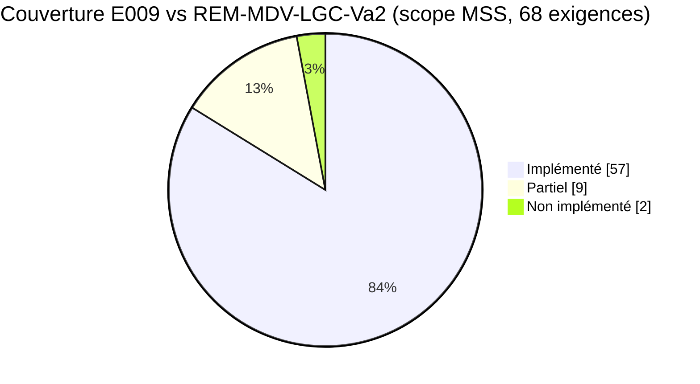
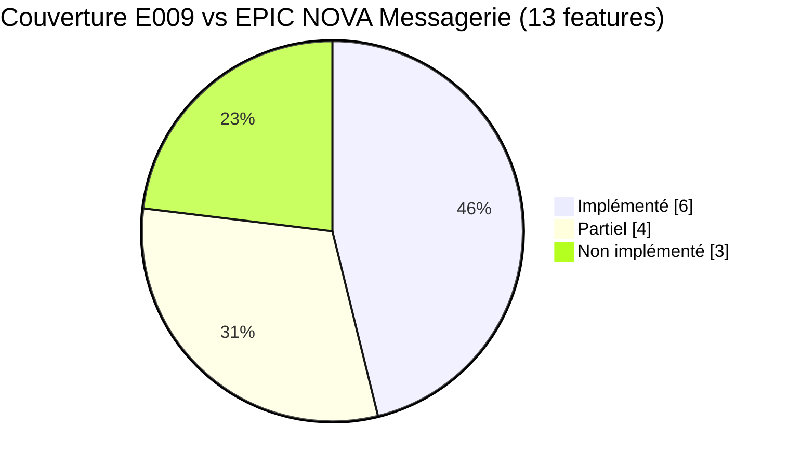

# E009 — Messagerie intelligente MSSante

> **Statut** : En cours
> **Modèle** : hand-crafted
> **Version** : 1.42
> **Auteur** : Pascal Cabanel
> **Dernière mise à jour** : 2026-07-28 (task-153 rattrapée)
> **Audience** : PO, médecin, direction produit, conformité.
> **Document frère (vue ingénierie / dette / audit)** : [`E009-Changelogs.md`](./E009-Changelogs.md)

---

<!-- toc:start — section générée par /tech-writer ; ne pas éditer manuellement -->

## Sommaire

- [Contexte du projet — opportunité d'internalisation Weda](#contexte-du-projet--opportunité-dinternalisation-weda)
- [1. Vision](#1-vision)
- [2. Objectifs métier](#2-objectifs-métier)
- [3. Acteurs concernés](#3-acteurs-concernés)
- [4. Fonctionnalités de la messagerie intelligente](#4-fonctionnalités-de-la-messagerie-intelligente)
- [5. Fonctionnalités détaillées](#5-fonctionnalités-détaillées)
  - [5.1 Vue d'ensemble](#51-vue-densemble)
  - [5.2 Description du workflow](#52-description-du-workflow)
  - [5.3 Paramètres utilisateurs](#53-paramètres-utilisateurs)
  - [5.4 Trace transverse](#54-trace-transverse)
- [6. Règles métier transverses (conformité Ségur V1/V2)](#6-règles-métier-transverses-conformité-ségur-v1v2) — *14 domaines REM (§ 6.1 → 6.14) + Ref#2 v1.0.1 (§ 6.15) + ENS Mon espace santé v1.3 (§ 6.16)*
- [7. Couverture d'implémentation vs REM-MDV-LGC-Va2 (scope MSS)](#7-couverture-dimplémentation-vs-rem-mdv-lgc-va2-scope-mss)
  - [7.1 Méthodologie](#71-méthodologie)
  - [7.2 Décompte par domaine](#72-décompte-par-domaine)
  - [7.3 Répartition globale](#73-répartition-globale)
  - [7.4 Lecture des écarts résiduels](#74-lecture-des-écarts-résiduels-96-)
- [8. Couverture d'implémentation vs EPIC NOVA Messagerie (Weda, 10/04/2026)](#8-couverture-dimplémentation-vs-epic-nova-messagerie-weda-10042026)
  - [8.1 Décompte feature par feature](#81-décompte-feature-par-feature)
  - [8.2 Répartition globale](#82-répartition-globale)
  - [8.3 Lecture par priorité](#83-lecture-par-priorité)
  - [8.4 Lecture des écarts](#84-lecture-des-écarts)
- [9. Reste à faire — estimation de charge pour internalisation](#9-reste-à-faire--estimation-de-charge-pour-internalisation)
  - [9.1 Reste à faire fonctionnel & réglementaire (déjà identifié)](#91-reste-à-faire-fonctionnel--réglementaire-déjà-identifié)
  - [9.2 Phases industrielles (mise en production)](#92-phases-industrielles-mise-en-production)
  - [9.3 Production-readiness complémentaire (ajouts recommandés)](#93-production-readiness-complémentaire-ajouts-recommandés)
  - [9.4 Synthèse de charge](#94-synthèse-de-charge)
- [10. Migration Weda Échange → NOVA Messagerie](#10-migration-weda-échange--nova-messagerie)
- [Annexes](#annexes)
  - [A. Sources documentaires](#a-sources-documentaires)
  - [B. Table de correspondance REM Ségur ↔ Ref#2](#b-table-de-correspondance-rem-ségur--ref2)
- [État de couverture](#état-de-couverture-2026-06-17)
- [Synthèse fonctionnelle des changelogs](#synthèse-fonctionnelle-des-changelogs)

<!-- toc:end -->

---

## Contexte du projet — opportunité d'internalisation Weda

Cette messagerie intelligente MSSanté a été conçue et développée **sur temps personnel** par **Pascal Cabanel**, sur une période d'**un an et demi** entamée fin 2024.

Le produit est aujourd'hui composé de trois briques techniques :

- un **backend** mutualisé portant l'interopérabilité MSSanté (IMAP / SMTP / STARTTLS / XOAUTH2), le traitement des documents CDA et IHE_XDM, le pipeline d'assistance IA (résumés, tags, chat contextuel, recherche sémantique), le journal d'audit Ségur et l'ensemble des règles métier décrites dans ce document ;
- un **frontend Blazor** complet, qui a servi de référence d'implémentation initiale et reste maintenu à parité fonctionnelle ;
- une **version Angular** issue de la conversion du frontend Blazor, **destinée à l'intégration native dans Nova** — c'est cette version qui fait l'objet de la présente documentation produit.

La proposition faite à Weda est l'**internalisation** du produit : code source, contrats partagés et expertise associée rejoindraient le périmètre Weda. La base de code Angular est délibérément alignée sur les standards techniques de Nova (Angular 21, composants standalone, signals, zoneless, NgRx Signal Store, design system maison) pour rendre l'intégration aussi directe que possible.

L'opportunité est double :

1. **Accélérer significativement la trajectoire d'innovation MSSanté** de l'éditeur en s'appuyant sur une base à un **stade de développement très avancé**, déjà conforme Ségur V1/V2 et couverte par une suite de tests substantielle ;
2. **Mutualiser l'effort de conformité réglementaire à venir** (envoi vers Mon Espace Santé, modèle de rôles RBAC, suivi d'acheminement complet, délégation entre praticiens) sur un socle technique déjà construit, plutôt que de partir d'une page blanche.

> **Statut du produit** — le logiciel est à un stade de développement très avancé mais **n'a pas encore été mis en production**. Il est proposé **en l'état**. Les éventuelles adaptations souhaitées par l'éditeur Weda — intégration au shell Nova, branding, exigences de gouvernance interne, finalisation des chantiers en construction (envoi MES, RBAC, suivi d'acheminement, délégation), durcissement opérationnel pour la mise en production — relèveront du chantier d'internalisation et seront conduites par les équipes Weda sur cette **base solide**.

> **Propriété intellectuelle** — le **code source** du logiciel et la **présente documentation** sont la **propriété intellectuelle exclusive de Pascal Cabanel**. L'internalisation décrite ci-dessous suppose un transfert formel encadré.
---

## 1. Vision

La **Messagerie intelligente** est un client de messagerie sécurisée destiné aux professionnels de santé, conforme aux exigences Ségur V1 et V2. Elle permet de **recevoir, classer automatiquement, prioriser, traiter et émettre** des documents médicaux via le réseau MSSante, avec une couche d'**intelligence artificielle** intégrée pour assister le praticien dans son quotidien (résumés, tags, recherche sémantique, chat conversationnel).

Le produit s'adresse en priorité au **médecin généraliste**, mais s'étend à la secrétaire médicale, au coordinateur de soins, et — à terme — au patient via Mon Espace Santé. La conformité Ségur est l'objectif de fond, l'IA est le différenciateur produit.

---

## 2. Objectifs métier

- [ ] **Conformité réglementaire** : atteindre 100% des exigences applicables au périmètre messagerie, issues de trois référentiels :
  - **REM Ségur V1/V2** (REM-MDV-LGC-Va2) — 72 exigences identifiées.
  - **Référentiel socle MSSanté #2 v1.0.1** (ANS, 18/01/2024) — 34 exigences `ECO.*` obligatoires pour les BAL personnelles/organisationnelles.
  - **ENS Mon espace santé — Messagerie v1.3** (Assurance Maladie, 28/06/2023) — 6 règles complémentaires pour le volet patient MES.

  Après dédoublonnage (mapping REM ↔ Ref#2), le périmètre total couvre **~85 règles distinctes**. État actuel : 61% conforme + 22% partiel = 83% au moins partiellement couvert. Cible : 100% conforme.

- [ ] **Réduction du temps de traitement** : automatiser le classement des documents reçus pour qu'un compte-rendu d'examen soit présenté pré-classé dans le dossier patient sans intervention manuelle.

- [ ] **Détection des urgences cliniques** : remonter en alerte temps réel 100% des résultats de biologie marqués `AA` / `HH` / `LL` (critique), conformément à BIO/va1.01.

- [ ] **Annuaire intégré performant** : permettre la recherche d'un correspondant par 5 axes simultanés (RPPS, nom, spécialité, localisation, établissement) en moins de 2 secondes (cible UX).

- [ ] **Mode hors-ligne fonctionnel** : permettre la composition, la lecture des messages déjà synchronisés et la mise en file d'attente d'envois pendant une déconnexion réseau, avec synchronisation transparente au retour de la connexion.

- [ ] **Auditabilité complète** : tracer 100% des actions fonctionnelles MSS (lecture, envoi, suppression, intégration, opposition) dans un journal d'audit interrogeable et exportable, conformément à SC.MSS/CONF.17-18.

---

## 3. Acteurs concernés

| Acteur | Rôle dans l'EPIC |
|--------|------------------|
| **Médecin généraliste (Dr. Sophie)** | Utilisateur principal. Reçoit, lit, traite, envoie des documents médicaux. Consulte son tableau de bord, traite les alertes biologie, rédige des messages contextuels au dossier patient, dialogue avec l'IA. |
| **Secrétaire médicale (Marie)** | Gère les contacts, classe les messages entrants pour le médecin, prépare l'envoi de courriers, consulte les boîtes organisationnelles. Couverture actuelle partielle. |
| **Coordinateur de soins (Thomas)** | Suit les threads inter-professionnels autour d'un patient, consulte l'historique des échanges, recherche dans les conversations. Couverture actuelle partielle. |
| **Patient (Mon Espace Santé)** | Destinataire des documents transmis par le médecin via MES. Peut s'opposer à l'envoi MSS pro/patient. Pas de fonction d'émission depuis le produit. |
| **Opérateur MSSante** | Fournit la BAL, applique les politiques de sécurité (TLS, certificats IGC Santé, taille PJ). Référencé via DNS SRV pour l'auto-configuration. |
| **Annuaire Santé (ANS)** | Source de vérité des correspondants (RPPS, MSSante). Interrogé via API FHIR. |
| **Pro Santé Connect (PSC)** | Fournisseur d'identité pour l'authentification du professionnel. Émet les jetons d'accès et de rafraîchissement. |
| **Annuaire DMP / MES** | Source d'INS qualifiées et d'adresses MSSante patient. Consommé par le service d'envoi MES (à implémenter). |

---

## 4. Fonctionnalités de la messagerie intelligente

La messagerie intelligente est conçue pour libérer du temps médical et fiabiliser la prise en charge des patients. Là où une messagerie ordinaire se contente de transmettre des courriels, elle agit comme une **assistante numérique** qui reçoit, classe et priorise les documents reçus, puis aide le praticien à les exploiter dans son dossier patient — sans rupture de flux, sans saisie redondante, et en respectant à chaque étape les exigences MSSanté et Ségur.

Concrètement, le médecin y trouve sept valeurs métier, déclinées dans les paragraphes suivants.

### Recevoir, classer et prioriser sans effort

À l'arrivée d'un compte-rendu, le praticien n'a rien à faire : la messagerie se connecte à sa boîte aux lettres MSSanté en arrière-plan, synchronise les nouveaux messages, identifie le patient concerné via son identité INS, extrait le type de document (biologie, imagerie, consultation, prescription, hospitalisation…), reconnaît l'auteur et la date de l'acte, puis **rattache automatiquement** le document au bon dossier patient. Une paire CDA + PDF apparaît sur une seule ligne, sans doublon technique. Quand un document est reçu en double, ou comme nouvelle version d'un précédent, la messagerie le détecte et appose un badge *« DOUBLON »* ou *« REMPLACÉ »* — le praticien tranche en un clic et navigue entre les versions sans perdre le fil.

Le tri n'est pas seulement chronologique. Les **résultats biologiques anormaux** sont mis en évidence, les **comptes-rendus critiques** (codes HL7 `AA`, `HH`, `LL`) remontent en alerte, et les messages **émis par un patient** via Mon Espace Santé sont visuellement distincts des messages confraternels — le médecin voit en priorité ce qui mérite son attention.

### Voir l'urgence à temps

Quand un résultat critique arrive, le médecin n'attend pas d'ouvrir sa boîte pour le découvrir : une **notification temps réel** (visuelle et sonore) s'affiche sur le poste, accompagnée du niveau d'urgence apparent. Le praticien règle ses préférences (son, notification bureau, seuil d'urgence minimum) pour ne pas être interrompu sur des messages de routine. La messagerie devient ainsi un capteur vigilant, pas un canal de bruit supplémentaire.

### Une vue patient consolidée de la messagerie

Depuis chaque message, le médecin peut basculer sur une **vue patient de la messagerie** : une consolidation, sous un angle clinique, des échanges et documents MSSanté reçus pour ce patient. Cette vue **ne se substitue pas au dossier patient du LGC** — elle réagence l'information déjà reçue par la messagerie pour faire émerger, à partir de cette seule source, la trajectoire de soin telle qu'elle s'écrit côté MSSanté. Trois modules complémentaires composent la vue :

- une **timeline chronologique** des documents MSSanté reçus pour ce patient, avec filtres par catégorie clinique (biologie, imagerie, consultation, prescription, hospitalisation…) ;
- une **timeline biologique horizontale** qui croise les biomarqueurs et les dates d'examen, avec mini-courbes, indicateurs de tendance et intervalles de référence — onze catégories biologiques regroupées (hématologie, biochimie, ionogramme, enzymologie, hépatique, lipidique, thyroïde, immunologie, sérologie, microbiologie, urinaire) ;
- une **synthèse clinique** compatible *International Patient Summary*, alimentée par les métadonnées des documents CDA reçus (problèmes actifs, antécédents médicaux et chirurgicaux, allergies, biologie anormale récente, mode de vie, antécédents familiaux), dédoublonnée par code LOINC.

Sur la page d'accueil, un **widget Patient** affiche les cinq derniers patients ayant un message non lu, avec un menu contextuel pour ouvrir leur vue patient messagerie, filtrer la boîte sur ce patient, ou lire directement le message — l'idée étant de débuter la journée en sachant exactement qui appeler.

Cette vue patient se veut **un éclairage complémentaire** au dossier officiel tenu par le LGC : elle répond à la question *« qu'est-ce que la messagerie sait de ce patient aujourd'hui ? »* — utile pour préparer une consultation, suivre un envoi de résultats, détecter un retard de prise en charge — sans prétendre porter l'ensemble des données structurées dont le LGC reste la source de vérité.

### Acquitter et tracer la prise en charge biologique

Sur chaque compte-rendu biologique anormal, un **workflow médico-légal d'acquittement** réservé au rôle Médecin permet au praticien de signaler qu'il a pris connaissance du résultat, puis d'enregistrer son action de prise en charge — *Pris connaissance*, *Rappel patient*, *Convocation*, *Adressage confrère*, ou *Marquer comme résolu* — avec une note clinique facultative à chaque étape. La clôture est explicite, l'historique est inaltérable. Le dashboard porte une **tuile de suivi** des comptes-rendus en attente d'acquittement, ventilée par dernière action posée — le médecin sait toujours où en est sa file de prise en charge.

Le détail du parcours est décrit en §5.2, sous-chapitre *Acquittement biologique anormal — workflow médico-légal*.

### Écrire vite, écrire bien, écrire conforme

Côté émission, la messagerie épargne au praticien toute friction technique. Il **recherche un correspondant** dans l'Annuaire Santé selon cinq axes (RPPS, nom, spécialité, localisation, recherche combinée), et retient les confrères dans un **carnet d'adresses** organisé en favoris, groupes et étiquettes qui se construit automatiquement au fil des échanges.

Pour rédiger, il dispose d'une **signature** par défaut paramétrable et de **modèles** classés par catégorie (lettres de liaison, demandes d'examen, accusés…). L'assistance IA peut **générer** un modèle complet à partir d'une description en langage naturel, **corriger** l'orthographe et la grammaire en temps réel, **améliorer** un passage selon une intention donnée (raccourcir, formaliser, adapter au patient), ou **détecter** les placeholders à compléter.

Avant l'envoi, la messagerie veille à la conformité réglementaire : libellé expéditeur normalisé selon le format Ségur officiel, en-têtes MSSanté `X-MSS-*` émis automatiquement, taille des pièces jointes contrôlée selon les limites de l'opérateur. Si le médecin envoie à un patient via Mon Espace Santé, il peut signifier la fin de l'échange via une case dédiée *« Bloquer la réponse du patient »*. Et si un document envoyé doit être corrigé après coup, la fonction **« Annule et remplace »** republie une version corrigée tout en marquant explicitement le message d'origine comme annulé — sans rupture de traçabilité.

### Une assistance IA qui éclaire sans décider

L'assistance IA est intégrée à la messagerie, mais elle reste **un outil au service du jugement médical**. Elle propose des **résumés automatiques** sur chaque message reçu, suggère des **tags d'urgence et de catégorie**, et offre une **synthèse à la demande** depuis la vue détail d'un message — carte structurée patient + praticien + résumé clinique. Sur des comptes-rendus longs ou denses, le praticien priorise sa pile en quelques secondes au lieu de plusieurs minutes.

Plus avancé encore, un **chat IA contextuel multi-emails** permet au médecin de sélectionner plusieurs messages, d'ouvrir une conversation avec l'IA et de lui poser des questions ouvertes — l'IA répond en **citant systématiquement les emails sources** et refuse toute fabrication. Cinq actions métier sont accessibles directement depuis le chat : composer un email, répondre à un email, appeler le patient, envoyer un SMS, contacter un confrère.

Une **recherche sémantique** retrouve un email dans toute la boîte à partir d'une question en langage naturel, et une **recherche structurée à facettes** filtre la liste par statut, catégorie médicale, plage temporelle et critères avancés (expéditeur, destinataire, sujet, type de document — quatorze types disponibles).

L'assistance IA est **désactivable par paramètre d'établissement** et peut tourner en mode *on-premise* (modèles locaux, aucune donnée ne sort de l'établissement) ou *cloud*, au choix de la structure.

### Confidentialité et conformité réglementaire

À chaque étape, la messagerie respecte les exigences applicables à un client MSSanté professionnel : connexion TLS 1.2 minimum, authentification Pro Santé Connect, certificats IGC Santé en validation continue (CRL et OCSP), formats CDA R2 et IHE_XDM conformes au CI-SIS. Les identifiants techniques des ressources sont opaques pour empêcher toute énumération, l'authentification est cryptographiquement validée à chaque requête, et chaque donnée n'est accessible qu'à son propriétaire — un confrère ne voit pas les contacts, les modèles, les notes cliniques ou l'audit d'un autre praticien.

Toute action fonctionnelle du praticien est consignée dans le **journal d'audit MSS** (lecture, envoi, suppression, rattachement patient, opposition, déconnexion, impression / export d'email, acquittement biologique, suppression CDA, annule et remplace) avec horodatage, identifiant du praticien, INS du patient, code LOINC du document, durée et adresse IP. Le journal est exportable au format CSV pour les contrôles internes et les audits de conformité.

### Périmètre en construction

Certaines fonctionnalités sont en cours de finalisation et seront livrées prochainement :

- **l'envoi vers Mon Espace Santé** (sélection patient depuis la base, vérification de l'identité INS qualifiée, génération du paquet IHE_XDM, gestion des erreurs de distribution renvoyées par MES, adressage des usagers mineurs) ;
- un **modèle de rôles explicite** (médecin, secrétaire, coordinateur de soins) pour gérer les boîtes organisationnelles partagées ;
- le **suivi d'acheminement complet** d'un message (envoyé → accepté par l'opérateur → délivré → lu → répondu), au-delà des seuls accusés MDN aujourd'hui disponibles ;
- un **workflow de délégation** d'un message à un autre praticien, avec notification cible, journal de transmission et accusé de prise en charge.

L'état d'avancement précis de chaque brique fonctionnelle est consigné en fin de document, dans la section **État de couverture**.

---

## 5. Fonctionnalités détaillées

### 5.1 Vue d'ensemble

  

### 5.2 Description du workflow

#### Prérequis — Configuration initiale MSSanté

Avant le premier accès à la messagerie, le compte du professionnel doit être associé à une adresse MSSanté. Tant que cette association n'est pas réalisée, un écran **« Messagerie non configurée »** bloque l'entrée du module et propose un parcours guidé. Le médecin saisit son adresse MSSanté et son numéro RPPS dans le formulaire de configuration ; le système valide la connexion à la BAL via une sonde IMAP sécurisée vérifiant la chaîne TLS IGC-Santé. Une fois l'association persistée, un écran invite le médecin à se déconnecter puis se reconnecter pour activer son compte (task-037, durci par task-038).

#### Flux RÉCEPTION

  

#### Tableau de bord MSSanté — point d'entrée et vue d'ensemble

À l'ouverture du module, le médecin atterrit sur un **tableau de bord** organisé en trois colonnes — *Messagerie* à gauche, *Résumé des mails non lus du jour* au centre, *Patients et alertes cliniques* à droite — qui rassemble en une page l'essentiel à voir avant de plonger dans la boîte de réception. Le dashboard est **dynamique** : les compteurs, listes et tuiles **reflètent l'état courant** de la BAL. Quand le médecin marque un message comme lu, traite un acquittement biologique ou qu'un nouveau message arrive, les widgets concernés se rafraîchissent sans rechargement de page. Sept widgets cohabitent.

  
   
  Dashboard avec résumé IA, indicateurs, alertes de biologies

   **(a) Vignette *Messagerie***
   Trois cartes compteurs côte à côte donnent le pouls de la boîte INBOX : *Aujourd'hui* (messages reçus dans la journée), *Non lus* (total non lus toutes périodes), *Total* (volume global). Sous les compteurs, un nuage de tags listant uniquement les tags ayant au moins un message non lu, triés par volume décroissant ; un clic sur un tag ouvre la liste filtrée sur ce tag.

   **(b) Vignette *État de connexion***
   Indicateur de session : la connexion réseau (en ligne / hors ligne), le nombre de **messages en attente d'envoi** (file d'attente hors ligne), et l'état de la **session Pro Santé Connect** avec un décompte du temps restant avant expiration (format `Hh MMm` ou `MMm SSs`). Le statut PSC est rafraîchi chaque seconde et l'état hors ligne est revérifié toutes les dix secondes — le médecin sait sans ambiguïté s'il est connecté, et combien de temps il lui reste avant la prochaine reconnexion PSC.

   **(c) Vignette *Synchronisation***
   Cercle de progression matérialisant l'avancement de la synchronisation IMAP en cours. Trois états visuels : *en attente* (compte à rebours de 30 secondes avant démarrage automatique au chargement du module), *synchronisation en cours* (anneau qui se remplit, pourcentage au centre), *au repos* (avec mention de la **dernière synchronisation** en temps relatif : « À l'instant », « Il y a 5 min », « Il y a 2 h »…). Le médecin peut **démarrer ou arrêter manuellement** la synchronisation. À la fin de chaque cycle, les actions hors ligne en attente sont automatiquement rejouées.

   **(d) Résumé des mails non lus du jour**
   Colonne centrale dédiée à la lecture rapide : jusqu'à **dix messages** non lus du jour (complétés par les plus récents non lus si la journée en compte moins), chacun présenté sous forme de **carte synthèse IA** — identité du patient (nom + âge), praticien émetteur (nom + spécialité), expéditeur, date, et résumé clinique en langage médical du contenu. Le médecin peut **retirer un message de la liste** d'un geste après l'avoir parcouru, pour focaliser la vue sur ce qui reste à traiter. Cette colonne offre une revue de matin condensée : en 30 secondes de scroll, le médecin sait quels comptes-rendus exigent une action immédiate.

   **(e) Tuile *Bio en attente d'acquittement***
   Présentée en tête de la colonne de droite (cf. §5.2 sous-chapitre *Acquittement biologique anormal*) — compteur total des comptes-rendus biologiques anormaux non encore résolus, ventilation par dernière action posée, deep-link vers la BAL pré-filtrée. La tuile disparaît automatiquement quand la file est vide.

   **(f) Vignette *Résultats anormaux***
   Liste verticale des **patients ayant au moins un résultat biologique anormal non lu**. Chaque patient apparaît avec ses initiales, son nom complet, un indicateur visuel de criticité (codes HL7 colorisés), un horodatage relatif depuis le dernier résultat, et la liste des valeurs biologiques concernées (biomarqueurs hors normes mis en évidence). Le médecin distingue d'un coup d'œil les patients critiques des patients à surveiller.

   **(g) Widget *Patients avec mails non lus*** (task-035)
   Cinq patients par défaut (extensible à vingt via *Voir plus*) ayant au moins un mail non lu, classés par date du mail non lu le plus récent. Chaque ligne agrège l'identité, le compteur de mails non lus, les chips catégories CDA présentes, un badge de sévérité biologique, une pastille d'intégration, et un menu contextuel à trois actions : *Voir le dossier patient*, *Filtrer mails sur ce patient*, *Voir l'email* (qui ouvre un aperçu inline du dernier mail non lu en mode lecture seule, et marque le mail comme lu avec trace audit). Ce widget se rafraîchit en temps réel à chaque enrichissement de mail entrant : le patient nouvellement concerné apparaît immédiatement en tête de liste, sans rechargement.

Le caractère **dynamique** du dashboard est central pour l'usage clinique : le médecin n'a pas besoin de fermer puis rouvrir le module pour voir ses compteurs à jour. Une lecture, un acquittement, une réception : le widget concerné se met à jour, le compteur correspondant décroît ou s'incrémente, le patient disparaît de la liste si tous ses messages ont été lus. Le tableau de bord se comporte ainsi comme une **vue vivante** de l'activité MSSanté du jour, à laquelle le médecin revient autant de fois qu'il le souhaite au cours de sa consultation.

1. **E009-F001 — Boîte de réception et gestion IMAP** : à l'ouverture de la messagerie, l'authentification Pro Santé Connect déverrouille la BAL MSSante du professionnel et la synchronisation s'amorce en arrière-plan. Le praticien consulte son arborescence de dossiers (INBOX, Envoyés, Brouillons, Corbeille, dossiers personnalisés), lit ses messages, marque lu/non lu, signale les messages importants, supprime, envoie un accusé de lecture. La **sélection multiple** active les **opérations en masse** (déplacer, supprimer, marquer lu/non lu, signaler) en un seul geste. En mode hors ligne, les actions du professionnel sont mises en file d'attente et synchronisées automatiquement au retour de la connexion — aucune intervention manuelle requise.

   Depuis la vue détail d'un message, le médecin peut **imprimer** le mail en PDF (en-têtes, corps, liste des pièces jointes, pied de page traçabilité « Imprimé par Dr X le {date} ») ou **télécharger** son contenu source au format EML pour archivage local. L'impression et chacun des deux exports (PDF, EML) sont enregistrés séparément dans le journal d'audit (task-017).

   Un **Mode conversation**, activable depuis les paramètres MSS du praticien, regroupe la liste autour des feuilles de fil : chaque ligne agrégeante affiche un compteur « N messages » et un bouton chevron qui déploie en place les réponses indentées sous le message d'origine. Le médecin retrouve ainsi tout l'historique d'un échange sans quitter la vue liste (task-027).

  
   
  Réception des messages avec affichage des documents CDA

   Un bouton dédié de la toolbar de la vue détail (icône bulle de discussion) bascule l'affichage entre le corps brut du message et une **synthèse IA** générée automatiquement à la demande. La synthèse se présente sous forme d'une carte structurée en tête de message rappelant l'identité du patient (nom + âge), le praticien émetteur (nom + spécialité), l'expéditeur et la date d'envoi, suivis d'un **résumé en langage médical** du contenu du message et des documents médicaux joints. Pendant la génération, un indicateur *« Génération de la synthèse en cours… »* informe le praticien. Un nouveau clic sur le bouton replie la synthèse et restaure le corps brut. Cette aide à la lecture rapide est précieuse face aux comptes-rendus longs ou denses, et permet au médecin de prioriser sa pile de messages d'un coup d'œil.

  
   
  Réception des messages avec affichage des documents CDA

2. **E009-F002 — Classement automatique** : à chaque message reçu portant une archive IHE_XDM, la messagerie analyse le document CDA (R2 N1 ou N3), extrait l'INS du patient, les traits d'identité, l'auteur, la date d'acte, le code LOINC et la catégorie clinique. Le document est rattaché automatiquement au dossier patient correspondant. Une paire CDA + PDF/A-1 est présentée en **une seule ligne** dans la liste — le praticien ne voit pas le doublon technique (task-010).

   Un **indicateur d'intégration** placé directement sur la ligne d'inbox renseigne le médecin d'un coup d'œil : pastille verte ✓ « tous intégrés » si chaque document médical du message est rattaché à un patient, ou pastille orange ⏳ avec compteur « N en attente » si un ou plusieurs documents nécessitent encore une action. Le même indicateur est rappelé par document dans la vue détail (task-011).

   Quand l'INS portée par le CDA n'est pas qualifiée (matricule incomplet, absence d'OID, traits d'identité partiels), une **bannière amber** s'affiche en tête de la vue détail du message et propose un **rattachement manuel par comparaison visuelle**. Le médecin ouvre une dialog qui liste les patients de la base correspondant aux traits du CDA, classés par score de similarité (nom 40 %, prénom 30 %, date de naissance 20 %, sexe 10 %). Le praticien sélectionne le patient existant à rattacher en un clic ; la bannière disparaît immédiatement (task-012).

   Lorsqu'un nouveau document est reconnu comme **doublon** d'un document déjà reçu, ou comme **nouvelle version** d'un document existant, un badge « DOUBLON » ou « REMPLACÉ » est posé conformément à SC.CDA/INT.18 ; le praticien confirme ou rejette la détection, et navigue entre versions (algorithme normatif task-034 ; bannière de demande de suppression task-015a + task-015b ; lien cliquable « Version précédente » task-015c, robustesse de la navigation task-036).

  
   
  Classement automatique, tags

3. **Recherche avancée à facettes** : pour retrouver rapidement un message dans une boîte volumineuse, la barre de recherche en tête de la liste ouvre au focus une **dropdown enrichie** combinant une saisie en langage naturel et des filtres à facettes cumulables. Le médecin peut formuler une question libre (recherche sémantique sur le corps des messages et les documents joints) tout en filtrant la liste selon plusieurs axes simultanés :

   - **3 chips de statut** — *Non lus*, *Importants*, *Pièces jointes* — activables indépendamment ;
   - **2 chips de portée médicale** — *Tous les documents médicaux*, *Biologie* — pour cibler la nature du contenu reçu ;
   - **6 chips de type de document** — *Consultation*, *Imagerie*, *Ordonnances*, *Hospitalisation*, *Synthèse*, *Vaccination* — mutuellement exclusifs, élagage volontaire des 14 types disponibles vers les 6 plus fréquents en pratique de ville ;
   - **4 chips de plage temporelle** — *Aujourd'hui*, *7 derniers jours*, *30 derniers jours*, *3 derniers mois* — mutuellement exclusifs ;
   - **un panel de recherche avancée** repliable qui ajoute les champs *De*, *À ou Cc*, *Objet*, et un sélecteur du **type de document complet** (les 6 chips ci-dessus + Chirurgie, Urgences, Anatomopathologie, Génétique, Pharmacie, Procédure, Histoire physique, Biologie — soit 14 types au total).

   Toutes les facettes se **cumulent strictement en ET** : un message n'apparaît dans les résultats que s'il satisfait l'intégralité des critères posés (sémantique fiable pour le clinicien — pas d'effet *OU* surprise). Chaque clic sur une chip déclenche la recherche immédiatement, sans appui sur *Entrée* ; la saisie texte se valide par *Entrée*. Un **badge à côté du champ de saisie** indique en permanence le nombre de filtres actifs lorsque la dropdown est repliée. Un clic en dehors de la dropdown ou la touche *Échap* la referme ; un bouton **Tout effacer** réinitialise les filtres et restaure la liste complète. La recherche tient compte du dossier courant : les résultats restent limités à la boîte ou au sous-dossier sélectionné dans l'arborescence (task-029).

  
   
  Recherche sémentique et textuelle, filtres médicaux

4. **E009-F003 — Priorisation** : l'assistance IA propose des tags d'urgence sur les messages reçus. Pour les comptes-rendus de biologie, le système identifie automatiquement les résultats critiques (codes HL7 `AA`, `HH`, `LL`, *CriticalLow*, *CriticalHigh*). Les messages émis par un patient via Mon Espace Santé sont visuellement distincts des messages professionnels, et le nom + INS de l'usager sont extraits du libellé pour rester lisibles dans la liste (task-005). Sur chaque compte-rendu portant au moins une valeur anormale, un workflow médico-légal d'acquittement à 5 actions est proposé au médecin avec traçabilité audit — décrit en détail dans le sous-chapitre **Acquittement biologique anormal — workflow médico-légal** ci-dessous, à la suite du Flux RÉCEPTION (task-028).

  
   
  Alerte détectée par IA + résumé IA

5. **Sélection multiple et opérations en masse** : un bouton dédié de la barre d'en-tête de la liste (icône case à cocher) bascule la boîte en **mode sélection**. Une coche apparaît alors sur chaque ligne, et une barre d'actions contextuelles s'affiche sous les filtres. Le médecin coche les messages à traiter (un par un, ou *Tout* pour cocher l'ensemble des messages visibles), puis applique une action collective :

   - **Lu** — marque l'ensemble des messages sélectionnés comme lus (les messages déjà lus sont ignorés silencieusement).
   - **Non lu** — bascule en non lu (idem inverse).
   - **Favori** — appose l'étoile « important » sur les sélectionnés (utile pour préparer une revue ultérieure).
   - **Déplacer** — ouvre une dropdown listant les dossiers IMAP disponibles ; un clic sur la cible déplace les messages en lot. Le dossier courant et les dossiers de stockage local sont exclus de la liste.
   - **Supprimer** — envoie les messages sélectionnés à la corbeille.
   - **IA** — ouvre le chat IA contextuel sur la sélection (équivalent à *« j'ouvre une conversation avec l'IA à propos de ces N emails »*).

   À chaque action, la sélection est vidée et la boîte ressort du mode sélection. Un nouveau clic sur le bouton de bascule (ou la touche *Échap* implicite via la fermeture de la barre) sort du mode sélection sans appliquer d'action. En mode hors ligne, les bascules lu/non lu, favori, déplacement et suppression sont mises en file d'attente et rejouées au retour de la connexion.

   

  
   
  Sélection multiple et opérations en masse

6. **E009-F004 — Vue patient de la messagerie (Timeline + Biologie + Synthèse clinique)** : au-delà du simple widget « nouveaux documents », le professionnel dispose d'une **vue patient consolidée de la messagerie**, articulée en trois modules complémentaires, livrés à parité sur les deux frontends. Cette vue **ne se substitue pas au dossier patient du LGC** ; elle réagence les documents MSSanté reçus pour faire émerger, sous un angle clinique, ce que la messagerie sait du patient à un instant donné.

   **(a) Vue temporelle patient** (*Patient Timeline*) — timeline chronologique des documents MSS reçus pour le patient. Onglets : *Synthèse Clinique*, *Documents*, *Synthèse Biologie*. Filtres par catégorie (Biologie, Imagerie, Consultation, etc.). Séparateurs temporels (Aujourd'hui, Cette semaine, Semaine dernière, Ce mois…). Groupement par date et pagination. La parité fonctionnelle entre les deux frontends a été établie en task-016.

  
   
  Timeline patient

   **(b) Timeline biologie horizontale** (*Biology Timeline*) — grille **biomarqueurs × dates d'examen**, avec :
   - Mini-courbes (sparklines) par biomarqueur avec bandes d'intervalle de référence superposées.
   - Indicateurs de tendance (*stable*, *en hausse*, *en baisse*) calculés sur la période sélectionnée.
   - Mise en évidence des résultats anormaux par sévérité (codes HL7 `AA`, `HH`, `LL` colorisés).
   - Filtre période : 3 / 6 / 12 mois / tout historique.
   - **11 catégories biologiques** regroupées.

  
   
  Timeline biologie du patient

   **(c) Synthèse clinique** (*Clinical Synthesis*) — synthèse clinique compatible IPS (International Patient Summary) :
   - Section principale : Problèmes actifs, ATCD médicaux, ATCD chirurgicaux, Allergies, Biologie anormale récente.
   - Barre latérale : Facteurs de style de vie, ATCD familiaux, Derniers résultats anormaux.
   - Dédoublonnage par code LOINC / libellé.

  
   
  Problèmes actifs, Allergies, Traitements, Antécédents médicaux, Antécédents chirurgicaux, Antécédents familiaux, Mode de vie

   **(d) Widget Patient sur le dashboard** (task-035) : le médecin voit en page d'accueil les 5 derniers patients ayant au moins un mail non lu, classés par date du mail non lu le plus récent (extensible à 20 via *Voir plus*). Chaque ligne agrège l'identité du patient, le compteur de mails non lus, les catégories CDA présentes (Biologie, Imagerie, Consultation…), un badge de sévérité biologique (🔴 critique, 🟠 anormal), une pastille d'intégration (✓ tous intégrés / ⏳ en attente) et un menu contextuel à 3 actions : *Voir le dossier patient*, *Filtrer mails sur ce patient*, *Voir l'email*. Le widget se rafraîchit en temps réel à l'arrivée d'un nouveau mail enrichi.

7. **E009-F005 — Alertes temps réel** : à chaque nouveau message reçu, le professionnel est averti en temps réel par notification visuelle et sonore, avec le niveau d'urgence apparent (critique, important, normal). L'alerte s'affiche quelle que soit la fenêtre active. Le médecin règle ses préférences depuis les paramètres utilisateur (son, notification bureau, niveau d'urgence minimum déclenchant l'alerte).

#### Acquittement biologique anormal — workflow médico-légal

Quand un compte-rendu de biologie transmis par MSSanté contient au moins une valeur anormale (codes HL7 `L`, `H`, `A`, `LL`, `HH`, `AA`), la messagerie ouvre un workflow d'**acquittement médico-légal** dédié. Le médecin signale explicitement, en plusieurs étapes si nécessaire, qu'il a pris connaissance du résultat et qu'il a engagé une prise en charge auprès du patient (rappel téléphonique, convocation au cabinet, adressage à un confrère) avant de clore définitivement le dossier. Chaque action est tracée de manière non modifiable dans le journal d'audit (modèle *append-only*) avec l'identité du praticien, l'horodatage et une note clinique facultative ; ni l'effacement ni la modification rétroactive ne sont possibles — le médecin peut uniquement **ajouter** une nouvelle action qui devient la dernière de la chaîne. La fonctionnalité est **réservée au rôle Médecin** : les secrétaires et coordinateurs voient la valeur anormale mais n'accèdent ni au compteur du dashboard ni au panel d'acquittement (task-028).

Trois points d'entrée mènent au workflow :

   **(a) Tuile KPI sur le dashboard MSS** — *« Bio en attente d'acquittement »* apparaît dès qu'au moins un compte-rendu reste non résolu. Couleur rouge si un résultat critique est en attente, orange sinon. La tuile affiche un compteur total accompagné d'une ventilation par dernière action posée : *Pris connaissance — N*, *Rappel patient — N*, *Convocation — N*, *Adressage confrère — N*, *Sans acquittement — N*. Chaque ligne est cliquable et ouvre la BAL pré-filtrée sur les mails correspondants, prêts à être traités.

  

   **(b) Badge sur la ligne d'inbox** — chaque message portant au moins un compte-rendu anormal non résolu affiche un badge compteur. Rouge si critique, orange sinon. Le survol précise *« Bio critique en attente d'acquittement »* ou *« Bio anormale en attente d'acquittement »*.

   **(c) Panel d'acquittement dans la vue détail** — visible sous le mail à l'ouverture d'un compte-rendu portant au moins une valeur anormale. Il se compose :
   - d'un **en-tête contextualisé** avec titre *« Acquittement biologique critique »* (encadrement rouge) ou *« Acquittement biologique »* (encadrement orange) selon la sévérité, suivi d'une **pastille de statut** — 🔴 *À TRAITER* (aucune action posée), 🟡 *EN COURS* (au moins une action intermédiaire), 🟢 *RÉSOLU* (clôture explicite) ;
   - d'une **frise de la dernière action** rappelant l'action prise, le praticien qui l'a posée, la date et l'heure, et la note clinique éventuelle ;
   - de **cinq actions** disposées en deux groupes : quatre boutons chips intermédiaires — *Pris connaissance*, *Rappel patient*, *Convocation*, *Adressage confrère* — et une action de clôture distincte à droite avec icône, *Marquer comme résolu*.

  

Chaque clic sur une action ouvre une **dialog de confirmation** qui rappelle le code LOINC du document, la liste des valeurs critiques le cas échéant, l'action choisie, et propose un champ de **note clinique facultative** (500 caractères maximum). Sur les comptes-rendus critiques (codes HL7 `LL` / `HH` / `AA`), la dialog adopte un visuel renforcé pour rappeler la responsabilité médico-légale du praticien. Après confirmation, l'action est figée et le panel se met à jour immédiatement : la nouvelle action devient la dernière de la frise, la pastille de statut bascule, et le compteur du dashboard est actualisé. Une fois la prise en charge effective, le médecin clôt le dossier via *Marquer comme résolu* ; le panel se replie alors en **bandeau discret** *« Acquittement résolu — par Dr X · {date} »* pour ne plus encombrer la vue tout en conservant la trace visible.

  

Sécurité et confidentialité : les acquittements posés par un médecin **ne sont visibles que par ce médecin** (cf. §10, couche 3 ownership scoping). Un associé ou un remplaçant ne voit ni la tuile KPI, ni les notes cliniques, ni l'historique des actions d'un confrère ; pour coordonner une prise en charge, le médecin utilise l'action *Adressage confrère* avec une note explicite, ou envoie un message MSSanté. L'identité du praticien est tracée à chaque acquittement (issue du jeton Pro Santé Connect), et le mode append-only garantit l'inaltérabilité du registre.

  

Sur le terrain réglementaire, la fonctionnalité matérialise les exigences **RG-E009-051 (BIO/va1.01)** *— alerte spécifique si code interprétation `AA` / `HH` / `LL` (critique)* — et **RG-E009-052 (BIO/va1.05)** *— élément clinique pertinent visible dans la liste messages*. Le journal d'audit MSS est étendu de 5 nouvelles entrées tracées (*BiologyAcknowledged*, *BiologyPatientCalled*, *BiologyPatientSummoned*, *BiologyReferredToColleague*, *BiologyMarkedResolved*) qui s'ajoutent au périmètre déjà couvert par RG-E009-045/046/047 — voir §5.3 *Trace transverse*.

#### Flux ÉMISSION

  

8. **E009-F008 — Annuaire Santé** : avant un envoi, le praticien recherche un correspondant dans l'Annuaire Santé de l'ANS selon 5 axes (RPPS, nom, spécialité, localisation, recherche combinée). Le résultat est restitué en moins de 2 secondes en utilisation nominale, grâce à une couche de cache qui amortit la charge sur l'annuaire distant.

9. **E009-F009 — Carnet d'adresses** : un correspondant retenu dans l'annuaire est sauvegardé dans le carnet personnel (favori, groupe, tag). À la première interaction avec un confrère (envoi, réception), le contact est créé automatiquement — le praticien retrouve l'historique de ses échanges sans saisie manuelle.

  
   
  Carnet d'adresses / Annuaire

10. **E009-F006 — Composition et envoi** : le brouillon en cours est sauvegardé automatiquement à chaque saisie. L'éditeur permet d'insérer en un clic une **signature** (F014) ou un **modèle** (F015). Le libellé expéditeur est normalisé au format réglementaire `<Titre>_<Prénom>_<NOM>_<Entité>` pour les BAL personnelles, et au libellé fonctionnel pour les BAL organisationnelles (task-009). Les en-têtes MSSanté `X-MSS-INS`, `X-MSS-CODECDA`, `X-MSS-NIL` sont émis automatiquement à l'envoi selon le Référentiel socle MSSanté #2 (task-001). Avant l'envoi, la taille des pièces jointes est contrôlée (défaut 10 Mo, configurable selon l'opérateur — task-008) ; en cas de dépassement, le praticien voit un message explicite et peut retirer une pièce jointe. Quand un destinataire patient est présent, une case **« Bloquer la réponse du patient »** apparaît pour signifier la fin de l'échange — l'en-tête `X-MSS-MES: FIN` est alors émis conformément à ECO.2.2.8 (task-026). Enfin, le médecin peut **republier une version corrigée** d'un document déjà envoyé via « Annule et remplace » (task-006) : le message original apparaît marqué « annulé » dans les envoyés, le destinataire reçoit la nouvelle version avec mention explicite.

  
   
  Nouveau mail, Brouillon automatique, modèle contextuel au patient

10a. **E009-F014 — Signature email** : le praticien crée, modifie, supprime ses signatures enrichies (HTML) depuis l'écran *Mes signatures*. Une signature est désignée *par défaut* et insérée automatiquement à chaque nouvelle composition ; le praticien peut basculer sur une autre signature en un clic. L'éditeur enrichi est disponible à parité sur les deux frontends.

10b. **E009-F015 — Modèles d'email assistés par IA** : le praticien gère ses modèles d'email par catégorie (lettres de liaison, demandes d'examen, accusés). L'**assistance IA** propose 4 actions :
   - **Générer un modèle** à partir d'une description en langage naturel.
   - **Corriger un texte** : correction orthographique et grammaticale en streaming.
   - **Améliorer un texte** avec paramètre d'action (raccourcir, formaliser, adapter au patient).
   - **Détecter les placeholders** automatiquement.

  
   

11. **E009-F007 — Envoi Mon Espace Santé** *(à implémenter)* : sélection du patient depuis la base, vérification de l'identité INS qualifiée, génération du paquet IHE_XDM, émission des en-têtes MSSanté spécifiques (`X-MSS-INS`, `X-MSS-CODECDA`, `X-MSS-MES = "FIN"`), respect de l'opposition patient à l'envoi MES pro et patient (task-003). La validation de la connexion à la BAL MSSanté du professionnel (chaîne TLS IGC-Santé) est assurée en amont par le parcours de configuration initiale décrit en tête de §5.2.

12. **E009-F011 — Suivi d'acheminement** : aujourd'hui, le praticien voit les accusés de lecture (MDN) reçus pour ses envois. Le suivi complet (envoyé → accepté par l'opérateur → délivré → lu → répondu) reste à construire au-dessus.

#### Fonctions avancées

13. **E009-F010 — Rôles et permissions** *(à implémenter)*.

14. **E009-F012 — Délégation** *(à implémenter)*.

15. **E009-F013 — Assistance IA, avec chat multi-emails contextuel** : l'assistance IA est activable ou désactivable par l'établissement. Deux modes d'installation sont disponibles : **on-premise** (les modèles tournent dans l'établissement, aucune donnée ne sort) ou **cloud** (modèles distants).

    **Résumés et tags automatiques** : un résumé est généré pour chaque document médical reçu ; les tags d'urgence et de catégorie sont proposés au praticien.

    **Chat IA avec contexte multi-emails** — le médecin sélectionne plusieurs emails dans sa boîte, ouvre une conversation, reçoit un résumé consolidé, puis dialogue avec l'IA en posant des questions ouvertes. L'IA répond en **citant systématiquement les emails sources** et refuse toute fabrication ; le médecin peut vérifier chaque affirmation en un clic.

    **Plugin d'actions métier** — 5 actions exécutables par l'IA depuis le chat : Composer un email, Répondre à un email, Appeler le patient, Envoyer un SMS au patient, Contacter un confrère.

    **Recherche sémantique** : à partir d'une question en langage naturel, le praticien retrouve un email dans toute sa BAL — la recherche combine sens (sémantique) et mots-clés (lexicale).

    **Recherche structurée à facettes** : en complément de la recherche sémantique, une **dropdown de recherche enrichie** permet de filtrer la BAL selon plusieurs dimensions cumulables — 3 chips de statut (Non lus, Importants, Pièces jointes), 6 chips médicaux (Tous, Biologie, Consultation, Imagerie, Prescription, Hospitalisation), 4 chips de plage temporelle (Aujourd'hui, 7 jours, 30 jours, 3 mois), et un panel de recherche avancée pour préciser De / À ou Cc / Objet / Type de document (14 types disponibles). Un badge à côté du champ de saisie indique le nombre de filtres actifs lorsque la dropdown est repliée (task-029).

  
   

### 5.3 Paramètres utilisateurs

Chaque praticien personnalise sa messagerie depuis un **panneau de paramètres unique**, accessible depuis le menu utilisateur. Les modifications sont **enregistrées automatiquement** au fil des changements et un indicateur visuel (*Enregistrement…* puis *Enregistré*) confirme la prise en compte. Les paramètres sont **scopés par utilisateur** et suivent le praticien quel que soit le poste de travail. Les paramètres pilotés par l'administrateur (taille maximale des pièces jointes, par exemple) apparaissent en lecture seule. Le panneau est organisé en **neuf sections fonctionnelles**.

**1. Identité de l'expéditeur** — configure l'apparence du nom de l'expéditeur sur les courriels sortants, en conformité avec la règle réglementaire de libellé signifiant (RG-E009-043 / `ECO.2.2.7`).
- Type de boîte : **personnelle** ou **organisationnelle** (cabinet)
- Civilité, prénom, nom (boîte personnelle uniquement)
- Organisation
- Aperçu en temps réel du libellé final (nom affiché `<adresse@domaine>`)

**2. Lecture** — disposition de l'écran principal.
- Position du volet de lecture : **à droite** de la liste, ou **masqué** (lecture plein écran)
- Densité d'affichage : **Normal** (lignes espacées) ou **Compact** (jusqu'à 5+ lignes visibles supplémentaires)

**3. Organisation** — comportement par défaut de la boîte.
- Dossier par défaut à l'ouverture (`INBOX` ou autre)
- Filtre de la boîte de réception : **Tous** / **Lus** / **Non lus**
- Taille de la page (nombre d'emails affichés par page)
- **Mode conversation** : grouper les emails par fil de discussion
- Taille maximale des pièces jointes (*lecture seule* — pilotée par l'administrateur)

**4. Avancé** — réglages fins de la recherche.
- Sensibilité de la recherche sémantique : curseur **Large ↔ Précis** (plage 0,3 → 0,8 sur le score de similarité minimum)

**5. Modèles** — raccourci vers la gestion des **modèles d'emails** (cf. E009-F015).

**6. Signatures** — raccourci vers la gestion des **signatures HTML** (cf. E009-F014).

**7. Notifications** — préférences fines par canal et type d'événement.
- Notifications pour les nouveaux messages
- Uniquement les messages urgents
- Résultats biologiques anormaux
- Son des notifications
- Notifications bureau (autorisation du système d'exploitation demandée à l'activation)

**8. Synchronisation** — comportement de récupération des messages.
- **Synchronisation complète** : bascule entre synchronisation incrémentale (par défaut, rapide) et synchronisation complète de la boîte aux lettres (rattrapage exhaustif)

**9. Serveur** — paramètres techniques de connexion à l'opérateur MSSante.
- Serveur **IMAP** : hôte et port
- Serveur **SMTP** : hôte et port
- **Détection automatique** des paramètres serveur (auto-configuration via DNS SRV — cf. RG-E009-015 / `SC.MSS/CONF.04`)
- Enregistrement manuel des paramètres (TLS, STARTTLS et XOAUTH2 sont imposés par le socle réglementaire et non négociables depuis ce panneau)

> Les choix de l'utilisateur dans ce panneau alimentent directement plusieurs comportements visibles ailleurs dans la messagerie : libellé expéditeur des envois (§ 5.2 ÉMISSION), tri/filtre par défaut de la liste (§ 5.2 RÉCEPTION), regroupement en conversation, canaux de notification temps réel (E009-F005), et seuil de pertinence de la recherche sémantique (E009-F013).

  

### 5.4 Trace transverse

Toute action fonctionnelle du praticien (lecture, envoi, suppression, rattachement à un patient, opposition patient, déconnexion, impression / export d'email, acquittement biologie, suppression CDA, annule et remplace) est consignée dans le journal d'audit MSSanté (task-004, étendu par task-017 impression/export, task-015b suppression, task-028 acquittement biologie). Chaque entrée porte horodatage, identifiant du praticien, INS patient si pertinent, code LOINC du document, durée de l'action et adresse IP de connexion. L'export CSV du journal est disponible depuis l'écran d'audit pour les besoins de conformité et de contrôle interne.

  
   

---

## 6. Règles métier transverses (conformité Ségur V1/V2)

> Périmètre : **72 exigences** sur 198 du référentiel REM-MDV-LGC-Va2, filtrées sur le périmètre messagerie (hors LGC hôte). Source : `docs/analyse-conformite-messagerie.md`. La traçabilité fine de chaque RG (PR, NuGet, tests) est consignée dans [`E009-Changelogs.md`](./E009-Changelogs.md), annexe C.

### 6.1 Domaine 1 — Interopérabilité avec les opérateurs MSSante (14 exigences)

| ID | Vague | Règle | Statut |
|----|-------|-------|--------|
| RG-E009-001 (SC.MSS/CONF.01) | V2 | Connexion TLS 1.2 minimum avec API LPS | ✅ Implémenté |
| RG-E009-002 (SC.MSS/CONF.03) | V2 | Suites de chiffrement TLS autorisées validées | ✅ Implémenté |
| RG-E009-003 (SC.MSS/CONF.05) | V2 | SMTP conforme RFC 5321 avec STARTTLS | ✅ Implémenté |
| RG-E009-004 (SC.MSS/CONF.06) | V2 | IMAP4 conforme RFC 3501/9051 avec STARTTLS | ✅ Implémenté |
| RG-E009-005 (SC.MSS/CONF.07) | V2 | Cinématique de connexion : TLS puis XOAUTH2 (token PSC) | ✅ Implémenté |
| RG-E009-006 (SC.MSS/CONF.08) | V2 | Erreurs de connexion ne perturbent pas les autres fonctions | ✅ Implémenté |
| RG-E009-007 (SC.MSS/CONF.10) | V2 | Fin de session quand le jeton de rafraîchissement PSC est invalide | 🟡 Partiel |
| RG-E009-008 (SC.MSS/CONF.11) | V2 | Réouverture automatique de session si PSC encore valide | ✅ Implémenté |
| RG-E009-009 (SC.MSS/CONF.14) | V2 | En-tête SMTP `X-MSS-INS` dans messages avec IHE_XDM | ✅ Implémenté (task-001) |
| RG-E009-010 (SC.MSS/CONF.15) | V2 | En-tête SMTP `X-MSS-CODECDA` dans messages avec IHE_XDM | ✅ Implémenté (task-001) |
| RG-E009-011 (SC.MSS/CONF.16) | V2 | En-tête SMTP `X-MSS-NIL` dans tous les courriels | ✅ Implémenté (task-001) |
| RG-E009-012 (SC.MSS/CONF.22) | V2 | Conservation de la dernière CRL non expirée | ✅ Implémenté |
| RG-E009-013 (SC.MSS/CONF.27) | V2 | Certificat IGC Santé gamme Élémentaire Organisation uniquement | ✅ Implémenté |
| RG-E009-014 (SC.MSS/CONF.28) | V2 | Jeton d'accès PSC (JWT) non stocké de façon permanente | ✅ Implémenté |

### 6.2 Domaine 2 — Auto-configuration de la BAL MSSante (1 exigence)

| ID | Vague | Règle | Statut |
|----|-------|-------|--------|
| RG-E009-015 (SC.MSS/CONF.04) | V2 | Auto-configuration BAL via DNS SRV | ✅ Implémenté |

### 6.3 Domaine 3 — Envoi sécurisé vers Mon Espace Santé (5 exigences)

| ID | Vague | Règle | Statut |
|----|-------|-------|--------|
| RG-E009-016 (SC.MSS/CONF.21) | V2 | En-tête `X-MSS-MES = "FIN"` pour bloquer la réponse patient | ✅ Implémenté (task-001 backend + task-026 UI toggle — opérationnellement actionnable) |
| RG-E009-017 (SC.MSS/UX.32) | V2 | Écrire à un usager depuis la base patients | 🟡 Partiel |
| RG-E009-018 (MSS/va1.01) | V1 | Transmettre documents Ségur aux patients via MSS (IHE_XDM) | 🟡 Partiel |
| RG-E009-019 (MSS/va1.20) | V1 | Enregistrer opposition du patient à l'envoi MSS patient | ✅ Implémenté (task-003) |
| RG-E009-020 (MSS/va1.22) | V1 | Enregistrer opposition du patient à l'envoi MSS professionnel | ✅ Implémenté (task-003) |

### 6.4 Domaine 4 — Intégration de l'Annuaire Santé (6 exigences)

| ID | Vague | Règle | Statut |
|----|-------|-------|--------|
| RG-E009-021 (SC.MSS/CONF.20) | V2 | Recherche d'une adresse MSSante dans l'Annuaire Santé | ✅ Implémenté |
| RG-E009-022 (SC.MSS/UX.41) | V2 | Recherche multicritères : RPPS, nom, profession, spécialité, lieu | ✅ Implémenté |
| RG-E009-023 (ANN/va1.01) | V1 | Intégrer Annuaire santé.fr (extraction publique ou API FHIR) | ✅ Implémenté |
| RG-E009-024 (ANN/va1.02) | V1 | Intégrer données Annuaire pour les utilisateurs | ✅ Implémenté |
| RG-E009-025 (ANN/va1.03) | V1 | Intégrer données Annuaire pour les correspondants | ✅ Implémenté |
| RG-E009-026 (ANN/va1.04) | V1 | Appels unitaires en temps réel via API FHIR | ✅ Implémenté |

### 6.5 Domaine 5 — Intégration et gestion des documents reçus (10 exigences)

| ID | Vague | Règle | Statut |
|----|-------|-------|--------|
| RG-E009-027 (LGC.MSS/UX.05) | V2 | Gérer messages de suppression / modification de documents intégrés | ✅ Implémenté (task-015a backend + task-015b UI accept/refuse + task-015c navigation versions) |
| RG-E009-028 (SC.MSS/UX.25) | V2 | Distinguer messages professionnels vs patients | ✅ Implémenté (task-005) |
| RG-E009-029 (SC.MSS/UX.28) | V2 | Masquer le préfixe `XDM/1.0/DDM+` dans l'objet | ✅ Implémenté (task-002) |
| RG-E009-030 (SC.MSS/UX.31) | V2 | Afficher nom/prénom/INS de l'usager | ✅ Implémenté (task-005) |
| RG-E009-031 (LGC.MDV.06) | V2 | Informer que le document a déjà été intégré | ✅ Implémenté (task-011) |
| RG-E009-032 (MSS/va1.25) | V1 | Restituer métadonnées CDA dans la liste messages reçus | ✅ Implémenté |
| RG-E009-033 (MSS/va1.27) | V1 | Rattachement patient par comparaison visuelle si INS sans identité qualifiée | ✅ Implémenté (task-012) |
| RG-E009-034 (MSS/va1.28) | V1 | Visualiser et classer en 1 clic dans le dossier patient | 🟡 Partiel |
| RG-E009-035 (ERGO/va1.05) | V1 | Liste messages : tri / filtre par date, patient, lu/non lu, type | ✅ Implémenté |
| RG-E009-036 (ERGO/va1.08) | V1 | Liste messages reçus transversale depuis MSS | ✅ Implémenté |

### 6.6 Domaine 6 — Envoi de messages et documents CDA (7 exigences)

| ID | Vague | Règle | Statut |
|----|-------|-------|--------|
| RG-E009-037 (MSS/va1.08) | V1 | En-têtes `Message-ID`, `In-Reply-To`, `References` conformes RFC 5322 | ✅ Implémenté |
| RG-E009-038 (MSS/va1.11) | V1 | `Content-Type` `text/plain` ou `multipart/alternative` | ✅ Implémenté |
| RG-E009-039 (MSS/va1.12) | V1 | `Message-ID` conforme RFC 5322 | ✅ Implémenté |
| RG-E009-040 (MSS/va1.13) | V1 | Pièce jointe respecte la taille maximale (selon opérateur) | ✅ Implémenté (task-008) |
| RG-E009-041 (MSS/va1.14) | V1 | Afficher la bonne réception si accusé de réception (MDN) | ✅ Implémenté |
| RG-E009-042 (MSS/va1.15) | V1 | Permettre la demande d'accusé DSN (`Return-Receipt-To`) | ✅ Implémenté |
| RG-E009-043 (MSS/va1.16) | V1 | Libellé signifiant en complément de l'adresse expéditeur | ✅ Implémenté (task-009) |
| RG-E009-044 (AMBU.MSS/va1.02) | V1 | Nouvelle version avec mention « annule et remplace » | ✅ Implémenté (task-006) |

### 6.7 Domaine 7 — Production et conservation de traces MSS (3 exigences)

| ID | Vague | Règle | Statut |
|----|-------|-------|--------|
| RG-E009-045 (SC.MSS/CONF.17) | V2 | Traces fonctionnelles pour tous les traitements sur la BAL | ✅ Implémenté (task-004 — étendu par task-017 / task-015b / task-028) |
| RG-E009-046 (SC.MSS/CONF.18) | V2 | Chaque trace : identifiant auteur, horodatage, type d'action, demande serveur | ✅ Implémenté (task-004) |
| RG-E009-047 (SC.MSS/UX.37) | V2 | Tracer et historiser tous les flux de transmissions MSSante | ✅ Implémenté (task-004) |

### 6.8 Domaine 8 — Gestion des professionnels associés (1 exigence)

| ID | Vague | Règle | Statut |
|----|-------|-------|--------|
| RG-E009-048 (LABEL.06) | V2 | Gérer la liste des professionnels associés à la prise en charge | 🟡 Partiel |

### 6.9 Domaine 9 — Biologie médicale reçue par MSSante (6 exigences)

| ID | Vague | Règle | Statut |
|----|-------|-------|--------|
| RG-E009-049 (LGC.MDV.08) | V2 | Intégrer CR de biologie conformément au CI-SIS | ✅ Implémenté |
| RG-E009-050 (LGC.MDV.09) | V2 | Exploiter le jeu de valeurs Circuit de la biologie, conversion d'unités | 🔴 Non implémenté |
| RG-E009-051 (BIO/va1.01) | V1 | Alerte spécifique si code interprétation `AA` / `HH` / `LL` (critique) | ✅ Implémenté (renforcé par acquittement médico-légal task-028) |
| RG-E009-052 (BIO/va1.05) | V1 | Élément clinique pertinent visible dans la liste messages | ✅ Implémenté |
| RG-E009-053 (BIO/va1.06) | V1 | Signaler résultats en écart par rapport à l'intervalle de référence | 🟡 Partiel |
| RG-E009-054 (BIO/va1.08) | V1 | Afficher CR biologie CDA R2 N3 avec feuille de style | ✅ Implémenté |

### 6.10 Domaine 10 — Affichage des documents CDA reçus (4 exigences)

| ID | Vague | Règle | Statut |
|----|-------|-------|--------|
| RG-E009-055 (SC.CDA/DD.15) | V2 | Une seule ligne pour CDA R2 N3 avec PDF encapsulé | ✅ Implémenté (task-010) |
| RG-E009-056 (SC.CDA/VISU.03) | V2 | Afficher préférentiellement le PDF encapsulé | ✅ Implémenté (task-010) |
| RG-E009-057 (SC.CDA/VISU.01) | V2 | Rendre lisible un CDA (en-tête, corps N1, parties narratives N3) | ✅ Implémenté |
| RG-E009-058 (SC.CDA/INT.18) | V2 | Vérifier la cohérence de tout document CDA reçu (détection doublons) | ✅ Implémenté (task-013 puis normative INT.18 task-034) |

### 6.11 Domaine 11 — Navigation dossier patient (4 exigences)

| ID | Vague | Règle | Statut |
|----|-------|-------|--------|
| RG-E009-059 (SC.CDA/INT.04) | V2 | Trier les documents importés par type et date | ✅ Implémenté |
| RG-E009-060 (SC.CDA/INT.08) | V2 | Identifier visuellement l'origine (DMP / MSSante) | ✅ Implémenté |
| RG-E009-061 (SC.CDA/INT.17) | V2 | Informations de tri par défaut issues du CDA | ✅ Implémenté |
| RG-E009-062 (LGC.DMP/UX.10) | V2 | Système fonctionnel sans bloquer l'interface | ✅ Implémenté |

### 6.12 Domaine 12 — Authentification PSC (1 exigence)

| ID | Vague | Règle | Statut |
|----|-------|-------|--------|
| RG-E009-063 (SC.PSC.01) | V2 | Configurer PSC comme fournisseur d'identité | ✅ Implémenté |

### 6.13 Domaine 13 — Sécurité (3 exigences)

| ID | Vague | Règle | Statut |
|----|-------|-------|--------|
| RG-E009-064 (SC.SSI/IE.33) | V2 | Gérer identifiants professionnel (RPPS, nom, prénom, profession) | ✅ Implémenté |
| RG-E009-065 (SC.SSI/IE.38) | V2 | Permettre au professionnel de fermer sa session | 🟡 Partiel |
| RG-E009-066 (SC.SSI/IE.58) | V2 | Verrouillage automatique après 2h d'inactivité | 🔴 Non implémenté |

### 6.14 Domaine 14 — Identité patient (2 exigences)

| ID | Vague | Règle | Statut |
|----|-------|-------|--------|
| RG-E009-067 (SENTINELLE.20) | V2 | Recherche identité connue à la réception d'un document avec INS qualifiée | 🟡 Partiel |
| RG-E009-068 (INS/va1.53) | V1 | Ne pas transmettre l'INS si identité non qualifiée | 🟡 Partiel |

### 6.15 Exigences complémentaires du Ref#2 v1.0.1 non mappées au REM Ségur

> Règles issues directement du *Référentiel socle MSSanté #2 v1.0.1* (ANS, 18/01/2024), absentes de la grille REM-MDV-LGC-Va2 mais obligatoires pour tout éditeur de client de messagerie MSSanté.

| ID | Ref#2 | Règle | Texte Ref#2 (résumé fidèle) | Statut |
|----|-------|-------|-----------------------------|--------|
| RG-E009-075 | ECO.1.1.5 (§ 2.1.1.2.3, p.12) | Vérifier expiration du certificat serveur | « Le système DOIT vérifier que le certificat présenté par l'Opérateur MSSanté n'est pas expiré. » | ✅ Implémenté |
| RG-E009-076 | ECO.1.1.6 (§ 2.1.1.2.3, p.12) | Vérifier révocation du certificat serveur | « Le système MSSanté DOIT vérifier que le certificat présenté par l'Opérateur MSSanté n'est pas révoqué au moyen des CRL ou du répondeur OCSP. » | ✅ Implémenté |
| RG-E009-077 | ECO.2.1.2 (§ 3.1.2, p.42) | Identifier l'usager via patientId dans METADATA.XML | « Pour identifier l'usager concerné par un courriel, le système destinataire DOIT se référer à la métadonnée `patientId` (matricule INS) contenu dans le fichier METADATA.XML du document CDA contenu dans la pièce jointe IHE_XDM.zip du courriel. » | ✅ Implémenté |
| RG-E009-078 | ECO.2.1.3 (§ 3.1.3, p.42) | Format de l'objet du courriel | « L'objet du courriel DOIT respecter le format suivant : `XDM/1.0/DDM+<libellé> <NOM> <prenom> <date de naissance>`. » | 🟡 Partiel |
| RG-E009-079 | ECO.2.1.5 (§ 3.1.1, p.21) | PDF/A-1 généré depuis le CDA | « Chaque PDF/A-1 rattaché au courriel MSSanté DOIT être généré à partir du ou des documents CDA correspondants contenus dans l'archive ZIP au format IHE_XDM. » | 🟡 Partiel |
| RG-E009-080 | ECO.2.1.6 (§ 3.1.1, p.22) | Convention de nommage des PDF | « Les fichiers PDF en PJ DOIVENT respecter : `<date de l'acte>_<type document>_<NOM>_<prenom>_<numéro de dossier>.pdf`. » | ✅ Implémenté (task-010) |
| RG-E009-081 | ECO.2.2.3 (§ 3.3.1, p.25) | Encodage UTF-8 des parties texte | « Le système MSSante DOIT utiliser l'encodage UTF-8 pour les parties `text` du corps des courriels. » | ✅ Implémenté |
| RG-E009-082 | ECO.2.2.6 (§ 3.4.2, p.28) | Adresse usager construite depuis INS qualifiée | « Un système, qui envoie des courriels MSSanté à des usagers, DOIT utiliser des adresses usagers construites à partir d'Identités Nationales de Santé « qualifiées ». » | 🔴 Non implémenté (bloquant pour E009-F007) |
| RG-E009-083 | ECO.3.1.6 (§ 4.6, p.36) | Permettre de retourner un MDN à la réception | « Le système DOIT permettre de retourner un accusé de lecture (MDN) lorsqu'un message reçu le demande. » | 🟡 Partiel |

### 6.16 Exigences ENS Mon espace santé v1.3 (volet E009-F007)

> Règles issues du document *Eléments d'information à destination des éditeurs de solution MSSanté pour les professionnels — ENS Mon espace santé Messagerie V1.3* (Assurance Maladie / CNAM Dionis, 28/06/2023).

| ID | Réf. ENS | Règle | Texte ENS (résumé fidèle) | Statut |
|----|----------|-------|---------------------------|--------|
| RG-E009-084 | § 2, p.4 | Adressage des usagers mineurs | « Lorsque les données de santé transmises par Messagerie concernent un usager mineur, il faut écrire à l'adresse de messagerie usager de l'usager mineur, et non sur l'adresse de Messagerie du/des représentants légaux. » | 🔴 Non implémenté (bloquant pour E009-F007) |
| RG-E009-085 | § 6, p.8-10 | Gestion des messages de bounce MES | À réception d'un message « Message non distribué » renvoyé par MES, identifier la cause (messagerie fermée, patient non trouvé, adresse invalide, `Undelivered Mail Returned to Sender` pour taille dépassée) et présenter une erreur explicite au professionnel. | 🔴 Non implémenté |
| RG-E009-086 | § 6, p.10 | Limite stricte de 25 Mo pour envoi vers MES | « Un Professionnel envoie un message qui dépasse la taille limite totale de 25 Mo. » | 🟡 Partiel |
| RG-E009-087 | § 7, p.12-13 | Fin d'échange avec un usager | 2 méthodes distinctes possibles : (1) objet `[FIN]` ; (2) entête `X-MSS-MES = "FIN"` (ECO.2.2.8, méthode **privilégiée**). | ✅ Implémenté (task-001 — méthode 2) |
| RG-E009-088 | § 6, p.10-11 | MDN RFC 8098 pour messages vers MES | « Le mécanisme MDN est décrit dans la RFC 8098 et peut être déclenché par le professionnel en ajoutant l'entête SMTP suivante : `Disposition-Notification-To: <adresse_mssante_de_l'expéditeur>`. » | 🟡 Partiel |
| RG-E009-089 | § 9, p.15 | Gestion du `reply-to` dans messages patient | Lorsqu'un message envoyé à un usager dispose d'une entête `reply-to` valorisée avec une adresse MSS, le patient peut répondre à la BAL indiquée dans le `reply-to`. | 🟡 Partiel |

---

## 7. Couverture d'implémentation vs REM-MDV-LGC-Va2 (scope MSS)

> Estimation de la couverture réglementaire de l'EPIC E009 face au référentiel **REM-MDV-LGC-Va2.xlsx** (ANS, vague 2), filtré sur le périmètre **messagerie sécurisée santé** (chapitres « Gestion de la MSSanté », fonctions transverses MSS dans « Gestion de l'INS », « Gestion et partage des documents », « Identification électronique & ProSanté Connect », « Sécurité des SI »).
>
> **Hors scope de cette estimation** : les exigences complémentaires Ref#2 v1.0.1 non mappées au REM (§ 6.15) et les exigences ENS Mon espace santé v1.3 (§ 6.16) — issues d'autres référentiels et tracées séparément.

### 7.1 Méthodologie

L'estimation s'appuie sur les statuts déjà publiés en section 6.1–6.14 et applique la pondération suivante :

| Statut | Pondération | Lecture |
|--------|-------------|---------|
| ✅ Implémenté | 100 % | Build / tests verts, livré sur `develop`, validé end-to-end |
| 🟡 Partiel | 50 % | Tronc commun livré, cas limite ou variante non couvert(e) |
| 🔴 Non implémenté | 0 % | Aucune ligne de code, ou code retiré |

Périmètre comptable : **68 exigences** RG-E009-001 à RG-E009-068 (sections 6.1 → 6.14), correspondant aux lignes REM-MDV-LGC-Va2 filtrées messagerie.

### 7.2 Décompte par domaine

| Domaine REM-MDV-LGC-Va2 | Total | ✅ | 🟡 | 🔴 | Couverture pondérée |
|-------------------------|------:|---:|---:|---:|--------------------:|
| 6.1 Interopérabilité opérateurs MSSante | 14 | 13 | 1 | 0 | **96 %** |
| 6.2 Auto-configuration BAL MSSante | 1 | 1 | 0 | 0 | **100 %** |
| 6.3 Envoi sécurisé vers Mon Espace Santé | 5 | 3 | 2 | 0 | **80 %** |
| 6.4 Intégration Annuaire Santé | 6 | 6 | 0 | 0 | **100 %** |
| 6.5 Intégration et gestion documents reçus | 10 | 9 | 1 | 0 | **95 %** |
| 6.6 Envoi de messages et documents CDA | 8 | 8 | 0 | 0 | **100 %** |
| 6.7 Production et conservation de traces MSS | 3 | 3 | 0 | 0 | **100 %** |
| 6.8 Gestion des professionnels associés | 1 | 0 | 1 | 0 | **50 %** |
| 6.9 Biologie médicale reçue par MSSante | 6 | 4 | 1 | 1 | **75 %** |
| 6.10 Affichage des documents CDA reçus | 4 | 4 | 0 | 0 | **100 %** |
| 6.11 Navigation dossier patient | 4 | 4 | 0 | 0 | **100 %** |
| 6.12 Authentification PSC | 1 | 1 | 0 | 0 | **100 %** |
| 6.13 Sécurité | 3 | 1 | 1 | 1 | **50 %** |
| 6.14 Identité patient | 2 | 0 | 2 | 0 | **50 %** |
| **Total** | **68** | **57** | **9** | **2** | **≈ 90 %** |

Calcul : (57 × 1,0 + 9 × 0,5 + 2 × 0) / 68 = 61,5 / 68 = **90,4 %**.

### 7.3 Répartition globale

### 7.4 Lecture des écarts résiduels (9,6 %)

Les écarts restants se concentrent sur trois axes fonctionnels précis :

- **Envoi patient (E009-F007)** — RG-E009-017 (sélection usager depuis base patients) et RG-E009-018 (transmission IHE_XDM vers usager) restent partiels ; le chantier ENS Mon espace santé v1.3 traité en § 6.16 pilote leur complétion.
- **Gouvernance & sécurité de session** — RG-E009-065 (fermeture explicite de session, partiel) et RG-E009-066 (verrouillage automatique 2 h, non implémenté) relèvent d'un chantier sécurité transverse au socle, hors flux MSSante stricto sensu.
- **Identité patient** — RG-E009-067 et RG-E009-068 (gestion INS qualifiée à la réception et à l'émission) restent partiels en attendant la généralisation INS dans le module patient.
- **Conversion d'unités biologiques** — RG-E009-050 reste explicitement non priorisé.

Aucun écart bloquant pour la conformité socle MSSanté V2 : les 14 exigences `SC.MSS/CONF.*` du domaine 1 sont à **96 %** et les 3 exigences de traçabilité du domaine 7 à **100 %**.

---

## 8. Couverture d'implémentation vs EPIC NOVA Messagerie (Weda, 10/04/2026)

> Estimation de la couverture de l'EPIC E009 face à la **feature map NOVA Messagerie** (13 features F1–F13).
>
> **Source** : document interne Weda — *[EPIC] Nova Messagerie* (v1.0, Product Management Weda, rédigé le 10/04/2026, généré avec Claude Opus 4.6). Copie locale : `Docs/Referentiel/[EPIC] Nova Messagerie.pdf`. Original Loop : [SharePoint Weda](https://wedafr.sharepoint.com/:fl:/r/contentstorage/CSP_200d22eb-db19-49d7-8c6d-7484bdb4792a/Biblioth%C3%A8que%20de%20documents/LoopAppData/%5BEPIC%5D%20Nova%20Messagerie.loop?d=wb3390ec71bb94cff85384c9bc98ce6b6&csf=1&web=1&e=0BHaHG&nav=cz0lMkZjb250ZW50c3RvcmFnZSUyRkNTUF8yMDBkMjJlYi1kYjE5LTQ5ZDctOGM2ZC03NDg0YmRiNDc5MmEmZD1iJTIxNnlJTklCbmIxMG1NYlhTRXZiUjVLb2hxZ3lkNW9IeEZoMUZXZzJHdjJVVFA2UG1xQmFPRlFvZm1PTDI0ZG9zUyZmPTAxUFlXSkZZR0hCWTQzSE9JMzc1R0lLT0NNVFBFWVpaVlcmYz0lMkYmYT1Mb29wQXBwJnA9JTQwZmx1aWR4JTJGbG9vcC1wYWdlLWNvbnRhaW5lciZ4PSU3QiUyMnclMjIlM0ElMjJUMFJUVUh4M1pXUmhabkl1YzJoaGNtVndiMmx1ZEM1amIyMThZaUUyZVVsT1NVSnVZakV3YlUxaVdGTkZkbUpTTlV0dmFIRm5lV1ExYjBoNFJtZ3hSbGRuTWtkMk1sVlVVRFpRYlhGQ1lVOUdVVzltYlU5TU1qUmtiM05UZkRBeFVGbFdTa1paUVUwMU5WWTJNbEZaVGpKYVJrbFpNbEJhTmtkRE16VTFXVVElM0QlMjIlMkMlMjJpJTIyJTNBJTIyZjUzNjQ0NWItMTc1ZS00MDlmLTgzNzMtY2EwYTRkOTlhZWFmJTIyJTdE) (accès restreint Weda).
>
> ⚠️ **Note d'intégration** : deux features de la feature map NOVA relèvent d'un développement **côté Weda**, car elles supposent un accrochage natif au shell du LGC hôte (dossier patient, document produit dans Weda) que la messagerie ne peut pas réaliser seule depuis son frontend :
>
> - **F4 — Widget « nouveaux documents » dans le dossier patient** : la mise en évidence visuelle des nouveaux documents à l'ouverture d'un dossier patient nécessite l'intégration d'un widget dans l'écran « dossier patient » de Weda. La messagerie expose la donnée (documents reçus rattachés au patient) ; Weda consomme et affiche.
> - **F6 — Envoi contextuel depuis tout document Weda** : le bouton *« Envoyer via messagerie »* / *« Transmettre au patient »* depuis un document produit (ordonnance, CR, lettre…) est ajouté par Weda sur ses propres écrans de production de document. La messagerie expose l'API de composition pré-remplie ; Weda déclenche.
>
> Côté E009, la **plomberie est prête** (API expositions de messages par patient, API de composition pré-remplie, contrats DTO publiés) ; le **dernier kilomètre d'intégration UI** reste à la charge de l'éditeur Weda.
>
> Même règle de pondération qu'en § 7.1 (✅ 100 % / 🟡 50 % / 🔴 0 %).

### 8.1 Décompte feature par feature

| # | Feature NOVA | Priorité | E009 | Statut |
|---|--------------|----------|------|--------|
| F1 | Boîte de réception unifiée multi-boîtes (perso + orga) | Must | F001 95 % mono, F010 0 % multi | 🟡 |
| F2 | Classement automatique INS / CI-SIS | Must | F002 100 %, task-012 | ✅ |
| F3 | Priorisation / scoring de sévérité (CI-SIS + IA) | Must | F003 100 %, task-028 | ✅ |
| F4 | Widget "nouveaux documents" dans le dossier patient | Must | F004 + task-035 (widget dashboard, pas dossier) | 🟡 |
| F5 | Alertes temps réel urgence | Should | F005 100 % | ✅ |
| F6 | Envoi contextuel depuis tout document Weda | Must | F006 composition OK ; déclencheur LGC hors scope | 🟡 |
| F7 | Envoi vers Mon Espace Santé (DMP/MES) | Must | F007 10 % | 🔴 |
| F8 | Annuaire intégré MSSanté + RPPS multi-critères | Must | F008 100 % | ✅ |
| F9 | Carnet d'adresses personnel + organisationnel | Should | F009 100 % | ✅ |
| F10 | Rôles / permissions boîtes organisationnelles | Must | F010 0 % | 🔴 |
| F11 | Suivi d'acheminement des messages envoyés | Should | F011 30 % | 🟡 |
| F12 | Délégation de traitement à un collègue | Nice | F012 0 % | 🔴 |
| F13 | Analyse IA du contenu (enrichissement, résumé) | Nice | F013 100 % | ✅ |
| **Total** | **13** | | | **✅ 6 · 🟡 4 · 🔴 3** |

### 8.2 Répartition globale

Calcul : (6 × 1,0 + 4 × 0,5 + 3 × 0) / 13 = 8 / 13 = **≈ 61,5 %**.

### 8.3 Lecture par priorité

| Priorité NOVA | Total | ✅ | 🟡 | 🔴 | Couverture pondérée |
|---------------|------:|---:|---:|---:|--------------------:|
| Must-have | 8 | 3 (F2, F3, F8) | 3 (F1, F4, F6) | 2 (F7, F10) | **56 %** |
| Should-have | 3 | 2 (F5, F9) | 1 (F11) | 0 | **83 %** |
| Nice-to-have | 2 | 1 (F13) | 0 | 1 (F12) | **50 %** |

### 8.4 Lecture des écarts

L'écart vs § 7 (REM ≈ 90 % / NOVA ≈ 62 %) reflète le fait que NOVA cible **au-delà du socle réglementaire** : organisation cabinet (multi-boîte, RBAC, délégation) et envoi patient MES. Les écarts se concentrent sur **3 chantiers** :

- **Cabinet multi-utilisateurs** — F1 (multi-boîte), F10 (RBAC), F12 (délégation). Trois features liées à un même socle d'identité organisationnelle absent aujourd'hui.
- **Envoi patient MES** — F7. Aligné avec les écarts identifiés en § 6.16 (ENS Mon espace santé v1.3) et § 7.4.
- **Intégration LGC hôte** — F6 (déclencheur contextuel depuis un document Weda). Côté composition / envoi, F006 livre 100 % ; l'amorce depuis le LGC est pilotée par l'éditeur du LGC.

Aucun écart sur les capacités **IA** (F3, F13) ni **annuaire** (F8, F9), où E009 livre déjà à 100 %.

---

## 9. Reste à faire — estimation de charge pour internalisation

> Chapitre opérationnel destiné au cadrage d'une **internalisation** du projet chez Weda. Consolide (a) les écarts fonctionnels et réglementaires identifiés en §§ 6, 7 et 8 et (b) les phases industrielles nécessaires pour passer en production. Les charges sont des **estimations de cadrage** en **jours·personne (j·p)**, à confirmer en *kickoff* d'équipe.

### 9.1 Reste à faire fonctionnel & réglementaire (déjà identifié)

Synthèse des écarts repris des §§ 6.1 → 6.16 (REM + Ref#2 + ENS) et de la table des features (§ Annexes / État de couverture).

> **Note :** la sécurité de session (RG-007 refresh token PSC, RG-065 fermeture explicite, RG-066 verrouillage 2 h) est déjà couverte par la plateforme **Nova** et sortie du périmètre de cette estimation.

| # | Périmètre | Détail | Charge (j·p) |
|---|-----------|--------|-------------:|
| R1 | **F007 — Envoi vers Mon Espace Santé** | RG-017, 018, 082, 084, 085, 086, 088, 089 ; adressage mineurs, bounces, MDN RFC 8098, INS qualifiée pour adresse usager | **21** |
| R2 | **F010 — RBAC multi-boîte / boîtes organisationnelles** | Modèle de rôles (médecin / secrétaire / coordinateur), partage de BAL, vues unifiée/séparée | **18** |
| R3 | **F011 — Suivi d'acheminement complet** | Au-delà de MDN/DSN : statuts agrégés, vue d'ensemble, relances | **6** |
| R4 | **F012 — Délégation de traitement** | Workflow d'attribution d'un message à un autre praticien, traçabilité | **7** |
| R5 | **Identité patient INS** | RG-067, RG-068 : généralisation INS qualifiée à l'émission et à la réception | **6** |
| R6 | **Bio — écarts intervalle de référence** | RG-053 signalement des résultats en écart (au-delà de AA/HH/LL) | **4** |
| R7 | **Format objet courriel + PDF/A-1** | RG-078, RG-079 : alignement strict ECO.2.1.3 et ECO.2.1.5 | **3** |
| R8 | **Pros associés au parcours** | RG-048 (LABEL.06) : liste des professionnels associés à la prise en charge | **4** |
| R9 | **Visualisation + classement 1 clic** | RG-034 : amélioration de l'intégration au dossier patient | **4** |
| R10 | **Conversion d'unités biologiques inter-CR** | RG-050 — explicitement non priorisé, gardé pour mémoire | *0 (non priorisé)* |
| | **Sous-total fonctionnel & réglementaire** | | **≈ 73** |

### 9.2 Phases industrielles (mise en production)

Phases listées par l'équipe produit, complétées par les jalons standard d'un go-live SaaS santé HDS.

| # | Phase | Description | Charge (j·p) |
|---|-------|-------------|-------------:|
| P1 | **QA — carte de tests** | Campagne QA structurée sur l'ensemble des fonctionnalités (golden paths + edges), automatisation de la non-régression | **10** |
| P2 | **DevOps — intégration backend** | Pipelines CI/CD, hébergement HDS, gestion des secrets, déploiement multi-env (dev / pré-prod / prod), feature flags, observabilité | **8** |
| P3 | **Front — ajustement design** | Pass design system sur les deux frontends (Angular + Blazor), responsive, accessibilité visuelle | **10** |
| P4 | **Réajustement fonctionnel (retours produit)** | Itérations sur la base des retours de l'équipe produit après revue end-to-end | **8** |
| P5 | **Sécurité — alignement OWASP** | Revue OWASP Top 10 + ASVS niveau santé, correctifs, durcissement headers, validation entrées, gestion sessions | **6** |
| P6 | **IA — alignement provider Weda** | Ajustement des appels (modèles, prompts, quotas, residency HDS) au provider IA finalement retenu par Weda | **8** |
| P7 | **Pré-production Azure** | Provisionnement environnement, configuration, tests de bout en bout en conditions proches prod | **4** |
| P8 | **Pilote « Secure » (2 médecins)** | Mise en ligne sur l'environnement Secure, accompagnement de 2 médecins pilotes, collecte de feedback, hotfix | **5** |
| P9 | **Conformité MOTCO2** | Passage de la grille de tests **MOTCO2** (*MSSanté Outil de Test et COnformité au Référentiel #2*, ANS) — couvre les exigences `ECO.*` du Ref#2 v1.0.1 | **5** |
| P10 | **Dev d'ajustement post-MOTCO2** | Correctifs sur les non-conformités révélées par MOTCO2 (réserve dimensionnée par expérience secteur) | **8** |
| | **Sous-total phases industrielles** | | **≈ 72** |

### 9.3 Production-readiness complémentaire (ajouts recommandés)

Phases non explicitement listées par le produit mais indispensables pour un go-live SaaS santé sérieux.

> **Note :** sortis du périmètre car déjà couverts par la plateforme Nova / Weda — audit RGPD/HDS, homologation CNDA, accessibilité RGAA, plan de migration depuis Weda Échange, observabilité (déjà industrialisée via Grafana).

| # | Phase | Description | Charge (j·p) |
|---|-------|-------------|-------------:|
| C1 | **Tests de charge & performance** | Scénarios SMTP/IMAP en volume, IA, recherche annuaire ; tuning DB et caches | **6** |
| C2 | **Pentest externe + remédiation** | Test d'intrusion par un cabinet tiers (PASSI), correctifs prioritaires | **12** |
| C3 | **Documentation utilisateur + aide en ligne** | Manuel pro de santé, captures, FAQ, vidéos courtes, tooltips contextuels | **10** |
| C4 | **Formation & change management** | Supports formateurs, sessions cabinet-pilote, plan de communication, kit migration Weda Échange → NOVA | **10** |
| C5 | **Support N1/N2 — runbooks** | Procédures incident, escalade, monitoring d'alerte, *rotas* astreinte initiale | **6** |
| C6 | **Plan de continuité (DRP / backup)** | Sauvegardes BDD chiffrées, plan de bascule, RTO/RPO documentés, exercice de restore | **6** |
| C7 | **Réserve risques & coordination** | Buffer ~10 % (intégrations tierces, dépendances ANS, ajustements imprévus, *demos* et go/no-go) | **15** |
| | **Sous-total production-readiness** | | **≈ 65** |

### 9.4 Synthèse de charge

| Bloc | Charge (j·p) |
|------|-------------:|
| 9.1 Fonctionnel & réglementaire restant | **≈ 73** |
| 9.2 Phases industrielles produit | **≈ 72** |
| 9.3 Production-readiness complémentaire | **≈ 65** |
| **Total cadrage internalisation** | **≈ 210 j·p** |

**Lecture rapide :**

- Avec une équipe **dédiée de 5 ETP** (2 back, 2 front, 1 QA-DevOps mutualisé) et ≈ 18 j·p ouvrés / mois·ETP, ce volume correspond à **≈ 2,3 mois calendaires** (≈ 10 semaines) de delivery focalisé.
- La trajectoire critique est **F007 (envoi MES) → MOTCO2 → pilote Secure** : ces 3 jalons s'enchaînent, sans parallélisation possible, et conditionnent la date de production.
- Les chantiers **F010 / F012 (organisation cabinet)** peuvent partir en parallèle dès que le socle RBAC est cadré ; ils ne bloquent pas la conformité MSSanté mais conditionnent la valeur pour les cabinets multi-praticiens.
- Le bloc **C2 (pentest)** est à enclencher **avant** la fin du delivery technique car le cycle externe PASSI est long.

> Ces estimations sont volontairement **prudentes mais non gonflées** : elles supposent une équipe formée au stack, sans pivot d'architecture en cours de route. À pondérer si l'équipe entrante doit absorber simultanément le contexte fonctionnel et le code legacy de Weda Échange.

---

## 10. Migration Weda Échange → NOVA Messagerie

> **Aucun processus technique de migration de données n'est requis dans le cadre de ce projet.**

La bascule depuis Weda Échange vers NOVA Messagerie repose entièrement sur la mécanique **IMAP**, qui est par nature un protocole de **synchronisation côté serveur**. Lorsqu'un praticien configure sa boîte aux lettres MSSante dans NOVA Messagerie pour la première fois :

1. La **synchronisation IMAP** s'établit automatiquement avec l'opérateur MSSante du praticien (auto-configuration via DNS SRV — cf. RG-E009-015).
2. **L'ensemble des courriels déjà stockés** dans la BAL — qu'ils aient été reçus via Weda Échange ou tout autre client MSSante antérieur — sont automatiquement **récupérés** par NOVA Messagerie via la synchronisation initiale.
3. Chaque message rapatrié passe par le **pipeline d'analyse IA** de la messagerie : extraction des métadonnées CDA, détection de doublons (algorithme normatif INT.18), tagging clinique, scoring de sévérité, rattachement automatique au patient (INS qualifiée ou reconnaissance documentaire), détection des résultats biologiques anormaux.
4. Le praticien retrouve **sa boîte historique entièrement classée et exploitable** dans NOVA Messagerie, sans intervention manuelle ni perte d'historique.

**Conséquences opérationnelles :**

- **Pas de script de migration** à développer, pas de fenêtre de bascule, pas d'interruption de service.
- **Pas de reprise d'historique** à coder côté Weda Échange : l'ancien client n'a aucune donnée propriétaire à transmettre — la source de vérité reste la BAL côté opérateur MSSante.
- **Coexistence transparente** des deux clients pendant la phase de bascule : le praticien peut continuer à utiliser Weda Échange en parallèle, les deux voient le même état serveur.
- **Pas de risque de divergence ni de perte d'audit** : les actions tracées dans NOVA Messagerie (lectures, envois, suppressions, acquittements biologie) sont propres au nouveau client ; l'historique d'audit Weda Échange reste consultable séparément côté Weda.

> Ce point est explicitement à distinguer d'un éventuel chantier *Plan de migration* (initialement listé puis retiré du périmètre § 9.3) : le seul effort de bascule réside dans la **conduite du changement** — formation, communication clients, accompagnement — pas dans un traitement technique de données.

---

## Annexes

### A. Sources documentaires

#### Sources primaires

- **Référentiel socle MSSanté #2 — Clients de Messageries Sécurisées de Santé**, ANS, version 1.0.1 du 18/01/2024, 57 pages. Définit **34 exigences `ECO.*` obligatoires** pour les BAL personnelles/organisationnelles (§ 6.1.1) et les exigences complémentaires pour BAL applicatives (§ 6.1.2). Base de la conformité technique MSSanté.

- **Eléments d'information à destination des éditeurs de solution MSSanté pour les professionnels — ENS Mon espace santé Messagerie V1.3**, Assurance Maladie / CNAM Dionis, 28/06/2023, 15 pages. Précise les **comportements spécifiques à MES** : adressage mineurs, bounces, fin d'échange, MDN RFC 8098, `reply-to`. Base de E009-F007.

#### Sources secondaires (contextuelles)

- `docs/synthese-direction-messagerie.md` (2026-04-11) — synthèse direction produit, indicateurs de couverture par phase et par persona.
- `docs/analyse-conformite-messagerie.md` (juillet 2025) — analyse fonctionnelle vs spécification NOVA + matrice des 72 exigences REM Ségur, cartographie fonctionnelle.
- `docs/Referentiel/MSSANTE/Guide_de_mise_en_oeuvre_MSSante_et_alimentationDMP_v1.0.0_20160323 (1).pdf` — guide historique MSSante / DMP (2016).
- `docs/Referentiel/MSSANTE/ANS_MSS_Manuel_d'utilisation_Outil_de_test_editeurs_MOTCO2_publique_20231220_v1.0-rwceJ8RA.pdf` — manuel de l'outil de test éditeurs MOTCO2.

> La liste exhaustive des tasks contributives et leurs apports techniques détaillés est dans [`E009-Changelogs.md`](./E009-Changelogs.md), annexe C.

### B. Table de correspondance REM Ségur ↔ Ref#2

> Référence croisée pour naviguer entre la numérotation REM Ségur (REM-MDV-LGC-Va2) utilisée en section 6.1-6.14 et la numérotation ECO.* du Ref#2 v1.0.1. Utile pour les audits de conformité.

| REM Ségur | Ref#2 ECO.* | Règle | RG-E009 |
|-----------|-------------|-------|---------|
| SC.MSS/CONF.01 | ECO.1.1.1 | TLS 1.2 minimum | RG-E009-001 |
| SC.MSS/CONF.03 | ECO.1.1.3 | Suites de chiffrement | RG-E009-002 |
| SC.MSS/CONF.05 | ECO.1.0.1 | SMTP + STARTTLS | RG-E009-003 |
| SC.MSS/CONF.06 | ECO.1.0.2 | IMAP4 + STARTTLS | RG-E009-004 |
| SC.MSS/CONF.07 | ECO.1.2.1 | Cinématique TLS + XOAUTH2 | RG-E009-005 |
| SC.MSS/CONF.08 | ECO.1.2.3 | Isolation des erreurs | RG-E009-006 |
| SC.MSS/CONF.10 | ECO.1.2.6 | Fin session sur jeton de rafraîchissement invalide | RG-E009-007 |
| SC.MSS/CONF.11 | ECO.1.2.7 | Réouverture automatique | RG-E009-008 |
| SC.MSS/CONF.14 | ECO.2.4.2 | Entête X-MSS-INS | RG-E009-009 |
| SC.MSS/CONF.15 | ECO.2.4.1 | Entête X-MSS-CODECDA | RG-E009-010 |
| SC.MSS/CONF.16 | ECO.2.4.3 | Entête X-MSS-NIL | RG-E009-011 |
| SC.MSS/CONF.22 | ECO.1.1.7 | Conservation dernière CRL | RG-E009-012 |
| SC.MSS/CONF.27 | ECO.1.1.10 | Certificat IGC Santé Organisation | RG-E009-013 |
| SC.MSS/CONF.28 | ECO.1.2.5 | Jeton d'accès PSC non permanent | RG-E009-014 |
| SC.MSS/CONF.04 | ECO.1.1.9 | Auto-configuration DNS SRV | RG-E009-015 |
| SC.MSS/CONF.21 | ECO.2.2.8 | Entête X-MSS-MES "FIN" | RG-E009-016 |
| SC.MSS/UX.32 | ECO.3.1.5 | Écrire à un usager | RG-E009-017 |
| MSS/va1.01 | ECO.2.1.1 | Documents IHE_XDM | RG-E009-018 |
| SC.MSS/UX.25 | ECO.3.1.1 | Distinguer pro/patient | RG-E009-028 |
| SC.MSS/UX.28 | ECO.3.1.3 | Masquer préfixe XDM | RG-E009-029 |
| SC.MSS/UX.31 | ECO.3.1.2 | Afficher nom/INS usager | RG-E009-030 |
| MSS/va1.08 | ECO.2.2.2 | Entêtes RFC 5322 réponse | RG-E009-037 |
| MSS/va1.11 | ECO.2.2.4 | Content-Type | RG-E009-038 |
| MSS/va1.12 | ECO.2.2.1 | Message-ID | RG-E009-039 |
| MSS/va1.14 | ECO.3.1.6 (retour) | Retour MDN | RG-E009-041 + RG-E009-083 |
| MSS/va1.15 | ECO.2.3.1 | Demande DSN | RG-E009-042 |
| MSS/va1.16 | ECO.2.2.7 | Libellé signifiant expéditeur | RG-E009-043 |
| SC.MSS/CONF.17 | ECO.4.1.1 | Traces fonctionnelles | RG-E009-045 |
| SC.MSS/CONF.18 | ECO.4.1.2 | Contenu de la trace | RG-E009-046 |
| SC.MSS/CONF.20 | ECO.3.1.4 | Recherche Annuaire Santé | RG-E009-021 |
| — | ECO.1.1.5 | Expiration certificat | RG-E009-075 |
| — | ECO.1.1.6 | Révocation certificat | RG-E009-076 |
| — | ECO.2.1.2 | patientId METADATA.XML | RG-E009-077 |
| — | ECO.2.1.3 | Format objet XDM/1.0/DDM+ | RG-E009-078 |
| — | ECO.2.1.5 | PDF/A-1 depuis CDA | RG-E009-079 |
| — | ECO.2.1.6 | Nommage PDF | RG-E009-080 |
| — | ECO.2.2.3 | UTF-8 | RG-E009-081 |
| — | ECO.2.2.6 | Adresse usager = INS qualifiée | RG-E009-082 |

Les règles `BIO/va1.*`, `ANN/va1.*`, `SC.CDA/*`, `LGC.*`, `SC.SSI/*`, `SC.PSC.01`, `SENTINELLE.*`, `INS/va1.*`, `ERGO/va1.*`, `LABEL.06`, `AMBU.MSS/va1.02` proviennent d'autres référentiels CI-SIS / Ségur spécialisés et n'ont pas d'équivalent ECO.* dans Ref#2 v1.0.1.

Les règles `RG-E009-084` à `RG-E009-089` sont propres à ENS Mon espace santé v1.3.

---

## État de couverture (2026-06-17)

> Photographie de l'état actuel de l'EPIC, feature par feature. Le détail ingénierie de chaque task contributive (numéros de PR, NuGet, tests, audit grep) est dans [`E009-Changelogs.md`](./E009-Changelogs.md), annexe C.

| Feature | Statut | Couverture | Tasks contributives |
|---------|--------|------------|---------------------|
| E009-F001 | 🟢 Implémenté | 95% — dossiers IMAP CRUD complets, opérations en masse (déplacer/lu/marquer), mono-boîte (multi-boîte via F010), jauge d'occupation de la boîte | task-087 |
| E009-F002 | 🟢 Implémenté | 100% — traitement CDA et IHE_XDM complet, paire CDA/PDF fusionnée, détection doublons et versions normative INT.18 | task-010, task-013, task-034 |
| E009-F003 | 🟢 Implémenté | 100% — tags urgence, tagging IA, détection biologie anormale, acquittement médico-légal | task-005, task-028 |
| E009-F004 | 🟢 Implémenté | 100% — Vue temporelle patient, Timeline biologie horizontale, Synthèse clinique livrées sur les deux frontends ; widget Patient sur le dashboard | task-035 |
| E009-F005 | 🟢 Implémenté | 100% — canaux temps réel + préférences | — |
| E009-F006 | 🟢 Implémenté | 100% — composition + envoi + accusés + annule et remplace | task-002, task-006, task-008, task-009 |
| E009-F007 | 🔴 Non impl. | 10% — paquet IHE_XDM possible, intégration envoi à confirmer, opposition implémentée, bounces/fin d'échange à ajouter | task-003 |
| E009-F008 | 🟢 Implémenté | 100% — service d'annuaire avec 5 stratégies de recherche | — |
| E009-F009 | 🟢 Implémenté | 100% — CRUD complet, favoris, groupes, fusion | — |
| E009-F010 | 🔴 Non impl. | 0% — Modèle RBAC explicite (médecin / secrétaire / coordinateur) | — |
| E009-F011 | 🟡 Partiel | 30% — MDN / DSN OK, suivi complet à faire | — |
| E009-F012 | 🔴 Non impl. | 0% — Workflow d'attribution d'un message à un autre praticien | — |
| E009-F013 | 🟢 Implémenté | 100% — chat multi-emails avec contexte, résumés, tags, recherche sémantique, plugin 5 actions | — |
| E009-F014 | 🟢 Implémenté | 100% — CRUD signatures HTML, signature par défaut, éditeurs sur les deux frontends | — |
| E009-F015 | 🟢 Implémenté | 100% — CRUD modèles par catégorie, 4 endpoints IA, éditeurs sur les deux frontends | — |

**Couverture EPIC consolidée : 80%** (12 features sur 15 au moins partiellement livrées, dont 11 implémentées à 100%).

---

## Synthèse fonctionnelle des changelogs

Cette synthèse digère l'historique des versions en langage produit. Le détail ingénierie (numéros de PR, versions NuGet, métriques tests, audits grep) est consigné dans le document frère [`E009-Changelogs.md`](./E009-Changelogs.md).

### Fonctionnalités métier

- **v1.51 — Déplacement de courrier plus fluide** (task-094) : lorsqu'un praticien glisse un ou plusieurs courriers vers un dossier, le courrier déplacé **apparaît dans le dossier de destination en quelques secondes**, sans attendre le rafraîchissement périodique. Le dossier d'arrivée est rafraîchi automatiquement juste après le dépôt, et ses compteurs (total / non lus) restent cohérents. Le geste reste **instantané à l'écran** : le courrier quitte aussitôt la liste de départ, et en cas d'échec côté serveur il y revient avec un message d'erreur discret. Le comportement de suppression réversible (Corbeille · Annuler) est inchangé.
- **v1.50 — Glisser-déposer des courriers (Angular)** (task-093) : le praticien peut désormais **faire glisser** un courrier — ou plusieurs courriers sélectionnés — de la liste vers un dossier du volet de gauche pour le **déplacer**, ou vers la **Corbeille** pour le **supprimer**. Les déplacements impossibles sont refusés visuellement : on ne peut pas déposer un courrier dans « Envoyés » ni dans « Brouillons ». Un message envoyé ne peut aller qu'à la Corbeille. Depuis la Corbeille, glisser un courrier vers un autre dossier le **restaure**. Après une suppression, un message « Email supprimé · Annuler » s'affiche quelques secondes : tant qu'il est visible, un clic sur « Annuler » remet le courrier à sa place sans qu'aucune suppression ne soit réellement effectuée. La mise à la Corbeille retire temporairement le rattachement du courrier au dossier patient ; la restauration le rétablit.
- **v1.44 — Affichage du quota de la boîte MSSanté** (task-087) : le praticien voit en pied du volet des dossiers une jauge d'occupation de sa boîte (`Utilisé X Go / Y Go · Z %`). La barre passe en **ambre dès 80 %** de remplissage et en **rouge dès 90 %**, pour anticiper une boîte pleine qui bloquerait la réception de nouveaux courriers de santé. Si l'opérateur MSSanté n'annonce pas de quota, le pied de volet indique simplement « Quota non disponible », sans erreur bloquante. La valeur est rafraîchie au chargement de la messagerie.
- **v1.43 — Import/export du carnet d'adresses (vCard)** (task-086) : le praticien peut désormais **exporter** l'intégralité de son carnet d'adresses dans un fichier standard `.vcf` (pour le sauvegarder ou le transférer vers un autre logiciel) et **importer** un fichier `.vcf` reçu d'un confrère ou exporté d'une autre messagerie. À l'import, un compte-rendu indique le nombre de correspondants créés, mis à jour et ignorés. Le système évite tout doublon : un correspondant dont le RPPS ou l'adresse MSSanté existe déjà est mis à jour, jamais recréé. Un fichier illisible est signalé par un message clair.
- **v1.42 — Correcteur orthographique français** (task-085) : le compositeur active la vérification orthographique du navigateur en français. Les mots mal orthographiés sont soulignés et le praticien accède aux suggestions par un clic droit. La correction reste **entièrement locale au poste** : aucun contenu du courrier n'est envoyé à un service externe, garantissant la confidentialité des données de santé.
- **v1.41 — Rappel de pièce jointe oubliée** (task-084) : si le praticien rédige un courrier qui évoque une pièce jointe (« ci-joint », « pièce jointe », « PJ », « en annexe », « veuillez trouver »…) mais oublie d'attacher un fichier, un message lui demande de confirmer avant l'envoi (« Envoyer quand même ? »). Il peut confirmer ou revenir au courrier pour ajouter le document. La détection ignore les majuscules et les accents ; aucun avertissement si un fichier est déjà joint.
- **v1.40 — Téléchargement groupé des pièces jointes** (task-083) : lorsqu'un courrier comporte au moins deux pièces jointes, le praticien dispose d'un bouton « Tout télécharger (ZIP) » qui récupère l'ensemble des documents (compte-rendu de biologie, imagerie, lettre de liaison…) dans une seule archive, au lieu de les enregistrer un par un. Les fichiers conservent leur nom d'origine, les doublons éventuels étant automatiquement numérotés. Geste unique pour archiver tout un courrier dans le dossier patient.
- **v1.30 — Opt-in MSSanté simplifié** (task-054) : l'écran de première configuration de la messagerie ne demande plus que **l'adresse MSSanté**. Le numéro RPPS / ADELI n'est plus saisi : le serveur le récupère automatiquement depuis la session Pro Santé Connect du praticien. Une formalité de saisie en moins, aucun changement sur la suite du parcours.
- **v1.24 — Recherche Angular alignée sur Blazor** (task-029) : la barre de recherche Angular passe d'un simple input texte à un dropdown riche avec 3 chips de statut (Non lus / Importants / Pièces jointes), 6 chips médicaux (Tous, Biologie, Consultation, Imagerie, Prescription, Hospitalisation — élagage volontaire 14 → 6), 4 chips de plage (Aujourd'hui / 7 j / 30 j / 3 mois) et un panel de recherche avancée (De / À-CC / Objet / Type de document — 14 types). Aucun changement backend ; la pertinence des résultats sera traitée dans une US dédiée.
- **v1.23 — Vue conversation Angular (parité Blazor)** (task-027) : quand le médecin active « Mode conversation » dans ses paramètres MSS, la liste se replie sur les feuilles de fil et chaque ligne agrégeante affiche un compteur « N messages » + un bouton chevron pour déplier ses enfants en place.
- **v1.22 — Bloquer la réponse du patient** (task-026) : case à cocher dans le compose, visible uniquement quand au moins un destinataire Mon Espace Santé est présent. Permet de signifier la fin d'un échange.
- **v1.21 — Annule et remplace** (task-006) : republier une version corrigée d'un document médical déjà envoyé. Le message original apparaît marqué « annulé » dans les envoyés.
- **v1.13 — Détection des doublons** (task-013, durcie par task-034) : badge « DOUBLON » sur les documents médicaux reçus en double. Le praticien confirme ou rejette la détection. La détection a été refondue en algorithme normatif INT.18 (id + setId + versionNumber CDA) au cours de la version 1.x.
- **Suppression et navigation entre versions** (task-015a + task-015b + task-015c, complétées par task-036) : bannière « Demande de suppression reçue » avec verdict Accepter / Refuser + traçabilité audit ; badge « REMPLACÉ » cliquable + lien « Version précédente » pour naviguer entre versions de CDA.
- **Widget Patient sur le dashboard** (task-035) : nouveau widget vertical qui propose les 5 derniers patients ayant ≥ 1 mail non lu, classés par date du mail non-lu le plus récent. Chips catégories CDA, badge sévérité biologie, pastille intégration, menu contextuel à 3 actions (Voir dossier patient / Filtrer mails / Voir l'email). Bouton « Voir plus » étend la liste 5 → 20.
- **Acquittement biologie anormale (médico-légal)** (task-028) : nouveau workflow append-only de 5 actions (*Acquitté*, *Patient appelé*, *Patient convoqué*, *Confrère consulté*, *Résolu*) tracées en audit médico-légal sur chaque CDA portant au moins une valeur biologique anormale (codes HL7). Réservé au rôle Médecin.
- **v1.12 — Rattachement patient simplifié** (task-012) : retrait du bouton « Créer un nouveau patient » de la dialog (action gérée ailleurs).
- **v1.11 — Rattachement manuel par comparaison visuelle** (task-012) : quand l'INS du CDA n'est pas qualifiée, le praticien choisit un patient parmi les candidats proposés avec score de similarité.
- **v1.10 — Indicateur d'intégration** (task-011) : pastille verte (✓ tous intégrés) ou orange (⏳ N en attente) sur les mails comportant des documents médicaux.
- **v1.7 — Impression et export** (task-017) : email imprimable en PDF ou téléchargeable en EML, avec traçabilité.
- **v1.5 — Libellé expéditeur** (task-009) normalisé selon le format réglementaire ECO.2.2.7.

### Conformité réglementaire MSSanté

- **v1.8 — En-têtes SMTP MSSanté** (`X-MSS-CODECDA`, `X-MSS-INS`, `X-MSS-NIL`, `X-MSS-MES`) émis automatiquement à l'envoi selon le Référentiel socle MSSanté #2 (task-001).
- **Onboarding MSSanté** (task-037, durci par task-038) : parcours d'opt-in explicite quand le compte Keycloak n'a pas encore d'adresse MSSanté mappée — écran « Messagerie non configurée » + formulaire setup avec sonde IMAP MSSanté + persistance du profil + écran de reconnexion. La sonde TLS valide la chaîne IGC-Santé conformément au socle.

### Sécurité — défense en profondeur

- **v1.49 — Politique CORS restreinte** (task-092) : l'API n'autorise plus que les origines explicitement déclarées (frontends officiels) à l'appeler depuis un autre domaine ; aucune ouverture générale n'est possible, en particulier en production. La liste des origines autorisées est configurable par environnement. Une origine non déclarée se voit refuser l'accès cross-origin. Les frontends officiels continuent de fonctionner normalement.
- **v1.48 — En-têtes de sécurité HTTP** (task-091) : les réponses de l'API portent désormais les en-têtes de sécurité standards (politique de sécurité du contenu / CSP, anti-encadrement, anti-sniffing, politique de référent, et transport strict HTTPS / HSTS). Ces mesures renforcent la protection contre l'exécution de code malveillant (deuxième barrière complétant l'assainissement anti-XSS), contre l'encadrement abusif des pages (clickjacking) et garantissent un transport chiffré. Les frontends officiels ne sont pas affectés ; les seuils et la politique sont ajustables par environnement.
- **v1.47 — Limitation de débit des requêtes** (task-090) : l'API de messagerie limite désormais le nombre de requêtes qu'un même professionnel (ou une même origine) peut envoyer dans un court laps de temps. En cas d'usage anormal (rafale, tentative d'énumération ou de force brute), les requêtes excédentaires sont temporairement refusées avec une indication du délai avant nouvelle tentative, sans pénaliser les autres utilisateurs. L'usage normal de la messagerie n'est jamais affecté. Les seuils sont ajustables par environnement.
- **v1.46 — Blocage du contenu distant des courriers** (task-089) : à l'ouverture d'un courrier, les images et ressources hébergées sur des serveurs externes ne sont **plus chargées automatiquement**. Une bannière discrète informe le praticien et propose « Afficher les images » s'il souhaite les charger — pour ce courrier seulement, sans mémorisation. Les images embarquées dans le courrier (pièces jointes) restent affichées normalement. Cette mesure empêche les « pixels traceurs » de confirmer la lecture d'un courrier de santé à un tiers et protège l'adresse IP / le poste du praticien.
- **v1.45 — Protection anti-XSS des courriers** (task-088) : le corps HTML des courriers reçus est désormais **assaini côté serveur** avant d'être affiché. Les contenus actifs piégés (scripts, gestionnaires d'évènements, liens `javascript:`, cadres et objets non maîtrisés) sont neutralisés, tandis que la mise en forme légitime (titres, listes, tableaux, liens, images) est conservée. Les deux interfaces (Blazor et Angular) affichent en outre le corps dans un cadre isolé (iframe sandboxée), ajoutant une seconde barrière. Un courrier de santé piégé ne peut plus exécuter de code dans le poste du praticien. Le rendu des documents CDA n'est pas affecté.
- **v1.29 — Prérequis d'enforcement PSC/KC livrés** (task-049 + task-050) : le proxy Keycloak provisionne désormais les identifiants PSC (`mssSub`, `mssRpps`) dans le profil utilisateur lors de l'opt-in MSSanté, et les Protocol Mappers du realm projettent ces deux attributs en claims du jeton d'accès. La barrière de cross-check côté backend (task-048) peut donc s'appliquer effectivement : un praticien qui présente un jeton Pro Santé Connect d'un autre praticien voit sa requête refusée par 403 avant tout accès à la boîte aux lettres MSSanté. Le suivi opérationnel se fait dans Seq (EventId 3722 — KC token incomplete — pour mesurer la proportion d'utilisateurs pas encore opt-in après ré-authentification ; cible < 5 % du trafic online).
- **v1.28 — Cross-check d'identité PSC ↔ Keycloak** (task-048, phase 1 observation) : nouvelle barrière côté backend qui refusera (en phase 2 enforcement) toute requête où l'identité du token Pro Santé Connect ne correspond pas à l'identité du jeton Keycloak. Réponse à un incident de production où la boîte aux lettres d'un autre praticien était affichée après un changement de carte CPS sur le même navigateur. La phase 1 mesure la prévalence du problème en prod sans bloquer les utilisateurs ; l'activation de l'enforcement attend l'opt-in des claims Keycloak côté backend d'authentification (task-049) et la projection des attributs en claims du JWT par les Protocol Mappers Keycloak (task-050).
- **v1.19 — Cloisonnement par utilisateur** (task-023) : contacts, signatures, modèles, audit, actions en attente accessibles uniquement à leur propriétaire.
- **v1.18 — Flux temps réel sécurisés** (task-022) : impossible de s'abonner aux notifications d'un autre utilisateur.
- **v1.17 — Authentification cryptographique** (task-021) : identité vérifiée par jeton signé, plus de spoofing par simple entête d'email.
- **v1.16 / v1.15 / v1.14 — Identifiants opaques (Guid v7)** (tasks 018 / 019 / 020) sur toutes les entités (utilisateurs, contacts, mails, documents, patients), rendant l'énumération impossible.

### Technique / observabilité (sans impact utilisateur direct)

- **v1.39 — Renforcement des tests automatisés de la messagerie** (task-082) : la couverture de tests du moteur de messagerie a été étendue (gestion des dossiers, brouillons, étiquettes, connexions sécurisées, rattachement des pièces jointes), ce qui consolide la fiabilité du service sans rien changer à son fonctionnement visible. Ce travail purement interne réduit le risque de régression lors des évolutions futures. Aucun changement visible pour le praticien.
- **v1.38 — Diagnostic des listages de dossier lents** (task-081) : lorsqu'un dossier de la messagerie met longtemps à s'afficher, la supervision indique désormais précisément laquelle des quatre étapes de consultation de la boîte aux lettres a consommé le temps. Ce diagnostic permettra de cibler l'optimisation ou d'objectiver un ralentissement imputable à l'opérateur MSSanté. Seules des durées et des compteurs sont journalisés — aucune donnée de santé. Aucun changement visible pour le praticien.
- **v1.36 — Campagne de renforcement des tests automatisés** (task-067) : la couverture de tests du backend de la messagerie passe de 77 % à 83 % (+69 tests), et le portail qualité du projet est désormais entièrement au vert. Les zones nouvellement protégées contre les régressions incluent la synchronisation multi-postes, les résumés et conversations d'assistance IA, la recherche sémantique, le classement par étiquettes, les brouillons et les fils de discussion. La campagne a également mis au jour un défaut latent sur le traitement des courriers émis par les patients, qui sera corrigé séparément. Aucun changement visible pour le praticien.
- **v1.35 — Stabilité mémoire des sessions de messagerie** (task-058) : le service qui gère les sessions de connexion à la boîte aux lettres libère désormais correctement toutes les ressources internes quand une session expire (fermeture du navigateur sans déconnexion explicite), et la tâche d'entretien périodique survit aux incidents ponctuels au lieu de s'arrêter silencieusement. Un serveur qui tourne plusieurs semaines ne voit plus sa mémoire croître au fil des connexions : la disponibilité du service sur la durée est renforcée. Aucun changement visible pour le praticien.
- **v1.34 — Connexions de vérification de certificats fiabilisées** (task-057) : les vérifications de non-révocation des certificats de la chaîne de confiance MSSanté réutilisent désormais des connexions réseau partagées au lieu d'en ouvrir une nouvelle à chaque contrôle. Sous forte charge, la plateforme ne risque plus d'épuiser ses connexions sortantes, les contrôles bénéficient des mécanismes standard de nouvelle tentative en cas d'incident réseau passager, et chaque vérification est désormais visible dans la supervision. Le résultat des contrôles est strictement identique : un certificat révoqué reste rejeté. Aucun changement visible pour le praticien.
- **v1.33 — Sondes de santé en production** (task-056) : la plateforme expose désormais en production des sondes de disponibilité que l'hébergeur utilise pour surveiller le service en continu : une sonde « vivant » qui vérifie que l'application répond, et une sonde « prêt » qui vérifie que la base de données, le cache et le bus de messages sont joignables. En cas de défaillance d'une dépendance, le service est automatiquement retiré du trafic le temps du rétablissement, sans intervention manuelle. Les réponses de ces sondes sont réservées au réseau interne et ne contiennent aucune donnée de santé ni détail technique. Aucun changement visible pour le praticien.
- **v1.32 — Erreurs applicatives normalisées de bout en bout** (task-059) : les opérations métier qui échouent (dossier indisponible, contact introuvable, demande invalide…) renvoient désormais le même format d'erreur standard que le reste de la plateforme, avec l'identifiant de corrélation qui relie l'erreur affichée aux journaux serveur. La garantie de non-divulgation est étendue à ce dernier canal : aucun détail technique ni donnée de santé ne sort vers le poste de travail. Aucun changement visible pour le praticien.
- **v1.31 — Gestion d'erreurs API harmonisée** (task-055) : toutes les réponses d'erreur de l'API suivent désormais un format unique et standard (RFC 7807 `application/problem+json`) avec un identifiant de corrélation (`traceId`) qui relie l'erreur affichée à l'utilisateur aux journaux serveur. Garantie renforcée de **non-divulgation** : aucun détail technique ni donnée de santé n'apparaît dans le message d'erreur renvoyé au poste de travail ; le diagnostic reste côté serveur. Les toasts et notifications restent identiques pour le praticien (aucune régression visible).
- **v1.27 — Cleanup Sonar massif api-mail** (task-033) : code smells 166 → 124 (-25 %), hotspots 6 → 5, ratings A/A/A maintenus.
- **v1.26 / v1.25 — Harness de tests api-mail** (task-032ter, task-032quater, task-032bis-fhir-mock) : extraction d'interface IMAP, samples CDA, mocks FHIR — préparent les futures campagnes qualité.
- **v1.20 — Amélioration des logs** (task-024) : verrous IMAP instrumentés, fix log-level race `AddNewMail`.
- **v1.9 — Optimisation du parsing CDA à l'envoi** (task-014) : moins de charge, moins d'erreurs log.
- **v1.6 — Alignement iso-fonctionnel** des frontends Angular et Blazor (task-016).

