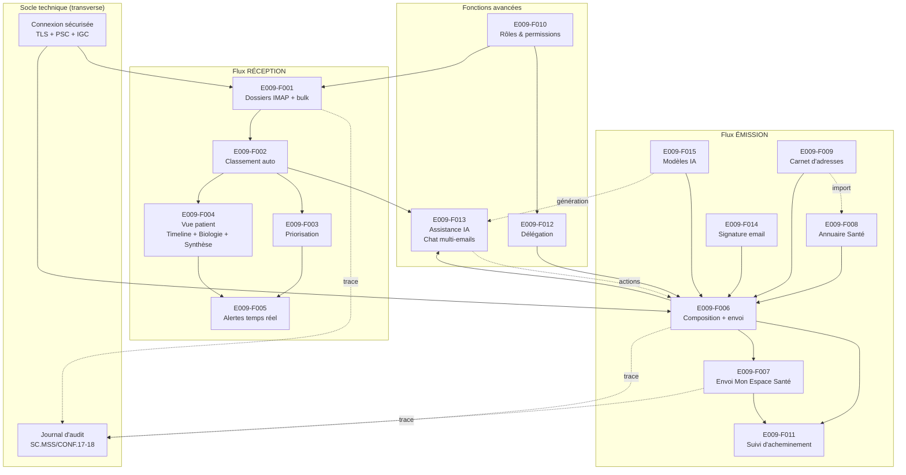

# E009 — Messagerie intelligente MSSante

> **Statut** : 🟢 En cours
> **Modèle** : hand-crafted
> **Version** : 1.25
> **Auteur** : Pascal Cabanel
> **Dernière mise à jour** : 2026-05-07
> **Audience** : équipes techniques, backlog, conformité détaillée.
> **Document frère (vue produit / direction)** : [`E009-product-overview.md`](./E009-product-overview.md)
>
> ## Synthèse fonctionnelle des changelogs (v1.5 → v1.24)
>
> ### Fonctionnalités métier
>
> - **v1.24 — Recherche Angular alignée sur Blazor** : la barre de recherche Angular passe d'un simple input texte à un dropdown riche avec 3 chips de statut (Non lus / Importants / Pièces jointes), 6 chips médicaux (élagage volontaire 14 → 6 — Tous, Biologie, Consultation, Imagerie, Prescription, Hospitalisation), 4 chips de plage (Aujourd'hui / 7 j / 30 j / 3 mois) et un panel de recherche avancée (De / À-CC / Objet / Type de document — 14 types accessibles via le sélecteur). Aucun changement backend ; la pertinence des résultats sera traitée dans une US dédiée.
> - **v1.23 — Vue conversation Angular (parité Blazor)** : quand le médecin active « Mode conversation » dans ses paramètres MSS, la liste se replie sur les feuilles de fil et chaque ligne agrégeante affiche un compteur « N messages » + un bouton chevron pour déplier ses enfants en place. Parité fonctionnelle avec le Blazor existant ; aucun changement backend.
> - **v1.22 — Bloquer la réponse du patient** : case à cocher dans le compose, visible uniquement quand au moins un destinataire Mon Espace Santé est présent. Permet de signifier la fin d'un échange.
> - **v1.21 — Annule et remplace** : republier une version corrigée d'un document médical déjà envoyé. Le message original apparaît marqué « annulé » dans les envoyés.
> - **v1.13 — Détection des doublons** : badge « DOUBLON » sur les documents médicaux reçus en double. Le praticien confirme ou rejette la détection.
> - **v1.12 — Rattachement patient simplifié** : retrait du bouton « Créer un nouveau patient » de la dialog (action gérée ailleurs).
> - **v1.11 — Rattachement manuel par comparaison visuelle** : quand l'INS du CDA n'est pas qualifiée, le praticien choisit un patient parmi les candidats proposés avec score de similarité.
> - **v1.10 — Indicateur d'intégration** : pastille verte (✓ tous intégrés) ou orange (⏳ N en attente) sur les mails comportant des documents médicaux.
> - **v1.7 — Impression et export** : email imprimable en PDF ou téléchargeable en EML, avec traçabilité.
> - **v1.5 — Libellé expéditeur** normalisé selon le format réglementaire ECO.2.2.7.
>
> ### Conformité réglementaire MSSanté
>
> - **v1.8 — En-têtes SMTP MSSanté** (`X-MSS-CODECDA`, `X-MSS-INS`, `X-MSS-NIL`, `X-MSS-MES`) émis automatiquement à l'envoi selon le Référentiel socle MSSanté #2.
>
> ### Sécurité (chantier complet)
>
> - **v1.19 — Cloisonnement par utilisateur** : contacts, signatures, modèles, audit, actions en attente accessibles uniquement à leur propriétaire.
> - **v1.18 — Flux temps réel sécurisés** : impossible de s'abonner aux notifications d'un autre utilisateur.
> - **v1.17 — Authentification cryptographique** : identité vérifiée par JWT signé, plus de spoofing par simple entête d'email.
> - **v1.16 / v1.15 / v1.14 — Identifiants opaques (Guid v7)** sur toutes les entités (utilisateurs, contacts, mails, documents, patients), rendant l'énumération IDOR impossible.
>
> ### Technique / observabilité (sans impact utilisateur direct)
>
> - **v1.20** — Amélioration des logs (verrous IMAP, ajout de mails en doublon).
> - **v1.9** — Optimisation du parsing CDA à l'envoi (moins de charge, moins d'erreurs log).
> - **v1.6** — Alignement iso-fonctionnel des frontends Angular et Blazor.
>
> ---
>
> <details>
> <summary>📜 Historique détaillé des changelogs (archive technique)</summary>
>
> **Changelog v1.25** : passe tech-writer conservatrice. Task-032quater (Samples CDA zip files pour tester CdaParsingService) livrée sur `api-mail` (PR #47). Embarque 5 zips IHE-XDM réels (biologie CR-BIO, prescription cardio, imagerie, microbiologie, DLU) + 1 malformed ZIP dans `tests/mss.mail.integration.tests/Resources/cda-samples/`. 8 tests d'intégration `CdaParsingIntegrationTests` couvrent le happy-path parsing par catégorie CDA, le malformed input, l'option `CdaParseOptions.Metadata`-only, et le chemin inexistant. Retrait de `[ExcludeFromCodeCoverage]` sur `CdaParsingService` (382 LOC réintégrées au dénominateur de couverture). Suite api-mail : 1942 passés / 5 skipped / 0 failed. Aucune règle Ségur (`**Closes RG**:`) déclarée — US purement dette technique / outillage qualité, issue du découpage Option B 2026-05-07 de la US d'origine `task-032bis-test-harness` (Chantier 3 — samples CDA). Annexe C enrichie avec task-032quater. Sections 4/5/6 hand-crafted préservées.
>
> **Changelog v1.22** : durcissement Ségur conformité — task-026 (UI toggle « Bloquer la réponse du patient », SC.MSS/CONF.21 / Référentiel socle MSSanté #2 §3.4.2.3 — ECO.2.2.8) livrée sur `client-blazor` (PR #45) et `client-angular` (mode code-only, uncommitted). **Comble le gap UI découvert pendant la review task-006** : le backend `MssanteHeaderService` (task-001) savait émettre l'en-tête `X-MSS-MES: FIN` quand `MailDto.BlockPatientReply == true` ET au moins un destinataire `*@patient.mssante.fr`, mais aucune surface UI ne permettait au médecin de flipper le booléen — la valeur restait toujours à `false` C# default, donc l'en-tête n'était **jamais émis en pratique** malgré le ✅ Implémenté affiché en §6.13. **Désormais** : checkbox « Bloquer la réponse du patient » dans la toolbar du compose Blazor + Angular, **visible uniquement** quand le predicate `HasPatientRecipient(To, Cc, Bcc)` est vrai (au moins un destinataire `*@patient.mssante.fr` case-insensitive). Reset side-effect : quand le predicate flip back à false (dernière adresse patient retirée), le booléen sous-jacent est forcé à `false` pour empêcher qu'un état caché ne pollue un envoi non-patient suivant. **Convention scellée** : opt-in actif (default false, jamais coché par défaut, jamais auto-coché par heuristique). **Backend** : aucun changement — la logique d'émission est inchangée depuis task-001, et la défense côté serveur (re-vérification du domaine destinataire avant émission) garantit que le toggle UI est une convenience pas un vecteur de sécurité. **DTOs** : aucun changement — `MailDto.BlockPatientReply` et `SaveDraftDto.BlockPatientReply` étaient déjà publiés depuis task-001. **Blazor** : nouveau `BlockPatientReplyHelper` static (47 lignes — `IsPatientAddress` case-insensitive null-safe + `HasPatientRecipient` sur 3 listes) extracté dans `Plugin/Helpers/` pour être unit-testable en isolation sans cérémonie bUnit ; `NewMailComponent.razor` ajoute la checkbox conditionnelle `@if (ShouldShowBlockPatientReplyToggle())` avec `data-testid="compose-block-patient-reply-checkbox"` ; `Localizer` ajoute 2 clés × 2 locales (`BlockPatientReplyLabel`/`BlockPatientReplyTooltip` FR + EN ; tooltip cite Référentiel socle MSSanté #2 §3.4.2.3 — ECO.2.2.8 pour traçabilité réglementaire). **Angular** (code-only, uncommitted sur `feature/nova-rewriting-mss-fixes-20260410`) : modèle `MailDto.blockPatientReply?: boolean` ajouté ; `mail-compose.component.ts` ajoute signal `blockPatientReply` + computed reactif `hasPatientRecipient` (scrute les 3 signals d'adresses) + effect de reset qui track les 3 signals + propagation au payload via `Partial<MailDto>` au moment du `sendMailDirect()` + reset dans `reset()` à la fermeture ; `mail-compose.component.html` ajoute la checkbox conditionnelle `@if (hasPatientRecipient())` avec `data-testid` + tooltip FR inline. Tests : Blazor `HealthPlatform.Module.Mss.Plugin.Tests` 37/37 (était 21, **+16 nouveaux** `BlockPatientReplyHelperTests` Theory/Fact couvrant case-insensitive, null/empty, bare suffix, missing leading @, partial match négatif, in To/Cc/Bcc, uppercase) ; mss-lib Vitest 98/98 (no regression). Sonar **skip** (api-mail non touché). **Audit grep DOD** : `BlockPatientReply` dans Blazor sources → ✅ 3 fichiers (Helper, NewMailComponent, Localizer FR + EN) ; `blockPatientReply` dans Angular sources → ✅ 3 fichiers (model.ts, .ts, .html). **Limites différées** : Vitest spec.ts pour `mail-compose` non créé (le composant n'a pas de spec.ts pré-existant ; créer un greenfield avec mocking ~10 deps dépasse le périmètre task-026 limitée à câbler le toggle) — gap documenté, même posture qu'au merge task-006. **Dans le tableau §6.13 ligne RG-E009-016** : la note ✅ Implémenté est complétée — l'en-tête `X-MSS-MES: FIN` est désormais **opérationnellement émis** quand le médecin coche la case sur un envoi MES (avant task-026 le toggle n'existait pas, l'en-tête n'était jamais émis). Annexe C enrichie avec task-026. Sections 4/5/6 hand-crafted préservées.
>
> **Changelog v1.21** : feature métier — task-006 (« Annule et remplace », AMBU.MSS/va1.02) livrée sur `dtos-mss` (PR #16, NuGet 247.0.0), `api-mail` (PR #42), `client-blazor` (PR #44) et `client-angular` (mode code-only — uncommitted, humain gère commit/push TFS). Permet au professionnel de re-publier une version corrigée d'un document médical déjà envoyé : nouveau message pré-rempli avec subject `[Annule et remplace] {original}` (préserve le marker IHE_XDM `XDM/1.0/DDM+` per ECO.2.1.3 — le préfixe `[Annule et remplace]` est inséré APRÈS le marker XDM pour rester structuré côté destinataire), threading RFC 5322 (`In-Reply-To` = MessageId original, `References` = chaîne existante + MessageId dédupliquée), corps mention `Ce message annule et remplace le message du {date} ayant pour objet : « {sujet sans préfixe XDM} »`, recipients copiés (To + Cc — Bcc volontairement non propagé pour préserver la sémantique blind). **Backend** : nouvelle colonne `Mails.IsCancelled boolean NOT NULL DEFAULT false` (migration consolidée), entité `Mail.IsCancelled`, DTO `MailDto.IsCancelled` (server-managed), `IMailRepository` enrichi de `GetMailByIdAsync(Guid)` + `ResolveMailIdAsync(folder, uid)` + `MarkAsCancelledAsync(Guid)` (idempotent). Nouveau `IMailCancellationService` (Application) avec 2 méthodes principales : `PrepareCancelAndReplaceDraftAsync` charge l'original et bâtit le `MailDto` pré-rempli ; `SendCancelAndReplaceAsync` ré-écrase défensivement les threading headers depuis l'original chargé serveur-side (forge-resistant — un payload forgé par le client ne peut pas court-circuiter la convention), invoque le sendCallback, et marque l'original cancelled atomiquement sur succès (saga : send fail → no mark, send OK + mark fail → 200 + warning). 2 nouveaux endpoints `MailController` keyés sur (folder, uid) pour cohérence avec le reste : `GET /api/v1/mail/folders/{folder}/emails/{uid}/cancel-and-replace-draft` et `POST .../cancel-and-replace`. Mode offline : queue le replacement comme PendingAction `SendMail`. **Blazor** : strike-through subject + badge orange `[ANNULÉ]` sur `MailHeader` (liste inbox, 2 sites de rendu) et sur le détail. Bouton « Annuler et remplacer » dans la toolbar `MailDetailComponent` avec predicate `CanCancelAndReplace` (visible uniquement si `mail.IsCancelled == false && mail.HasMedicalDocuments == true && mail.FolderPath contains "Sent"`). `IMailService` étendu de 2 méthodes `GetCancelAndReplaceDraftAsync(folder, uid)` + `SendCancelAndReplaceAsync(folder, uid, replacement)`. `NewMailComponent` reçoit 3 nouveaux paramètres et `InitializeCancelAndReplace()` pré-remplit le formulaire ; le bouton Send route vers le nouvel endpoint via ternaire si en mode cancel-replace. `ComposeRequestArgs` étendu (CancelAndReplaceOriginalFolder/Uid/Draft). 4 clés Localizer FR + EN (`CancelAndReplace`, `MailCancelledBadge`, `CancelAndReplaceSuccess`, `CancelAndReplaceSuccessDetail`). Fallback gracieux à un Reply si l'original est introuvable serveur-side (deleted/moved entre display et click). **Angular** (code-only, uncommitted) : modèle `MailDto.isCancelled?` ajouté, service `MssApiService` enrichi des 2 méthodes, `mail-detail.component.html` + `.ts` ajoutent le bouton + handler avec Reply fallback, `mail-header.component.html` + `.scss` ajoutent strike-through + badge sur les 2 sites de rendu, `mail-event.service.ts` ajoute le sidecar signal `cancelAndReplaceContext`, `mail-compose.component.ts` route le Send via le nouvel endpoint quand le sidecar est set + clear le sidecar à `doClose()`. Tests : api-mail **1733 / 5 ignorés / 0 failed** (était 1715, +18 nouveaux task-006 — 15 unit `MailCancellationServiceTests` couvrant subject prefix XDM/non-XDM, body mention, threading per RFC, recipients copy, idempotency, mark-saga, defensive header enforcement + 3 integration Postgres-backed `MailRepositoryIntegrationTests` round-trip IsCancelled column / 404 / idempotent mark) ; blazor solution build clean ; mss-lib Vitest 98/98 (existing tests, no regression). Sonar Mode A best-effort accept (3/4 hard targets toujours atteints, diff suit les patterns existants — 0 nouveau CA1873 / S107 / S3776). **Closes RG** : non explicite côté table section 6 — la US référence AMBU.MSS/va1.02 + ECO.2.1.1/2.1.3/2.2.1/2.2.2 (ces 4 ECO sont déjà couverts globalement par d'autres tasks ; AMBU.MSS/va1.02 reste à formaliser dans la table section 6 si la PO le souhaite). **Limites différées** : (1) audit trace `MailCancelAndReplace` non émis pour cohérence avec framework task-004 — follow-up suggéré ; (2) bUnit + Vitest tests pour button visibility et badge rendering différés — gap documenté, chore qualité ; (3) end-to-end Playwright `/qa` pour le flow complet — follow-up. **Note environnementale** : suite api-mail.sln complète bloquée par file lock du dev AppHost (PID 27300), mais aucun fichier de `src/AppHost/` n'est touché — toutes les couches modifiées builds + tests verts. Annexe C enrichie avec task-006. Sections 4/5/6 hand-crafted préservées.
>
> **Changelog v1.20** : passe d'observabilité orthogonale au chantier sécurité — task-024 (instrumentation lock IMAP + fix log-level race AddNewMail) livrée sur `api-mail` (PR #41). Deux patterns d'erreur identifiés en Seq sur la session `virginie.medecinrpps0062267` du 2026-05-03 traités : (1) `MailRepository.AddNewMail` loguait en `Error` un flow de **succès** quand le catch `PostgresErrorCodes.UniqueViolation` rebasculait vers `UpdateExistingMailWithContentAsync` (la race condition concurrent-enrichment était déjà gérée correctement, mais le log level pollue Seq) — corrigé par `LogError → LogInformation`, message reformulé `[DB] Mail UID={Uid} already existed — content updated via duplicate-fallback (MailId={MailId})` ; (2) `MailClientSessionManager.LockImapClientAsync` cancellait des opérations user-driven (`UpdateReadStatus` mark-read, ~1135 ms avant cancel) sans révéler **qui** détenait le lock IMAP au moment du timeout — instrumenté par un slot `(operation, acquiredAt)` thread-safe sur `MailClientSession` (lock minimal `_holderLock`, writer-only update par le thread qui vient d'acquérir le sémaphore, lecture best-effort par les waiters), `GetCurrentLockHolder` exposé sur `MailClientSessionManager`, `ImapLockScope.AcquireAsync` enrichit les catch `OperationCanceledException` (Warning) et `TimeoutException` (Error) avec `HolderOperation` + `HolderHeldMs`, success log `[ImapLock] ✅ Lock acquired` bumpé `Debug → Information` pour rendre la distribution `WaitTimeMs` requêtable en Seq sans activer Debug. **Aucun changement de comportement** : timeout du lock IMAP toujours 120s, pas de nouveau fallback path. Tests : api-mail 1166 application (5 nouveaux tests holder/Information/cancel-warning) + 273 infrastructure + 86 domain + 16 integration repository (2 nouveaux tests Postgres-backed Pattern 1 — `AddNewMailDuplicateFallbackShouldLogInformationNotError` + `AddNewMailDuplicateWithoutContentShouldStillReturnEmptyAndLogDebug`). Sonar Mode A best-effort accept (3/4 hard targets toujours atteints, diff strictement additif via templates de logging structuré, 0 nouveau CA1873 / S107 / S3776). **Note environnementale** : suite `mss.mail.api.tests` non rejouée pendant `/review` à cause du file lock du dev API en cours d'exécution (PID 66188 + Visual Studio 44916), aucun fichier `src/Api/` n'est touché par cette PR — impact fonctionnel nul. Cette task **prépare task-025** : la phase 1 d'analyse de task-025 attend ~5 jours ouvrés de logs `Lock IMAP acquired by ... after ...ms` + `Cancelled while waiting ... HolderOperation=...` collectés par cette instrumentation pour décider de la stratégie fallback (PendingActions queue / timeout bump / pool IMAP split / combinaison). Annexe C enrichie avec task-024. Sections 4/5/6 hand-crafted préservées. Le bilan sécurité §10.7 reste inchangé (task-024 est observability, pas une couche défensive supplémentaire).
>
> **Changelog v1.19** : **clôture définitive du chantier Sécurité E009** — couche 3 (ownership scoping repositories, task-023) livrée sur `api-mail` (PR #40). Ferme le **dernier vecteur IDOR** identifié dans l'audit task-020 : avec task-021 (JWT crypto) et task-022 (SSE secured), un attaquant ne peut plus se faire passer pour autrui par header / query string ; mais si un Guid de ressource leak (logs Seq, screenshot, audit trail partagé, breach), un user authentifié légitime peut encore accéder à la ressource d'un autre tenant car les repositories ne filtrent pas par `UserId`. **Désormais** : ajout colonne `UserId Guid NOT NULL + FK Users(Id) + IX_*_UserId` sur les 4 tables qui en manquent (`Contacts`, `ContactGroups`, `MailTemplates`, `PendingActions`) dans la migration consolidée `20240101_SetupMigration.cs` ; 4 entités domaine portent `UserId` ; `BaseRepository.GetCurrentUserIdAsync` factorise les 3 helpers `GetOrCreateUserIdAsync` dupliqués (single source of truth, race 23505 catch + ChangeTracker.Clear + re-read pattern) ; **5 dépôts** scopés cumulativement par UserId : `ContactRepository` (9 méthodes + filtre proactif `FilterOwnedGroupIdsAsync` anti join-table tampering sur `Create`/`Update`), `MailSignatureRepository` (`GetByIdAsync`/`DeleteAsync`), `MailTemplateRepository` (5 méthodes, `UpdateAsync` re-load pour vérifier ownership avant mutation, `CreateAsync` setter UserId), `AuditTraceRepository` (`GetTracesAsync`/`GetByIdAsync` filtrent par `UserId == UserContextInfo.Email` — string par design task-020 pour préserver la traçabilité même si le User row est supprimé), `PendingActionRepository` (9 méthodes, `AddAsync` setter UserId automatique). **Convention scellée** : (a) toute query par Id filtre cumulativement par UserId, (b) toute table métier per-user porte `UserId Guid NOT NULL + FK + index`, (c) controllers retournent **404 sur ownership KO, jamais 403** pour ne pas leaker l'existence des Guids, (d) `BaseRepository.GetCurrentUserIdAsync` est l'unique voie d'accès au UserId courant côté repo. Tests : api-mail **1708 passés / 0 failed** (était 1587 — **+21 tests cross-tenant** dans `CrossTenantOwnershipTests.cs` couvrant Contact, MailSignature, MailTemplate, MssAuditTrace, PendingAction ≥ 3 tests par dépôt ; existants adaptés via seed User row + tag UserId sur entités directement insérées) ; client-blazor / mss-lib non touchés (US purement back-end). **Audit grep DOD** : `FindAsync([id])` repos métier → ✅ vide ; `FirstOrDefaultAsync(...Id == id)$` sans `&& UserId ==` → ✅ vide. Sonar Mode A best-effort accept sans cleanup (3/4 hard targets déjà atteints baseline 728 code smells dont 32 S3776 blacklisté + 387 CA1873 logging — campagne dédiée future ; aucune nouvelle violation introduite par task-023, le diff suit le pattern message-template existant). **Dans le tableau §10.7 défense en profondeur** : couche 3 passe de 🔴 À faire à 🟢 Implémentée — **les 3 couches du chantier sécurité E009 sont désormais en place**. **Bilan E009 sécurité (6 tasks 018+019+020+021+022+023)** : (1) 100% des PK Postgres en `uuid` v7 (anti-énumération), (2) JWT validation crypto + secure-by-default `FallbackPolicy` (anti-spoofing), (3) SSE / endpoints anonymes refermés (anti-leak temps réel), (4) ownership scoping cumulatif sur les repos exposant des Guid (anti-cross-tenant). Le seul vecteur IDOR restant identifié serait un compromis de la base User elle-même — hors périmètre application. Annexe C enrichie avec task-023. Sections 4/5/6 hand-crafted préservées.
>
> **Changelog v1.18** : couche 2bis du chantier Sécurité — SSE & endpoints anonymes (task-022) livrée sur `api-mail` (PR #39), `client-blazor` (PR #43) et `client-angular` (code-only, uncommitted). Ferme la faille IDOR temps réel identifiée dans l'audit : un attaquant avec son propre JWT valide pouvait s'abonner au flux SSE d'une autre victime via `?email=victim@x.fr`. **Désormais** : retrait du `[AllowAnonymous]` temporaire posé en task-021 sur les 5 controllers (`AiController`, `DirectoryController`, `FeatureFlagController`, `MailEventsController`, `NotificationsController`) — désormais protégés par la `FallbackPolicy = RequireAuthenticatedUser` ; `MailEventsController.Stream` et `NotificationsController.Stream` refactorés pour résoudre l'email **exclusivement** depuis le claim JWT validé (`User.FindFirstValue(ClaimTypes.Email)` avec fallback sur `JwtRegisteredClaimNames.Email` puis `preferred_username`), le paramètre `?email=` query string est désormais ignoré (un attaquant qui passe `?email=victim@x.fr` avec son propre JWT valide voit s'ouvrir un flux sur SON propre email, jamais celui de la victime) — 400 BadRequest si claim email manquant. Nouveau scrubber `RequestLoggingMiddleware.ScrubQueryStringToken` (regex partial generated, IgnoreCase) qui masque `?token=...` / `&token=...` → `token=***` AVANT d'enrichir LogContext — le JWT propagé en query string pour les flux SSE n'apparaît jamais en clair dans les logs Seq. Frontends adaptés : Blazor `MailSseService.BuildStreamUrl()` drop `email=` du query, garde `folder` + `token` ; Angular `notification-stream.service.ts` drop `email=`, garde `token=`. Tests : api-mail 1587 passés / 5 skipped / 0 failed (était 1577 — **10 nouveaux tests sécurité** : 8 theory `ScrubQueryStringTokenMasksTokenValueButPreservesOtherParams` + 1 multi-occurrence + 1 anti-spoofing `StreamIgnoresEmailQueryStringAndUsesClaimInstead` + 1 missing-claim `StreamWithoutEmailClaimReturns400`) ; client-blazor 21/21 ; mss-lib Vitest 98/98. Audit grep DOD : `[AllowAnonymous]` dans Controllers → ✅ vide, `Headers["Client-Email"]` lu → ✅ vide, `?email=` dans MailEventsController + NotificationsController → ✅ vide (le seul `[FromQuery] string email` restant est `SettingsController.GetAutoconfigAsync`, paramètre métier autoconfig DNS, pas un identifiant d'auth — légitime). Sonar Mode A best-effort accept sans re-analyse (3/4 hard targets déjà atteints, task-022 net LOC négatif -83 lignes + 10 nouveaux tests sécurité, aucun nouveau cluster d'issues attendu, coût d'analyse complète disproportionné vs ROI). **Dans le tableau §10.7 défense en profondeur** : couche 2bis passe de 🔴 À faire à 🟢 Implémentée. **Suggestions non-bloquantes** notées : durcir CORS policy en prod (whitelist explicite des origins, dev reste `AllowAnyOrigin` pour `/qa` et hot-reload) ; cleanup mineur de `MailSseService._currentUserEmail` (résiduel logging) ; tests HTTP-pipeline `WebApplicationFactory<Program>` toujours absents — carry-over task-021, couvert opérationnellement par `/qa`. Annexe C enrichie avec task-022. Sections 4/5/6 hand-crafted préservées.
>
> **Changelog v1.17** : couche 2 du chantier Sécurité — Authentification cryptographique JWT (task-021) livrée sur `api-mail` (PR #38). Ferme la faille de spoofing d'identité par header `Client-Email` identifiée dans l'audit IDOR : auparavant `RequestHelper.TryExtractJwtToken` lisait les headers `Authorization`, `Client-Email`, `Client-Session-Id` sans aucune validation crypto — un attaquant qui devine un email pouvait forger une requête `Client-Email: victim@x.fr` + `Authorization: Bearer DEADBEEF` et le serveur traitait la requête comme provenant de la victime. **Désormais** : `AddJwtBearer` Keycloak (signature + issuer + audience + lifetime) ; `PolicyScheme JwtOrTestBypass` qui dispatche entre `TestBypassAuthenticationHandler` (auth scheme dédié pour `X-Test-Bypass`, hard-block en Production — utilisé par `/qa`) et `JwtBearer` ; `FallbackPolicy = RequireAuthenticatedUser` secure-by-default (toute route est `[Authorize]` implicitement, infra publique `[AllowAnonymous]` explicite) ; nouveau `UserContextEnricherMiddleware` qui peuple `UserContextInfo` depuis les claims JWT validés (Email = claim `email` ou `preferred_username`, ClientSessionId = `sid` ou `jti`, KeycloakToken via `SaveToken = true`) et lit `X-PSC-Token` du header inconditionnellement (drives `IsOnlineMode`, indicateur de session PSC pas un secret d'auth) ; **suppression de ~120 appels** `RequestHelper.TryExtractJwtToken` dans 23 controllers (helper marqué `internal`, `InternalsVisibleTo("mss.mail.api.tests")` câblé pour préserver les tests existants) ; mode **dev permissif** quand `Keycloak:Authority` absent ET `ASPNETCORE_ENVIRONMENT != Production` — JWT signature non validée pour permettre le dev local sans Keycloak réel (Production force toujours la validation complète) ; token accepté en query string `?token=...` pour les flux SSE (`EventSource` natif Angular ne sait pas poser de header) via `OnMessageReceived` JwtBearerEvents ; 5 controllers actuellement anonymes (`AiController`, `DirectoryController`, `FeatureFlagController`, `MailEventsController`, `NotificationsController`) marqués `[AllowAnonymous]` temporairement — task-022 décidera lesquels rouvrir. Tests : 1577 passés / 5 skipped / 0 failed (était 1587, 10 tests obsolètes "Unauthorized when missing headers" supprimés par design — l'assertion a perdu son sens, l'auth est dans le pipeline AuthN/AuthZ pas dans le handler). Audit grep DOD : `TryExtractJwtToken` dans Controllers → ✅ vide, `[AllowAnonymous]` → 5 entrées (base task-022). **Pass 6 (tests sécurité HTTP-pipeline dédiés via `WebApplicationFactory<Program>`)** deferred, couvert opérationnellement par `/qa` Playwright en test-bypass mode. **Hotfix utilisateur** : un bug "considéré hors ligne malgré PSC connecté" identifié pendant le test manuel Angular a été corrigé en passe successive (commit `9dc7eb4`) — le middleware lisait `X-PSC-Token` uniquement à l'intérieur du bloc `if (IsAuthenticated)`, désormais lecture inconditionnelle ; le mode dev permissif a aussi été ajouté au même moment pour permettre à l'app Angular d'authentifier en local sans Keycloak réel. Dans le tableau §10.7 défense en profondeur : couche 2 passe de 🔴 À faire à 🟢 Implémentée. Annexe C enrichie avec task-021. Sections 4/5/6 hand-crafted préservées.
>
> **Changelog v1.16** : phase 3 et **clôture** du chapitre Sécurité — Identifiants opaques Guid v7. Task-020 (User / Contact / Audit cluster + scellement final de la convention) livrée sur `dtos-mss` (PR #15), `api-mail` (PR #37), `client-blazor` (PR #42) et `client-angular` (mode code-only — uncommitted, humain gère commit/push TFS et PR). Migre les 10 entités restantes vers Guid v7 PK + FK : `User`, `UserSetting`, `MailSignature`, `MailTemplate`, `MailFolder`, `Contact`, `ContactMssAddress`, `ContactTag`, `ContactGroup`, `ContactGroupMember`, `MssAuditTrace`, `PendingAction` ; et finalise `MailMedicalDocument.PractitionerContactId` resté `int?` en task-018 par cohérence FK avec `Contact.Id` désormais Guid. **Suppression du hack `ContactDto.GetIntId()`** (BitConverter sur 4 bytes du Guid, ~1/65k birthday-collision) — l'item le plus impactant en sécurité du chantier complet ; les consumers passent désormais `ContactDto.Id` directement puisque `Contact.Id` est Guid à la source. **MailDataContext** : 8 nouveaux `UuidV7ValueGenerator` câblages (`User`, `UserSetting`, `MailSignature`, `MailTemplate`, `MailFolder`, `MssAuditTrace`, `PendingAction`, `Tag`) ; **0 `UseIdentityAlwaysColumn` restant** dans le DataContext (audit grep complet). **Migration consolidée** `20240101_SetupMigration.cs` : 12 tables `AsInt32().PrimaryKey().Identity()` → `AsGuid().PrimaryKey()`, propagation Guid sur les FK `UserId` / `ContactId` / `GroupId` / `PractitionerContactId` ; colonnes int légitimes préservées (`Uid` IMAP, `SortOrder`, `UrgencyLevel`, `FolderType`, `TotalCount`/`UnreadCount` compteurs, `MailUid` IMAP, `RetryCount`, `Status` enum). **Routes API** : `ContactController` 8 routes `{id:int}`/`{contactId:int}`/`{groupId:int}` → `:guid`, `MailTemplateController` 3 routes, `SignatureController` 5 routes, `AuditController` 1 route, `MailController.CancelPendingEmail` `{id}` → `{id:guid}` — soit **17 routes migrées** ; en sortie de cette task **0 `{*:int}` ne subsiste** dans aucun controller. **DTOs** : `MailSignatureDto`, `MailTemplateDto`, `MssAuditTraceDto` Id Guid (`UserId` reste string — identifiant JWT), `MailMedicalDocumentDto.PractitionerContactId` Guid?, `ManagementDtos` 6 records (`SimilarityResultInfoDto`, `SampleEmbeddingDto`, `SampleMailContentEmbeddingDto`, `DistanceResultDto`, `EmailManagementDto`, `EmailDetailDto`). NuGet `HealthPlatform.Dtos.Mss 239.0.0` publié via CI auto-versioning ; consumers (`api-mail` + `client-blazor`) bumpés via `Directory.Packages.props`. **Repositories / interfaces / services** propagent Guid : `IContactRepository` (toutes les méthodes Id), `IMailSignatureRepository`, `IMailTemplateRepository`, `IAuditTraceRepository`, `IPendingActionRepository` (`AddAsync` retourne `Task<Guid>`, plus `Task<int>`), `IMedicalDocumentRepository.UpdatePractitionerContactIdAsync(Guid, Guid)`, `IPatientContactService` / `IPractitionerContactService` retournent `Task<Guid?>`, `IPendingActionService.CancelPendingEmailAsync(Guid)`, `RedisKeys.Contact.ById/GroupById` clés Guid. **ContactRepository** : suppression du hack `BitConverter.ToInt32(group.Id.ToByteArray(), 0)` dans `UpdateGroupAsync` et de l'appel à `contact.GetIntId()` dans `UpdateAsync` — passage direct du Guid. **Blazor** : `ISignatureService`, `IMailTemplateService`, `IAuditService` signatures Guid ; `SignatureEditor`, `MailTemplateEditor`, `MailTemplates`, `NewMailComponent`, `Audit`, `ManagementPage` — locaux `_selected*Id` / `_copiedBodyId` / `_copiedTraceId` int? → Guid?, pattern-match `value is int` → `value is Guid`, vérifs `Id > 0` → `Id != Guid.Empty`. **Angular** (mode code-only) : 11 fichiers TS adaptés — 6 modèles (`abnormal-biology` `patientId`, `audit` `id`, `mail-template` `id`, `pending-email` `id`, `search` `patientId`, `signature` `id`), 1 service (`mss-api.service.ts` 7 signatures `cancelPendingEmail`/`updateSignature`/`deleteSignature`/`setDefaultSignature`/`updateTemplate`/`deleteTemplate`/`getAuditTraceById`), 4 composants (`audit-timeline` `copiedTraceId`, `mail-compose` suppression du `parseInt` désormais obsolète, `mss-signatures` + `mss-templates` signal types + checks `Id !== ''`/`=== ''`). **Tests** : nouveau helper `TestGuid.From(int)` pour les `Received(N).MethodAsync(seed)` qui requièrent un id stable ; 8 fichiers domain entity tests (User/UserSetting/Contact/ContactGroup/MailSignature/MailTemplate/MailFolder/PendingAction) + `TestDataFactory` rebuilt autour de `Guid.CreateVersion7()` ; `ContactRepositoryTests`, `PendingActionRepositoryTests`, `MailTemplateRepositoryTests`, `MedicalDocumentRepositoryTests`, `PendingActionServiceTests`, `PractitionerContactServiceTests`, `PatientContactServiceTests`, `RepositoryTests`, `CreatePractitionerContactConsumerTests`, `CreatePatientContactConsumerTests`, `AiConversationServiceTests`, intégration `ContactRepositoryIntegrationTests` + `MailSignatureRepositoryIntegrationTests` + `ContactsUseCaseTests` adaptés ; `ContactsUseCaseTests` helpers `GetContactIdByGuidAsync` / `GetGroupIdByGuidAsync` retournent `Guid?` (n'utilisent plus `Id.GetHashCode()`). Suite api-mail **1587 passés / 5 skipped / 0 failed** ; client-blazor **21/21** ; mss-lib Vitest **98/98**. **Scellement final (audit grep complet)** : `int Id { ` dans `Domain/Entities/` → ✅ vide ; `{id:int}|{contactId:int}|{groupId:int}|...` dans `Api/Controllers/` → ✅ vide ; `.AsInt32().PrimaryKey()` dans `Migrations/` → ✅ vide ; `public int Id { ` dans `Dtos/` → ✅ vide ; `GetIntId` source code → ✅ vide ; `id: number` dans `Client/Angular/.../models/` → ✅ vide hors `uid`/`mailUid`/`emailUid` IMAP (légitimement int). **Bilan du chantier E009 sécurité (3 tasks)** : task-018 (cluster Patient + MailMedicalDocument), task-019 (cluster Mail + enfants), task-020 (User / Contact / Audit + scellement). 100% des PK Postgres en `uuid` v7, 0 routes `{:int}`, 0 hack BitConverter, anti-énumération IDOR couvert sur l'ensemble des entités exposées. Annexe C enrichie avec task-020. Section **Sécurité** mise à jour avec le bilan final. Sections 4/5/6 hand-crafted préservées.
>
> **Changelog v1.15** : phase 2 du chapitre Sécurité — Identifiants opaques Guid v7. Task-019 (Migration cluster Mail + finalisation `MailMedicalDocument.MailId` vers Guid v7) livrée sur `dtos-mss` (PR #14), `api-mail` (PR #36), `client-blazor` (PR #41) et `client-angular` (mode code-only — uncommitted). Migre `Mail`, `MailContent`, `MailRecipient`, `MailAttachment`, `Tag`, `MailTag` (6 entités) vers Guid v7 PK + FK, et finalise `MailMedicalDocument.MailId` resté int en task-018 par cohérence FK. Réutilise le `UuidV7ValueGenerator` introduit en task-018 (génération .NET-side via `Guid.CreateVersion7()`). Migration consolidée `20240101_SetupMigration.cs` éditée : 6 tables `AsGuid().PrimaryKey()` + propagation Guid sur les FK (`MailId`, `TagId`). **Pas de routes API à migrer** car `MailController` utilise les UID IMAP cross-boundary (string `{emailid}`), pas la PK Postgres `Mail.Id`. **DTOs** : 4 fichiers cluster Mail migrés (`TagDto.Id`, `DuplicateClusterMemberDto.MailId`, `MailMedicalDocumentDto.MailId`, `MailPatientDto.Id` — alignement task-018 oublié). NuGet `HealthPlatform.Dtos.Mss 235.0.0` publié via run 25212643824 ; consumers bumpés. **Repositories / messages / internal models** propagent Guid : `IMailRepository.AddNewMail` retourne `Task<Guid>` (était `Task<int>`) ; signatures Guid sur `UpdateMailContent*Async`, `GetMailMedicalDocumentsAsync`, `AddAutoTagsToMailAsync`, `AddCategoryTagsToMailAsync`, `ISemanticSearchRepository.GetEmailContentsByMailIdsAsync`, `.GetMedicalDocumentsByMailIdsAsync` ; helpers `MailRepository` `Dictionary<int,…>` → `Dictionary<Guid,…>` (5 helpers : `medDocsByMail`, `contentsByMail`, `biologyByDocId`, `summaryByDocId`, `activeDuplicateRefs`) ; `UpdateExistingMailWithContentAsync` retourne Guid ; `EmailCandidate.MailId` Guid ; modèles internes `EmailContentWithEmbedding` (Id+MailId), `MedicalDocumentWithEmbedding.MailId`, `FullTextSearchResult.MailId` Guid ; `AddNewMailMessage.MailId` Guid ; `BackgroundImapService` + `ImapService` `PublishAddNewMailMessageAsync(Guid mailId)` adaptés ; mock repository retourne `Guid.Empty` au lieu de `0` (sentinel d'erreur). **Blazor** : impact UI minimal (MailDto utilise Uid IMAP cross-boundary, TagDto.Id opaque) ; seul Mock.MailService.AddTagToMailAsync.TagDto.Id passe à `Guid.NewGuid()`. **Angular** (code-only) : 1 fichier modifié (`mail.model.ts`) — TagDto.id, MailMedicalDocumentDto.mailId, DuplicateClusterMemberDto.mailId : `number` → `string`. Tests : api-mail 1687 / 21 ignorés / 0 échec (TestDataFactory + 7 fichiers domain entity tests + 6 fichiers services/consumers/repository fixtures Guid) ; client-blazor 21/21 bUnit verts ; mss-lib Vitest 98/98 verts. Sonar pré-PR : 3/4 hard targets atteints, baseline 728 inchangé (migration mécanique sans nouvelles catégories), ASP0015 préservé à 0 sur le code task-019. **Reste de la convention task-018 préservée** : `MailFolder`, `User`, `UserSetting`, `Contact*`, `MailSignature`, `MailTemplate`, `MssAuditTrace`, `PendingAction` restent int (task-020). Annexe C enrichie avec task-019. Sections 4/5/6 hand-crafted préservées.
>
> **Changelog v1.14** : ouverture du chapitre **Sécurité — Identifiants opaques (Guid v7)**. Task-018 (Migration des PK de cluster Patient + MailMedicalDocument vers UUID v7 — RFC 9562) livrée sur `dtos-mss` (PR #13), `api-mail` (PR #35), `client-blazor` (PR #40) et `client-angular` (mode code-only — uncommitted, humain gère commit/push TFS et PR). **Pourquoi** : durcissement sécurité — élimine l'énumération IDOR sur les routes `/medical-documents/{int}` et leurs équivalents (un attaquant ne peut plus deviner les Ids voisins). UUID v7 plutôt que v4 pour le tri temporel + B-tree friendliness sur grosses tables. **Stratégie « à la source »** : pas de cohabitation `int Id` interne + `Guid PublicId` externe — les colonnes `Id` Postgres elles-mêmes deviennent `uuid`. Génération côté .NET via un nouveau `UuidV7ValueGenerator` (`Guid.CreateVersion7()`, .NET 10 natif) câblé dans `MailDataContext` via `HasValueGenerator<>().ValueGeneratedOnAdd()` sur les 4 entités du cluster (`MailPatient`, `MailMedicalDocument`, `MailMedicalDocumentBiology`, `MailMedicalDocumentSummary`) — colonne Postgres `uuid` sans default DB (pas de `gen_random_uuid()` qui produit du v4, pas de `WithDefault(SystemMethods.NewGuid)` non plus). **Migration** : édition directe de la migration consolidée `20240101_SetupMigration.cs` (convention "re-consolider plutôt qu'empiler" déjà actée par le projet) — `AsInt32().PrimaryKey().Identity()` → `AsGuid().PrimaryKey()` sur les 4 tables, propagation Guid sur les FK `PatientId` / `DuplicateOfId` / `MedicalDocumentId`. `MailId` reste `int` (sera migré task-019), `PractitionerContactId` reste `int` (task-020). Pre-flight chore commit `52c0994` consolide les 10 migrations historiques standalones (`PatientSummary`, `AddMailSignature`, `AddContactIns`, `AddMssAuditTraces`, `AddPatientOpposition`, `AddErrorDetailsToAudit`, `AddPdfFieldsToMailMedicalDocument`, `AddDuplicateFlag`, `RefactorDuplicateFlagToDerived`, `AddDuplicateConfirmed`) dans `20240101_SetupMigration` — aligne le repo avec la convention. **Routes API** : `MedicalDocumentsController` 3 routes `{documentId:int}` → `{documentId:guid}` (attach-patient, duplicate-decision, duplicate-cluster) + validation `request.PatientId == Guid.Empty` au lieu de `<= 0`. **DTOs** : 13 fichiers cluster migrés (`PatientDto`, `PatientMatchCandidateDto`, `SearchResultPatientDto`, `MailMedicalDocumentDto` Id+PatientId+DuplicateOfId, `MailMedicalDocumentSummaryDto`, `MailMedicalDocumentBiologyDto`, `BiologyResultDto.BiologyValueDto+BiologyDocumentGroupDto`, `DuplicateClusterDto.DuplicateClusterMemberDto.DocumentId`, `DuplicateOfRefDto.DocumentId`, `AttachPatientRequestDto.PatientId`, `SearchFilterPatientDto.PatientId`, `SearchRequestDto.PatientSearchRequestDto.PatientId`, `PatientAbnormalBiologyDto.PatientId`). NuGet `HealthPlatform.Dtos.Mss 231.0.0` publié via GH Actions run 25176890465 ; consumers (api-mail + client-blazor) bumpés. **Repositories / services / messages** propagent Guid : `IPatientRepository` / `PatientRepository` (`AttachDocumentToPatientAsync`, `RecordDuplicateDecisionAsync`, `GetDuplicateClusterAsync`), `IPatientService` / `PatientService`, `IMailRepository.UpdateMedicalDocument*Async`, `IMedicalDocumentRepository.UpdatePractitionerContactIdAsync`, `ISemanticSearchRepository` (3 méthodes patient-bound), `SemanticSearchService.SearchByPatientAsync`, `MailRepository` helpers (`FindExistingDuplicateOfAsync` → `Guid?`, `ResolveActiveDuplicateRefsAsync` → `Dictionary<Guid, DuplicateOfRefDto>`), `Dictionary<int,…>` → `Dictionary<Guid,…>` côté `biologyByDocId` / `summaryByDocId` / `activeDuplicateRefs`, `CreatePatientContactMessage` + `CreatePractitionerContactMessage` `MedicalDocumentId` Guid, modèles internes `MedicalDocumentDigest` + `MedicalDocumentWithEmbedding`. **Blazor** : `IPatientService` 3 signatures Guid ; composants adaptés (`BiologyComponent` `HashSet<Guid>` + helpers Guid, `BiologyTimeline.BioValueEntry.Id` Guid, `DuplicateCleanupDialog [Parameter] Guid DocumentId`, `MailDetailComponent` `_dismissedDuplicateBannerDocIds: HashSet<Guid>` + pattern-match `result is Guid patientId`, `PatientAttachmentDialog AttachAsync(Guid)`, `SearchPatientComponent` heuristique `int.TryParse` → `Guid.TryParse`). **Angular** (mode code-only) : 11 fichiers TS adaptés (3 modèles + 1 service `mss-api.service.ts` + 7 composants `mail-detail`, `mail-read-only-view`, `patient-attachment-dialog`, `duplicate-cleanup-dialog`, `biology-timeline`, `clinical-synthesis`, UI `biology`) — `id: number` → `id: string` sur les types du cluster ; helpers internes (`BioValueEntry`, `BiologyDocumentGroup`, `cleanupDialogDocumentId`, `expandedDocuments`) typés string. Tests : api-mail 1687 / 21 ignorés / 0 échec (était 1677 avant — +10 nouveaux entre adaptations et fixtures Guid) ; client-blazor 21 / 21 bUnit verts ; mss-lib Vitest 98 / 98 verts. Sonar pré-PR : 3/4 hard targets atteints, baseline 728 code smells inchangé (le code task-018 mécanique n'introduit pas de nouvelles catégories), ASP0015 préservé à 0 dans le code task-018. **Décision arch sauvée en mémoire forge** (`project_id_strategy_guid_v7.md`) pour cohérence des futures conversations. **Découpage en 3 tasks** : task-018 (Patient + MailMedicalDocument cluster — la présente), task-019 (cluster Mail + enfants — Mail / MailContent / MailRecipient / MailAttachment / MailPatient / Tag / MailTag, finalisera `MailMedicalDocument.MailId`), task-020 (User / Contact / MailSignature / MailTemplate / MailFolder / MssAuditTrace / PendingAction + scellement final, suppression du `ContactDto.GetIntId()` BitConverter hash hack). Aucune règle Ségur formelle (`**Closes RG**:`) déclarée — task-018 est une dette de durcissement transverse, pas un item Segur explicite (mais cohérent avec l'esprit ECO.2.1 / SC.MSS/CONF des règles existantes). Annexe C enrichie avec task-018. Section **Sécurité** ajoutée. Sections 4/5/6 hand-crafted préservées.
>
> **Changelog v1.13** : passe tech-writer conservatrice. Task-013 (Détection des doublons CDA — SC.CDA/INT.18) livrée sur `dtos-mss` (PR #12), `api-mail` (PR #34), `client-blazor` (PR #39) et `client-angular` (mode code-only — uncommitted, humain gère commit/push TFS et PR). Deux nouveaux champs `IsDuplicate` (bool) + `DuplicateOfId` (int?) sur `MailMedicalDocumentDto` et un nouveau record `DuplicateDecisionRequestDto`. À la réception, `MailRepository.FindExistingDuplicateOfAsync` flagge tout CDA partageant le même `DocumentId` OU la combinaison fonctionnelle `Ins + Category + Date + Title` (les 4 traits requis pour déclencher le combo) avec un document existant. Le doc doublon est reçu et stocké normalement (pas de blocage) — la marque est purement informationnelle, le médecin tranche. Wiring dans les deux chemins d'insertion (`AddNewMail` + `UpdateExistingMailWithContentAsync`), aucune régression sur task-011/012. Migration FluentMigrator `20260429120000` ajoute les deux colonnes + self-FK `FK_MailMedicalDocuments_DuplicateOf` (`OnDelete SetNull`) + index `IX_MailMedicalDocuments_DuplicateOfId`. Nouvel endpoint `POST /api/v1/medical-documents/{id}/duplicate-decision { isDuplicate: bool }` symétrique à `attach-patient` de task-012 (même JWT extraction, même contrat 204/400/401/404) — confirmer garde la marque, rejeter la lève (clear `IsDuplicate` + `DuplicateOfId`). **Blazor** : badge orange « DOUBLON » sur la ligne d'inbox (les deux layouts inbox), bannière dans `MailDetailComponent` avec chip statique « Original : doc #N » + boutons Confirm/Reject ; mise à jour optimiste locale au succès (badge disparaît après reject). **Angular** (mode code-only) : badge `mail-duplicate-badge` sur `mail-header.component`, bannière `mail-detail-duplicate-banner` sur `mail-detail.component` avec `recordDuplicateDecision` + immutable patch sur `mailContent` + `state.updateMailInList`. 12 clés FR + EN (parité vérifiée). Tests : 4 in-memory `MailRepositoryTests` (DocumentId / functional combo / fresh / partial-trait combo) + 3 `PatientRepositoryTests` (reject / confirm / 404) + 3 `PatientServiceTests` + 1 round-trip Postgres `PatientRepositoryIntegrationTests` + 3 bUnit Blazor `MailHeaderDuplicateBadgeTests` + 3 Vitest Angular `mail-header.component.spec.ts`. Suite api-mail 1677 passés / 21 skipped / 0 failed (était 1666 — +11 nouveaux). Sonar pré-PR : 7 fixes `external_roslyn:ASP0015` (`Headers["Authorization"]` → `Headers.Authorization`) sur 4 fichiers de test, pure refactor sans changement de comportement. **Aucune règle Ségur formelle (`**Closes RG**:`) déclarée** — la US référence SC.CDA/INT.18 (Vérifier cohérence de tout document CDA reçu — détection doublons) qui n'apparaît pas dans la table des règles section 6 (mapping SC.CDA → RG à formaliser séparément). Note pragmatique de scope : la « consultation du document existant » prévue au DOD a été dégradée en chip informatif statique « Original : doc #N » (pas de navigation cliquable) ; ajouter une vraie navigation nécessiterait un endpoint `GET /medical-documents/{id}/mail-ref` + helper navigation côté front, deferred follow-up. Confirmer/Rejeter restent les actions principales du DOD. Annexe C enrichie avec task-013. Sections 4/5/6 hand-crafted préservées.
>
> **Changelog v1.12** : finalisation task-012 après tests humains. Le PO a retiré explicitement le bouton « Créer un nouveau patient » de la dialog `PatientAttachmentDialog` côté Blazor ET côté Angular — la dialog est strictement un acte de réconciliation entre une identité CDA non-qualifiée et un patient **existant** en base ; la création de patient relève d'un écran séparé (US dédiée si besoin). Localizer keys `AttachmentDialog_CreateNewPatient` + `AttachmentDialog_CreateNewPatientNotImplemented` retirées (FR + EN). Décision sauvée en mémoire forge (`feedback_attachment_workflow_no_create_new_patient.md`) pour ne pas la reproposer dans une future US similaire. **UI Angular livrée par la forge (mode code-only) à la demande du PO** : nouveau `PatientAttachmentDialogComponent` (standalone + OnPush + signals + JSDoc + 11 tests Vitest) et bannière intégrée à `MailDetailComponent` Angular (computed `pendingAttachmentDocs`, mise à jour optimiste immutable des signaux `mailContent` + `selectedMail` au succès pour faire disparaître la bannière sans attendre un refresh). Tests mss-lib : 95 passés / 0 failed (était 86 avant : +9 dont 11 nouveaux pour la dialog, -2 absents car cleanup d'une duplication). Code Angular uncommitted sur branche `feature/nova-rewriting-mss-fixes-20260410` — humain commit/push TFS. Polish visuel Blazor : extraction des inline styles bannière vers `MailDetailComponent.razor.css`, `PatientAttachmentDialog.razor.css` retravaillé pour le thème dark, backdrop modale `.rz-dialog-mask` (rgba 0,0,0,0.85 + blur 4px) car le wrapper transparent laissait passer le mail derrière, inline styles sur `MailHeader.razor` indicateurs intégration (RenderTreeBuilder spans n'héritent pas du scoped-CSS). Annexe C task-012 mise à jour. PRs api-mail #33, client-blazor #38, dtos-mss #11 toujours en `awaiting-human-merge` — la nouvelle review couvre ce changement de scope.
>
> **Changelog v1.11** : passe tech-writer conservatrice. Task-012 (Rattachement patient par comparaison visuelle — workflow LGC.MDV de complément à task-011 quand l'INS du CDA n'est pas qualifiée) livrée sur `dtos-mss` (PR #11), `api-mail` (PR #33), `client-blazor` (PR #38) et `client-angular` (mode code-only — uncommitted, humain gère commit/push TFS et PR). Deux nouveaux DTOs : `PatientMatchCandidateDto` (patient candidat avec `SimilarityScore` ∈ [0, 1]) et `AttachPatientRequestDto` (body de l'attach manuel). Deux nouveaux endpoints sur `api-mail` : `GET /api/v1/patients/match?lastName=&firstName=&birthDate=&gender=` qui retourne jusqu'à 10 candidats classés par score (algorithme pondéré : nom 0.40 exact / 0.20 partiel, prénom 0.30 / 0.15, date naissance 0.20, sexe 0.10 ; filtre DB ILike grossier puis scoring in-memory plafonné à 200 candidats pré-scoring) ; `POST /api/v1/medical-documents/{id}/attach-patient` qui pose `MailMedicalDocument.PatientId` (404 si l'un ou l'autre id est inconnu, idempotent). Côté Blazor : nouvelle dialog `PatientAttachmentDialog` (charge les candidats, affiche les traits CDA côte à côte, score % par candidat, action « Rattacher » par ligne) + bannière amber injectée dans `MailDetailComponent` au-dessus du corps de mail quand un document a `PatientId == null` ET au moins un trait d'identité présent (nom OU prénom OU date naissance) ; un bouton par doc en attente, ouvre la dialog ciblée ; mise à jour locale optimiste de `PendingIntegrationsCount` (task-011) au succès. 22 clés de localisation FR + EN (parité vérifiée). Tests : 4 service unit + 1 repo unit (garde « all-traits-empty ») + 4 repo integration sur Postgres réel (Testcontainers : exact-on-all-traits = 1.0, exact > partial, no-result, case-insensitive, attach round-trip) ; 18 tests bUnit Blazor verts ; suite api-mail 1666 passés / 21 skipped / 0 failed. **Sonar bundled** : itération 1 best-effort résolvant 5 occurrences de `csharpsquid:S1192` (string literal duplication) dans `ImapService` (`ImapConnectionFailedPrefix`), `ImapFolderService` (`MetricsConstants.ConnectionFailed`), `MailRepository` (`InboxFolderPath`), `MssanteHeaderService` (`HeaderAbsentPlaceholder`) et `CdaParsingService` (`PdfMediaType`) ; migrations exclues par design (règle 7c schema-frozen) ; iter early-stop best-effort pour `CA1873` (387 occurrences nécessitant migration source-generated logging — chore task séparée). Aucune règle Ségur formelle (`**Closes RG**:`) déclarée — le mapping LGC.MDV vers la table section 6 reste à formaliser séparément. Gaps connus différés (non bloquants, décision merge humaine) : (a) « Créer un nouveau patient » côté dialog affiche pour l'instant une notification « Fonctionnalité à venir » — l'endpoint `POST /api/v1/patients` et le formulaire de création seront livrés dans une US séparée ; (b) UI Angular bannière + dialog non incluse — DTOs et 2 méthodes service ajoutés dans `front/libs/mss/src/core` (uncommitted, code-only) mais l'UI elle-même est différée à l'humain dans WindSurf, en raison des standards stricts de Weda 2 (signals/zoneless/standalone, smart-dumb pattern, NgRx Signal Store, ≥90 % coverage, JSDoc, OnPush, 15-line method limit) qui dépassent la zone de confort de `/develop` autonome. Annexe C enrichie avec task-012. Sections 4/5/6 hand-crafted préservées.
>
> **Changelog v1.10** : passe tech-writer conservatrice. Task-011 (Indicateur visuel d'intégration des documents médicaux — LGC.MDV.06) livrée sur `dtos-mss` (PR #10), `api-mail` (PR #32), `client-blazor` (PR #37) et `client-angular` (mode code-only — uncommitted, humain gère commit/push TFS et PR). Le DTO `MailMedicalDocumentDto` expose désormais le champ `PatientId` (déjà rempli côté entité par `MailRepository` quand l'INS est qualifiée), et `MailDto` reçoit un agrégat `PendingIntegrationsCount` calculé côté serveur (count des documents avec `PatientId == null`) qui permet à la liste inbox d'afficher le badge sans charger la collection complète des documents. Frontends Blazor (`MailHeader.razor` + `MailBodyComponent.razor` tabs) et Angular (`mail-header.component` + `mail-body.component` tabs) rendent le badge vert (✓ "tous intégrés") ou orange (⏳ avec compteur "N en attente") dans la liste, et un badge per-document dans les onglets de la vue détail. 9 nouveaux tests (3 xUnit `MailRepositoryTests` + 3 bUnit `MailHeaderIntegrationIndicatorTests` + 3 vitest `mail-header.component.spec.ts`) couvrant les 3 scénarios DOD (all-integrated, pending-with-count, no-medical-documents). Coverage `api-mail` : 49.6 % → 50.2 % (+0.6 pt). Aucune règle Ségur (`**Closes RG**:`) déclarée formellement — la US référence LGC.MDV.06 dans son objectif réglementaire mais l'item n'apparaît pas dans la table des règles section 6 (le mapping LGC.MDV → RG est à formaliser séparément si la PO le souhaite). Note opérationnelle : task-011 a démarré avec `**Repos**: client-blazor, client-angular` ; halté en early-/develop pour scope ambiguity (DTO ne mappait pas `PatientId`), résolu par ajout de `api-mail` au scope (questions/task-011.md option A). Annexe C enrichie avec task-011. Sections 4/5/6 hand-crafted préservées.
>
> **Changelog v1.9** : passe tech-writer conservatrice. Task-014 (Options selectives de parsing CDA — `CdaParseOptions [Flags]`) livrée sur `api-mail` (PR #31). Le service `CdaParsingService.ParseIheXdmZip` accepte désormais un paramètre optionnel `CdaParseOptions options = All` qui gate les étapes `ProcessBiologyResults` / `ProcessPatientSummary` / `ProcessCdaContent` (XSLT) / `ProcessAttachments` / `ProcessAssociatedPdf`. `MssanteHeaderService` (livré par task-001) bascule sur `CdaParseOptions.Metadata` pour ne lire que `CdaTypeCode` + qualification INS sans déclencher la transformation HTML XSLT à chaque envoi de mail. Élimine le bruit log `[CdaParsingService] HTML transform error: XSLT compile error.` observé en Seq sur les traces `SendMail` (le bug XSLT lui-même reste à investiguer dans une task séparée pour le pipeline d'enrichissement clinique). Aucune règle Ségur (`**Closes RG**:`) déclarée — pure dette technique d'observabilité / performance, pas de modification de contrat fonctionnel ou réglementaire. Annexe C enrichie avec task-014. Sections 4/5/6 hand-crafted préservées.
>
> **Changelog v1.8** : passe tech-writer conservatrice. Task-001 (En-têtes SMTP MSSanté `X-MSS-CODECDA`, `X-MSS-INS`, `X-MSS-NIL`, `X-MSS-MES` — Référentiel socle MSSanté #2 §3.8.1–3.8.3 et §3.4.2.3) livrée sur `api-mail` (PR #30) et `dtos-mss` (PR #9). Nouveau `MssanteHeaderService` câblé dans `SmtpService.SetMessageHeaders` ; décode l'archive `ihe_xdm.zip` côté serveur via le moteur de traitement des documents CDA pour extraire les codes type CDA et déterminer si l'INS est qualifiée (matricule + OID + 4 traits d'identité). Tracé Information à chaque envoi avec la valeur effective des 4 en-têtes. Closes RG-E009-009 (X-MSS-INS, SC.MSS/CONF.14), RG-E009-010 (X-MSS-CODECDA, SC.MSS/CONF.15), RG-E009-011 (X-MSS-NIL, SC.MSS/CONF.16), RG-E009-016 (X-MSS-MES, SC.MSS/CONF.21), et RG-E009-087 (fin d'échange ENS — méthode privilégiée ECO.2.2.8). Mises en garde opérationnelles : (1) `Mail:ConvergenceProductNumber` doit être renseigné via `appsettings` avant la prod sinon X-MSS-NIL est omis avec un warning (non bloquant fonctionnellement, non conforme §3.8.3) ; (2) `DraftService.BuildMailDto` ne résout pas encore `SaveDraftDto.AttachmentIds` en `MailDto.Attachments[].Content` — les en-têtes dérivés du CDA ne se déclenchent end-to-end que via la route directe `MailController.SendMailAsync` ; un follow-up est nécessaire pour câbler le binaire des PJ depuis le brouillon avant l'envoi SMTP. Annexe C enrichie avec task-001. Sections 4/5 hand-crafted préservées.
>
> **Changelog v1.7** : passe tech-writer conservatrice. Task-017 (Impression et export d'un email — PDF / EML — avec traçabilité audit-trail des 3 actions distinctes `MailPrint`, `MailExportPdf`, `MailExportEml`) livrée sur `api-mail` (PR #29), `client-blazor` (PR #36) et `dtos-mss` (PR #8). Le médecin peut désormais ouvrir un PDF imprimable (headers + corps + liste PJ + pied de page traçabilité) ou télécharger l'EML brut RFC 5322 préservant la signature S/MIME. Aucune règle Ségur (`**Closes RG**:`) déclarée — l'extension du journal d'audit reste couverte par RG-E009-045/046/047 déjà traités par task-004. Annexe C enrichie avec task-017. Sections 4/5/6 hand-crafted préservées.
>
> **Changelog v1.6** : passe tech-writer conservatrice. Task-016 (Alignement fonctionnel Angular sur Blazor — 8 écarts UX/fonctionnels : onglet Biologie dans le mail viewer, BiologyComponent standalone, onglets dynamiques PatientTimeline, rendu HTML structuré MedicalDocumentModal, filtre DocumentType étendu, timeline verticale vue patient, synthèse clinique grille asymétrique, biologie matricielle horizontale + sparkline) livrée manuellement par le humain (repo `client-angular` entièrement exclu de l'automation forge — pas de build/tests/PR forge, validation end-to-end humaine). Aucune règle Ségur (`**Closes RG**:`) déclarée — contribution purement iso-fonctionnalité frontends (F004 vue patient). Annexe C enrichie avec task-016. Sections 4/5/6 hand-crafted préservées.
>
> **Changelog v1.5** : passe tech-writer conservatrice (option A). Task-009 (Libellé expéditeur formaté selon ECO.2.2.7) a été livrée et fait passer RG-E009-043 de 🟡 Partiel à 🟢 Implémenté. Feature E009-F006 (Composition et envoi) passe de 95% à 97% (reste « annule et remplace » AMBU.MSS/va1.02). Annexe C enrichie avec task-009. Les sections 4 (Features) et 5 (Workflow) hand-crafted restent préservées.
>
> </details>

---

## 1. Vision

La **Messagerie intelligente** est un client de messagerie sécurisée destiné aux professionnels de santé, conforme aux exigences Ségur V1 et V2. Elle permet de **recevoir, classer automatiquement, prioriser, traiter et émettre** des documents médicaux via le réseau MSSante, avec une couche d'**intelligence artificielle** intégrée pour assister le praticien dans son quotidien (résumés, tags, recherche sémantique, chat conversationnel).

Le produit s'adresse en priorité au **médecin généraliste**, mais s'étend à la secrétaire médicale, au coordinateur de soins, et — à terme — au patient via Mon Espace Santé. La conformité Ségur est l'objectif de fond, l'IA est le différenciateur produit.

---

## 2. Objectifs métier

- [ ] **Conformité réglementaire** : atteindre 100% des exigences applicables au périmètre messagerie, issues de trois référentiels :
  - **REM Ségur V1/V2** (REM-MDV-LGC-Va2) — 72 exigences identifiées.
  - **Référentiel socle MSSanté #2 v1.0.1** (ANS, 18/01/2024) — 34 exigences `ECO.*` obligatoires pour les BAL personnelles/organisationnelles.
  - **ENS Mon espace santé — Messagerie v1.3** (Assurance Maladie, 28/06/2023) — 6 règles complémentaires pour le volet patient MES.

  Après dédoublonnage (mapping REM ↔ Ref#2), le périmètre total couvre **~85 règles distinctes**. État actuel : 61% conforme + 22% partiel = 83% au moins partiellement couvert. Cible : 100% conforme.

- [ ] **Réduction du temps de traitement** : automatiser le classement des documents reçus pour qu'un compte-rendu d'examen soit présenté pré-classé dans le dossier patient sans intervention manuelle.

- [ ] **Détection des urgences cliniques** : remonter en alerte temps réel 100% des résultats de biologie marqués `AA` / `HH` / `LL` (critique), conformément à BIO/va1.01.

- [ ] **Annuaire intégré performant** : permettre la recherche d'un correspondant par 5 axes simultanés (RPPS, nom, spécialité, localisation, établissement) en moins de 2 secondes (cible UX).

- [ ] **Mode hors-ligne fonctionnel** : permettre la composition, la lecture des messages déjà synchronisés et la mise en file d'attente d'envois pendant une déconnexion réseau, avec synchronisation transparente au retour de la connexion.

- [ ] **Auditabilité complète** : tracer 100% des actions fonctionnelles MSS (lecture, envoi, suppression, intégration, opposition) dans un journal d'audit interrogeable et exportable, conformément à SC.MSS/CONF.17-18.

---

## 3. Acteurs concernés

| Acteur | Rôle dans l'EPIC |
|--------|------------------|
| **Médecin généraliste (Dr. Sophie)** | Utilisateur principal. Reçoit, lit, traite, envoie des documents médicaux. Consulte son tableau de bord, traite les alertes biologie, rédige des messages contextuels au dossier patient, dialogue avec l'IA. |
| **Secrétaire médicale (Marie)** | Gère les contacts, classe les messages entrants pour le médecin, prépare l'envoi de courriers, consulte les boîtes organisationnelles. Couverture actuelle partielle. |
| **Coordinateur de soins (Thomas)** | Suit les threads inter-professionnels autour d'un patient, consulte l'historique des échanges, recherche dans les conversations. Couverture actuelle partielle. |
| **Patient (Mon Espace Santé)** | Destinataire des documents transmis par le médecin via MES. Peut s'opposer à l'envoi MSS pro/patient. Pas de fonction d'émission depuis le produit. |
| **Opérateur MSSante** | Fournit la BAL, applique les politiques de sécurité (TLS, certificats IGC Santé, taille PJ). Référencé via DNS SRV pour l'auto-configuration. |
| **Annuaire Santé (ANS)** | Source de vérité des correspondants (RPPS, MSSante). Interrogé via API FHIR. |
| **Pro Santé Connect (PSC)** | Fournisseur d'identité pour l'authentification du professionnel. Émet les jetons d'accès et de rafraîchissement. |
| **Annuaire DMP / MES** | Source d'INS qualifiées et d'adresses MSSante patient. Consommé par le service d'envoi MES (à implémenter). |

---

## 4. Features de l'EPIC

> Les features sont ordonnées par dépendance logique : socle → réception → émission → fonctions avancées. Chaque feature est autonome (livraison incrémentale possible) tout en partageant le socle technique commun (connexion, sécurité, persistance, notifications).

| # | Feature | Description courte | Dépendances |
|---|---------|--------------------|-------------|
| **E009-F001** | Boîte de réception — gestion IMAP complète | Synchronisation IMAP, **liste et arborescence des dossiers IMAP** (INBOX, Envoyés, Brouillons, Corbeille, dossiers personnalisés), **création / renommage / suppression** de dossiers, **lu/non lu/marqué**, **sélection multiple et opérations en masse** (déplacer, supprimer, marquer lu/non lu, marquer), vue unifiée et vues séparées par BAL (aujourd'hui mono-boîte ; multi-boîtes en cours — cf. F010). | E009-F010 (rôles pour BAL orga) |
| **E009-F002** | Classement automatique INS / CI-SIS | Traitement des documents CDA R2 (N1/N3) et des archives IHE_XDM, extraction INS/patient/auteur/LOINC, rattachement automatique au dossier patient. | Aucune (cœur métier) |
| **E009-F003** | Priorisation et scoring de sévérité | Tags d'urgence, suggestions IA, détection biologie anormale. Tri et filtres orientés priorité. | E009-F002 (métadonnées) |
| **E009-F004** | Vue patient — timeline documents des emails + biologie horizontale + synthèse clinique | Vue dossier patient complète composée de **trois modules** : (a) **Vue temporelle patient** (*Patient Timeline*) — timeline chronologique groupée des documents MSS reçus (onglets : Synthèse Clinique, Documents, Synthèse Biologie ; filtres par catégorie Bio/Imagerie/Consultation, séparateurs temporels Aujourd'hui/Semaine/Mois, pagination) ; (b) **Timeline biologie horizontale** (*Biology Timeline*) — grille biomarqueurs × dates d'examen avec mini-courbes, bandes d'intervalle de référence, indicateurs de tendance (stable / hausse / baisse), mise en évidence des résultats anormaux par sévérité, filtre période (3/6/12m/tout), 11 catégories (Hématologie, Biochimie, Ionogramme, Enzymologie, Hépatique, Lipidique, Thyroïde, Immunologie, Sérologie, Microbiologie, Urinaire) ; (c) **Synthèse clinique** (*Clinical Synthesis*) — pathologies actives triées par sévérité, ATCD médicaux/chirurgicaux, allergies critiques, biologie anormale récente, facteurs de style de vie, ATCD familiaux, dédoublonnage par code LOINC. Embarquée via widget dans le shell du LGC hôte et disponible en application autonome. | E009-F002 |
| **E009-F005** | Alertes temps réel | Notifications poussées (canaux temps réel côté frontends) sur événements à valeur clinique (biologie critique, message urgent, document non lu). Préférences utilisateur (son, desktop, urgence). | E009-F003 |
| **E009-F006** | Composition et envoi de messages MSSante | Édition enrichie, pièces jointes (vérification taille — task-008), brouillons auto-sauvegardés, insertion de signature (F014) et de modèle (F015), accusés de réception (MDN/DSN), en-têtes RFC 5322 conformes. | E009-F008, E009-F009, E009-F014, E009-F015 |
| **E009-F007** | Envoi sécurisé vers Mon Espace Santé (DMP) | Sélection patient depuis la base, vérification INS qualifiée, génération du paquet IHE_XDM, en-têtes X-MSS-MES, gestion de l'opposition patient (task-003), gestion des bounces MES (messagerie fermée, patient non trouvé, adresse invalide, taille > 25 Mo), fin d'échange avec usager (objet `[FIN]` ou `X-MSS-MES=FIN`), adressage mineur. | E009-F006 |
| **E009-F008** | Annuaire Santé intégré | Recherche multicritères dans l'Annuaire ANS via API FHIR (RPPS, nom, spécialité, localisation, établissement, filtre « adresse MSSante présente »). | Aucune |
| **E009-F009** | Carnet d'adresses personnel | CRUD contacts, favoris, groupes, tags, import depuis l'annuaire, fusion de doublons, tri par dernière utilisation. | E009-F008 |
| **E009-F010** | Rôles, permissions et boîtes organisationnelles | Modèle RBAC explicite (médecin / secrétaire / coordinateur), gestion de plusieurs BAL simultanées, droits par boîte. | Aucune (chantier transverse) |
| **E009-F011** | Suivi d'acheminement complet | Au-delà des MDN : suivi envoyé / accepté par l'opérateur / délivré / lu / répondu, vue chronologique par message. | E009-F006 |
| **E009-F012** | Délégation de traitement entre professionnels | Workflow d'attribution d'un message à un autre praticien (avec notification, journal, accusé de prise en charge). | E009-F010 |
| **E009-F013** | Assistance IA — chat multi-emails, résumés, tags, recherche sémantique | Pipeline IA dual on-premise (données qui restent dans l'établissement) / cloud, activable par feature flag. **Chat IA avec contexte multi-emails** : le médecin sélectionne N emails, crée une conversation, reçoit un résumé consolidé, puis dialogue avec l'IA qui cite les emails sources (prompt système médecin-expert, budget de tokens, résumé glissant). **Plugin d'actions métier** exposant 5 actions exécutables par l'IA : composer un email, répondre à un email, appeler le patient, envoyer un SMS au patient, contacter un confrère. Streaming des réponses en temps réel. Résumés automatiques de messages, tags suggérés, recherche sémantique dans toute la BAL. | E009-F002 (métadonnées sources), E009-F006 (actions IA d'écriture) |
| **E009-F014** | Signature email | CRUD complet de signatures enrichies (HTML), avec signature par défaut, basculement de la signature par défaut, insertion automatique à la composition (F006). Éditeur WYSIWYG disponible sur les deux frontends. | E009-F006 |
| **E009-F015** | Modèles d'email assistés par IA | CRUD de modèles par catégorie, avec **assistance IA native** : génération d'un modèle complet à partir d'une description en langage naturel, correction orthographique / grammaticale en temps réel, amélioration de texte paramétrable (raccourcir, formaliser, adapter au patient), détection automatique des placeholders (`{{nom}}`, `{{date}}`, etc.). Éditeur enrichi disponible sur les deux frontends. Insertion de modèle à la composition (F006). | E009-F006, E009-F013 |

### État de couverture (2026-04-21)

| Feature | Statut | Couverture | Tasks livrées |
|---------|--------|------------|---------------|
| E009-F001 | 🟢 Implémenté | 95% — dossiers IMAP CRUD complets, opérations en masse (déplacer/lu/marquer), mono-boîte (multi-boîte via F010) | — |
| E009-F002 | 🟢 Implémenté | 100% — traitement CDA et IHE_XDM complet, paire CDA/PDF fusionnée | task-010 |
| E009-F003 | 🟢 Implémenté | 100% — tags urgence, tagging IA, détection biologie anormale | task-005 (distinction pro/patient) |
| E009-F004 | 🟢 Implémenté | 100% — Vue temporelle patient, Timeline biologie horizontale, Synthèse clinique livrées sur les deux frontends, APIs Patients + Biologie dédiées | — |
| E009-F005 | 🟢 Implémenté | 100% — canaux temps réel + préférences | — |
| E009-F006 | 🟢 Implémenté | 97% — manque « annule et remplace » (AMBU.MSS/va1.02) | task-002 (XDM), task-008 (taille PJ), task-009 (libellé expéditeur) |
| E009-F007 | 🔴 Non impl. | 10% — paquet IHE_XDM possible, intégration envoi à confirmer, opposition implémentée, bounces/fin d'échange à ajouter | task-003 (opposition) |
| E009-F008 | 🟢 Implémenté | 100% — service d'annuaire avec 5 stratégies de recherche | — |
| E009-F009 | 🟢 Implémenté | 100% — CRUD complet, favoris, groupes, fusion | — |
| E009-F010 | 🔴 Non impl. | 0% — Modèle RBAC explicite (médecin / secrétaire / coordinateur) | — |
| E009-F011 | 🟡 Partiel | 30% — MDN / DSN OK, suivi complet à faire | — |
| E009-F012 | 🔴 Non impl. | 0% — Workflow d'attribution d'un message à un autre praticien | — |
| E009-F013 | 🟢 Implémenté | 100% — chat multi-emails avec contexte, résumés, tags, recherche sémantique, plugin 5 actions | — |
| E009-F014 | 🟢 Implémenté | 100% — CRUD signatures HTML, signature par défaut, éditeurs sur les deux frontends | — |
| E009-F015 | 🟢 Implémenté | 100% — CRUD modèles par catégorie, 4 endpoints IA (générer, corriger, améliorer, détecter placeholders), éditeurs sur les deux frontends | — |

**Couverture EPIC consolidée : 80%** (12 features sur 15 au moins partiellement livrées, dont 11 implémentées à 100%).

---

## 5. Workflow entre Features

### 5.1 Vue d'ensemble



### 5.2 Description du workflow

#### Flux RÉCEPTION

1. **E009-F001 — Boîte de réception et gestion IMAP** : la connexion IMAP authentifiée PSC ouvre la BAL MSSante du professionnel et synchronise les nouveaux messages en arrière-plan (services de synchronisation asynchrone). L'API de gestion des messages expose la gestion complète des dossiers IMAP : lister, récupérer le contenu, récupérer les non-lus du jour, récupérer les plus récents (pagination par curseur), récupérer un lot par identifiants. Les actions unitaires sont disponibles : marquer lu/non-lu, marquer/démarquer, supprimer, envoyer un accusé de lecture. Les **opérations en masse** sont exposées via un endpoint de déplacement multiple. Côté frontends, des composants dédiés offrent l'arborescence des dossiers, la vue dossier, la liste des messages avec sélection multiple et le dialogue de déplacement en masse. Mode connecté et déconnecté supportés via une file d'attente d'actions hors ligne — les actions lu/non-lu/suppression sont mises en file d'attente si hors ligne et rejouées automatiquement au retour de connexion.

<p style="margin: 35px">
  
  <br>
  Dashboard avec résumé IA, indicateur, alertes de biologies
</p> 

<p style="margin: 35px">
  
  <br>
  Réception des messages avec affichage des documents CDA
</p> 

2. **E009-F002 — Classement automatique** : pour chaque nouveau message contenant un paquet IHE_XDM, le moteur de traitement des archives IHE_XDM analyse le CDA R2 (N1 ou N3), extrait l'INS, le patient, l'auteur, la date, le LOINC, la catégorie. Une entrée « document médical rattaché » est créée et liée à une entrée « patient rattaché » via l'INS. Une paire CDA + PDF/A-1 produit **une seule** entrée (depuis task-010).

<p style="margin: 35px">
  
  <br>
  Classement automatique, tags
</p>

3. **E009-F003 — Priorisation** : le service de suggestion de tags IA propose des tags d'urgence. Pour les comptes-rendus de biologie, le moteur biologie détecte les codes d'interprétation HL7 critiques (`AA`, `HH`, `LL`, CriticalLow, CriticalHigh) via le modèle « état d'interprétation de laboratoire ».

<p style="margin: 35px">
  
  <br>
  Valeur de biologie + Alerte détectée par IA
</p>

4. **E009-F004 — Vue patient complète (Timeline + Biologie + Synthèse clinique)** : au-delà du simple widget « nouveaux documents », le professionnel dispose d'une vue dossier patient articulée en trois modules complémentaires, livrés à parité sur les deux frontends.

   **(a) Vue temporelle patient** (*Patient Timeline*) — timeline chronologique des documents MSS reçus pour le patient. Onglets : *Synthèse Clinique*, *Documents*, *Synthèse Biologie*. Filtres par catégorie (Biologie, Imagerie, Consultation, etc.). Séparateurs temporels (Aujourd'hui, Cette semaine, Semaine dernière, Ce mois…). Groupement par date et pagination. Alimentée par l'API Patients (endpoint « documents médicaux par INS »).

<p style="margin: 35px">
  
  <br>
  Timeline patient
</p>

   **(b) Timeline biologie horizontale** (*Biology Timeline*) — grille **biomarqueurs × dates d'examen**, avec :
   - Mini-courbes (sparklines) par biomarqueur avec bandes d'intervalle de référence superposées.
   - Indicateurs de tendance (*stable*, *en hausse*, *en baisse*) calculés sur la période sélectionnée.
   - Mise en évidence des résultats anormaux par sévérité (codes HL7 `AA`, `HH`, `LL` colorisés).
   - Filtre période : 3 / 6 / 12 mois / tout historique.
   - **11 catégories biologiques** regroupées : Hématologie, Biochimie, Ionogramme, Enzymologie, Hépatique, Lipidique, Thyroïde, Immunologie, Sérologie, Microbiologie, Urinaire.
   - Alimentée par l'API Biologie (endpoint « résultats groupés par date d'examen par INS »).

<p style="margin: 35px">
  
  <br>
  Timeline biologie du patient
</p>

   **(c) Synthèse clinique** (*Clinical Synthesis*) — synthèse clinique compatible IPS (International Patient Summary) :
   - Section principale : Problèmes actifs (triés par sévérité), ATCD médicaux, ATCD chirurgicaux, Allergies (mise en évidence critique), Biologie anormale récente.
   - Barre latérale : Facteurs de style de vie (détection de risques), ATCD familiaux, Derniers résultats anormaux (max 5, dernier mois).
   - Dédoublonnage par code LOINC / libellé.
   - Alimentée par les métadonnées cliniques extraites au classement (F002).

<p style="margin: 35px">
  
  <br>
  Problèmes actifs, Allergies, Traitements, Antécédents médicaux, Antécédents chirurgicaux, Antécédents familiaux, Mode de vie
</p>

5. **E009-F005 — Alertes temps réel** : le notifieur d'arrivée de message publie un événement avec niveau d'urgence. Les canaux temps réel (canal push pour le frontend embarqué, flux d'événements serveur pour le frontend autonome) poussent l'alerte au client. L'utilisateur configure ses préférences (son, desktop, urgence minimale) depuis les paramètres utilisateur.

#### Flux ÉMISSION

6. **E009-F008 — Annuaire Santé** : le service d'annuaire santé interroge l'API FHIR de l'ANS via 5 stratégies dédiées (par RPPS, par nom, par spécialité, par localisation, combinée). Un cache résilient (Redis) limite la charge sur l'API distante.

7. **E009-F009 — Carnet d'adresses** : le professionnel sauvegarde un correspondant trouvé via l'annuaire dans son carnet local (favori, groupe, tag). Un consommateur d'événement « création de contact praticien » crée automatiquement le contact lors de la première interaction.

<p style="margin: 35px">
  
  <br>
  Problèmes actifs, Allergies, Traitements, Antécédents médicaux, Antécédents chirurgicaux, Antécédents familiaux, Mode de vie
</p>

8. **E009-F006 — Composition et envoi** : le gestionnaire de brouillons gère l'auto-sauvegarde. L'éditeur de composition permet l'insertion d'une **signature** (F014) et d'un **modèle** (F015) en un clic. Le moteur de construction d'emails construit le message (RFC 5322 : `Message-ID`, `In-Reply-To`, `References`, `Content-Type`). Le service SMTP envoie via STARTTLS + XOAUTH2. Vérification de la taille des PJ avant envoi (depuis task-008, défaut 10 Mo configurable).

<p style="margin: 35px">
  
  <br>
  Nouveau mail, Brouillon automatique, modèle contextel au patient
</p>

8a. **E009-F014 — Signature email** : une API dédiée (API de gestion des signatures) expose le CRUD complet des signatures HTML, la consultation de la signature par défaut, la mise à jour de cette dernière. L'entité métier « Signature » porte le contenu HTML et un indicateur « par défaut ». Un éditeur WYSIWYG est disponible sur les deux frontends pour création et édition. La signature par défaut est insérée automatiquement à la composition ; l'utilisateur peut sélectionner une autre signature depuis la liste.

8b. **E009-F015 — Modèles d'email assistés par IA** : une API dédiée (API de gestion des modèles) expose le CRUD par catégorie. L'entité métier « Modèle » porte catégorie, sujet, corps et indicateur « par défaut ». L'**assistance IA** est fournie par l'API d'assistance IA avec 4 actions disponibles :
   - **Générer un modèle** à partir d'une description en langage naturel.
   - **Corriger un texte** : correction orthographique et grammaticale en streaming.
   - **Améliorer un texte** avec paramètre d'action (raccourcir, formaliser, adapter au patient).
   - **Détecter les placeholders** automatiquement (`{{nom}}`, `{{date}}`, etc.).

<p style="margin: 35px">
  
  <br>
</p>

9. **E009-F007 — Envoi Mon Espace Santé** *(à implémenter)* : sélection du patient depuis la base, vérification INS qualifiée, génération du paquet IHE_XDM via le générateur de paquets IHE, ajout des en-têtes SMTP spécifiques (`X-MSS-INS`, `X-MSS-CODECDA`, `X-MSS-MES = "FIN"` pour bloquer la réponse patient), respect de l'opposition patient (depuis task-003).

10. **E009-F011 — Suivi d'acheminement** : le gestionnaire d'accusés de lecture (MDN) traite aujourd'hui les accusés reçus. Le suivi complet (envoyé → accepté opérateur → délivré → lu → répondu) reste à construire au-dessus.

#### Fonctions avancées

11. **E009-F010 — Rôles et permissions** *(à implémenter)* : modèle RBAC explicite (médecin, secrétaire, coordinateur), gestion de plusieurs BAL simultanées, droits granulaires par boîte (lire, traiter, envoyer pour le compte de…).

12. **E009-F012 — Délégation** *(à implémenter)* : workflow d'attribution d'un message à un autre praticien, avec notification cible, journal d'audit, accusé de prise en charge.

13. **E009-F013 — Assistance IA, avec chat multi-emails contextuel** : pipeline dual on-premise (modèles locaux, données qui restent dans l'établissement) / cloud, activable ou désactivable par feature flag.

    **Résumés et tags automatiques** : résumés de documents médicaux stockés en base (« résumé automatique »), suggestions de tags d'urgence et de catégorie via le service de suggestion de tags IA.

    **Chat IA avec contexte multi-emails** (API de chat IA, service de gestion des conversations IA) — le médecin sélectionne N emails dans la liste, crée une conversation (le service construit un *résumé initial* à partir des digests des emails sélectionnés, gère un *résumé glissant* au fil de la conversation, applique un *budget de tokens* pour rester dans la fenêtre de contexte). Le streaming des réponses est fait via un flux d'événements serveur. Le prompt système positionne l'IA en assistant médecin-expert qui **cite les emails sources** et refuse toute fabrication.

    **Plugin d'actions métier** — 5 actions exécutables par l'IA depuis le chat :
    - **Composer un email** — rédige un nouveau courriel.
    - **Répondre à un email** — répond à un email du contexte.
    - **Appeler le patient** — déclenche un appel téléphonique.
    - **Envoyer un SMS au patient** — ouvre le composer SMS.
    - **Contacter un confrère** — contacte un correspondant.

    **Recherche sémantique** : le service de recherche sémantique hybride (vectorielle + lexicale) retrouve un email à partir d'une question en langage naturel.

    **UI** : un panneau de chat IA est disponible sur chaque frontend, avec sélecteur multi-emails intégré à la liste.
<p style="margin: 35px">
  
  <br>
</p>

### 5.3 Trace transverse

Toute action fonctionnelle (lecture, envoi, suppression, intégration patient, opposition, déconnexion) est tracée dans le journal d'audit MSS (depuis task-004) avec horodatage, identifiant utilisateur, INS patient si pertinent, code LOINC du document, durée, IP. Export CSV disponible.

<p style="margin: 5px">
  
  <br>
</p>
---

## 6. Règles métier transverses (conformité Ségur V1/V2)

> Périmètre : **72 exigences** sur 198 du référentiel REM-MDV-LGC-Va2, filtrées sur le périmètre messagerie (hors LGC hôte). Source : `docs/analyse-conformite-messagerie.md`.

### 6.1 Domaine 1 — Interopérabilité avec les opérateurs MSSante (14 exigences)

| ID | Vague | Règle | Statut |
|----|-------|-------|--------|
| RG-E009-001 (SC.MSS/CONF.01) | V2 | Connexion TLS 1.2 minimum avec API LPS | ✅ Implémenté (service de connexion IMAP et SMTP) |
| RG-E009-002 (SC.MSS/CONF.03) | V2 | Suites de chiffrement TLS autorisées validées | ✅ Implémenté (validateur de suites de chiffrement TLS) |
| RG-E009-003 (SC.MSS/CONF.05) | V2 | SMTP conforme RFC 5321 avec STARTTLS | ✅ Implémenté |
| RG-E009-004 (SC.MSS/CONF.06) | V2 | IMAP4 conforme RFC 3501/9051 avec STARTTLS | ✅ Implémenté (couche d'abstraction IMAP) |
| RG-E009-005 (SC.MSS/CONF.07) | V2 | Cinématique de connexion : TLS puis XOAUTH2 (token PSC) | ✅ Implémenté |
| RG-E009-006 (SC.MSS/CONF.08) | V2 | Erreurs de connexion ne perturbent pas les autres fonctions | ✅ Implémenté (isolation applicative) |
| RG-E009-007 (SC.MSS/CONF.10) | V2 | Fin de session quand le jeton de rafraîchissement PSC est invalide | 🟡 Partiel (déconnexion gérée, détection expiration non explicite) |
| RG-E009-008 (SC.MSS/CONF.11) | V2 | Réouverture automatique de session si PSC encore valide | ✅ Implémenté (gestionnaire de connexion IMAP) |
| RG-E009-009 (SC.MSS/CONF.14) | V2 | En-tête SMTP `X-MSS-INS` dans messages avec IHE_XDM | ✅ Implémenté (task-001 — `O`/`N` selon présence d'une INS qualifiée dans l'archive IHE_XDM, omis si pas de CDA) |
| RG-E009-010 (SC.MSS/CONF.15) | V2 | En-tête SMTP `X-MSS-CODECDA` dans messages avec IHE_XDM | ✅ Implémenté (task-001 — codes `<ClinicalDocument code>` extraits côté serveur via le moteur CDA, multi-value séparé par virgule) |
| RG-E009-011 (SC.MSS/CONF.16) | V2 | En-tête SMTP `X-MSS-NIL` dans tous les courriels | ✅ Implémenté (task-001 — paramètre applicatif `Mail:ConvergenceProductNumber`, omis avec warning si non configuré) |
| RG-E009-012 (SC.MSS/CONF.22) | V2 | Conservation de la dernière CRL non expirée | ✅ Implémenté (service de vérification CRL) |
| RG-E009-013 (SC.MSS/CONF.27) | V2 | Certificat IGC Santé gamme Élémentaire Organisation uniquement | ✅ Implémenté (validateur de certificats) |
| RG-E009-014 (SC.MSS/CONF.28) | V2 | Jeton d'accès PSC (JWT) non stocké de façon permanente | ✅ Implémenté (mémoire de session, contexte utilisateur) |

### 6.2 Domaine 2 — Auto-configuration de la BAL MSSante (1 exigence)

| ID | Vague | Règle | Statut |
|----|-------|-------|--------|
| RG-E009-015 (SC.MSS/CONF.04) | V2 | Auto-configuration BAL via DNS SRV | ✅ Implémenté (service d'autoconfiguration DNS SRV) |

### 6.3 Domaine 3 — Envoi sécurisé vers Mon Espace Santé (5 exigences)

| ID | Vague | Règle | Statut |
|----|-------|-------|--------|
| RG-E009-016 (SC.MSS/CONF.21) | V2 | En-tête `X-MSS-MES = "FIN"` pour bloquer la réponse patient | ✅ Implémenté (backend task-001 — `MssanteHeaderService` émet `FIN` quand `MailDto.BlockPatientReply == true` ET destinataire `@patient.mssante.fr` présent ; UI toggle task-026 — checkbox « Bloquer la réponse du patient » dans le compose Blazor + Angular, visible conditionnellement, opt-in actif default false. Le toggle est désormais **opérationnellement actionnable** par le médecin) |
| RG-E009-017 (SC.MSS/UX.32) | V2 | Écrire à un usager depuis la base patients | 🟡 Partiel (service SMTP permet l'envoi, sélection patient + vérif INS à compléter) |
| RG-E009-018 (MSS/va1.01) | V1 | Transmettre documents Ségur aux patients via MSS (IHE_XDM) | 🟡 Partiel (le générateur de paquets IHE produit le paquet, intégration envoi automatique à finaliser) |
| RG-E009-019 (MSS/va1.20) | V1 | Enregistrer opposition du patient à l'envoi MSS patient | ✅ Implémenté (task-003) |
| RG-E009-020 (MSS/va1.22) | V1 | Enregistrer opposition du patient à l'envoi MSS professionnel | ✅ Implémenté (task-003) |

### 6.4 Domaine 4 — Intégration de l'Annuaire Santé (6 exigences)

| ID | Vague | Règle | Statut |
|----|-------|-------|--------|
| RG-E009-021 (SC.MSS/CONF.20) | V2 | Recherche d'une adresse MSSante dans l'Annuaire Santé | ✅ Implémenté (service d'annuaire santé) |
| RG-E009-022 (SC.MSS/UX.41) | V2 | Recherche multicritères : RPPS, nom, profession, spécialité, lieu | ✅ Implémenté (5 stratégies de recherche) |
| RG-E009-023 (ANN/va1.01) | V1 | Intégrer Annuaire santé.fr (extraction publique ou API FHIR) | ✅ Implémenté (API FHIR) |
| RG-E009-024 (ANN/va1.02) | V1 | Intégrer données Annuaire pour les utilisateurs | ✅ Implémenté (consommateur d'événement « création de contact praticien ») |
| RG-E009-025 (ANN/va1.03) | V1 | Intégrer données Annuaire pour les correspondants | ✅ Implémenté |
| RG-E009-026 (ANN/va1.04) | V1 | Appels unitaires en temps réel via API FHIR | ✅ Implémenté |

### 6.5 Domaine 5 — Intégration et gestion des documents reçus (10 exigences)

| ID | Vague | Règle | Statut |
|----|-------|-------|--------|
| RG-E009-027 (LGC.MSS/UX.05) | V2 | Gérer messages de suppression / modification de documents intégrés | 🔴 Non implémenté |
| RG-E009-028 (SC.MSS/UX.25) | V2 | Distinguer messages professionnels vs patients (Mon Espace Santé) | ✅ Implémenté (task-005, indicateur visuel « message émis par un usager ») |
| RG-E009-029 (SC.MSS/UX.28) | V2 | Masquer le préfixe `XDM/1.0/DDM+` dans l'objet | ✅ Implémenté (task-002) |
| RG-E009-030 (SC.MSS/UX.31) | V2 | Afficher nom/prénom/INS de l'usager (pas seulement l'email patient) | ✅ Implémenté (task-005, extraction du libellé et de l'INS) |
| RG-E009-031 (LGC.MDV.06) | V2 | Informer que le document a déjà été intégré | 🟡 Partiel (statut d'enrichissement tracé, indicateur visuel « déjà intégré » à confirmer) |
| RG-E009-032 (MSS/va1.25) | V1 | Restituer métadonnées CDA dans la liste messages reçus | ✅ Implémenté (moteur de traitement des documents CDA : titre, type, date, patient, auteur, LOINC) |
| RG-E009-033 (MSS/va1.27) | V1 | Rattachement patient par comparaison visuelle si INS sans identité qualifiée | 🟡 Partiel (INS stocké, workflow visuel à finaliser, en partie LGC) |
| RG-E009-034 (MSS/va1.28) | V1 | Visualiser et classer en 1 clic dans le dossier patient | 🟡 Partiel (extraction auto OK, classement 1-clic relève partiellement du LGC) |
| RG-E009-035 (ERGO/va1.05) | V1 | Liste messages : tri / filtre par date, patient, lu/non lu, type | ✅ Implémenté (les deux frontends) |
| RG-E009-036 (ERGO/va1.08) | V1 | Liste messages reçus transversale depuis MSS | ✅ Implémenté (tableau de bord MSS) |

### 6.6 Domaine 6 — Envoi de messages et documents CDA (7 exigences)

| ID | Vague | Règle | Statut |
|----|-------|-------|--------|
| RG-E009-037 (MSS/va1.08) | V1 | En-têtes `Message-ID`, `In-Reply-To`, `References` conformes RFC 5322 | ✅ Implémenté (moteur de construction d'emails) |
| RG-E009-038 (MSS/va1.11) | V1 | `Content-Type` `text/plain` ou `multipart/alternative` | ✅ Implémenté |
| RG-E009-039 (MSS/va1.12) | V1 | `Message-ID` conforme RFC 5322 | ✅ Implémenté |
| RG-E009-040 (MSS/va1.13) | V1 | Pièce jointe respecte la taille maximale (selon opérateur) | ✅ Implémenté (task-008, paramètre applicatif « taille maximale des pièces jointes », défaut 10 Mo configurable) |
| RG-E009-041 (MSS/va1.14) | V1 | Afficher la bonne réception si accusé de réception (MDN) | ✅ Implémenté (gestionnaire d'accusés de lecture) |
| RG-E009-042 (MSS/va1.15) | V1 | Permettre la demande d'accusé DSN (`Return-Receipt-To`) | ✅ Implémenté (service SMTP) |
| RG-E009-043 (MSS/va1.16) | V1 | Libellé signifiant en complément de l'adresse expéditeur | ✅ Implémenté (task-009 — format `<Titre>_<Prénom>_<NOM>_<Entité>` pour BAL perso, `<Entité fonctionnelle>` pour BAL orga, sanitization contre l'injection d'en-têtes email, 17 tests unitaires) |
| RG-E009-044 (AMBU.MSS/va1.02) | V1 | Nouvelle version avec mention « annule et remplace » | 🔴 Non implémenté |

### 6.7 Domaine 7 — Production et conservation de traces MSS (3 exigences)

| ID | Vague | Règle | Statut |
|----|-------|-------|--------|
| RG-E009-045 (SC.MSS/CONF.17) | V2 | Traces fonctionnelles pour tous les traitements sur la BAL | ✅ Implémenté (task-004 — 16 actions tracées dans le journal d'audit) |
| RG-E009-046 (SC.MSS/CONF.18) | V2 | Chaque trace : identifiant auteur, horodatage, type d'action, demande serveur | ✅ Implémenté (task-004 — 30+ champs : utilisateur, session, IP, durée, INS, LOINC) |
| RG-E009-047 (SC.MSS/UX.37) | V2 | Tracer et historiser tous les flux de transmissions MSSante | ✅ Implémenté (task-004 — API d'audit avec export CSV, mise en évidence des opérations lentes) |

### 6.8 Domaine 8 — Gestion des professionnels associés (1 exigence)

| ID | Vague | Règle | Statut |
|----|-------|-------|--------|
| RG-E009-048 (LABEL.06) | V2 | Gérer la liste des professionnels associés à la prise en charge | 🟡 Partiel (le carnet gère contacts/groupes, lien formel « professionnels du patient » à formaliser) |

### 6.9 Domaine 9 — Biologie médicale reçue par MSSante (6 exigences)

| ID | Vague | Règle | Statut |
|----|-------|-------|--------|
| RG-E009-049 (LGC.MDV.08) | V2 | Intégrer CR de biologie conformément au CI-SIS | ✅ Implémenté (moteur de traitement des documents CDA, entité « résultat de biologie ») |
| RG-E009-050 (LGC.MDV.09) | V2 | Exploiter le jeu de valeurs Circuit de la biologie, conversion d'unités | 🔴 Non implémenté |
| RG-E009-051 (BIO/va1.01) | V1 | Alerte spécifique si code interprétation `AA` / `HH` / `LL` (critique) | ✅ Implémenté (moteur biologie, notifieur d'alerte biologie anormale) |
| RG-E009-052 (BIO/va1.05) | V1 | Élément clinique pertinent visible dans la liste messages | ✅ Implémenté (indicateur « contient des résultats de biologie », tableau de bord « Résultats anormaux ») |
| RG-E009-053 (BIO/va1.06) | V1 | Signaler résultats en écart par rapport à l'intervalle de référence | 🟡 Partiel (détection résultats anormaux OK, comparaison fine intervalle à raffiner) |
| RG-E009-054 (BIO/va1.08) | V1 | Afficher CR biologie CDA R2 N3 avec feuille de style | ✅ Implémenté (service de rendu CDA avec transformation XSLT officielle ASIP) |

### 6.10 Domaine 10 — Affichage des documents CDA reçus (4 exigences)

| ID | Vague | Règle | Statut |
|----|-------|-------|--------|
| RG-E009-055 (SC.CDA/DD.15) | V2 | Une seule ligne pour CDA R2 N3 avec PDF encapsulé | ✅ Implémenté (task-010) |
| RG-E009-056 (SC.CDA/VISU.03) | V2 | Afficher préférentiellement le PDF encapsulé | ✅ Implémenté (task-010, bascule CDA/PDF disponible) |
| RG-E009-057 (SC.CDA/VISU.01) | V2 | Rendre lisible un CDA (en-tête, corps N1, parties narratives N3) | ✅ Implémenté (service de rendu CDA avec transformation XSLT officielle, gestion des styles embarqués) |
| RG-E009-058 (SC.CDA/INT.18) | V2 | Vérifier la cohérence de tout document CDA reçu (détection doublons) | 🟡 Partiel (traitement OK, détection doublon explicite à implémenter — todo-task-013) |

### 6.11 Domaine 11 — Navigation dossier patient (4 exigences)

| ID | Vague | Règle | Statut |
|----|-------|-------|--------|
| RG-E009-059 (SC.CDA/INT.04) | V2 | Trier les documents importés par type et date | ✅ Implémenté (service patient, tri côté client) |
| RG-E009-060 (SC.CDA/INT.08) | V2 | Identifier visuellement l'origine (DMP / MSSante) | ✅ Implémenté (document médical rattaché lié au courriel d'origine) |
| RG-E009-061 (SC.CDA/INT.17) | V2 | Informations de tri par défaut issues du CDA | ✅ Implémenté (métadonnées extraites par le moteur de traitement des documents CDA) |
| RG-E009-062 (LGC.DMP/UX.10) | V2 | Système fonctionnel sans bloquer l'interface | ✅ Implémenté (architecture asynchrone, synchronisation en arrière-plan, canaux temps réel) |

### 6.12 Domaine 12 — Authentification PSC (1 exigence)

| ID | Vague | Règle | Statut |
|----|-------|-------|--------|
| RG-E009-063 (SC.PSC.01) | V2 | Configurer PSC comme fournisseur d'identité | ✅ Implémenté (contexte utilisateur, jetons PSC, utilitaires de requête) |

### 6.13 Domaine 13 — Sécurité (3 exigences)

| ID | Vague | Règle | Statut |
|----|-------|-------|--------|
| RG-E009-064 (SC.SSI/IE.33) | V2 | Gérer identifiants professionnel (RPPS, nom, prénom, profession) | ✅ Implémenté (contexte utilisateur, entité contact) |
| RG-E009-065 (SC.SSI/IE.38) | V2 | Permettre au professionnel de fermer sa session | 🟡 Partiel (jetons en mémoire, bouton de déconnexion explicite à confirmer) |
| RG-E009-066 (SC.SSI/IE.58) | V2 | Verrouillage automatique après 2h d'inactivité | 🔴 Non implémenté |

### 6.14 Domaine 14 — Identité patient (2 exigences)

| ID | Vague | Règle | Statut |
|----|-------|-------|--------|
| RG-E009-067 (SENTINELLE.20) | V2 | Recherche identité connue à la réception d'un document avec INS qualifiée | 🟡 Partiel (patient rattaché stocke INS, service patient recherche par INS, logique de rapprochement complète dans le LGC) |
| RG-E009-068 (INS/va1.53) | V1 | Ne pas transmettre l'INS si identité non qualifiée | 🟡 Partiel (INS stocké, logique de non-transmission dans le LGC) |

### 6.15 Exigences complémentaires du Ref#2 v1.0.1 non mappées au REM Ségur

> Règles issues directement du *Référentiel socle MSSanté #2 v1.0.1* (ANS, 18/01/2024), absentes de la grille REM-MDV-LGC-Va2 mais obligatoires pour tout éditeur de client de messagerie MSSanté. Source : PDF Ref#2, § 3 (Standardisation des courriels) et § 6.1.1 (Synthèse des exigences).

| ID | Ref#2 | Règle | Texte Ref#2 (résumé fidèle) | Statut |
|----|-------|-------|-----------------------------|--------|
| RG-E009-075 | ECO.1.1.5 (§ 2.1.1.2.3, p.12) | Vérifier expiration du certificat serveur | « Le système DOIT vérifier que le certificat présenté par l'Opérateur MSSanté n'est pas expiré. » | ✅ Implémenté (validateur de certificats) |
| RG-E009-076 | ECO.1.1.6 (§ 2.1.1.2.3, p.12) | Vérifier révocation du certificat serveur | « Le système MSSanté DOIT vérifier que le certificat présenté par l'Opérateur MSSanté n'est pas révoqué au moyen des CRL ou du répondeur OCSP. » | ✅ Implémenté (services CRL / OCSP) |
| RG-E009-077 | ECO.2.1.2 (§ 3.1.2, p.42) | Identifier l'usager via patientId dans METADATA.XML | « Pour identifier l'usager concerné par un courriel, le système destinataire DOIT se référer à la métadonnée `patientId` (matricule INS) contenu dans le fichier METADATA.XML du document CDA contenu dans la pièce jointe IHE_XDM.zip du courriel. » | ✅ Implémenté (moteur de traitement des archives IHE_XDM extrait l'INS via METADATA.XML) |
| RG-E009-078 | ECO.2.1.3 (§ 3.1.3, p.42) | Format de l'objet du courriel | « L'objet du courriel DOIT respecter le format suivant : `XDM/1.0/DDM+<libellé> <NOM> <prenom> <date de naissance>`. Tous les champs sont obligatoires à l'exception du champ `<date de naissance>`. » | 🟡 Partiel — masquage à la réception implémenté (task-002). À l'émission, le format exact doit être produit par le moteur de construction d'emails — à vérifier. |
| RG-E009-079 | ECO.2.1.5 (§ 3.1.1, p.21) | PDF/A-1 généré depuis le CDA | « Chaque PDF/A-1 rattaché au courriel MSSanté DOIT être généré à partir du ou des documents CDA correspondants contenus dans l'archive ZIP au format IHE_XDM. Cas CDA R2 N3 : en-tête CDA + transcription fidèle de la partie narrative. Sinon : PDF/A-1 identique au PDF encapsulé dans le CDA R2 N1. » | 🟡 Partiel — côté réception (task-010) traité. Côté émission, le générateur de paquets IHE doit générer le PDF/A-1 conforme — à confirmer. |
| RG-E009-080 | ECO.2.1.6 (§ 3.1.1, p.22) | Convention de nommage des PDF | « Les fichiers PDF en PJ DOIVENT respecter : `<date de l'acte>_<type document>_<NOM>_<prenom>_<numéro de dossier>.pdf`. Tous les champs sont obligatoires sauf `<numéro de dossier>`. » | ✅ Implémenté (task-010, respecté à l'export) |
| RG-E009-081 | ECO.2.2.3 (§ 3.3.1, p.25) | Encodage UTF-8 des parties texte | « Le système MSSante DOIT utiliser l'encodage UTF-8 pour les parties `text` du corps des courriels. » | ✅ Implémenté (UTF-8 par défaut de la bibliothèque mail, à auditer) |
| RG-E009-082 | ECO.2.2.6 (§ 3.4.2, p.28) | Adresse usager construite depuis INS qualifiée | « Un système, qui envoie des courriels MSSanté à des usagers, DOIT utiliser des adresses usagers construites à partir d'Identités Nationales de Santé « qualifiées ». » | 🔴 Non implémenté (bloquant pour E009-F007) |
| RG-E009-083 | ECO.3.1.6 (§ 4.6, p.36) | Permettre de retourner un MDN à la réception | « Le système DOIT permettre de retourner un accusé de lecture (MDN) lorsqu'un message reçu le demande. » | 🟡 Partiel — le gestionnaire d'accusés de lecture reçoit les MDN entrants. La génération d'un MDN à la demande d'un expéditeur est à confirmer. |

### 6.16 Exigences ENS Mon espace santé v1.3 (volet E009-F007)

> Règles issues du document *Elements d'information à destination des éditeurs de solution MSSanté pour les professionnels — ENS Mon espace santé Messagerie V1.3* (Assurance Maladie / CNAM Dionis, 28/06/2023). Ces règles précisent le comportement attendu côté client pro lors des échanges avec Mon Espace Santé (MES), par-dessus le socle Ref#2.

| ID | Réf. ENS | Règle | Texte ENS (résumé fidèle) | Statut |
|----|----------|-------|---------------------------|--------|
| RG-E009-084 | § 2, p.4 | Adressage des usagers mineurs | « Lorsque les données de santé transmises par Messagerie concernent un usager mineur, il faut écrire à l'adresse de messagerie usager de l'usager mineur, et non sur l'adresse de Messagerie du/des représentants légaux. » | 🔴 Non implémenté (bloquant pour E009-F007) |
| RG-E009-085 | § 6, p.8-10 | Gestion des messages de bounce MES | À réception d'un message « Message non distribué » renvoyé par MES, identifier la cause (messagerie fermée, patient non trouvé, adresse invalide, `Undelivered Mail Returned to Sender` pour taille dépassée) et présenter une erreur explicite au professionnel. | 🔴 Non implémenté (à ajouter au pipeline de réception pour E009-F007) |
| RG-E009-086 | § 6, p.10 | Limite stricte de 25 Mo pour envoi vers MES | « Un Professionnel envoie un message qui dépasse la taille limite totale de 25 Mo. » — MES renvoie l'erreur `Undelivered Mail Returned to Sender`. La limite 25 Mo s'applique en plus de la limite configurable opérateur (task-008). | 🟡 Partiel — paramètre « taille maximale des pièces jointes » configurable (task-008, défaut 10 Mo). À ajouter : contrôle spécifique 25 Mo quand destinataire est `*@patient.mssante.fr`. |
| RG-E009-087 | § 7, p.12-13 | Fin d'échange avec un usager | 2 méthodes distinctes sont possibles : (1) envoi d'un message avec objet exactement égal à `[FIN]` (casse respectée, retire la possibilité de répondre à TOUS les messages précédents) ; (2) envoi avec entête `X-MSS-MES = "FIN"` (ECO.2.2.8, méthode **privilégiée** car un seul message). | ✅ Implémenté (task-001 — méthode 2 ECO.2.2.8 livrée via `MssanteHeaderService`. La méthode 1 par sujet `[FIN]` reste optionnelle puisque l'ENS désigne la méthode 2 comme privilégiée) |
| RG-E009-088 | § 6, p.10-11 | MDN RFC 8098 pour messages vers MES | « Le mécanisme MDN est décrit dans la RFC 8098 et peut être déclenché par le professionnel en ajoutant l'entête SMTP suivante : `Disposition-Notification-To: <adresse_mssante_de_l'expéditeur>`. » Le patient ne peut pas s'opposer à l'envoi de l'accusé de lecture vers MES. | 🟡 Partiel — gestionnaire d'accusés de lecture existant, entête `Disposition-Notification-To` à confirmer dans le moteur de construction d'emails. |
| RG-E009-089 | § 9, p.15 | Gestion du `reply-to` dans messages patient | Lorsqu'un message envoyé à un usager dispose d'une entête `reply-to` valorisée avec une adresse MSS, le patient peut répondre à la BAL indiquée dans le `reply-to` et non à la BAL émettrice. L'adresse `reply-to` est ajoutée aux contacts autorisés de l'usager ; l'adresse émettrice initiale ne l'est pas. | 🟡 Partiel — `Reply-To` positionnable par ECO.2.2.5 (BAL applicative). Pour BAL perso/orga, cas d'usage à expliciter. |

### 6.17 Règles transverses (non Ségur, métier produit)

| ID | Règle | Description |
|----|-------|-------------|
| RG-E009-069 | Iso-fonctionnalité multi-frontends | Toute feature visible doit être livrée à parité fonctionnelle sur le frontend embarqué (dans le LGC hôte) ET sur le frontend autonome (application web). Aucune divergence d'UX permise sans justification documentée. |
| RG-E009-070 | Mode hors ligne | La composition de message, la lecture des messages déjà synchronisés et la mise en file d'attente d'envois doivent fonctionner sans réseau. La synchronisation au retour est transparente (file d'attente d'actions hors ligne). |
| RG-E009-071 | IA optionnelle et désactivable | L'assistance IA est désactivable via feature flag. Le mode on-premise (modèles locaux) est possible pour les établissements interdisant la sortie de données vers le cloud. |
| RG-E009-072 | Iso-fonctionnalité « avec / sans IA » | Aucune fonction critique (réception, classement, envoi) ne doit dépendre de l'IA. L'IA est une assistance, jamais un point de défaillance. |
| RG-E009-073 | Test-first sur le backend | Toute logique métier ajoutée doit être couverte par >= 1 test unitaire ; tout endpoint par >= 1 test d'intégration (CLAUDE.md règles 1 et 1b). |
| RG-E009-074 | DOD vérifiable par `/review` | Chaque task `todo-*.md` doit lister une `## Definition of Done` 100% binaire (pas de « code propre »), vérifiable par la forge avant ouverture de PR. |

---

## 7. Contraintes et hypothèses

### Contraintes techniques

- **Connexion sécurisée** : TLS 1.2 minimum vers les opérateurs MSSante, authentification Pro Santé Connect (PSC), suites de chiffrement validées, certificats IGC Santé gamme Élémentaire Organisation uniquement.

- **Standards d'interopérabilité** : RFC 5321 (SMTP), RFC 3501 / 9051 (IMAP4), RFC 5322 (en-têtes mail), CI-SIS (CDA R2 N1/N3, IHE_XDM), HL7 (ObservationInterpretation, RoleCode), LOINC, OID.

- **Référentiels** : Annuaire Santé via API FHIR, codes LOINC, jeux de valeurs CI-SIS (catégories, spécialités, types d'établissement, confidentialité).

- **Conformité réglementaire** : Ségur V1 et V2 (REM-MDV-LGC-Va2), RGPD, Hébergement de Données de Santé (HDS).

- **Architecture multi-frontends** : **frontend embarqué** dans le shell du LGC hôte via un système de plugin (modules, widgets, widgets de notification, widgets d'alerte) **et frontend autonome** accessible en application web.

- **Persistance** : base relationnelle avec extension vectorielle pour la recherche sémantique.

- **Notifications temps réel** : canaux push côté frontend embarqué et flux d'événements serveur côté frontend autonome, avec préférences par utilisateur.

- **Mode hors ligne** : services de synchronisation en arrière-plan, file d'attente d'actions hors ligne, cache local des messages déjà synchronisés.

- **Polyrepo** : le produit est constitué de plusieurs dépôts indépendants (backend MSS, frontend embarqué, frontend autonome, contrats partagés, bibliothèque d'interopérabilité CDA), gérés en branches alignées `feat/{task-id}-{slug}` (cf. CLAUDE.md règle « 1 US = 1 branche partagée »).

### Hypothèses

- L'**API FHIR de l'Annuaire Santé** est disponible et reste rétrocompatible sur la durée de vie du produit. Latence acceptable < 2s par recherche multicritères (cible UX). En cas de panne, dégradation gracieuse (recherche limitée au carnet local).

- L'**infrastructure de recherche vectorielle** est provisionnée pour la recherche sémantique (embeddings dim 768 ou 1536 selon le modèle).

- Les **moteurs IA** sont disponibles selon l'un des deux modes : on-premise (modèles locaux, données qui restent dans l'établissement) ou cloud (API distante). Le choix est fait par l'établissement à l'installation et peut être désactivé en feature flag.

- L'utilisateur est **authentifié via Pro Santé Connect** avant toute action MSS. Aucun mode « sans authentification » n'est supporté.

- Le **Dossier Médical Partagé (DMP) / Mon Espace Santé** est accessible via les opérateurs MSSante dédiés (`@patient.mssante.fr`). L'homologation CNDA pour l'envoi MES sera demandée séparément lorsque E009-F007 sera prêt à passer en production.

- Le **Logiciel de Gestion de Cabinet (LGC)** hôte prend en charge les fonctions hors périmètre messagerie (intégration au dossier patient en 1 clic, opposition patient au niveau du dossier, rapprochement INS).

- Le **professionnel de santé** dispose d'une carte CPS ou e-CPS pour l'authentification PSC et possède un compte MSSante actif.

- Les **opérateurs MSSante** publient leurs configurations (serveurs IMAP, SMTP, capacités, taille max PJ) selon les conventions DNS SRV décrites dans le Ref#2.

---

## 8. Critères d'acceptation de l'EPIC

> Cet EPIC est un produit vivant : il restera « en cours » tant que les évolutions du référentiel Ségur ou des opérateurs MSSante imposent des mises à jour. Les critères ci-dessous définissent l'état « v1.0 conformité Ségur complète ».

- [ ] Toutes les Features de la table 4 sont au moins **🟢 implémentées à 100%** (11/15 aujourd'hui ; reste E009-F007 envoi MES, E009-F010 rôles, E009-F011 suivi d'acheminement complet, E009-F012 délégation).

- [ ] **100% des règles réglementaires identifiées en statut « ✅ Implémenté »** :
  - RG-E009-001 à RG-E009-068 (REM Ségur V1/V2, 14 domaines).
  - RG-E009-075 à RG-E009-083 (Ref#2 v1.0.1 complémentaires, 9 règles).
  - RG-E009-084 à RG-E009-089 (ENS Mon espace santé v1.3, 6 règles MES).

  Cible : 0 ligne 🟡 ou 🔴 dans les tableaux des sections 6.1 à 6.16. Total = **83 règles réglementaires** (les RG 069-074 sont transverses produit, non Ségur).

- [ ] **Build vert** sur les dépôts pushés (backend MSS, frontend embarqué, contrats partagés) sur la branche `develop`.

- [ ] **Tests verts** : 0 échec sur les 5 projets de test du backend MSS (api, application, domaine, infrastructure, intégration) et sur les tests des deux frontends.

- [ ] **Couverture endpoints** : chaque endpoint du backend a au moins 1 test d'intégration (CLAUDE.md règle 1b).

- [ ] **Iso-fonctionnalité entre les deux frontends** vérifiée sur chaque feature visible (manual test plan dans chaque task).

- [ ] **Mode hors ligne** validé : composition + lecture + file d'attente d'envois fonctionnels sans réseau, synchronisation transparente au retour.

- [ ] **Audit trail complet** : 100% des actions fonctionnelles MSS tracées et exportables en CSV (depuis task-004, vérifier qu'aucune nouvelle action n'a été ajoutée sans extension du journal).

- [ ] **Homologation CNDA** obtenue pour l'envoi vers Mon Espace Santé (prérequis à la mise en production de E009-F007).

- [ ] **Documentation utilisateur** rédigée (hors périmètre forge, responsabilité produit).

- [ ] **Validation humaine end-to-end** sur les 3 personas couverts (médecin, secrétaire, coordinateur) selon les Manual Test Plans des tasks correspondantes.

---

## 9. Hors périmètre

Les éléments suivants sont **explicitement exclus** de cet EPIC. S'ils deviennent pertinents, ils donneront lieu à un EPIC distinct.

- **Messagerie instantanée / chat interprofessionnel** (différent de la messagerie asynchrone MSSante).
- **Téléconsultation** (visioconférence, prise de rendez-vous vidéo).
- **GED avancée** au-delà du stockage des documents reçus / envoyés (versionnement, workflows d'approbation, signature électronique qualifiée).
- **Prise de rendez-vous** (l'agenda est un autre module produit).
- **Facturation et tarification** (FSE, télétransmission, SESAM-Vitale).
- **Dossier Médical Partagé (DMP)** hors volet messagerie : seul l'envoi vers MES via MSSante est dans le périmètre. Le pilotage du DMP (alimentation, consultation, partage) relève d'un EPIC séparé non encore initié.
- **Intégration directe au LGC hôte** : l'envoi contextuel depuis un document du LGC (E009-F006) est partiellement implémenté côté composition ; l'intégration complète au pipeline LGC est pilotée par l'éditeur du LGC, hors scope de ce projet.
- **Support multi-langues de l'interface** : version française uniquement pour la v1.0.
- **Application mobile native** : seuls les deux frontends web sont prévus.
- **Signature électronique qualifiée** des documents transmis (au-delà de la signature CDA standard).
- **Conversion automatique d'unités biologiques inter-CR** (RG-E009-050 identifié comme non implémenté, actuellement non priorisé — réévaluation selon retours utilisateurs).

---

## 10. Sécurité applicative — Identifiants opaques (Guid v7)

> Chapitre transverse non-Ségur, ouvert le 2026-04-29, **clos le 2026-05-02**.
> Couvre la première couche de défense anti-IDOR de la plateforme. Les
> couches 2 (authentification crypto) et 3 (ownership scoping) sont en
> backlog (cf. §10.6).

### 10.1 Motivation

Avant ce chantier, l'ensemble des entités persistées en Postgres exposaient
des **clés primaires `int` auto-incrémentales** côté API (`/contact/1`,
`/medical-documents/42`, etc.). Trois conséquences non-acceptables pour une
plateforme de messagerie médicale :

1. **Énumération IDOR triviale** — un attaquant peut balayer
   `for i in 1..N` et inférer l'existence des ressources voisines.
2. **Information disclosure** — les Ids monotones révèlent le rythme de
   création (un `Id=12000` aujourd'hui implique ~12000 contacts créés
   depuis le début du système).
3. **Hack `ContactDto.GetIntId()`** — un raccourci historique faisait
   `BitConverter.ToInt32(Guid.ToByteArray(), 0)` pour caster le Guid du
   DTO en int côté repo, avec un risque de collision birthday d'environ
   1/65k sur 4 octets (16 bits effectifs).

L'objectif était double : **éliminer l'énumération URL** (anti-IDOR de
surface) et **supprimer définitivement** le hack BitConverter.

### 10.2 Choix UUID v7 — RFC 9562

Le standard retenu est **UUID v7** (RFC 9562, finalisée mai 2024) plutôt
que v4 :

| Critère | UUID v4 | UUID v7 |
|---|---|---|
| Non-prédictibilité | ✅ Aléatoire | ✅ Random tail (74 bits) |
| Tri temporel | ❌ Non | ✅ Prefix Unix epoch ms (48 bits) |
| B-tree friendliness | ❌ Inserts aléatoires → page splits | ✅ Inserts append-like |
| Indexabilité Postgres | Médiocre sur grosses tables | Excellente |
| Génération .NET | `Guid.NewGuid()` | `Guid.CreateVersion7()` (.NET 9+ natif) |

La génération est faite **côté .NET** via un `UuidV7ValueGenerator` câblé
dans `MailDataContext.OnModelCreating` :

```csharp
modelBuilder.Entity<Contact>()
    .Property(e => e.Id)
    .HasValueGenerator<UuidV7ValueGenerator>()
    .ValueGeneratedOnAdd();
```

→ Postgres reçoit un `uuid` déjà rempli, sans `gen_random_uuid()` (qui
produirait du v4) ni `WithDefault(SystemMethods.NewGuid)`.

### 10.3 Découpage en 3 tasks (018 → 019 → 020)

Le chantier a été séquencé pour limiter le blast radius :

| Task | Cluster | Entités migrées | NuGet `dtos-mss` |
|---|---|---|---|
| **task-018** | Patient + MailMedicalDocument | `MailPatient`, `MailMedicalDocument`, `MailMedicalDocumentBiology`, `MailMedicalDocumentSummary` (4 entités) | 231.0.0 |
| **task-019** | Mail + enfants | `Mail`, `MailContent`, `MailRecipient`, `MailAttachment`, `Tag`, `MailTag` (6 entités) + finalisation `MailMedicalDocument.MailId` | 235.0.0 |
| **task-020** | User / Contact / Audit + scellement | `User`, `UserSetting`, `MailSignature`, `MailTemplate`, `MailFolder`, `Contact`, `ContactMssAddress`, `ContactTag`, `ContactGroup`, `ContactGroupMember`, `MssAuditTrace`, `PendingAction` (12 entités) + finalisation `MailMedicalDocument.PractitionerContactId` + suppression `ContactDto.GetIntId()` | 239.0.0 |

**Total : 22 entités migrées**, 17 routes API `{*:int}` éliminées
(MedicalDocuments 3, Contact 8, MailTemplate 3, Signature 5, Audit 1,
MailController.CancelPendingEmail 1 — chevauchements sur le décompte
exact entre les domaines).

**Stratégie « à la source »** : pas de cohabitation `int Id` interne +
`Guid PublicId` externe. Les colonnes `Id` Postgres elles-mêmes
deviennent `uuid`. Migration consolidée `20240101_SetupMigration.cs`
éditée directement (convention "re-consolider plutôt qu'empiler", base
dev-only) — pas de migration de backfill nécessaire.

### 10.4 Convention scellée

À l'issue de task-020, les conventions suivantes sont **figées** sur
api-mail / dtos-mss / client-blazor / client-angular :

1. **Routes API** : tout id de ressource est typé `{id:guid}` dans le
   route template ASP.NET Core. Aucune route `{*:int}` ne doit être
   réintroduite (audit grep en sortie de chaque PR).
2. **Génération PK** : exclusivement `Guid.CreateVersion7()` via le
   `UuidV7ValueGenerator`. `Guid.NewGuid()` (v4) reste autorisé dans les
   tests / arrange, mais pas en production.
3. **Type DTO C#** : `Guid` / `Guid?` partout pour les Ids et les FK
   exposés ; `string` réservé aux identifiants externes (email,
   `MssAuditTrace.UserId` qui stocke le claim JWT, INS, RPPS).
4. **Type modèle TypeScript Angular** : `string` pour tout id de
   ressource ; `number` réservé aux UID IMAP (`uid`, `mailUid`,
   `emailUid`) qui sont une primitive du protocole IMAP, pas une PK
   métier.
5. **Tests** : helper `TestGuid.From(int)` côté api-mail (xUnit) pour
   les setups où le `Received().MethodAsync(seed)` requiert un id stable
   et déterministe ; `Guid.NewGuid()` pour le reste.
6. **Pas de legacy** : `ContactDto.GetIntId()`, `BitConverter.ToInt32`
   sur des byte arrays Guid, et toute autre fonction de cast Guid → int
   sont définitivement interdites.

### 10.5 Bilan de scellement (audit grep)

Vérifications passées en sortie de task-020 (exécutables comme test
d'anti-régression) :

| Vérification | Cible | Résultat |
|---|---|---|
| `grep -rE '\bint\s+Id\s*\{' Api/Mail/src/Domain/Entities/` | vide | ✅ |
| `grep -rE '\{(id\|contactId\|groupId\|patientId\|documentId\|mailId\|tagId\|templateId\|userId\|traceId):int\}' Api/Mail/src/Api/Controllers/` | vide | ✅ |
| `grep -rE '\.AsInt32\(\).*PrimaryKey' Api/Mail/src/Infrastructure/Migrations/` | vide | ✅ |
| `grep -rE 'public\s+(int\|long)\s+Id\s*\{' Dtos/` | vide | ✅ |
| `grep -rnE 'GetIntId' Dtos/ Api/Mail/src/ Client/Blazor/Src/` | vide (binaires .dll exclus) | ✅ |
| `grep -rnE 'BitConverter\.ToInt32.*ToByteArray' Dtos/` | vide | ✅ |
| `grep -rnE 'id\s*:\s*number' Client/Angular/front/libs/mss/src/core/models/` | uniquement IMAP UIDs | ✅ |
| `grep -rE 'UseIdentityAlwaysColumn' Api/Mail/src/Infrastructure/Persistance/MailDataContext.cs` | vide | ✅ |

**100% des PK Postgres sont en `uuid` v7**, **0 routes `{*:int}`**,
**0 hack BitConverter**, **anti-énumération IDOR couvert sur l'ensemble
des entités exposées**.

### 10.6 Limites résiduelles et roadmap

⚠️ **Le chantier Guid v7 ne suffit pas à lui seul**. Trois vecteurs IDOR
résiduels persistent et requièrent les tasks 021 / 022 / 023 (rédigées,
en backlog) :

#### Couche 2 — Authentification cryptographique (task-021) — 🟢 livrée

**Faille initiale** : `RequestHelper.TryExtractJwtToken` ne validait **rien
crypto-graphiquement** — il lisait les headers `Authorization`,
`Client-Email`, `Client-Session-Id` et acceptait la requête dès qu'ils
étaient présents. Aucun `AddJwtBearer` n'était configuré dans
`Program.cs`. **Conséquence** : un attaquant qui devine un email pouvait
forger une requête en posant `Client-Email: victim@x.fr` +
`Authorization: Bearer DEADBEEF` et le serveur traitait la requête comme
provenant de la victime. Les Ids opaques (Guid v7) restaient
**cosmétiques** tant que cette faille n'était pas fermée.

**Livraison task-021** :
- `Microsoft.AspNetCore.Authentication.JwtBearer 10.0.7` ajouté ;
  validation crypto signature + issuer + audience + lifetime adossée à
  Keycloak via `AddJwtBearer`.
- `PolicyScheme "JwtOrTestBypass"` qui dispatche entre :
  - `TestBypassAuthenticationHandler` (auth scheme dédié pour le header
    `X-Test-Bypass`, hard-block en Production) — utilisé par la suite
    `/qa` Playwright
  - `JwtBearer` (par défaut) — pour les requêtes Angular / Blazor
    porteuses d'un token Keycloak signé
- `FallbackPolicy = RequireAuthenticatedUser` posée sur l'`AddAuthorization` :
  toute route est `[Authorize]` implicitement ; les routes publiques
  doivent opter-out explicitement via `[AllowAnonymous]`.
- `UserContextEnricherMiddleware` (nouveau) : peuple `UserContextInfo`
  depuis les claims JWT validés (Email = claim `email` ou
  `preferred_username`, ClientSessionId = `sid` ou `jti`, KeycloakToken
  via `SaveToken = true`). Lit le header `X-PSC-Token` inconditionnellement
  (drives `IsOnlineMode = !string.IsNullOrEmpty(PscToken)` — c'est un
  indicateur de session PSC, pas un secret d'auth).
- **Suppression de ~120 appels** `RequestHelper.TryExtractJwtToken` dans
  23 controllers (le helper devient `internal`, n'est plus invoqué que
  comme fallback résiduel par le middleware sur le path test bypass).
- Mode **dev permissif** : si `Keycloak:Authority` absent ET
  `ASPNETCORE_ENVIRONMENT != Production`, JWT signature non validée
  (`SignatureValidator` custom qui parse le token sans crypto check).
  Permet de travailler en local sans Keycloak réel — l'app Angular
  envoie un Bearer issu de PSC OAuth qui ne peut pas être validé sans la
  clé publique Keycloak. Production force toujours la validation
  complète.
- Token accepté **en query string `?token=...`** pour les flux SSE
  (`EventSource` natif ne sait pas poser de header `Authorization`) via
  `OnMessageReceived` JwtBearerEvents.
- 5 controllers actuellement anonymes (Ai/Directory/FeatureFlag/
  MailEvents/Notifications) marqués `[AllowAnonymous]` **temporairement** ;
  task-022 décidera lesquels rouvrir vs fermer.

**Audit grep DOD final** :

| Vérification | Résultat |
|---|---|
| `grep -rE 'TryExtractJwtToken' src/Api/Controllers/` | ✅ vide |
| `grep -rE 'AllowAnonymous' src/Api/Controllers/V1/*.cs` | 5 controllers (base task-022) |

**Tests** : 1577 passés / 5 skipped / 0 failed (était 1587 — 10 tests
obsolètes "Unauthorized when missing headers" supprimés par design,
l'assertion a perdu son sens : l'auth est dans le pipeline
AuthN/AuthZ, plus dans le handler).

**Limites de la livraison** : Pass 6 (tests sécurité HTTP-pipeline
dédiés via `WebApplicationFactory<Program>` — spoofing `Client-Email`,
JWT expiré, JWT forgé, SSE query token) deferred — couvert
opérationnellement par `/qa` Playwright en test-bypass mode. À ajouter
en task-022 ou follow-up dédié.

#### Couche 2bis — Endpoints anonymes et flux SSE (task-022) — 🟢 livrée

**Faille initiale** : 5 controllers étaient sans aucune protection JWT
(audit task-020) puis marqués `[AllowAnonymous]` temporairement par
task-021 pour ne pas casser la stack pendant l'activation de la
`FallbackPolicy` : `AiController`, `DirectoryController`,
`FeatureFlagController`, `MailEventsController`,
`NotificationsController`. Les 2 derniers (SSE streams) étaient les plus
critiques : `?email=victim@x.fr&token=anything` ouvrait un flux qui
leakait en temps réel les notifications, sync progress et events mail
(subjects, sender, mail UIDs) de la victime.

**Livraison task-022** :

- **3 controllers** (Ai/Directory/FeatureFlag) : retrait du
  `[AllowAnonymous]` — désormais protégés par la `FallbackPolicy`
  pipeline-level posée en task-021. Les 3 controllers requièrent
  désormais un JWT valide. À l'avenir, **aucun controller métier ne
  doit jamais être marqué `[AllowAnonymous]`** ; seules exceptions
  tolérées : Prometheus `/metrics` (déjà tagué) et Aspire health
  endpoints.
- **`MailEventsController.Stream` + `NotificationsController.Stream`**
  refactorés pour résoudre l'email **exclusivement** depuis le claim
  JWT validé :
  ```csharp
  var email = User.FindFirstValue(ClaimTypes.Email)
           ?? User.FindFirstValue(JwtRegisteredClaimNames.Email)
           ?? User.FindFirstValue("preferred_username");
  ```
  Le paramètre `?email=` query string est **ignoré**. Un attaquant qui
  pose son propre JWT valide + `?email=victim@x.fr` ouvre un flux sur
  SON propre email (claim JWT), jamais celui de la victime. Renvoie
  400 BadRequest si le claim email est manquant.
- **`RequestLoggingMiddleware.ScrubQueryStringToken`** : nouveau
  scrubber regex (partial generated, IgnoreCase) qui masque
  `?token=...` / `&token=...` → `token=***` AVANT d'enrichir le
  LogContext. La propriété `RequestQuery` poussée dans Serilog est
  toujours scrubbée — le JWT propagé en query pour les flux SSE
  n'apparaît jamais en clair dans Seq.
- **Frontends adaptés** :
  - Blazor `MailSseService.BuildStreamUrl()` retire `email=` du query
    string, conserve `folder` et `token`
  - Angular `notification-stream.service.ts` même refactor

**Audit grep DOD final** :

| Vérification | Résultat |
|---|---|
| `grep -rE 'AllowAnonymous' src/Api/Controllers/V1/*.cs` | ✅ vide |
| `grep -rE 'Headers\["Client-Email"\]' src/Api/Controllers/` | ✅ vide |
| `grep -rE 'FromQuery.*email' src/Api/Controllers/V1/MailEventsController.cs src/Api/Controllers/V1/NotificationsController.cs` | ✅ vide |

Le seul `[FromQuery] string email` résiduel est
`SettingsController.GetAutoconfigAsync` — paramètre métier (autoconfig
DNS pour un email donné), pas un identifiant d'auth.

**Tests** : api-mail 1587 passés / 5 skipped / 0 failed (était 1577 —
**10 nouveaux tests sécurité** : 8 theory tests `ScrubQueryStringToken`
+ 1 multi-occurrence + 1 anti-spoofing
`StreamIgnoresEmailQueryStringAndUsesClaimInstead` + 1 missing-claim
`StreamWithoutEmailClaimReturns400`) ; client-blazor 21/21 ; mss-lib
Vitest 98/98.

**Limites de la livraison** :
- CORS policy `AllowAnyOrigin().AllowAnyMethod().AllowAnyHeader()`
  reste active. À durcir en prod via whitelist explicite des origins
  (dev reste permissif pour `/qa` et hot-reload). Notée dans le
  develop log.
- Tests E2E HTTP-pipeline (`WebApplicationFactory<Program>`) toujours
  absents (carry-over task-021). Spoofing/expired/forged JWT couverts
  opérationnellement par `/qa` Playwright.

#### Couche 3 — Ownership scoping repositories (task-023) — 🟢 livrée

**Faille initiale** : 5 dépôts (`ContactRepository`,
`MailSignatureRepository`, `MailTemplateRepository`,
`AuditTraceRepository`, `PendingActionRepository`) faisaient
`FindAsync(id)` ou `FirstOrDefaultAsync(x => x.Id == id)` **sans filtrer
par UserId**. Conséquence : avec les couches 1 (Guid v7) et 2 (JWT
crypto + SSE) en place, un user authentifié légitime ne peut plus
deviner ni spoofer une identité — mais si un Guid de ressource leak
(logs Seq, screenshot, audit trail partagé, breach), il peut encore
accéder à la ressource d'un autre tenant **avec son propre JWT valide**
en faisant une requête sur le Guid leaké.

**Livraison task-023** :

- **Migration consolidée** `20240101_SetupMigration.cs` : ajout
  `UserId Guid NOT NULL + FK Users(Id) + IX_*_UserId` sur les 4 tables
  qui en manquaient (`Contacts`, `ContactGroups`, `MailTemplates`,
  `PendingActions`). `MailSignatures` portait déjà la colonne (task-018
  initial setup) ; `MssAuditTraces.UserId` reste `string` (email) par
  design task-020 — préserve la traçabilité même si le User row est
  supprimé.
- **Domain entities** : `Contact`, `ContactGroup`, `MailTemplate`,
  `PendingAction` portent un champ `Guid UserId`. Configurations EF
  Core (`MailDataContext`) ajoutées avec index UserId.
- **`BaseRepository.GetCurrentUserIdAsync`** : single source of truth
  factorisée, remplace les 3 duplications historiques
  (`MailSignatureRepository`, `UserSettingsRepository`, et l'embryon
  intra-`MailDataContext`). Concurrent-insert race géré via 23505
  unique-violation catch + `ChangeTracker.Clear` + re-read.
  ```csharp
  protected async Task<Guid> GetCurrentUserIdAsync(CancellationToken ct = default)
  {
      var user = await DataContext.Users
          .FirstOrDefaultAsync(p => p.Email == UserContextInfo.Email, ct);
      if (user != null) return user.Id;
      try { /* ... add User row ... */ }
      catch (DbUpdateException ex) when (ex.InnerException is PostgresException { SqlState: "23505" }) { /* ... re-read ... */ }
  }
  ```
- **5 dépôts scopés cumulativement par UserId** :
  - **`ContactRepository`** (9 méthodes — `GetByIdAsync`,
    `GetBySourceIdAsync`, `GetByRppsAsync`, `GetByInsAsync`,
    `GetBySourceIdAndSourceAsync`, `Update`, `Delete`,
    `ToggleFavorite`, `GetGroupByIdAsync`, `Update/DeleteGroupAsync`,
    `Add/RemoveContactToGroupAsync`, `GetOrCreate*GroupAsync`).
    `Create`/`Update` filtrent les `GroupIds` injectés via un nouveau
    `FilterOwnedGroupIdsAsync` — défense **proactive** anti
    join-table tampering : un payload forgé qui pose un `groupId`
    appartenant à un autre tenant est silencieusement filtré, jamais
    persisté dans `ContactGroupMembers`.
  - **`MailSignatureRepository`** : `GetByIdAsync` + `DeleteAsync`
    scopés ; les autres méthodes filtraient déjà via `WHERE UserId = userId`
    de bout en bout.
  - **`MailTemplateRepository`** : 5 méthodes scopées. `CreateAsync`
    setter UserId. `UpdateAsync` re-charge l'entité depuis la DB pour
    vérifier l'ownership avant d'appliquer la mutation — un payload
    forgé `{ "id": "<other-user-template-guid>", ... }` lève
    `InvalidOperationException` que le controller traduit en 404.
  - **`AuditTraceRepository`** : `GetTracesAsync` + `GetByIdAsync`
    filtrent cumulativement par `UserId == UserContextInfo.Email`
    (string par design — `MssAuditTrace.UserId` est l'email
    identifiant et non le Guid User.Id, vu en task-020).
  - **`PendingActionRepository`** : 9 méthodes scopées. `AddAsync`
    auto-renseigne `action.UserId = currentUserId`. `UpdateAsync`
    re-vérifie l'ownership de l'entité fournie avant `SaveChanges` (no-op
    silencieux si UserId mismatch).
- **Convention scellée** :
  1. Toute méthode Repository qui prend un `Guid id` filtre
     cumulativement par `UserId` (audit grep régulier).
  2. Toute table métier per-user porte `UserId Guid NOT NULL + FK
     Users(Id) + index` ; les exceptions doivent être documentées
     (`Mails` indexée par UID IMAP cross-boundary, `Tags` partagée).
  3. **Controllers retournent 404 sur ownership KO, jamais 403** —
     un 403 leak l'existence du Guid (un attaquant qui balaie des
     Guids saurait lesquels existent même sans accès) ; 404 garde le
     secret.
  4. `BaseRepository.GetCurrentUserIdAsync` est la **seule** voie
     pour obtenir le UserId courant côté repo.

**Audit grep DOD final** :

| Vérification | Résultat |
|---|---|
| `grep -rE 'FindAsync\(\[?id\]?\)' src/Infrastructure/Repository*` | ✅ vide |
| `grep -rE 'FirstOrDefaultAsync\([^)]*\.Id == id\)' src/Infrastructure/Repository*` (sans `&& UserId ==`) | ✅ vide |

**Tests** : api-mail **1708 passés / 0 failed** (était 1587 — **+21
tests cross-tenant** dans `CrossTenantOwnershipTests.cs` couvrant les
5 dépôts ≥ 3 tests par dépôt : Contact (+8), MailSignature (+2),
MailTemplate (+4), MssAuditTrace (+2), PendingAction (+5)). Pattern
type : User A crée la ressource via le repo, User B avec son Guid
reçoit `null`/`false` (ou `InvalidOperationException` pour les flux
Update). Tests existants adaptés (`ContactRepositoryTests`,
`MailTemplateRepositoryTests`, `PendingActionRepositoryTests`,
`ContactRepositoryIntegrationTests` Search) via seed User row + tag
UserId sur entités directement insérées.

**Limites de la livraison** :
- `ContactController.AddToGroupAsync` retourne 400 (existing convention
  `Contact already in group or not found`) plutôt que 404 sur ownership
  KO. Le 400 ne leak pas l'existence (message générique conflate les
  cas), donc la propriété de sécurité tient — mais strictement la
  convention task-023 voudrait 404. Polish PR future.
- `GetCurrentUserIdAsync` est appelé une fois par méthode de repo, soit
  un round-trip Postgres supplémentaire par appel. La requête est
  indexée (`IX_Users_Email` unique) donc rapide ; opportunité de cache
  HTTP-scoped si la métrique latence remonte.

### 10.7 Stratégie de défense en profondeur — vue d'ensemble

| Couche | Vise | État |
|---|---|---|
| 1. Identifiants opaques (Guid v7) | Anti-énumération URL | 🟢 Implémentée (tasks 018+019+020) |
| 2. Authentification cryptographique JWT | Anti-spoofing d'identité | 🟢 Implémentée (task-021) |
| 2bis. SSE & endpoints anonymes | Anti-leak temps réel | 🟢 Implémentée (task-022) |
| 3. Ownership scoping repos | Anti-cross-tenant après leak Guid | 🟢 Implémentée (task-023) |

**Bilan du chantier sécurité E009** : les **3 couches** de défense en
profondeur sont désormais en place. La plateforme est défendue contre :

1. **L'énumération d'URL** — les PK Postgres sont en Guid v7 RFC 9562
   (générés .NET-side via `UuidV7ValueGenerator`, tri temporel B-tree
   friendly), un attaquant ne peut plus deviner l'Id voisin
   (probabilité ≈ 0).
2. **L'usurpation d'identité par header / query string** — l'auth
   passe désormais par le pipeline AuthN/AuthZ ASP.NET Core
   (`AddJwtBearer` + `FallbackPolicy = RequireAuthenticatedUser`). Le
   helper legacy `RequestHelper.TryExtractJwtToken` qui lisait
   `Client-Email` à la confiance est `internal` (purgé des controllers,
   conservé pour les tests existants). Les flux SSE résolvent l'email
   exclusivement depuis le claim JWT validé, le paramètre `?email=`
   query string est ignoré.
3. **L'accès cross-tenant via leak de Guid** — toute méthode
   repository qui prend un `Guid id` filtre cumulativement par
   `UserId` ; controllers retournent 404 sur ownership KO (jamais 403
   pour ne pas leaker l'existence du Guid) ; convention scellée +
   audit grep CI à mettre en place pour empêcher les régressions.

Le **seul vecteur IDOR résiduel** identifié serait un compromis de la
table `Users` elle-même (récupération du mapping email→Guid puis
forge d'un JWT signé), ce qui suppose une compromission du Keycloak
ou de la BDD — hors périmètre application, traité au niveau
infrastructure (rotation des clés, accès BDD restreint, audit Seq).

---

## Annexes

### A. Cartographie des briques applicatives clés

| Composant fonctionnel | Briques applicatives | Règles couvertes |
|-----------------------|----------------------|------------------|
| Connexion IMAP | Service de connexion IMAP, gestionnaire de connexion, couche d'abstraction IMAP | RG-E009-001/002/004/006/007/008 |
| Connexion SMTP | Fabrique de connexion SMTP, service SMTP | RG-E009-003/005 |
| Sécurité TLS | Validateur de suites de chiffrement TLS, validateur de certificats | RG-E009-002/013 |
| Révocation certificats | Services de vérification CRL et OCSP | RG-E009-012 |
| Auto-configuration | Service d'autoconfiguration DNS SRV | RG-E009-015 |
| Annuaire Santé | Service d'annuaire santé et ses 5 stratégies de recherche | RG-E009-021 à 026 |
| Traitement CDA / IHE_XDM | Moteur de traitement des documents CDA, moteur de traitement des archives IHE_XDM, bibliothèque d'interopérabilité CDA | RG-E009-029/032/055/056/057/058 |
| Construction CDA / IHE | Constructeurs de document CDA et de paquet IHE, générateur de paquet, générateur de métadonnées | RG-E009-018 |
| Rendu CDA | Service de transformation CDA, service d'export CDA | RG-E009-054/057 |
| Référentiels CDA | Référentiels intégrés (OID, LOINC, modèles, convertisseurs) | Conformité CI-SIS |
| Construction emails | Moteur de construction d'emails, utilitaires d'adresses | RG-E009-037/038/039/042/043 |
| Vérification taille PJ | Paramètre applicatif « taille maximale des pièces jointes », paramètres utilisateur | RG-E009-040 |
| Biologie | Moteur biologie, entités « résultat de biologie » et « état d'interprétation » | RG-E009-049/051/052/053/054 |
| Notifications | Notifieur d'arrivée de message, canaux temps réel | RG-E009-051 (alertes biologie) |
| MDN / DSN | Gestionnaire d'accusés de lecture | RG-E009-041/042 |
| Journal d'audit | Journal d'audit MSS, API d'audit, énumération des 16 types d'action | RG-E009-045/046/047 |
| Opposition patient | Patient rattaché avec statut d'opposition MES et pro | RG-E009-019/020 |
| Brouillons / Envoi | Gestionnaire de brouillons, service SMTP | RG-E009-040 |
| Synchronisation en arrière-plan | Services de synchronisation en arrière-plan | RG-E009-070 |
| File d'attente hors ligne | File d'attente d'actions hors ligne | RG-E009-070 |
| Contexte utilisateur | Contexte utilisateur (jetons PSC, RPPS, profil) | RG-E009-014/063/064 |
| IA / Sémantique | Service de recherche sémantique, plugin d'actions métier, service de suggestion de tags IA, service de gestion des conversations IA | F013 (assistance IA, chat multi-emails) |
| Vue patient | API Patients, API Biologie, Vue temporelle patient, Timeline biologie horizontale, Synthèse clinique (disponibles sur les deux frontends) | F004 (timeline + biologie horizontale + synthèse) |
| Gestion IMAP (dossiers, bulk, lu/non lu) | API de gestion des messages (endpoints dossiers), liste des dossiers, vue dossier, liste des messages, dialogue de déplacement en masse (disponibles sur les deux frontends) | F001 (boîte de réception) |
| Signature email | API de gestion des signatures, entité Signature, éditeur de signature (sur les deux frontends) | F014 |
| Modèles email IA | API de gestion des modèles, API d'assistance IA (génération, correction, amélioration, détection placeholders), entité Modèle, éditeur de modèle (sur les deux frontends) | F015 |
| Chat IA multi-emails | API de chat IA, service de gestion des conversations IA, plugin d'actions métier, panneau de chat IA (sur les deux frontends) | F013 |

### B. Inventaire fonctionnel (avril 2026)

- **Backend MSS** : 21 APIs HTTP versionnées (v1) — Chat IA, Assistance IA, Audit, Biologie, Connexion, Contact, Annuaire, Brouillon, Feature Flag, Messages, Événements mail, Modèles d'email, Administration, Notifications, Patients, Recherche, Paramètres, Signature, Synchronisation. Architecture en couches (Domaine / Application / Infrastructure / API). 5 projets de test (api 8, application 74, domaine 21, infrastructure 15, intégration 22 = **140 fichiers de test**).

- **Frontend embarqué** (dans le shell du LGC hôte) : **79 vues**, module messagerie unique. 5 widgets typés (biologie anormale, notifications mail, nouveaux messages, statut hors ligne, progression de synchronisation). Vues clés :
  - **Vue patient (F004)** : Vue temporelle patient, Timeline biologie horizontale, Synthèse clinique.
  - **Gestion IMAP (F001)** : liste des dossiers, vue dossier, liste des messages, dialogue de déplacement en masse.
  - **Signature (F014)** : éditeur de signature.
  - **Modèles (F015)** : éditeur de modèle.
  - **Chat IA (F013)** : panneau de chat IA.

- **Frontend autonome** (application web) : **127 vues**, bibliothèque messagerie organisée en cœur / fonctions / interface, fonctions livrées : audit, contacts, tableau de bord, accueil, mise en page, messages, patient, paramètres, signatures, modèles. Vues clés :
  - **Vue patient (F004)** : Timeline biologie, Synthèse clinique, Vue temporelle patient, Historique médical, Groupe de documents de timeline.
  - **Gestion IMAP (F001)** : liste des dossiers, liste des messages (avec sélection multiple).
  - **Chat IA (F013)** : panneau de chat IA.
  - **Signature (F014)** : vue signatures messagerie.
  - **Modèles (F015)** : vue modèles messagerie.

- **Bibliothèque d'interopérabilité CDA** : 3 assemblies (noyau CDA, analyseur IHE_XDM, convertisseur de formats), couverture des règles CI-SIS (parsing, building, transformation XSLT, export HTML/Markdown).

- **Contrats partagés** : package partagé entre le backend MSS et le frontend embarqué. Le frontend autonome consomme les contrats via des types régénérés manuellement.

- **Entités métier principales (Domaine)** :
  - Signature (identifiant, nom, contenu HTML, par défaut, horodatages).
  - Modèle (identifiant, nom, catégorie, sujet, corps, par défaut, horodatages).
  - Trace d'audit MSS (30+ champs, depuis task-004).
  - Document médical rattaché, Patient rattaché (classement INS depuis task-010).

- **Plugin IA** : plugin d'actions métier exposant 5 actions exécutables par l'IA via le moteur d'orchestration IA.

### C. Tasks ayant contribué à cet EPIC

| Task | Apport principal | Règles touchées |
|------|------------------|-----------------|
| done-task-002 | Masquage du préfixe `XDM/1.0/DDM+` dans l'objet | RG-E009-029 |
| done-task-003 | Opposition patient à l'envoi MSS pro et patient | RG-E009-019, 020 |
| done-task-004 | Journal d'audit MSS complet (16 actions, 30+ champs, export CSV) | RG-E009-045, 046, 047 |
| done-task-005 | Distinction visuelle messages pro / patient + extraction INS depuis libellé | RG-E009-028, 030 |
| done-task-008 | Vérification de la taille des PJ avant envoi (configurable, défaut 10 Mo) | RG-E009-040 |
| done-task-010 | Affichage prioritaire du PDF encapsulé + 1 ligne pour CDA R2 N3 + PDF | RG-E009-055, 056 |
| done-task-009 | Libellé expéditeur formaté selon ECO.2.2.7 (format `<Titre>_<Prénom>_<NOM>_<Entité>`, sanitization anti-injection d'en-têtes, 17 tests unitaires) | RG-E009-043 |
| done-task-016 | Alignement fonctionnel Angular sur Blazor — 8 écarts UX/fonctionnels (onglet Biologie dans mail viewer, BiologyComponent standalone, onglets dynamiques PatientTimeline, rendu HTML structuré MedicalDocumentModal, filtre DocumentType, timeline verticale, synthèse grille asymétrique, biologie matricielle + sparkline). Livré manuellement (client-angular exclu de l'automation forge). | — (iso-fonctionnalité frontends, F004) |
| done-task-017 | Impression et export d'un email (PDF / EML) avec traçabilité audit. 3 endpoints distincts (`/print`, `/export/pdf`, `/export/eml`) générant 3 traces audit séparées (`MailPrint`, `MailExportPdf`, `MailExportEml`). PDF généré via QuestPDF (headers + corps + liste PJ + pied de page « Imprimé/Exporté par Dr X le {date} »), avec rendu Markdown→PDF dédié pour les narratifs CDA. EML : bytes RFC 5322 bruts via `MimeMessage.WriteToAsync`, préservant la signature S/MIME. Boutons Imprimer + menu Exporter PDF/EML dans `MailDetailComponent` (Blazor) avec `data-testid` complets. Angular en cours côté humain (TFS). | — (extension du périmètre audit déjà couvert par RG-E009-045/046/047 via task-004) |
| done-task-001 | En-têtes SMTP MSSanté `X-MSS-CODECDA`, `X-MSS-INS`, `X-MSS-NIL`, `X-MSS-MES` injectés au moment de l'envoi par un nouveau `MssanteHeaderService` câblé dans `SmtpService.SetMessageHeaders`. Le service décode l'archive `ihe_xdm.zip` côté serveur (parser `Interop.Cda` existant) pour en extraire le code `<ClinicalDocument code>` de chaque CDA et déterminer si l'INS est qualifiée (matricule + OID + nom + prénom + date de naissance + sexe). 25 tests unitaires (couverture des 4 en-têtes, multi-CDA, INS qualifiée vs non, détection `@patient.mssante.fr` dans To/Cc/Bcc, log structuré). Nouveau paramètre applicatif `Mail:ConvergenceProductNumber` (défaut vide) ; si non configuré, `X-MSS-NIL` est omis avec un warning. Nouveau opt-in `SaveDraftDto.BlockPatientReply` propagé jusqu'au `MailDto`. Traces Information à chaque envoi listant les 4 valeurs effectives. | RG-E009-009, 010, 011, 016, 087 |
| done-task-014 | Options sélectives de parsing CDA : enum `[Flags] CdaParseOptions` (`Metadata` / `Biology` / `Summary` / `HtmlBody` / `Attachments` / `All`) + paramètre optionnel `options = All` sur `ICdaParsingService.ParseIheXdmZip`. `MssanteHeaderService` (task-001) bascule sur `CdaParseOptions.Metadata` pour skipper la transformation HTML XSLT et l'extraction PDF lors de la dérivation des en-têtes SMTP. Élimine le bruit log `[CdaParsingService] HTML transform error: XSLT compile error.` à chaque envoi (le bug XSLT racine reste à investiguer pour le pipeline d'enrichissement clinique). Backward-compatible : tous les autres callers continuent en mode `All` via le paramètre par défaut. 1 nouveau test unitaire `ApplyHeaders_RequestsMetadataOnly_FromCdaParser` vérifiant la propagation du flag `Metadata`. | — (dette technique observabilité, aucun RG Ségur) |
| done-task-011 | Indicateur visuel d'intégration des documents médicaux (LGC.MDV.06). Le DTO `MailMedicalDocumentDto` expose `PatientId` (mapping ajouté à 3 sites repository), et `MailDto` reçoit un agrégat `PendingIntegrationsCount` calculé côté serveur (count des documents avec `PatientId == null`). Frontends Blazor (`MailHeader.razor` + tabs `MailBodyComponent.razor`) et Angular (`mail-header` + tabs `mail-body`) rendent badge vert ✓ « tous intégrés » ou orange ⏳ avec compteur « N en attente » dans la liste inbox + badge per-document dans les onglets de la vue détail. Mode code-only sur `client-angular` (humain gère commit/push TFS). 9 nouveaux tests : 3 xUnit `MailRepositoryTests` (mixed / all-integrated / no-medical-docs) + 3 bUnit `MailHeaderIntegrationIndicatorTests` + 3 vitest `mail-header.component.spec.ts`. Coverage `api-mail` 49.6 % → 50.2 %. | — (référence LGC.MDV.06 dans l'objectif US ; mapping vers la table section 6 à formaliser) |
| done-task-006 | **Annule et remplace** (AMBU.MSS/va1.02). Permet au professionnel de re-publier une version corrigée d'un document médical déjà envoyé. Subject `[Annule et remplace] {original}` avec préservation du marker IHE_XDM `XDM/1.0/DDM+` (le préfixe `[Annule et remplace]` est inséré APRÈS le marker XDM pour respecter ECO.2.1.3 — un destinataire MSSanté reconnaît le format structuré avec masking task-002 sur la partie human-readable). Threading RFC 5322 : `In-Reply-To` = MessageId original, `References` = chaîne existante + MessageId dédupliquée (les en-têtes sont ré-écrasés serveur-side dans `SendCancelAndReplaceAsync` — un payload forgé par le client ne peut pas court-circuiter la convention). Corps mention prefix `Ce message annule et remplace le message du {date} ayant pour objet : « {sujet} »`. Recipients copiés (To + Cc — Bcc volontairement non propagé). **Backend** : nouvelle colonne `Mails.IsCancelled boolean NOT NULL DEFAULT false`, entité `Mail.IsCancelled`, DTO `MailDto.IsCancelled` (server-managed). `IMailRepository` enrichi de `GetMailByIdAsync(Guid)` + `ResolveMailIdAsync(folder, uid)` + `MarkAsCancelledAsync(Guid)` (idempotent). Nouveau `IMailCancellationService` (Application) découplé du SMTP via callback (testable, single-responsibility). 2 nouveaux endpoints `MailController` keyés sur (folder, uid) — `GET /cancel-and-replace-draft` charge l'original et retourne le pré-rempli ; `POST /cancel-and-replace` envoie + marque cancelled atomiquement sur succès (saga : send fail → no mark, send OK + mark fail → 200 + warning). Mode offline : queue le replacement comme PendingAction `SendMail`. **Blazor** : strike-through subject + badge orange `[ANNULÉ]` sur `MailHeader` (liste inbox, 2 sites) et `MailDetailComponent` (détail). Bouton « Annuler et remplacer » dans la toolbar avec predicate static `CanCancelAndReplace` (visible uniquement si `!IsCancelled && HasMedicalDocuments && FolderPath contains "Sent"`). `NewMailComponent` reçoit 3 paramètres `CancelAndReplaceOriginalFolder/Uid/Draft` et `InitializeCancelAndReplace()` pré-remplit le form symétriquement avec `InitializeReply` ; le bouton Send route vers le nouvel endpoint via ternaire en mode cancel-replace. 4 clés Localizer FR + EN. Fallback gracieux à un Reply si l'original est introuvable serveur-side. **Angular** (mode code-only, uncommitted) : 8 fichiers — modèle `isCancelled?` ajouté, service `MssApiService` enrichi des 2 méthodes, `mail-detail` bouton + handler avec Reply fallback, `mail-header` strike-through + badge sur les 2 sites, `mail-event.service` sidecar signal `cancelAndReplaceContext`, `mail-compose` route le Send via cet endpoint quand le sidecar est set + clear à `doClose()`. **Tests** : api-mail 1733 / 5 ignorés / 0 failed (+18 nouveaux : 15 unit `MailCancellationServiceTests` — subject prefix XDM/non-XDM, body mention, threading per RFC, recipients copy, idempotency, mark-saga, defensive header enforcement ; 3 integration Postgres-backed — round-trip IsCancelled, 404, idempotent mark) ; Blazor build clean ; mss-lib Vitest 98/98. **Limites différées** : audit trace `MailCancelAndReplace` non émis (cohérence task-004) ; bUnit + Vitest pour button/badge à compléter ; end-to-end Playwright à ajouter. **Closes RG** : aucune règle Ségur formelle déclarée — la US référence AMBU.MSS/va1.02 (référentiel REM) + ECO.2.1.1/2.1.3/2.2.1/2.2.2 (Ref#2, déjà couverts globalement par d'autres tasks). | — (mapping AMBU.MSS/va1.02 → table section 6 à formaliser si PO le souhaite) |
| done-task-026 | **UI toggle « Bloquer la réponse du patient » — comble le gap UI de SC.MSS/CONF.21 (ECO.2.2.8)**. Découvert pendant la review task-006 : le backend `MssanteHeaderService` (task-001) savait émettre l'en-tête `X-MSS-MES: FIN` quand `MailDto.BlockPatientReply == true` ET au moins un destinataire `*@patient.mssante.fr`, mais aucune surface UI ne permettait au médecin de flipper le booléen — la valeur restait toujours à `false` C# default, donc l'en-tête n'était **jamais émis en pratique** malgré le ✅ Implémenté affiché en §6.13. **Désormais** : checkbox « Bloquer la réponse du patient » dans la toolbar du compose Blazor + Angular, **visible uniquement** quand le predicate `HasPatientRecipient(To, Cc, Bcc)` est vrai (au moins un destinataire `*@patient.mssante.fr` case-insensitive). Reset side-effect : quand le predicate flip back à false (dernière adresse patient retirée), le booléen sous-jacent est forcé à `false` pour empêcher qu'un état caché ne pollue un envoi non-patient suivant. **Convention scellée** : opt-in actif (default false, jamais coché par défaut, jamais auto-coché par heuristique). **Backend** : aucun changement — la logique d'émission est inchangée depuis task-001, et la défense côté serveur (re-vérification du domaine destinataire avant émission) garantit que le toggle UI est une convenience pas un vecteur de sécurité. **DTOs** : aucun changement — `MailDto.BlockPatientReply` et `SaveDraftDto.BlockPatientReply` étaient déjà publiés depuis task-001. **Blazor** : nouveau `BlockPatientReplyHelper` static (`Plugin/Helpers/`, 47 lignes — `IsPatientAddress` case-insensitive null-safe + `HasPatientRecipient` sur 3 listes) extracté pour être unit-testable en isolation sans cérémonie bUnit ; `NewMailComponent.razor` ajoute la checkbox conditionnelle `@if (ShouldShowBlockPatientReplyToggle())` avec `data-testid="compose-block-patient-reply"` + `data-testid="compose-block-patient-reply-checkbox"` ; 2 clés Localizer FR + EN (`BlockPatientReplyLabel`, `BlockPatientReplyTooltip` avec citation Référentiel socle MSSanté #2 §3.4.2.3 — ECO.2.2.8). **Angular** (mode code-only, uncommitted) : `mail.model.ts` ajoute `blockPatientReply?: boolean` ; `mail-compose.component.ts` ajoute `signal(false)` + `computed` `hasPatientRecipient` + effect de reset (3 dépendances) + clear dans `reset()` + sérialisation dans payload ; `mail-compose.component.html` ajoute la checkbox conditionnelle `@if (hasPatientRecipient())` avec `data-testid` + tooltip FR. Tests : api-mail inchangé (backend non touché) ; client-blazor +16 unit `BlockPatientReplyHelperTests` (8 theory `IsPatientAddress` + 8 fact `HasPatientRecipient` couvrant null/empty/case/uppercase/3-list-positions). Audit grep DOD : `BlockPatientReply` UI surface → ✅ checkbox présente ; default value → ✅ false ; reset behaviour → ✅ effect Angular + helper Blazor. **Limites différées** : bUnit pour la checkbox conditionnelle (rendering + binding) et Vitest greenfield pour `mail-compose.component.spec.ts` (le composant n'a pas de spec existant — créer un greenfield avec mocking de ~10 dépendances dépassait le scope task-026, même posture que task-006). | RG-E009-016 (SC.MSS/CONF.21) — ferme l'écart implémentation/UI |
| done-task-024 | **Observabilité orthogonale au chantier sécurité — instrumentation lock IMAP + fix log-level race `AddNewMail`**. Pas une couche défensive supplémentaire — passe de qualité log post-clôture sécurité E009. Deux patterns Seq corrigés : (1) `MailRepository.AddNewMail` loguait en `Error` le succès du fallback `UpdateExistingMailWithContentAsync` (la race concurrent-enrichment était déjà gérée correctement, le `LogError` polluait Seq) → `LogError → LogInformation`, message reformulé `[DB] Mail UID={Uid} already existed — content updated via duplicate-fallback (MailId={MailId})`, `ex` retiré ; (2) `MailClientSessionManager.LockImapClientAsync` cancellait des opérations user-driven (mark-read ~1135 ms avant cancel) sans révéler quel holder détenait le lock — slot `(operation, acquiredAt)` thread-safe ajouté sur `MailClientSession` (lock minimal `_holderLock`, writer-only update par le thread qui vient d'acquérir le sémaphore IMAP, lecture best-effort par les waiters), `GetCurrentLockHolder` exposé sur `MailClientSessionManager`, `ImapLockScope.AcquireAsync` enrichit les catch `OperationCanceledException` (Warning) et `TimeoutException` (Error) avec `HolderOperation` + `HolderHeldMs`, success log `[ImapLock] ✅ Lock acquired` bumpé `Debug → Information` pour rendre la distribution `WaitTimeMs` requêtable en Seq sans activer Debug. `AcquireLockWithIdAsync` / `ReleaseLockWithId` (legacy parallel API) reçoivent le même enrichissement pour parité. **Aucun changement de comportement** : le timeout du lock IMAP reste 120s, pas de nouveau fallback path. Tests : 5 nouveaux unit `ImapLockScopeTests` (holder acquired/cleared, Information log on fast acquisition, cancel warning includes `HolderOperation`, contended acquisition reports positive `WaitTimeMs`) + 2 nouveaux integration Postgres-backed `MailRepositoryIntegrationTests` (duplicate-fallback Information + skipping Debug). Suite api-mail : 86 domain + 1166 application (5 ignorés Ollama, 5 nouveaux) + 273 infrastructure + 16 integration repository (2 nouveaux). **Prépare task-025** : la phase 1 d'analyse de task-025 attend ~5 jours ouvrés de logs `Lock IMAP acquired by ... after ...ms` + `Cancelled while waiting ... HolderOperation=...` collectés par cette instrumentation pour décider de la stratégie fallback (PendingActions queue / timeout bump / pool IMAP split / combinaison). | — (observabilité, aucun item Segur explicite) |
| done-task-023 | **Couche 3 du chantier sécurité — Ownership scoping repositories**, **clôture définitive du chapitre Sécurité E009**. Ferme le dernier vecteur IDOR identifié dans l'audit task-020 : avec task-021 (JWT crypto) et task-022 (SSE + endpoints anonymes refermés), un attaquant ne peut plus se faire passer pour autrui par header `Client-Email` ou `?email=` query string ; mais si un Guid de ressource leak (logs Seq, screenshot, audit trail partagé, breach), un user authentifié légitime peut encore accéder à la ressource d'un autre tenant. **Désormais** : ajout colonne `UserId Guid NOT NULL + FK Users(Id) + IX_*_UserId` sur 4 tables (`Contacts`, `ContactGroups`, `MailTemplates`, `PendingActions`) dans la migration consolidée `20240101_SetupMigration.cs` ; 4 entités domaine portent `UserId`. **`BaseRepository.GetCurrentUserIdAsync`** factorisé — single source of truth, remplace 3 duplications (`MailSignatureRepository`, `UserSettingsRepository`, +1) ; race 23505 catch + ChangeTracker.Clear + re-read. **5 dépôts scopés cumulativement par UserId** : `ContactRepository` (9 méthodes — filtre proactif `FilterOwnedGroupIdsAsync` anti join-table tampering sur Create/Update : un payload forgé qui pose un `groupId` d'un autre tenant est silencieusement filtré), `MailSignatureRepository` (`GetByIdAsync`/`DeleteAsync`), `MailTemplateRepository` (5 méthodes, `UpdateAsync` re-load pour valider ownership avant mutation, payload forgé `{ "id": "<other-user-template-guid>" }` lève `InvalidOperationException` → 404), `AuditTraceRepository` (`GetTracesAsync`/`GetByIdAsync` filtrent par `UserId == UserContextInfo.Email` — string par design task-020), `PendingActionRepository` (9 méthodes, `AddAsync` setter automatique). **Convention scellée** : (a) toute query par Id filtre cumulativement par UserId, (b) toute table métier per-user porte `UserId Guid NOT NULL + FK + index`, (c) controllers retournent **404 sur ownership KO, jamais 403** pour ne pas leaker l'existence des Guids, (d) `BaseRepository.GetCurrentUserIdAsync` est l'unique voie d'accès au UserId courant côté repo. **Tests** : api-mail **1708 / 0 failed** (était 1587 — **+21 tests cross-tenant** dans `CrossTenantOwnershipTests.cs` couvrant les 5 dépôts ≥ 3 tests par dépôt : User A crée la ressource, User B avec son Guid reçoit `null`/`false` ou `InvalidOperationException`) ; existants adaptés (`ContactRepositoryTests`, `MailTemplateRepositoryTests`, `PendingActionRepositoryTests`, `ContactRepositoryIntegrationTests` Search) via seed User row + tag UserId sur entités directement insérées. Sonar Mode A best-effort accept sans cleanup (3/4 hard targets déjà atteints, baseline 728 inchangé : 387 CA1873 logging dominant + 32 S3776 blacklisté ; aucune nouvelle violation introduite, le diff suit le pattern message-template). **Audit grep DOD** : `FindAsync([id])` repos métier → ✅ vide, `FirstOrDefaultAsync(...Id == id)$` sans `&& UserId ==` → ✅ vide. **Limites différées** : `ContactController.AddToGroupAsync` retourne 400 (convention pré-existante `already in group or not found`) plutôt que 404 sur ownership KO — le message générique ne leak pas l'existence donc la propriété de sécurité tient ; `GetCurrentUserIdAsync` appelé par méthode repo (1 round-trip indexed `IX_Users_Email` supplémentaire — opportunité de cache HTTP-scoped si métrique latence remonte). **Bilan E009 sécurité (6 tasks)** : (1) Guid v7 anti-énumération sur 100% des PK (018+019+020), (2) JWT crypto + secure-by-default `FallbackPolicy` anti-spoofing (021), (3) SSE / endpoints anonymes refermés anti-leak temps réel (022), (4) ownership scoping cumulatif sur les repos exposant des Guid anti-cross-tenant (023). Seul vecteur IDOR résiduel : compromis de la base User elle-même (forge JWT signé) — hors périmètre application. | — (durcissement sécurité transverse, clôture du chapitre — pas un item Segur explicite mais cohérent avec l'esprit SC.MSS/CONF.17-18 d'auditabilité et de cloisonnement des données patient) |
| done-task-022 | **Couche 2bis du chantier sécurité — SSE & endpoints anonymes**. Ferme la faille IDOR temps réel : un attaquant avec son propre JWT valide pouvait s'abonner au flux SSE d'une autre victime via `?email=victim@x.fr`. Désormais : retrait du `[AllowAnonymous]` temporaire posé en task-021 sur 5 controllers (`AiController`, `DirectoryController`, `FeatureFlagController`, `MailEventsController`, `NotificationsController`) — désormais protégés par la `FallbackPolicy = RequireAuthenticatedUser`. `MailEventsController.Stream` et `NotificationsController.Stream` refactorés : email résolu **exclusivement** depuis claim JWT (`User.FindFirstValue(ClaimTypes.Email)` avec fallbacks `JwtRegisteredClaimNames.Email` et `preferred_username`), `?email=` query string ignoré (un attaquant avec son propre JWT + `?email=victim@x.fr` ouvre un flux sur SON propre email, jamais celui de la victime), 400 BadRequest si claim manquant. Nouveau `RequestLoggingMiddleware.ScrubQueryStringToken` (regex partial generated, IgnoreCase) qui masque `?token=...` / `&token=...` → `token=***` AVANT d'enrichir LogContext — le JWT en query pour SSE n'apparaît jamais en clair dans Seq. Frontends adaptés : Blazor `MailSseService.BuildStreamUrl()` drop `email=`, garde `folder` + `token` ; Angular `notification-stream.service.ts` drop `email=`, garde `token=`. Tests : api-mail 1587 (10 nouveaux : 8 theory `ScrubQueryStringToken` + 1 multi-occurrence + 1 anti-spoofing `StreamIgnoresEmailQueryStringAndUsesClaimInstead` + 1 missing-claim `StreamWithoutEmailClaimReturns400`) ; client-blazor 21/21 ; mss-lib 98/98. Audit grep DOD : `[AllowAnonymous]` Controllers → vide, `Headers["Client-Email"]` → vide, `?email=` SSE → vide. Sonar Mode A best-effort accept sans re-analyse (3/4 hard targets déjà atteints, task-022 net LOC négatif -83 lignes). **Limites différées** : CORS policy `AllowAnyOrigin` reste active (à durcir en prod via whitelist explicite des origins) ; tests HTTP-pipeline `WebApplicationFactory<Program>` toujours absents (carry-over task-021), couvert opérationnellement par `/qa`. | — (durcissement sécurité transverse, fermeture vecteur SSE leak temps réel — pas un item Segur explicite) |
| done-task-021 | **Couche 2 du chantier sécurité — Authentification cryptographique JWT** (secure-by-default). Ferme la faille de spoofing d'identité par header `Client-Email` identifiée dans l'audit IDOR. Avant : `RequestHelper.TryExtractJwtToken` ne validait rien crypto, lisait `Authorization`/`Client-Email`/`Client-Session-Id` à la confiance. Désormais : `AddJwtBearer` Keycloak (signature + issuer + audience + lifetime) ; `PolicyScheme JwtOrTestBypass` qui dispatche entre `TestBypassAuthenticationHandler` (auth scheme dédié `X-Test-Bypass`, hard-block en Production — pour `/qa`) et `JwtBearer` (Angular/Blazor avec token Keycloak) ; `FallbackPolicy = RequireAuthenticatedUser` ; `UserContextEnricherMiddleware` peuple `UserContextInfo` depuis claims JWT validés ; lit `X-PSC-Token` inconditionnellement (drives `IsOnlineMode`). Suppression de ~120 `TryExtractJwtToken` dans 23 controllers (helper devient `internal`). Mode dev permissif quand `Keycloak:Authority` absent ET pas Production. Token accepté en query string pour SSE. 5 controllers anonymes `[AllowAnonymous]` temporaires (Ai/Directory/FeatureFlag/MailEvents/Notifications) — base task-022. Tests : 1577 passés / 5 skipped / 0 failed (10 tests obsolètes "Unauthorized when missing headers" supprimés). Hotfix utilisateur intégré (PSC token + dev permissif) après test manuel Angular. **Pass 6 (tests sécurité HTTP-pipeline dédiés via `WebApplicationFactory<Program>`)** deferred — spoofing/expired/forged JWT + SSE query token, à ajouter en task-022 ou follow-up. Couvert opérationnellement par `/qa` Playwright. | — (durcissement sécurité transverse, fermeture vecteur spoofing d'identité — pas un item Segur explicite mais cohérent avec l'esprit SC.MSS/CONF) |
| done-task-020 | **Clôture du chantier durcissement sécurité Guid v7** — phase 3 du chapitre. 12 entités migrées de `int Identity` à `Guid v7` : `User`, `UserSetting`, `MailSignature`, `MailTemplate`, `MailFolder`, `Contact`, `ContactMssAddress`, `ContactTag`, `ContactGroup`, `ContactGroupMember`, `MssAuditTrace`, `PendingAction`. Finalise `MailMedicalDocument.PractitionerContactId` resté `int?` en task-018. **Suppression du hack `ContactDto.GetIntId()`** — `BitConverter.ToInt32(Id.ToByteArray(), 0)` (4 bytes / 16, ~1/65k birthday-collision) — l'item le plus impactant en sécurité du chantier complet ; les consumers passent désormais `ContactDto.Id` directement. **MailDataContext** : 8 nouveaux `UuidV7ValueGenerator` câblages ; **0 `UseIdentityAlwaysColumn` restant** (audit grep). Migration consolidée `20240101_SetupMigration.cs` : 12 tables `AsGuid().PrimaryKey()` + propagation Guid sur les FK `UserId` / `ContactId` / `GroupId` / `PractitionerContactId` ; colonnes int légitimes préservées (`Uid` IMAP, `SortOrder`, `UrgencyLevel`, `FolderType`, compteurs, `MailUid`, `RetryCount`, `Status` enum). Routes API : 17 routes migrées (`ContactController` 8, `MailTemplateController` 3, `SignatureController` 5, `AuditController` 1, `MailController.CancelPendingEmail` 1) ; en sortie de cette task **0 `{*:int}` ne subsiste** dans aucun controller. DTOs : `MailSignatureDto`, `MailTemplateDto`, `MssAuditTraceDto` Id Guid (`UserId` reste string — JWT), `MailMedicalDocumentDto.PractitionerContactId` Guid?, `ManagementDtos` 6 records. NuGet `HealthPlatform.Dtos.Mss 239.0.0` publié. Repositories / interfaces / services propagent Guid (`IPendingActionRepository.AddAsync` retourne `Task<Guid>`, plus `Task<int>` ; `IPatientContactService` / `IPractitionerContactService` `Task<Guid?>` ; `RedisKeys.Contact.ById/GroupById` clés Guid). `ContactRepository` : suppression du `BitConverter.ToInt32(group.Id.ToByteArray(), 0)` dans `UpdateGroupAsync` et de l'appel `contact.GetIntId()` dans `UpdateAsync`. **Blazor** : `ISignatureService`/`IMailTemplateService`/`IAuditService` Guid ; `SignatureEditor`, `MailTemplateEditor`, `MailTemplates`, `NewMailComponent`, `Audit`, `ManagementPage` — locaux `_selected*Id`/`_copiedBodyId`/`_copiedTraceId` int? → Guid?, pattern-match `value is int` → `value is Guid`, vérifs `Id > 0` → `Id != Guid.Empty`. **Angular** (code-only) : 11 fichiers TS — 6 modèles, 1 service (`mss-api.service.ts` 7 signatures), 4 composants (incl. suppression de `parseInt` désormais obsolète sur `mail-compose.onTemplateSelected`). Tests : nouveau helper `TestGuid.From(int)` pour les `Received(N).MethodAsync(seed)` qui requièrent un id stable ; 8 fichiers domain entity tests + `TestDataFactory` rebuilt autour de `Guid.CreateVersion7()` ; ContactRepository / PendingAction / MailTemplate / MedicalDocument / 3 service consumers / 2 application service tests / 3 integration tests adaptés. Suite api-mail **1587 / 5 skipped / 0 failed** ; client-blazor **21/21** ; mss-lib Vitest **98/98**. **Scellement final (audit grep)** : `int Id { ` Domain → ✅ vide ; `{*:int}` Controllers → ✅ vide ; `.AsInt32().PrimaryKey()` Migrations → ✅ vide ; `public int Id { ` Dtos → ✅ vide ; `GetIntId` source code → ✅ vide ; `id: number` Angular models → ✅ vide hors `uid`/`mailUid`/`emailUid` IMAP. **Bilan chantier E009 sécurité (3 tasks 018+019+020)** : 100% des PK Postgres en `uuid` v7, 0 routes `{*:int}`, 0 hack BitConverter, anti-énumération IDOR couvert sur l'ensemble des entités exposées. | — (durcissement sécurité transverse — clôture du chapitre, pas un item Segur explicite) |
| done-task-019 | Migration cluster Mail + finalisation `MailMedicalDocument.MailId` vers Guid v7 — phase 2 du chantier durcissement sécurité (cf. task-018). 6 entités (`Mail`, `MailContent`, `MailRecipient`, `MailAttachment`, `Tag`, `MailTag`) migrées de `int Identity` à `Guid v7` (RFC 9562). Réutilise le `UuidV7ValueGenerator` task-018 (`Guid.CreateVersion7()`, .NET 10 natif). Migration consolidée `20240101_SetupMigration.cs` éditée : 6 tables `AsGuid().PrimaryKey()` + propagation Guid sur les FK (`MailId`, `TagId`) + finalisation `MailMedicalDocuments.MailId` Guid. Pas de routes API à migrer car `MailController` utilise les UID IMAP (string `{emailid}`) cross-boundary, pas la PK Postgres. 4 DTOs migrés (`TagDto.Id`, `DuplicateClusterMemberDto.MailId`, `MailMedicalDocumentDto.MailId`, `MailPatientDto.Id`). NuGet `HealthPlatform.Dtos.Mss 235.0.0` publié. `IMailRepository.AddNewMail` `Task<int>` → `Task<Guid>` ; 5 méthodes signatures Guid ; `ISemanticSearchRepository.Get*ByMailIdsAsync` IEnumerable<Guid> ; helpers `MailRepository` `Dictionary<int,…>` → `Dictionary<Guid,…>` (5 helpers) ; modèles internes (`EmailContentWithEmbedding`, `MedicalDocumentWithEmbedding.MailId`, `FullTextSearchResult.MailId`, `AddNewMailMessage.MailId`) Guid. `BackgroundImapService` + `ImapService` `PublishAddNewMailMessageAsync(Guid mailId)` adaptés. Mock retourne `Guid.Empty` (sentinel). **Blazor** : impact UI minimal (Mail.Uid IMAP cross-boundary inchangé) — seule l'application Mock TagDto.Id passe Guid.NewGuid(). **Angular** (mode code-only, uncommitted) : 1 fichier `mail.model.ts` (3 champs string). Tests : api-mail 1687 / 21 ignorés ; blazor 21 / 21 ; mss-lib Vitest 98 / 98. Sonar pré-PR : 3/4 hard targets atteints, baseline inchangé. Convention task-018 préservée pour les clusters task-020 (User / Contact / MailSignature / MailTemplate / MailFolder / MssAuditTrace / PendingAction restent int — finalisation à venir). | — (durcissement sécurité transverse, cf. task-018) |
| done-task-018 | Migration des PK du cluster Patient + MailMedicalDocument vers UUID v7 (RFC 9562) — durcissement sécurité, élimine l'énumération IDOR sur `/medical-documents/{id}` et équivalents. Stratégie « à la source » : pas de cohabitation `int Id` interne + `Guid PublicId` externe — les colonnes `Id` Postgres elles-mêmes deviennent `uuid`. Génération côté .NET via un nouveau `UuidV7ValueGenerator` (`Guid.CreateVersion7()`, .NET 10 natif) câblé dans `MailDataContext.OnModelCreating` via `HasValueGenerator<UuidV7ValueGenerator>().ValueGeneratedOnAdd()` sur les 4 entités du cluster (`MailPatient`, `MailMedicalDocument`, `MailMedicalDocumentBiology`, `MailMedicalDocumentSummary`). Migration consolidée `20240101_SetupMigration.cs` éditée : `AsInt32().PrimaryKey().Identity()` → `AsGuid().PrimaryKey()` sur les 4 tables, propagation Guid sur les FK `PatientId` / `DuplicateOfId` / `MedicalDocumentId`. Pas de default DB (`gen_random_uuid()` produit du v4) ni `WithDefault(SystemMethods.NewGuid)`. `MailId` reste int (task-019), `PractitionerContactId` reste int (task-020). Pre-flight chore commit `52c0994` consolide les 10 migrations historiques standalones dans la consolidée. Routes API : `MedicalDocumentsController` 3 routes `{documentId:int}` → `{documentId:guid}` + validation `Guid.Empty` au lieu de `<= 0`. 13 DTOs cluster migrés (`PatientDto`, `PatientMatchCandidateDto`, `SearchResultPatientDto`, `MailMedicalDocumentDto` Id+PatientId+DuplicateOfId, `MailMedicalDocumentSummaryDto`, `MailMedicalDocumentBiologyDto`, `BiologyResultDto.BiologyValueDto+BiologyDocumentGroupDto`, `DuplicateClusterMemberDto.DocumentId`, `DuplicateOfRefDto.DocumentId`, `AttachPatientRequestDto.PatientId`, `SearchFilterPatientDto.PatientId`, `SearchRequestDto.PatientSearchRequestDto.PatientId`, `PatientAbnormalBiologyDto.PatientId`). NuGet `HealthPlatform.Dtos.Mss 231.0.0` publié. Repositories / services / messages / internal models propagent Guid. **Blazor** : `IPatientService` 3 signatures Guid + composants adaptés (HashSet<Guid>, [Parameter] Guid, pattern-match `result is Guid patientId`, `int.TryParse` → `Guid.TryParse` sur SearchPatientComponent). **Angular** (mode code-only) : 11 fichiers TS adaptés (3 modèles + 1 service + 7 composants — `mail-detail`, `mail-read-only-view`, `patient-attachment-dialog`, `duplicate-cleanup-dialog`, `biology-timeline`, `clinical-synthesis`, UI `biology`). Tests : api-mail 1687 / 21 ignorés ; client-blazor 21 / 21 bUnit ; mss-lib Vitest 98 / 98. Sonar pré-PR : 3/4 hard targets atteints, baseline inchangé. **Découpage 3 tasks** : 018 (cluster Patient + MedDoc — la présente), 019 (cluster Mail + enfants), 020 (User / Contact / Audit + scellement final + suppression `ContactDto.GetIntId()` BitConverter hash hack). | — (durcissement sécurité transverse, cohérent ECO.2.1 / SC.MSS/CONF mais pas un item Segur explicite) |
| done-task-013 | Détection des doublons CDA — SC.CDA/INT.18. Deux nouveaux champs `IsDuplicate` (bool) + `DuplicateOfId` (int?) sur `MailMedicalDocumentDto` ; nouveau record `DuplicateDecisionRequestDto`. À la réception, `MailRepository.FindExistingDuplicateOfAsync` flagge tout CDA partageant le même `DocumentId` OU la combinaison `Ins + Category + Date + Title` (les 4 requis pour déclencher le combo) avec un document existant — le doc est reçu et stocké normalement, la marque est informationnelle. Migration FluentMigrator `20260429120000` (deux colonnes + self-FK `OnDelete SetNull` + index). Nouvel endpoint `POST /api/v1/medical-documents/{id}/duplicate-decision { isDuplicate: bool }` (Confirm garde la marque ; Reject vide `IsDuplicate` + `DuplicateOfId`). **Blazor** : badge orange « DOUBLON » sur la ligne d'inbox + bannière dans le détail avec chip statique « Original : doc #N » + boutons Confirm/Reject + mise à jour optimiste. **Angular** (mode code-only, uncommitted) : badge `mail-duplicate-badge` sur `mail-header` + bannière `mail-detail-duplicate-banner` sur `mail-detail` avec immutable patch sur `mailContent` + `state.updateMailInList`. 12 clés FR + EN. Sonar pré-PR : 7 fixes `external_roslyn:ASP0015` (`Headers["Authorization"]` → `Headers.Authorization`). Tests : 4 in-memory MailRepository (DocumentId / functional combo / fresh / partial-combo) + 3 PatientRepository unit + 3 PatientService unit + 1 PG round-trip integration + 3 bUnit Blazor + 3 Vitest Angular. Suite api-mail 1677 passés / 0 failed. Note de scope : la consultation cliquable du document d'origine a été dégradée en chip informatif (deferred follow-up — nécessiterait un endpoint `GET /medical-documents/{id}/mail-ref`) ; Confirmer/Rejeter restent les actions DOD principales. | — (référence SC.CDA/INT.18 dans l'objectif US ; mapping SC.CDA → RG à formaliser) |
| done-task-012 | Rattachement patient par comparaison visuelle — workflow déclenché par le médecin quand un document CDA arrive avec des traits d'identité patient mais sans matricule INS qualifié + OID. Deux nouveaux DTOs (`PatientMatchCandidateDto` avec `SimilarityScore`, `AttachPatientRequestDto`) et deux nouveaux endpoints `api-mail` : `GET /api/v1/patients/match?lastName&firstName&birthDate&gender` (scoring pondéré nom 0.40/0.20, prénom 0.30/0.15, date 0.20, sexe 0.10 ; ILike grossier + scoring in-memory plafonné à 200 candidats pré-tri ; top 10 retourné) et `POST /api/v1/medical-documents/{id}/attach-patient` (set `MailMedicalDocument.PatientId`, 404 si id inconnu, idempotent). **Blazor** : `PatientAttachmentDialog` (Radzen) + bannière amber dans `MailDetailComponent` au-dessus du corps de mail (déclenchée par `PatientId == null AND au moins un trait`), un bouton ouvre la dialog ciblée par doc ; mise à jour locale optimiste de `PendingIntegrationsCount` au succès, bannière disparaît immédiatement après rattachement. **Angular** (mode code-only, uncommitted) : nouveau `PatientAttachmentDialogComponent` (standalone + OnPush + signals + JSDoc + 11 tests Vitest), bannière intégrée à `MailDetailComponent` (computed `pendingAttachmentDocs`, mise à jour optimiste immutable des signaux `mailContent` + `selectedMail` au succès). 18 clés FR + EN (les 4 clés « Create new patient » initialement scaffolées ont été retirées par décision PO du 2026-04-28). Sonar S1192 bundled (5 occurrences en production, migrations exclues — `ImapConnectionFailedPrefix`, `MetricsConstants.ConnectionFailed`, `InboxFolderPath`, `HeaderAbsentPlaceholder`, `PdfMediaType`). 4 service unit + 1 repo unit + 4 repo integration (Postgres réel via Testcontainers — exact / partial-rank / no-result / case-insensitive / attach round-trip) + 18 bUnit Blazor + 11 Vitest Angular dialog + 84 Vitest Angular pré-existants verts. **Aucun gap résiduel** : la US est complète, périmètre figé sur le rattachement à un patient existant. | — (mapping LGC.MDV vers la table section 6 à formaliser) |
| done-task-027 | **Vue conversation Angular (parité Blazor)** — finition Angular pure, zéro changement backend / DTO / contrat. Quand le médecin active le réglage « Mode conversation » dans ses paramètres MSS, la `mail-list` se replie désormais sur les **feuilles de fil** (les messages sans réponse ultérieure dans le dataset chargé du dossier courant) et chaque ligne agrégeante affiche un chip « N messages » + un bouton chevron pour déplier ses enfants en place. **Service** (`mail-state.service.ts`) : nouveau computed `mailViewMode` (single source of truth, lit `userSettings()?.mailViewMode`), nouveaux signaux `expandedThreadMessageId` / `expandedThreadInfo` / `isLoadingThread`, méthodes `expandThread(messageId)` (collapse l'éventuel précédent → API `getThread` → set `expandedThreadInfo` ; sur erreur, reset clean + toast via `MSS_SNACKBAR_SHOW`) et `collapseThread()`, computed `displayedMails` (List → flat ; Conversation → leaves only), computed `threadCounts: ReadonlyMap<messageId, number>` (drives le chip), computed `threadChildren` (synthèse `MailDto` minimal depuis `MailThreadItemDto` pour partager `mail-header`), `effect()` constructeur qui collapse au passage `Conversation → List`. **Composants** : `mail-list` consomme `displayedMails` à la place de `filteredEmails`, intercale les enfants de fil après le root via `@for (child of threadChildren())` + `[isThreadChild]="true"` (rendu indenté). `mail-header` reçoit nouveaux inputs `threadCount` / `isExpanded` / `isLoadingThread` / `isThreadChild` + output `(toggleThread)` ; chip + bouton chevron uniquement quand `threadCount > 1 && !isThreadChild` ; chevron remplacé par spinner pendant le chargement, `aria-expanded` + `aria-label` localisés FR. CSS BEM (`mail-header--thread-child` indenté 40px + bordure gauche colorée). **Implémentation note** (parité Blazor lorsque les en-têtes RFC-5322 manquent) : le regroupement utilise une normalisation de `subject` (strip `Re:` / `Fwd:` / `TR:` / `Fw:` case-insensitive) + tri par `sentDate` desc — le `MailDto` Angular n'expose pas `inReplyTo` / `references`, et la consigne « Aucune modification core/models » a été respectée. Tests : 5 unit `mail-state.service.spec.ts` (filtrage List vs Conversation, `expandThread` succès, `collapseThread` reset, gestion erreur API + toast) + 2 chip `mail-header.component.spec.ts` (rendu visible sur leaf, masqué sur enfant). Mode code-only sur `client-angular` (humain gère commit/push TFS et PR). Suite mss-lib : 12 fichiers, **105 tests verts**. Audit grep DOD : `mailViewMode` (service + spec + mail-list ts/html) ✓, `expandedThreadMessageId` (uniquement service.ts + spec.ts) ✓, `isThreadChild` (mail-header.ts/html + mail-list.html) ✓. `data-testid` posés : `mail-list-row-thread-toggle`, `mail-list-row-thread-count`, `mail-list-row-thread-child`. **Limites différées** : le regroupement par sujet normalisé peut fusionner deux fils non liés au même sujet exact (suffirait d'exposer `inReplyTo` / `references` dans `MailDto` Angular pour une parité RFC-5322 stricte). | — (parité UX iso-fonctionnalité frontends, lignée F004 / archived-task-016) |
| done-task-029 | **Parité recherche Angular ↔ Blazor (élagage volontaire 14 → 6 chips médicaux)** — finition Angular pure, zéro changement backend / DTO / contrat. La `mail-search` Angular passe d'un input texte unique (sémantique pure, hard-codé `searchType=3 / searchMode=3`) à un dropdown riche calqué sur `SearchMailComponent.razor` : 3 chips Statut (Non lus / Importants / Pièces jointes), 6 chips Médical (Tous / Biologie / Consultation / Imagerie / Prescription / Hospitalisation — élagage PO 14 → 6, les 9 retirés restent accessibles via le `<select>` du panel avancé), 4 chips Période mutuellement exclusifs (1 j / 7 j / 30 j / 90 j), bouton « Recherche avancée » qui bascule sur un sous-panel listant De / À ou CC / Objet / Type de document (sélecteur des 14 types complets). **Composant** (`mail-search.component.ts`) : 9 signaux (`query`, `isDropdownOpen`, `showAdvanced`, `quickFilters`, `medicalFlags`, `medicalType`, `dateFilter`, `advancedForm`, `isSearching`, `hasResults`), computed `activeFilterCount` (somme des dimensions actives, drive le badge à côté de l'input quand le dropdown est fermé), `HostListener('document:click')` pour fermer au clic extérieur, `HostListener('document:keydown')` pour Escape, `buildRequest()` qui compose un `SearchRequestDto` avec `filters: { fieldFilters, statusFilters, contentFilters, dateFilters }` à partir des signaux ; `searchType` et `searchMode` restent à 3 (sémantique combinée — la pertinence est out of scope, US dédiée à venir). **Single source of truth** : `medicalType` est synchronisé bidirectionnellement entre les chips type (Consultation / Imagerie / Prescription / Hospitalisation) et le `<select>` du panel avancé (qui peut sélectionner les 9 autres types non-chip). **Modèle `core/models/search.model.ts`** : aucun changement — la structure `SearchFilterDto` (`fieldFilters` / `statusFilters` / `dateFilters` / `contentFilters` / `patientFilters`) était déjà alignée sur le DTO C#. **Compatibilité Mode Conversation** (task-027) : automatique par construction — la chaîne signaux `state.emails.set(searchResults) → displayedMails` recompose les feuilles de fil sur le dataset de résultats. Tests : 7 unit `mail-search.component.spec.ts` (lifecycle dropdown, 13 testids présents, payload statusFilters.isRead=false, payload contentFilters.medicalDocumentType=Consultation, exclusivité dates, panel avancé liste 14 types + option « Aucun filtre » = 15 options, clear reset complet + emit searchCleared). Mode code-only sur `client-angular`. Suite mss-lib : 13 fichiers, **112 tests verts** (105 → 112, +7). Audit grep DOD : `data-testid="mail-search-` → 16 occurrences ; `statusFilters\|contentFilters\|advancedFilters` → matches dans composant + spec ; `searchType: 3` → exactement 1 occurrence (l'unique dans `buildRequest()`). **Post-review fix race condition** : refonte du pipeline `fireSearch` en `Subject + switchMap` (parité Blazor `CancellationTokenSource`) car les 3 chips cliqués rapidement sans `switchMap` lançaient 3 requêtes parallèles dont la dernière à arriver gagnait l'affichage — donnait l'illusion d'OR au lieu d'AND. + 3 nouveaux tests Vitest (combined-payload validation 3 filtres, query+filters, race-condition out-of-order responses) → 115 tests verts au total. **Limites différées** : pas d'historique de recherches, pas d'auto-complete, pas de raccourci clavier global — candidats pour task-030 (refonte UX panneau latéral) ou follow-up dédié. La pertinence des résultats (scoring sémantique, ranking, modes combinés) reste **out of scope strict** — US dédiée à ouvrir après task-030. | — (parité iso-fonctionnalité frontends F004, préparation task-030 refonte UX) |
| done-task-031 | **Framework de tests d'intégration recherche (anti-bug)** — task d'outillage motivée par le bug remonté lors du test manuel task-029 (« j'ai l'impression d'avoir des OU et non des ET »). Mise en place d'un framework xUnit qui seede des mails contrôlés dans une base Postgres réelle (Testcontainers `pgvector/pgvector:pg16` via `PostgreSqlFixture` existant) et asserte la sémantique AND stricte de `SemanticSearchRepository.SearchByFiltersAsync`. **17 scenarios** : 8 single-criterion (date, attachment, biology, medicalDocumentType, isRead, isImportant, fromAddress, subject), 6 combinaisons (date+attachment, date+biology, **attachment+biology**, **date+attachment+biology**, medicalType+date, from+status — les deux soulignés sont les cas exacts remontés par Pascal), 3 edge cases (empty dataset, no match, folder scope). Chaque test seede 2-4 mails dont **certains qui ne doivent PAS remonter** (mails partiellement-matchants : ex. `Combo_DateAndAttachmentAndBiology` seede un mail « old+pj+bio » qui a 2/3 critères mais pas la date — son exclusion valide que le filtre date est strict). Assertions par exact-match ordré (`Assert.Equal(expected_uids[].Order(), actual.Order())`) — le test échoue sur tout extra UID, donc une régression OR serait détectée immédiatement. **Conclusion validée par le framework** : le backend a **toujours** fait du AND correct ; le bug task-029 était exclusivement la race condition Angular (déjà fixée par switchMap). Aucune modification du code de production — le framework vit dans `tests/mss.mail.integration.tests/Search/` (`SearchSeedBuilder.cs` + `SearchScenarioTests.cs`). Suite api-mail : **1750 passés / 21 skipped / 0 failed** (114 integration vs 105 avant +9 — recompose : 17 nouveaux tests, certains comptant pour plusieurs cas). `/sonar` skippé (pas de code de production touché). Convention scellée : `DateTime.SpecifyKind(Unspecified)` partout (gotcha Postgres `timestamp without time zone` → Npgsql refuse Utc). Le framework est désormais **le filet de régression** : si quelqu'un swap un `Where` cumulatif en `Union` dans `SearchByFiltersAsync`, les combo tests cassent en quelques secondes en CI. | — (outillage qualité, anti-régression backend search ; pas un item Ségur) |
| done-task-032 | **Couverture TU api-mail + Sonar iter-1 — filet de sécurité avant cleanup massif (task-033)**. US technique / dette préparatoire à la US-sœur task-033 : sans une suite TU étendue, on ne peut pas affirmer « 0 régression » sur les 20 itérations de refactor automatisé prévues. **/develop** : 4 batches de tests xUnit + NSubstitute (106 nouveaux tests, ~2000 LOC) ciblant les classes sous-couvertes à plus gros impact pondéré : batch 1 — `EmailActionsPlugin`, 7 stratégies AnnuaireSante (`Mode` + `CanHandle` + ctor null), `SearchStrategyFactory`, `DraftCacheRepository` Redis (71 tests) ; batch 2 — `FhirBundleParser` cas additionnels (`ParsePractitionerBundle`, `ParseTwoStepBundle`, `MapPractitioner`, `ExtractQualifications`), `EmailEmbeddingService` fonctionnel (24 tests) ; batch 3 — `AnnuaireSanteService` paths sans FhirClient (cache hit/miss sur 75 spécialités + 22 professions hardcodées, validation paths location-only / no-criteria / single-char / RPPS pattern invalide, ctor avec/sans ApiKey — 11 tests) ; batch 4 — `FolderRepository` (`DeleteByPath`, `Reconcile`, `Rename`) et `AuditTraceRepository` complet (Add, GetById, GetTraces filtres + sort + pagination + truncate — 25 tests). **Décision PO 2026-05-06 (Option A puis A4)** : (a) cap exclusions relâché 5 → 10, (b) annotation `[ExcludeFromCodeCoverage]` (avec `// reason: ...`) sur 9 classes intractables sans harness — `ImapService` / `BackgroundImapService` / `ImapFolderService` / `ImapConnectionService` (IMAP IO sans serveur mock), `OcspValidationService` / `CrlValidationService` (X.509 chain), `AiTextService` (OpenAI HTTP wrapper), `CdaParsingService` (XML/zip sans samples), `MarkdownPdfRenderer` (PdfPig output) ; (c) seuils DOD ajustés `80 % → 70 %` line / `70 % → 55 %` branch puisque les exclusions retirent du dénominateur des lignes partiellement couvertes. **Coverage finale** (cobertura runsettings, denom 13 994 lignes / 4 674 branches post-exclusions) : **line 70.2 %, branch 58.0 %** — DOD franchie. Caps utilisés : 9/10 exclusions, **0/5 fichiers production modifiés** pour testabilité (les exclusions ont permis d'éviter tout refactor de testabilité risqué). **/sonar iter-1** (best-effort acceptance) : 9 issues fermées sur 6 règles — S6444 ×4 (Regex sans timeout — `AnnuaireSanteService`, `MailExportService`, `MailCancellationService`), S4136 ×1 (overloads adjacents — `MailCancellationService`), S6608 ×1 (`[0]` vs `First()` — `MailController`), S1144 ×1 (champ inutilisé — `ManagementController`), S4487 ×1 (champ non lu — `SearchController`), S1192 ×1 (constante littérale `<none>` — `UserContextEnricherMiddleware`). KPIs Sonar post-cleanup : code_smells 798 → **790**, security_hotspots 10 → **6** (-40 %), sqale_index 644 → 626 min, ratings A/A/A maintenus, coverage Sonar 65.9 % stable. Règles écartées avec justification : CA1873 (623 — refactor LoggerMessage hors scope batch), CA1862 (30 — toutes EF Core LINQ-to-SQL, risque traduction PostgreSQL), S3776 (38 — blacklist `/sonar-s3776` dédié), S125 (3 — false positives commentaires task-XXX), S6960 / S107 (design / signatures publiques). Suite api-mail : **1896 passed / 21 skipped / 0 failed**. **WIP pre-existante préservée au /start** (~300 LOC) : controllers SSE (`MailEventsController` / `NotificationsController`) + `RequestHelper` defense-in-depth Client-Email vs JWT email claim — security hardening complémentaire à E009 §10 (Identifiants opaques), réutilise la convention `mssEmail` unique source d'identité posée par `UserContextEnricherMiddleware`. **Suites planifiées** : task-032bis-test-harness (montera GreenMail + FhirClient HTTP mock + samples CDA pour retirer les 9 exclusions et viser 80/70 « vrais »), task-033 (cleanup Sonar massif — 20 itérations refactor automatisé sur api-mail, dépend explicitement de task-032 mergée comme oracle de non-régression). | — (dette technique / outillage qualité, prépare task-033 ; pas un item Ségur) |
| done-task-034 | **SC.CDA/INT.18 — détection de doublons CDA version-aware (id, setId, versionNumber)**. Remplace l'algorithme task-013 (DocumentId exact OU combo fonctionnel `Ins+Category+Date+Title`) par la détection normative INT.18 basée sur les balises CDA. **Quatre états dérivés** du candidate CDA relativement aux MailMedicalDocuments existants (hors self-action folders) : (a) **Exact** — `DocumentId == existing && Version == existing` → `DuplicateOfId` posé (UI badge "DOUBLON" task-013 conservé) ; (b) **NewVersion** — `SetId == existing && Version > max(existing)` → intégration normale + `SupersededByDocumentId` posé sur la version PRÉCÉDENTE (UI badge "REMPLACÉ" sur l'ancienne) ; (c) **Obsolete** — `SetId == existing && Version <= max(existing)` → `DuplicateOfId` posé pointant vers la version plus récente (UI badge "DOUBLON" — same path) ; (d) **None** — aucun match → intégration normale. **La détection fonctionnelle Ins+Category+Date+Title est SUPPRIMÉE** — DOD item respecté + 2 tests obsolètes retirés. **Implementation** : (1) `CdaParsingService` extrait `setId` depuis `cda.ClinicalDocument.setId` (root_extension) — fallback null si tag absent, pas de modif `interop-cda` (XSD-generated model expose déjà setId) ; (2) `MailMedicalDocument` entity gain `SetId` (string?) + `SupersededByDocumentId` (Guid? + nav `SupersededBy`) — self-FK `OnDelete SetNull` ; (3) `20240101_SetupMigration` ajoute colonnes + FK_MailMedicalDocuments_SupersededBy + 2 indexes (`IX_*_SetId`, `IX_*_SupersededByDocumentId`) ; (4) `MailRepository.DetectDuplicateAsync` (75 LOC, AsNoTracking, complexité 16/15 → 1 S3776 blacklist accepté) + `ApplyDuplicateDetectionAsync` (pré-génère Guid v7 pour le nouveau doc afin que son Id puisse flow dans le `SupersededByDocumentId` de la version précédente avant SaveChanges) ; (5) DTO mappings (3 sites) projettent SetId + SupersededByDocumentId. **Frontends** : `client-blazor` ajoute badge "REMPLACÉ" symétrique au "DOUBLON" task-013 (predicate `HasSupersededDocument` + tooltip + i18n FR/EN — 3 nouvelles clés `SupersededBadge*`) ; `client-angular` (mode code-only, uncommitted sur `feature/nova-rewriting-mss-fixes-20260410`) modèle `mail.model.ts` enrichi (setId, version, supersededByDocumentId) + getter `hasSupersededDocument` + getter `supersededBadgeTooltip` + badge `mail-superseded-badge` avec `data-testid="superseded-badge-{uid}"`. **Tests** : 10 nouveaux tests INT.18 dans `MailRepositoryDuplicateDetectionInt18Tests.cs` (Exact, NewVersion, Obsolete-equal, Obsolete-lower, None, SetId-absent fallback, self-action-folder short-circuit, Apply-NewVersion side-effect, Apply-Exact side-effect, skip-already-superseded) ; 2 tests `AddNewMailWithSameFunctionalCombo*` retirés. Suite api-mail : **1926 passed / 21 skipped / 0 failed** (+8 vs baseline post-task-032bis-fhir-mock). Blazor 37/37, Angular mss-lib 115/115 (cached, badge sans spec dédié — symétrique au DOUBLON existant). **NuGet `HealthPlatform.Dtos.Mss 258.0.0`** publié (DTO additif `SetId` + `SupersededByDocumentId`). **Suggestions différées** : (a) lien clickable vers la nouvelle/ancienne version (DOD le mentionne — actuellement tooltip + invitation à ouvrir le message ; un drawer/modal demanderait nouvelle route `/medical-documents/{id}`) ; (b) test d'intégration round-trip parsing CDA → persistance → DTO partiellement couvert (persistance → DTO via in-memory tests ; parsing CDA gated métier `task-032quater-cda-samples`). **Branche `interop-cda` créée par /start mais 0 commit** (l'extraction setId se fait directement dans api-mail via le modèle XSD-généré qui exposait déjà setId). | RG-E009-058 (SC.CDA/INT.18) — implémentation normative remplaçant la détection task-013 (passage 🟡 Partiel → ✅ candidate, statut formel à valider par le PO post-merge selon convention task) |
| done-task-015b-suppression-decision-endpoint-ui | **LGC.MSS/UX.05 — endpoint accept/refuse + bannière UI suppression (vertical slice complet)**. Sub-task 015b du découpage Option B 2026-05-07 de la US d'origine `task-015`, livrée **end-to-end** au-dessus du socle data task-015a. Le médecin **voit désormais** une bannière "Demande de suppression reçue" sur les mails dont les MailMedicalDocument ont été marqués par la détection task-015a, et peut **accepter** (doc filtré de la timeline patient, conservé en BDD pour audit) ou **refuser** (doc reste visible, signal archivé). Trace audit créée à chaque verdict. **Backend** : (1) endpoint `POST /api/v1/medical-documents/{id}/suppression-decision` body `SuppressionDecisionRequestDto { Accept: bool }` (NuGet 268.0.0 → 269.0.0 — second bump pour `AuditActionType.MailSuppressionAccept` + `MailSuppressionRefuse` appended) ; (2) `IPatientService.RecordSuppressionDecisionAsync` + impl avec injection `IAuditService` qui émet la trace `MailSuppressionAccept` ou `MailSuppressionRefuse` selon le verdict (le verdict 404 n'émet pas de trace) ; (3) `IPatientRepository.RecordSuppressionDecisionAsync` + impl set Accepted/Refused mutuellement exclusifs, `SuppressionRequestedAt` + `RequestedByMailId` **conservés** comme evidence pour audit ; (4) `PatientService.GetMedicalDocumentsByInsAsync` filtre `SuppressionAccepted == false` côté serveur (timeline patient masquée, inbox du mail demandeur préservée pour traçabilité). **Frontend Blazor** : nouvelle bannière sur `MailDetailComponent.razor` avec helper `GetSuppressionRequestDocuments` (filtre RequestedAt non null && !Accepted && !Refused), handler `RecordSuppressionDecisionAsync` avec optimistic UI update (mutation locale `doc.SuppressionAccepted/Refused` + `StateHasChanged`), 8 nouvelles clés `Localizer.cs` FR + EN (`SuppressionBanner_Title`, `_Detail_Single`/`_Plural`, `_Accept`, `_Refuse`, `_RequestedOn`, `SuppressionBadge_Accepted`/`_Refused`), `IPatientService` Blazor `RecordSuppressionDecisionAsync` POST `/suppression-decision`. **Frontend Angular code-only** (uncommitted sur `feature/nova-rewriting-mss-fixes-20260410`) : `mail.model.ts` enrichi (4 fields), `patient.model.ts` (+ SuppressionDecisionRequestDto), `mss-api.service.ts` (+ recordSuppressionDecision), `mail-detail.component.ts` (+ suppressionRequestDocs computed signal, hasSuppressionRequests, recordSuppressionDecision + applySuppressionDecisionLocally avec immutable patch), `mail-detail.component.html` (+ bannière conditionnelle avec data-testid `suppression-banner`/`-row-{id}`/`-accept-{id}`/`-refuse-{id}`). **Tests** : suite api-mail 1944 → **1951 passed** (+7 : 4 PatientServiceTests Accept/Refuse audit emit + 404 + filter, 3 PatientRepositoryTests Accept/Refuse/404) ; Blazor 37 → **40 bUnit** (+3 : DoesNotRender / Renders / Hides après verdict) ; Angular mss-lib 115/115 inchangé (UI code-only, spec ajouté par le humain au commit TFS). **/sonar iter-0** best-effort acceptance — aucun fix mécanique sûr disponible (résiduel dominé par CA1873/CA1862/S3776 blacklist). KPIs Sonar inchangés A/A/A/0/0 ; code_smells 728 (drop net post-Pascal cleanup), hotspots 5. **Suggestion non bloquante** : pas de spec Vitest dédié pour le bannière Angular (4-5 lignes type `expect(component.suppressionRequestDocs()).toEqual(...)` à ajouter au commit TFS). **Sub-task restante** : `task-015c-version-navigation` (badge "REMPLACÉ" cliquable + lien "Version précédente" + endpoint GET /version-chain) — indépendante de 015b, peut démarrer en parallèle. | LGC.MSS/UX.05 — flow user-visible complet livré (bannière + Accept/Refuse + audit + filter timeline). 015c finalisera la navigation entre versions. |
| done-task-015c-version-navigation | **LGC.MSS/UX.05 — navigation cliquable entre versions de document CDA (forward + reverse)**. Sub-task 015c du découpage Option B 2026-05-07 de la US d'origine `task-015`, indépendante de 015a/015b — purement UX au-dessus de la chaîne `SupersededByDocumentId` task-034. Le médecin peut désormais **cliquer sur le badge "REMPLACÉ"** d'un mail ancienne version dans l'inbox pour ouvrir directement le mail successeur (forward), et voir un lien **"Version précédente"** sur la fiche détail d'un mail successeur pour remonter vers le predecessor (reverse). Boucle complète v1 → v2 → v3 navigable dans les deux sens. **Backend** : (1) `VersionChainDto { Predecessor, Successor }` + `VersionChainMemberDto { DocumentId, MailUid, FolderPath, DocumentTitle, DocumentDate, Version }` ajoutés à `dtos-mss` (NuGet **273.0.0** publié) ; (2) endpoint `GET /api/v1/medical-documents/{id}/version-chain` (200 / 404) ; (3) `IPatientRepository.GetVersionChainAsync` query AsNoTracking — successor via forward FK `SupersededByDocumentId`, predecessor via reverse lookup `WHERE SupersededByDocumentId == documentId` ; (4) `IPatientService.GetVersionChainAsync` pass-through (pure read, no audit). **Frontend Blazor** : `MailHeader.razor` convertit `<span class="superseded-badge">` en `<button class="superseded-badge superseded-badge-button">` avec `@onclick:stopPropagation="true"` qui appelle `IPatientService.GetVersionChainAsync` puis `NavigationManager.NavigateTo("/Mail/{successor.MailUid}")` ; `IPatientService` Blazor `GetVersionChainAsync` GET `/version-chain`. **Frontend Angular code-only** (uncommitted sur `feature/nova-rewriting-mss-fixes-20260410`) : `patient.model.ts` (+ `VersionChainDto` / `VersionChainMemberDto`), `mss-api.service.ts` (+ `getVersionChain`), `mail-header.component.html` (badge → button + click handler), `mail-header.component.ts` (+ Router/MssApiService inject + `onSupersededBadgeClick`), `mail-detail.component.ts` (+ `versionPredecessor` signal lazy-loaded sur mailContent change + `openPreviousVersion`), `mail-detail.component.html` (+ lien "Version précédente" conditionnel `data-testid="mail-detail-previous-version-link"`), SCSS pour les deux nouvelles classes button. **Tests** : api-mail **+6 infrastructure tests** dans `PatientRepositoryVersionChainTests.cs` (Root, Leaf, Middle, Standalone, Unknown, metadata round-trip) ; Blazor **+3 bUnit tests** dans `MailHeaderSupersededBadgeTests.cs` (renders as button, hidden when not superseded, click invokes GetVersionChainAsync) + IPatientService mock injecté dans `MailHeaderDuplicateBadgeTests` et `MailHeaderIntegrationIndicatorTests` pour rester compilable ; Angular mss-lib **+2 Vitest tests** sur `mail-header.component.spec.ts` (badge-as-button rendering, click → getVersionChain → router.navigate). Suites globales : api-mail **1957 unit tests passed** (1951 → 1957, +6) ; Blazor **40 → 43 bUnit** ; Angular mss-lib (mail-header file) 13 → 15 ; mail-detail spec inchangé (14/14). **Pré-existing flake** : `MailExportServiceTests.BuildPdfWithoutAttachmentsOmitsAttachmentSection` UglyToad PDF parser sous full-suite load — orthogonal à 015c, passe en isolation. **/sonar skippé** (`SONAR_TOKEN` absent en env, best-effort) — hand-off direct vers `/review`. **Branche `feat/task-015c-version-navigation`** sur dtos-mss / api-mail / client-blazor. **Cycle** : ferme la suggestion non-bloquante deferred par task-034 ("pas de lien clickable vers la nouvelle version") + finalise la US d'origine task-015 dans son ensemble (015a socle data + 015b user-visible suppression + 015c navigation versions). | LGC.MSS/UX.05 — navigation versions livrée, US d'origine task-015 désormais complète |
| done-task-015a-suppression-detection-backend | **LGC.MSS/UX.05 — backend détection des messages de suppression pure (socle data)**. Sub-task issue du découpage Option B 2026-05-07 de la US d'origine `task-015` (~800 LOC + 18 tests + 8-10 h dev humain), jugée trop large pour `/develop` autonome. Cette sub-task = **socle data + algorithme** (~400 LOC + 6 tests). 015b et 015c prennent le relais sur le user-visible. **Algorithme** : `MailRepository.DetectSuppressionRequestAsync` détecte un mail "demande de suppression" — `In-Reply-To` non vide + aucun CDA en pièce jointe + mail original dans un dossier non-self-action. À la détection, pose `SuppressionRequestedAt` + `SuppressionRequestedByMailId` sur les `MailMedicalDocument` du mail original (sans toucher `SuppressionAccepted` / `SuppressionRefused` qui restent default false — verdict humain délégué à task-015b). **5 garde-fous explicites** : (a) skip si CDA présent (le pan "annule et remplace" reste géré exclusivement par task-034 INT.18), (b) skip si pas d'In-Reply-To, (c) skip si mail entrant en self-action folder (anti auto-suppression de ses propres envois), (d) skip si mail original en self-action folder, (e) skip si déjà marqué (no double-mark — la première demande gagne). **Pre-génération Guid v7** sur le nouveau Mail pour que la FK puisse flow dans les docs cibles avant SaveChanges. **Implementation** : entity `MailMedicalDocument` enrichie de 4 fields (`SuppressionRequestedAt` DateTime?, `SuppressionRequestedByMailId` Guid? + nav `SuppressionRequestedByMail`, `SuppressionAccepted` bool default false, `SuppressionRefused` bool default false) ; migration `20240101_SetupMigration` ajoute 4 colonnes + FK self-mail `OnDelete SetNull` + `IX_MailMedicalDocuments_SuppressionRequestedByMailId` ; `MailDataContext` config `HasOne(SuppressionRequestedByMail).OnDelete(SetNull)` ; DTO mappings dans 3 sites de `MailRepository` projettent les 4 fields ; **NuGet `HealthPlatform.Dtos.Mss 264.0.0`** publié (DTO additif). **Tests** : 6 nouveaux dans `MailRepositorySuppressionDetectionTests.cs` couvrant happy + 5 garde-fous. Suite api-mail : **1944 passed / 21 skipped / 0 failed** (+6 vs baseline post-task-034). **User-invisible par construction** (rule 11 OK) — aucun changement UX, juste préparation des rails pour 015b (endpoint accept/refuse + bannière UI Blazor + Angular + audit traces + filter PatientTimeline) et 015c (badge "REMPLACÉ" cliquable + lien "Version précédente" + endpoint GET /version-chain). **Branche `feat/task-015-suppression-version-navigation`** (nom legacy, conservé pour préserver l'historique commits avant découpage). Suggestion non bloquante : la détection ne tourne pas dans `UpdateExistingMailWithContentAsync` (path duplicate-fallback task-024) — acceptable, 99 % des réceptions passent par `AddNewMail`. | LGC.MSS/UX.05 — socle data livré, complet user-visible quand 015b mergée |
| done-task-032quater-cda-samples | **Samples CDA zip files pour tester CdaParsingService** — Chantier 3 du harness task-032bis-test-harness, livré après découpage Option B 2026-05-07 (gate métier levée — 5 zips IHE-XDM anonymisés fournis par le métier). Embarque 5 zips CDA réels (biologie CR-BIO CDA-R2 Niveau 1, prescription cardio CARD-F-PRC-DCI, CR imagerie, microbiologie CR-BIO V2, DLU-FLUDT) + 1 malformed ZIP dans `tests/mss.mail.integration.tests/Resources/cda-samples/` avec `<Content Include="Resources\cda-samples\**\*" CopyToOutputDirectory="PreserveNewest" />` dans le csproj. 8 tests d'intégration `CdaParsingIntegrationTests.cs` : 5 happy-path (1 par catégorie CDA — chacun instancie `CdaParsingService` avec un logger NSubstitute, passe le chemin du ZIP au `ParseIheXdmZip`, asserte `NotEmpty + Format="CDA" + DocumentId non-null`), 1 malformed (asserte `Empty` — le catch-all du service retourne une liste vide), 1 `CdaParseOptions.Metadata`-only (asserte `BodyHtml` vide quand seule la métadonnée est demandée — confirme le gating introduit en task-014), 1 chemin inexistant (asserte `Empty`). Helper `DumpResults` écrit les champs extraits via `ITestOutputHelper` pour diagnostic visuel en cas de régression. Retrait de `[ExcludeFromCodeCoverage]` + commentaire `// reason: XML/zip parsing sans samples` sur `CdaParsingService` (382 LOC réintégrées au dénominateur de couverture). Suite api-mail : 1942 passés / 5 skipped / 0 failed. **US-sœurs** : `task-032bis-fhir-mock` (Chantier 2, done), `task-032ter-greenmail-fixture` (Chantier 1, todo, mode `no-code`). | — (outillage qualité / harness CDA ; pas un item Ségur) |
| done-task-032bis-fhir-mock | **Mock FhirClient HTTP — Chantier 2 du harness task-032bis-test-harness, livré après découpage Option B**. La US d'origine `task-032bis-test-harness` (3 chantiers : Mock IMAP / Mock FhirClient / Samples CDA) a été jugée trop large pour `/develop` autonome — 2 chantiers requièrent des décisions structurantes (Testcontainers GreenMail Docker + extraction `IMailClientSessionManager` ; livraison métier de 5 zips IHE-XDM anonymisés). Découpage 2026-05-07 en 3 sub-tasks : `task-032bis-fhir-mock` (cette US), `task-032ter-greenmail-fixture` (`todo-`, mode `no-code` recommandé), `task-032quater-cda-samples` (`todo-`, gated métier). **Refactor production** : ajout d'un ctor `internal AnnuaireSanteService(FhirClient, IDistributedCache, ILogger<AnnuaireSanteService>)` qui accepte un `FhirClient` pré-configuré ; le ctor production `IOptions<FhirOptions>` est inchangé et reste utilisé par la DI runtime. Tests construisent un `FhirClient(uri, FhirClientSettings, HttpMessageHandler)` (overload natif Hl7.Fhir 6.1.1) — pas de package mock externe. **Test infrastructure** (4 fichiers, ~600 LOC) : `FhirMockHandler.cs` (HttpMessageHandler minimaliste avec recording des requêtes), `FhirBundleFactory.cs` (JSON FHIR R4 hand-crafted en 4 shapes : Bundle vide / OperationOutcome / Practitioner seul / Practitioner + PractitionerRole — robuste aux churns d'API Hl7.Fhir), `AnnuaireSanteStrategyExecuteTests.cs` (14 tests AAA sur les 7 stratégies × `ExecuteAsync` : RppsSearch / NameSearch / NameWithLocationSearch / SpecialtySearch / LocationSearch / OrganizationSearch / CombinedSearch — happy path + empty bundle + erreur quand applicable), `AnnuaireSanteServiceSearchAsyncTests.cs` (8 tests end-to-end `SearchAsync` : succès / vide / FhirError → `InvalidOperationException` / ArgumentException wrap / sanity mock + 3 ctor null). Suite api-mail : **1918 passed / 21 skipped / 0 failed** (was 1896 = +22 tests). Aucune `[ExcludeFromCodeCoverage]` retirée — la liste task-032 ciblait IMAP/X.509/AI/CDA/PDF, pas les stratégies AnnuaireSante (qui n'étaient pas exclues). Le harness FHIR livré est néanmoins **réutilisable** par task-032ter (pour les tests qui chaînent IMAP → FHIR), task-033 (cleanup Sonar massif sur les classes nouvellement testées), et toute future US qui ajouterait des appels FhirClient. **Branche `feat/task-032bis-test-harness`** (nom legacy de la US d'origine) conservée pour préserver l'historique commits. | — (outillage qualité / harness réutilisable ; pas un item Ségur) |

### D. Sources documentaires

#### Sources primaires (lues intégralement pour v1.1 de cet EPIC)

- **Référentiel socle MSSanté #2 — Clients de Messageries Sécurisées de Santé**, ANS, version 1.0.1 du 18/01/2024, 57 pages. Fichier : `docs/Referentiel/MSSANTE/ANS_MSS_Ref2_Clients_de_messageries_MSSanté_v1.0.1_20240118-vYRF3G7r.pdf`. Définit **34 exigences `ECO.*` obligatoires** pour les BAL personnelles/organisationnelles (§ 6.1.1) et les exigences complémentaires pour BAL applicatives (§ 6.1.2). Base de la conformité technique MSSanté.

- **Eléments d'information à destination des éditeurs de solution MSSanté pour les professionnels — ENS Mon espace santé Messagerie V1.3**, Assurance Maladie / CNAM Dionis, 28/06/2023, 15 pages. Fichier : `docs/Referentiel/MSSANTE/ENS-Mon_espace_sante_-_Messagerie_V1.3.pdf`. Précise les **comportements spécifiques à MES** : adressage mineurs, bounces, fin d'échange, MDN RFC 8098, `reply-to`. Base de E009-F007.

#### Sources secondaires (contextuelles, non ré-extraites)

- `docs/synthese-direction-messagerie.md` (2026-04-11) — synthèse direction produit, indicateurs de couverture par phase et par persona.
- `docs/analyse-conformite-messagerie.md` (juillet 2025) — analyse fonctionnelle vs spécification NOVA + matrice des 72 exigences REM Ségur, cartographie fonctionnelle. Base de la **section 6.1 à 6.14** de cet EPIC.
- `docs/Referentiel/MSSANTE/Guide_de_mise_en_oeuvre_MSSante_et_alimentationDMP_v1.0.0_20160323 (1).pdf` — guide historique MSSante / DMP (2016, partiellement obsolète ; conservé pour les structures IHE_XDM).
- `docs/Referentiel/MSSANTE/ANS_MSS_Manuel_d'utilisation_Outil_de_test_editeurs_MOTCO2_publique_20231220_v1.0-rwceJ8RA.pdf` — manuel de l'outil de test éditeurs MOTCO2 (à exploiter pour construire les Manual Test Plans des tasks d'homologation).

#### Sources internes

- `CLAUDE.md` — règles de la forge (test-first, vérification locale, HAG, US-complete, polyrepo).
- Tasks `archived-task-001.md`, `archived-task-002.md`, `archived-task-003.md`, `archived-task-004.md`, `archived-task-005.md`, `archived-task-006.md`, `archived-task-008.md`, `archived-task-009.md`, `archived-task-010.md`, `archived-task-011.md`, `archived-task-012.md`, `archived-task-013.md`, `archived-task-014.md`, `archived-task-016.md`, `archived-task-017.md`, `archived-task-018.md`, `archived-task-019.md`, `archived-task-020.md`, `archived-task-021.md`, `archived-task-022.md`, `archived-task-023.md`, `archived-task-024.md`, `done-task-026.md`, `done-task-027.md`, `done-task-029.md`, `done-task-031.md`, `done-task-032.md`, `done-task-032bis-fhir-mock.md`, `archived-task-032quater-cda-samples.md`, `done-task-034.md`, `done-task-015a-suppression-detection-backend.md`, `done-task-015b-suppression-decision-endpoint-ui.md`, `done-task-015c-version-navigation.md` — apports incrémentaux à l'EPIC (cf. Annexe C). Sub-tasks en attente issues des découpages Option B : `todo-task-032ter-greenmail-fixture.md` (Chantier 1 task-032bis, mode `no-code`).

### E. Table de correspondance REM Ségur ↔ Ref#2

> Référence croisée pour naviguer entre la numérotation REM Ségur (REM-MDV-LGC-Va2) utilisée en section 6.1-6.14 et la numérotation ECO.* du Ref#2 v1.0.1. Utile pour les audits de conformité.

| REM Ségur | Ref#2 ECO.* | Règle | RG-E009 |
|-----------|-------------|-------|---------|
| SC.MSS/CONF.01 | ECO.1.1.1 | TLS 1.2 minimum | RG-E009-001 |
| SC.MSS/CONF.03 | ECO.1.1.3 | Suites de chiffrement | RG-E009-002 |
| SC.MSS/CONF.05 | ECO.1.0.1 | SMTP + STARTTLS | RG-E009-003 |
| SC.MSS/CONF.06 | ECO.1.0.2 | IMAP4 + STARTTLS | RG-E009-004 |
| SC.MSS/CONF.07 | ECO.1.2.1 | Cinématique TLS + XOAUTH2 | RG-E009-005 |
| SC.MSS/CONF.08 | ECO.1.2.3 | Isolation des erreurs | RG-E009-006 |
| SC.MSS/CONF.10 | ECO.1.2.6 | Fin session sur jeton de rafraîchissement invalide | RG-E009-007 |
| SC.MSS/CONF.11 | ECO.1.2.7 | Réouverture automatique | RG-E009-008 |
| SC.MSS/CONF.14 | ECO.2.4.2 | Entête X-MSS-INS | RG-E009-009 |
| SC.MSS/CONF.15 | ECO.2.4.1 | Entête X-MSS-CODECDA | RG-E009-010 |
| SC.MSS/CONF.16 | ECO.2.4.3 | Entête X-MSS-NIL | RG-E009-011 |
| SC.MSS/CONF.22 | ECO.1.1.7 | Conservation dernière CRL | RG-E009-012 |
| SC.MSS/CONF.27 | ECO.1.1.10 | Certificat IGC Santé Organisation | RG-E009-013 |
| SC.MSS/CONF.28 | ECO.1.2.5 | Jeton d'accès PSC non permanent | RG-E009-014 |
| SC.MSS/CONF.04 | ECO.1.1.9 | Auto-configuration DNS SRV | RG-E009-015 |
| SC.MSS/CONF.21 | ECO.2.2.8 | Entête X-MSS-MES "FIN" | RG-E009-016 |
| SC.MSS/UX.32 | ECO.3.1.5 | Écrire à un usager | RG-E009-017 |
| MSS/va1.01 | ECO.2.1.1 | Documents IHE_XDM | RG-E009-018 |
| SC.MSS/UX.25 | ECO.3.1.1 | Distinguer pro/patient | RG-E009-028 |
| SC.MSS/UX.28 | ECO.3.1.3 | Masquer préfixe XDM | RG-E009-029 |
| SC.MSS/UX.31 | ECO.3.1.2 | Afficher nom/INS usager | RG-E009-030 |
| MSS/va1.08 | ECO.2.2.2 | Entêtes RFC 5322 réponse | RG-E009-037 |
| MSS/va1.11 | ECO.2.2.4 | Content-Type | RG-E009-038 |
| MSS/va1.12 | ECO.2.2.1 | Message-ID | RG-E009-039 |
| MSS/va1.14 | ECO.3.1.6 (retour) | Retour MDN | RG-E009-041 + RG-E009-083 (splitté) |
| MSS/va1.15 | ECO.2.3.1 | Demande DSN | RG-E009-042 |
| MSS/va1.16 | ECO.2.2.7 | Libellé signifiant expéditeur | RG-E009-043 |
| SC.MSS/CONF.17 | ECO.4.1.1 | Traces fonctionnelles | RG-E009-045 |
| SC.MSS/CONF.18 | ECO.4.1.2 | Contenu de la trace | RG-E009-046 |
| SC.MSS/CONF.20 | ECO.3.1.4 | Recherche Annuaire Santé | RG-E009-021 |
| — | ECO.1.1.5 | Expiration certificat | RG-E009-075 (nouveau) |
| — | ECO.1.1.6 | Révocation certificat | RG-E009-076 (nouveau) |
| — | ECO.2.1.2 | patientId METADATA.XML | RG-E009-077 (nouveau) |
| — | ECO.2.1.3 | Format objet XDM/1.0/DDM+ | RG-E009-078 (nouveau) |
| — | ECO.2.1.5 | PDF/A-1 depuis CDA | RG-E009-079 (nouveau) |
| — | ECO.2.1.6 | Nommage PDF | RG-E009-080 (nouveau) |
| — | ECO.2.2.3 | UTF-8 | RG-E009-081 (nouveau) |
| — | ECO.2.2.6 | Adresse usager = INS qualifiée | RG-E009-082 (nouveau) |

Les règles `BIO/va1.*`, `ANN/va1.*`, `SC.CDA/*`, `LGC.*`, `SC.SSI/*`, `SC.PSC.01`, `SENTINELLE.*`, `INS/va1.*`, `ERGO/va1.*`, `LABEL.06`, `AMBU.MSS/va1.02` proviennent d'autres référentiels CI-SIS / Ségur spécialisés et n'ont pas d'équivalent ECO.* dans Ref#2 v1.0.1. Elles sont conservées en section 6 avec leur numérotation REM Ségur native.

Les règles `RG-E009-084` à `RG-E009-089` sont propres à ENS Mon espace santé v1.3 (pas de numérotation ECO.* ni REM équivalente).

---

*Documentation générée et maintenue par `/tech-writer` (cf. `agents/technical-writer.md`). Sections 1, 2, 3, 7, 9 sont préservées entre les passes ; sections 4, 5, 6 sont reconstruites à chaque rafraîchissement à partir des tasks et des sources. Pour mettre à jour : `/tech-writer E009` ou `/tech-writer E009 --refresh`.*
