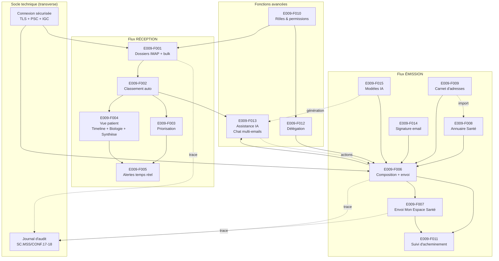

# E009 — Messagerie intelligente MSSante

> **Statut** : 🟢 En cours
> **Modèle** : hand-crafted
> **Version** : 1.30
> **Auteur** : Pascal Cabanel
> **Dernière mise à jour** : 2026-05-16
> **Audience** : PO, médecin, direction produit, conformité.
> **Document frère (vue ingénierie / dette / audit)** : [`E009-Changelogs.md`](./E009-Changelogs.md)

---

## 1. Vision

La **Messagerie intelligente** est un client de messagerie sécurisée destiné aux professionnels de santé, conforme aux exigences Ségur V1 et V2. Elle permet de **recevoir, classer automatiquement, prioriser, traiter et émettre** des documents médicaux via le réseau MSSante, avec une couche d'**intelligence artificielle** intégrée pour assister le praticien dans son quotidien (résumés, tags, recherche sémantique, chat conversationnel).

Le produit s'adresse en priorité au **médecin généraliste**, mais s'étend à la secrétaire médicale, au coordinateur de soins, et — à terme — au patient via Mon Espace Santé. La conformité Ségur est l'objectif de fond, l'IA est le différenciateur produit.

---

## 2. Objectifs métier

- [ ] **Conformité réglementaire** : atteindre 100% des exigences applicables au périmètre messagerie, issues de trois référentiels :
  - **REM Ségur V1/V2** (REM-MDV-LGC-Va2) — 72 exigences identifiées.
  - **Référentiel socle MSSanté #2 v1.0.1** (ANS, 18/01/2024) — 34 exigences `ECO.*` obligatoires pour les BAL personnelles/organisationnelles.
  - **ENS Mon espace santé — Messagerie v1.3** (Assurance Maladie, 28/06/2023) — 6 règles complémentaires pour le volet patient MES.

  Après dédoublonnage (mapping REM ↔ Ref#2), le périmètre total couvre **~85 règles distinctes**. État actuel : 61% conforme + 22% partiel = 83% au moins partiellement couvert. Cible : 100% conforme.

- [ ] **Réduction du temps de traitement** : automatiser le classement des documents reçus pour qu'un compte-rendu d'examen soit présenté pré-classé dans le dossier patient sans intervention manuelle.

- [ ] **Détection des urgences cliniques** : remonter en alerte temps réel 100% des résultats de biologie marqués `AA` / `HH` / `LL` (critique), conformément à BIO/va1.01.

- [ ] **Annuaire intégré performant** : permettre la recherche d'un correspondant par 5 axes simultanés (RPPS, nom, spécialité, localisation, établissement) en moins de 2 secondes (cible UX).

- [ ] **Mode hors-ligne fonctionnel** : permettre la composition, la lecture des messages déjà synchronisés et la mise en file d'attente d'envois pendant une déconnexion réseau, avec synchronisation transparente au retour de la connexion.

- [ ] **Auditabilité complète** : tracer 100% des actions fonctionnelles MSS (lecture, envoi, suppression, intégration, opposition) dans un journal d'audit interrogeable et exportable, conformément à SC.MSS/CONF.17-18.

---

## 3. Acteurs concernés

| Acteur | Rôle dans l'EPIC |
|--------|------------------|
| **Médecin généraliste (Dr. Sophie)** | Utilisateur principal. Reçoit, lit, traite, envoie des documents médicaux. Consulte son tableau de bord, traite les alertes biologie, rédige des messages contextuels au dossier patient, dialogue avec l'IA. |
| **Secrétaire médicale (Marie)** | Gère les contacts, classe les messages entrants pour le médecin, prépare l'envoi de courriers, consulte les boîtes organisationnelles. Couverture actuelle partielle. |
| **Coordinateur de soins (Thomas)** | Suit les threads inter-professionnels autour d'un patient, consulte l'historique des échanges, recherche dans les conversations. Couverture actuelle partielle. |
| **Patient (Mon Espace Santé)** | Destinataire des documents transmis par le médecin via MES. Peut s'opposer à l'envoi MSS pro/patient. Pas de fonction d'émission depuis le produit. |
| **Opérateur MSSante** | Fournit la BAL, applique les politiques de sécurité (TLS, certificats IGC Santé, taille PJ). Référencé via DNS SRV pour l'auto-configuration. |
| **Annuaire Santé (ANS)** | Source de vérité des correspondants (RPPS, MSSante). Interrogé via API FHIR. |
| **Pro Santé Connect (PSC)** | Fournisseur d'identité pour l'authentification du professionnel. Émet les jetons d'accès et de rafraîchissement. |
| **Annuaire DMP / MES** | Source d'INS qualifiées et d'adresses MSSante patient. Consommé par le service d'envoi MES (à implémenter). |

---

## 4. Features de l'EPIC

> Les features sont ordonnées par dépendance logique : socle → réception → émission → fonctions avancées. Chaque feature est autonome (livraison incrémentale possible) tout en partageant le socle technique commun (connexion, sécurité, persistance, notifications).

| # | Feature | Description courte | Dépendances |
|---|---------|--------------------|-------------|
| **E009-F001** | Boîte de réception — gestion IMAP complète | Synchronisation IMAP, **liste et arborescence des dossiers IMAP** (INBOX, Envoyés, Brouillons, Corbeille, dossiers personnalisés), **création / renommage / suppression** de dossiers, **lu/non lu/marqué**, **sélection multiple et opérations en masse** (déplacer, supprimer, marquer lu/non lu, marquer), vue unifiée et vues séparées par BAL (aujourd'hui mono-boîte ; multi-boîtes en cours — cf. F010). | E009-F010 (rôles pour BAL orga) |
| **E009-F002** | Classement automatique INS / CI-SIS | Traitement des documents CDA R2 (N1/N3) et des archives IHE_XDM, extraction INS/patient/auteur/LOINC, rattachement automatique au dossier patient. | Aucune (cœur métier) |
| **E009-F003** | Priorisation et scoring de sévérité | Tags d'urgence, suggestions IA, détection biologie anormale. Tri et filtres orientés priorité. | E009-F002 (métadonnées) |
| **E009-F004** | Vue patient — timeline documents des emails + biologie horizontale + synthèse clinique | Vue dossier patient complète composée de **trois modules** : (a) **Vue temporelle patient** (*Patient Timeline*) — timeline chronologique groupée des documents MSS reçus ; (b) **Timeline biologie horizontale** (*Biology Timeline*) — grille biomarqueurs × dates d'examen avec mini-courbes ; (c) **Synthèse clinique** (*Clinical Synthesis*) — pathologies actives triées par sévérité, ATCD, allergies, biologie anormale récente, facteurs de style de vie. Embarquée via widget dans le shell du LGC hôte et disponible en application autonome. | E009-F002 |
| **E009-F005** | Alertes temps réel | Notifications poussées sur événements à valeur clinique (biologie critique, message urgent, document non lu). Préférences utilisateur (son, desktop, urgence). | E009-F003 |
| **E009-F006** | Composition et envoi de messages MSSante | Édition enrichie, pièces jointes (vérification taille — task-008), brouillons auto-sauvegardés, insertion de signature (F014) et de modèle (F015), accusés de réception (MDN/DSN), en-têtes RFC 5322 conformes, annule et remplace (task-006). | E009-F008, E009-F009, E009-F014, E009-F015 |
| **E009-F007** | Envoi sécurisé vers Mon Espace Santé (DMP) | Sélection patient depuis la base, vérification INS qualifiée, génération du paquet IHE_XDM, en-têtes X-MSS-MES, gestion de l'opposition patient (task-003), gestion des bounces MES, fin d'échange avec usager, adressage mineur. | E009-F006 |
| **E009-F008** | Annuaire Santé intégré | Recherche multicritères dans l'Annuaire ANS via API FHIR (RPPS, nom, spécialité, localisation, établissement, filtre « adresse MSSante présente »). | Aucune |
| **E009-F009** | Carnet d'adresses personnel | CRUD contacts, favoris, groupes, tags, import depuis l'annuaire, fusion de doublons, tri par dernière utilisation. | E009-F008 |
| **E009-F010** | Rôles, permissions et boîtes organisationnelles | Modèle RBAC explicite (médecin / secrétaire / coordinateur), gestion de plusieurs BAL simultanées, droits par boîte. | Aucune (chantier transverse) |
| **E009-F011** | Suivi d'acheminement complet | Au-delà des MDN : suivi envoyé / accepté par l'opérateur / délivré / lu / répondu, vue chronologique par message. | E009-F006 |
| **E009-F012** | Délégation de traitement entre professionnels | Workflow d'attribution d'un message à un autre praticien (avec notification, journal, accusé de prise en charge). | E009-F010 |
| **E009-F013** | Assistance IA — chat multi-emails, résumés, tags, recherche sémantique | Pipeline IA dual on-premise / cloud, activable par feature flag. **Chat IA avec contexte multi-emails** : le médecin sélectionne N emails, crée une conversation, reçoit un résumé consolidé, puis dialogue avec l'IA qui cite les emails sources. **Plugin d'actions métier** exposant 5 actions exécutables par l'IA. Streaming des réponses en temps réel. Résumés automatiques, tags suggérés, recherche sémantique. | E009-F002, E009-F006 |
| **E009-F014** | Signature email | CRUD complet de signatures enrichies (HTML), avec signature par défaut, basculement de la signature par défaut, insertion automatique à la composition (F006). Éditeur WYSIWYG disponible sur les deux frontends. | E009-F006 |
| **E009-F015** | Modèles d'email assistés par IA | CRUD de modèles par catégorie, avec **assistance IA native** : génération d'un modèle complet à partir d'une description en langage naturel, correction orthographique / grammaticale, amélioration de texte paramétrable, détection automatique des placeholders (`{{nom}}`, `{{date}}`). Éditeur enrichi disponible sur les deux frontends. | E009-F006, E009-F013 |

> Le bilan d'avancement par feature (statut, couverture, tasks contributives) est consigné en fin de document, dans la section *État de couverture*.

---

## 5. Workflow entre Features

### 5.1 Vue d'ensemble

### 5.2 Description du workflow

#### Prérequis — Configuration initiale MSSanté

Avant le premier accès à la messagerie, le compte du professionnel doit être associé à une adresse MSSanté. Tant que cette association n'est pas réalisée, un écran **« Messagerie non configurée »** bloque l'entrée du module et propose un parcours guidé. Le médecin saisit son adresse MSSanté et son numéro RPPS dans le formulaire de configuration ; le système valide la connexion à la BAL via une sonde IMAP sécurisée vérifiant la chaîne TLS IGC-Santé. Une fois l'association persistée, un écran invite le médecin à se déconnecter puis se reconnecter pour activer son compte (task-037, durci par task-038).

#### Flux RÉCEPTION

1. **E009-F001 — Boîte de réception et gestion IMAP** : à l'ouverture de la messagerie, l'authentification Pro Santé Connect déverrouille la BAL MSSante du professionnel et la synchronisation s'amorce en arrière-plan. Le praticien consulte son arborescence de dossiers (INBOX, Envoyés, Brouillons, Corbeille, dossiers personnalisés), lit ses messages, marque lu/non lu, signale les messages importants, supprime, envoie un accusé de lecture. La **sélection multiple** active les **opérations en masse** (déplacer, supprimer, marquer lu/non lu, signaler) en un seul geste. En mode hors ligne, les actions du professionnel sont mises en file d'attente et synchronisées automatiquement au retour de la connexion — aucune intervention manuelle requise.

   Depuis la vue détail d'un message, le médecin peut **imprimer** le mail en PDF (en-têtes, corps, liste des pièces jointes, pied de page traçabilité « Imprimé par Dr X le {date} ») ou **télécharger** son contenu source au format EML pour archivage local. L'impression et chacun des deux exports (PDF, EML) sont enregistrés séparément dans le journal d'audit (task-017).

   Un **Mode conversation**, activable depuis les paramètres MSS du praticien, regroupe la liste autour des feuilles de fil : chaque ligne agrégeante affiche un compteur « N messages » et un bouton chevron qui déploie en place les réponses indentées sous le message d'origine. Le médecin retrouve ainsi tout l'historique d'un échange sans quitter la vue liste (task-027).

  
   
  Dashboard avec résumé IA, indicateur, alertes de biologies

  
   
  Réception des messages avec affichage des documents CDA

2. **E009-F002 — Classement automatique** : à chaque message reçu portant une archive IHE_XDM, la messagerie analyse le document CDA (R2 N1 ou N3), extrait l'INS du patient, les traits d'identité, l'auteur, la date d'acte, le code LOINC et la catégorie clinique. Le document est rattaché automatiquement au dossier patient correspondant. Une paire CDA + PDF/A-1 est présentée en **une seule ligne** dans la liste — le praticien ne voit pas le doublon technique (task-010).

   Un **indicateur d'intégration** placé directement sur la ligne d'inbox renseigne le médecin d'un coup d'œil : pastille verte ✓ « tous intégrés » si chaque document médical du message est rattaché à un patient, ou pastille orange ⏳ avec compteur « N en attente » si un ou plusieurs documents nécessitent encore une action. Le même indicateur est rappelé par document dans la vue détail (task-011).

   Quand l'INS portée par le CDA n'est pas qualifiée (matricule incomplet, absence d'OID, traits d'identité partiels), une **bannière amber** s'affiche en tête de la vue détail du message et propose un **rattachement manuel par comparaison visuelle**. Le médecin ouvre une dialog qui liste les patients de la base correspondant aux traits du CDA, classés par score de similarité (nom 40 %, prénom 30 %, date de naissance 20 %, sexe 10 %). Le praticien sélectionne le patient existant à rattacher en un clic ; la bannière disparaît immédiatement (task-012).

   Lorsqu'un nouveau document est reconnu comme **doublon** d'un document déjà reçu, ou comme **nouvelle version** d'un document existant, un badge « DOUBLON » ou « REMPLACÉ » est posé conformément à SC.CDA/INT.18 ; le praticien confirme ou rejette la détection, et navigue entre versions (algorithme normatif task-034 ; bannière de demande de suppression task-015a + task-015b ; lien cliquable « Version précédente » task-015c, robustesse de la navigation task-036).

  
   
  Classement automatique, tags

3. **E009-F003 — Priorisation** : l'assistance IA propose des tags d'urgence sur les messages reçus. Pour les comptes-rendus de biologie, le système identifie automatiquement les résultats critiques (codes HL7 `AA`, `HH`, `LL`, *CriticalLow*, *CriticalHigh*). Les messages émis par un patient via Mon Espace Santé sont visuellement distincts des messages professionnels, et le nom + INS de l'usager sont extraits du libellé pour rester lisibles dans la liste (task-005). Sur chaque compte-rendu portant au moins une valeur anormale, un workflow médico-légal d'acquittement à 5 actions est proposé au médecin avec traçabilité audit — décrit en détail dans le sous-chapitre **Acquittement biologique anormal — workflow médico-légal** ci-dessous, à la suite du Flux RÉCEPTION (task-028).

  
   
  Valeur de biologie + Alerte détectée par IA

4. **E009-F004 — Vue patient complète (Timeline + Biologie + Synthèse clinique)** : au-delà du simple widget « nouveaux documents », le professionnel dispose d'une vue dossier patient articulée en trois modules complémentaires, livrés à parité sur les deux frontends.

   **(a) Vue temporelle patient** (*Patient Timeline*) — timeline chronologique des documents MSS reçus pour le patient. Onglets : *Synthèse Clinique*, *Documents*, *Synthèse Biologie*. Filtres par catégorie (Biologie, Imagerie, Consultation, etc.). Séparateurs temporels (Aujourd'hui, Cette semaine, Semaine dernière, Ce mois…). Groupement par date et pagination. La parité fonctionnelle entre les deux frontends a été établie en task-016.

  
   
  Timeline patient

   **(b) Timeline biologie horizontale** (*Biology Timeline*) — grille **biomarqueurs × dates d'examen**, avec :
   - Mini-courbes (sparklines) par biomarqueur avec bandes d'intervalle de référence superposées.
   - Indicateurs de tendance (*stable*, *en hausse*, *en baisse*) calculés sur la période sélectionnée.
   - Mise en évidence des résultats anormaux par sévérité (codes HL7 `AA`, `HH`, `LL` colorisés).
   - Filtre période : 3 / 6 / 12 mois / tout historique.
   - **11 catégories biologiques** regroupées.

  
   
  Timeline biologie du patient

   **(c) Synthèse clinique** (*Clinical Synthesis*) — synthèse clinique compatible IPS (International Patient Summary) :
   - Section principale : Problèmes actifs, ATCD médicaux, ATCD chirurgicaux, Allergies, Biologie anormale récente.
   - Barre latérale : Facteurs de style de vie, ATCD familiaux, Derniers résultats anormaux.
   - Dédoublonnage par code LOINC / libellé.

  
   
  Problèmes actifs, Allergies, Traitements, Antécédents médicaux, Antécédents chirurgicaux, Antécédents familiaux, Mode de vie

   **(d) Widget Patient sur le dashboard** (task-035) : le médecin voit en page d'accueil les 5 derniers patients ayant au moins un mail non lu, classés par date du mail non lu le plus récent (extensible à 20 via *Voir plus*). Chaque ligne agrège l'identité du patient, le compteur de mails non lus, les catégories CDA présentes (Biologie, Imagerie, Consultation…), un badge de sévérité biologique (🔴 critique, 🟠 anormal), une pastille d'intégration (✓ tous intégrés / ⏳ en attente) et un menu contextuel à 3 actions : *Voir le dossier patient*, *Filtrer mails sur ce patient*, *Voir l'email*. Le widget se rafraîchit en temps réel à l'arrivée d'un nouveau mail enrichi.

5. **E009-F005 — Alertes temps réel** : à chaque nouveau message reçu, le professionnel est averti en temps réel par notification visuelle et sonore, avec le niveau d'urgence apparent (critique, important, normal). L'alerte s'affiche quelle que soit la fenêtre active. Le médecin règle ses préférences depuis les paramètres utilisateur (son, notification bureau, niveau d'urgence minimum déclenchant l'alerte).

#### Acquittement biologique anormal — workflow médico-légal

Quand un compte-rendu de biologie transmis par MSSanté contient au moins une valeur anormale (codes HL7 `L`, `H`, `A`, `LL`, `HH`, `AA`), la messagerie ouvre un workflow d'**acquittement médico-légal** dédié. Le médecin signale explicitement, en plusieurs étapes si nécessaire, qu'il a pris connaissance du résultat et qu'il a engagé une prise en charge auprès du patient (rappel téléphonique, convocation au cabinet, adressage à un confrère) avant de clore définitivement le dossier. Chaque action est tracée de manière non modifiable dans le journal d'audit (modèle *append-only*) avec l'identité du praticien, l'horodatage et une note clinique facultative ; ni l'effacement ni la modification rétroactive ne sont possibles — le médecin peut uniquement **ajouter** une nouvelle action qui devient la dernière de la chaîne. La fonctionnalité est **réservée au rôle Médecin** : les secrétaires et coordinateurs voient la valeur anormale mais n'accèdent ni au compteur du dashboard ni au panel d'acquittement (task-028).

Trois points d'entrée mènent au workflow :

   **(a) Tuile KPI sur le dashboard MSS** — *« Bio en attente d'acquittement »* apparaît dès qu'au moins un compte-rendu reste non résolu. Couleur rouge si un résultat critique est en attente, orange sinon. La tuile affiche un compteur total accompagné d'une ventilation par dernière action posée : *Pris connaissance — N*, *Rappel patient — N*, *Convocation — N*, *Adressage confrère — N*, *Sans acquittement — N*. Chaque ligne est cliquable et ouvre la BAL pré-filtrée sur les mails correspondants, prêts à être traités.

   **(b) Badge sur la ligne d'inbox** — chaque message portant au moins un compte-rendu anormal non résolu affiche un badge compteur. Rouge si critique, orange sinon. Le survol précise *« Bio critique en attente d'acquittement »* ou *« Bio anormale en attente d'acquittement »*.

   **(c) Panel d'acquittement dans la vue détail** — visible sous le mail à l'ouverture d'un compte-rendu portant au moins une valeur anormale. Il se compose :
   - d'un **en-tête contextualisé** avec titre *« Acquittement biologique critique »* (encadrement rouge) ou *« Acquittement biologique »* (encadrement orange) selon la sévérité, suivi d'une **pastille de statut** — 🔴 *À TRAITER* (aucune action posée), 🟡 *EN COURS* (au moins une action intermédiaire), 🟢 *RÉSOLU* (clôture explicite) ;
   - d'une **frise de la dernière action** rappelant l'action prise, le praticien qui l'a posée, la date et l'heure, et la note clinique éventuelle ;
   - de **cinq actions** disposées en deux groupes : quatre boutons chips intermédiaires — *Pris connaissance*, *Rappel patient*, *Convocation*, *Adressage confrère* — et une action de clôture distincte à droite avec icône, *Marquer comme résolu*.

Chaque clic sur une action ouvre une **dialog de confirmation** qui rappelle le code LOINC du document, la liste des valeurs critiques le cas échéant, l'action choisie, et propose un champ de **note clinique facultative** (500 caractères maximum). Sur les comptes-rendus critiques (codes HL7 `LL` / `HH` / `AA`), la dialog adopte un visuel renforcé pour rappeler la responsabilité médico-légale du praticien. Après confirmation, l'action est figée et le panel se met à jour immédiatement : la nouvelle action devient la dernière de la frise, la pastille de statut bascule, et le compteur du dashboard est actualisé. Une fois la prise en charge effective, le médecin clôt le dossier via *Marquer comme résolu* ; le panel se replie alors en **bandeau discret** *« Acquittement résolu — par Dr X · {date} »* pour ne plus encombrer la vue tout en conservant la trace visible.

Sécurité et confidentialité : les acquittements posés par un médecin **ne sont visibles que par ce médecin** (cf. §10, couche 3 ownership scoping). Un associé ou un remplaçant ne voit ni la tuile KPI, ni les notes cliniques, ni l'historique des actions d'un confrère ; pour coordonner une prise en charge, le médecin utilise l'action *Adressage confrère* avec une note explicite, ou envoie un message MSSanté. L'identité du praticien est tracée à chaque acquittement (issue du jeton Pro Santé Connect), et le mode append-only garantit l'inaltérabilité du registre.

Sur le terrain réglementaire, la fonctionnalité matérialise les exigences **RG-E009-051 (BIO/va1.01)** *— alerte spécifique si code interprétation `AA` / `HH` / `LL` (critique)* — et **RG-E009-052 (BIO/va1.05)** *— élément clinique pertinent visible dans la liste messages*. Le journal d'audit MSS est étendu de 5 nouvelles entrées tracées (*BiologyAcknowledged*, *BiologyPatientCalled*, *BiologyPatientSummoned*, *BiologyReferredToColleague*, *BiologyMarkedResolved*) qui s'ajoutent au périmètre déjà couvert par RG-E009-045/046/047 — voir §5.3 *Trace transverse*.

#### Flux ÉMISSION

6. **E009-F008 — Annuaire Santé** : avant un envoi, le praticien recherche un correspondant dans l'Annuaire Santé de l'ANS selon 5 axes (RPPS, nom, spécialité, localisation, recherche combinée). Le résultat est restitué en moins de 2 secondes en utilisation nominale, grâce à une couche de cache qui amortit la charge sur l'annuaire distant.

7. **E009-F009 — Carnet d'adresses** : un correspondant retenu dans l'annuaire est sauvegardé dans le carnet personnel (favori, groupe, tag). À la première interaction avec un confrère (envoi, réception), le contact est créé automatiquement — le praticien retrouve l'historique de ses échanges sans saisie manuelle.

  
   
  Carnet d'adresses / Annuaire

8. **E009-F006 — Composition et envoi** : le brouillon en cours est sauvegardé automatiquement à chaque saisie. L'éditeur permet d'insérer en un clic une **signature** (F014) ou un **modèle** (F015). Le libellé expéditeur est normalisé au format réglementaire `<Titre>_<Prénom>_<NOM>_<Entité>` pour les BAL personnelles, et au libellé fonctionnel pour les BAL organisationnelles (task-009). Les en-têtes MSSanté `X-MSS-INS`, `X-MSS-CODECDA`, `X-MSS-NIL` sont émis automatiquement à l'envoi selon le Référentiel socle MSSanté #2 (task-001). Avant l'envoi, la taille des pièces jointes est contrôlée (défaut 10 Mo, configurable selon l'opérateur — task-008) ; en cas de dépassement, le praticien voit un message explicite et peut retirer une pièce jointe. Quand un destinataire patient est présent, une case **« Bloquer la réponse du patient »** apparaît pour signifier la fin de l'échange — l'en-tête `X-MSS-MES: FIN` est alors émis conformément à ECO.2.2.8 (task-026). Enfin, le médecin peut **republier une version corrigée** d'un document déjà envoyé via « Annule et remplace » (task-006) : le message original apparaît marqué « annulé » dans les envoyés, le destinataire reçoit la nouvelle version avec mention explicite.

  
   
  Nouveau mail, Brouillon automatique, modèle contextuel au patient

8a. **E009-F014 — Signature email** : le praticien crée, modifie, supprime ses signatures enrichies (HTML) depuis l'écran *Mes signatures*. Une signature est désignée *par défaut* et insérée automatiquement à chaque nouvelle composition ; le praticien peut basculer sur une autre signature en un clic. L'éditeur enrichi est disponible à parité sur les deux frontends.

8b. **E009-F015 — Modèles d'email assistés par IA** : le praticien gère ses modèles d'email par catégorie (lettres de liaison, demandes d'examen, accusés). L'**assistance IA** propose 4 actions :
   - **Générer un modèle** à partir d'une description en langage naturel.
   - **Corriger un texte** : correction orthographique et grammaticale en streaming.
   - **Améliorer un texte** avec paramètre d'action (raccourcir, formaliser, adapter au patient).
   - **Détecter les placeholders** automatiquement.

  
   

9. **E009-F007 — Envoi Mon Espace Santé** *(à implémenter)* : sélection du patient depuis la base, vérification de l'identité INS qualifiée, génération du paquet IHE_XDM, émission des en-têtes MSSanté spécifiques (`X-MSS-INS`, `X-MSS-CODECDA`, `X-MSS-MES = "FIN"`), respect de l'opposition patient à l'envoi MES pro et patient (task-003). La validation de la connexion à la BAL MSSanté du professionnel (chaîne TLS IGC-Santé) est assurée en amont par le parcours de configuration initiale décrit en tête de §5.2.

10. **E009-F011 — Suivi d'acheminement** : aujourd'hui, le praticien voit les accusés de lecture (MDN) reçus pour ses envois. Le suivi complet (envoyé → accepté par l'opérateur → délivré → lu → répondu) reste à construire au-dessus.

#### Fonctions avancées

11. **E009-F010 — Rôles et permissions** *(à implémenter)*.

12. **E009-F012 — Délégation** *(à implémenter)*.

13. **E009-F013 — Assistance IA, avec chat multi-emails contextuel** : l'assistance IA est activable ou désactivable par l'établissement. Deux modes d'installation sont disponibles : **on-premise** (les modèles tournent dans l'établissement, aucune donnée ne sort) ou **cloud** (modèles distants).

    **Résumés et tags automatiques** : un résumé est généré pour chaque document médical reçu ; les tags d'urgence et de catégorie sont proposés au praticien.

    **Chat IA avec contexte multi-emails** — le médecin sélectionne plusieurs emails dans sa boîte, ouvre une conversation, reçoit un résumé consolidé, puis dialogue avec l'IA en posant des questions ouvertes. L'IA répond en **citant systématiquement les emails sources** et refuse toute fabrication ; le médecin peut vérifier chaque affirmation en un clic.

    **Plugin d'actions métier** — 5 actions exécutables par l'IA depuis le chat : Composer un email, Répondre à un email, Appeler le patient, Envoyer un SMS au patient, Contacter un confrère.

    **Recherche sémantique** : à partir d'une question en langage naturel, le praticien retrouve un email dans toute sa BAL — la recherche combine sens (sémantique) et mots-clés (lexicale).

    **Recherche structurée à facettes** : en complément de la recherche sémantique, une **dropdown de recherche enrichie** permet de filtrer la BAL selon plusieurs dimensions cumulables — 3 chips de statut (Non lus, Importants, Pièces jointes), 6 chips médicaux (Tous, Biologie, Consultation, Imagerie, Prescription, Hospitalisation), 4 chips de plage temporelle (Aujourd'hui, 7 jours, 30 jours, 3 mois), et un panel de recherche avancée pour préciser De / À ou Cc / Objet / Type de document (14 types disponibles). Un badge à côté du champ de saisie indique le nombre de filtres actifs lorsque la dropdown est repliée (task-029).

  
   

### 5.3 Trace transverse

Toute action fonctionnelle du praticien (lecture, envoi, suppression, rattachement à un patient, opposition patient, déconnexion, impression / export d'email, acquittement biologie, suppression CDA, annule et remplace) est consignée dans le journal d'audit MSSanté (task-004, étendu par task-017 impression/export, task-015b suppression, task-028 acquittement biologie). Chaque entrée porte horodatage, identifiant du praticien, INS patient si pertinent, code LOINC du document, durée de l'action et adresse IP de connexion. L'export CSV du journal est disponible depuis l'écran d'audit pour les besoins de conformité et de contrôle interne.

  
   

---

## 6. Règles métier transverses (conformité Ségur V1/V2)

> Périmètre : **72 exigences** sur 198 du référentiel REM-MDV-LGC-Va2, filtrées sur le périmètre messagerie (hors LGC hôte). Source : `docs/analyse-conformite-messagerie.md`. La traçabilité fine de chaque RG (PR, NuGet, tests) est consignée dans [`E009-Changelogs.md`](./E009-Changelogs.md), annexe C.

### 6.1 Domaine 1 — Interopérabilité avec les opérateurs MSSante (14 exigences)

| ID | Vague | Règle | Statut |
|----|-------|-------|--------|
| RG-E009-001 (SC.MSS/CONF.01) | V2 | Connexion TLS 1.2 minimum avec API LPS | ✅ Implémenté |
| RG-E009-002 (SC.MSS/CONF.03) | V2 | Suites de chiffrement TLS autorisées validées | ✅ Implémenté |
| RG-E009-003 (SC.MSS/CONF.05) | V2 | SMTP conforme RFC 5321 avec STARTTLS | ✅ Implémenté |
| RG-E009-004 (SC.MSS/CONF.06) | V2 | IMAP4 conforme RFC 3501/9051 avec STARTTLS | ✅ Implémenté |
| RG-E009-005 (SC.MSS/CONF.07) | V2 | Cinématique de connexion : TLS puis XOAUTH2 (token PSC) | ✅ Implémenté |
| RG-E009-006 (SC.MSS/CONF.08) | V2 | Erreurs de connexion ne perturbent pas les autres fonctions | ✅ Implémenté |
| RG-E009-007 (SC.MSS/CONF.10) | V2 | Fin de session quand le jeton de rafraîchissement PSC est invalide | 🟡 Partiel |
| RG-E009-008 (SC.MSS/CONF.11) | V2 | Réouverture automatique de session si PSC encore valide | ✅ Implémenté |
| RG-E009-009 (SC.MSS/CONF.14) | V2 | En-tête SMTP `X-MSS-INS` dans messages avec IHE_XDM | ✅ Implémenté (task-001) |
| RG-E009-010 (SC.MSS/CONF.15) | V2 | En-tête SMTP `X-MSS-CODECDA` dans messages avec IHE_XDM | ✅ Implémenté (task-001) |
| RG-E009-011 (SC.MSS/CONF.16) | V2 | En-tête SMTP `X-MSS-NIL` dans tous les courriels | ✅ Implémenté (task-001) |
| RG-E009-012 (SC.MSS/CONF.22) | V2 | Conservation de la dernière CRL non expirée | ✅ Implémenté |
| RG-E009-013 (SC.MSS/CONF.27) | V2 | Certificat IGC Santé gamme Élémentaire Organisation uniquement | ✅ Implémenté |
| RG-E009-014 (SC.MSS/CONF.28) | V2 | Jeton d'accès PSC (JWT) non stocké de façon permanente | ✅ Implémenté |

### 6.2 Domaine 2 — Auto-configuration de la BAL MSSante (1 exigence)

| ID | Vague | Règle | Statut |
|----|-------|-------|--------|
| RG-E009-015 (SC.MSS/CONF.04) | V2 | Auto-configuration BAL via DNS SRV | ✅ Implémenté |

### 6.3 Domaine 3 — Envoi sécurisé vers Mon Espace Santé (5 exigences)

| ID | Vague | Règle | Statut |
|----|-------|-------|--------|
| RG-E009-016 (SC.MSS/CONF.21) | V2 | En-tête `X-MSS-MES = "FIN"` pour bloquer la réponse patient | ✅ Implémenté (task-001 backend + task-026 UI toggle — opérationnellement actionnable) |
| RG-E009-017 (SC.MSS/UX.32) | V2 | Écrire à un usager depuis la base patients | 🟡 Partiel |
| RG-E009-018 (MSS/va1.01) | V1 | Transmettre documents Ségur aux patients via MSS (IHE_XDM) | 🟡 Partiel |
| RG-E009-019 (MSS/va1.20) | V1 | Enregistrer opposition du patient à l'envoi MSS patient | ✅ Implémenté (task-003) |
| RG-E009-020 (MSS/va1.22) | V1 | Enregistrer opposition du patient à l'envoi MSS professionnel | ✅ Implémenté (task-003) |

### 6.4 Domaine 4 — Intégration de l'Annuaire Santé (6 exigences)

| ID | Vague | Règle | Statut |
|----|-------|-------|--------|
| RG-E009-021 (SC.MSS/CONF.20) | V2 | Recherche d'une adresse MSSante dans l'Annuaire Santé | ✅ Implémenté |
| RG-E009-022 (SC.MSS/UX.41) | V2 | Recherche multicritères : RPPS, nom, profession, spécialité, lieu | ✅ Implémenté |
| RG-E009-023 (ANN/va1.01) | V1 | Intégrer Annuaire santé.fr (extraction publique ou API FHIR) | ✅ Implémenté |
| RG-E009-024 (ANN/va1.02) | V1 | Intégrer données Annuaire pour les utilisateurs | ✅ Implémenté |
| RG-E009-025 (ANN/va1.03) | V1 | Intégrer données Annuaire pour les correspondants | ✅ Implémenté |
| RG-E009-026 (ANN/va1.04) | V1 | Appels unitaires en temps réel via API FHIR | ✅ Implémenté |

### 6.5 Domaine 5 — Intégration et gestion des documents reçus (10 exigences)

| ID | Vague | Règle | Statut |
|----|-------|-------|--------|
| RG-E009-027 (LGC.MSS/UX.05) | V2 | Gérer messages de suppression / modification de documents intégrés | ✅ Implémenté (task-015a backend + task-015b UI accept/refuse + task-015c navigation versions) |
| RG-E009-028 (SC.MSS/UX.25) | V2 | Distinguer messages professionnels vs patients | ✅ Implémenté (task-005) |
| RG-E009-029 (SC.MSS/UX.28) | V2 | Masquer le préfixe `XDM/1.0/DDM+` dans l'objet | ✅ Implémenté (task-002) |
| RG-E009-030 (SC.MSS/UX.31) | V2 | Afficher nom/prénom/INS de l'usager | ✅ Implémenté (task-005) |
| RG-E009-031 (LGC.MDV.06) | V2 | Informer que le document a déjà été intégré | ✅ Implémenté (task-011) |
| RG-E009-032 (MSS/va1.25) | V1 | Restituer métadonnées CDA dans la liste messages reçus | ✅ Implémenté |
| RG-E009-033 (MSS/va1.27) | V1 | Rattachement patient par comparaison visuelle si INS sans identité qualifiée | ✅ Implémenté (task-012) |
| RG-E009-034 (MSS/va1.28) | V1 | Visualiser et classer en 1 clic dans le dossier patient | 🟡 Partiel |
| RG-E009-035 (ERGO/va1.05) | V1 | Liste messages : tri / filtre par date, patient, lu/non lu, type | ✅ Implémenté |
| RG-E009-036 (ERGO/va1.08) | V1 | Liste messages reçus transversale depuis MSS | ✅ Implémenté |

### 6.6 Domaine 6 — Envoi de messages et documents CDA (7 exigences)

| ID | Vague | Règle | Statut |
|----|-------|-------|--------|
| RG-E009-037 (MSS/va1.08) | V1 | En-têtes `Message-ID`, `In-Reply-To`, `References` conformes RFC 5322 | ✅ Implémenté |
| RG-E009-038 (MSS/va1.11) | V1 | `Content-Type` `text/plain` ou `multipart/alternative` | ✅ Implémenté |
| RG-E009-039 (MSS/va1.12) | V1 | `Message-ID` conforme RFC 5322 | ✅ Implémenté |
| RG-E009-040 (MSS/va1.13) | V1 | Pièce jointe respecte la taille maximale (selon opérateur) | ✅ Implémenté (task-008) |
| RG-E009-041 (MSS/va1.14) | V1 | Afficher la bonne réception si accusé de réception (MDN) | ✅ Implémenté |
| RG-E009-042 (MSS/va1.15) | V1 | Permettre la demande d'accusé DSN (`Return-Receipt-To`) | ✅ Implémenté |
| RG-E009-043 (MSS/va1.16) | V1 | Libellé signifiant en complément de l'adresse expéditeur | ✅ Implémenté (task-009) |
| RG-E009-044 (AMBU.MSS/va1.02) | V1 | Nouvelle version avec mention « annule et remplace » | ✅ Implémenté (task-006) |

### 6.7 Domaine 7 — Production et conservation de traces MSS (3 exigences)

| ID | Vague | Règle | Statut |
|----|-------|-------|--------|
| RG-E009-045 (SC.MSS/CONF.17) | V2 | Traces fonctionnelles pour tous les traitements sur la BAL | ✅ Implémenté (task-004 — étendu par task-017 / task-015b / task-028) |
| RG-E009-046 (SC.MSS/CONF.18) | V2 | Chaque trace : identifiant auteur, horodatage, type d'action, demande serveur | ✅ Implémenté (task-004) |
| RG-E009-047 (SC.MSS/UX.37) | V2 | Tracer et historiser tous les flux de transmissions MSSante | ✅ Implémenté (task-004) |

### 6.8 Domaine 8 — Gestion des professionnels associés (1 exigence)

| ID | Vague | Règle | Statut |
|----|-------|-------|--------|
| RG-E009-048 (LABEL.06) | V2 | Gérer la liste des professionnels associés à la prise en charge | 🟡 Partiel |

### 6.9 Domaine 9 — Biologie médicale reçue par MSSante (6 exigences)

| ID | Vague | Règle | Statut |
|----|-------|-------|--------|
| RG-E009-049 (LGC.MDV.08) | V2 | Intégrer CR de biologie conformément au CI-SIS | ✅ Implémenté |
| RG-E009-050 (LGC.MDV.09) | V2 | Exploiter le jeu de valeurs Circuit de la biologie, conversion d'unités | 🔴 Non implémenté |
| RG-E009-051 (BIO/va1.01) | V1 | Alerte spécifique si code interprétation `AA` / `HH` / `LL` (critique) | ✅ Implémenté (renforcé par acquittement médico-légal task-028) |
| RG-E009-052 (BIO/va1.05) | V1 | Élément clinique pertinent visible dans la liste messages | ✅ Implémenté |
| RG-E009-053 (BIO/va1.06) | V1 | Signaler résultats en écart par rapport à l'intervalle de référence | 🟡 Partiel |
| RG-E009-054 (BIO/va1.08) | V1 | Afficher CR biologie CDA R2 N3 avec feuille de style | ✅ Implémenté |

### 6.10 Domaine 10 — Affichage des documents CDA reçus (4 exigences)

| ID | Vague | Règle | Statut |
|----|-------|-------|--------|
| RG-E009-055 (SC.CDA/DD.15) | V2 | Une seule ligne pour CDA R2 N3 avec PDF encapsulé | ✅ Implémenté (task-010) |
| RG-E009-056 (SC.CDA/VISU.03) | V2 | Afficher préférentiellement le PDF encapsulé | ✅ Implémenté (task-010) |
| RG-E009-057 (SC.CDA/VISU.01) | V2 | Rendre lisible un CDA (en-tête, corps N1, parties narratives N3) | ✅ Implémenté |
| RG-E009-058 (SC.CDA/INT.18) | V2 | Vérifier la cohérence de tout document CDA reçu (détection doublons) | ✅ Implémenté (task-013 puis normative INT.18 task-034) |

### 6.11 Domaine 11 — Navigation dossier patient (4 exigences)

| ID | Vague | Règle | Statut |
|----|-------|-------|--------|
| RG-E009-059 (SC.CDA/INT.04) | V2 | Trier les documents importés par type et date | ✅ Implémenté |
| RG-E009-060 (SC.CDA/INT.08) | V2 | Identifier visuellement l'origine (DMP / MSSante) | ✅ Implémenté |
| RG-E009-061 (SC.CDA/INT.17) | V2 | Informations de tri par défaut issues du CDA | ✅ Implémenté |
| RG-E009-062 (LGC.DMP/UX.10) | V2 | Système fonctionnel sans bloquer l'interface | ✅ Implémenté |

### 6.12 Domaine 12 — Authentification PSC (1 exigence)

| ID | Vague | Règle | Statut |
|----|-------|-------|--------|
| RG-E009-063 (SC.PSC.01) | V2 | Configurer PSC comme fournisseur d'identité | ✅ Implémenté |

### 6.13 Domaine 13 — Sécurité (3 exigences)

| ID | Vague | Règle | Statut |
|----|-------|-------|--------|
| RG-E009-064 (SC.SSI/IE.33) | V2 | Gérer identifiants professionnel (RPPS, nom, prénom, profession) | ✅ Implémenté |
| RG-E009-065 (SC.SSI/IE.38) | V2 | Permettre au professionnel de fermer sa session | 🟡 Partiel |
| RG-E009-066 (SC.SSI/IE.58) | V2 | Verrouillage automatique après 2h d'inactivité | 🔴 Non implémenté |

### 6.14 Domaine 14 — Identité patient (2 exigences)

| ID | Vague | Règle | Statut |
|----|-------|-------|--------|
| RG-E009-067 (SENTINELLE.20) | V2 | Recherche identité connue à la réception d'un document avec INS qualifiée | 🟡 Partiel |
| RG-E009-068 (INS/va1.53) | V1 | Ne pas transmettre l'INS si identité non qualifiée | 🟡 Partiel |

### 6.15 Exigences complémentaires du Ref#2 v1.0.1 non mappées au REM Ségur

> Règles issues directement du *Référentiel socle MSSanté #2 v1.0.1* (ANS, 18/01/2024), absentes de la grille REM-MDV-LGC-Va2 mais obligatoires pour tout éditeur de client de messagerie MSSanté.

| ID | Ref#2 | Règle | Texte Ref#2 (résumé fidèle) | Statut |
|----|-------|-------|-----------------------------|--------|
| RG-E009-075 | ECO.1.1.5 (§ 2.1.1.2.3, p.12) | Vérifier expiration du certificat serveur | « Le système DOIT vérifier que le certificat présenté par l'Opérateur MSSanté n'est pas expiré. » | ✅ Implémenté |
| RG-E009-076 | ECO.1.1.6 (§ 2.1.1.2.3, p.12) | Vérifier révocation du certificat serveur | « Le système MSSanté DOIT vérifier que le certificat présenté par l'Opérateur MSSanté n'est pas révoqué au moyen des CRL ou du répondeur OCSP. » | ✅ Implémenté |
| RG-E009-077 | ECO.2.1.2 (§ 3.1.2, p.42) | Identifier l'usager via patientId dans METADATA.XML | « Pour identifier l'usager concerné par un courriel, le système destinataire DOIT se référer à la métadonnée `patientId` (matricule INS) contenu dans le fichier METADATA.XML du document CDA contenu dans la pièce jointe IHE_XDM.zip du courriel. » | ✅ Implémenté |
| RG-E009-078 | ECO.2.1.3 (§ 3.1.3, p.42) | Format de l'objet du courriel | « L'objet du courriel DOIT respecter le format suivant : `XDM/1.0/DDM+<libellé> <NOM> <prenom> <date de naissance>`. » | 🟡 Partiel |
| RG-E009-079 | ECO.2.1.5 (§ 3.1.1, p.21) | PDF/A-1 généré depuis le CDA | « Chaque PDF/A-1 rattaché au courriel MSSanté DOIT être généré à partir du ou des documents CDA correspondants contenus dans l'archive ZIP au format IHE_XDM. » | 🟡 Partiel |
| RG-E009-080 | ECO.2.1.6 (§ 3.1.1, p.22) | Convention de nommage des PDF | « Les fichiers PDF en PJ DOIVENT respecter : `<date de l'acte>_<type document>_<NOM>_<prenom>_<numéro de dossier>.pdf`. » | ✅ Implémenté (task-010) |
| RG-E009-081 | ECO.2.2.3 (§ 3.3.1, p.25) | Encodage UTF-8 des parties texte | « Le système MSSante DOIT utiliser l'encodage UTF-8 pour les parties `text` du corps des courriels. » | ✅ Implémenté |
| RG-E009-082 | ECO.2.2.6 (§ 3.4.2, p.28) | Adresse usager construite depuis INS qualifiée | « Un système, qui envoie des courriels MSSanté à des usagers, DOIT utiliser des adresses usagers construites à partir d'Identités Nationales de Santé « qualifiées ». » | 🔴 Non implémenté (bloquant pour E009-F007) |
| RG-E009-083 | ECO.3.1.6 (§ 4.6, p.36) | Permettre de retourner un MDN à la réception | « Le système DOIT permettre de retourner un accusé de lecture (MDN) lorsqu'un message reçu le demande. » | 🟡 Partiel |

### 6.16 Exigences ENS Mon espace santé v1.3 (volet E009-F007)

> Règles issues du document *Eléments d'information à destination des éditeurs de solution MSSanté pour les professionnels — ENS Mon espace santé Messagerie V1.3* (Assurance Maladie / CNAM Dionis, 28/06/2023).

| ID | Réf. ENS | Règle | Texte ENS (résumé fidèle) | Statut |
|----|----------|-------|---------------------------|--------|
| RG-E009-084 | § 2, p.4 | Adressage des usagers mineurs | « Lorsque les données de santé transmises par Messagerie concernent un usager mineur, il faut écrire à l'adresse de messagerie usager de l'usager mineur, et non sur l'adresse de Messagerie du/des représentants légaux. » | 🔴 Non implémenté (bloquant pour E009-F007) |
| RG-E009-085 | § 6, p.8-10 | Gestion des messages de bounce MES | À réception d'un message « Message non distribué » renvoyé par MES, identifier la cause (messagerie fermée, patient non trouvé, adresse invalide, `Undelivered Mail Returned to Sender` pour taille dépassée) et présenter une erreur explicite au professionnel. | 🔴 Non implémenté |
| RG-E009-086 | § 6, p.10 | Limite stricte de 25 Mo pour envoi vers MES | « Un Professionnel envoie un message qui dépasse la taille limite totale de 25 Mo. » | 🟡 Partiel |
| RG-E009-087 | § 7, p.12-13 | Fin d'échange avec un usager | 2 méthodes distinctes possibles : (1) objet `[FIN]` ; (2) entête `X-MSS-MES = "FIN"` (ECO.2.2.8, méthode **privilégiée**). | ✅ Implémenté (task-001 — méthode 2) |
| RG-E009-088 | § 6, p.10-11 | MDN RFC 8098 pour messages vers MES | « Le mécanisme MDN est décrit dans la RFC 8098 et peut être déclenché par le professionnel en ajoutant l'entête SMTP suivante : `Disposition-Notification-To: <adresse_mssante_de_l'expéditeur>`. » | 🟡 Partiel |
| RG-E009-089 | § 9, p.15 | Gestion du `reply-to` dans messages patient | Lorsqu'un message envoyé à un usager dispose d'une entête `reply-to` valorisée avec une adresse MSS, le patient peut répondre à la BAL indiquée dans le `reply-to`. | 🟡 Partiel |

### 6.17 Règles transverses (non Ségur, métier produit)

| ID | Règle | Description |
|----|-------|-------------|
| RG-E009-069 | Iso-fonctionnalité multi-frontends | Toute feature visible doit être livrée à parité fonctionnelle sur le frontend embarqué ET sur le frontend autonome. |
| RG-E009-070 | Mode hors ligne | La composition de message, la lecture des messages déjà synchronisés et la mise en file d'attente d'envois doivent fonctionner sans réseau. |
| RG-E009-071 | IA optionnelle et désactivable | L'assistance IA est désactivable via feature flag. Le mode on-premise est possible. |
| RG-E009-072 | Iso-fonctionnalité « avec / sans IA » | Aucune fonction critique (réception, classement, envoi) ne doit dépendre de l'IA. |
| RG-E009-073 | Test-first sur le backend | Toute logique métier ajoutée doit être couverte par >= 1 test unitaire ; tout endpoint par >= 1 test d'intégration (CLAUDE.md règles 1 et 1b). |
| RG-E009-074 | DOD vérifiable par `/review` | Chaque task `todo-*.md` doit lister une `## Definition of Done` 100% binaire. |

---

## 7. Contraintes et hypothèses

### Contraintes techniques

- **Connexion sécurisée** : TLS 1.2 minimum vers les opérateurs MSSante, authentification Pro Santé Connect (PSC), suites de chiffrement validées, certificats IGC Santé gamme Élémentaire Organisation uniquement.

- **Standards d'interopérabilité** : RFC 5321 (SMTP), RFC 3501 / 9051 (IMAP4), RFC 5322 (en-têtes mail), CI-SIS (CDA R2 N1/N3, IHE_XDM), HL7 (ObservationInterpretation, RoleCode), LOINC, OID.

- **Référentiels** : Annuaire Santé via API FHIR, codes LOINC, jeux de valeurs CI-SIS.

- **Conformité réglementaire** : Ségur V1 et V2 (REM-MDV-LGC-Va2), RGPD, Hébergement de Données de Santé (HDS).

- **Architecture multi-frontends** : **frontend embarqué** dans le shell du LGC hôte via un système de plugin **et frontend autonome** accessible en application web.

- **Persistance** : base relationnelle avec extension vectorielle pour la recherche sémantique.

- **Notifications temps réel** : canaux push côté frontend embarqué et flux d'événements serveur côté frontend autonome, avec préférences par utilisateur.

- **Mode hors ligne** : services de synchronisation en arrière-plan, file d'attente d'actions hors ligne, cache local des messages déjà synchronisés.

- **Polyrepo** : le produit est constitué de plusieurs dépôts indépendants (backend MSS, frontend embarqué, frontend autonome, contrats partagés, bibliothèque d'interopérabilité CDA), gérés en branches alignées `feat/{task-id}-{slug}` (cf. CLAUDE.md règle « 1 US = 1 branche partagée »).

### Hypothèses

- L'**API FHIR de l'Annuaire Santé** est disponible et reste rétrocompatible sur la durée de vie du produit. Latence acceptable < 2s par recherche multicritères (cible UX). En cas de panne, dégradation gracieuse (recherche limitée au carnet local).

- L'**infrastructure de recherche vectorielle** est provisionnée pour la recherche sémantique (embeddings dim 768 ou 1536 selon le modèle).

- Les **moteurs IA** sont disponibles selon l'un des deux modes : on-premise ou cloud. Le choix est fait par l'établissement à l'installation et peut être désactivé en feature flag.

- L'utilisateur est **authentifié via Pro Santé Connect** avant toute action MSS.

- Le **Dossier Médical Partagé (DMP) / Mon Espace Santé** est accessible via les opérateurs MSSante dédiés (`@patient.mssante.fr`). L'homologation CNDA pour l'envoi MES sera demandée séparément lorsque E009-F007 sera prêt à passer en production.

- Le **Logiciel de Gestion de Cabinet (LGC)** hôte prend en charge les fonctions hors périmètre messagerie (intégration au dossier patient en 1 clic, opposition patient au niveau du dossier, rapprochement INS).

- Le **professionnel de santé** dispose d'une carte CPS ou e-CPS pour l'authentification PSC et possède un compte MSSante actif.

- Les **opérateurs MSSante** publient leurs configurations (serveurs IMAP, SMTP, capacités, taille max PJ) selon les conventions DNS SRV décrites dans le Ref#2.

---

## 8. Critères d'acceptation de l'EPIC

> Cet EPIC est un produit vivant : il restera « en cours » tant que les évolutions du référentiel Ségur ou des opérateurs MSSante imposent des mises à jour. Les critères ci-dessous définissent l'état « v1.0 conformité Ségur complète ».

- [ ] Toutes les Features de la table 4 sont au moins **🟢 implémentées à 100%** (12/15 aujourd'hui ; reste E009-F007 envoi MES, E009-F010 rôles, E009-F011 suivi d'acheminement complet, E009-F012 délégation).

- [ ] **100% des règles réglementaires identifiées en statut « ✅ Implémenté »** :
  - RG-E009-001 à RG-E009-068 (REM Ségur V1/V2, 14 domaines).
  - RG-E009-075 à RG-E009-083 (Ref#2 v1.0.1 complémentaires, 9 règles).
  - RG-E009-084 à RG-E009-089 (ENS Mon espace santé v1.3, 6 règles MES).

  Cible : 0 ligne 🟡 ou 🔴 dans les tableaux des sections 6.1 à 6.16. Total = **83 règles réglementaires** (les RG 069-074 sont transverses produit, non Ségur).

- [ ] **Build vert** sur les dépôts pushés (backend MSS, frontend embarqué, contrats partagés) sur la branche `develop`.

- [ ] **Tests verts** : 0 échec sur les projets de test du backend MSS et sur les tests des deux frontends.

- [ ] **Couverture endpoints** : chaque endpoint du backend a au moins 1 test d'intégration (CLAUDE.md règle 1b).

- [ ] **Iso-fonctionnalité entre les deux frontends** vérifiée sur chaque feature visible (manual test plan dans chaque task).

- [ ] **Mode hors ligne** validé : composition + lecture + file d'attente d'envois fonctionnels sans réseau, synchronisation transparente au retour.

- [ ] **Audit trail complet** : 100% des actions fonctionnelles MSS tracées et exportables en CSV.

- [ ] **Homologation CNDA** obtenue pour l'envoi vers Mon Espace Santé (prérequis à la mise en production de E009-F007).

- [ ] **Documentation utilisateur** rédigée (hors périmètre forge, responsabilité produit).

- [ ] **Validation humaine end-to-end** sur les 3 personas couverts (médecin, secrétaire, coordinateur) selon les Manual Test Plans des tasks correspondantes.

---

## 9. Hors périmètre

Les éléments suivants sont **explicitement exclus** de cet EPIC. S'ils deviennent pertinents, ils donneront lieu à un EPIC distinct.

- **Messagerie instantanée / chat interprofessionnel** (différent de la messagerie asynchrone MSSante).
- **Téléconsultation** (visioconférence, prise de rendez-vous vidéo).
- **GED avancée** au-delà du stockage des documents reçus / envoyés (versionnement, workflows d'approbation, signature électronique qualifiée).
- **Prise de rendez-vous** (l'agenda est un autre module produit).
- **Facturation et tarification** (FSE, télétransmission, SESAM-Vitale).
- **Dossier Médical Partagé (DMP)** hors volet messagerie.
- **Intégration directe au LGC hôte** : l'envoi contextuel depuis un document du LGC est partiellement implémenté côté composition ; l'intégration complète au pipeline LGC est pilotée par l'éditeur du LGC, hors scope de ce projet.
- **Support multi-langues de l'interface** : version française uniquement pour la v1.0.
- **Application mobile native**.
- **Signature électronique qualifiée** des documents transmis (au-delà de la signature CDA standard).
- **Conversion automatique d'unités biologiques inter-CR** (RG-E009-050 identifié comme non implémenté, actuellement non priorisé).

---

## 10. Sécurité applicative — Identifiants opaques et défense en profondeur

> Chapitre transverse non-Ségur, ouvert le 2026-04-29, **clos le 2026-05-02**.
> Couvre les trois couches de défense anti-IDOR de la plateforme. Le détail
> ingénierie (découpage tasks, audit grep, limites résiduelles techniques)
> est dans [`E009-Changelogs.md`](./E009-Changelogs.md), section
> *Sécurité applicative — Détails techniques*.

### 10.1 Motivation

Avant ce chantier, l'ensemble des entités persistées en Postgres exposaient des **clés primaires `int` auto-incrémentales** côté API. Trois conséquences non-acceptables pour une plateforme de messagerie médicale :

1. **Énumération IDOR triviale** — un attaquant peut balayer `for i in 1..N` et inférer l'existence des ressources voisines.
2. **Information disclosure** — les Ids monotones révèlent le rythme de création.
3. **Hack `BitConverter`** — un raccourci historique faisait `BitConverter.ToInt32(Guid.ToByteArray(), 0)` pour caster le Guid du DTO en int côté repo, avec un risque de collision birthday d'environ 1/65k sur 4 octets (16 bits effectifs).

L'objectif était double : **éliminer l'énumération URL** (anti-IDOR de surface) et **supprimer définitivement** le hack BitConverter.

### 10.2 Choix UUID v7 — RFC 9562

Le standard retenu est **UUID v7** (RFC 9562, finalisée mai 2024) plutôt que v4 :

| Critère | UUID v4 | UUID v7 |
|---|---|---|
| Non-prédictibilité | ✅ Aléatoire | ✅ Random tail (74 bits) |
| Tri temporel | ❌ Non | ✅ Prefix Unix epoch ms (48 bits) |
| B-tree friendliness | ❌ Inserts aléatoires → page splits | ✅ Inserts append-like |
| Indexabilité Postgres | Médiocre sur grosses tables | Excellente |
| Génération .NET | `Guid.NewGuid()` | `Guid.CreateVersion7()` (.NET 9+ natif) |

La génération est faite **côté .NET** via un générateur dédié câblé dans la couche d'accès aux données.

### 10.3 Convention scellée

À l'issue du chantier (tasks 018 → 019 → 020), les conventions suivantes sont **figées** sur api-mail / dtos-mss / client-blazor / client-angular :

1. **Routes API** : tout id de ressource est typé `{id:guid}` dans le route template ASP.NET Core. Aucune route `{*:int}` ne doit être réintroduite.
2. **Génération PK** : exclusivement `Guid.CreateVersion7()`. `Guid.NewGuid()` (v4) reste autorisé dans les tests, mais pas en production.
3. **Type DTO C#** : `Guid` / `Guid?` partout pour les Ids et les FK exposés ; `string` réservé aux identifiants externes (email, claim JWT, INS, RPPS).
4. **Type modèle TypeScript Angular** : `string` pour tout id de ressource ; `number` réservé aux UID IMAP (qui sont une primitive du protocole IMAP, pas une PK métier).
5. **Pas de legacy** : tout cast Guid → int (hack `GetIntId`, `BitConverter.ToInt32` sur byte arrays Guid) est définitivement interdit.

### 10.4 Stratégie de défense en profondeur — vue d'ensemble

| Couche | Vise | État |
|---|---|---|
| 1. Identifiants opaques (Guid v7) | Anti-énumération URL | 🟢 Implémentée (tasks 018+019+020) |
| 2. Authentification cryptographique JWT | Anti-spoofing d'identité | 🟢 Implémentée (task-021) |
| 2bis. SSE & endpoints anonymes | Anti-leak temps réel | 🟢 Implémentée (task-022) |
| 3. Ownership scoping repos | Anti-cross-tenant après leak Guid | 🟢 Implémentée (task-023) |

**Bilan du chantier sécurité E009** : les **3 couches** de défense en profondeur sont désormais en place. La plateforme est défendue contre :

1. **L'énumération d'URL** — les PK Postgres sont en Guid v7 RFC 9562, un attaquant ne peut plus deviner l'Id voisin (probabilité ≈ 0).
2. **L'usurpation d'identité par header / query string** — l'auth passe désormais par le pipeline AuthN/AuthZ ASP.NET Core (`AddJwtBearer` + `FallbackPolicy = RequireAuthenticatedUser`). Les flux SSE résolvent l'email exclusivement depuis le claim JWT validé.
3. **L'accès cross-tenant via leak de Guid** — toute méthode repository qui prend un `Guid id` filtre cumulativement par `UserId` ; les controllers retournent **404 sur ownership KO** (jamais 403 pour ne pas leaker l'existence du Guid).

Le **seul vecteur IDOR résiduel** identifié serait un compromis de la table `Users` elle-même (forge d'un JWT signé), ce qui suppose une compromission du Keycloak ou de la BDD — hors périmètre application, traité au niveau infrastructure.

---

## Annexes

### A. Sources documentaires

#### Sources primaires

- **Référentiel socle MSSanté #2 — Clients de Messageries Sécurisées de Santé**, ANS, version 1.0.1 du 18/01/2024, 57 pages. Définit **34 exigences `ECO.*` obligatoires** pour les BAL personnelles/organisationnelles (§ 6.1.1) et les exigences complémentaires pour BAL applicatives (§ 6.1.2). Base de la conformité technique MSSanté.

- **Eléments d'information à destination des éditeurs de solution MSSanté pour les professionnels — ENS Mon espace santé Messagerie V1.3**, Assurance Maladie / CNAM Dionis, 28/06/2023, 15 pages. Précise les **comportements spécifiques à MES** : adressage mineurs, bounces, fin d'échange, MDN RFC 8098, `reply-to`. Base de E009-F007.

#### Sources secondaires (contextuelles)

- `docs/synthese-direction-messagerie.md` (2026-04-11) — synthèse direction produit, indicateurs de couverture par phase et par persona.
- `docs/analyse-conformite-messagerie.md` (juillet 2025) — analyse fonctionnelle vs spécification NOVA + matrice des 72 exigences REM Ségur, cartographie fonctionnelle.
- `docs/Referentiel/MSSANTE/Guide_de_mise_en_oeuvre_MSSante_et_alimentationDMP_v1.0.0_20160323 (1).pdf` — guide historique MSSante / DMP (2016).
- `docs/Referentiel/MSSANTE/ANS_MSS_Manuel_d'utilisation_Outil_de_test_editeurs_MOTCO2_publique_20231220_v1.0-rwceJ8RA.pdf` — manuel de l'outil de test éditeurs MOTCO2.

> La liste exhaustive des tasks contributives et leurs apports techniques détaillés est dans [`E009-Changelogs.md`](./E009-Changelogs.md), annexe C.

### B. Table de correspondance REM Ségur ↔ Ref#2

> Référence croisée pour naviguer entre la numérotation REM Ségur (REM-MDV-LGC-Va2) utilisée en section 6.1-6.14 et la numérotation ECO.* du Ref#2 v1.0.1. Utile pour les audits de conformité.

| REM Ségur | Ref#2 ECO.* | Règle | RG-E009 |
|-----------|-------------|-------|---------|
| SC.MSS/CONF.01 | ECO.1.1.1 | TLS 1.2 minimum | RG-E009-001 |
| SC.MSS/CONF.03 | ECO.1.1.3 | Suites de chiffrement | RG-E009-002 |
| SC.MSS/CONF.05 | ECO.1.0.1 | SMTP + STARTTLS | RG-E009-003 |
| SC.MSS/CONF.06 | ECO.1.0.2 | IMAP4 + STARTTLS | RG-E009-004 |
| SC.MSS/CONF.07 | ECO.1.2.1 | Cinématique TLS + XOAUTH2 | RG-E009-005 |
| SC.MSS/CONF.08 | ECO.1.2.3 | Isolation des erreurs | RG-E009-006 |
| SC.MSS/CONF.10 | ECO.1.2.6 | Fin session sur jeton de rafraîchissement invalide | RG-E009-007 |
| SC.MSS/CONF.11 | ECO.1.2.7 | Réouverture automatique | RG-E009-008 |
| SC.MSS/CONF.14 | ECO.2.4.2 | Entête X-MSS-INS | RG-E009-009 |
| SC.MSS/CONF.15 | ECO.2.4.1 | Entête X-MSS-CODECDA | RG-E009-010 |
| SC.MSS/CONF.16 | ECO.2.4.3 | Entête X-MSS-NIL | RG-E009-011 |
| SC.MSS/CONF.22 | ECO.1.1.7 | Conservation dernière CRL | RG-E009-012 |
| SC.MSS/CONF.27 | ECO.1.1.10 | Certificat IGC Santé Organisation | RG-E009-013 |
| SC.MSS/CONF.28 | ECO.1.2.5 | Jeton d'accès PSC non permanent | RG-E009-014 |
| SC.MSS/CONF.04 | ECO.1.1.9 | Auto-configuration DNS SRV | RG-E009-015 |
| SC.MSS/CONF.21 | ECO.2.2.8 | Entête X-MSS-MES "FIN" | RG-E009-016 |
| SC.MSS/UX.32 | ECO.3.1.5 | Écrire à un usager | RG-E009-017 |
| MSS/va1.01 | ECO.2.1.1 | Documents IHE_XDM | RG-E009-018 |
| SC.MSS/UX.25 | ECO.3.1.1 | Distinguer pro/patient | RG-E009-028 |
| SC.MSS/UX.28 | ECO.3.1.3 | Masquer préfixe XDM | RG-E009-029 |
| SC.MSS/UX.31 | ECO.3.1.2 | Afficher nom/INS usager | RG-E009-030 |
| MSS/va1.08 | ECO.2.2.2 | Entêtes RFC 5322 réponse | RG-E009-037 |
| MSS/va1.11 | ECO.2.2.4 | Content-Type | RG-E009-038 |
| MSS/va1.12 | ECO.2.2.1 | Message-ID | RG-E009-039 |
| MSS/va1.14 | ECO.3.1.6 (retour) | Retour MDN | RG-E009-041 + RG-E009-083 |
| MSS/va1.15 | ECO.2.3.1 | Demande DSN | RG-E009-042 |
| MSS/va1.16 | ECO.2.2.7 | Libellé signifiant expéditeur | RG-E009-043 |
| SC.MSS/CONF.17 | ECO.4.1.1 | Traces fonctionnelles | RG-E009-045 |
| SC.MSS/CONF.18 | ECO.4.1.2 | Contenu de la trace | RG-E009-046 |
| SC.MSS/CONF.20 | ECO.3.1.4 | Recherche Annuaire Santé | RG-E009-021 |
| — | ECO.1.1.5 | Expiration certificat | RG-E009-075 |
| — | ECO.1.1.6 | Révocation certificat | RG-E009-076 |
| — | ECO.2.1.2 | patientId METADATA.XML | RG-E009-077 |
| — | ECO.2.1.3 | Format objet XDM/1.0/DDM+ | RG-E009-078 |
| — | ECO.2.1.5 | PDF/A-1 depuis CDA | RG-E009-079 |
| — | ECO.2.1.6 | Nommage PDF | RG-E009-080 |
| — | ECO.2.2.3 | UTF-8 | RG-E009-081 |
| — | ECO.2.2.6 | Adresse usager = INS qualifiée | RG-E009-082 |

Les règles `BIO/va1.*`, `ANN/va1.*`, `SC.CDA/*`, `LGC.*`, `SC.SSI/*`, `SC.PSC.01`, `SENTINELLE.*`, `INS/va1.*`, `ERGO/va1.*`, `LABEL.06`, `AMBU.MSS/va1.02` proviennent d'autres référentiels CI-SIS / Ségur spécialisés et n'ont pas d'équivalent ECO.* dans Ref#2 v1.0.1.

Les règles `RG-E009-084` à `RG-E009-089` sont propres à ENS Mon espace santé v1.3.

---

## État de couverture (2026-05-16)

> Photographie de l'état actuel de l'EPIC, feature par feature. Le détail ingénierie de chaque task contributive (numéros de PR, NuGet, tests, audit grep) est dans [`E009-Changelogs.md`](./E009-Changelogs.md), annexe C.

| Feature | Statut | Couverture | Tasks contributives |
|---------|--------|------------|---------------------|
| E009-F001 | 🟢 Implémenté | 95% — dossiers IMAP CRUD complets, opérations en masse (déplacer/lu/marquer), mono-boîte (multi-boîte via F010) | — |
| E009-F002 | 🟢 Implémenté | 100% — traitement CDA et IHE_XDM complet, paire CDA/PDF fusionnée, détection doublons et versions normative INT.18 | task-010, task-013, task-034 |
| E009-F003 | 🟢 Implémenté | 100% — tags urgence, tagging IA, détection biologie anormale, acquittement médico-légal | task-005, task-028 |
| E009-F004 | 🟢 Implémenté | 100% — Vue temporelle patient, Timeline biologie horizontale, Synthèse clinique livrées sur les deux frontends ; widget Patient sur le dashboard | task-035 |
| E009-F005 | 🟢 Implémenté | 100% — canaux temps réel + préférences | — |
| E009-F006 | 🟢 Implémenté | 100% — composition + envoi + accusés + annule et remplace | task-002, task-006, task-008, task-009 |
| E009-F007 | 🔴 Non impl. | 10% — paquet IHE_XDM possible, intégration envoi à confirmer, opposition implémentée, bounces/fin d'échange à ajouter | task-003 |
| E009-F008 | 🟢 Implémenté | 100% — service d'annuaire avec 5 stratégies de recherche | — |
| E009-F009 | 🟢 Implémenté | 100% — CRUD complet, favoris, groupes, fusion | — |
| E009-F010 | 🔴 Non impl. | 0% — Modèle RBAC explicite (médecin / secrétaire / coordinateur) | — |
| E009-F011 | 🟡 Partiel | 30% — MDN / DSN OK, suivi complet à faire | — |
| E009-F012 | 🔴 Non impl. | 0% — Workflow d'attribution d'un message à un autre praticien | — |
| E009-F013 | 🟢 Implémenté | 100% — chat multi-emails avec contexte, résumés, tags, recherche sémantique, plugin 5 actions | — |
| E009-F014 | 🟢 Implémenté | 100% — CRUD signatures HTML, signature par défaut, éditeurs sur les deux frontends | — |
| E009-F015 | 🟢 Implémenté | 100% — CRUD modèles par catégorie, 4 endpoints IA, éditeurs sur les deux frontends | — |

**Couverture EPIC consolidée : 80%** (12 features sur 15 au moins partiellement livrées, dont 11 implémentées à 100%).

---

## Synthèse fonctionnelle des changelogs

Cette synthèse digère l'historique des versions en langage produit. Le détail ingénierie (numéros de PR, versions NuGet, métriques tests, audits grep) est consigné dans le document frère [`E009-Changelogs.md`](./E009-Changelogs.md).

### Fonctionnalités métier

- **v1.24 — Recherche Angular alignée sur Blazor** (task-029) : la barre de recherche Angular passe d'un simple input texte à un dropdown riche avec 3 chips de statut (Non lus / Importants / Pièces jointes), 6 chips médicaux (Tous, Biologie, Consultation, Imagerie, Prescription, Hospitalisation — élagage volontaire 14 → 6), 4 chips de plage (Aujourd'hui / 7 j / 30 j / 3 mois) et un panel de recherche avancée (De / À-CC / Objet / Type de document — 14 types). Aucun changement backend ; la pertinence des résultats sera traitée dans une US dédiée.
- **v1.23 — Vue conversation Angular (parité Blazor)** (task-027) : quand le médecin active « Mode conversation » dans ses paramètres MSS, la liste se replie sur les feuilles de fil et chaque ligne agrégeante affiche un compteur « N messages » + un bouton chevron pour déplier ses enfants en place.
- **v1.22 — Bloquer la réponse du patient** (task-026) : case à cocher dans le compose, visible uniquement quand au moins un destinataire Mon Espace Santé est présent. Permet de signifier la fin d'un échange.
- **v1.21 — Annule et remplace** (task-006) : republier une version corrigée d'un document médical déjà envoyé. Le message original apparaît marqué « annulé » dans les envoyés.
- **v1.13 — Détection des doublons** (task-013, durcie par task-034) : badge « DOUBLON » sur les documents médicaux reçus en double. Le praticien confirme ou rejette la détection. La détection a été refondue en algorithme normatif INT.18 (id + setId + versionNumber CDA) au cours de la version 1.x.
- **Suppression et navigation entre versions** (task-015a + task-015b + task-015c, complétées par task-036) : bannière « Demande de suppression reçue » avec verdict Accepter / Refuser + traçabilité audit ; badge « REMPLACÉ » cliquable + lien « Version précédente » pour naviguer entre versions de CDA.
- **Widget Patient sur le dashboard** (task-035) : nouveau widget vertical qui propose les 5 derniers patients ayant ≥ 1 mail non lu, classés par date du mail non-lu le plus récent. Chips catégories CDA, badge sévérité biologie, pastille intégration, menu contextuel à 3 actions (Voir dossier patient / Filtrer mails / Voir l'email). Bouton « Voir plus » étend la liste 5 → 20.
- **Acquittement biologie anormale (médico-légal)** (task-028) : nouveau workflow append-only de 5 actions (*Acquitté*, *Patient appelé*, *Patient convoqué*, *Confrère consulté*, *Résolu*) tracées en audit médico-légal sur chaque CDA portant au moins une valeur biologique anormale (codes HL7). Réservé au rôle Médecin.
- **v1.12 — Rattachement patient simplifié** (task-012) : retrait du bouton « Créer un nouveau patient » de la dialog (action gérée ailleurs).
- **v1.11 — Rattachement manuel par comparaison visuelle** (task-012) : quand l'INS du CDA n'est pas qualifiée, le praticien choisit un patient parmi les candidats proposés avec score de similarité.
- **v1.10 — Indicateur d'intégration** (task-011) : pastille verte (✓ tous intégrés) ou orange (⏳ N en attente) sur les mails comportant des documents médicaux.
- **v1.7 — Impression et export** (task-017) : email imprimable en PDF ou téléchargeable en EML, avec traçabilité.
- **v1.5 — Libellé expéditeur** (task-009) normalisé selon le format réglementaire ECO.2.2.7.

### Conformité réglementaire MSSanté

- **v1.8 — En-têtes SMTP MSSanté** (`X-MSS-CODECDA`, `X-MSS-INS`, `X-MSS-NIL`, `X-MSS-MES`) émis automatiquement à l'envoi selon le Référentiel socle MSSanté #2 (task-001).
- **Onboarding MSSanté** (task-037, durci par task-038) : parcours d'opt-in explicite quand le compte Keycloak n'a pas encore d'adresse MSSanté mappée — écran « Messagerie non configurée » + formulaire setup avec sonde IMAP MSSanté + persistance du profil + écran de reconnexion. La sonde TLS valide la chaîne IGC-Santé conformément au socle.

### Sécurité (chantier complet — clos)

- **v1.19 — Cloisonnement par utilisateur** (task-023) : contacts, signatures, modèles, audit, actions en attente accessibles uniquement à leur propriétaire.
- **v1.18 — Flux temps réel sécurisés** (task-022) : impossible de s'abonner aux notifications d'un autre utilisateur.
- **v1.17 — Authentification cryptographique** (task-021) : identité vérifiée par jeton signé, plus de spoofing par simple entête d'email.
- **v1.16 / v1.15 / v1.14 — Identifiants opaques (Guid v7)** (tasks 018 / 019 / 020) sur toutes les entités (utilisateurs, contacts, mails, documents, patients), rendant l'énumération impossible.

### Technique / observabilité (sans impact utilisateur direct)

- **v1.27 — Cleanup Sonar massif api-mail** (task-033) : code smells 166 → 124 (-25 %), hotspots 6 → 5, ratings A/A/A maintenus.
- **v1.26 / v1.25 — Harness de tests api-mail** (task-032ter, task-032quater, task-032bis-fhir-mock) : extraction d'interface IMAP, samples CDA, mocks FHIR — préparent les futures campagnes qualité.
- **v1.20 — Amélioration des logs** (task-024) : verrous IMAP instrumentés, fix log-level race `AddNewMail`.
- **v1.9 — Optimisation du parsing CDA à l'envoi** (task-014) : moins de charge, moins d'erreurs log.
- **v1.6 — Alignement iso-fonctionnel** des frontends Angular et Blazor (task-016).

---

*Documentation produit générée et maintenue par `/tech-writer` (cf. `agents/technical-writer.md`). Sections 1, 2, 3, 7, 9, 10 sont préservées entre les passes ; sections 4, 5, 6 sont en mode hand-crafted. Le doc frère [`E009-Changelogs.md`](./E009-Changelogs.md) concentre la vue ingénierie (PR, NuGet, tests, audit grep, file paths) ; les `task-XXX` apparaissent ici en spine discret. Pour mettre à jour : `/tech-writer E009` ou `/tech-writer E009 --refresh`.*
