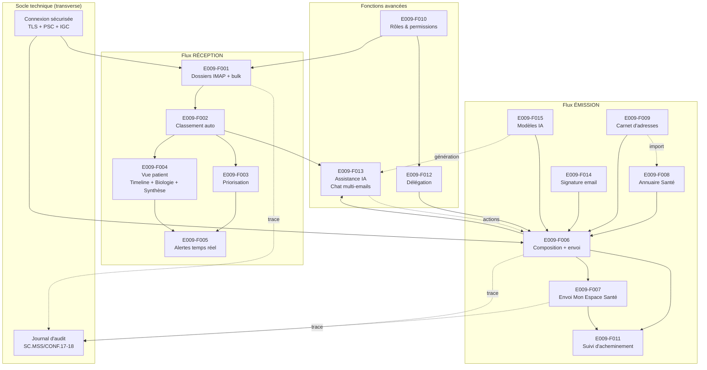
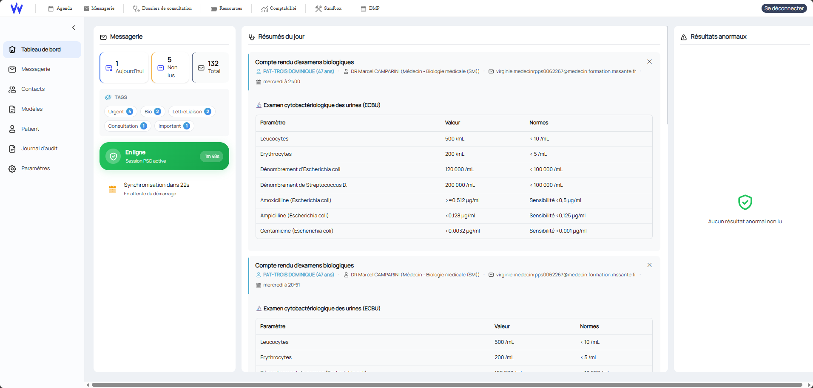
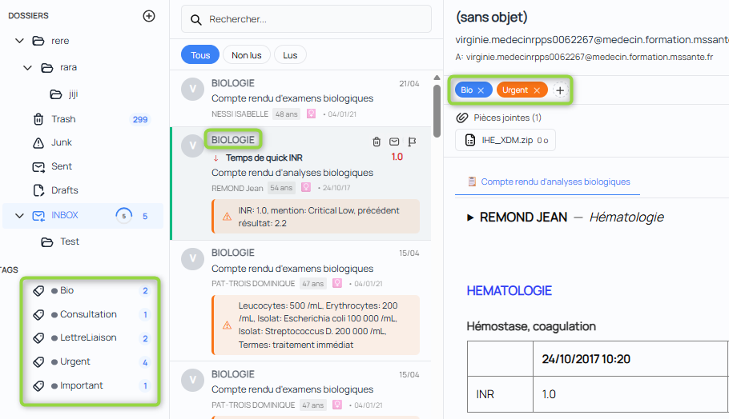
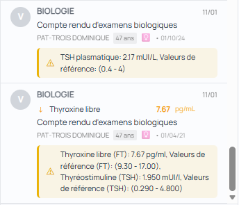
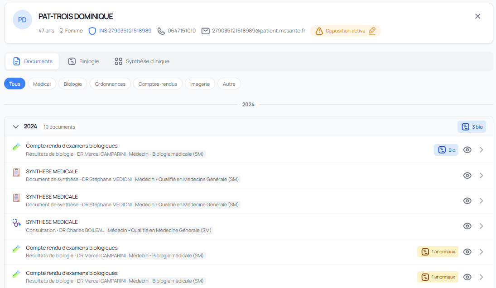
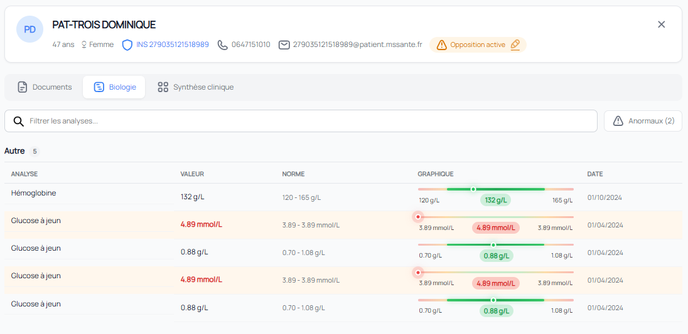
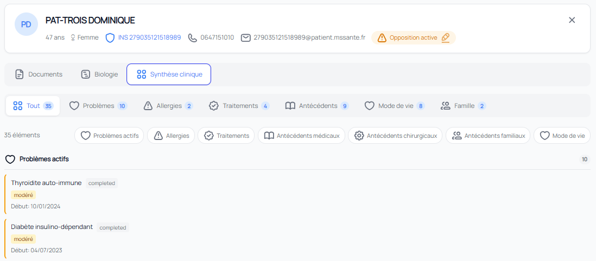
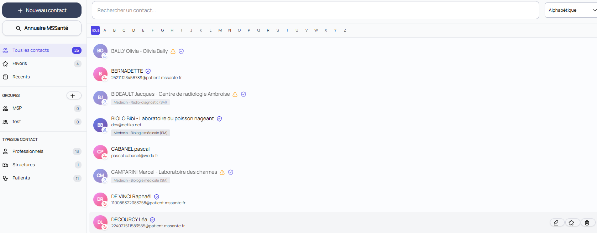
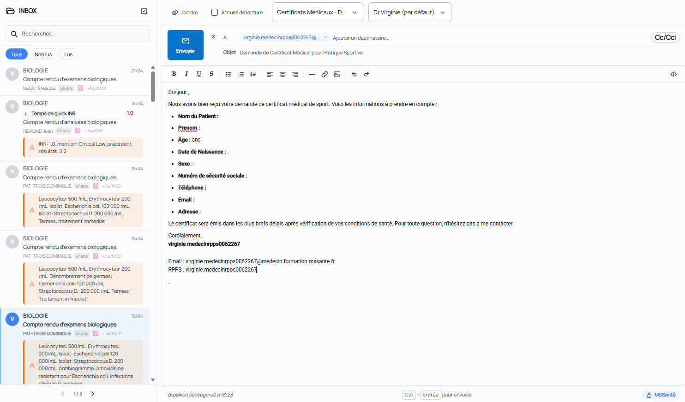

# E009 — Messagerie intelligente MSSante

> **Statut** : 🟢 En cours
> **Version** : 1.5
> **Auteur** : Pascal Cabanel
> **Dernière mise à jour** : 2026-04-21
>
> **Changelog v1.5** : passe tech-writer conservatrice (option A). Task-009 (Libellé expéditeur formaté selon ECO.2.2.7) a été livrée et fait passer RG-E009-043 de 🟡 Partiel à 🟢 Implémenté. Feature E009-F006 (Composition et envoi) passe de 95% à 97% (reste « annule et remplace » AMBU.MSS/va1.02). Annexe C enrichie avec task-009. Les sections 4 (Features) et 5 (Workflow) hand-crafted restent préservées.

---

## 1. Vision

La **Messagerie intelligente** est un client de messagerie sécurisée destiné aux professionnels de santé, conforme aux exigences Ségur V1 et V2. Elle permet de **recevoir, classer automatiquement, prioriser, traiter et émettre** des documents médicaux via le réseau MSSante, avec une couche d'**intelligence artificielle** intégrée pour assister le praticien dans son quotidien (résumés, tags, recherche sémantique, chat conversationnel).

Le produit s'adresse en priorité au **médecin généraliste**, mais s'étend à la secrétaire médicale, au coordinateur de soins, et — à terme — au patient via Mon Espace Santé. La conformité Ségur est l'objectif de fond, l'IA est le différenciateur produit.

---

## 2. Objectifs métier

- [ ] **Conformité réglementaire** : atteindre 100% des exigences applicables au périmètre messagerie, issues de trois référentiels :
  - **REM Ségur V1/V2** (REM-MDV-LGC-Va2) — 72 exigences identifiées.
  - **Référentiel socle MSSanté #2 v1.0.1** (ANS, 18/01/2024) — 34 exigences `ECO.*` obligatoires pour les BAL personnelles/organisationnelles.
  - **ENS Mon espace santé — Messagerie v1.3** (Assurance Maladie, 28/06/2023) — 6 règles complémentaires pour le volet patient MES.

  Après dédoublonnage (mapping REM ↔ Ref#2), le périmètre total couvre **~85 règles distinctes**. État actuel : 61% conforme + 22% partiel = 83% au moins partiellement couvert. Cible : 100% conforme.

- [ ] **Réduction du temps de traitement** : automatiser le classement des documents reçus pour qu'un compte-rendu d'examen soit présenté pré-classé dans le dossier patient sans intervention manuelle.

- [ ] **Détection des urgences cliniques** : remonter en alerte temps réel 100% des résultats de biologie marqués `AA` / `HH` / `LL` (critique), conformément à BIO/va1.01.

- [ ] **Annuaire intégré performant** : permettre la recherche d'un correspondant par 5 axes simultanés (RPPS, nom, spécialité, localisation, établissement) en moins de 2 secondes (cible UX).

- [ ] **Mode hors-ligne fonctionnel** : permettre la composition, la lecture des messages déjà synchronisés et la mise en file d'attente d'envois pendant une déconnexion réseau, avec synchronisation transparente au retour de la connexion.

- [ ] **Auditabilité complète** : tracer 100% des actions fonctionnelles MSS (lecture, envoi, suppression, intégration, opposition) dans un journal d'audit interrogeable et exportable, conformément à SC.MSS/CONF.17-18.

---

## 3. Acteurs concernés

| Acteur | Rôle dans l'EPIC |
|--------|------------------|
| **Médecin généraliste (Dr. Sophie)** | Utilisateur principal. Reçoit, lit, traite, envoie des documents médicaux. Consulte son tableau de bord, traite les alertes biologie, rédige des messages contextuels au dossier patient, dialogue avec l'IA. |
| **Secrétaire médicale (Marie)** | Gère les contacts, classe les messages entrants pour le médecin, prépare l'envoi de courriers, consulte les boîtes organisationnelles. Couverture actuelle partielle. |
| **Coordinateur de soins (Thomas)** | Suit les threads inter-professionnels autour d'un patient, consulte l'historique des échanges, recherche dans les conversations. Couverture actuelle partielle. |
| **Patient (Mon Espace Santé)** | Destinataire des documents transmis par le médecin via MES. Peut s'opposer à l'envoi MSS pro/patient. Pas de fonction d'émission depuis le produit. |
| **Opérateur MSSante** | Fournit la BAL, applique les politiques de sécurité (TLS, certificats IGC Santé, taille PJ). Référencé via DNS SRV pour l'auto-configuration. |
| **Annuaire Santé (ANS)** | Source de vérité des correspondants (RPPS, MSSante). Interrogé via API FHIR. |
| **Pro Santé Connect (PSC)** | Fournisseur d'identité pour l'authentification du professionnel. Émet les jetons d'accès et de rafraîchissement. |
| **Annuaire DMP / MES** | Source d'INS qualifiées et d'adresses MSSante patient. Consommé par le service d'envoi MES (à implémenter). |

---

## 4. Features de l'EPIC

> Les features sont ordonnées par dépendance logique : socle → réception → émission → fonctions avancées. Chaque feature est autonome (livraison incrémentale possible) tout en partageant le socle technique commun (connexion, sécurité, persistance, notifications).

| # | Feature | Description courte | Dépendances |
|---|---------|--------------------|-------------|
| **E009-F001** | Boîte de réception — gestion IMAP complète | Synchronisation IMAP, **liste et arborescence des dossiers IMAP** (INBOX, Envoyés, Brouillons, Corbeille, dossiers personnalisés), **création / renommage / suppression** de dossiers, **lu/non lu/marqué**, **sélection multiple et opérations en masse** (déplacer, supprimer, marquer lu/non lu, marquer), vue unifiée et vues séparées par BAL (aujourd'hui mono-boîte ; multi-boîtes en cours — cf. F010). | E009-F010 (rôles pour BAL orga) |
| **E009-F002** | Classement automatique INS / CI-SIS | Traitement des documents CDA R2 (N1/N3) et des archives IHE_XDM, extraction INS/patient/auteur/LOINC, rattachement automatique au dossier patient. | Aucune (cœur métier) |
| **E009-F003** | Priorisation et scoring de sévérité | Tags d'urgence, suggestions IA, détection biologie anormale. Tri et filtres orientés priorité. | E009-F002 (métadonnées) |
| **E009-F004** | Vue patient — timeline documents des emails + biologie horizontale + synthèse clinique | Vue dossier patient complète composée de **trois modules** : (a) **Vue temporelle patient** (*Patient Timeline*) — timeline chronologique groupée des documents MSS reçus (onglets : Synthèse Clinique, Documents, Synthèse Biologie ; filtres par catégorie Bio/Imagerie/Consultation, séparateurs temporels Aujourd'hui/Semaine/Mois, pagination) ; (b) **Timeline biologie horizontale** (*Biology Timeline*) — grille biomarqueurs × dates d'examen avec mini-courbes, bandes d'intervalle de référence, indicateurs de tendance (stable / hausse / baisse), mise en évidence des résultats anormaux par sévérité, filtre période (3/6/12m/tout), 11 catégories (Hématologie, Biochimie, Ionogramme, Enzymologie, Hépatique, Lipidique, Thyroïde, Immunologie, Sérologie, Microbiologie, Urinaire) ; (c) **Synthèse clinique** (*Clinical Synthesis*) — pathologies actives triées par sévérité, ATCD médicaux/chirurgicaux, allergies critiques, biologie anormale récente, facteurs de style de vie, ATCD familiaux, dédoublonnage par code LOINC. Embarquée via widget dans le shell du LGC hôte et disponible en application autonome. | E009-F002 |
| **E009-F005** | Alertes temps réel | Notifications poussées (canaux temps réel côté frontends) sur événements à valeur clinique (biologie critique, message urgent, document non lu). Préférences utilisateur (son, desktop, urgence). | E009-F003 |
| **E009-F006** | Composition et envoi de messages MSSante | Édition enrichie, pièces jointes (vérification taille — task-008), brouillons auto-sauvegardés, insertion de signature (F014) et de modèle (F015), accusés de réception (MDN/DSN), en-têtes RFC 5322 conformes. | E009-F008, E009-F009, E009-F014, E009-F015 |
| **E009-F007** | Envoi sécurisé vers Mon Espace Santé (DMP) | Sélection patient depuis la base, vérification INS qualifiée, génération du paquet IHE_XDM, en-têtes X-MSS-MES, gestion de l'opposition patient (task-003), gestion des bounces MES (messagerie fermée, patient non trouvé, adresse invalide, taille > 25 Mo), fin d'échange avec usager (objet `[FIN]` ou `X-MSS-MES=FIN`), adressage mineur. | E009-F006 |
| **E009-F008** | Annuaire Santé intégré | Recherche multicritères dans l'Annuaire ANS via API FHIR (RPPS, nom, spécialité, localisation, établissement, filtre « adresse MSSante présente »). | Aucune |
| **E009-F009** | Carnet d'adresses personnel | CRUD contacts, favoris, groupes, tags, import depuis l'annuaire, fusion de doublons, tri par dernière utilisation. | E009-F008 |
| **E009-F010** | Rôles, permissions et boîtes organisationnelles | Modèle RBAC explicite (médecin / secrétaire / coordinateur), gestion de plusieurs BAL simultanées, droits par boîte. | Aucune (chantier transverse) |
| **E009-F011** | Suivi d'acheminement complet | Au-delà des MDN : suivi envoyé / accepté par l'opérateur / délivré / lu / répondu, vue chronologique par message. | E009-F006 |
| **E009-F012** | Délégation de traitement entre professionnels | Workflow d'attribution d'un message à un autre praticien (avec notification, journal, accusé de prise en charge). | E009-F010 |
| **E009-F013** | Assistance IA — chat multi-emails, résumés, tags, recherche sémantique | Pipeline IA dual on-premise (données qui restent dans l'établissement) / cloud, activable par feature flag. **Chat IA avec contexte multi-emails** : le médecin sélectionne N emails, crée une conversation, reçoit un résumé consolidé, puis dialogue avec l'IA qui cite les emails sources (prompt système médecin-expert, budget de tokens, résumé glissant). **Plugin d'actions métier** exposant 5 actions exécutables par l'IA : composer un email, répondre à un email, appeler le patient, envoyer un SMS au patient, contacter un confrère. Streaming des réponses en temps réel. Résumés automatiques de messages, tags suggérés, recherche sémantique dans toute la BAL. | E009-F002 (métadonnées sources), E009-F006 (actions IA d'écriture) |
| **E009-F014** | Signature email | CRUD complet de signatures enrichies (HTML), avec signature par défaut, basculement de la signature par défaut, insertion automatique à la composition (F006). Éditeur WYSIWYG disponible sur les deux frontends. | E009-F006 |
| **E009-F015** | Modèles d'email assistés par IA | CRUD de modèles par catégorie, avec **assistance IA native** : génération d'un modèle complet à partir d'une description en langage naturel, correction orthographique / grammaticale en temps réel, amélioration de texte paramétrable (raccourcir, formaliser, adapter au patient), détection automatique des placeholders (`{{nom}}`, `{{date}}`, etc.). Éditeur enrichi disponible sur les deux frontends. Insertion de modèle à la composition (F006). | E009-F006, E009-F013 |

### État de couverture (2026-04-21)

| Feature | Statut | Couverture | Tasks livrées |
|---------|--------|------------|---------------|
| E009-F001 | 🟢 Implémenté | 95% — dossiers IMAP CRUD complets, opérations en masse (déplacer/lu/marquer), mono-boîte (multi-boîte via F010) | — |
| E009-F002 | 🟢 Implémenté | 100% — traitement CDA et IHE_XDM complet, paire CDA/PDF fusionnée | task-010 |
| E009-F003 | 🟢 Implémenté | 100% — tags urgence, tagging IA, détection biologie anormale | task-005 (distinction pro/patient) |
| E009-F004 | 🟢 Implémenté | 100% — Vue temporelle patient, Timeline biologie horizontale, Synthèse clinique livrées sur les deux frontends, APIs Patients + Biologie dédiées | — |
| E009-F005 | 🟢 Implémenté | 100% — canaux temps réel + préférences | — |
| E009-F006 | 🟢 Implémenté | 97% — manque « annule et remplace » (AMBU.MSS/va1.02) | task-002 (XDM), task-008 (taille PJ), task-009 (libellé expéditeur) |
| E009-F007 | 🔴 Non impl. | 10% — paquet IHE_XDM possible, intégration envoi à confirmer, opposition implémentée, bounces/fin d'échange à ajouter | task-003 (opposition) |
| E009-F008 | 🟢 Implémenté | 100% — service d'annuaire avec 5 stratégies de recherche | — |
| E009-F009 | 🟢 Implémenté | 100% — CRUD complet, favoris, groupes, fusion | — |
| E009-F010 | 🔴 Non impl. | 0% — Modèle RBAC explicite (médecin / secrétaire / coordinateur) | — |
| E009-F011 | 🟡 Partiel | 30% — MDN / DSN OK, suivi complet à faire | — |
| E009-F012 | 🔴 Non impl. | 0% — Workflow d'attribution d'un message à un autre praticien | — |
| E009-F013 | 🟢 Implémenté | 100% — chat multi-emails avec contexte, résumés, tags, recherche sémantique, plugin 5 actions | — |
| E009-F014 | 🟢 Implémenté | 100% — CRUD signatures HTML, signature par défaut, éditeurs sur les deux frontends | — |
| E009-F015 | 🟢 Implémenté | 100% — CRUD modèles par catégorie, 4 endpoints IA (générer, corriger, améliorer, détecter placeholders), éditeurs sur les deux frontends | — |

**Couverture EPIC consolidée : 80%** (12 features sur 15 au moins partiellement livrées, dont 11 implémentées à 100%).

---

## 5. Workflow entre Features

### 5.1 Vue d'ensemble

### 5.2 Description du workflow

#### Flux RÉCEPTION

1. **E009-F001 — Boîte de réception et gestion IMAP** : la connexion IMAP authentifiée PSC ouvre la BAL MSSante du professionnel et synchronise les nouveaux messages en arrière-plan (services de synchronisation asynchrone). L'API de gestion des messages expose la gestion complète des dossiers IMAP : lister, récupérer le contenu, récupérer les non-lus du jour, récupérer les plus récents (pagination par curseur), récupérer un lot par identifiants. Les actions unitaires sont disponibles : marquer lu/non-lu, marquer/démarquer, supprimer, envoyer un accusé de lecture. Les **opérations en masse** sont exposées via un endpoint de déplacement multiple. Côté frontends, des composants dédiés offrent l'arborescence des dossiers, la vue dossier, la liste des messages avec sélection multiple et le dialogue de déplacement en masse. Mode connecté et déconnecté supportés via une file d'attente d'actions hors ligne — les actions lu/non-lu/suppression sont mises en file d'attente si hors ligne et rejouées automatiquement au retour de connexion.

  
   
  Dashboard avec résumé IA, indicateur, alertes de biologies

 

  
   
  Réception des messages avec affichage des documents CDA

 

2. **E009-F002 — Classement automatique** : pour chaque nouveau message contenant un paquet IHE_XDM, le moteur de traitement des archives IHE_XDM analyse le CDA R2 (N1 ou N3), extrait l'INS, le patient, l'auteur, la date, le LOINC, la catégorie. Une entrée « document médical rattaché » est créée et liée à une entrée « patient rattaché » via l'INS. Une paire CDA + PDF/A-1 produit **une seule** entrée (depuis task-010).

  
   
  Classement automatique, tags

3. **E009-F003 — Priorisation** : le service de suggestion de tags IA propose des tags d'urgence. Pour les comptes-rendus de biologie, le moteur biologie détecte les codes d'interprétation HL7 critiques (`AA`, `HH`, `LL`, CriticalLow, CriticalHigh) via le modèle « état d'interprétation de laboratoire ».

  
   
  Valeur de biologie + Alerte détectée par IA

4. **E009-F004 — Vue patient complète (Timeline + Biologie + Synthèse clinique)** : au-delà du simple widget « nouveaux documents », le professionnel dispose d'une vue dossier patient articulée en trois modules complémentaires, livrés à parité sur les deux frontends.

   **(a) Vue temporelle patient** (*Patient Timeline*) — timeline chronologique des documents MSS reçus pour le patient. Onglets : *Synthèse Clinique*, *Documents*, *Synthèse Biologie*. Filtres par catégorie (Biologie, Imagerie, Consultation, etc.). Séparateurs temporels (Aujourd'hui, Cette semaine, Semaine dernière, Ce mois…). Groupement par date et pagination. Alimentée par l'API Patients (endpoint « documents médicaux par INS »).

  
   
  Timeline patient

   **(b) Timeline biologie horizontale** (*Biology Timeline*) — grille **biomarqueurs × dates d'examen**, avec :
   - Mini-courbes (sparklines) par biomarqueur avec bandes d'intervalle de référence superposées.
   - Indicateurs de tendance (*stable*, *en hausse*, *en baisse*) calculés sur la période sélectionnée.
   - Mise en évidence des résultats anormaux par sévérité (codes HL7 `AA`, `HH`, `LL` colorisés).
   - Filtre période : 3 / 6 / 12 mois / tout historique.
   - **11 catégories biologiques** regroupées : Hématologie, Biochimie, Ionogramme, Enzymologie, Hépatique, Lipidique, Thyroïde, Immunologie, Sérologie, Microbiologie, Urinaire.
   - Alimentée par l'API Biologie (endpoint « résultats groupés par date d'examen par INS »).

  
   
  Timeline biologie du patient

   **(c) Synthèse clinique** (*Clinical Synthesis*) — synthèse clinique compatible IPS (International Patient Summary) :
   - Section principale : Problèmes actifs (triés par sévérité), ATCD médicaux, ATCD chirurgicaux, Allergies (mise en évidence critique), Biologie anormale récente.
   - Barre latérale : Facteurs de style de vie (détection de risques), ATCD familiaux, Derniers résultats anormaux (max 5, dernier mois).
   - Dédoublonnage par code LOINC / libellé.
   - Alimentée par les métadonnées cliniques extraites au classement (F002).

  
   
  Problèmes actifs, Allergies, Traitements, Antécédents médicaux, Antécédents chirurgicaux, Antécédents familiaux, Mode de vie

5. **E009-F005 — Alertes temps réel** : le notifieur d'arrivée de message publie un événement avec niveau d'urgence. Les canaux temps réel (canal push pour le frontend embarqué, flux d'événements serveur pour le frontend autonome) poussent l'alerte au client. L'utilisateur configure ses préférences (son, desktop, urgence minimale) depuis les paramètres utilisateur.

#### Flux ÉMISSION

6. **E009-F008 — Annuaire Santé** : le service d'annuaire santé interroge l'API FHIR de l'ANS via 5 stratégies dédiées (par RPPS, par nom, par spécialité, par localisation, combinée). Un cache résilient (Redis) limite la charge sur l'API distante.

7. **E009-F009 — Carnet d'adresses** : le professionnel sauvegarde un correspondant trouvé via l'annuaire dans son carnet local (favori, groupe, tag). Un consommateur d'événement « création de contact praticien » crée automatiquement le contact lors de la première interaction.

  
   
  Problèmes actifs, Allergies, Traitements, Antécédents médicaux, Antécédents chirurgicaux, Antécédents familiaux, Mode de vie

8. **E009-F006 — Composition et envoi** : le gestionnaire de brouillons gère l'auto-sauvegarde. L'éditeur de composition permet l'insertion d'une **signature** (F014) et d'un **modèle** (F015) en un clic. Le moteur de construction d'emails construit le message (RFC 5322 : `Message-ID`, `In-Reply-To`, `References`, `Content-Type`). Le service SMTP envoie via STARTTLS + XOAUTH2. Vérification de la taille des PJ avant envoi (depuis task-008, défaut 10 Mo configurable).

  
   
  Nouveau mail, Brouillon automatique, modèle contextel au patient

8a. **E009-F014 — Signature email** : une API dédiée (API de gestion des signatures) expose le CRUD complet des signatures HTML, la consultation de la signature par défaut, la mise à jour de cette dernière. L'entité métier « Signature » porte le contenu HTML et un indicateur « par défaut ». Un éditeur WYSIWYG est disponible sur les deux frontends pour création et édition. La signature par défaut est insérée automatiquement à la composition ; l'utilisateur peut sélectionner une autre signature depuis la liste.

8b. **E009-F015 — Modèles d'email assistés par IA** : une API dédiée (API de gestion des modèles) expose le CRUD par catégorie. L'entité métier « Modèle » porte catégorie, sujet, corps et indicateur « par défaut ». L'**assistance IA** est fournie par l'API d'assistance IA avec 4 actions disponibles :
   - **Générer un modèle** à partir d'une description en langage naturel.
   - **Corriger un texte** : correction orthographique et grammaticale en streaming.
   - **Améliorer un texte** avec paramètre d'action (raccourcir, formaliser, adapter au patient).
   - **Détecter les placeholders** automatiquement (`{{nom}}`, `{{date}}`, etc.).

  
   

9. **E009-F007 — Envoi Mon Espace Santé** *(à implémenter)* : sélection du patient depuis la base, vérification INS qualifiée, génération du paquet IHE_XDM via le générateur de paquets IHE, ajout des en-têtes SMTP spécifiques (`X-MSS-INS`, `X-MSS-CODECDA`, `X-MSS-MES = "FIN"` pour bloquer la réponse patient), respect de l'opposition patient (depuis task-003).

10. **E009-F011 — Suivi d'acheminement** : le gestionnaire d'accusés de lecture (MDN) traite aujourd'hui les accusés reçus. Le suivi complet (envoyé → accepté opérateur → délivré → lu → répondu) reste à construire au-dessus.

#### Fonctions avancées

11. **E009-F010 — Rôles et permissions** *(à implémenter)* : modèle RBAC explicite (médecin, secrétaire, coordinateur), gestion de plusieurs BAL simultanées, droits granulaires par boîte (lire, traiter, envoyer pour le compte de…).

12. **E009-F012 — Délégation** *(à implémenter)* : workflow d'attribution d'un message à un autre praticien, avec notification cible, journal d'audit, accusé de prise en charge.

13. **E009-F013 — Assistance IA, avec chat multi-emails contextuel** : pipeline dual on-premise (modèles locaux, données qui restent dans l'établissement) / cloud, activable ou désactivable par feature flag.

    **Résumés et tags automatiques** : résumés de documents médicaux stockés en base (« résumé automatique »), suggestions de tags d'urgence et de catégorie via le service de suggestion de tags IA.

    **Chat IA avec contexte multi-emails** (API de chat IA, service de gestion des conversations IA) — le médecin sélectionne N emails dans la liste, crée une conversation (le service construit un *résumé initial* à partir des digests des emails sélectionnés, gère un *résumé glissant* au fil de la conversation, applique un *budget de tokens* pour rester dans la fenêtre de contexte). Le streaming des réponses est fait via un flux d'événements serveur. Le prompt système positionne l'IA en assistant médecin-expert qui **cite les emails sources** et refuse toute fabrication.

    **Plugin d'actions métier** — 5 actions exécutables par l'IA depuis le chat :
    - **Composer un email** — rédige un nouveau courriel.
    - **Répondre à un email** — répond à un email du contexte.
    - **Appeler le patient** — déclenche un appel téléphonique.
    - **Envoyer un SMS au patient** — ouvre le composer SMS.
    - **Contacter un confrère** — contacte un correspondant.

    **Recherche sémantique** : le service de recherche sémantique hybride (vectorielle + lexicale) retrouve un email à partir d'une question en langage naturel.

    **UI** : un panneau de chat IA est disponible sur chaque frontend, avec sélecteur multi-emails intégré à la liste.

  
   

### 5.3 Trace transverse

Toute action fonctionnelle (lecture, envoi, suppression, intégration patient, opposition, déconnexion) est tracée dans le journal d'audit MSS (depuis task-004) avec horodatage, identifiant utilisateur, INS patient si pertinent, code LOINC du document, durée, IP. Export CSV disponible.

  
   

---

## 6. Règles métier transverses (conformité Ségur V1/V2)

> Périmètre : **72 exigences** sur 198 du référentiel REM-MDV-LGC-Va2, filtrées sur le périmètre messagerie (hors LGC hôte). Source : `docs/analyse-conformite-messagerie.md`.

### 6.1 Domaine 1 — Interopérabilité avec les opérateurs MSSante (14 exigences)

| ID | Vague | Règle | Statut |
|----|-------|-------|--------|
| RG-E009-001 (SC.MSS/CONF.01) | V2 | Connexion TLS 1.2 minimum avec API LPS | ✅ Implémenté (service de connexion IMAP et SMTP) |
| RG-E009-002 (SC.MSS/CONF.03) | V2 | Suites de chiffrement TLS autorisées validées | ✅ Implémenté (validateur de suites de chiffrement TLS) |
| RG-E009-003 (SC.MSS/CONF.05) | V2 | SMTP conforme RFC 5321 avec STARTTLS | ✅ Implémenté |
| RG-E009-004 (SC.MSS/CONF.06) | V2 | IMAP4 conforme RFC 3501/9051 avec STARTTLS | ✅ Implémenté (couche d'abstraction IMAP) |
| RG-E009-005 (SC.MSS/CONF.07) | V2 | Cinématique de connexion : TLS puis XOAUTH2 (token PSC) | ✅ Implémenté |
| RG-E009-006 (SC.MSS/CONF.08) | V2 | Erreurs de connexion ne perturbent pas les autres fonctions | ✅ Implémenté (isolation applicative) |
| RG-E009-007 (SC.MSS/CONF.10) | V2 | Fin de session quand le jeton de rafraîchissement PSC est invalide | 🟡 Partiel (déconnexion gérée, détection expiration non explicite) |
| RG-E009-008 (SC.MSS/CONF.11) | V2 | Réouverture automatique de session si PSC encore valide | ✅ Implémenté (gestionnaire de connexion IMAP) |
| RG-E009-009 (SC.MSS/CONF.14) | V2 | En-tête SMTP `X-MSS-INS` dans messages avec IHE_XDM | 🔴 Non implémenté |
| RG-E009-010 (SC.MSS/CONF.15) | V2 | En-tête SMTP `X-MSS-CODECDA` dans messages avec IHE_XDM | 🔴 Non implémenté |
| RG-E009-011 (SC.MSS/CONF.16) | V2 | En-tête SMTP `X-MSS-NIL` dans tous les courriels | 🔴 Non implémenté |
| RG-E009-012 (SC.MSS/CONF.22) | V2 | Conservation de la dernière CRL non expirée | ✅ Implémenté (service de vérification CRL) |
| RG-E009-013 (SC.MSS/CONF.27) | V2 | Certificat IGC Santé gamme Élémentaire Organisation uniquement | ✅ Implémenté (validateur de certificats) |
| RG-E009-014 (SC.MSS/CONF.28) | V2 | Jeton d'accès PSC (JWT) non stocké de façon permanente | ✅ Implémenté (mémoire de session, contexte utilisateur) |

### 6.2 Domaine 2 — Auto-configuration de la BAL MSSante (1 exigence)

| ID | Vague | Règle | Statut |
|----|-------|-------|--------|
| RG-E009-015 (SC.MSS/CONF.04) | V2 | Auto-configuration BAL via DNS SRV | ✅ Implémenté (service d'autoconfiguration DNS SRV) |

### 6.3 Domaine 3 — Envoi sécurisé vers Mon Espace Santé (5 exigences)

| ID | Vague | Règle | Statut |
|----|-------|-------|--------|
| RG-E009-016 (SC.MSS/CONF.21) | V2 | En-tête `X-MSS-MES = "FIN"` pour bloquer la réponse patient | 🔴 Non implémenté |
| RG-E009-017 (SC.MSS/UX.32) | V2 | Écrire à un usager depuis la base patients | 🟡 Partiel (service SMTP permet l'envoi, sélection patient + vérif INS à compléter) |
| RG-E009-018 (MSS/va1.01) | V1 | Transmettre documents Ségur aux patients via MSS (IHE_XDM) | 🟡 Partiel (le générateur de paquets IHE produit le paquet, intégration envoi automatique à finaliser) |
| RG-E009-019 (MSS/va1.20) | V1 | Enregistrer opposition du patient à l'envoi MSS patient | ✅ Implémenté (task-003) |
| RG-E009-020 (MSS/va1.22) | V1 | Enregistrer opposition du patient à l'envoi MSS professionnel | ✅ Implémenté (task-003) |

### 6.4 Domaine 4 — Intégration de l'Annuaire Santé (6 exigences)

| ID | Vague | Règle | Statut |
|----|-------|-------|--------|
| RG-E009-021 (SC.MSS/CONF.20) | V2 | Recherche d'une adresse MSSante dans l'Annuaire Santé | ✅ Implémenté (service d'annuaire santé) |
| RG-E009-022 (SC.MSS/UX.41) | V2 | Recherche multicritères : RPPS, nom, profession, spécialité, lieu | ✅ Implémenté (5 stratégies de recherche) |
| RG-E009-023 (ANN/va1.01) | V1 | Intégrer Annuaire santé.fr (extraction publique ou API FHIR) | ✅ Implémenté (API FHIR) |
| RG-E009-024 (ANN/va1.02) | V1 | Intégrer données Annuaire pour les utilisateurs | ✅ Implémenté (consommateur d'événement « création de contact praticien ») |
| RG-E009-025 (ANN/va1.03) | V1 | Intégrer données Annuaire pour les correspondants | ✅ Implémenté |
| RG-E009-026 (ANN/va1.04) | V1 | Appels unitaires en temps réel via API FHIR | ✅ Implémenté |

### 6.5 Domaine 5 — Intégration et gestion des documents reçus (10 exigences)

| ID | Vague | Règle | Statut |
|----|-------|-------|--------|
| RG-E009-027 (LGC.MSS/UX.05) | V2 | Gérer messages de suppression / modification de documents intégrés | 🔴 Non implémenté |
| RG-E009-028 (SC.MSS/UX.25) | V2 | Distinguer messages professionnels vs patients (Mon Espace Santé) | ✅ Implémenté (task-005, indicateur visuel « message émis par un usager ») |
| RG-E009-029 (SC.MSS/UX.28) | V2 | Masquer le préfixe `XDM/1.0/DDM+` dans l'objet | ✅ Implémenté (task-002) |
| RG-E009-030 (SC.MSS/UX.31) | V2 | Afficher nom/prénom/INS de l'usager (pas seulement l'email patient) | ✅ Implémenté (task-005, extraction du libellé et de l'INS) |
| RG-E009-031 (LGC.MDV.06) | V2 | Informer que le document a déjà été intégré | 🟡 Partiel (statut d'enrichissement tracé, indicateur visuel « déjà intégré » à confirmer) |
| RG-E009-032 (MSS/va1.25) | V1 | Restituer métadonnées CDA dans la liste messages reçus | ✅ Implémenté (moteur de traitement des documents CDA : titre, type, date, patient, auteur, LOINC) |
| RG-E009-033 (MSS/va1.27) | V1 | Rattachement patient par comparaison visuelle si INS sans identité qualifiée | 🟡 Partiel (INS stocké, workflow visuel à finaliser, en partie LGC) |
| RG-E009-034 (MSS/va1.28) | V1 | Visualiser et classer en 1 clic dans le dossier patient | 🟡 Partiel (extraction auto OK, classement 1-clic relève partiellement du LGC) |
| RG-E009-035 (ERGO/va1.05) | V1 | Liste messages : tri / filtre par date, patient, lu/non lu, type | ✅ Implémenté (les deux frontends) |
| RG-E009-036 (ERGO/va1.08) | V1 | Liste messages reçus transversale depuis MSS | ✅ Implémenté (tableau de bord MSS) |

### 6.6 Domaine 6 — Envoi de messages et documents CDA (7 exigences)

| ID | Vague | Règle | Statut |
|----|-------|-------|--------|
| RG-E009-037 (MSS/va1.08) | V1 | En-têtes `Message-ID`, `In-Reply-To`, `References` conformes RFC 5322 | ✅ Implémenté (moteur de construction d'emails) |
| RG-E009-038 (MSS/va1.11) | V1 | `Content-Type` `text/plain` ou `multipart/alternative` | ✅ Implémenté |
| RG-E009-039 (MSS/va1.12) | V1 | `Message-ID` conforme RFC 5322 | ✅ Implémenté |
| RG-E009-040 (MSS/va1.13) | V1 | Pièce jointe respecte la taille maximale (selon opérateur) | ✅ Implémenté (task-008, paramètre applicatif « taille maximale des pièces jointes », défaut 10 Mo configurable) |
| RG-E009-041 (MSS/va1.14) | V1 | Afficher la bonne réception si accusé de réception (MDN) | ✅ Implémenté (gestionnaire d'accusés de lecture) |
| RG-E009-042 (MSS/va1.15) | V1 | Permettre la demande d'accusé DSN (`Return-Receipt-To`) | ✅ Implémenté (service SMTP) |
| RG-E009-043 (MSS/va1.16) | V1 | Libellé signifiant en complément de l'adresse expéditeur | ✅ Implémenté (task-009 — format `<Titre>_<Prénom>_<NOM>_<Entité>` pour BAL perso, `<Entité fonctionnelle>` pour BAL orga, sanitization contre l'injection d'en-têtes email, 17 tests unitaires) |
| RG-E009-044 (AMBU.MSS/va1.02) | V1 | Nouvelle version avec mention « annule et remplace » | 🔴 Non implémenté |

### 6.7 Domaine 7 — Production et conservation de traces MSS (3 exigences)

| ID | Vague | Règle | Statut |
|----|-------|-------|--------|
| RG-E009-045 (SC.MSS/CONF.17) | V2 | Traces fonctionnelles pour tous les traitements sur la BAL | ✅ Implémenté (task-004 — 16 actions tracées dans le journal d'audit) |
| RG-E009-046 (SC.MSS/CONF.18) | V2 | Chaque trace : identifiant auteur, horodatage, type d'action, demande serveur | ✅ Implémenté (task-004 — 30+ champs : utilisateur, session, IP, durée, INS, LOINC) |
| RG-E009-047 (SC.MSS/UX.37) | V2 | Tracer et historiser tous les flux de transmissions MSSante | ✅ Implémenté (task-004 — API d'audit avec export CSV, mise en évidence des opérations lentes) |

### 6.8 Domaine 8 — Gestion des professionnels associés (1 exigence)

| ID | Vague | Règle | Statut |
|----|-------|-------|--------|
| RG-E009-048 (LABEL.06) | V2 | Gérer la liste des professionnels associés à la prise en charge | 🟡 Partiel (le carnet gère contacts/groupes, lien formel « professionnels du patient » à formaliser) |

### 6.9 Domaine 9 — Biologie médicale reçue par MSSante (6 exigences)

| ID | Vague | Règle | Statut |
|----|-------|-------|--------|
| RG-E009-049 (LGC.MDV.08) | V2 | Intégrer CR de biologie conformément au CI-SIS | ✅ Implémenté (moteur de traitement des documents CDA, entité « résultat de biologie ») |
| RG-E009-050 (LGC.MDV.09) | V2 | Exploiter le jeu de valeurs Circuit de la biologie, conversion d'unités | 🔴 Non implémenté |
| RG-E009-051 (BIO/va1.01) | V1 | Alerte spécifique si code interprétation `AA` / `HH` / `LL` (critique) | ✅ Implémenté (moteur biologie, notifieur d'alerte biologie anormale) |
| RG-E009-052 (BIO/va1.05) | V1 | Élément clinique pertinent visible dans la liste messages | ✅ Implémenté (indicateur « contient des résultats de biologie », tableau de bord « Résultats anormaux ») |
| RG-E009-053 (BIO/va1.06) | V1 | Signaler résultats en écart par rapport à l'intervalle de référence | 🟡 Partiel (détection résultats anormaux OK, comparaison fine intervalle à raffiner) |
| RG-E009-054 (BIO/va1.08) | V1 | Afficher CR biologie CDA R2 N3 avec feuille de style | ✅ Implémenté (service de rendu CDA avec transformation XSLT officielle ASIP) |

### 6.10 Domaine 10 — Affichage des documents CDA reçus (4 exigences)

| ID | Vague | Règle | Statut |
|----|-------|-------|--------|
| RG-E009-055 (SC.CDA/DD.15) | V2 | Une seule ligne pour CDA R2 N3 avec PDF encapsulé | ✅ Implémenté (task-010) |
| RG-E009-056 (SC.CDA/VISU.03) | V2 | Afficher préférentiellement le PDF encapsulé | ✅ Implémenté (task-010, bascule CDA/PDF disponible) |
| RG-E009-057 (SC.CDA/VISU.01) | V2 | Rendre lisible un CDA (en-tête, corps N1, parties narratives N3) | ✅ Implémenté (service de rendu CDA avec transformation XSLT officielle, gestion des styles embarqués) |
| RG-E009-058 (SC.CDA/INT.18) | V2 | Vérifier la cohérence de tout document CDA reçu (détection doublons) | 🟡 Partiel (traitement OK, détection doublon explicite à implémenter — todo-task-013) |

### 6.11 Domaine 11 — Navigation dossier patient (4 exigences)

| ID | Vague | Règle | Statut |
|----|-------|-------|--------|
| RG-E009-059 (SC.CDA/INT.04) | V2 | Trier les documents importés par type et date | ✅ Implémenté (service patient, tri côté client) |
| RG-E009-060 (SC.CDA/INT.08) | V2 | Identifier visuellement l'origine (DMP / MSSante) | ✅ Implémenté (document médical rattaché lié au courriel d'origine) |
| RG-E009-061 (SC.CDA/INT.17) | V2 | Informations de tri par défaut issues du CDA | ✅ Implémenté (métadonnées extraites par le moteur de traitement des documents CDA) |
| RG-E009-062 (LGC.DMP/UX.10) | V2 | Système fonctionnel sans bloquer l'interface | ✅ Implémenté (architecture asynchrone, synchronisation en arrière-plan, canaux temps réel) |

### 6.12 Domaine 12 — Authentification PSC (1 exigence)

| ID | Vague | Règle | Statut |
|----|-------|-------|--------|
| RG-E009-063 (SC.PSC.01) | V2 | Configurer PSC comme fournisseur d'identité | ✅ Implémenté (contexte utilisateur, jetons PSC, utilitaires de requête) |

### 6.13 Domaine 13 — Sécurité (3 exigences)

| ID | Vague | Règle | Statut |
|----|-------|-------|--------|
| RG-E009-064 (SC.SSI/IE.33) | V2 | Gérer identifiants professionnel (RPPS, nom, prénom, profession) | ✅ Implémenté (contexte utilisateur, entité contact) |
| RG-E009-065 (SC.SSI/IE.38) | V2 | Permettre au professionnel de fermer sa session | 🟡 Partiel (jetons en mémoire, bouton de déconnexion explicite à confirmer) |
| RG-E009-066 (SC.SSI/IE.58) | V2 | Verrouillage automatique après 2h d'inactivité | 🔴 Non implémenté |

### 6.14 Domaine 14 — Identité patient (2 exigences)

| ID | Vague | Règle | Statut |
|----|-------|-------|--------|
| RG-E009-067 (SENTINELLE.20) | V2 | Recherche identité connue à la réception d'un document avec INS qualifiée | 🟡 Partiel (patient rattaché stocke INS, service patient recherche par INS, logique de rapprochement complète dans le LGC) |
| RG-E009-068 (INS/va1.53) | V1 | Ne pas transmettre l'INS si identité non qualifiée | 🟡 Partiel (INS stocké, logique de non-transmission dans le LGC) |

### 6.15 Exigences complémentaires du Ref#2 v1.0.1 non mappées au REM Ségur

> Règles issues directement du *Référentiel socle MSSanté #2 v1.0.1* (ANS, 18/01/2024), absentes de la grille REM-MDV-LGC-Va2 mais obligatoires pour tout éditeur de client de messagerie MSSanté. Source : PDF Ref#2, § 3 (Standardisation des courriels) et § 6.1.1 (Synthèse des exigences).

| ID | Ref#2 | Règle | Texte Ref#2 (résumé fidèle) | Statut |
|----|-------|-------|-----------------------------|--------|
| RG-E009-075 | ECO.1.1.5 (§ 2.1.1.2.3, p.12) | Vérifier expiration du certificat serveur | « Le système DOIT vérifier que le certificat présenté par l'Opérateur MSSanté n'est pas expiré. » | ✅ Implémenté (validateur de certificats) |
| RG-E009-076 | ECO.1.1.6 (§ 2.1.1.2.3, p.12) | Vérifier révocation du certificat serveur | « Le système MSSanté DOIT vérifier que le certificat présenté par l'Opérateur MSSanté n'est pas révoqué au moyen des CRL ou du répondeur OCSP. » | ✅ Implémenté (services CRL / OCSP) |
| RG-E009-077 | ECO.2.1.2 (§ 3.1.2, p.42) | Identifier l'usager via patientId dans METADATA.XML | « Pour identifier l'usager concerné par un courriel, le système destinataire DOIT se référer à la métadonnée `patientId` (matricule INS) contenu dans le fichier METADATA.XML du document CDA contenu dans la pièce jointe IHE_XDM.zip du courriel. » | ✅ Implémenté (moteur de traitement des archives IHE_XDM extrait l'INS via METADATA.XML) |
| RG-E009-078 | ECO.2.1.3 (§ 3.1.3, p.42) | Format de l'objet du courriel | « L'objet du courriel DOIT respecter le format suivant : `XDM/1.0/DDM+<libellé> <NOM> <prenom> <date de naissance>`. Tous les champs sont obligatoires à l'exception du champ `<date de naissance>`. » | 🟡 Partiel — masquage à la réception implémenté (task-002). À l'émission, le format exact doit être produit par le moteur de construction d'emails — à vérifier. |
| RG-E009-079 | ECO.2.1.5 (§ 3.1.1, p.21) | PDF/A-1 généré depuis le CDA | « Chaque PDF/A-1 rattaché au courriel MSSanté DOIT être généré à partir du ou des documents CDA correspondants contenus dans l'archive ZIP au format IHE_XDM. Cas CDA R2 N3 : en-tête CDA + transcription fidèle de la partie narrative. Sinon : PDF/A-1 identique au PDF encapsulé dans le CDA R2 N1. » | 🟡 Partiel — côté réception (task-010) traité. Côté émission, le générateur de paquets IHE doit générer le PDF/A-1 conforme — à confirmer. |
| RG-E009-080 | ECO.2.1.6 (§ 3.1.1, p.22) | Convention de nommage des PDF | « Les fichiers PDF en PJ DOIVENT respecter : `<date de l'acte>_<type document>_<NOM>_<prenom>_<numéro de dossier>.pdf`. Tous les champs sont obligatoires sauf `<numéro de dossier>`. » | ✅ Implémenté (task-010, respecté à l'export) |
| RG-E009-081 | ECO.2.2.3 (§ 3.3.1, p.25) | Encodage UTF-8 des parties texte | « Le système MSSante DOIT utiliser l'encodage UTF-8 pour les parties `text` du corps des courriels. » | ✅ Implémenté (UTF-8 par défaut de la bibliothèque mail, à auditer) |
| RG-E009-082 | ECO.2.2.6 (§ 3.4.2, p.28) | Adresse usager construite depuis INS qualifiée | « Un système, qui envoie des courriels MSSanté à des usagers, DOIT utiliser des adresses usagers construites à partir d'Identités Nationales de Santé « qualifiées ». » | 🔴 Non implémenté (bloquant pour E009-F007) |
| RG-E009-083 | ECO.3.1.6 (§ 4.6, p.36) | Permettre de retourner un MDN à la réception | « Le système DOIT permettre de retourner un accusé de lecture (MDN) lorsqu'un message reçu le demande. » | 🟡 Partiel — le gestionnaire d'accusés de lecture reçoit les MDN entrants. La génération d'un MDN à la demande d'un expéditeur est à confirmer. |

### 6.16 Exigences ENS Mon espace santé v1.3 (volet E009-F007)

> Règles issues du document *Elements d'information à destination des éditeurs de solution MSSanté pour les professionnels — ENS Mon espace santé Messagerie V1.3* (Assurance Maladie / CNAM Dionis, 28/06/2023). Ces règles précisent le comportement attendu côté client pro lors des échanges avec Mon Espace Santé (MES), par-dessus le socle Ref#2.

| ID | Réf. ENS | Règle | Texte ENS (résumé fidèle) | Statut |
|----|----------|-------|---------------------------|--------|
| RG-E009-084 | § 2, p.4 | Adressage des usagers mineurs | « Lorsque les données de santé transmises par Messagerie concernent un usager mineur, il faut écrire à l'adresse de messagerie usager de l'usager mineur, et non sur l'adresse de Messagerie du/des représentants légaux. » | 🔴 Non implémenté (bloquant pour E009-F007) |
| RG-E009-085 | § 6, p.8-10 | Gestion des messages de bounce MES | À réception d'un message « Message non distribué » renvoyé par MES, identifier la cause (messagerie fermée, patient non trouvé, adresse invalide, `Undelivered Mail Returned to Sender` pour taille dépassée) et présenter une erreur explicite au professionnel. | 🔴 Non implémenté (à ajouter au pipeline de réception pour E009-F007) |
| RG-E009-086 | § 6, p.10 | Limite stricte de 25 Mo pour envoi vers MES | « Un Professionnel envoie un message qui dépasse la taille limite totale de 25 Mo. » — MES renvoie l'erreur `Undelivered Mail Returned to Sender`. La limite 25 Mo s'applique en plus de la limite configurable opérateur (task-008). | 🟡 Partiel — paramètre « taille maximale des pièces jointes » configurable (task-008, défaut 10 Mo). À ajouter : contrôle spécifique 25 Mo quand destinataire est `*@patient.mssante.fr`. |
| RG-E009-087 | § 7, p.12-13 | Fin d'échange avec un usager | 2 méthodes distinctes sont possibles : (1) envoi d'un message avec objet exactement égal à `[FIN]` (casse respectée, retire la possibilité de répondre à TOUS les messages précédents) ; (2) envoi avec entête `X-MSS-MES = "FIN"` (ECO.2.2.8, méthode **privilégiée** car un seul message). | 🔴 Non implémenté (ECO.2.2.8 non implémenté) |
| RG-E009-088 | § 6, p.10-11 | MDN RFC 8098 pour messages vers MES | « Le mécanisme MDN est décrit dans la RFC 8098 et peut être déclenché par le professionnel en ajoutant l'entête SMTP suivante : `Disposition-Notification-To: <adresse_mssante_de_l'expéditeur>`. » Le patient ne peut pas s'opposer à l'envoi de l'accusé de lecture vers MES. | 🟡 Partiel — gestionnaire d'accusés de lecture existant, entête `Disposition-Notification-To` à confirmer dans le moteur de construction d'emails. |
| RG-E009-089 | § 9, p.15 | Gestion du `reply-to` dans messages patient | Lorsqu'un message envoyé à un usager dispose d'une entête `reply-to` valorisée avec une adresse MSS, le patient peut répondre à la BAL indiquée dans le `reply-to` et non à la BAL émettrice. L'adresse `reply-to` est ajoutée aux contacts autorisés de l'usager ; l'adresse émettrice initiale ne l'est pas. | 🟡 Partiel — `Reply-To` positionnable par ECO.2.2.5 (BAL applicative). Pour BAL perso/orga, cas d'usage à expliciter. |

### 6.17 Règles transverses (non Ségur, métier produit)

| ID | Règle | Description |
|----|-------|-------------|
| RG-E009-069 | Iso-fonctionnalité multi-frontends | Toute feature visible doit être livrée à parité fonctionnelle sur le frontend embarqué (dans le LGC hôte) ET sur le frontend autonome (application web). Aucune divergence d'UX permise sans justification documentée. |
| RG-E009-070 | Mode hors ligne | La composition de message, la lecture des messages déjà synchronisés et la mise en file d'attente d'envois doivent fonctionner sans réseau. La synchronisation au retour est transparente (file d'attente d'actions hors ligne). |
| RG-E009-071 | IA optionnelle et désactivable | L'assistance IA est désactivable via feature flag. Le mode on-premise (modèles locaux) est possible pour les établissements interdisant la sortie de données vers le cloud. |
| RG-E009-072 | Iso-fonctionnalité « avec / sans IA » | Aucune fonction critique (réception, classement, envoi) ne doit dépendre de l'IA. L'IA est une assistance, jamais un point de défaillance. |
| RG-E009-073 | Test-first sur le backend | Toute logique métier ajoutée doit être couverte par >= 1 test unitaire ; tout endpoint par >= 1 test d'intégration (CLAUDE.md règles 1 et 1b). |
| RG-E009-074 | DOD vérifiable par `/review` | Chaque task `todo-*.md` doit lister une `## Definition of Done` 100% binaire (pas de « code propre »), vérifiable par la forge avant ouverture de PR. |

---

## 7. Contraintes et hypothèses

### Contraintes techniques

- **Connexion sécurisée** : TLS 1.2 minimum vers les opérateurs MSSante, authentification Pro Santé Connect (PSC), suites de chiffrement validées, certificats IGC Santé gamme Élémentaire Organisation uniquement.

- **Standards d'interopérabilité** : RFC 5321 (SMTP), RFC 3501 / 9051 (IMAP4), RFC 5322 (en-têtes mail), CI-SIS (CDA R2 N1/N3, IHE_XDM), HL7 (ObservationInterpretation, RoleCode), LOINC, OID.

- **Référentiels** : Annuaire Santé via API FHIR, codes LOINC, jeux de valeurs CI-SIS (catégories, spécialités, types d'établissement, confidentialité).

- **Conformité réglementaire** : Ségur V1 et V2 (REM-MDV-LGC-Va2), RGPD, Hébergement de Données de Santé (HDS).

- **Architecture multi-frontends** : **frontend embarqué** dans le shell du LGC hôte via un système de plugin (modules, widgets, widgets de notification, widgets d'alerte) **et frontend autonome** accessible en application web.

- **Persistance** : base relationnelle avec extension vectorielle pour la recherche sémantique.

- **Notifications temps réel** : canaux push côté frontend embarqué et flux d'événements serveur côté frontend autonome, avec préférences par utilisateur.

- **Mode hors ligne** : services de synchronisation en arrière-plan, file d'attente d'actions hors ligne, cache local des messages déjà synchronisés.

- **Polyrepo** : le produit est constitué de plusieurs dépôts indépendants (backend MSS, frontend embarqué, frontend autonome, contrats partagés, bibliothèque d'interopérabilité CDA), gérés en branches alignées `feat/{task-id}-{slug}` (cf. CLAUDE.md règle « 1 US = 1 branche partagée »).

### Hypothèses

- L'**API FHIR de l'Annuaire Santé** est disponible et reste rétrocompatible sur la durée de vie du produit. Latence acceptable < 2s par recherche multicritères (cible UX). En cas de panne, dégradation gracieuse (recherche limitée au carnet local).

- L'**infrastructure de recherche vectorielle** est provisionnée pour la recherche sémantique (embeddings dim 768 ou 1536 selon le modèle).

- Les **moteurs IA** sont disponibles selon l'un des deux modes : on-premise (modèles locaux, données qui restent dans l'établissement) ou cloud (API distante). Le choix est fait par l'établissement à l'installation et peut être désactivé en feature flag.

- L'utilisateur est **authentifié via Pro Santé Connect** avant toute action MSS. Aucun mode « sans authentification » n'est supporté.

- Le **Dossier Médical Partagé (DMP) / Mon Espace Santé** est accessible via les opérateurs MSSante dédiés (`@patient.mssante.fr`). L'homologation CNDA pour l'envoi MES sera demandée séparément lorsque E009-F007 sera prêt à passer en production.

- Le **Logiciel de Gestion de Cabinet (LGC)** hôte prend en charge les fonctions hors périmètre messagerie (intégration au dossier patient en 1 clic, opposition patient au niveau du dossier, rapprochement INS).

- Le **professionnel de santé** dispose d'une carte CPS ou e-CPS pour l'authentification PSC et possède un compte MSSante actif.

- Les **opérateurs MSSante** publient leurs configurations (serveurs IMAP, SMTP, capacités, taille max PJ) selon les conventions DNS SRV décrites dans le Ref#2.

---

## 8. Critères d'acceptation de l'EPIC

> Cet EPIC est un produit vivant : il restera « en cours » tant que les évolutions du référentiel Ségur ou des opérateurs MSSante imposent des mises à jour. Les critères ci-dessous définissent l'état « v1.0 conformité Ségur complète ».

- [ ] Toutes les Features de la table 4 sont au moins **🟢 implémentées à 100%** (11/15 aujourd'hui ; reste E009-F007 envoi MES, E009-F010 rôles, E009-F011 suivi d'acheminement complet, E009-F012 délégation).

- [ ] **100% des règles réglementaires identifiées en statut « ✅ Implémenté »** :
  - RG-E009-001 à RG-E009-068 (REM Ségur V1/V2, 14 domaines).
  - RG-E009-075 à RG-E009-083 (Ref#2 v1.0.1 complémentaires, 9 règles).
  - RG-E009-084 à RG-E009-089 (ENS Mon espace santé v1.3, 6 règles MES).

  Cible : 0 ligne 🟡 ou 🔴 dans les tableaux des sections 6.1 à 6.16. Total = **83 règles réglementaires** (les RG 069-074 sont transverses produit, non Ségur).

- [ ] **Build vert** sur les dépôts pushés (backend MSS, frontend embarqué, contrats partagés) sur la branche `develop`.

- [ ] **Tests verts** : 0 échec sur les 5 projets de test du backend MSS (api, application, domaine, infrastructure, intégration) et sur les tests des deux frontends.

- [ ] **Couverture endpoints** : chaque endpoint du backend a au moins 1 test d'intégration (CLAUDE.md règle 1b).

- [ ] **Iso-fonctionnalité entre les deux frontends** vérifiée sur chaque feature visible (manual test plan dans chaque task).

- [ ] **Mode hors ligne** validé : composition + lecture + file d'attente d'envois fonctionnels sans réseau, synchronisation transparente au retour.

- [ ] **Audit trail complet** : 100% des actions fonctionnelles MSS tracées et exportables en CSV (depuis task-004, vérifier qu'aucune nouvelle action n'a été ajoutée sans extension du journal).

- [ ] **Homologation CNDA** obtenue pour l'envoi vers Mon Espace Santé (prérequis à la mise en production de E009-F007).

- [ ] **Documentation utilisateur** rédigée (hors périmètre forge, responsabilité produit).

- [ ] **Validation humaine end-to-end** sur les 3 personas couverts (médecin, secrétaire, coordinateur) selon les Manual Test Plans des tasks correspondantes.

---

## 9. Hors périmètre

Les éléments suivants sont **explicitement exclus** de cet EPIC. S'ils deviennent pertinents, ils donneront lieu à un EPIC distinct.

- **Messagerie instantanée / chat interprofessionnel** (différent de la messagerie asynchrone MSSante).
- **Téléconsultation** (visioconférence, prise de rendez-vous vidéo).
- **GED avancée** au-delà du stockage des documents reçus / envoyés (versionnement, workflows d'approbation, signature électronique qualifiée).
- **Prise de rendez-vous** (l'agenda est un autre module produit).
- **Facturation et tarification** (FSE, télétransmission, SESAM-Vitale).
- **Dossier Médical Partagé (DMP)** hors volet messagerie : seul l'envoi vers MES via MSSante est dans le périmètre. Le pilotage du DMP (alimentation, consultation, partage) relève d'un EPIC séparé non encore initié.
- **Intégration directe au LGC hôte** : l'envoi contextuel depuis un document du LGC (E009-F006) est partiellement implémenté côté composition ; l'intégration complète au pipeline LGC est pilotée par l'éditeur du LGC, hors scope de ce projet.
- **Support multi-langues de l'interface** : version française uniquement pour la v1.0.
- **Application mobile native** : seuls les deux frontends web sont prévus.
- **Signature électronique qualifiée** des documents transmis (au-delà de la signature CDA standard).
- **Conversion automatique d'unités biologiques inter-CR** (RG-E009-050 identifié comme non implémenté, actuellement non priorisé — réévaluation selon retours utilisateurs).

---

## Annexes

### A. Cartographie des briques applicatives clés

| Composant fonctionnel | Briques applicatives | Règles couvertes |
|-----------------------|----------------------|------------------|
| Connexion IMAP | Service de connexion IMAP, gestionnaire de connexion, couche d'abstraction IMAP | RG-E009-001/002/004/006/007/008 |
| Connexion SMTP | Fabrique de connexion SMTP, service SMTP | RG-E009-003/005 |
| Sécurité TLS | Validateur de suites de chiffrement TLS, validateur de certificats | RG-E009-002/013 |
| Révocation certificats | Services de vérification CRL et OCSP | RG-E009-012 |
| Auto-configuration | Service d'autoconfiguration DNS SRV | RG-E009-015 |
| Annuaire Santé | Service d'annuaire santé et ses 5 stratégies de recherche | RG-E009-021 à 026 |
| Traitement CDA / IHE_XDM | Moteur de traitement des documents CDA, moteur de traitement des archives IHE_XDM, bibliothèque d'interopérabilité CDA | RG-E009-029/032/055/056/057/058 |
| Construction CDA / IHE | Constructeurs de document CDA et de paquet IHE, générateur de paquet, générateur de métadonnées | RG-E009-018 |
| Rendu CDA | Service de transformation CDA, service d'export CDA | RG-E009-054/057 |
| Référentiels CDA | Référentiels intégrés (OID, LOINC, modèles, convertisseurs) | Conformité CI-SIS |
| Construction emails | Moteur de construction d'emails, utilitaires d'adresses | RG-E009-037/038/039/042/043 |
| Vérification taille PJ | Paramètre applicatif « taille maximale des pièces jointes », paramètres utilisateur | RG-E009-040 |
| Biologie | Moteur biologie, entités « résultat de biologie » et « état d'interprétation » | RG-E009-049/051/052/053/054 |
| Notifications | Notifieur d'arrivée de message, canaux temps réel | RG-E009-051 (alertes biologie) |
| MDN / DSN | Gestionnaire d'accusés de lecture | RG-E009-041/042 |
| Journal d'audit | Journal d'audit MSS, API d'audit, énumération des 16 types d'action | RG-E009-045/046/047 |
| Opposition patient | Patient rattaché avec statut d'opposition MES et pro | RG-E009-019/020 |
| Brouillons / Envoi | Gestionnaire de brouillons, service SMTP | RG-E009-040 |
| Synchronisation en arrière-plan | Services de synchronisation en arrière-plan | RG-E009-070 |
| File d'attente hors ligne | File d'attente d'actions hors ligne | RG-E009-070 |
| Contexte utilisateur | Contexte utilisateur (jetons PSC, RPPS, profil) | RG-E009-014/063/064 |
| IA / Sémantique | Service de recherche sémantique, plugin d'actions métier, service de suggestion de tags IA, service de gestion des conversations IA | F013 (assistance IA, chat multi-emails) |
| Vue patient | API Patients, API Biologie, Vue temporelle patient, Timeline biologie horizontale, Synthèse clinique (disponibles sur les deux frontends) | F004 (timeline + biologie horizontale + synthèse) |
| Gestion IMAP (dossiers, bulk, lu/non lu) | API de gestion des messages (endpoints dossiers), liste des dossiers, vue dossier, liste des messages, dialogue de déplacement en masse (disponibles sur les deux frontends) | F001 (boîte de réception) |
| Signature email | API de gestion des signatures, entité Signature, éditeur de signature (sur les deux frontends) | F014 |
| Modèles email IA | API de gestion des modèles, API d'assistance IA (génération, correction, amélioration, détection placeholders), entité Modèle, éditeur de modèle (sur les deux frontends) | F015 |
| Chat IA multi-emails | API de chat IA, service de gestion des conversations IA, plugin d'actions métier, panneau de chat IA (sur les deux frontends) | F013 |

### B. Inventaire fonctionnel (avril 2026)

- **Backend MSS** : 21 APIs HTTP versionnées (v1) — Chat IA, Assistance IA, Audit, Biologie, Connexion, Contact, Annuaire, Brouillon, Feature Flag, Messages, Événements mail, Modèles d'email, Administration, Notifications, Patients, Recherche, Paramètres, Signature, Synchronisation. Architecture en couches (Domaine / Application / Infrastructure / API). 5 projets de test (api 8, application 74, domaine 21, infrastructure 15, intégration 22 = **140 fichiers de test**).

- **Frontend embarqué** (dans le shell du LGC hôte) : **79 vues**, module messagerie unique. 5 widgets typés (biologie anormale, notifications mail, nouveaux messages, statut hors ligne, progression de synchronisation). Vues clés :
  - **Vue patient (F004)** : Vue temporelle patient, Timeline biologie horizontale, Synthèse clinique.
  - **Gestion IMAP (F001)** : liste des dossiers, vue dossier, liste des messages, dialogue de déplacement en masse.
  - **Signature (F014)** : éditeur de signature.
  - **Modèles (F015)** : éditeur de modèle.
  - **Chat IA (F013)** : panneau de chat IA.

- **Frontend autonome** (application web) : **127 vues**, bibliothèque messagerie organisée en cœur / fonctions / interface, fonctions livrées : audit, contacts, tableau de bord, accueil, mise en page, messages, patient, paramètres, signatures, modèles. Vues clés :
  - **Vue patient (F004)** : Timeline biologie, Synthèse clinique, Vue temporelle patient, Historique médical, Groupe de documents de timeline.
  - **Gestion IMAP (F001)** : liste des dossiers, liste des messages (avec sélection multiple).
  - **Chat IA (F013)** : panneau de chat IA.
  - **Signature (F014)** : vue signatures messagerie.
  - **Modèles (F015)** : vue modèles messagerie.

- **Bibliothèque d'interopérabilité CDA** : 3 assemblies (noyau CDA, analyseur IHE_XDM, convertisseur de formats), couverture des règles CI-SIS (parsing, building, transformation XSLT, export HTML/Markdown).

- **Contrats partagés** : package partagé entre le backend MSS et le frontend embarqué. Le frontend autonome consomme les contrats via des types régénérés manuellement.

- **Entités métier principales (Domaine)** :
  - Signature (identifiant, nom, contenu HTML, par défaut, horodatages).
  - Modèle (identifiant, nom, catégorie, sujet, corps, par défaut, horodatages).
  - Trace d'audit MSS (30+ champs, depuis task-004).
  - Document médical rattaché, Patient rattaché (classement INS depuis task-010).

- **Plugin IA** : plugin d'actions métier exposant 5 actions exécutables par l'IA via le moteur d'orchestration IA.

### C. Tasks ayant contribué à cet EPIC

| Task | Apport principal | Règles touchées |
|------|------------------|-----------------|
| done-task-002 | Masquage du préfixe `XDM/1.0/DDM+` dans l'objet | RG-E009-029 |
| done-task-003 | Opposition patient à l'envoi MSS pro et patient | RG-E009-019, 020 |
| done-task-004 | Journal d'audit MSS complet (16 actions, 30+ champs, export CSV) | RG-E009-045, 046, 047 |
| done-task-005 | Distinction visuelle messages pro / patient + extraction INS depuis libellé | RG-E009-028, 030 |
| done-task-008 | Vérification de la taille des PJ avant envoi (configurable, défaut 10 Mo) | RG-E009-040 |
| done-task-010 | Affichage prioritaire du PDF encapsulé + 1 ligne pour CDA R2 N3 + PDF | RG-E009-055, 056 |
| done-task-009 | Libellé expéditeur formaté selon ECO.2.2.7 (format `<Titre>_<Prénom>_<NOM>_<Entité>`, sanitization anti-injection d'en-têtes, 17 tests unitaires) | RG-E009-043 |

### D. Sources documentaires

#### Sources primaires (lues intégralement pour v1.1 de cet EPIC)

- **Référentiel socle MSSanté #2 — Clients de Messageries Sécurisées de Santé**, ANS, version 1.0.1 du 18/01/2024, 57 pages. Fichier : `docs/Referentiel/MSSANTE/ANS_MSS_Ref2_Clients_de_messageries_MSSanté_v1.0.1_20240118-vYRF3G7r.pdf`. Définit **34 exigences `ECO.*` obligatoires** pour les BAL personnelles/organisationnelles (§ 6.1.1) et les exigences complémentaires pour BAL applicatives (§ 6.1.2). Base de la conformité technique MSSanté.

- **Eléments d'information à destination des éditeurs de solution MSSanté pour les professionnels — ENS Mon espace santé Messagerie V1.3**, Assurance Maladie / CNAM Dionis, 28/06/2023, 15 pages. Fichier : `docs/Referentiel/MSSANTE/ENS-Mon_espace_sante_-_Messagerie_V1.3.pdf`. Précise les **comportements spécifiques à MES** : adressage mineurs, bounces, fin d'échange, MDN RFC 8098, `reply-to`. Base de E009-F007.

#### Sources secondaires (contextuelles, non ré-extraites)

- `docs/synthese-direction-messagerie.md` (2026-04-11) — synthèse direction produit, indicateurs de couverture par phase et par persona.
- `docs/analyse-conformite-messagerie.md` (juillet 2025) — analyse fonctionnelle vs spécification NOVA + matrice des 72 exigences REM Ségur, cartographie fonctionnelle. Base de la **section 6.1 à 6.14** de cet EPIC.
- `docs/Referentiel/MSSANTE/Guide_de_mise_en_oeuvre_MSSante_et_alimentationDMP_v1.0.0_20160323 (1).pdf` — guide historique MSSante / DMP (2016, partiellement obsolète ; conservé pour les structures IHE_XDM).
- `docs/Referentiel/MSSANTE/ANS_MSS_Manuel_d'utilisation_Outil_de_test_editeurs_MOTCO2_publique_20231220_v1.0-rwceJ8RA.pdf` — manuel de l'outil de test éditeurs MOTCO2 (à exploiter pour construire les Manual Test Plans des tasks d'homologation).

#### Sources internes

- `CLAUDE.md` — règles de la forge (test-first, vérification locale, HAG, US-complete, polyrepo).
- Tasks `done-task-002.md`, `done-task-003.md`, `done-task-004.md`, `done-task-005.md`, `done-task-008.md`, `done-task-010.md` — apports incrémentaux à l'EPIC (cf. Annexe C).

### E. Table de correspondance REM Ségur ↔ Ref#2

> Référence croisée pour naviguer entre la numérotation REM Ségur (REM-MDV-LGC-Va2) utilisée en section 6.1-6.14 et la numérotation ECO.* du Ref#2 v1.0.1. Utile pour les audits de conformité.

| REM Ségur | Ref#2 ECO.* | Règle | RG-E009 |
|-----------|-------------|-------|---------|
| SC.MSS/CONF.01 | ECO.1.1.1 | TLS 1.2 minimum | RG-E009-001 |
| SC.MSS/CONF.03 | ECO.1.1.3 | Suites de chiffrement | RG-E009-002 |
| SC.MSS/CONF.05 | ECO.1.0.1 | SMTP + STARTTLS | RG-E009-003 |
| SC.MSS/CONF.06 | ECO.1.0.2 | IMAP4 + STARTTLS | RG-E009-004 |
| SC.MSS/CONF.07 | ECO.1.2.1 | Cinématique TLS + XOAUTH2 | RG-E009-005 |
| SC.MSS/CONF.08 | ECO.1.2.3 | Isolation des erreurs | RG-E009-006 |
| SC.MSS/CONF.10 | ECO.1.2.6 | Fin session sur jeton de rafraîchissement invalide | RG-E009-007 |
| SC.MSS/CONF.11 | ECO.1.2.7 | Réouverture automatique | RG-E009-008 |
| SC.MSS/CONF.14 | ECO.2.4.2 | Entête X-MSS-INS | RG-E009-009 |
| SC.MSS/CONF.15 | ECO.2.4.1 | Entête X-MSS-CODECDA | RG-E009-010 |
| SC.MSS/CONF.16 | ECO.2.4.3 | Entête X-MSS-NIL | RG-E009-011 |
| SC.MSS/CONF.22 | ECO.1.1.7 | Conservation dernière CRL | RG-E009-012 |
| SC.MSS/CONF.27 | ECO.1.1.10 | Certificat IGC Santé Organisation | RG-E009-013 |
| SC.MSS/CONF.28 | ECO.1.2.5 | Jeton d'accès PSC non permanent | RG-E009-014 |
| SC.MSS/CONF.04 | ECO.1.1.9 | Auto-configuration DNS SRV | RG-E009-015 |
| SC.MSS/CONF.21 | ECO.2.2.8 | Entête X-MSS-MES "FIN" | RG-E009-016 |
| SC.MSS/UX.32 | ECO.3.1.5 | Écrire à un usager | RG-E009-017 |
| MSS/va1.01 | ECO.2.1.1 | Documents IHE_XDM | RG-E009-018 |
| SC.MSS/UX.25 | ECO.3.1.1 | Distinguer pro/patient | RG-E009-028 |
| SC.MSS/UX.28 | ECO.3.1.3 | Masquer préfixe XDM | RG-E009-029 |
| SC.MSS/UX.31 | ECO.3.1.2 | Afficher nom/INS usager | RG-E009-030 |
| MSS/va1.08 | ECO.2.2.2 | Entêtes RFC 5322 réponse | RG-E009-037 |
| MSS/va1.11 | ECO.2.2.4 | Content-Type | RG-E009-038 |
| MSS/va1.12 | ECO.2.2.1 | Message-ID | RG-E009-039 |
| MSS/va1.14 | ECO.3.1.6 (retour) | Retour MDN | RG-E009-041 + RG-E009-083 (splitté) |
| MSS/va1.15 | ECO.2.3.1 | Demande DSN | RG-E009-042 |
| MSS/va1.16 | ECO.2.2.7 | Libellé signifiant expéditeur | RG-E009-043 |
| SC.MSS/CONF.17 | ECO.4.1.1 | Traces fonctionnelles | RG-E009-045 |
| SC.MSS/CONF.18 | ECO.4.1.2 | Contenu de la trace | RG-E009-046 |
| SC.MSS/CONF.20 | ECO.3.1.4 | Recherche Annuaire Santé | RG-E009-021 |
| — | ECO.1.1.5 | Expiration certificat | RG-E009-075 (nouveau) |
| — | ECO.1.1.6 | Révocation certificat | RG-E009-076 (nouveau) |
| — | ECO.2.1.2 | patientId METADATA.XML | RG-E009-077 (nouveau) |
| — | ECO.2.1.3 | Format objet XDM/1.0/DDM+ | RG-E009-078 (nouveau) |
| — | ECO.2.1.5 | PDF/A-1 depuis CDA | RG-E009-079 (nouveau) |
| — | ECO.2.1.6 | Nommage PDF | RG-E009-080 (nouveau) |
| — | ECO.2.2.3 | UTF-8 | RG-E009-081 (nouveau) |
| — | ECO.2.2.6 | Adresse usager = INS qualifiée | RG-E009-082 (nouveau) |

Les règles `BIO/va1.*`, `ANN/va1.*`, `SC.CDA/*`, `LGC.*`, `SC.SSI/*`, `SC.PSC.01`, `SENTINELLE.*`, `INS/va1.*`, `ERGO/va1.*`, `LABEL.06`, `AMBU.MSS/va1.02` proviennent d'autres référentiels CI-SIS / Ségur spécialisés et n'ont pas d'équivalent ECO.* dans Ref#2 v1.0.1. Elles sont conservées en section 6 avec leur numérotation REM Ségur native.

Les règles `RG-E009-084` à `RG-E009-089` sont propres à ENS Mon espace santé v1.3 (pas de numérotation ECO.* ni REM équivalente).

---

*Documentation générée et maintenue par `/tech-writer` (cf. `agents/technical-writer.md`). Sections 1, 2, 3, 7, 9 sont préservées entre les passes ; sections 4, 5, 6 sont reconstruites à chaque rafraîchissement à partir des tasks et des sources. Pour mettre à jour : `/tech-writer E009` ou `/tech-writer E009 --refresh`.*
