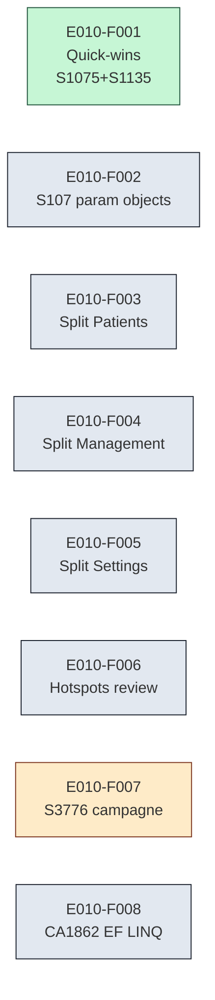

# E010 — Sonar cleanup api-mail (hors coverage)

> **Statut** : En cours
> **Modèle** : task-driven
> **Version** : 0.3
> **Auteur** : *À compléter par le PO.*
> **Dernière mise à jour** : 2026-05-17
> **Audience** : direction technique, PO, conformité qualité.
> **Document frère (vue ingénierie / dette / audit)** : [`E010-Changelogs.md`](./E010-Changelogs.md)

---

<!-- toc:start — section générée par /tech-writer ; ne pas éditer manuellement -->

## Sommaire

- [1. Vision](#1-vision)
- [2. Objectifs métier](#2-objectifs-métier)
- [3. Acteurs concernés](#3-acteurs-concernés)
- [4. Features de l'EPIC](#4-features-de-lepic)
- [5. Workflow entre Features](#5-workflow-entre-features)
- [6. Règles métier transverses](#6-règles-métier-transverses)
- [7. Contraintes et hypothèses](#7-contraintes-et-hypothèses)
- [8. Critères d'acceptation de l'EPIC](#8-critères-dacceptation-de-lepic)
- [9. Hors périmètre](#9-hors-périmètre)
- [État de couverture](#état-de-couverture-2026-05-17)
- [Synthèse fonctionnelle des changelogs](#synthèse-fonctionnelle-des-changelogs)

<!-- toc:end -->

---

## 1. Vision

L'EPIC E010 regroupe les chantiers de **cleanup de dette qualité Sonar** sur le backend `api-mail`, hors couverture de tests (qui fait l'objet d'un EPIC séparé). L'objectif est de réduire les **code smells**, **hotspots de sécurité** et **complexité cognitive** identifiés par l'analyse statique SonarQube, sans introduire de régression fonctionnelle. Chaque chantier est cadré (1 règle ou 1 famille cohérente = 1 task = 1 PR) pour rester revuable et mergeable individuellement, en parallèle des chantiers métier.

*La présente vision est un placeholder dérivé du titre EPIC. À ajuster par le PO selon la priorité stratégique réelle attribuée à la dette qualité.*

---

## 2. Objectifs métier

- [ ] Maintenir les ratings **Reliability / Security / Maintainability = A** sur `api-mail` à chaque merge.
- [ ] Réduire le compteur global de code smells de la baseline 2026-05-17 (**1064**) vers une cible que le PO fixera.
- [ ] Traiter à 0 les hotspots de sécurité (`security_hotspots = 0`).
- [ ] Tenir le **Quality Gate sur new code** (`new_violations = 0`, `new_coverage ≥ 80 %`) à chaque PR de cette EPIC.

*À ajuster par le PO selon les seuils contractuels (Ségur / interne).*

---

## 3. Acteurs concernés

| Acteur | Rôle dans l'EPIC |
|--------|------------------|
| Équipe ingénierie backend | Exécutante — implémente les fix par lot via `/sonar` / `/sonar-s3776`. |
| Direction technique | Arbitre les priorités de dette et les compromis (suppress vs refactor). |
| PO | Approuve le découpage en tasks et le rythme des PRs. |

---

## 4. Features de l'EPIC

> Le bilan d'avancement par feature (statut, couverture, tasks contributives) est consigné en fin de document, dans la section *État de couverture*.

| # | Feature | Description courte | Dépendances |
|---|---------|--------------------|-------------|
| E010-F001 | Quick-wins S1075 + S1135 + exclusion Migrations | Externalisation URI Flagsmith, reformulation TODO `NewMailNotifier`, exclusion `**/Migrations/**` de l'analyse. | Aucune |
| E010-F002 | S107 — param objects | Refactor des méthodes / constructeurs primaires à plus de 7 paramètres en `*Options` / `*Args` records. | Aucune |
| E010-F003 | Split `PatientsController` (S6960) | Découpage du contrôleur Patients en contrôleurs cohérents + alignement des deux frontends. | Aucune |
| E010-F004 | Split `ManagementController` (S6960) | Même split sur ManagementController (health, diagnostics, settings admin, ops). | Aucune |
| E010-F005 | Split `SettingsController` (S6960) | Même split sur SettingsController (settings user, tenant, feature flags, préférences UI). | Aucune |
| E010-F006 | Review + traitement des security hotspots | Bascule des 5 (actuellement 7) hotspots de `TO_REVIEW` vers `SAFE` / `ACKNOWLEDGED` / `FIXED`. | Aucune |
| E010-F007 | Campagne S3776 cognitive complexity | 39 méthodes à dé-complexifier — workflow manuel `1 méthode = 1 PR` via `/sonar-s3776`. Pilotée par `meta-task-046`. | Aucune |
| E010-F008 | CA1862 EF LINQ — investigation + décision | 49 occurrences en `Where(...)` EF Core LINQ. Investigation translatabilité Npgsql 10 préalable obligatoire, puis fix ou `SuppressMessage` selon résultat. | Aucune |

Toutes les features sont **parallélisables** (aucune dépendance inter-feature). Le rythme de delivery est piloté par la disponibilité de revue humaine et de bandwidth ingénierie.

---

## 5. Workflow entre Features

**Description du workflow** : 8 chantiers indépendants menés en parallèle, chacun produisant 1 PR (sauf F007 qui produit ~39 PRs, une par méthode S3776). Aucune feature n'attend une autre.

---

## 6. Règles métier transverses

L'EPIC E010 est un EPIC de **dette technique** — il n'introduit pas de règle métier Ségur / Ref#2 / ENS spécifique. Les règles transverses applicables sont les invariants qualité que chaque PR de l'EPIC doit respecter :

| ID | Règle | Description |
|----|-------|-------------|
| RG-E010-01 | Test-first sur fix comportemental | Tout fix qui change le comportement runtime doit être précédé d'un test unitaire RED puis GREEN (CLAUDE.md règle 1). |
| RG-E010-02 | Pas de régression de couverture | Aucun fix Sonar ne doit faire baisser la couverture globale. |
| RG-E010-03 | Ratings A préservés | Chaque PR doit maintenir Reliability / Security / Maintainability = A. |
| RG-E010-04 | Pas de fix mécanique en zone EF LINQ | Les patterns `.ToLower().Contains(x)` dans les `Where(...)` EF Core sont **fragiles** — toujours valider la traduction SQL générée avant tout fix (voir F008). |

---

## 7. Contraintes et hypothèses

### Contraintes
- Best-effort sur la dette legacy — `/sonar` accepte jusqu'à 5 itérations par run et accepte les findings restants au-delà.
- Zero-new-debt sur le new code — aucun fix de l'EPIC ne doit introduire un finding sur la portion modifiée du code.
- Coverage hors scope — l'amélioration de la couverture de tests fait l'objet d'un EPIC séparé.

### Hypothèses
- Le quality profile actif (`Weda way`, switché depuis `Sonar way` le 2026-05-14) reste stable pendant la durée de l'EPIC. Tout changement de profile invaliderait la baseline et recalibrerait les cibles.
- L'exclusion `**/Migrations/**` reste valable tant que les migrations EF restent append-only et générées par tooling.

---

## 8. Critères d'acceptation de l'EPIC

- [ ] Toutes les Features (E010-F001 → F008) sont implémentées et mergeées.
- [ ] Re-analyse Sonar finale : code smells ≤ cible PO, hotspots = 0, ratings A/A/A.
- [ ] Aucune régression fonctionnelle attestée par le humain (HAG, CLAUDE.md règle 10).
- [ ] Les décisions de design notables (param object naming, controller splits, EF LINQ strategy) sont consignées dans le changelogs file et pointées depuis le doc produit.

---

## 9. Hors périmètre

- **Couverture de tests** — `coverage = 66.3 %` au 2026-05-17. L'amélioration de la couverture fait l'objet d'un EPIC dédié (TBD).
- **Rotation de secrets** — la nouvelle analyse multi-language a révélé un token SonarQube en clair dans `report_coverage.ps1` et une clé OpenAI réelle dans `appsettings.json:L63`. Ces leaks sont **pré-existants** et hors scope E010 ; à traiter dans une task dédiée (rotation + suppression / .gitignore).
- **Refonte architecturale** — l'EPIC reste cosmétique-Sonar. Aucun refactor structurel (changement de couche, migration de framework, ré-architecture DDD) n'est dans le périmètre.
- **`client-blazor` et `client-angular`** — non couverts par cette EPIC, sauf en alignement minimal nécessaire suite aux splits de contrôleurs (F003-F005). L'amélioration qualité côté frontend est traitée hors E010.

---

## État de couverture (2026-05-17)

| Feature | Statut | Couverture | Tasks contributives |
|---------|--------|------------|---------------------|
| E010-F001 Quick-wins S1075 + S1135 + Migrations | ✅ Done | 100 % | task-040 |
| E010-F002 Refactor de design API (S107 → records `*Options`) | ✅ Done | 100 % | task-041 |
| E010-F003 Split PatientsController | ⛔ Closed no-op | n/a | task-042 |
| E010-F004 Split ManagementController | ⚪ Todo | 0 % | task-043 |
| E010-F005 Split SettingsController | ⛔ Closed no-op | n/a | task-044 |
| E010-F006 Hotspots review | ⚪ Todo | 0 % | task-045 |
| E010-F007 S3776 campagne (39 méthodes) | 🟡 En cours | 0 % | meta-task-046 |
| E010-F008 CA1862 EF LINQ investigation | ⚪ Todo | 0 % | task-047 |

**Couverture EPIC consolidée : ~40 %** (2 features livrées + 2 fermées no-op sur 8 — la campagne S3776 progresse à son propre rythme et ne s'incrémente pas au global tant que les 39 PRs ne sont pas toutes mergeées).

> **Note F002** — la portée s'est précisée pendant task-041 : la règle `csharpsquid:S107` n'est pas activée dans le profile Sonar courant. La feature couvre désormais l'amélioration de design des API publiques (interface `ISemanticSearchService` refactorée en records immutables).
>
> **Note F003 + F005 (closed no-op)** — la règle `csharpsquid:S6960` (controllers should have mixed responsibilities) **n'est pas non plus dans le profile `Weda way`**. Inspection préalable au `/start task-042` (option C.2) :
> - `PatientsController` (368 LOC, 10 endpoints, 4 groupes de responsabilités) → borderline ; coût refactor (3 repos + US-complete merge gate) >> bénéfice cosmétique. **Fermée**.
> - `SettingsController` (75 LOC, 4 endpoints) → trop petit, split dégraderait la lisibilité. **Fermée**.
> - `ManagementController` (530 LOC, 7 endpoints, 2 groupes nets AI/embeddings vs email maintenance) → vrai cas. **Reste en F004**.

---

## Synthèse fonctionnelle des changelogs

> Les changelogs détaillés (PR #, tests, métriques Sonar, fichiers touchés) vivent dans [`E010-Changelogs.md`](./E010-Changelogs.md). Cette section consigne uniquement les **livraisons produit/conformité** dans une langue accessible au PO.

### Fonctionnalités métier

*(Aucune — l'EPIC est dette technique pure.)*

### Conformité réglementaire

*(Aucune règle Ségur / Ref#2 / ENS directement adressée par l'EPIC.)*

### Sécurité

- **v0.1 — Externalisation de l'URL Flagsmith** (task-040) : suppression du fallback `localhost` hardcodé dans le code. La plateforme refuse désormais de démarrer si l'URL feature-flag n'est pas explicitement configurée (fail-fast au boot, au lieu de silently pointer sur une URL de dev).

### Technique / observabilité

- **v0.2 — Simplification de l'API de recherche** (task-041) : l'interface `ISemanticSearchService` passe de 8 et 7 paramètres par méthode à 1 record `*Options` immutable par méthode. Aucun changement de comportement utilisateur ni de contrat HTTP. Bénéfice pour l'équipe : ajouter un nouveau knob de recherche revient désormais à ajouter une propriété au record, sans toucher tous les sites d'appel.
- **v0.2 — Couverture de tests api-mail enrichie** (task-041) : passage de 2092 à 2096 tests verts (+4 dédiés aux records de la nouvelle API). Couverture Sonar globale 70.6 % → 73.3 % (+2.7 pp).
- **v0.1 — Exclusion préventive des migrations EF de l'analyse Sonar** (task-040) : `**/Migrations/**` désormais ignoré par l'analyseur. Pas d'impact runtime ; évite les futurs faux positifs sur des migrations append-only générées par tooling.
- **v0.1 — Reformulation du TODO `NewMailNotifier`** (task-040) : remplacé par un `// Note:` explicatif pointant le contexte domaine. Aucun changement comportemental.

---

*Document produit maintenu par `/tech-writer` (mode task-driven). Voir [`E010-Changelogs.md`](./E010-Changelogs.md) pour les détails ingénierie.*
