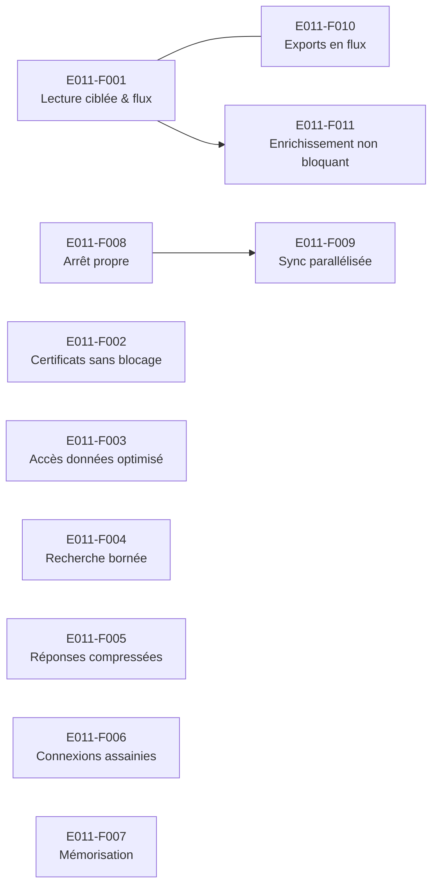

# E011 — Performance API Mail

> **Statut** : 🟢 En cours
> **Modèle** : task-driven
> **Version** : 1.0
> **Auteur** : PO forge (audit performance du 2026-06-10)
> **Audience** : PO, médecin, direction — la vue ingénierie vit dans [E011-Changelogs.md](E011-Changelogs.md)
> **Dernière mise à jour** : 2026-06-12

---

<!-- toc:start — section générée par /tech-writer ; ne pas éditer manuellement -->

## Sommaire

- [1. Vision](#1-vision)
- [2. Objectifs métier](#2-objectifs-métier)
- [3. Acteurs concernés](#3-acteurs-concernés)
- [4. Features de l'EPIC](#4-features-de-lepic)
- [5. Workflow entre Features](#5-workflow-entre-features)
- [6. Règles métier transverses](#6-règles-métier-transverses)
- [7. Contraintes et hypothèses](#7-contraintes-et-hypothèses)
- [8. Critères d'acceptation de l'EPIC](#8-critères-dacceptation-de-lepic)
- [9. Hors périmètre](#9-hors-périmètre)
- [État de couverture (2026-06-12)](#état-de-couverture-2026-06-12)
- [Synthèse fonctionnelle des changelogs](#synthèse-fonctionnelle-des-changelogs)

<!-- toc:end -->

---

## 1. Vision

La messagerie sécurisée doit répondre instantanément, même sur des boîtes
volumineuses et des documents médicaux lourds. Cet EPIC regroupe les dix
chantiers de performance issus de l'audit complet du backend de messagerie
(juin 2026) : ouvrir un message, télécharger une pièce jointe, rechercher,
synchroniser la boîte — chaque geste du praticien doit rester fluide, sans
changer ni l'apparence ni le comportement métier de l'application.

---

## 2. Objectifs métier

- [ ] Objectif 1 : l'ouverture d'un message volumineux (pièces jointes lourdes) est perçue comme immédiate — le contenu s'affiche sans télécharger les pièces jointes.
- [ ] Objectif 2 : la synchronisation initiale d'une boîte chargée et les actions en masse (déplacement, suppression) ne dégradent plus la réactivité de l'application.
- [ ] Objectif 3 : la consommation mémoire du serveur reste stable quelle que soit la taille des messages traités (plus aucun risque de saturation lié aux pièces jointes ou aux exports).
- [ ] Objectif 4 : aucun changement fonctionnel visible — mêmes écrans, mêmes règles métier, mêmes données ; seule la vitesse change.

---

## 3. Acteurs concernés

| Acteur | Rôle dans l'EPIC |
|--------|------------------|
| Médecin généraliste | Bénéficiaire principal : consultation et envoi plus rapides |
| Secrétariat médical | Bénéficiaire : actions en masse (tri, classement, suppression) accélérées |
| Exploitant / hébergeur HDS | Bénéficiaire : stabilité mémoire et charge serveur maîtrisée |
| Équipe technique | Réalise les optimisations et garantit la non-régression |

---

## 4. Features de l'EPIC

> Le bilan d'avancement par feature (statut, couverture, tasks contributives)
> est consigné en fin de document, dans la section *État de couverture*.

| # | Feature | Description courte | Dépendances |
|---|---------|-------------------|-------------|
| E011-F001 | Lecture ciblée des messages et pièces jointes en flux | Le serveur ne récupère que la partie du message réellement demandée et transmet les pièces jointes en continu, sans les charger entièrement en mémoire | Aucune |
| E011-F002 | Validation des certificats sans blocage | La vérification des certificats de l'Espace de Confiance ne fige plus les connexions ; les vérifications répétées sont mémorisées | Aucune |
| E011-F003 | Accès aux données optimisé | Les listes et recherches en base s'appuient sur des index et des requêtes groupées, sans lectures superflues | Aucune |
| E011-F004 | Recherche bornée et rapide | La recherche plein-texte et sémantique travaille sur des volumes maîtrisés, avec des résultats identiques | Aucune |
| E011-F005 | Réponses compressées et traitement allégé des requêtes | Les échanges réseau sont compressés et chaque requête évite les travaux répétitifs inutiles | Aucune |
| E011-F006 | Connexions sortantes assainies | Les appels vers les services d'intelligence artificielle réutilisent des connexions durables et correctement configurées | Aucune |
| E011-F007 | Mémorisation des données stables | Paramètres utilisateur, configuration des domaines et référentiels sont mémorisés au lieu d'être relus en permanence | Aucune |
| E011-F008 | Arrêt propre des traitements abandonnés | Quand le praticien quitte un écran, le serveur cesse le travail devenu inutile ; les traitements d'arrière-plan sont surveillés | Aucune |
| E011-F009 | Synchronisation parallélisée | La synchronisation de la boîte traite plusieurs messages de front et réutilise ses connexions | E011-F008 |
| E011-F010 | Exports en flux continu | L'export d'un message (EML, PDF) est transmis au fur et à mesure de sa construction, sans limite de taille pratique | Aucune |
| E011-F011 | Enrichissement non bloquant | Pendant qu'un lot de messages s'enrichit en arrière-plan (corps, documents médicaux), la navigation dans les dossiers et les listes reste immédiate | Aucune |
| E011-F012 | Liste des dossiers accélérée | Le chargement de la liste des dossiers n'interroge plus le serveur dossier par dossier : un seul échange suffit, sans réapparition des dossiers fantômes | Aucune |

---

## 5. Workflow entre Features

**Description du workflow** :

1. Les features sont **indépendantes** et peuvent être livrées dans n'importe quel ordre, à une exception près.
2. **E011-F009** (synchronisation parallélisée) s'appuie sur **E011-F008** (arrêt propre des traitements) : on ne parallélise la synchronisation qu'une fois ses mécanismes d'interruption fiabilisés, pour éviter de multiplier des travaux impossibles à arrêter.
3. **E011-F001** et **E011-F010** partagent la même philosophie (transmission en flux continu) et se complètent : la première couvre la consultation, la seconde l'export.
4. **E011-F011** (enrichissement non bloquant, task-079) prolonge E011-F001 sur le même terrain : après le téléchargement ciblé, le traitement d'arrière-plan qui enrichit les messages cesse de bloquer la navigation du praticien.

---

## 6. Règles métier transverses

| ID | Règle | Description | Statut |
|----|-------|-------------|--------|
| RG-E011-01 | Aucune donnée de santé dans les journaux | Aucune optimisation ne doit introduire d'INS, de NIR ni de contenu médical en clair dans les journaux techniques | ✅ Respectée (task-077) |
| RG-E011-02 | Contrats et écrans inchangés | Les adresses des services et les formats de données restent identiques ; les applications du praticien fonctionnent sans mise à jour | ✅ Respectée (task-077) |
| RG-E011-03 | Comportement métier strictement conservé | Chaque optimisation produit les mêmes résultats qu'avant (mêmes messages, mêmes documents, mêmes états lus/non lus) — prouvé par les tests | ✅ Respectée (task-077) |
| RG-E011-04 | Arbitrages sécurité explicites | Tout compromis entre performance et sécurité (vérification des certificats, compression des réponses) est documenté et validé humainement avant mise en œuvre | ✅ Respectée (task-069) |

---

## 7. Contraintes et hypothèses

### Contraintes
- L'environnement de production reste un hébergement certifié HDS ; aucune optimisation ne déplace de données de santé hors de cet environnement.
- Les exigences MSSanté (certificats IGC Santé, espace de confiance) restent intégralement honorées.
- Une seule validation humaine de bout en bout par user story avant toute mise sur la branche principale.

### Hypothèses
- La campagne d'amélioration de la couverture de tests (EPIC E009) se poursuit en parallèle et sécurise les zones de code héritées.
- Les mesures avant/après (temps de réponse, mémoire) sont relevées lors des tests manuels de chaque user story.

---

## 8. Critères d'acceptation de l'EPIC

- [ ] Toutes les Features sont implémentées et validées.
- [ ] Les objectifs de réactivité (ouverture de message, téléchargement, synchronisation) sont constatés lors des tests manuels.
- [ ] Aucun changement de comportement métier ni de format d'échange n'a été introduit.
- [x] Les arbitrages sécurité (certificats, compression) sont documentés et validés.

---

## 9. Hors périmètre

- La réduction de la complexité cognitive du code (traitée méthode par méthode, en dehors de cet EPIC).
- L'augmentation de la couverture de tests du code hérité (portée par l'EPIC E009).
- Les optimisations des applications du praticien (navigateur) — cet EPIC concerne uniquement le serveur de messagerie.
- Les autres services de la plateforme (annuaire, proxy d'identité).

---

## État de couverture (2026-06-12)

| Feature | Statut | Couverture | Tasks contributives |
|---------|--------|------------|---------------------|
| E011-F001 Lecture ciblée & flux | ✅ Mergée sur develop | 100% | task-068 |
| E011-F002 Certificats sans blocage | 🟡 En validation (PR ouverte) | 100% implémenté | task-069 |
| E011-F003 Accès données optimisé | 🟡 En validation (PR ouverte) | 100% implémenté | task-070 |
| E011-F004 Recherche bornée | 🟡 En validation (PR ouverte) | 100% implémenté | task-071 |
| E011-F005 Réponses compressées | 🟡 En validation (PR ouverte) | 100% implémenté | task-072 |
| E011-F006 Connexions assainies | 🟡 En validation (PR ouverte) | 100% implémenté | task-073 |
| E011-F007 Mémorisation | 🟡 En validation (PR ouverte) | 100% implémenté | task-074 |
| E011-F008 Arrêt propre | 🟡 En validation (PR ouverte) | 100% implémenté | task-075 |
| E011-F009 Sync parallélisée | 🟡 En validation (PR ouverte) | 100% implémenté | task-076 |
| E011-F010 Exports en flux | 🟡 En validation (PR ouverte) | 100% implémenté | task-077 |
| E011-F011 Enrichissement non bloquant | 🟡 En validation (PR ouverte) | 100% implémenté | task-079 |
| E011-F012 Liste des dossiers accélérée | 🟡 En validation (PR ouverte) | 100% implémenté | task-080 |

**Couverture EPIC consolidée : 100 % implémenté** (1 feature mergée + 11 en validation, sur 12 — il ne reste aucune feature à développer ; la clôture de l'EPIC attend les validations humaines).

---

## Synthèse fonctionnelle des changelogs

### Fonctionnalités métier
- v1.0 — L'ouverture d'un message n'entraîne plus le téléchargement de ses pièces jointes : le contenu s'affiche immédiatement, même pour les messages très volumineux (task-068).
- v1.0 — Le téléchargement d'une pièce jointe démarre instantanément et reste fiable quelle que soit sa taille (task-068).
- v1.0 — La suppression et le déplacement de messages, à l'unité comme en masse, s'exécutent côté serveur de messagerie sans transfert inutile : l'action est quasi immédiate (task-068).

### Conformité réglementaire
- v1.0 — Les exigences MSSanté et la protection des données de santé dans les journaux sont vérifiées et maintenues à l'identique.

### Sécurité
- v1.10 — La vérification des certificats de l'Espace de Confiance refuse désormais systématiquement un certificat révoqué, sur tous les chemins de contrôle (correction d'une faille latente détectée pendant le chantier). En cas d'indisponibilité du service de vérification de l'ANS, le comportement est arbitré et validé humainement : une vérification récente reste acceptée pendant 4 heures au maximum, avec un évènement journalisé à chaque acceptation dégradée ; au-delà, la connexion est refusée (task-069).

### Technique / observabilité (sans impact utilisateur direct)
- v1.12 — **Le serveur cesse de préparer un affichage que l'écran ne montre pas.** La messagerie peut présenter les échanges de deux façons : une liste simple, un message par ligne — c'est le **réglage par défaut** — ou une vue par conversations, qui regroupe les messages d'un même échange et affiche un compteur « N messages ». Préparer ces regroupements coûte au serveur **deux interrogations de la base à chaque page** de la boîte de réception. Or, en mode Liste, l'application **recevait ce travail puis le jetait** : l'écran n'en montre rien. Chaque page de chaque praticien resté sur le réglage par défaut payait donc un calcul entièrement inutile. Désormais l'application **dit** au serveur si elle affiche les conversations, et le serveur ne prépare que ce qui sera montré. **Rien ne change à l'écran** : en mode Liste l'affichage était déjà identique, et en mode Conversation les compteurs sont inchangés. Un point de vigilance a été traité explicitement : l'ancien client Blazor, qui ne connaît pas ce réglage et affiche toujours les compteurs, **continue de les recevoir** — il ne dit rien, donc il garde le comportement d'avant (task-266).
- v1.11 — La synchronisation d'arrière-plan de la boîte traite plusieurs messages de front (degré réglable) et conserve sa connexion à la messagerie d'un cycle à l'autre, entretenue automatiquement : la synchronisation initiale d'une boîte volumineuse est nettement accélérée, l'application reste réactive pendant la synchronisation (plus de file d'attente unique entre praticiens connectés), et l'affichage de progression reste fluide sans inonder le navigateur de notifications (task-076).
- v1.10 — L'établissement des connexions à la messagerie sécurisée ne fige plus le serveur pendant la vérification des certificats : le contrôle s'effectue désormais en tâche de fond juste après la prise de contact, avant tout échange d'identifiants, et les éléments stables de la vérification sont mémorisés. La première connexion est plus rapide et les suivantes quasi instantanées (task-069).
- v1.9 — L'export et l'impression d'un message (EML, PDF) sont transmis au fur et à mesure de leur construction : le téléchargement démarre immédiatement et la mémoire du serveur ne dépend plus de la taille des messages ; le journal d'audit est enregistré par lots sans perdre aucune trace (task-077).
- v1.8 — Quand le praticien quitte un écran, le serveur cesse le travail devenu inutile ; les traitements d'arrière-plan (enrichissement, synchronisation) sont désormais surveillés : leurs erreurs sont journalisées et l'arrêt de l'application les interrompt proprement (task-075).
- v1.7 — Les paramètres du praticien, la configuration des domaines MSSanté et la catégorisation des documents médicaux sont mémorisés au lieu d'être relus en permanence : chaque connexion et chaque affichage de liste coûte moins cher, et un changement de paramètre reste pris en compte immédiatement (task-074).
- v1.6 — Les appels vers les services d'intelligence artificielle réutilisent des connexions durables et correctement configurées : plus d'épuisement de connexions réseau lors d'usages intensifs des fonctions IA, comportement fonctionnel identique (task-073).
- v1.5 — Les réponses du serveur sont compressées (3 à 5 fois plus légères sur le réseau) et chaque requête coûte moins cher à traiter : les tentatives d'accès sans identification sont rejetées avec un traçage allégé mais conservé, conformément aux exigences de sécurité (task-072).
- v1.4 — La recherche dans les messages ne charge plus la boîte entière en mémoire : chaque terme est borné aux correspondances les plus récentes, et la liste « patients du jour » est plafonnée. Les termes recherchés — potentiellement le nom d'un patient — n'apparaissent plus en clair dans les journaux techniques (task-071).
- v1.3 — Les écrans qui s'appuient sur la base de données — listes de messages taggés, dossier patient — répondent plus vite : les recherches de patients sont indexées et groupées, et le classement d'un message comportant plusieurs documents du même patient ne crée plus qu'une seule fiche patient partagée (task-070).
- v1.2 — Le chargement de la liste des dossiers passe d'une vingtaine d'échanges avec le serveur de messagerie à un seul : l'opération qui pouvait monopoliser la connexion une dizaine de secondes se termine désormais en un ou deux, et les dossiers fantômes restent exclus comme avant (task-080).
- v1.1 — Pendant qu'un lot de messages s'enrichit en arrière-plan, la navigation (changement de dossier, rafraîchissement des listes) répond immédiatement : la récupération réseau et l'enregistrement en base ne se bloquent plus mutuellement, avec les mêmes protections contre les doublons (task-079).
- v1.0 — La consommation mémoire du serveur ne dépend plus de la taille des pièces jointes consultées ; la qualité du nouveau code est vérifiée automatiquement avant chaque livraison (task-068).

---

*Document produit — la vue ingénierie détaillée (PR, tests, métriques) vit dans [E011-Changelogs.md](E011-Changelogs.md).*
