# E012 — Client mobile MSSanté

> **Statut** : 🟢 En cours
> **Modèle** : hand-crafted
> **Version** : 2.0
> **Auteur** : PO forge
> **Audience** : PO, médecin, direction — la vue ingénierie vit dans [E012-Changelogs.md](E012-Changelogs.md)
> **Dernière mise à jour** : 2026-07-17 (task-166)

---

<!-- toc:start — section générée par /tech-writer ; ne pas éditer manuellement -->

## Sommaire

- [1. Vision](#1-vision)
- [2. Objectifs métier](#2-objectifs-métier)
- [3. Acteurs concernés](#3-acteurs-concernés)
- [4. Fonctionnalités de l'EPIC](#4-fonctionnalités-de-lepic)
- [5. Parcours utilisateur](#5-parcours-utilisateur)
- [6. Règles transverses](#6-règles-transverses)
- [7. Contraintes et hypothèses](#7-contraintes-et-hypothèses)
- [8. Critères d'acceptation de l'EPIC](#8-critères-dacceptation-de-lepic)
- [9. Hors périmètre](#9-hors-périmètre)
- [10. Guide des fonctionnalités](#10-guide-des-fonctionnalités)
  - [10.1 Se connecter avec e-CPS](#101-se-connecter-avec-e-cps)
  - [10.2 Consulter sa messagerie](#102-consulter-sa-messagerie)
  - [10.3 Lire un message et ses documents](#103-lire-un-message-et-ses-documents)
  - [10.4 Gérer les résultats de biologie](#104-gérer-les-résultats-de-biologie)
  - [10.5 Écrire et envoyer un message](#105-écrire-et-envoyer-un-message)
  - [10.6 Rattacher un document à un patient](#106-rattacher-un-document-à-un-patient)
  - [10.7 Consulter le dossier d'un patient](#107-consulter-le-dossier-dun-patient)
  - [10.8 Personnaliser l'application](#108-personnaliser-lapplication)
  - [10.9 Gérer ses signatures](#109-gérer-ses-signatures)
- [État de couverture (2026-07-16)](#état-de-couverture-2026-07-16)
- [État visuel de l'application (2026-07-16)](#état-visuel-de-lapplication-2026-07-16)
- [Synthèse fonctionnelle des changelogs](#synthèse-fonctionnelle-des-changelogs)

<!-- toc:end -->

## 1. Vision

Permettre au médecin de **gérer sa messagerie sécurisée de santé depuis son
téléphone**, avec la même richesse d'information que sur son poste de
travail : mêmes messages, mêmes documents médicaux, mêmes résultats de
biologie, mêmes alertes. En visite, en garde ou entre deux consultations, le
praticien consulte, répond, acquitte un résultat critique et retrouve le
dossier d'un patient — sans attendre d'être de retour au cabinet, et sans
jamais compromettre la confidentialité des données de santé.

## 2. Objectifs métier

- [x] Consulter ses messages MSSanté sur mobile avec un contenu **identique** au poste de travail
- [x] Naviguer entre les répertoires de la boîte et rechercher un message
- [x] Gérer ses messages : lu/non-lu, suivi, suppression, déplacement, brouillons
- [x] Envoyer, répondre, transférer — avec les mêmes garde-fous réglementaires que sur le web
- [x] Voir et **acquitter les résultats de biologie** anormaux, avec traçabilité
- [x] Retrouver un patient et consulter son dossier (documents, biologie, synthèse)
- [x] Se connecter par **e-CPS** sans quitter l'application
- [x] Régler ses préférences, partagées avec le poste de travail

## 3. Acteurs concernés

| Acteur | Rôle dans l'EPIC |
|--------|------------------|
| Médecin généraliste | Utilisateur principal — lit, gère et envoie ses messages en mobilité |
| Patient | Émetteur/destinataire de messages via Mon Espace Santé (identité affichée, jamais exposée dans les journaux techniques) |
| Laboratoire / confrère | Émetteur de documents médicaux et de résultats de biologie |

## 4. Fonctionnalités de l'EPIC

| Fonctionnalité | Ce que le praticien peut faire | Tasks | Statut |
|---|---|---|---|
| Connexion e-CPS | Se connecter avec son RPPS et valider sur son application e-CPS, sans quitter l'app ; si la messagerie n'est pas encore configurée, être guidé pour l'activer avant d'entrer dans l'application | task-136, task-159 | ✅ Livrée |
| Messagerie | Consulter la boîte, naviguer entre répertoires, **organiser ses dossiers personnels** (créer, renommer, supprimer), suivre le **quota** de la boîte, filtrer, rechercher, suivre les conversations, être notifié des nouveaux messages | task-095, task-103, task-104, task-106, task-107, task-108, task-143 | ✅ Livrée |
| Lecture d'un message | Ouvrir un message avec son identité patient, ses documents médicaux, ses pièces jointes, sa synthèse IA ; émettre un accusé de lecture sur demande | task-096, task-097, task-101, task-105, task-131 | ✅ Livrée |
| Biologie | Visualiser les résultats avec mise en évidence des valeurs hors norme et **acquitter** avec traçabilité | task-098 | ✅ Livrée |
| Actions sur les messages | Marquer lu/non-lu, suivre, supprimer, déplacer — d'un balayage, depuis le message, ou **sur plusieurs messages à la fois** (sélection multiple par appui long) | task-099, task-141 | ✅ Livrée |
| Écriture et envoi | Composer, répondre, transférer, joindre des fichiers — avec garde-fous d'identité patient — et retrouver ses **brouillons** auto-sauvegardés | task-100, task-138, task-139 | ✅ Livrée |
| Signatures | Gérer ses **signatures** (créer, modifier, supprimer, définir la signature par défaut) ; la signature par défaut est ajoutée automatiquement à chaque nouveau message et peut être changée à la volée | task-145 | ✅ Livrée |
| Rattachement patient | Rattacher un document reçu au bon patient de sa base par comparaison visuelle | task-137 | ✅ Livrée |
| Dossier patient | Rechercher un patient, consulter sa fiche, ses documents, l'évolution de sa biologie et sa synthèse clinique ; gérer son opposition | task-132, task-133, task-134, task-135 | ✅ Livrée |
| Préférences | Régler l'identité d'envoi, les défauts d'ouverture, la recherche et les notifications — réglages **partagés avec le poste de travail** | task-140 | 🟡 En validation |
| Continuité de session | Rester connecté sans re-saisie pendant l'usage courant ; retour à l'écran de connexion en fin de session | task-102 | ✅ Livrée |

> Le bilan d'avancement détaillé est consigné en fin de document, dans la
> section *État de couverture*. Le guide d'utilisation de chaque
> fonctionnalité est au chapitre 10.

## 5. Parcours utilisateur

Le quotidien du praticien en mobilité, tel que l'application le prend en
charge :

1. **Connexion** — saisie du RPPS, validation sur l'application e-CPS,
   arrivée directe sur la boîte de réception.
2. **Tri du courrier** — la boîte s'ouvre sur le dossier et le filtre
   choisis dans les préférences ; les nouveaux messages arrivent en temps
   réel ; un badge signale les résultats de biologie à traiter.
3. **Lecture** — le message s'ouvre avec le titre du document médical,
   l'identité du patient et les pièces jointes ; une synthèse IA est
   disponible à la demande.
4. **Action clinique** — un résultat de biologie anormal s'acquitte avec
   traçabilité ; un document non rattaché se rattache au bon patient ; une
   réponse part au confrère.
5. **Dossier patient** — depuis l'onglet Patients, le praticien retrouve la
   fiche, l'historique documentaire, l'évolution de la biologie et la
   synthèse clinique du patient.
6. **Déconnexion** — depuis l'onglet Paramètres, avec confirmation.

## 6. Règles transverses

- **Aucune perte d'information par rapport au poste de travail** : tout ce
  que le web affiche (titre du document médical, identité patient, alertes,
  contenu, pièces jointes, biologie) est visible sur mobile.
- **Aucune donnée de santé en clair** dans les journaux techniques, les
  adresses ou les notifications : l'identité des patients et le contenu des
  messages ne quittent jamais le canal sécurisé.
- **Aucune donnée de santé stockée sur le téléphone** : les messages,
  documents et préférences vivent sur les serveurs agréés « données de
  santé » ; l'application les consulte, elle ne les conserve pas.
- **Authentification de professionnel de santé** obligatoire (e-CPS ou
  Pro Santé Connect) ; chaque action sensible (envoi, acquittement,
  rattachement) est **tracée** côté serveur avec l'identité du praticien.
- **Interface en français**, pensée pour un usage à une main sur téléphone.

## 7. Contraintes et hypothèses

- Le mobile s'appuie sur les **mêmes services** que le poste de travail :
  un réglage, un acquittement ou un rattachement effectué sur mobile est
  immédiatement visible sur le web, et réciproquement.
- La consultation nécessite une **connexion internet** : pas de mode hors
  ligne (conséquence directe de la règle « aucune donnée de santé sur le
  téléphone »).
- L'application vise les smartphones (iOS/Android) en usage vertical.

## 8. Critères d'acceptation de l'EPIC

- [ ] Le médecin retrouve sur mobile **le même contenu** que sur le web pour
  un message donné (comparaison côte à côte).
- [x] Répertoires, consultation, actions de messagerie, envoi et brouillons
  fonctionnels.
- [x] Biologie visible et acquittable, avec traçabilité.
- [x] Dossier patient consultable (fiche, documents, biologie, synthèse).
- [ ] Chaque livraison est validée à la main par le praticien référent avant
  mise à disposition (aucune fonctionnalité « à moitié livrée »).

## 9. Hors périmètre

- **Notifications système du téléphone** (bannières hors application) — les
  alertes actuelles s'affichent dans l'application ouverte.
- Signatures et modèles de messages, éditeur de texte enrichi complet.
- Envoi « annule et remplace » d'un document.
- Dédoublonnage des messages, classement automatique, chat IA.
- Mode hors ligne.

---

## 10. Guide des fonctionnalités

### 10.1 Se connecter avec e-CPS

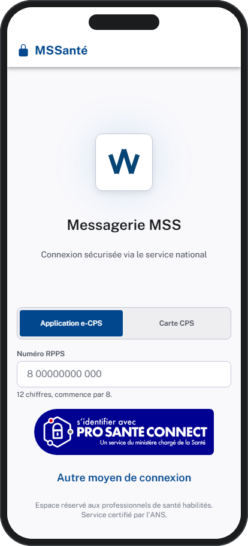

**Présentation.** La connexion par e-CPS est le moyen principal d'accès à la
messagerie mobile : le praticien s'authentifie avec sa carte de
professionnel de santé dématérialisée, sans mot de passe et sans quitter
l'application.

**Utilisation.**
1. Saisissez votre **numéro RPPS** (pré-rempli si vous vous êtes déjà
   connecté sur cet appareil) et validez.
2. L'application affiche un **code à 2 chiffres**.
3. Ouvrez votre application **e-CPS** : comparez le code affiché, puis
   validez la demande. La comparaison des codes vous protège contre les
   tentatives d'hameçonnage.
4. La boîte de réception s'ouvre automatiquement.

La connexion Pro Santé Connect par navigateur reste disponible via « Autre
moyen de connexion ».

**Situations d'erreur.**

| Situation | Message affiché | Conduite à tenir |
|---|---|---|
| RPPS inconnu ou mal saisi | « RPPS invalide / inconnu » | Vérifiez la saisie (11 chiffres après le 8) |
| Demande non validée à temps | « La demande a expiré » | Relancez la connexion et validez dans les 2 minutes |
| Service e-CPS indisponible | Message d'indisponibilité | Utilisez « Autre moyen de connexion » ou réessayez plus tard |
| Session expirée en cours d'usage | « Votre session a expiré. Veuillez vous reconnecter. » | Reconnectez-vous — l'application prolonge la session automatiquement pendant l'usage courant ; ce message n'apparaît qu'après une longue inactivité |

**Traçabilité (task-136, task-102).**

### 10.2 Consulter sa messagerie

**Présentation.** La boîte de réception présente chaque message avec le
**titre du document médical** qu'il transporte (plutôt que l'objet technique),
l'**identité du patient** concerné, et des badges : pièce jointe, document
médical, **biologie** (rouge si valeurs critiques), non-lu, suivi.

**Utilisation.**
1. La boîte s'ouvre sur le **dossier, le filtre et le mode d'affichage**
   choisis dans vos Paramètres.
2. Filtrez d'un tap : **Tous / Non lus / Suivis** ; la pastille « Bio à
   acquitter » n'affiche que les messages avec des résultats en attente.
3. Basculez **Liste / Conversation** : en Conversation, les échanges sont
   regroupés par fil (« N messages ») et se déplient pour voir les réponses.
4. Le défilement charge automatiquement les messages plus anciens ; tirez la
   liste vers le bas pour rafraîchir.
5. Le menu ☰ ouvre les **répertoires** (Boîte de réception, Envoyés,
   **Brouillons** avec compteur, dossiers personnels).
6. Un **nouveau message** apparaît de lui-même en tête de liste, signalé par
   une notification dans l'application (désactivable dans les Paramètres).

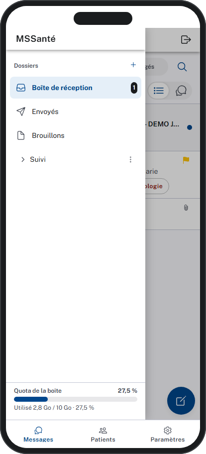

**Organiser ses dossiers personnels.** Le bouton **+** en tête de la liste
des dossiers crée un dossier. Sur un **dossier personnel** (pas sur les
dossiers du système : Boîte de réception, Envoyés, Brouillons, Corbeille…),
un appui long — ou le bouton **⋯** — ouvre un menu : **créer un
sous-dossier**, **renommer**, **supprimer** (avec confirmation). Un dossier
qui contient encore des messages ne peut pas être supprimé : l'application
l'indique par un message et conserve le dossier.

**Suivre le quota de la boîte.** En pied du volet des dossiers, une **jauge**
indique l'occupation de la boîte : « Utilisé X Go / Y Go · Z % ». Elle passe
en **orange à partir de 80 %** et en **rouge à partir de 90 %** pour anticiper
la saturation. Si l'opérateur de messagerie n'annonce pas de quota, la jauge
affiche « Quota non disponible » sans erreur.

**Rechercher un message.**

La loupe ouvre la recherche : saisissez librement (nom d'un patient, objet,
contenu…), affinez avec les filtres rapides — Non lus, Pièces jointes,
Document médical, Biologie. Les résultats remplacent la liste ; effacez la
recherche pour revenir au dossier. La **sensibilité** de la recherche se
règle dans les Paramètres (task-106).

**Situations d'erreur.** En cas de coupure réseau, un bandeau propose
**Réessayer** sans perdre votre position dans la liste.

**Traçabilité (task-095, task-103, task-104, task-106, task-107, task-108, task-143).**

### 10.3 Lire un message et ses documents

**Présentation.** Le message s'ouvre avec la même richesse que sur le poste
de travail : titre du document médical, expéditeur, destinataires, identité
du patient, version du document, et le contenu mis en forme.

**Utilisation.**
1. Le corps s'affiche en HTML sécurisé ; les **images distantes sont
   bloquées par défaut** (protection contre le pistage) — un bouton les
   révèle pour ce message uniquement.
2. Les **documents médicaux** joints s'ouvrent en onglets, mis en page pour
   l'écran du téléphone.
3. Les **pièces jointes** se prévisualisent (image, PDF, texte), se
   téléchargent une par une ou toutes ensemble.
4. **Synthèse IA** : d'un tap, une synthèse du message rédigée par l'IA
   s'affiche avec son contexte (patient, praticien, date). Si le service
   est indisponible, un message neutre l'indique sans bloquer la lecture.
5. Si l'expéditeur a demandé un **accusé de lecture**, un bandeau vous
   propose de l'émettre — l'accusé ne part **jamais** sans votre action
   explicite.
6. La barre d'actions permet de répondre, transférer, marquer, déplacer ou
   supprimer (avec confirmation).

**Bonnes pratiques.** Vérifiez l'identité du patient affichée dans l'en-tête
avant toute décision clinique fondée sur le document.

**Traçabilité (task-096, task-097, task-101, task-105, task-131).**

### 10.4 Gérer les résultats de biologie

**Présentation.** Les comptes-rendus de biologie s'affichent en tableau avec
les **valeurs hors norme mises en évidence** (orange pour anormales, rouge
pour critiques, avec flèches d'orientation et plages de référence). Le
praticien **acquitte** chaque résultat pour matérialiser sa prise en compte
— une exigence de traçabilité médico-légale.

**Utilisation.**
1. Dans la boîte, le badge biologie (rouge si critique) et la pastille
   « Bio à acquitter (N) » signalent les résultats en attente.
2. Ouvrez le message : l'onglet Biologie présente le tableau des résultats,
   filtrable sur les seules valeurs hors norme.
3. Choisissez l'action d'acquittement : **Pris connaissance, Patient
   appelé, Patient convoqué, Adressé à un confrère, Clore le suivi**.
4. Une **confirmation** récapitule l'action et liste les valeurs critiques
   concernées ; une note clinique optionnelle peut être ajoutée. Cette
   étape de confirmation est volontaire : on n'acquitte pas un résultat
   critique d'un geste distrait.
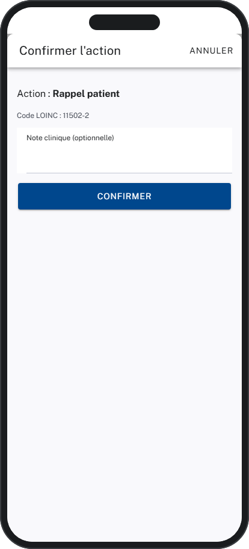

5. Le statut du suivi (À TRAITER / EN COURS / RÉSOLU) reste visible sur le
   message, et le badge de la boîte se met à jour.

**Sécurité et confidentialité.** Chaque acquittement est tracé côté serveur
avec l'identité du praticien, l'action choisie et l'horodatage
(imputabilité).

**Traçabilité (task-098).**

### 10.5 Écrire et envoyer un message

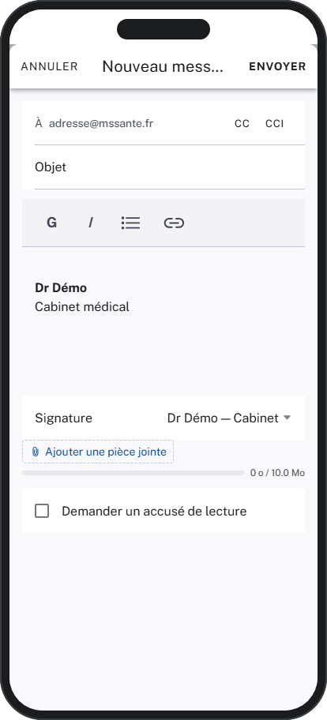

**Présentation.** La composition couvre le nouveau message, la réponse et le
transfert (pièces jointes d'origine conservées), avec les **mêmes garde-fous
réglementaires que le poste de travail** — c'est l'application, pas la
vigilance du moment, qui empêche l'erreur d'adressage.

**Utilisation.**
1. Le bouton **+** de la boîte ouvre la composition : destinataires (avec
   suggestions de l'annuaire), objet, corps mis en forme, pièces jointes
   (une **jauge** suit la taille totale autorisée).
2. Dès qu'un destinataire **Mon Espace Santé** est présent, la case
   « **Bloquer la réponse du patient** » apparaît.
3. À l'envoi vers un patient, l'application **vérifie l'identité (INS)** :
   identité non qualifiée → l'envoi est **bloqué** avec un message
   explicite ; identité qualifiée → vous **confirmez** le nom, la date de
   naissance et le sexe du patient avant le départ du message.
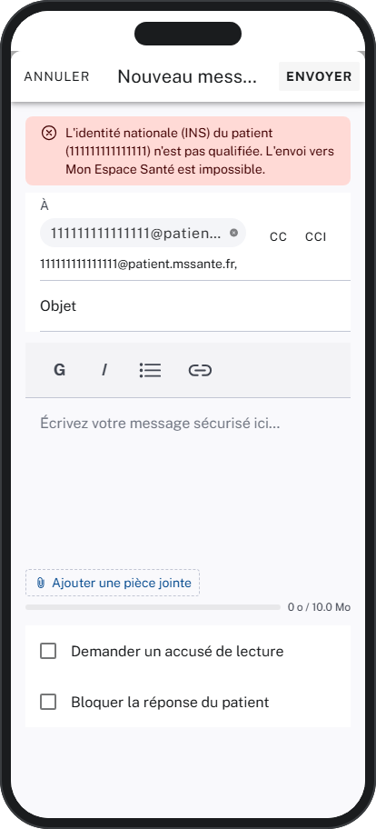 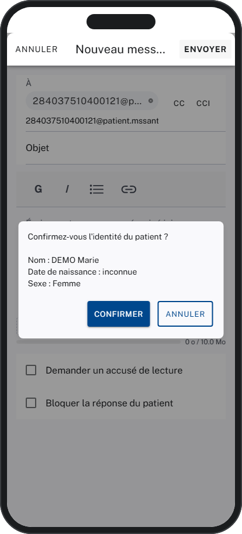

4. Si le patient a exprimé une **opposition**, un bandeau vous en avertit
   (sans bloquer — la décision clinique vous appartient).
5. Si le texte mentionne une pièce jointe absente, l'application demande
   « **Envoyer quand même ?** ».
6. **Brouillons** : la composition se sauvegarde automatiquement toutes les
   30 secondes. Fermez sans envoyer : le message vous attend dans le
   dossier **Brouillons**, se rouvre d'un tap à l'identique, se supprime
   d'un balayage (avec confirmation). Un message envoyé ne laisse jamais de
   brouillon orphelin.

**Situations d'erreur.**

| Situation | Comportement |
|---|---|
| Identité patient non qualifiée | Envoi bloqué, message explicite — vérifiez l'identité dans votre logiciel métier |
| Pièces jointes trop volumineuses | Ajout refusé au-delà de la limite (affichée dans les Paramètres) |
| Échec réseau à l'envoi | Message d'erreur lisible ; votre texte est conservé |

**Traçabilité (task-100, task-138, task-139).**

### 10.6 Rattacher un document à un patient

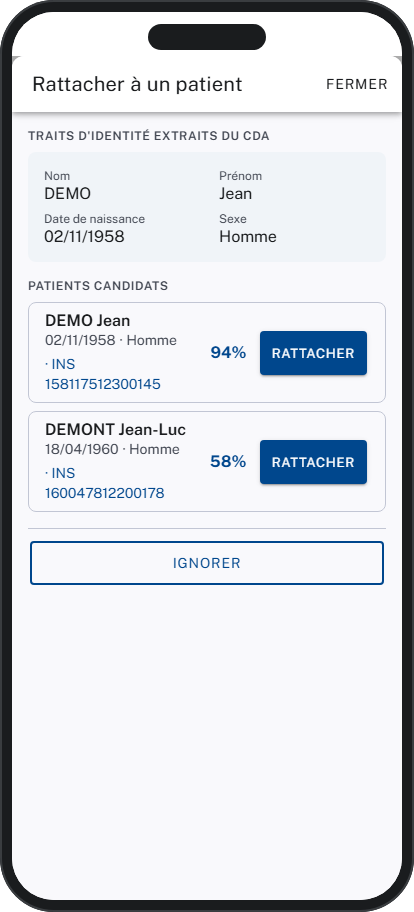

**Présentation.** Quand un message porte un document médical dont l'identité
n'est pas certifiée, le détail affiche un bandeau « **Document non
rattaché** ». Le praticien rattache alors le document au bon patient de sa
base — par comparaison visuelle, jamais à l'aveugle.

**Utilisation.**
1. Depuis le bandeau, ouvrez la **comparaison visuelle** : à gauche les
   traits d'identité portés par le document (nom, prénom, date de
   naissance, sexe), à droite les **patients candidats** de votre base,
   classés par pertinence (score en %).
2. Sélectionnez le bon patient et confirmez : le bandeau disparaît, le
   document rejoint le dossier du patient.
3. Aucun candidat convaincant ? La seule action est « Ignorer » — **la
   création d'un patient depuis cet écran est volontairement impossible**
   (l'identito-vigilance impose de créer les patients dans le logiciel
   métier).

**Situations d'erreur.** En cas d'erreur (réseau, document déjà traité), un
message lisible s'affiche et la liste des candidats est conservée pour
réessayer.

**Traçabilité (task-137).**

### 10.7 Consulter le dossier d'un patient

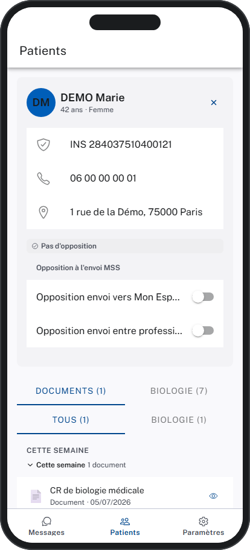

**Présentation.** L'onglet **Patients** donne accès au dossier documentaire
de chaque patient : identité, documents reçus, évolution de la biologie et
synthèse clinique — le tout alimenté par les messages MSSanté reçus.

**Utilisation.**
1. Recherchez par **nom** — ou retrouvez d'emblée les patients ayant reçu
   des documents **aujourd'hui**.
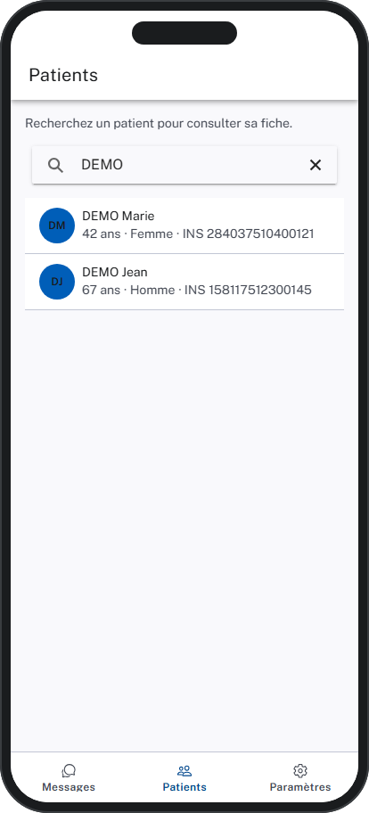

2. La **fiche** présente l'identité (nom, âge, sexe, INS, coordonnées) et
   le statut d'**opposition** MSSanté du patient (vers Mon Espace Santé et
   entre professionnels), modifiable directement — chaque changement est
   tracé.
3. **Documents** : l'historique complet, groupé par période (Aujourd'hui,
   Cette semaine, Ce mois…), filtrable par type (biologie, imagerie,
   comptes-rendus…). Un tap ouvre le document en plein écran — le PDF
   d'origine quand il existe, sinon le contenu mis en forme.

4. **Biologie** : l'évolution des biomarqueurs dans le temps (analyses en
   lignes, dates en colonnes), valeurs colorées selon l'interprétation,
   tendances et mini-courbes, filtre « anormaux uniquement », période
   réglable (3/6/12 mois ou tout).

5. **Synthèse** : les allergies critiques en bannière, puis les problèmes
   actifs, traitements, vaccinations et antécédents en cartes colorées par
   gravité, avec le détail en sections dépliables.

**Traçabilité (task-132, task-133, task-134, task-135).**

### 10.8 Personnaliser l'application

**Présentation.** L'onglet **Paramètres** règle le comportement de
l'application. Les préférences sont **partagées avec le poste de travail** :
un réglage posé sur mobile s'applique au web, et réciproquement.

**Utilisation.**
1. **Identité** : le nom affiché comme expéditeur de vos envois.
2. **Organisation** : le dossier ouvert au lancement, le filtre par défaut
   (Tous / Non lus) et le mode d'affichage par défaut (Liste /
   Conversation).
3. **Recherche** : la sensibilité — plus elle est haute, plus les résultats
   sont stricts ; plus elle est basse, plus la recherche « élargit ».
4. **Notifications** : activez ou coupez les alertes de nouveaux messages
   et de biologie anormale.
5. **Lecture** : la taille maximale des pièces jointes, fixée par votre
   administrateur (information).
6. **Compte** : votre adresse MSSanté, et la **déconnexion** (avec
   confirmation).
7. Chaque changement s'enregistre **automatiquement**, confirmé par un
   message discret — il n'y a pas de bouton « Enregistrer ».

**Situations d'erreur.** Si les préférences ne peuvent pas être chargées
(réseau), l'écran propose **Réessayer** — l'édition est suspendue pour ne
pas risquer d'écraser vos réglages du poste de travail.

**Traçabilité (task-140).**

### 10.9 Gérer ses signatures

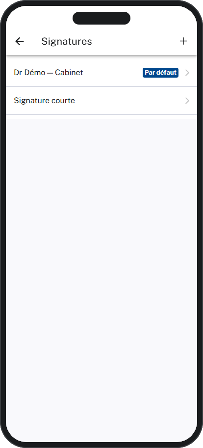

**Présentation.** Une signature est un bloc de texte mis en forme (nom,
qualité, cabinet, coordonnées) ajouté au bas des messages. Le praticien gère
plusieurs signatures et en désigne une **par défaut**, ajoutée
automatiquement à chaque nouveau message. Les signatures sont **propres à
chaque praticien**.

**Accès.** Onglet **Paramètres → Rédaction → Signatures**.

**Utilisation.**
1. L'écran liste vos signatures ; celle marquée **« Par défaut »** est
   signalée par une pastille.
2. Le bouton **+** crée une signature ; un appui sur une signature existante
   l'ouvre en édition.
3. Dans l'éditeur : donnez un **nom**, saisissez le **contenu** (gras,
   italique, listes, liens), et activez **« Signature par défaut »** pour en
   faire la signature ajoutée d'office. **Enregistrer** valide.
4. Une seule signature est « par défaut » à la fois : en désigner une nouvelle
   retire automatiquement le marquage de la précédente.
5. **Supprimer** retire la signature après confirmation.

**Dans un message.** À l'ouverture d'un nouveau message (ou d'une réponse /
d'un transfert), la signature par défaut est **insérée automatiquement** —
au-dessus du message d'origine cité dans le cas d'une réponse. Un
**sélecteur « Signature »** sous le corps permet d'en choisir une autre ou de
n'en mettre aucune ; le corps est mis à jour aussitôt.

**Situations d'erreur.** Un échec réseau (chargement, enregistrement,
suppression) affiche un message lisible ; l'action peut être relancée.

**Traçabilité (task-145).**

---

## État de couverture (2026-07-16)

| Fonctionnalité | Statut | Tasks contributives |
|---|---|---|
| Connexion e-CPS | ✅ Livrée | task-136, task-159 |
| Messagerie (boîte, dossiers personnels, quota, recherche, conversations, notifications) | ✅ Livrée | task-095, task-103, task-104, task-106, task-107, task-108, task-143 |
| Lecture d'un message et de ses documents | ✅ Livrée | task-096, task-097, task-101, task-105, task-131 |
| Biologie (affichage + acquittement) | ✅ Livrée | task-098 |
| Actions sur les messages (unitaires + en masse) | ✅ Livrée | task-099, task-141 |
| Écriture, envoi, garde-fous, brouillons | ✅ Livrée | task-100, task-138, task-139 |
| Signatures (CRUD + injection compose) | ✅ Livrée | task-145 |
| Rattachement document → patient | ✅ Livrée | task-137 |
| Dossier patient (fiche, documents, biologie, synthèse) | ✅ Livrée | task-132, task-133, task-134, task-135 |
| Préférences partagées | 🟡 En validation par le praticien référent | task-140 |
| Continuité de session | ✅ Livrée | task-102 |

**Couverture EPIC consolidée : 10,5 / 11 fonctionnalités livrées** — seule
Préférences reste développée et en attente de validation manuelle.

## État visuel de l'application (2026-07-16)

> Captures générées automatiquement par la forge (/verify-visual) — dernier
> état connu de chaque écran, sur données de démonstration.

| | |
|---|---|
| **Messagerie non configurée** 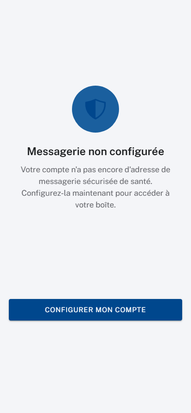 | **Configurer ma messagerie** 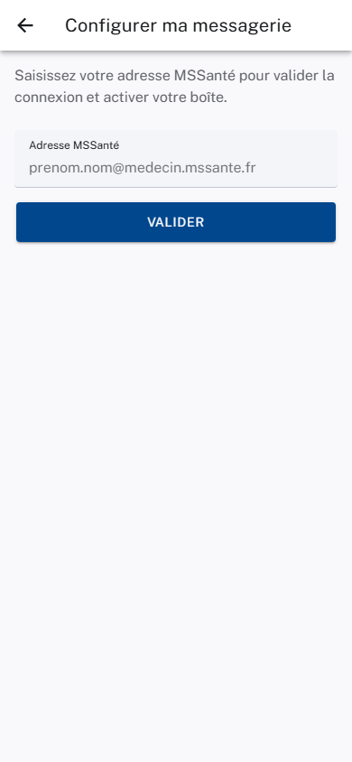 |
| **Connexion e-CPS**  | **Boîte de réception**  |
| **Répertoires**  | **Détail d'un message**  |
| **Recherche**  | **Nouveau message**  |
| **Recherche patient**  | **Fiche patient**  |
| **Biologie du patient**  | **Résultats de biologie (message)**  |
| **Rattachement à un patient**  | **Brouillons**  |
| **Synthèse clinique**  | **Paramètres**  |
| **Sélection multiple** 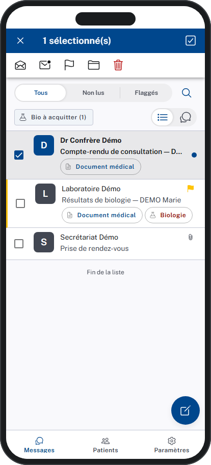 | **Signatures**  |

## Synthèse fonctionnelle des changelogs

- **v1.28 (task-166)** — Tableaux dans l'assistant IA : lorsque l'assistant
  ou la synthèse d'un message présentent des données en tableau (par exemple
  des résultats de biologie avec analyte, valeur et intervalle de référence),
  le tableau s'affiche désormais en grille lisible — en-têtes, lignes et
  alignements — au lieu d'un texte brut parsemé de barres verticales. Un
  tableau trop large défile horizontalement dans la bulle, sans déborder de
  l'écran.
- **v1.27 (task-159)** — Première connexion sans messagerie configurée : si
  le compte du praticien ne porte pas encore d'adresse MSSanté, l'application
  affiche un écran dédié « Messagerie non configurée » avec un parcours de
  configuration guidé — saisie de l'adresse, vérification de la connexion,
  puis invitation à se reconnecter pour activer la boîte. Fini la boucle de
  connexion sans explication.
- **v1.26 (task-145)** — Signatures : le praticien gère plusieurs signatures
  (créer, modifier, supprimer, définir la signature par défaut) depuis
  Paramètres → Rédaction. La signature par défaut est ajoutée automatiquement
  à chaque nouveau message, réponse ou transfert, et un sélecteur permet d'en
  changer ou de n'en mettre aucune.
- **v1.25 (task-143)** — Dossiers personnels & quota : le praticien crée,
  renomme et supprime ses propres dossiers depuis le volet des répertoires
  (menu réservé aux dossiers personnels, jamais les dossiers du système) ;
  une jauge en pied de volet suit l'occupation de la boîte, avec alerte
  orange à 80 % et rouge à 90 %.
- **v1.24 (task-141)** — Sélection multiple : un appui long sur un message
  ouvre le mode sélection ; le praticien coche plusieurs messages et applique
  une action **à tout le lot d'un geste** — marquer lu/non-lu, suivre,
  déplacer, supprimer (avec confirmation). Retour immédiat à l'écran, annulable.
- **v1.23 (task-140)** — Paramètres : l'onglet devient un véritable écran de
  préférences, **partagées avec le poste de travail** : nom d'expéditeur,
  dossier/filtre/affichage à l'ouverture, sensibilité de la recherche,
  notifications, limite de pièces jointes, déconnexion, version.
  Enregistrement automatique avec confirmation discrète.
- **v1.22 (task-139)** — Brouillons : sauvegarde automatique de la
  composition toutes les 30 secondes, dossier **Brouillons** avec compteur,
  reprise d'un tap à l'identique, suppression par balayage, aucun brouillon
  orphelin après envoi.
- **v1.21 (task-138)** — Garde-fous d'envoi : blocage vers un patient à
  l'identité non qualifiée, confirmation d'identité avant envoi, bandeau
  d'opposition, case « Bloquer la réponse du patient », rappel de pièce
  jointe oubliée, jauge de taille des pièces jointes.
- **v1.20 (task-137)** — Rattachement patient : bandeau « Document non
  rattaché », comparaison visuelle avec les patients candidats classés par
  pertinence, rattachement en un geste — jamais de création de patient.
- **v1.19 (task-136)** — Connexion e-CPS : RPPS pré-rempli, code de
  vérification à 2 chiffres anti-hameçonnage, validation sans quitter
  l'application ; Pro Santé Connect en second choix.
- **v1.18 (task-135)** — Synthèse clinique du patient : allergies critiques
  en bannière, cartes par catégorie colorées par gravité, antécédents en
  sections dépliables. **La vue patient mobile est complète.**
- **v1.17 (task-134)** — Biologie du patient : évolution des biomarqueurs
  dans le temps, valeurs colorées, tendances et mini-courbes, filtre
  « anormaux », période réglable.
- **v1.16 (task-133)** — Documents du patient : historique groupé par
  période, filtres par type, visionneuse plein écran (PDF d'origine ou
  contenu mis en forme), chargement continu au défilement.
- **v1.15 (task-132)** — Fiche patient : recherche par nom ou patients du
  jour, identité complète, gestion de l'opposition MSSanté depuis la fiche.
- **v1.14 (task-131)** — Synthèse IA d'un message, avec contexte patient /
  praticien / date ; indisponibilité du service signalée sans bloquer la
  lecture.
- **v1.13 (task-108)** — Vue Conversations : messages regroupés par fil,
  dépliables pour voir les réponses.
- **v1.12 (task-107)** — Alerte à l'arrivée d'un nouveau message ; sur le
  dossier concerné, le message apparaît directement en tête de liste. Les
  notifications système du téléphone restent à venir.
- **v1.11 (task-106)** — Recherche : saisie libre + filtres rapides (non
  lus, pièces jointes, document médical, biologie).
- **v1.10 (task-105)** — Accusé de lecture émis uniquement sur action
  explicite du praticien, quand l'expéditeur l'a demandé.
- **v1.9 (task-104)** — Les messages en cours de traitement se complètent
  automatiquement à l'écran, sans action de l'utilisateur.
- **v1.8 (task-103)** — La liste n'est plus bornée : le défilement charge
  progressivement les messages plus anciens, avec reprise sur erreur.
- **v1.7 (task-102)** — Continuité de session : l'application prolonge la
  session automatiquement pendant l'usage ; en fin de session, retour à la
  connexion avec le message « session expirée ».
- **v1.6 (task-101)** — Les documents médicaux à tableaux larges deviennent
  lisibles sur smartphone (défilement dans leur cadre, densité adaptée).
- **v1.5 (task-100)** — Composer, répondre, transférer : destinataires,
  objet, corps mis en forme, pièces jointes, accusé de lecture.
- **v1.4 (task-099)** — Actions de messagerie : lu/non-lu, suivi,
  suppression (avec confirmation), déplacement — d'un balayage ou depuis le
  message ; filtre Tous / Non lus / Suivis.
- **v1.3 (task-098)** — Biologie : tableau des résultats avec valeurs hors
  norme en évidence, acquittement tracé en 5 actions avec confirmation,
  badge et filtre dédiés dans la boîte.
- **v1.2 (task-097)** — Pièces jointes : liste unifiée, téléchargement à
  l'unité ou groupé, prévisualisation (image, PDF, texte).
- **v1.1 (task-096)** — Consultation d'un message à parité avec le web :
  en-tête complet, contenu sécurisé, images distantes bloquées par défaut,
  documents médicaux en onglets.
- **v1.0 (task-095)** — Socle de la messagerie mobile : boîte de réception
  à parité de contenu avec le web, navigation entre répertoires.

Le détail d'ingénierie de chaque version (PRs, tests, choix techniques) vit
dans [E012-Changelogs.md](E012-Changelogs.md).

---

*Document produit maintenu par la forge (/tech-writer). Les captures d'écran
sont générées automatiquement à chaque évolution de l'application.*
