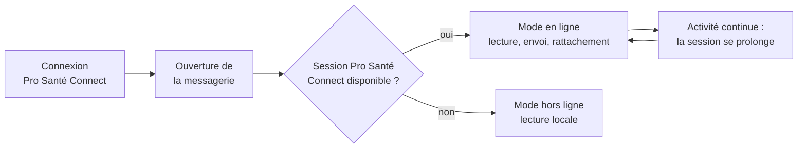

# E013 — Refonte du cycle de vie du jeton Pro Santé Connect

> **Statut** : 🟡 En recette (livraison en attente de validation humaine)
> **Modèle** : task-driven
> **Version** : 1.0
> **Audience** : PO, médecins, direction, conformité
> **Dernière mise à jour** : 2026-09-24
> **Document frère (vue ingénierie)** : [`E013-Changelogs.md`](./E013-Changelogs.md)

<!-- toc:start — section générée par /tech-writer ; ne pas éditer manuellement -->

## Sommaire

- [1. Vision](#1-vision)
- [2. Objectifs métier](#2-objectifs-métier)
- [3. Acteurs concernés](#3-acteurs-concernés)
- [4. Features de l'EPIC](#4-features-de-lepic)
- [5. Workflow entre Features](#5-workflow-entre-features)
- [6. Règles métier transverses](#6-règles-métier-transverses)
- [7. Contraintes et hypothèses](#7-contraintes-et-hypothèses)
- [8. Critères d'acceptation de l'EPIC](#8-critères-dacceptation-de-lepic)
- [9. Hors périmètre](#9-hors-périmètre)
- [10. Sécurité et confidentialité](#10-sécurité-et-confidentialité)
- [État de couverture (2026-09-24)](#état-de-couverture-2026-09-24)
- [Synthèse fonctionnelle des changelogs](#synthèse-fonctionnelle-des-changelogs)

<!-- toc:end -->

---

## 1. Vision

Lorsqu'un professionnel de santé se connecte avec Pro Santé Connect, un jeton
d'accès lui ouvre sa messagerie sécurisée de santé. Jusqu'ici, ce jeton était
conservé par l'application du praticien — navigateur, application web, téléphone —
puis renvoyé à chaque action. Désormais, **le jeton reste côté serveur** : la
messagerie le demande elle-même au service d'authentification, au moment précis où
elle en a besoin, et vérifie que la session présentée appartient bien au
professionnel connecté.

Pour le praticien, rien ne change à l'usage : il se connecte comme avant et
retrouve sa messagerie. Ce qui change, c'est qu'un jeton de santé en moins circule
et se stocke sur ses appareils, et qu'une session ne peut plus être détournée au
profit d'un autre compte.

---

## 2. Objectifs métier

*À compléter.*

---

## 3. Acteurs concernés

*À compléter.*

---

## 4. Features de l'EPIC

| # | Fonctionnalité | Ce que le praticien peut faire | Tasks | Statut |
|---|---|---|---|---|
| E013-F001 | Session Pro Santé Connect tenue par le serveur | Utiliser sa messagerie en ligne sans que son application ne détienne ni ne renvoie le jeton Pro Santé Connect ; rattacher une messagerie avec l'identité professionnelle de sa propre session, jamais celle d'un autre ; retrouver automatiquement le mode hors ligne (lecture locale) quand la session Pro Santé Connect n'est pas disponible. Web, application web et mobile. | task-171 | 🟡 En recette |

> Le bilan d'avancement par feature (statut, couverture, tasks contributives) est
> consigné en fin de document, dans la section *État de couverture*.

---

## 5. Workflow entre Features

L'EPIC tient en une seule fonctionnalité, livrée d'un bloc. Le parcours du
praticien est le suivant :

1. Le praticien se connecte avec Pro Santé Connect, sur le web ou avec son e-CPS
   sur mobile — le parcours de connexion est inchangé.
2. À l'ouverture, l'application demande à la messagerie dans quel mode se trouve
   la session. La messagerie répond d'après ce que sait le service
   d'authentification, jamais d'après un élément conservé sur l'appareil.
3. En ligne, le praticien lit, envoie et rattache ses messageries. La messagerie
   obtient le jeton au moment d'ouvrir la connexion à l'opérateur MSSanté, toujours
   à jour.
4. Tant que le praticien est actif, sa session se prolonge. La synchronisation de
   fond, elle, ne prolonge jamais une session : une session abandonnée expire
   normalement.
5. Hors ligne, les messageries déjà rattachées restent lisibles ; les actions qui
   exigent la connexion à l'opérateur sont grisées, visibles et expliquées.

---

## 6. Règles métier transverses

| ID | Règle | Description | Statut |
|----|-------|-------------|--------|
| RG-E013-L1 | Une session appartient à un seul professionnel | Une session Pro Santé Connect présentée avec le compte d'un autre praticien est refusée. La messagerie n'est ni ouverte ni rattachée, et le refus n'est jamais transformé en mode hors ligne. | 🟡 En recette (task-171) |
| RG-E013-L2 | L'identité professionnelle vient de la session | Le RPPS et l'identifiant Pro Santé Connect retenus pour rattacher une messagerie sont ceux que le service d'authentification a obtenus lors de la connexion, jamais une déclaration de l'application. | 🟡 En recette (task-171) |
| RG-E013-L3 | Rattacher une messagerie exige une session Pro Santé Connect liée | Sans session Pro Santé Connect liée au compte, le rattachement est refusé avec un message clair ; la lecture des messageries déjà rattachées reste possible hors ligne. | 🟡 En recette (task-171) |
| RG-E013-L4 | Tout refus de rattachement est tracé | Un rattachement refusé apparaît dans le journal d'audit du praticien, avec son motif. | 🟡 En recette (task-171) |
| RG-E013-L5 | Un identifiant Pro Santé Connect n'est lié qu'à un seul compte | Prérequis de mise en service, garanti par le service d'authentification et le contrôle des liaisons avant ouverture. | 🟡 Prérequis de mise en service |
| RG-E013-S | Seule l'activité du praticien prolonge sa session | La synchronisation automatique de la messagerie ne maintient jamais une session ouverte en l'absence du praticien. | 🟡 En recette (task-171) |
| RG-E013-J | Le jeton Pro Santé Connect ne quitte plus le serveur | Aucune application ne reçoit, ne conserve ni ne renvoie le jeton ; sur mobile, il n'est plus stocké sur le téléphone. | 🟡 En recette (task-171) |

---

## 7. Contraintes et hypothèses

### Contraintes
- La messagerie doit être servie sous le même domaine que le service
  d'authentification pour que la session du praticien l'accompagne ; c'est le cas
  en environnement local, et une bascule de domaine est prévue pour les
  environnements hébergés.
- Le déploiement concerne quatre composants à la fois. Tant que tous ne sont pas
  à jour, les praticiens concernés travaillent en mode hors ligne : la mise en
  production se planifie hors des heures d'usage.

### Hypothèses
- Le parcours de connexion Pro Santé Connect (web et e-CPS mobile) reste inchangé.
- La durée de vie des jetons de production sera relevée avant la mise en service.

---

## 8. Critères d'acceptation de l'EPIC

- [ ] Toutes les Features sont implémentées et validées.
- [ ] Sur les trois applications, le praticien consulte, envoie et rattache ses
      messageries comme avant, sans déconnexion au fil d'une session active.
- [ ] Une tentative de rattacher la messagerie d'un confrère avec sa propre
      session est refusée et apparaît dans le journal d'audit.
- [ ] Sur mobile, aucune trace du jeton Pro Santé Connect ne subsiste sur le
      téléphone.

---

## 9. Hors périmètre

- Le parcours de connexion Pro Santé Connect lui-même et le renouvellement de la
  session de connexion : inchangés.
- La modification de la durée de vie des sessions.
- La contre-vérification facultative de l'identité par un attribut
  supplémentaire du compte : prévue comme défense complémentaire, non requise.

---

## 10. Sécurité et confidentialité

Cette évolution ferme l'écart relevé par l'audit de sécurité du registre des
messageries (septembre 2026) : un compte muni du jeton d'un autre professionnel
pouvait rattacher la messagerie de ce dernier et l'empêcher de la rattacher
lui-même. Désormais, l'identité professionnelle qui autorise un rattachement est
lue dans la session d'authentification, liée au compte au moment de la connexion,
et la messagerie vérifie que cette session appartient bien au praticien connecté
(RG-E013-L1). C'est une exigence de non-usurpation de la politique générale de
sécurité des systèmes d'information de santé.

Le jeton d'accès Pro Santé Connect ne transite plus par le navigateur ni par
l'application mobile, et n'est plus conservé dans le stockage local du téléphone
(RG-E013-J). Les journaux techniques n'enregistrent jamais ni jeton ni identifiant
de session en clair. L'analyse d'impact relative à la protection des données est
à mettre à jour pour y porter cette mesure et cette réduction de surface.

---

## État de couverture (2026-09-24)

| Feature | Statut | Couverture | Tasks contributives |
|---|---|---|---|
| E013-F001 — Session Pro Santé Connect tenue par le serveur | 🟡 En recette | Livrée sur les quatre composants, en attente de validation humaine et de mise en service | task-171, task-172 |

**Couverture EPIC consolidée : 100 % livré, 0 % en production** (l'unique
fonctionnalité attend sa recette humaine et ses prérequis de mise en service).

---

## Synthèse fonctionnelle des changelogs

**Fonctionnalités métier**
- v1.0 — La messagerie obtient elle-même le jeton Pro Santé Connect ; les trois
  applications (web, application web, mobile) ne le transportent plus. Le mode en
  ligne ou hors ligne est décidé par le serveur, y compris pour proposer le
  rattachement d'une première messagerie. (task-171)
- v1.0 — L'ancien travail « applications clientes » a été fondu dans la même
  livraison pour que la protection soit effective dès la première mise en service.
  (task-172)

**Conformité réglementaire**
- v1.0 — Non-usurpation au rattachement d'une messagerie : l'identité
  professionnelle est celle de la session d'authentification, et tout refus est
  tracé dans le journal d'audit. (task-171)

**Sécurité**
- v1.0 — Une session ne peut plus servir un autre compte que celui de son
  titulaire ; le jeton Pro Santé Connect n'est plus stocké sur le téléphone.
  (task-171)

**Technique / observabilité** (sans impact utilisateur direct)
- v1.0 — La synchronisation automatique ne maintient plus artificiellement une
  session ouverte ; les incidents du service d'authentification se traduisent par
  un mode hors ligne tracé plutôt qu'une erreur. (task-171)

---

*Document généré et maintenu par /tech-writer — les sections 1, 2, 3, 7 et 9
sont la propriété du PO.*
