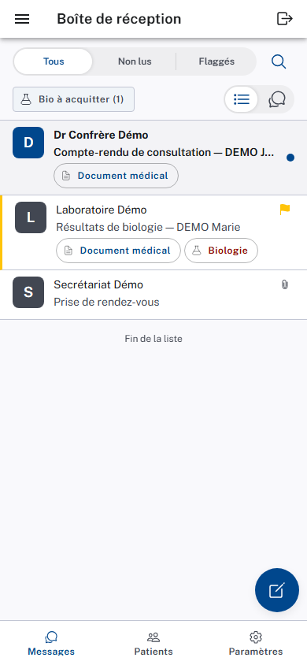
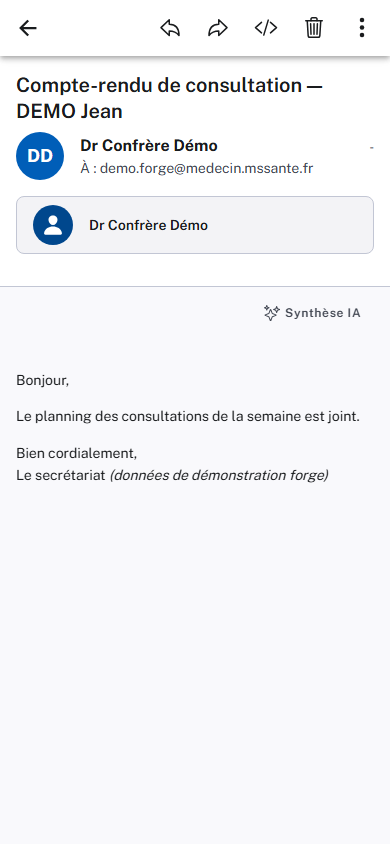
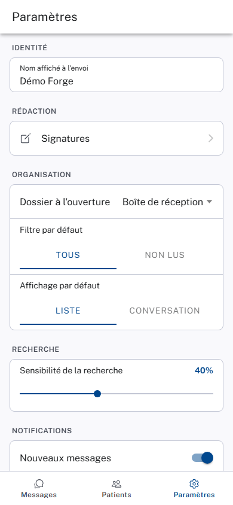
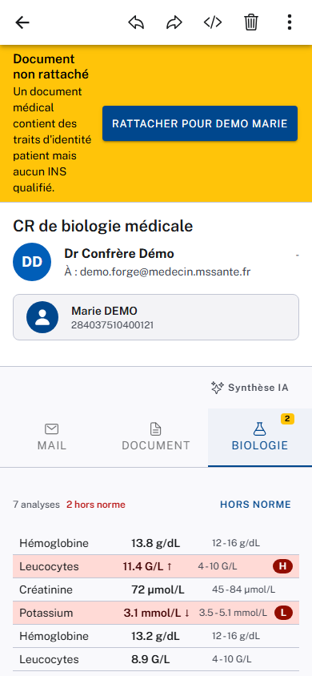
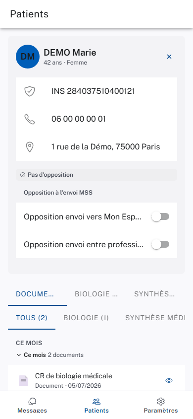
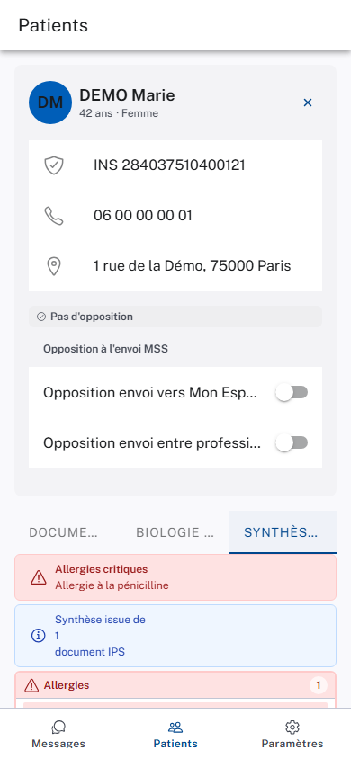
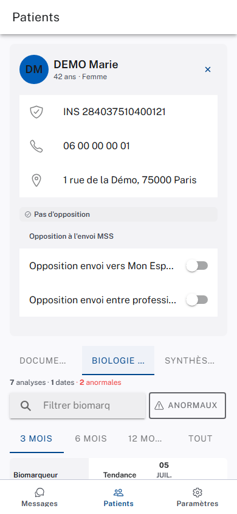
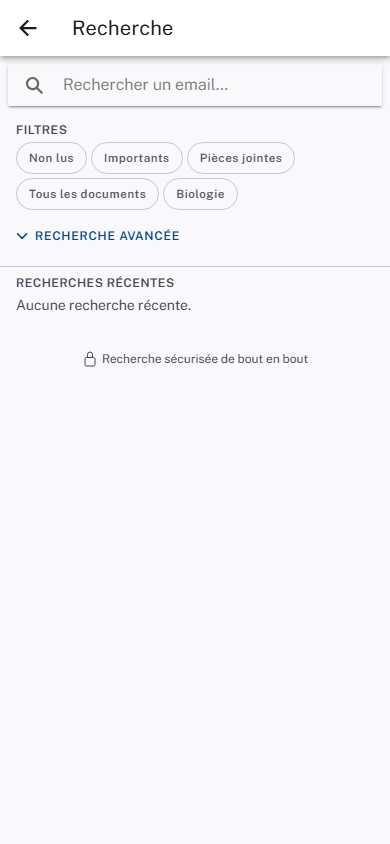
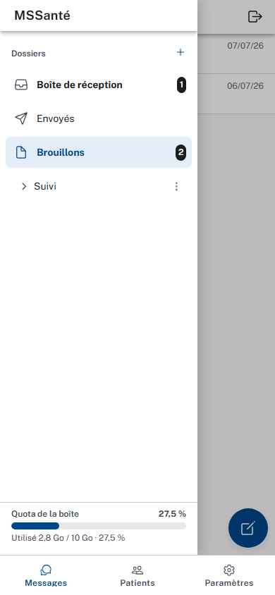

# E014 — Design system mobile (Stitch « Clinical Precision »)

> **Statut** : 🟢 En cours
> **Modèle** : task-driven
> **Version** : 1.0
> **Auteur** : PO forge
> **Audience** : PO, médecin, direction — la vue ingénierie vit dans [E014-Changelogs.md](E014-Changelogs.md)
> **Dernière mise à jour** : 2026-07-16 (task-160)

---

<!-- toc:start — section générée par /tech-writer ; ne pas éditer manuellement -->

## Sommaire

- [1. Vision](#1-vision)
- [2. Objectifs métier](#2-objectifs-métier)
- [3. Acteurs concernés](#3-acteurs-concernés)
- [4. Features de l'EPIC](#4-features-de-lepic)
- [5. Workflow entre Features](#5-workflow-entre-features)
- [6. Règles métier transverses (Ségur)](#6-règles-métier-transverses-ségur)
- [7. Contraintes et hypothèses](#7-contraintes-et-hypothèses)
- [8. Critères d'acceptation](#8-critères-dacceptation)
- [9. Hors périmètre](#9-hors-périmètre)
- [État de couverture (2026-07-16)](#état-de-couverture-2026-07-16)
- [État visuel de l'application (2026-07-16)](#état-visuel-de-lapplication-2026-07-16)
- [Synthèse fonctionnelle des changelogs](#synthèse-fonctionnelle-des-changelogs)

<!-- toc:end -->

## 1. Vision

Donner à l'application mobile de messagerie sécurisée santé une **identité
visuelle soignée, cohérente et professionnelle**, alignée sur le design de
référence **« Clinical Precision »** maquetté dans Stitch. L'app conserve
l'intégralité de ses fonctionnalités (consultation, biologie, envoi) ; ce qui
change, c'est la **présentation** : couleurs, typographie, espacements, formes,
densité des listes — pour inspirer calme, fiabilité et sécurité au praticien en
mobilité.

Le travail se fait en deux temps : d'abord un **socle** (les fondations de style
partagées par tous les écrans), puis une **reprise écran par écran** pour coller
fidèlement aux maquettes. Le bilan d'avancement par feature est consigné en fin
de document, dans la section *État de couverture*.

## 2. Objectifs métier

- [ ] Offrir une identité visuelle homogène sur toute l'application mobile
- [ ] Améliorer la lisibilité clinique (densité des listes, hiérarchie typographique)
- [ ] Renforcer la confiance du praticien par une présentation sobre et sécurisante
- [ ] Préserver l'intégralité des fonctionnalités existantes (aucune régression)

## 3. Acteurs concernés

| Acteur | Rôle dans l'EPIC |
|--------|------------------|
| Médecin généraliste | Utilisateur principal — bénéficie de la nouvelle présentation en mobilité |
| Secrétaire médicale | Utilise la messagerie au quotidien — gagne en lisibilité |
| Direction / conformité | Identité visuelle professionnelle et cohérente du produit |

## 4. Features de l'EPIC

| Task | Feature | Périmètre | Statut |
|------|---------|-----------|--------|
| task-110 | Socle design system (tokens couleur/typo/espacement/formes + Public Sans) | thème global, tous écrans héritent | ✅ mergée |
| task-111 | Refonte écran `login` | écran de connexion | ✅ mergée |
| task-112 | Refonte écran `authentication` | parcours d'authentification | ✅ mergée |
| task-113 | Tableau de bord d'accueil `home` (miroir dashboard Angular) | écran d'accueil, landing post-login | ✅ mergée |
| task-114 | Refonte écran `inbox` (+ valeurs biologie, barre nav onglets) | boîte de réception | ✅ mergée |
| task-115 | Refonte `mail-list` | liste des emails | ✅ mergée |
| task-116 | Refonte `mail-folder-list` | liste des répertoires | ✅ mergée |
| task-117 | Refonte `mail-folder-item` | item de répertoire | ✅ mergée |
| task-119 | Recherche avancée `mail-search` + historique de recherche | page de recherche dédiée, parité filtres, historique rejouable (mobile + angular + backend) | ✅ mergée |
| task-120 | Refonte `inbox-biology-ack-chip` (+ compteur) | chip filtre acquittement biologie | ✅ mergée |
| task-121 | Refonte écran `mail-detail` | détail d'un message | ✅ mergée |
| task-122 | Refonte `mail-body` | corps du message | ✅ mergée |
| task-123 | Refonte `medical-html-frame` | cadre HTML médical | ✅ mergée |
| task-124 | Refonte `mail-attachment` | pièce jointe | ✅ mergée |
| task-125 | Refonte `biology` | tableau de résultats de biologie | ✅ mergée |
| task-126 | Refonte `biology-ack-badge` | badge d'acquittement | ✅ mergée |
| task-127 | Refonte `biology-ack-panel` | panneau d'acquittement | ✅ mergée |
| task-128 | Refonte `biology-ack-confirm-dialog` | dialog de confirmation | ✅ mergée |
| task-129 | Refonte `mail-compose` | composition / envoi | ✅ mergée |
| task-130 | Refonte `html-editor` | éditeur de contenu | 🟢 PR ouverte (attente merge) |
| task-160 | Couche interaction & polish (chargements en squelette, retour haptique réglable, réactivité immédiate, micro-animations) | tous les écrans à chargement asynchrone + actions clés (mail, biologie) | 🟢 PR ouverte (attente merge) |

## 5. Workflow entre Features

```mermaid
graph TD
  T110[task-110 — Socle design system] --> T111[login]
  T110 --> T112[authentication]
  T110 --> T113[home]
  T110 --> T114[inbox]
  T110 --> T115[mail-list]
  T110 --> T116[mail-folder-list]
  T110 --> T117[mail-folder-item]
  T110 --> T119[mail-search]
  T110 --> T120[inbox-biology-ack-chip]
  T110 --> T121[mail-detail]
  T110 --> T122[mail-body]
  T110 --> T123[medical-html-frame]
  T110 --> T124[mail-attachment]
  T110 --> T125[biology]
  T110 --> T126[biology-ack-badge]
  T110 --> T127[biology-ack-panel]
  T110 --> T128[biology-ack-confirm-dialog]
  T110 --> T129[mail-compose]
  T110 --> T130[html-editor]
  T110 --> T160[interaction & polish]
```

Le socle (task-110) est la fondation : il livre les tokens de style dont tous
les écrans héritent. Les refontes écran par écran (task-111 à task-130) s'y
appuient et sont indépendantes entre elles. La couche interaction & polish
(task-160) s'appuie également sur le socle mais s'applique transversalement,
par-dessus les écrans déjà repris (chargements, retour haptique, réactivité,
micro-animations), sans en changer l'apparence.

## 6. Règles métier transverses (Ségur)

Aucune règle métier Ségur n'est portée par cet EPIC : il s'agit d'un travail de
**présentation visuelle** (restyling), sans manipulation de patient, d'INS,
d'échange MSSanté ni de document CDA. Les fonctionnalités métier sous-jacentes
restent celles des EPIC E009 (messagerie) et E012 (client mobile). La règle de
non-divulgation reste respectée : aucune donnée de santé en clair n'est
introduite dans l'UI ou les journaux.

## 7. Contraintes et hypothèses

- **Stitch est la source de vérité du design** : chaque écran est repris d'après
  sa maquette Stitch (réutilisée ou créée), jamais en copiant le HTML — l'intention
  visuelle est traduite en composants Ionic.
- **Mode clair canonique** : le design « Clinical Precision » est en mode clair ;
  le mode sombre système reste lisible mais n'est pas l'objectif.
- **Aucune régression fonctionnelle** : les tests existants sont le filet de
  sécurité ; toute reprise visuelle doit les garder verts.
- **Police embarquée localement** (Public Sans), sans dépendance à un CDN externe.

## 8. Critères d'acceptation

- [ ] Le socle de style est appliqué et tous les écrans en héritent (task-110)
- [ ] Chaque écran est repris fidèlement d'après sa maquette Stitch (task-111..130)
- [ ] Identité visuelle cohérente sur l'ensemble de l'application
- [ ] Aucune perte de fonctionnalité constatée au test humain

## 9. Hors périmètre

- Toute évolution **fonctionnelle** de la messagerie (couverte par E009 / E012).
- Le design des frontends web (`client-blazor`, `client-angular`) — cet EPIC ne
  concerne que le client mobile.
- Un mode sombre complet et abouti (l'objectif est le mode clair ; le sombre
  reste seulement « lisible »).

## État de couverture (2026-07-16)

| Feature | Statut | Couverture | Tasks contributives |
|---------|--------|------------|---------------------|
| Socle design system | ✅ mergée | Mergée sur develop | task-110 |
| Refonte écran login | ✅ mergée | Mergée sur develop (fidélité export Stitch, logo WEDA SVG, bouton PSC officiel) | task-111 |
| Refonte écran authentication | ✅ mergée | Mergée sur develop (callback PSC, footer ANS) | task-112 |
| Tableau de bord d'accueil home | ✅ mergée | Mergée sur develop (dashboard miroir Angular, landing post-login) | task-113 |
| Refonte écran inbox | ✅ mergée | Mergée sur develop (zone de contrôles épinglée, valeurs biologie inline, regroupement « Biologie à valider », barre nav onglets, filtres/toggle en pilule) | task-114 |
| Refonte menu des répertoires | ✅ mergée | Mergée sur develop (icônes par type, sélection en pilule, badge sombre, section TAGS, en-tête « MSSanté ») | task-116 |
| Refonte liste des emails | ✅ mergée | Mergée sur develop (lignes haute densité token-driven, avatar carré, accent critique, chip « Biologie CRITIQUE », fils indentés) | task-115 |
| Refonte item de répertoire | ✅ mergée | Mergée sur develop (état actif en pilule bleue + icône/nom primaires) | task-117 |
| Recherche avancée + historique | ✅ mergée | Mergée sur develop — page `mail-search` dédiée, parité filtres 100 % avec Angular, historique de recherche rejouable persisté côté backend (Redis, TTL 7 j) | task-119 |
| Refonte chip acquittement biologie | ✅ mergée | Mergée sur develop — pilule « Clinical Precision » 4px/label-md + compteur de bios non acquittées par dossier | task-120 |
| Refonte écran détail message | ✅ mergée | Mergée sur develop — carte méta du `mail-detail` migrée 100 % tokens E014 (sujet, identité patient, De/À/Date, badges, barre d'actions), structure conforme Stitch | task-121 |
| Refonte corps du message | ✅ mergée | Mergée sur develop — `mail-body` migré 100 % tokens E014 (onglets, corps HTML/texte, bannière images distantes), interlignage 1.6 ; assainissement HTML inchangé | task-122 |
| Refonte cadre HTML médical | ✅ mergée | Mergée sur develop — `medical-html-frame` en carte bordée arrondie token-driven, tokens injectés alignés palette + Public Sans ; sandbox/blob inchangé | task-123 |
| Refonte pièce jointe | ✅ mergée | Mergée sur develop — `mail-attachment` migré 100 % tokens E014 (icône type, nom, taille, badge, télécharger/ZIP) | task-124 |
| Refonte tableau de biologie | ✅ mergée | Mergée sur develop — `biology` migré 100 % tokens E014 ; hors-normes en conteneur d'erreur + accent danger pour le critique ; logique inchangée | task-125 |
| Refonte badge d'acquittement | ✅ mergée | Mergée sur develop — `biology-ack-badge` aux couleurs sémantiques du socle (critique→danger, en attente→tertiaire), tokens typo/espacement | task-126 |
| Refonte panneau d'acquittement | ✅ mergée | Mergée sur develop — `biology-ack-panel` migré 100 % tokens E014 ; statut aux couleurs sémantiques socle ; actions inchangées | task-127 |
| Refonte dialog de confirmation | ✅ mergée | Mergée sur develop — `biology-ack-confirm-dialog` migré 100 % tokens E014, encart critique en error-container ; logique inchangée | task-128 |
| Refonte composition message | ✅ mergée | Mergée sur develop — `mail-compose` migré 100 % tokens E014 (corps, PJ, bouton) ; logique d'envoi inchangée | task-129 |
| Refonte éditeur de contenu | 🟢 PR ouverte | PR ouverte (attente merge humain, HAG) — `html-editor` migré 100 % tokens E014 (barre d'outils plate, boutons d'outils 44px, zone d'édition body-lg, placeholder) ; capacités d'édition inchangées | task-130 |
| Couche interaction & polish | 🟢 PR ouverte | PR ouverte (attente merge humain, HAG) — chargements en squelette sur tous les écrans à chargement asynchrone (messagerie et dossier patient), retour haptique réglable sur les actions clés (activé par défaut, désactivable dans Paramètres), réactivité immédiate de l'acquittement biologie avec retour à l'état précédent et message clair en cas d'échec, micro-animations discrètes respectant le réglage d'accessibilité « réduire les animations » | task-160 |

**Couverture EPIC consolidée : ~90 %** (socle + **18 reprises d'écran mergées**
sur 19 — login, authentication, home, inbox, menu des répertoires, liste des
emails, item de répertoire, recherche avancée + historique, chip acquittement,
détail message, corps, cadre HTML médical, pièce jointe, biologie + badge +
panneau + dialog d'acquittement, composition message ; **dernière reprise
(`html-editor`) en PR ouverte**, attente merge humain (HAG). task-118
`mail-header` supprimée — déjà couverte par task-114/115, en-tête détaillé
absorbé par task-121. La **couche interaction & polish** (task-160), qui
s'ajoute par-dessus l'ensemble des écrans repris, est également **en PR
ouverte**, attente merge humain (HAG)).

## État visuel de l'application (2026-07-16)

> Captures générées automatiquement par la forge (/verify-visual) —
> dernier état connu de chaque écran.

| | |
|---|---|
| **Boîte de réception**  | **Détail d'un message**  |
| **Paramètres**  | **Résultats de biologie**  |
| **Chronologie du dossier patient**  | **Synthèse clinique**  |
| **Historique de biologie**  | **Recherche de messages**  |
| **Brouillons**  | |

## Synthèse fonctionnelle des changelogs

### Fonctionnalités métier

- v1.20 — **Couche interaction & polish** : l'application gagne en confort
  d'usage sans changer d'apparence. Les chargements de contenu (messagerie,
  chronologie patient, biologie) affichent désormais un **squelette animé**
  qui reprend la forme de l'écran à venir, à la place des indicateurs de
  chargement génériques — pour un ressenti plus calme, moins d'à-coups
  visuels. Un **retour haptique** discret confirme les actions clés (envoi
  d'un message, acquittement d'un résultat de biologie, marquage d'un
  message, entrée en sélection multiple) ; il est activé par défaut et peut
  être désactivé d'un interrupteur « Retour haptique » dans les Paramètres.
  L'**acquittement d'un résultat de biologie** réagit désormais
  instantanément à l'écran (le statut passe « acquitté » sans attendre la
  réponse du serveur) et revient à son état précédent avec un message clair
  si l'enregistrement échoue. Enfin, de **micro-animations discrètes**
  accompagnent l'ouverture d'un message et l'apparition d'une liste ; elles
  s'effacent automatiquement si le professionnel a activé le réglage
  d'accessibilité « réduire les animations » de son appareil (task-160).

- v1.8 — **Recherche avancée + historique de recherche** : la recherche de
  messages quitte la barre inline pour une **page de recherche dédiée**, ouverte
  depuis une icône loupe à droite des filtres. Le praticien peut désormais
  affiner sa recherche avec l'ensemble des critères déjà disponibles sur le poste
  fixe (messages importants, type de document parmi 14, période, expéditeur,
  destinataire, objet). Ses **recherches précédentes** sont mémorisées (pendant
  7 jours, strictement par praticien) et **rejouables d'un toucher** ; une action
  « Effacer » vide l'historique. Au retour depuis un message ouvert, les critères
  et les résultats sont conservés. La même mémorisation/relance de l'historique
  est apportée à la messagerie sur poste fixe (task-119).

- v1.1 — **Tableau de bord d'accueil** : à la connexion, le praticien arrive
  désormais sur une page d'accueil qui résume sa messagerie d'un coup d'œil —
  nombre total de messages, non lus, non lus du jour, liste des messages non lus
  reçus aujourd'hui, et indicateurs de biologie (résultats en attente
  d'acquittement, dont les critiques, et résultats anormaux). Un bouton mène à la
  messagerie complète ; un message du résumé s'ouvre directement (task-113).

### Refonte visuelle écran par écran

- v1.4 — **Boîte de réception `inbox`** : refonte structurelle de l'écran central
  de l'app. La toolbar est épurée, et la recherche, les filtres
  (Tous / Non lus / Flaggés en pilule), la bascule liste/conversation et le chip
  d'acquittement biologie sont regroupés dans une **zone de contrôles épinglée**.
  Les **résultats de biologie anormaux** s'affichent désormais directement dans
  la ligne du message (valeur, unité et repère haut/bas), et les messages
  porteurs d'un résultat hors normes sont **remontés en tête** sous un bandeau
  « Biologie à valider (hors normes) ». Une **barre de navigation basse**
  (Messages / Patients / Paramètres) fait son apparition. Aucun changement de
  comportement de la messagerie (task-114).
- v1.5 — **Menu des répertoires** : le menu latéral des dossiers est repris au
  nouveau design — une **icône par type de dossier** (réception, envoyés,
  brouillons, archive, corbeille), le dossier actif mis en évidence par une
  pastille, un compteur de non-lus en pastille sombre, et une section **TAGS**
  qui liste les dossiers de tags avec leur pastille de couleur. L'en-tête du
  menu affiche la marque « MSSanté ». Sélection et navigation inchangées (task-116).
- v1.6 — **Liste des emails** : les lignes de la boîte de réception sont reprises
  en **haute densité** — avatar carré arrondi, nom de l'expéditeur en gras, objet
  et extrait, horodatage aligné à droite, pastille de non-lu, et chips de statut
  (document médical, pièce jointe, biologie). Un message porteur d'un résultat de
  biologie **critique** est signalé par un **liseré rouge** à gauche et le libellé
  « Biologie CRITIQUE ». Les réponses d'un fil de discussion apparaissent
  indentées et plus discrètes sous le message racine. Aucun changement de
  comportement (task-115).
- v1.7 — **Item de répertoire actif** : dans le menu des dossiers, le dossier
  actuellement ouvert est désormais signalé par une **pastille bleu clair** et
  son icône et son nom passent en bleu, pour le repérer d'un coup d'œil.
  Sélection et compteurs inchangés (task-117).
- v1.10 — **Détail d'un message** : l'écran de lecture d'un message est repris
  au nouveau design (typographie Public Sans, espacements réguliers, arrondis
  doux) — l'en-tête (objet, identité du patient, expéditeur/destinataires/date),
  les badges (document médical, biologie, non-lu…) et la barre d'actions
  (répondre, transférer, lu/non-lu, marquer, déplacer, supprimer) sont
  harmonisés. Lecture, actions et navigation inchangées (task-121).
- v1.11 — **Corps du message** : le contenu d'un message (texte ou HTML
  sécurisé) est repris pour une meilleure lisibilité — typographie Public Sans,
  interlignage plus aéré pour les notes cliniques longues, espacements et
  arrondis harmonisés. Les onglets (corps, documents médicaux, biologie) et la
  bannière « images distantes bloquées » suivent le nouveau design. La
  protection contre le contenu distant et l'assainissement du HTML restent
  strictement identiques (task-122).
- v1.12 — **Cadre des documents HTML médicaux** : le conteneur qui affiche un
  document médical (compte-rendu CDA) est repris en **carte bordée à coins
  arrondis** et le document est rendu dans la typographie Public Sans et les
  couleurs de la plateforme. L'isolation de sécurité du document (cadre
  sandboxé, scripts non exécutés, styles non fuités vers l'application) reste
  strictement identique (task-123).
- v1.13 — **Pièces jointes** : les pièces jointes d'un message (PDF, image,
  document médical…) s'affichent au nouveau design — icône par type, nom,
  taille et bouton de téléchargement harmonisés, badge « document médical ».
  Le téléchargement (par fichier ou tout-en-ZIP) et la prévisualisation restent
  inchangés (task-124).
- v1.14 — **Tableau de résultats de biologie** : le tableau d'analyses (analyte,
  valeur, unité, valeurs de référence) est repris pour une lisibilité clinique
  optimale — colonnes alignées, densité maîtrisée. Les **valeurs hors normes**
  sont mises en évidence sur un fond rouge doux, et les **valeurs critiques**
  ajoutent un liseré rouge d'alerte ; le rouge reste réservé aux alertes. Le
  groupement par document, le filtre « hors norme » et l'interprétation des
  résultats sont inchangés (task-125).
- v1.15 — **Badge d'acquittement biologie** : le badge qui signale, sur une
  ligne de message, des résultats de biologie en attente d'acquittement adopte
  les couleurs sémantiques de la plateforme — rouge vif pour un résultat
  critique, rouge profond pour une anomalie en attente. Le compteur et la
  logique d'affichage sont inchangés (task-126).
- v1.16 — **Panneau d'acquittement biologie** : le panneau qui regroupe les
  actions d'acquittement d'un résultat (pris connaissance, rappel patient,
  convocation, adressage, marquer résolu) est repris au nouveau design — en-tête
  clair, badge de statut (à traiter / en cours / résolu) aux couleurs de la
  plateforme, boutons d'action lisibles. Les actions et leur traçabilité, ainsi
  que la fenêtre de confirmation, sont inchangées (task-127).
- v1.17 — **Fenêtre de confirmation d'acquittement** : la fenêtre qui demande
  une confirmation avant d'enregistrer un acquittement (avec rappel des valeurs
  critiques et note clinique optionnelle) est reprise au nouveau design — titre,
  message, encart d'alerte rouge pour les valeurs critiques, boutons Confirmer /
  Annuler. Les effets de la confirmation et de l'annulation sont inchangés
  (task-128).
- v1.18 — **Composition d'un message** : l'écran de rédaction (destinataires
  À / Cc / Cci, objet, corps, pièces jointes, demande d'accusé de réception,
  bouton Envoyer) est repris au nouveau design — champs à libellé visible,
  bouton « Ajouter une pièce jointe » harmonisé, espacements réguliers. Le
  flux d'envoi MSSanté est inchangé (task-129).
- v1.19 — **Éditeur de contenu du message** : la zone d'édition du corps d'un
  message (barre d'outils de mise en forme — gras, italique, liste, lien — et
  zone de saisie) est reprise au nouveau design — barre d'outils sobre,
  boutons de formatage confortables au toucher, texte de saisie aéré et message
  d'invite « Écrivez votre message sécurisé ici… ». Les capacités de mise en
  forme et de saisie sont inchangées (task-130).
- v1.9 — **Filtre « Bio à acquitter »** : le chip qui filtre les messages
  porteurs d'un résultat de biologie non acquitté est repris au nouveau design
  (pilule clinique sobre, accent rouge quand il est actif) et affiche désormais
  le **nombre** de résultats à acquitter dans le dossier courant, directement
  dans son libellé (« Bio à acquitter (N) »). Le comportement du filtre est
  inchangé (task-120).

### Technique / observabilité (sans impact fonctionnel direct)

- v1.0 — Socle du design system mobile « Clinical Precision » : police Public
  Sans embarquée, palette (bleu institutionnel #005EB8), espacements, formes et
  densité des listes appliqués globalement ; tous les écrans héritent du nouveau
  look sans changement de comportement (task-110).

---

*Documentation produit de l'EPIC E014 — vue ingénierie dans [E014-Changelogs.md](E014-Changelogs.md).*
