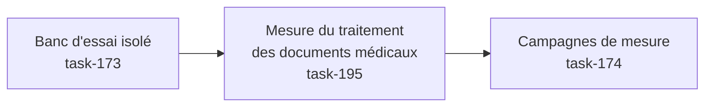

# E015 — Tests de charge de la messagerie

> **Statut** : 🟢 Fonctionnellement complet — intégration en attente
> **Modèle** : task-driven
> **Version** : 1.13
> **Auteur** : PO forge (ADR-2026-07-25-B)
> **Audience** : PO, direction, exploitant HDS — la vue ingénierie vit dans [E015-Changelogs.md](E015-Changelogs.md)
> **Dernière mise à jour** : 2026-08-01

---

<!-- toc:start — section générée par /tech-writer ; ne pas éditer manuellement -->

## Sommaire

- [1. Vision](#1-vision)
- [2. Objectifs métier](#2-objectifs-métier)
- [3. Acteurs concernés](#3-acteurs-concernés)
- [4. Features de l'EPIC](#4-features-de-lepic)
- [5. Workflow entre Features](#5-workflow-entre-features)
- [6. Règles métier transverses](#6-règles-métier-transverses)
- [7. Contraintes et hypothèses](#7-contraintes-et-hypothèses)
- [8. Critères d'acceptation de l'EPIC](#8-critères-dacceptation-de-lepic)
- [9. Hors périmètre](#9-hors-périmètre)
- [10. Premiers résultats de mesure](#10-premiers-résultats-de-mesure)
  - [Temps de réponse observés](#temps-de-réponse-observés)
  - [Combien d'actions un praticien peut-il enchaîner ?](#combien-dactions-un-praticien-peut-il-enchaîner)
  - [La campagne à grande échelle : 200 praticiens (27 juillet 2026)](#la-campagne-à-grande-échelle-200-praticiens-27-juillet-2026)
  - [Mise au point du 28 juillet 2026 : ce que la campagne mesurait vraiment](#mise-au-point-du-28-juillet-2026-ce-que-la-campagne-mesurait-vraiment)
  - [Ce que le banc sait désormais dire (29 juillet 2026)](#ce-que-le-banc-sait-désormais-dire-29-juillet-2026)
  - [La capacité est enfin chiffrée, et sa cause nommée (29-31 juillet 2026)](#la-capacité-est-enfin-chiffrée-et-sa-cause-nommée-29-31-juillet-2026)
  - [Trois mesures à reprendre](#trois-mesures-à-reprendre)
- [État de couverture (2026-08-01)](#état-de-couverture-2026-08-01)
- [Synthèse fonctionnelle des changelogs](#synthèse-fonctionnelle-des-changelogs)

<!-- toc:end -->

---

## 1. Vision

À mesure que de nouveaux praticiens rejoignent la plateforme, la messagerie
sécurisée doit rester aussi réactive pour mille utilisateurs que pour dix.
Cet EPIC dote la plateforme d'un **banc d'essai de charge** : un environnement
qui simule des centaines de boîtes aux lettres et de messages, sans aucune
donnée de santé réelle et sans solliciter les serveurs de messagerie MSSanté
de production, afin de **mesurer la réactivité du service et de détecter les
baisses de performance avant qu'elles n'atteignent les utilisateurs**.

---

## 2. Objectifs métier

- [ ] Objectif 1 : pouvoir vérifier, à la demande, que la messagerie tient la
      charge attendue (temps de réponse maîtrisés) sans dépendre d'un
      environnement réel ni de données patient.
- [ ] Objectif 2 : disposer d'une mesure de référence des temps de réponse,
      pour détecter toute régression de performance avant une mise en
      production.
- [ ] Objectif 3 : garantir que ce dispositif de test n'introduit **aucun
      risque** — jamais de donnée de santé, jamais activable en production.

---

## 3. Acteurs concernés

| Acteur | Rôle dans l'EPIC |
|--------|------------------|
| Direction / pilotage | Bénéficiaire : preuve que le service tient la montée en charge avant d'accueillir de nouveaux praticiens |
| Exploitant / hébergeur HDS | Bénéficiaire : anticipation du dimensionnement et de la stabilité serveur |
| Équipe technique | Réalise et exécute les campagnes de mesure, garantit l'isolement du banc |
| Médecin / secrétariat | Bénéficiaire indirect : une messagerie qui reste fluide quand la plateforme grandit |

---

## 4. Features de l'EPIC

> Le bilan d'avancement par feature (statut, couverture, tasks contributives)
> est consigné en fin de document, dans la section *État de couverture*.

| Fonctionnalité | Ce que l'équipe peut faire | Tasks | Statut |
|---|---|---|---|
| Banc d'essai isolé | Simuler des centaines de boîtes et de messages fictifs, en lieu et place des serveurs de messagerie réels, avec une latence réseau réaliste — sans aucune donnée de santé | task-173 | 🟢 Livré |
| Mesure du traitement des documents médicaux | Mesurer le parcours complet d'un message porteur d'un compte-rendu : réception, ouverture de la pièce jointe, extraction du document médical et du résultat de biologie associé | task-195 | 🟡 Livré, en attente d'intégration |
| Campagnes de mesure | Rejouer six usages types sous charge — consulter ses dossiers, lire, rechercher, envoyer, extraire les documents médicaux d'un compte-rendu, et un profil mêlant les cinq — puis lire les temps de réponse sur le tableau de bord de supervision, avec un rapport par campagne et une mesure de référence opposable | task-174 | 🟡 Livré, en attente d'intégration |
| Interrupteurs de fonctionnalités résilients | Garantir que les fonctions pilotées par interrupteur (dont l'analyse des comptes-rendus) restent dans leur dernier état connu si le service d'interrupteurs faiblit, au lieu de se désactiver silencieusement — avec une alerte d'exploitation quand cela survient | task-199 | 🟡 Livré, en attente d'intégration |
| Passage à l'échelle des connexions | Permettre au service de servir 1000 praticiens sans que le nombre de connexions à la base de données ne devienne le plafond — via un multiplexeur de connexions, validé d'abord sur le banc | task-200 | 🟡 Livré, en attente d'intégration |
| Fiabilité des mesures de charge | Savoir si le chiffre d'une campagne est exploitable : l'outil de tir demande réellement la charge annoncée, et tout rapport dont la mesure a été faussée par l'instrument le déclare en première page au lieu de publier un chiffre trompeur | task-203 | 🟡 Livré, en attente d'intégration |
| Localisation de la cause d'un ralentissement | Savoir **ce qui** freine la messagerie quand elle plafonne — le serveur applicatif, la base de données, le serveur de messagerie simulé, ou l'outil de mesure lui-même — au lieu de le supposer ; et le lire en direct pendant une campagne | task-204 | 🟡 Livré, en attente d'intégration |
| Levée du plafond de capacité | Servir davantage de praticiens simultanés sans que la consultation des messages ne ralentisse : la cause du plafond mesuré a été identifiée dans la messagerie elle-même, puis corrigée | task-205 | 🟡 Corrigé, mesure de confirmation à conduire |
| Attribution honnête d'une campagne ratée | Savoir, quand une campagne n'a pas pu appliquer toute la charge demandée, **si c'est la messagerie qui a ralenti ou l'instrument de mesure qui était mal réglé** — les deux se soignent de façon opposée, et le rapport nomme laquelle des deux et l'argumente par un chiffre | task-209 | 🟡 Livré, en attente d'intégration |
| Verdicts de campagne fondés | Pouvoir se fier aux trois conclusions qu'un compte rendu de campagne affirme — ce qui freine la messagerie, quelle part de la charge a réellement été servie, et si le tir est exploitable — sans avoir à les recouper soi-même | task-208 | 🟡 Livré, en attente d'intégration |
| Plafond du nombre de praticiens desserré | Accueillir davantage de praticiens sur une même installation : la préparation du dossier d'un praticien immobilisait une connexion à la base pour le restant de la vie du service, alors qu'elle ne resservait plus | task-202 | 🟡 Corrigé, mesure de confirmation à conduire |
| Mesures prises sur le vrai parcours d'authentification | Obtenir des chiffres de capacité opposables : les campagnes s'authentifiaient d'une façon que la production n'emploie pas, ce qui faussait la mesure et masquait les vraies anomalies dans le journal | task-206 | 🟡 Corrigé, mesure de confirmation à conduire |
| Consultation des messages moins mise en file | Réduire l'attente à l'ouverture d'une liste de messages : plusieurs actions du praticien passaient l'une après l'autre derrière un même verrou, et l'une de ces attentes durait une seconde entière même quand la voie se libérait aussitôt | task-211 | 🟡 Corrigé, mesure de confirmation à conduire |

---

## 5. Workflow entre Features

Le banc d'essai doit exister avant les campagnes de mesure : on met d'abord en
place l'environnement simulé (boîtes, messages, latence réaliste), puis on
exécute les scénarios de charge qui s'appuient dessus.

Entre les deux s'ajoute une étape de fidélité indispensable : le banc doit
reproduire **exactement** la manière dont la messagerie ouvre les pièces jointes
d'un message reçu. Le premier environnement simulé restituait correctement les
boîtes, les dossiers et les messages, mais échouait à livrer une pièce jointe
volumineuse morceau par morceau — c'est pourtant ainsi que la messagerie procède
en fonctionnement réel. Résultat : l'extraction des documents médicaux ne
s'exécutait jamais sur le banc, et les campagnes de mesure n'auraient mesuré que
la navigation, en laissant de côté le traitement le plus coûteux. Le serveur de
messagerie du banc a donc été remplacé par un logiciel de référence, fidèle sur
ce point (task-195). Les campagnes de mesure portent désormais sur la chaîne
complète, telle que le praticien la sollicite.

La dernière étape outille la mesure elle-même (task-174) : chaque usage type est
rejoué à la demande, avec un nombre de praticiens simulés et une durée
paramétrables, et chaque campagne s'achève sur un verdict. Les temps de réponse
attendus sont inscrits dans le dispositif : une campagne qui passe sous la cible
est déclarée en échec, sans interprétation. Les mesures s'affichent sur le
tableau de bord de supervision déjà en place, à côté de la consommation du
serveur, ce qui permet de rapprocher un ralentissement ressenti d'une cause
serveur observée au même instant.

---

## 6. Règles métier transverses

| Règle | Description | Statut |
|---|---|---|
| Isolement total des données | Le banc n'utilise **que** des données synthétiques : aucune donnée de santé, aucune identité patient réelle, aucun contenu médical | ✅ Respecté (task-173) |
| Jamais en production | Le dispositif de test est désactivé par défaut et **techniquement bloqué** en environnement de production | ✅ Respecté (task-173) |
| Neutralité du produit | Le banc ne modifie pas l'application livrée aux praticiens : il agit uniquement par configuration et données de test | ✅ Respecté (task-173) |
| Fidélité de la mesure | Le banc doit solliciter la messagerie exactement comme un serveur réel : c'est l'environnement de test qui s'aligne sur le produit, jamais le produit qui s'adapte à l'outil de mesure | ✅ Respecté (task-195) |
| Verdict automatique, pas d'interprétation | Les temps de réponse attendus sont inscrits dans le dispositif de mesure : une campagne qui passe sous la cible est déclarée en échec d'elle-même, sans lecture humaine des chiffres | ✅ Respecté (task-174) |
| Mesure de référence opposable | Chaque campagne se compare à une mesure de référence datée et conservée avec le produit, pour distinguer une variation normale d'une régression | ✅ Respecté (task-174) |
| Cause mesurée, jamais supposée | Un rapport de campagne ne désigne une cause que s'il l'a **mesurée**. À défaut, il écrit qu'il ne sait pas — il ne laisse jamais entendre que rien ne freinait | ✅ Respecté (task-204) |

---

## 7. Contraintes et hypothèses

- Le banc s'exécute en local ou en intégration continue, jamais sur un
  environnement hébergeant des données de santé (HDS).
- Les mesures obtenues valent pour l'environnement du banc : elles renseignent
  les tendances et les régressions, pas les chiffres absolus d'un déploiement
  de production.

---

## 8. Critères d'acceptation de l'EPIC

- [x] L'ensemble des features de l'EPIC est livré et vérifié.
- [x] Le banc d'essai fonctionne de bout en bout sans données réelles (task-173).
- [x] Le banc exerce réellement la réception d'un compte-rendu et l'extraction du
      document médical qu'il contient (task-195).
- [x] Une mesure de référence des temps de réponse est établie et documentée
      (task-174).
- [x] Une campagne dont la mesure n'est pas exploitable le déclare elle-même, au
      lieu de publier un chiffre trompeur (task-203).
- [x] Une campagne sait désormais **désigner ce qui freine** la messagerie, et le
      déclarer quand elle ne peut pas le savoir (task-204).
- [ ] La capacité de la messagerie — le nombre de demandes qu'elle absorbe par
      seconde — est chiffrée par une campagne exploitable. **Non atteint** : voir
      la mise au point du 28 juillet au chapitre *Premiers résultats de mesure*.
- [ ] La ressource qui limite la messagerie est **nommée et chiffrée** par une
      campagne. **Non atteint** : l'instrument est en place (task-204), la
      campagne reste à conduire.

---

## 9. Hors périmètre

- Les tests de charge sur les environnements déployés ou hébergeant des
  données réelles.
- L'optimisation des performances elles-mêmes (objet de l'EPIC E011) — E015
  fournit l'instrument de mesure, pas les optimisations.
- La simulation du comportement propre des serveurs MSSanté réels (quotas,
  bannissements) : seul le réseau est approché.

---

## 10. Premiers résultats de mesure

La première campagne de référence a été conduite le 25 juillet 2026 sur le banc
d'essai, avec dix praticiens simulés disposant chacun de dix messages porteurs
d'un compte-rendu, sous une latence réseau représentative d'un serveur MSSanté
distant. Ces chiffres valent pour un poste de développement : ils donnent des
ordres de grandeur et une référence de comparaison, pas les temps d'un
déploiement de production.

### Temps de réponse observés

| Action du praticien | Temps de réponse courant |
|---|---|
| Afficher la liste des dossiers de sa boîte | environ 15 millisecondes |
| Afficher une liste de cinq messages | environ 19 millisecondes |
| Ouvrir le contenu d'un message | environ 8 millisecondes |
| Rechercher dans ses messages | environ 180 millisecondes |
| Envoyer un message sécurisé | environ 1,1 seconde |
| Extraire les documents médicaux d'un lot de cinq comptes-rendus | environ 3,6 secondes |

Sur un profil composite mêlant ces usages, la messagerie a traité **5 832
demandes en deux minutes, soit 46 par seconde, sans une seule erreur**.

La première connexion à une boîte est celle qui paie la latence du réseau : le
dialogue avec le serveur de messagerie demande sept échanges successifs, si bien
que 100 millisecondes de latence en ajoutent environ 700 au total. Les
consultations suivantes réutilisent la connexion déjà ouverte et répondent en une
quinzaine de millisecondes. Sur la campagne de référence, la messagerie a
réutilisé une connexion existante 4 774 fois contre 21 ouvertures nouvelles — le
mécanisme de réutilisation fonctionne et c'est lui qui explique la réactivité en
usage courant.

### Combien d'actions un praticien peut-il enchaîner ?

La messagerie protège le service en plafonnant chaque praticien à **100 demandes
par tranche de 10 secondes**. Au-delà, les demandes excédentaires sont **refusées
immédiatement** : il n'y a pas de file d'attente. C'est un réglage de la
plateforme livrée, pas une particularité du banc d'essai.

La tranche de 10 secondes est **fixe** et non glissante : elle repart à zéro à
intervalle régulier. Un praticien dont les actions arrivent par à-coups peut donc
être freiné avant d'atteindre le rythme nominal de dix actions par seconde — les
premiers refus ont été observés dès **huit actions par seconde** en rythme
soutenu. L'usage humain courant — consulter, lire, répondre, envoyer — reste très
loin de ce plafond, qui vise les enchaînements automatisés.

### La campagne à grande échelle : 200 praticiens (27 juillet 2026)

La campagne « à très grande volumétrie » annoncée à la version 1.2 a été
conduite : **200 praticiens simulés, 100 messages chacun, cinq minutes de
charge soutenue**. Verdict final : **280 355 demandes traitées à 915 par
seconde, 0,02 % d'erreurs**, temps de réponse courants tenus (dossiers en
29 millisecondes, extraction des documents médicaux d'un lot de cinq en
2,3 secondes), et la vérification d'étanchéité confirmée — **aucune boîte n'a
jamais reçu le message d'un autre praticien**, y compris pendant les pannes
provoquées par la montée en charge.

Ce résultat n'a pas été obtenu du premier coup, et c'est là toute la valeur du
banc : trois limites d'infrastructure, invisibles à dix praticiens, ont cédé
l'une après l'autre à deux cents — chacune a été identifiée, corrigée et
documentée à l'attention de l'équipe système (mémoire de la base de données,
plafond de connexions, comportement du poste sous tempête de connexions). Les
règles de dimensionnement qui en résultent, jusqu'au palier 1000 praticiens,
sont consignées dans le dossier DevOps.

La campagne a aussi révélé une fragilité de la plateforme elle-même : sous
charge, le service d'interrupteurs de fonctionnalités ne suivait plus, et
l'analyse des comptes-rendus s'est désactivée **silencieusement** — sans
erreur visible, ni pour le praticien, ni pour l'exploitant. C'est l'origine
directe de la feature « Interrupteurs de fonctionnalités résilients »
(task-199) et du chantier « Passage à l'échelle des connexions » (task-200).

> ⚠️ **Le chiffre de « 915 demandes par seconde » ci-dessus ne dit pas ce qu'on a
> cru** — voir la mise au point du 28 juillet ci-dessous. Les temps de réponse et
> l'étanchéité entre boîtes, eux, restent établis.

### Mise au point du 28 juillet 2026 : ce que la campagne mesurait vraiment

En relisant les données brutes des campagnes du 27 juillet, une erreur de méthode
est apparue : **l'outil de tir se bridait lui-même**. Il n'ouvrait pas assez de
postes de travail simulés pour les actions lentes — un envoi de message dure plus
d'une seconde — si bien qu'il n'a jamais pu demander la charge annoncée. Sur
l'envoi, **14 % seulement** des demandes prévues étaient réellement émises ; sur
la recherche, 56 %. Les demandes manquantes n'étaient pas refusées par la
messagerie : elles n'ont jamais été formulées.

Conséquence : le chiffre de 915 demandes par seconde décrivait **la limite de
l'instrument de mesure, pas celle de la messagerie**. Et il expliquait une
coïncidence trompeuse — la campagne à 500 praticiens avait obtenu le même ordre
de grandeur, ce qu'on avait lu comme « la plateforme sature toujours au même
endroit », alors que c'était l'instrument qui saturait dans les deux cas.

**Ce qui reste établi** : les temps de réponse (ils portent sur des demandes
réellement traitées), le taux d'erreur, l'étanchéité entre boîtes, et les trois
limites d'infrastructure identifiées puis corrigées. **Ce qui tombe** : l'idée
d'un plafond de la plateforme autour de 900 demandes par seconde. À 200
praticiens, la messagerie a au contraire servi **la totalité** de ce qu'on lui
demandait sur les deux usages les plus fréquents — consulter ses dossiers et lire
ses messages — sans donner de signe de saturation.

L'instrument est corrigé (task-203) : il dimensionne désormais ses postes
simulés d'après la durée réelle de chaque action, et **tout rapport de campagne
dont la mesure n'est pas exploitable le déclare en première page**. Seize des
vingt-et-une campagnes déjà archivées sont dans ce cas, et l'index des campagnes
le signale désormais ligne par ligne. La conséquence à retenir : **la capacité
réelle de la messagerie reste à mesurer**, et ce sera la première campagne
conduite avec l'instrument corrigé.

### Ce que le banc sait désormais dire (29 juillet 2026)

Les campagnes passées pouvaient dire *à quel niveau* la messagerie plafonnait,
jamais *pourquoi*. Le rapport du 27 juillet concluait ainsi que le serveur de
messagerie et le processeur étaient saturés — une supposition, et elle s'est
révélée fausse : la mesure a montré que c'était la **base de données** qui
consommait l'essentiel des ressources, le serveur de messagerie simulé restant
très en deçà.

Le dispositif de mesure a donc été complété sur trois points :

- **Le service applicatif est mesuré serveur par serveur.** La messagerie tourne
  en cinq exemplaires simultanés ; les mesures les confondaient en une seule
  moyenne, ce qui interdisait de dire lequel était en difficulté. Chacun est
  désormais suivi séparément.
- **Ce que le service ne voit pas de lui-même est échantillonné** : la machine
  hôte, l'outil de tir, chacun des composants simulés et le multiplexeur de
  connexions. C'est ainsi qu'on a pu établir que **l'outil de tir n'est pas le
  facteur limitant** — il consomme moins d'un trentième de la machine.
- **Chaque rapport désigne la ressource la plus proche de sa limite**, ou écrit
  explicitement qu'aucune ne l'est, ou qu'il n'a pas la donnée pour le dire. Ce
  dernier cas est traité comme une information de plein droit : un tableau vide se
  lirait « rien ne freinait », ce qui serait faux.

Un tableau de bord dédié permet en outre de suivre ces indicateurs **pendant** une
campagne, au lieu de les analyser après coup.

Enfin, une erreur de calcul présente depuis l'origine a été corrigée : le débit
publié était divisé par la durée totale de la campagne, **temps d'extinction
compris**, ce qui le sous-estimait d'environ 8 à 10 %. Les campagnes archivées ont
été recalculées — la campagne de référence à 200 praticiens vaut **934 demandes
par seconde** et non 915.

> ⚠️ Ces trois compléments sont **l'instrument**, pas la mesure. La campagne qui
> nommera enfin la ressource limitante reste à conduire, et c'est désormais le
> seul obstacle au chiffrage de la capacité.

### La capacité est enfin chiffrée, et sa cause nommée (29-31 juillet 2026)

C'est le résultat que l'EPIC poursuivait depuis son ouverture. Une campagne
conduite à population constante — 200 praticiens — en demandant à la messagerie
des charges croissantes a donné, pour la première fois, une courbe de capacité
exploitable.

| Charge demandée | Charge réellement servie | Part servie | Temps de réponse moyen |
|---|---|---|---|
| 486 demandes/s | 483 | 99 % | 0,26 s |
| 630 demandes/s | 625 | 99 % | 0,22 s |
| 756 demandes/s | 746 | 99 % | 0,29 s |
| 882 demandes/s | 825 | 94 % | 0,40 s |
| 972 demandes/s | 858 | 88 % | 0,59 s |

**Le point de rupture se situe entre 750 et 825 demandes par seconde.** Au-delà,
la messagerie ne sert plus tout ce qu'on lui demande et les temps de réponse
doublent.

**Et pour la première fois, la campagne a nommé la cause au lieu de la
supposer.** Une seule action se dégradait massivement — la consultation de la
liste des messages, dont le temps de réponse était multiplié par sept, quand
toutes les autres n'augmentaient que de moitié. Le serveur applicatif, lui,
n'était pas saturé : il n'utilisait qu'un vingtième de la machine tout en
accumulant une file d'attente interne considérable. Autrement dit, la messagerie
n'était pas à court de puissance de calcul — **elle attendait**.

Une expérience a écarté la dernière objection possible, celle de l'outil de
mesure : en demandant *plus* de simultanéité à l'outil de tir, le débit servi a
**baissé** de 13 à 20 % et les temps de réponse ont été multipliés par cinq puis
par onze. Un outil sous-dimensionné produirait l'effet inverse. Le plafond était
donc bien dans la messagerie.

La cause exacte a ensuite été localisée dans le code : lors de la consultation
d'une liste de messages, la recherche du dossier concerné sur le serveur de
messagerie était effectuée de manière **bloquante**. Chaque consultation
immobilisait ainsi une ressource de traitement pendant tout l'aller-retour
réseau, au lieu de la libérer pour une autre demande. Ce verrou a été levé
(task-205).

> ⚠️ **La mesure de confirmation reste à conduire.** Le correctif est livré et
> verrouillé par des garde-fous automatiques qui empêchent le défaut de
> réapparaître ; la campagne qui mesurera le gain effectif est la prochaine
> étape. Rappel de lecture : sur le poste de mesure actuel, l'infrastructure de
> test consomme quatre fois plus de ressources que la messagerie elle-même — les
> 858 demandes par seconde constatées sont un **plancher**, pas un plafond.

### Trois mesures à reprendre

- **La capacité de la messagerie**, c'est-à-dire le nombre de demandes qu'elle
  peut absorber par seconde. Aucune campagne archivée ne permet de la chiffrer,
  pour la raison exposée juste au-dessus. C'est la première mesure à reprendre,
  avec l'instrument corrigé.
- **L'envoi de message.** Les boîtes du banc ne disposent pas de dossier
  « Éléments envoyés » : la copie du message expédié ne peut pas y être archivée,
  et le temps mesuré pour un envoi intègre cette tentative infructueuse. Le
  message part bien et le praticien n'est pas affecté ; la mesure sera reprise
  quand le banc fournira ce dossier.
- **La recherche.** L'index de recherche du banc est incomplet : les documents
  les plus longs n'y sont pas encore référencés. Le temps mesuré est donc plus
  favorable que la réalité et sera repris une fois cette limite levée.

---

## État de couverture (2026-08-01)

| Feature | Statut | Couverture | Tasks contributives |
|---|---|---|---|
| Banc d'essai isolé | 🟢 Livré | Environnement simulé + vérification bout-en-bout en place | task-173 |
| Mesure du traitement des documents médicaux | 🟡 Livré, en attente d'intégration | Vérifié sur un lot de messages porteurs de comptes-rendus : 4 messages sur 5 aboutissent à un document médical et un résultat de biologie exploitables ; le 5ᵉ ne portait pas de document exploitable dans le jeu de test | task-195 |
| Campagnes de mesure | 🟡 Livré, en attente d'intégration | Six usages types rejouables à la demande, verdict automatique sur les temps de réponse attendus, remontée sur le tableau de bord de supervision, rapport par campagne et mesure de référence datée ; campagne à grande échelle conduite (200 praticiens, verte) ; deux mesures à reprendre (envoi, recherche) | task-174 |
| Interrupteurs de fonctionnalités résilients | 🟡 Livré, en attente d'intégration | Dernier état connu servi quand le service d'interrupteurs est injoignable, repli déclaré par interrupteur, alerte d'exploitation dédiée, une seule ligne de journal par fenêtre au lieu d'une par échec ; 10 tests dédiés ; vérification finale sur banc au plan de test manuel | task-199 |
| Passage à l'échelle des connexions | 🟡 Livré, en attente d'intégration | Multiplexeur de connexions intégré au banc, et séparation des deux usages de la base : le trafic courant passe par le multiplexeur, la création d'un nouveau dossier praticien reste en direct — de sorte qu'un multiplexeur saturé n'empêche jamais l'arrivée d'un praticien. Compatibilité établie par mesure : 40 demandes simultanées absorbées par 3 connexions réelles au lieu de 40 ; l'analyse sémantique des comptes-rendus (recherche par similarité) fonctionne à travers le multiplexeur. Hors banc, aucun changement de comportement. La campagne comparative a été conduite et **ne montre pas de dégradation des temps de réponse** ; ce qui reste dû est le chiffre de capacité, indisponible pour la raison exposée à la mise au point du 28 juillet | task-200 |
| Fiabilité des mesures de charge | 🟡 Livré, en attente d'intégration | L'outil de tir dimensionne ses postes simulés d'après la durée réelle de chaque action, au lieu d'un nombre arbitraire : il demande donc réellement la charge annoncée. Tout rapport dont la mesure a été faussée par l'instrument porte un avertissement en première page, et une table indique, action par action, la charge demandée face à celle réellement servie. L'index des campagnes signale ligne par ligne les tirs non exploitables — **seize des vingt-et-une campagnes archivées** le sont. Le banc journalise en outre au niveau de la production, et non en mode verbeux, pour ne plus mesurer une configuration cinq fois plus bavarde que celle déployée. **Reste dû** : la campagne conduite avec l'instrument corrigé, qui donnera le premier chiffre de capacité exploitable | task-203 |
| Localisation de la cause d'un ralentissement | 🟡 Livré, en attente d'intégration | Le service applicatif est mesuré **serveur par serveur** (cinq exemplaires simultanés, jusque-là confondus en une moyenne). Ce que le service ne voit pas de lui-même est échantillonné : machine hôte, outil de tir, composants simulés, multiplexeur de connexions — c'est ce qui a permis d'établir que **l'outil de tir n'est pas le facteur limitant**. Chaque rapport désigne la ressource la plus proche de sa limite, ou déclare qu'aucune ne l'est, ou qu'il n'a pas la donnée pour le dire — jamais un tableau vide, qui se lirait « rien ne freinait ». Tableau de bord dédié pour suivre une campagne **en direct**. Erreur de calcul du débit corrigée (temps d'extinction compté à tort : ~8 à 10 % de sous-estimation, campagnes archivées recalculées). **La campagne a été conduite** : cinq paliers à population constante, point de rupture situé entre 750 et 825 demandes par seconde, et cause nommée pour la première fois au lieu d'être supposée | task-204 |
| Levée du plafond de capacité | 🟡 Corrigé, mesure de confirmation à conduire | La cause du plafond est localisée dans la messagerie : la consultation d'une liste de messages immobilisait une ressource de traitement pendant tout l'aller-retour avec le serveur de messagerie, au lieu de la libérer. Le verrou est levé, et trois garde-fous automatiques empêchent qu'il réapparaisse — l'un d'eux inspecte le programme compilé, de sorte qu'aucun contournement du correctif ne passe inaperçu. **Reste dû** : la campagne de confirmation, qui mesurera le gain effectif aux deux paliers où le défaut se manifestait | task-205 |
| Attribution honnête d'une campagne ratée | 🟡 Livré, en attente d'intégration | Deux causes très différentes produisent le même symptôme — une campagne qui n'applique pas toute la charge annoncée : soit la messagerie ralentit sous la charge, soit l'instrument de mesure a été réglé sur des temps de réponse qui ne sont plus ceux du banc. Elles appellent des gestes **opposés** : réduire la charge demandée dans le premier cas, corriger le réglage dans le second. Le rapport tranche désormais entre les deux, désigne l'usage qui porte les abandons, et **écrit qu'il ne sait pas** plutôt que de deviner quand la mesure côté serveur lui manque. Le réglage de l'instrument a par ailleurs été refait sur les temps réellement observés, et **les conditions dans lesquelles ils ont été relevés sont désormais consignées avec eux** — c'est leur absence qui avait fait perdre deux campagnes | task-209 |
| Verdicts de campagne fondés | 🟡 Livré, en attente d'intégration | Un compte rendu de campagne affirmait trois choses avec assurance, et les trois pouvaient être fausses. **Ce qui freine** : le multiplexeur de connexions était désigné coupable de trois paliers sur un unique relevé d'attente, pris à l'ouverture du tir — il l'est désormais sur une attente **installée dans la durée**, et le pic d'ouverture reste mentionné puisqu'il grandit avec la charge. **La part servie** : le même document annonçait 99,3 % en tête et 85,1 % dans son tableau, faute de compter sur la même période ; les deux chiffres s'accordent maintenant. **L'exploitabilité** : le traitement des comptes-rendus s'arrête quand son temps imparti est écoulé, ce qui est normal — c'était pourtant compté comme un échec et invalidait des campagnes saines. C'est distingué, et le nombre de comptes-rendus restants est affiché, parce qu'il dit combien de travail n'a pas été exercé | task-208 |
| Plafond du nombre de praticiens desserré | 🟡 Corrigé, mesure de confirmation à conduire | Le nombre de praticiens qu'une installation peut accueillir est borné par les connexions à la base, et non par le trafic — c'est le constat de la campagne à grande échelle. Or la préparation du dossier d'un nouveau praticien, opération jouée **une seule fois**, gardait ensuite une connexion ouverte pour le restant de la vie du service : mesuré à **une par praticien**, soit environ 169 connexions retenues pour rien sur 200 praticiens. Trois causes cumulées, toutes corrigées. **Reste dû** : la campagne de confirmation, qui vérifiera que l'écart tombe sous 20 et que les temps de réponse ne bougent pas — le correctif ne doit rien coûter, c'est tout son intérêt face à l'autre option, écartée parce qu'elle dégradait la latence | task-202 |
| Mesures prises sur le vrai parcours d'authentification | 🟡 Corrigé, mesure de confirmation à conduire | Les campagnes s'identifiaient auprès du service avec un justificatif simplifié, que la production n'emploie jamais. Deux conséquences : le temps mesuré n'incluait pas ce que coûte réellement la vérification d'identité, et le service signalait une anomalie **à chaque requête** — plus de 1 200 par seconde en pointe. Ce bruit rendait le journal d'anomalies inutilisable : une vraie panne y serait passée inaperçue. Les campagnes présentent désormais un justificatif de la même forme qu'en production, et le service ne signale plus rien quand il n'y a rien à signaler. **Reste dû** : la campagne de confirmation, et la relecture du journal pour vérifier que chaque anomalie restante s'explique | task-206 |
| Consultation des messages moins mise en file | 🟡 Corrigé, mesure de confirmation à conduire | L'ouverture d'une liste de messages reste l'action la plus lente du profil courant : 718 ms en moyenne, mais 213 ms pour une consultation sur deux. Cet écart dit que le temps se passe **en file d'attente**, pas à travailler — et ni la puissance de calcul ni la capacité de traitement ne sont en cause, toutes deux mesurées au repos. En cause : plusieurs actions du praticien se sérialisent derrière un même verrou. Deux acquis. D'abord, **on sait désormais mesurer** ces attentes une par une : chaque campagne dira laquelle pèse, au lieu de laisser supposer. Ensuite, l'une d'elles imposait **une seconde entière** dès qu'il y avait la moindre concurrence, même quand la voie se libérait en un clin d'œil — ramenée à quelques centièmes. Une attente pouvant aller jusqu'à trente secondes a par ailleurs été ramenée à cinq : elle servait à éviter un travail en double, pas à garantir l'exactitude, et faire patienter une demi-minute pour cette raison était un mauvais échange. **Reste dû** : la campagne qui dira laquelle des attentes portait le retard — et, si elles pèsent peu, la conclusion attendue est de le constater plutôt que de relâcher des garde-fous sans gain établi | task-211 |

**Couverture EPIC consolidée : 13 features livrées sur 13** (les treize attendent
leur intégration). L'EPIC est **fonctionnellement complet** : le banc est
opérationnel, il mesure la chaîne complète de traitement des documents médicaux,
les campagnes de mesure sont outillées avec une référence opposable, la campagne à
grande volumétrie (200 praticiens) a été conduite — en produisant les règles de
dimensionnement de l'infrastructure jusqu'au palier 1000 praticiens et deux
chantiers de robustesse, livrés (task-199, task-200) — et l'instrument de mesure
sait désormais dire quand son propre chiffre n'est pas exploitable (task-203).

Trois réserves à porter au bilan, sans quoi il serait trompeur :

- **la capacité est chiffrée et sa cause nommée, mais le gain du correctif n'est
  pas encore mesuré.** C'est le grand acquis de fin juillet : la messagerie sert
  intégralement ce qu'on lui demande jusqu'à environ 750 demandes par seconde,
  rompt entre 750 et 825, et la cause en a été localisée puis corrigée dans la
  messagerie elle-même. Ce qui reste dû est la **campagne de confirmation** du
  correctif. Réserve de lecture inchangée : sur le poste actuel, l'infrastructure
  de test et le service applicatif se partagent le même processeur — et l'infra en
  consomme quatre fois plus que la messagerie —, si bien que tout chiffre obtenu
  ici est un **plancher** et non un plafond. Les quatre campagnes de confirmation
  tentées le 31 juillet ont échoué **pour une raison d'instrument, pas de
  messagerie** — leur réglage supposait des temps de réponse que le banc ne
  produit plus dès lors qu'on repart de dossiers vides. Ce réglage est corrigé
  (task-209) ; la campagne reste à refaire ;
- deux mesures d'usage restent à reprendre — l'envoi et la recherche, pour les
  raisons exposées au chapitre *Premiers résultats de mesure* ;
- le passage à l'échelle des connexions est **établi comme compatible, pas
  encore comme performant** : la brique est livrée et vérifiée
  fonctionnellement. La comparaison des temps de réponse avec et sans
  multiplexeur, elle, tient (l'instrument était bridé de façon identique des deux
  côtés) ; ce qui manque reste le chiffre de capacité. Le palier 1000 praticiens
  n'est donc pas encore déverrouillé.

---

## Synthèse fonctionnelle des changelogs

**Technique / observabilité** (sans impact utilisateur direct)

- v1.0 — Mise en place d'un banc d'essai de charge isolé pour la messagerie :
  simulation de boîtes et de messages fictifs en lieu et place des serveurs
  réels, latence réseau réaliste, activation opt-in jamais disponible en
  production, aucune donnée de santé. Vérification automatisée de bout en bout
  du parcours de messagerie sur cet environnement simulé. (task-173)
- v1.1 — Le banc mesure désormais la chaîne complète : la réception d'un message
  porteur d'un compte-rendu, l'ouverture de sa pièce jointe et l'extraction du
  document médical et du résultat de biologie s'exécutent réellement sur
  l'environnement simulé, ce qui était impossible auparavant. Le stockage des
  boîtes de test sur disque lève par ailleurs la limite de volumétrie qui bornait
  le banc, ouvrant la voie à des campagnes de grande ampleur. (task-195)
- v1.2 — Les campagnes de mesure sont outillées : six usages types (consulter ses
  dossiers, lire, rechercher, envoyer, extraire les documents médicaux d'un
  compte-rendu, et un profil mêlant les cinq) se rejouent à la demande, avec un
  nombre de praticiens simulés et une durée paramétrables. Les temps de réponse
  attendus sont inscrits dans le dispositif, qui déclare lui-même une campagne en
  échec lorsqu'elle passe sous la cible, et les mesures s'affichent sur le tableau
  de bord de supervision à côté de la consommation du serveur. Une mesure de
  référence datée est conservée avec le produit comme garde anti-régression.
  (task-174)

- v1.3 — Les fonctions pilotées par interrupteur (dont l'analyse des
  comptes-rendus) ne dépendent plus d'un appel réseau à chaque évaluation : le
  service conserve un état local, rafraîchi périodiquement. Si le service
  d'interrupteurs devient injoignable, le dernier état connu continue de
  s'appliquer, une alerte d'exploitation est levée, et le journal ne reçoit
  qu'une ligne par minute au lieu d'une par échec. (task-199)

- v1.4 — Un multiplexeur de connexions est intégré au banc, en réponse au
  plafond que la campagne à grande échelle avait mis au jour. Deux usages de la
  base sont désormais distingués : le trafic courant passe par le multiplexeur,
  tandis que la création du dossier d'un nouveau praticien reste en accès
  direct — un multiplexeur saturé ou arrêté ne peut donc jamais empêcher
  l'arrivée d'un praticien. Vérifié par mesure : 40 demandes simultanées sont
  absorbées par 3 connexions réelles au lieu de 40, et l'analyse sémantique des
  comptes-rendus continue de fonctionner à travers le multiplexeur — c'était le
  point d'incertitude technique de l'étude. Hors banc, aucun changement de
  comportement. La campagne comparative qui doit prouver l'absence de
  dégradation des temps de réponse reste à conduire. (task-200)

- v1.6 — Le dispositif de mesure sait désormais désigner **ce qui** freine la
  messagerie. Le service applicatif est suivi **serveur par serveur** (il tourne en
  cinq exemplaires, jusque-là confondus en une seule moyenne, ce qui interdisait de
  dire lequel était en difficulté). Ce que le service ne voit pas de lui-même est
  échantillonné : machine hôte, outil de tir, composants simulés, multiplexeur de
  connexions. Chaque rapport nomme la ressource la plus proche de sa limite — ou
  écrit qu'aucune ne l'est, ou qu'il n'a pas la donnée pour le dire, ce dernier cas
  étant traité comme une information de plein droit. Un tableau de bord dédié
  permet de suivre tout cela **pendant** une campagne. Une erreur de calcul du
  débit présente depuis l'origine est corrigée au passage. (task-204)

**Ce que la mesure a appris sur le service**

- v1.2 — La messagerie plafonne chaque praticien à 100 demandes par tranche de
  10 secondes, sans file d'attente : au-delà, la demande est refusée
  immédiatement. La tranche étant fixe, un enchaînement par à-coups peut déclencher
  ce refus dès huit actions par seconde, en deçà du rythme nominal. L'usage humain
  courant en reste très éloigné. (task-174)
- v1.3 — À 200 praticiens simulés, la campagne à grande échelle a tenu cinq
  minutes de charge soutenue avec **0,02 % d'erreurs** et une étanchéité parfaite
  entre boîtes. Elle a établi que le nombre de connexions à la base de données
  croît avec le **nombre de praticiens équipés**, pas avec le trafic — c'est la
  donnée qui dimensionne l'infrastructure, consignée avec les règles de calcul
  jusqu'au palier 1000 praticiens dans le dossier DevOps. Elle a aussi révélé que
  le service d'interrupteurs de fonctionnalités cédait sous charge en désactivant
  silencieusement l'analyse des comptes-rendus — corrigé par la task-199.
  (campagne du 2026-07-27)
- v1.5 — **Le débit annoncé par les campagnes archivées mesurait l'instrument, pas
  la messagerie.** L'outil de tir n'ouvrait pas assez de postes simulés pour les
  actions lentes : sur l'envoi, 14 % seulement des demandes prévues étaient
  réellement émises. Le chiffre de 915 demandes par seconde était donc son propre
  plafond — ce qui explique aussi pourquoi la campagne à 500 praticiens obtenait le
  même ordre de grandeur. Ce qui reste établi : temps de réponse, taux d'erreur,
  étanchéité. Ce qui tombe : l'idée d'un plafond de la plateforme vers 900 demandes
  par seconde — à 200 praticiens elle servait la totalité de ce qu'on lui demandait
  sur les deux usages les plus fréquents. La capacité réelle reste à mesurer.
  (task-203)
- v1.6 — **« Saturé sur le serveur de messagerie » était une supposition, et elle
  était fausse.** La première mesure de ressources conduite pendant une campagne
  montre que c'est la **base de données** qui consomme l'essentiel, le serveur de
  messagerie simulé restant très en deçà. Elle établit aussi que **l'outil de tir
  n'est pas le facteur limitant** (moins d'un trentième de la machine). Enseignement
  de méthode : sur le poste de mesure actuel, l'infrastructure de test et le service
  applicatif se partagent le même processeur — tout chiffre de capacité qu'on y
  obtient est donc un **plancher**, jamais un plafond. (task-204)
- v1.7 — **La capacité de la messagerie est enfin chiffrée, et sa cause nommée.**
  Cinq paliers à 200 praticiens établissent que la messagerie sert intégralement
  ce qu'on lui demande jusqu'à environ 750 demandes par seconde et rompt entre 750
  et 825. Pour la première fois la campagne **nomme** ce qui la freine au lieu de
  le supposer : une seule action se dégrade — la consultation de la liste des
  messages, sept fois plus lente au plafond quand les autres n'augmentent que de
  moitié — et le serveur applicatif n'est pas saturé, il attend. Une expérience
  écarte l'outil de mesure comme explication : lui donner plus de simultanéité
  fait *baisser* le débit servi. (task-204)
- v1.8 — **Le verrou de capacité est levé.** La cause du plafond a été localisée
  dans la messagerie : lors de la consultation d'une liste de messages, la
  recherche du dossier concerné sur le serveur de messagerie immobilisait une
  ressource de traitement pendant tout l'aller-retour réseau au lieu de la libérer
  pour une autre demande. Le correctif rend cette recherche non bloquante, et
  trois garde-fous automatiques empêchent le défaut de réapparaître — dont un qui
  inspecte le programme compilé, de sorte qu'un contournement du correctif ne
  puisse pas passer inaperçu. La campagne de confirmation reste à conduire.
  (task-205)
- v1.9 — **Une campagne ratée dit désormais à qui la faute.** Jusqu'ici, quand une
  campagne n'appliquait pas toute la charge annoncée, le rapport concluait que la
  messagerie n'avait pas tenu — alors qu'une fois sur deux c'est l'instrument de
  mesure qui était mal réglé. Les deux causes se soignent pourtant de façon
  **opposée** : réduire la charge demandée quand la messagerie ralentit, corriger le
  réglage quand c'est l'instrument. Le rapport tranche maintenant entre les deux,
  désigne l'usage qui concentre les demandes abandonnées, et **écrit qu'il ne sait
  pas** plutôt que de deviner lorsque la mesure côté serveur lui manque. (task-209)
- v1.9 — **Le réglage de l'instrument tient compte d'une contrainte qui lui échappait.**
  Mesurer le traitement des comptes-rendus impose de repartir de dossiers vides à
  chaque palier ; or la consultation d'une liste de messages coûte alors deux fois et
  demie plus cher, puisque tout doit être relu depuis le serveur de messagerie. Le
  réglage, établi dans l'autre condition, sous-dimensionnait l'instrument — ce qui a
  coûté deux campagnes. Il est refait sur les temps réellement observés, **et les
  conditions dans lesquelles ils ont été relevés sont consignées avec eux**, pour que
  la contradiction ne puisse plus se reproduire en silence. (task-209)
- v1.10 — **Les trois verdicts d'un compte rendu de campagne sont désormais
  fondés.** Ils étaient affirmés avec assurance, et les trois pouvaient être
  faux : le multiplexeur de connexions désigné coupable de trois paliers sur un
  unique relevé pris à l'ouverture du tir ; une part de charge servie annoncée
  à 99,3 % en tête de document et à 85,1 % dans son tableau, faute de compter
  sur la même période ; et des campagnes saines déclarées inexploitables parce
  que le traitement des comptes-rendus s'était arrêté à son temps imparti,
  comportement pourtant normal. Les trois sont corrigés, et ce qui a été écarté
  d'un verdict reste affiché — un pic d'attente à l'ouverture grandit avec la
  charge, et le nombre de comptes-rendus non traités dit combien de travail n'a
  pas été exercé. (task-208)
- v1.11 — **Le plafond du nombre de praticiens est desserré.** Ce qui limite
  la taille d'une installation, ce n'est pas le trafic mais le nombre de
  connexions à la base — et la préparation du dossier d'un praticien, jouée
  une seule fois, en gardait une ouverte pour le restant de la vie du service.
  Mesuré à une connexion par praticien, soit environ 169 retenues pour rien sur
  200. Trois causes se cumulaient ; les trois sont corrigées. La campagne de
  confirmation reste à conduire : elle vérifiera aussi que les temps de réponse
  ne bougent pas, le correctif ne devant rien coûter — c'est ce qui le distingue
  de l'autre option, écartée parce qu'elle dégradait la latence. (task-202)
- v1.12 — **Les campagnes mesurent enfin le vrai parcours d'authentification.**
  Elles s'identifiaient auprès du service avec un justificatif simplifié, que la
  production n'emploie jamais : le temps mesuré n'incluait donc pas ce que coûte
  réellement la vérification d'identité, et un chiffre obtenu sur un autre
  parcours que celui déployé n'est pas opposable. Le service signalait de plus
  une anomalie **à chaque requête** — plus de 1 200 par seconde en pointe —, ce
  qui rendait le journal d'anomalies inutilisable : une vraie panne y serait
  passée inaperçue. Les deux sont corrigés, et la documentation du banc indique
  désormais quel volume d'anomalies est normal, et à partir de quand s'inquiéter.
  (task-206)
- v1.13 — **L'ouverture d'une liste de messages attend moins.** C'est l'action
  la plus lente du profil courant — 718 ms en moyenne, mais 213 ms une fois sur
  deux : l'écart dit que le temps se passe en file d'attente, pas à travailler.
  Deux acquis. On sait désormais **mesurer** ces attentes une par une, de sorte
  que chaque campagne dira laquelle pèse au lieu de laisser supposer. Et l'une
  d'elles imposait **une seconde entière** à la moindre concurrence, même quand
  la voie se libérait aussitôt : ramenée à quelques centièmes. Une autre attente,
  qui pouvait durer trente secondes, est ramenée à cinq — elle évitait un travail
  en double, elle ne garantissait pas l'exactitude, et faire patienter le
  praticien une demi-minute pour cela était un mauvais échange. La campagne de
  confirmation reste à conduire. (task-211)

---

*Documentation vivante de l'EPIC E015 — vue produit. Détails d'ingénierie dans [E015-Changelogs.md](E015-Changelogs.md).*
