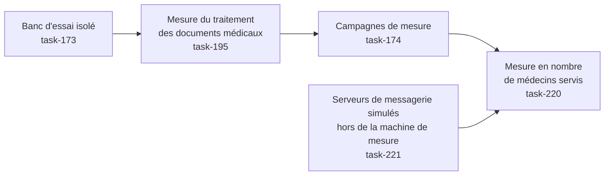

# E015 — Tests de charge de la messagerie

> **Statut** : 🟢 Fonctionnellement complet — intégration en attente
> **Modèle** : task-driven
> **Version** : 1.39
> **Auteur** : PO forge (ADR-2026-07-25-B)
> **Audience** : PO, direction, exploitant HDS — la vue ingénierie vit dans [E015-Changelogs.md](E015-Changelogs.md)
> **Dernière mise à jour** : 2026-08-14

---

<!-- toc:start — section générée par /tech-writer ; ne pas éditer manuellement -->

## Sommaire

- [1. Vision](#1-vision)
- [2. Objectifs métier](#2-objectifs-métier)
- [3. Acteurs concernés](#3-acteurs-concernés)
- [4. Features de l'EPIC](#4-features-de-lepic)
- [5. Workflow entre Features](#5-workflow-entre-features)
- [6. Règles métier transverses](#6-règles-métier-transverses)
- [7. Contraintes et hypothèses](#7-contraintes-et-hypothèses)
- [8. Critères d'acceptation de l'EPIC](#8-critères-dacceptation-de-lepic)
- [9. Hors périmètre](#9-hors-périmètre)
- [10. Premiers résultats de mesure](#10-premiers-résultats-de-mesure)
  - [Temps de réponse observés](#temps-de-réponse-observés)
  - [Combien d'actions un praticien peut-il enchaîner ?](#combien-dactions-un-praticien-peut-il-enchaîner-)
  - [La campagne à grande échelle : 200 praticiens (27 juillet 2026)](#la-campagne-à-grande-échelle--200-praticiens-27-juillet-2026)
  - [Mise au point du 28 juillet 2026 : ce que la campagne mesurait vraiment](#mise-au-point-du-28-juillet-2026--ce-que-la-campagne-mesurait-vraiment)
  - [Ce que le banc sait désormais dire (29 juillet 2026)](#ce-que-le-banc-sait-désormais-dire-29-juillet-2026)
  - [La capacité est enfin chiffrée, et sa cause nommée (29-31 juillet 2026)](#la-capacité-est-enfin-chiffrée-et-sa-cause-nommée-29-31-juillet-2026)
  - [Le banc simule enfin des médecins, et non des requêtes (3 août 2026)](#le-banc-simule-enfin-des-médecins-et-non-des-requêtes-3-août-2026)
  - [La mesure ne se déforme plus elle-même au-delà de 500 praticiens (3 août 2026)](#la-mesure-ne-se-déforme-plus-elle-même-au-delà-de-500-praticiens-3-août-2026)
  - [L'étape « relire un message » ne mesurait pas ce qu'elle annonçait (4 août 2026)](#létape--relire-un-message--ne-mesurait-pas-ce-quelle-annonçait-4-août-2026)
  - [Trois mesures à reprendre](#trois-mesures-à-reprendre)
  - [Ce que le praticien ne verra plus : une base vide à la place de son dossier (4-5 août 2026)](#ce-que-le-praticien-ne-verra-plus--une-base-vide-à-la-place-de-son-dossier-4-5-août-2026)
  - [Ouvrir un dossier patient ne coûte plus la taille du dossier (5 août 2026)](#ouvrir-un-dossier-patient-ne-coûte-plus-la-taille-du-dossier-5-août-2026)
  - [Le harnais de test cesse de jeter le signal le moins cher du dépôt (6 août 2026)](#le-harnais-de-test-cesse-de-jeter-le-signal-le-moins-cher-du-dépôt-6-août-2026)
  - [Analyser un message demande un aller-retour de moins au serveur de messagerie (10 août 2026)](#analyser-un-message-demande-un-aller-retour-de-moins-au-serveur-de-messagerie-10-août-2026)
  - [On saura enfin pourquoi télécharger une pièce jointe s'effondre à 500 praticiens (9 août 2026)](#on-saura-enfin-pourquoi-télécharger-une-pièce-jointe-seffondre-à-500-praticiens-9-août-2026)
  - [Une sonde de surveillance faussait la mesure qui sert à dimensionner la base (9 août 2026)](#une-sonde-de-surveillance-faussait-la-mesure-qui-sert-à-dimensionner-la-base-9-août-2026)
  - [Les erreurs que comptait le banc portent enfin un nom (9 août 2026)](#les-erreurs-que-comptait-le-banc-portent-enfin-un-nom-9-août-2026)
  - [Une fiche de correspondant ne se met plus à jour « à moitié » (9 août 2026)](#une-fiche-de-correspondant-ne-se-met-plus-à-jour--à-moitié--9-août-2026)
  - [Ouvrir un dossier patient ne coûtera plus le nombre de documents qu'il contient (9 août 2026)](#ouvrir-un-dossier-patient-ne-coûtera-plus-le-nombre-de-documents-quil-contient-9-août-2026)
  - [On sait enfin poser la question « pourquoi analyser un message coûte-t-il trois secondes ? » (9 août 2026)](#on-sait-enfin-poser-la-question--pourquoi-analyser-un-message-coûte-t-il-trois-secondes---9-août-2026)
  - [Un rapport de test ne peut plus dire « tout va bien » sur une mesure qui n'a pas eu lieu (9 août 2026)](#un-rapport-de-test-ne-peut-plus-dire--tout-va-bien--sur-une-mesure-qui-na-pas-eu-lieu-9-août-2026)
  - [Le banc nous faisait croire que l'application était plus lente qu'elle ne l'est (9 août 2026)](#le-banc-nous-faisait-croire-que-lapplication-était-plus-lente-quelle-ne-lest-9-août-2026)
  - [Traiter un message reçu coûte 2,7 secondes, et 97 % de ce temps est le téléchargement (9-10 août 2026)](#traiter-un-message-reçu-coûte-27-secondes-et-97--de-ce-temps-est-le-téléchargement-9-10-août-2026)
  - [Ouvrir sa boîte ne coûte plus la taille de sa boîte (9 août 2026)](#ouvrir-sa-boîte-ne-coûte-plus-la-taille-de-sa-boîte-9-août-2026)
  - [Le banc a appris à refuser de conclure (9-10 août 2026)](#le-banc-a-appris-à-refuser-de-conclure-9-10-août-2026)
  - [Le premier poste de coût du parcours n'est plus une boîte noire (8 août 2026)](#le-premier-poste-de-coût-du-parcours-nest-plus-une-boîte-noire-8-août-2026)
  - [La question qui restait ouverte est tranchée : ce n'est pas la base de données (8 août 2026)](#la-question-qui-restait-ouverte-est-tranchée--ce-nest-pas-la-base-de-données-8-août-2026)
  - [Pourquoi l'envoi n'a pas accéléré : on mesurait la mauvaise chose, et on entretenait la mauvaise horloge (8 août 2026)](#pourquoi-lenvoi-na-pas-accéléré--on-mesurait-la-mauvaise-chose-et-on-entretenait-la-mauvaise-horloge-8-août-2026)
  - [L'envoi ne repaie plus le prix d'une connexion neuve à chaque message (7 août 2026)](#lenvoi-ne-repaie-plus-le-prix-dune-connexion-neuve-à-chaque-message-7-août-2026)
  - [Consulter sa boîte pendant qu'un traitement tourne ne fait plus la queue message par message (7 août 2026)](#consulter-sa-boîte-pendant-quun-traitement-tourne-ne-fait-plus-la-queue-message-par-message-7-août-2026)
  - [Les tâches d'arrière-plan sont enfin éprouvées comme elles s'exécutent réellement (6 août 2026, soir)](#les-tâches-darrière-plan-sont-enfin-éprouvées-comme-elles-sexécutent-réellement-6-août-2026-soir)
  - [La pièce qui permettait au piège de se reformer a été retirée (6 août 2026)](#la-pièce-qui-permettait-au-piège-de-se-reformer-a-été-retirée-6-août-2026)
- [État de couverture (2026-08-14)](#état-de-couverture-2026-08-14)
- [Synthèse fonctionnelle des changelogs](#synthèse-fonctionnelle-des-changelogs)

<!-- toc:end -->

---

## 1. Vision

À mesure que de nouveaux praticiens rejoignent la plateforme, la messagerie
sécurisée doit rester aussi réactive pour mille utilisateurs que pour dix.
Cet EPIC dote la plateforme d'un **banc d'essai de charge** : un environnement
qui simule des centaines de boîtes aux lettres et de messages, sans aucune
donnée de santé réelle et sans solliciter les serveurs de messagerie MSSanté
de production, afin de **mesurer la réactivité du service et de détecter les
baisses de performance avant qu'elles n'atteignent les utilisateurs**.

---

## 2. Objectifs métier

- [ ] Objectif 1 : pouvoir vérifier, à la demande, que la messagerie tient la
      charge attendue (temps de réponse maîtrisés) sans dépendre d'un
      environnement réel ni de données patient.
- [ ] Objectif 2 : disposer d'une mesure de référence des temps de réponse,
      pour détecter toute régression de performance avant une mise en
      production.
- [ ] Objectif 3 : garantir que ce dispositif de test n'introduit **aucun
      risque** — jamais de donnée de santé, jamais activable en production.

---

## 3. Acteurs concernés

| Acteur | Rôle dans l'EPIC |
|--------|------------------|
| Direction / pilotage | Bénéficiaire : preuve que le service tient la montée en charge avant d'accueillir de nouveaux praticiens |
| Exploitant / hébergeur HDS | Bénéficiaire : anticipation du dimensionnement et de la stabilité serveur |
| Équipe technique | Réalise et exécute les campagnes de mesure, garantit l'isolement du banc |
| Médecin / secrétariat | Bénéficiaire indirect : une messagerie qui reste fluide quand la plateforme grandit |

---

## 4. Features de l'EPIC

> Le bilan d'avancement par feature (statut, couverture, tasks contributives)
> est consigné en fin de document, dans la section *État de couverture*.

| Fonctionnalité | Ce que l'équipe peut faire | Tasks | Statut |
|---|---|---|---|
| Banc d'essai isolé | Simuler des centaines de boîtes et de messages fictifs, en lieu et place des serveurs de messagerie réels, avec une latence réseau réaliste — sans aucune donnée de santé | task-173 | 🟢 Livré |
| Mesure du traitement des documents médicaux | Mesurer le parcours complet d'un message porteur d'un compte-rendu : réception, ouverture de la pièce jointe, extraction du document médical et du résultat de biologie associé | task-195 | 🟡 Livré, en attente d'intégration |
| Campagnes de mesure | Rejouer six usages types sous charge — consulter ses dossiers, lire, rechercher, envoyer, extraire les documents médicaux d'un compte-rendu, et un profil mêlant les cinq — puis lire les temps de réponse sur le tableau de bord de supervision, avec un rapport par campagne et une mesure de référence opposable | task-174 | 🟡 Livré, en attente d'intégration |
| Interrupteurs de fonctionnalités résilients | Garantir que les fonctions pilotées par interrupteur (dont l'analyse des comptes-rendus) restent dans leur dernier état connu si le service d'interrupteurs faiblit, au lieu de se désactiver silencieusement — avec une alerte d'exploitation quand cela survient | task-199 | 🟡 Livré, en attente d'intégration |
| Passage à l'échelle des connexions | Permettre au service de servir 1000 praticiens sans que le nombre de connexions à la base de données ne devienne le plafond — via un multiplexeur de connexions, validé d'abord sur le banc | task-200 | 🟡 Livré, en attente d'intégration |
| Fiabilité des mesures de charge | Savoir si le chiffre d'une campagne est exploitable : l'outil de tir demande réellement la charge annoncée, et tout rapport dont la mesure a été faussée par l'instrument le déclare en première page au lieu de publier un chiffre trompeur | task-203 | 🟡 Livré, en attente d'intégration |
| Localisation de la cause d'un ralentissement | Savoir **ce qui** freine la messagerie quand elle plafonne — le serveur applicatif, la base de données, le serveur de messagerie simulé, ou l'outil de mesure lui-même — au lieu de le supposer ; et le lire en direct pendant une campagne | task-204 | 🟡 Livré, en attente d'intégration |
| Levée du plafond de capacité | Servir davantage de praticiens simultanés sans que la consultation des messages ne ralentisse : la cause du plafond mesuré a été identifiée dans la messagerie elle-même, puis corrigée | task-205 | 🟡 Corrigé, mesure de confirmation à conduire |
| Attribution honnête d'une campagne ratée | Savoir, quand une campagne n'a pas pu appliquer toute la charge demandée, **si c'est la messagerie qui a ralenti ou l'instrument de mesure qui était mal réglé** — les deux se soignent de façon opposée, et le rapport nomme laquelle des deux et l'argumente par un chiffre | task-209 | 🟡 Livré, en attente d'intégration |
| Verdicts de campagne fondés | Pouvoir se fier aux trois conclusions qu'un compte rendu de campagne affirme — ce qui freine la messagerie, quelle part de la charge a réellement été servie, et si le tir est exploitable — sans avoir à les recouper soi-même | task-208 | 🟡 Livré, en attente d'intégration |
| Plafond du nombre de praticiens desserré | Accueillir davantage de praticiens sur une même installation : la préparation du dossier d'un praticien immobilisait une connexion à la base pour le restant de la vie du service, alors qu'elle ne resservait plus | task-202 | 🟡 Corrigé, mesure de confirmation à conduire |
| Mesures prises sur le vrai parcours d'authentification | Obtenir des chiffres de capacité opposables : les campagnes s'authentifiaient d'une façon que la production n'emploie pas, ce qui faussait la mesure et masquait les vraies anomalies dans le journal | task-206 | 🟡 Corrigé, mesure de confirmation à conduire |
| Consultation des messages moins mise en file | Réduire l'attente à l'ouverture d'une liste de messages : plusieurs actions du praticien passaient l'une après l'autre derrière un même verrou, et l'une de ces attentes durait une seconde entière même quand la voie se libérait aussitôt | task-211 | 🟡 Corrigé, mesure de confirmation à conduire |
| L'assistance IA ne se coupe plus toute seule au redémarrage | Éviter qu'un redémarrage du service tombant pendant une panne de l'outil de configuration ne désactive silencieusement l'étage d'analyse des documents | task-201 | 🟡 Corrigé, mesure de confirmation à conduire |
| Envoyer un message n'attend plus la fin d'une analyse en cours | Rendre l'envoi immédiat même quand la boîte du praticien est occupée à analyser des documents reçus : l'archivage du message envoyé passait derrière ce travail de fond | task-213, task-215 | 🔴 **Mesuré : le correctif fonctionne mais coûte plus qu'il ne rapporte — retrait décidé** (task-216) |
| L'instrument sait enfin ce qu'il ne mesure pas | Mesurer les vingt points d'attente de la boîte du praticien, et non le seul qui l'était : le tableau censé désigner le coupable d'un ralentissement ne pouvait nommer que celui-là | task-214 | 🟡 Livré, en attente d'intégration |
| Mesure en nombre de médecins servis | Poser la question qui décide de l'accueil de nouveaux praticiens — **combien de médecins la messagerie sert-elle en tenant ses temps de réponse** — en simulant des médecins qui déroulent leur journée réelle (arriver sur son tableau de bord, ouvrir sa boîte, lire, supprimer, télécharger une pièce jointe, envoyer) au lieu d'un mélange d'actions isolées ; et lire, à chaque palier de population, **quelle étape du travail du médecin souffre la première** | task-220 | 🟡 Livré, en attente d'intégration |
| Le banc ne prend plus les ressources du service qu'il mesure | Mesurer la messagerie au-delà de cinq cents praticiens sans que les serveurs de messagerie simulés — désormais installés sur une infrastructure séparée — ne lui prennent ses ressources, et lire leur coût propre séparément du sien | task-221 | 🟡 Livré, en attente d'intégration |
| Un message parti n'est jamais annoncé en échec | Avoir la certitude qu'un compte rendu remis au correspondant est bien annoncé comme parti au médecin — et, si sa copie dans « Messages envoyés » manque, le lui dire comme une information distincte plutôt que comme un échec d'envoi | task-223 | 🟡 Corrigé, mesure de confirmation à conduire |
| Savoir combien de fois le serveur de messagerie est sollicité | Lire, sur chaque demande, **le nombre d'allers-retours réellement faits vers le serveur de messagerie** — au lieu de le déduire d'un temps, ce qui ne l'a jamais prouvé. Sert aussi à contrôler l'instrument : une étape de campagne annoncée « servie par la base » qui sollicite le serveur ne mesure pas ce qu'elle annonce | task-225 | 🟢 Livré |
| Les tableaux de bord ne peuvent plus afficher un chiffre faux | Lire l'état du banc sans risquer de conclure à l'envers : les latences affichées dans la bonne unité, un panneau d'erreurs qui **dit** quand il n'a pas de donnée au lieu de se lire « aucune erreur », une légende lisible plutôt qu'une courbe par message, le coût en sessions du serveur de messagerie enfin relevé — et surtout, une étape de campagne qui **refuse de rendre un verdict** quand elle ne mesure pas ce que son nom annonce | task-224 | 🟡 Corrigé, mesure de confirmation à conduire |
| Ouvrir un message pendant que la boîte s'analyse ne fait plus attendre | Ne plus rester bloqué plusieurs secondes sur un geste court — ouvrir un message, changer de dossier — parce que la boîte est occupée à analyser des documents reçus : l'analyse ne réserve plus l'accès au serveur de messagerie pour la totalité de son lot, mais par petits paquets, en rendant la main entre chacun | task-228 | 🟢 Corrigé et **confirmé au palier 200** (2026-08-06) |
| Arriver sur son tableau de bord ne redemande plus tout au serveur | Afficher le tableau de bord sans refaire à chaque visite un travail déjà fait : le décompte des messages du jour était redemandé intégralement au serveur de messagerie à chaque arrivée, et la liste des dossiers réécrite ligne par ligne en base — en immobilisant l'accès au serveur pendant ce temps, ce qui faisait attendre l'ouverture d'un message | task-229 | 🟢 Corrigé et **confirmé au palier 200** (2026-08-05) |
| Marquer un message lu est immédiat | Ne plus attendre que le serveur de messagerie confirme une simple pastille « lu » : le geste est enregistré tout de suite, et la pastille est posée sur le serveur juste après, en arrière-plan. Dépiler sa boîte devient fluide — vingt messages marqués d'affilée ne coûtent plus qu'un seul échange avec le serveur au lieu de vingt | task-230 | 🟢 Corrigé et **confirmé au palier 200** (2026-08-05) |
| Envoyer un message ne rouvre plus une connexion à chaque fois | Ne plus attendre plus d'une seconde à chaque envoi pour une raison qui n'a rien à voir avec le message : la plateforme ouvrait une connexion neuve au serveur de messagerie — négociation de sécurité et contrôle du certificat compris — pour **chaque** message envoyé. Elle réutilise désormais celle de la session du praticien, comme elle le fait déjà pour la lecture. Le contrôle du certificat n'est pas allégé : il est simplement payé une fois au lieu de l'être à chaque envoi | task-231 | 🟢 Corrigé et **confirmé au palier 200** (2026-08-05) |
| Accueillir plus de praticiens ajoute bien de la capacité | Savoir si la messagerie traite davantage de comptes-rendus quand on lui en demande plus en même temps — et non si elle bute sur une limite qui lui serait propre. Mesuré : lui demander quatre fois plus de travail simultané en fait aboutir **2,7 fois plus**. Ce qui borne la montée est la puissance de la machine qui héberge la simulation, et non la messagerie | task-255 | 🟢 Mesuré — aucune limite propre à lever |
| Les mesures de capacité ne sont plus faussées par le banc lui-même | Se fier aux chiffres d'une campagne : l'outil de mesure perdait par intermittence l'accès à sa base de données, sans lever d'erreur — il dégradait silencieusement le résultat au lieu de s'arrêter. La panne est fermée, et un contrôle automatique empêche qu'elle revienne sous une autre forme | task-257 | 🟢 Corrigé et vérifié |
| Savoir POURQUOI l'analyse des comptes-rendus ralentit quand la charge monte | Distinguer deux causes que rien ne séparait jusqu'ici — la messagerie **attend-elle** son tour pour accéder aux dossiers, ou **fait-elle le même travail plus lentement** ? Les deux se soignent à l'opposé. Mesuré : elle n'attend pas, et elle ne fait pas plus de travail — ce sont les mêmes accès aux dossiers qui prennent plus de temps | task-258 | 🟢 Mesuré — cause localisée hors de la messagerie |
| La fiche d'un patient ne coûte plus la taille de son dossier | Ouvrir la fiche d'un patient suivi de longue date aussi vite que celle d'un patient récent : la page réclamait tout l'historique du dossier pour n'en afficher qu'une partie, et son coût grandissait donc à chaque nouveau document reçu | task-233, task-248, task-252 | 🟢 Mesuré au palier 200 |
| Les tâches de fond travaillent sur le bon dossier | Garantir qu'un traitement lancé en arrière-plan agit sur le dossier du praticien concerné : trois d'entre eux visaient une autre base que celle de la demande qui les avait déclenchés | task-234 | 🟢 Mesuré au palier 200 |
| Un compte-rendu long reste trouvable | Retrouver par la recherche un compte-rendu volumineux : au-delà d'une certaine longueur, le document sortait silencieusement de l'index de recherche et devenait introuvable | task-196 | 🟡 Livré, en attente de mesure |
| Comprendre où part le temps d'une attente | Savoir, quand un écran met du temps à s'afficher, **quelle étape** le consomme — l'accès au serveur de messagerie, la lecture du dossier, l'analyse d'un compte-rendu ou la construction de l'affichage — au lieu de le supposer | task-240, task-243, task-245, task-252, task-258 | 🟢 Livré et exploité — c'est ce qui a permis les corrections suivantes |
| Les campagnes ne rendent plus de verdict flatteur | Ne pas prendre pour un bon résultat une campagne qui n'a pas travaillé : un tir sans mise en condition préalable, une suite de tests qui ignore ses propres erreurs, ou une mesure d'attente prise au mauvais endroit rendaient des verdicts verts sans fondement | task-235, task-236, task-237, task-242, task-244, task-249, task-251, task-253 | 🟢 Livré et éprouvé sur les campagnes suivantes |
| Un enrichissement de contact n'est plus perdu en silence | Garantir que l'enrichissement du carnet de correspondants aboutit même quand deux messages concernant le même confrère arrivent en même temps : l'un des deux était perdu sans alerte | task-250 | 🟢 Mesuré au palier 200 |
| L'envoi d'un message sous la seconde | Envoyer un compte-rendu sans attendre : la plateforme rouvrait une connexion complète à chaque message, et l'entretien de la connexion conservée agissait sur la mauvaise horloge | task-231, task-238, task-241 | 🔴 **Mesuré et NON tenu** — l'envoi reste hors cible à 200 praticiens |
| Savoir COMBIEN de choses la messagerie fabrique pour afficher une boîte | Ramener le coût d'affichage d'une boîte de réception à un **volume**, et non plus seulement à une durée. On savait combien de temps la préparation de la liste prend et combien de demandes elle adresse au stockage ; on ne savait pas **combien d'éléments elle assemble** — donc on ne pouvait pas choisir entre « en assembler moins », « les assembler moins cher » ou « ne pas les assembler à ce moment-là ». Le compte est désormais publié **par catégorie** (messages, étiquettes, correspondants, pièces jointes, contenus, résultats de biologie…), avec le **coût unitaire** qui en découle | task-256 | 🟢 Livré — mesure de confirmation à conduire au banc |
| Une fiche de correspondant ne se perd plus quand deux comptes-rendus arrivent ensemble | Garantir que l'annuaire du praticien se met bien à jour, même quand deux comptes-rendus citant **le même confrère** sont traités au même instant. Jusqu'ici l'un des deux échouait : le message était bien analysé, mais **la fiche du correspondant ne recevait pas son apport**, et personne n'en était averti — l'erreur était consignée puis abandonnée. Le même défaut valait pour les fiches patient. Au passage, le **nom du praticien est retiré du journal d'erreur** : un identifiant suffit à diagnostiquer | task-259 | 🟢 Corrigé — mesure de confirmation à conduire au banc |

---

## 5. Workflow entre Features

Le banc d'essai doit exister avant les campagnes de mesure : on met d'abord en
place l'environnement simulé (boîtes, messages, latence réaliste), puis on
exécute les scénarios de charge qui s'appuient dessus.

Entre les deux s'ajoute une étape de fidélité indispensable : le banc doit
reproduire **exactement** la manière dont la messagerie ouvre les pièces jointes
d'un message reçu. Le premier environnement simulé restituait correctement les
boîtes, les dossiers et les messages, mais échouait à livrer une pièce jointe
volumineuse morceau par morceau — c'est pourtant ainsi que la messagerie procède
en fonctionnement réel. Résultat : l'extraction des documents médicaux ne
s'exécutait jamais sur le banc, et les campagnes de mesure n'auraient mesuré que
la navigation, en laissant de côté le traitement le plus coûteux. Le serveur de
messagerie du banc a donc été remplacé par un logiciel de référence, fidèle sur
ce point (task-195). Les campagnes de mesure portent désormais sur la chaîne
complète, telle que le praticien la sollicite.

La dernière étape outille la mesure elle-même (task-174) : chaque usage type est
rejoué à la demande, avec un nombre de praticiens simulés et une durée
paramétrables, et chaque campagne s'achève sur un verdict. Les temps de réponse
attendus sont inscrits dans le dispositif : une campagne qui passe sous la cible
est déclarée en échec, sans interprétation. Les mesures s'affichent sur le
tableau de bord de supervision déjà en place, à côté de la consommation du
serveur, ce qui permet de rapprocher un ralentissement ressenti d'une cause
serveur observée au même instant.

Une dernière étape change la question posée. Les premières campagnes imposaient
à la messagerie un nombre de demandes par seconde et vérifiaient qu'elle suive.
Or un nombre de demandes par seconde ne se traduit pas en nombre de praticiens :
personne n'a jamais su combien de médecins représentaient les 900 demandes par
seconde des premiers relevés. Les campagnes savent désormais simuler **des
médecins** plutôt que des demandes : chaque praticien simulé déroule sa journée
dans l'ordre où elle se déroule réellement — il arrive sur son tableau de bord,
ouvre sa boîte de réception, lit un message, en supprime un, télécharge une
pièce jointe, envoie une réponse — en prenant entre deux gestes le temps de
réflexion d'un humain. La charge n'est plus imposée de l'extérieur : elle
**résulte** du nombre de médecins présents. On fait alors monter la population
par paliers, et à chaque palier on lit ce que chaque étape du parcours coûte au
praticien (task-220).

Cette montée en population avait toutefois une limite qui ne venait pas de la
messagerie mais du banc lui-même : les serveurs de messagerie simulés
partageaient la machine du service qu'ils servaient à mesurer, et lui prenaient
d'autant plus de ressources que la population grandissait. Ils sont désormais
installés sur une infrastructure séparée, ce qui rend la mesure honnête aux
paliers élevés et permet de lire leur coût propre à part (task-221).

---

## 6. Règles métier transverses

| Règle | Description | Statut |
|---|---|---|
| Isolement total des données | Le banc n'utilise **que** des données synthétiques : aucune donnée de santé, aucune identité patient réelle, aucun contenu médical | ✅ Respecté (task-173) |
| Jamais en production | Le dispositif de test est désactivé par défaut et **techniquement bloqué** en environnement de production | ✅ Respecté (task-173) |
| Neutralité du produit | Le banc ne modifie pas l'application livrée aux praticiens : il agit uniquement par configuration et données de test | ✅ Respecté (task-173) |
| Fidélité de la mesure | Le banc doit solliciter la messagerie exactement comme un serveur réel : c'est l'environnement de test qui s'aligne sur le produit, jamais le produit qui s'adapte à l'outil de mesure | ✅ Respecté (task-195) |
| Verdict automatique, pas d'interprétation | Les temps de réponse attendus sont inscrits dans le dispositif de mesure : une campagne qui passe sous la cible est déclarée en échec d'elle-même, sans lecture humaine des chiffres | ✅ Respecté (task-174) |
| Mesure de référence opposable | Chaque campagne se compare à une mesure de référence datée et conservée avec le produit, pour distinguer une variation normale d'une régression | ✅ Respecté (task-174) |
| Cause mesurée, jamais supposée | Un rapport de campagne ne désigne une cause que s'il l'a **mesurée**. À défaut, il écrit qu'il ne sait pas — il ne laisse jamais entendre que rien ne freinait | ✅ Respecté (task-204) |
| Parcours relevé dans l'application, jamais imaginé | La suite de gestes que le banc rejoue est **relevée dans l'application réelle**, écran par écran, chaque sollicitation du service étant consignée avec son origine. Un parcours imaginé mesurerait une hypothèse et la présenterait comme un fait | ✅ Respecté (task-220) |
| Un engagement de réactivité ne se certifie qu'au rythme réel | Une campagne peut accélérer artificiellement le rythme des médecins pour trouver plus vite le prochain point de blocage. Un chiffre obtenu ainsi **désigne** un goulet, il ne certifie jamais un palier de population : seule une campagne au rythme d'un humain fait foi, et le rapport déclare de lui-même quand il n'est pas opposable | ✅ Respecté (task-220) |

---

## 7. Contraintes et hypothèses

- Le banc s'exécute en local ou en intégration continue, jamais sur un
  environnement hébergeant des données de santé (HDS).
- Les mesures obtenues valent pour l'environnement du banc : elles renseignent
  les tendances et les régressions, pas les chiffres absolus d'un déploiement
  de production.

---

## 8. Critères d'acceptation de l'EPIC

- [x] L'ensemble des features de l'EPIC est livré et vérifié.
- [x] Le banc d'essai fonctionne de bout en bout sans données réelles (task-173).
- [x] Le banc exerce réellement la réception d'un compte-rendu et l'extraction du
      document médical qu'il contient (task-195).
- [x] Une mesure de référence des temps de réponse est établie et documentée
      (task-174).
- [x] Une campagne dont la mesure n'est pas exploitable le déclare elle-même, au
      lieu de publier un chiffre trompeur (task-203).
- [x] Une campagne sait désormais **désigner ce qui freine** la messagerie, et le
      déclarer quand elle ne peut pas le savoir (task-204).
- [ ] La capacité de la messagerie — le nombre de demandes qu'elle absorbe par
      seconde — est chiffrée par une campagne exploitable. **Non atteint** : voir
      la mise au point du 28 juillet au chapitre *Premiers résultats de mesure*.
- [ ] La ressource qui limite la messagerie est **nommée et chiffrée** par une
      campagne. **Non atteint** : l'instrument est en place (task-204), la
      campagne reste à conduire.
- [ ] Le **nombre de médecins** que la messagerie sert en tenant ses temps de
      réponse est chiffré par une campagne. **Non atteint** : l'instrument qui
      pose la question et les temps de réponse attendus par étape du parcours
      sont en place (task-220), et les serveurs de messagerie simulés ont quitté
      la machine de mesure, de sorte qu'un palier élevé peut être mesuré sans
      être faussé par le banc (task-221) ; la campagne de certification, au
      rythme réel d'un humain sur au moins une demi-heure, reste à conduire.

---

## 9. Hors périmètre

- Les tests de charge sur les environnements déployés ou hébergeant des
  données réelles.
- L'optimisation des performances elles-mêmes (objet de l'EPIC E011) — E015
  fournit l'instrument de mesure, pas les optimisations.
- La simulation du comportement propre des serveurs MSSanté réels (quotas,
  bannissements) : seul le réseau est approché.

---

## 10. Premiers résultats de mesure

La première campagne de référence a été conduite le 25 juillet 2026 sur le banc
d'essai, avec dix praticiens simulés disposant chacun de dix messages porteurs
d'un compte-rendu, sous une latence réseau représentative d'un serveur MSSanté
distant. Ces chiffres valent pour un poste de développement : ils donnent des
ordres de grandeur et une référence de comparaison, pas les temps d'un
déploiement de production.

### Temps de réponse observés

| Action du praticien | Temps de réponse courant |
|---|---|
| Afficher la liste des dossiers de sa boîte | environ 15 millisecondes |
| Afficher une liste de cinq messages | environ 19 millisecondes |
| Ouvrir le contenu d'un message | environ 8 millisecondes |
| Rechercher dans ses messages | environ 180 millisecondes |
| Envoyer un message sécurisé | environ 1,1 seconde |
| Extraire les documents médicaux d'un lot de cinq comptes-rendus | environ 3,6 secondes |

Sur un profil composite mêlant ces usages, la messagerie a traité **5 832
demandes en deux minutes, soit 46 par seconde, sans une seule erreur**.

La première connexion à une boîte est celle qui paie la latence du réseau : le
dialogue avec le serveur de messagerie demande sept échanges successifs, si bien
que 100 millisecondes de latence en ajoutent environ 700 au total. Les
consultations suivantes réutilisent la connexion déjà ouverte et répondent en une
quinzaine de millisecondes. Sur la campagne de référence, la messagerie a
réutilisé une connexion existante 4 774 fois contre 21 ouvertures nouvelles — le
mécanisme de réutilisation fonctionne et c'est lui qui explique la réactivité en
usage courant.

### Combien d'actions un praticien peut-il enchaîner ?

La messagerie protège le service en plafonnant chaque praticien à **100 demandes
par tranche de 10 secondes**. Au-delà, les demandes excédentaires sont **refusées
immédiatement** : il n'y a pas de file d'attente. C'est un réglage de la
plateforme livrée, pas une particularité du banc d'essai.

La tranche de 10 secondes est **fixe** et non glissante : elle repart à zéro à
intervalle régulier. Un praticien dont les actions arrivent par à-coups peut donc
être freiné avant d'atteindre le rythme nominal de dix actions par seconde — les
premiers refus ont été observés dès **huit actions par seconde** en rythme
soutenu. L'usage humain courant — consulter, lire, répondre, envoyer — reste très
loin de ce plafond, qui vise les enchaînements automatisés.

### La campagne à grande échelle : 200 praticiens (27 juillet 2026)

La campagne « à très grande volumétrie » annoncée à la version 1.2 a été
conduite : **200 praticiens simulés, 100 messages chacun, cinq minutes de
charge soutenue**. Verdict final : **280 355 demandes traitées à 915 par
seconde, 0,02 % d'erreurs**, temps de réponse courants tenus (dossiers en
29 millisecondes, extraction des documents médicaux d'un lot de cinq en
2,3 secondes), et la vérification d'étanchéité confirmée — **aucune boîte n'a
jamais reçu le message d'un autre praticien**, y compris pendant les pannes
provoquées par la montée en charge.

Ce résultat n'a pas été obtenu du premier coup, et c'est là toute la valeur du
banc : trois limites d'infrastructure, invisibles à dix praticiens, ont cédé
l'une après l'autre à deux cents — chacune a été identifiée, corrigée et
documentée à l'attention de l'équipe système (mémoire de la base de données,
plafond de connexions, comportement du poste sous tempête de connexions). Les
règles de dimensionnement qui en résultent, jusqu'au palier 1000 praticiens,
sont consignées dans le dossier DevOps.

La campagne a aussi révélé une fragilité de la plateforme elle-même : sous
charge, le service d'interrupteurs de fonctionnalités ne suivait plus, et
l'analyse des comptes-rendus s'est désactivée **silencieusement** — sans
erreur visible, ni pour le praticien, ni pour l'exploitant. C'est l'origine
directe de la feature « Interrupteurs de fonctionnalités résilients »
(task-199) et du chantier « Passage à l'échelle des connexions » (task-200).

> ⚠️ **Le chiffre de « 915 demandes par seconde » ci-dessus ne dit pas ce qu'on a
> cru** — voir la mise au point du 28 juillet ci-dessous. Les temps de réponse et
> l'étanchéité entre boîtes, eux, restent établis.

### Mise au point du 28 juillet 2026 : ce que la campagne mesurait vraiment

En relisant les données brutes des campagnes du 27 juillet, une erreur de méthode
est apparue : **l'outil de tir se bridait lui-même**. Il n'ouvrait pas assez de
postes de travail simulés pour les actions lentes — un envoi de message dure plus
d'une seconde — si bien qu'il n'a jamais pu demander la charge annoncée. Sur
l'envoi, **14 % seulement** des demandes prévues étaient réellement émises ; sur
la recherche, 56 %. Les demandes manquantes n'étaient pas refusées par la
messagerie : elles n'ont jamais été formulées.

Conséquence : le chiffre de 915 demandes par seconde décrivait **la limite de
l'instrument de mesure, pas celle de la messagerie**. Et il expliquait une
coïncidence trompeuse — la campagne à 500 praticiens avait obtenu le même ordre
de grandeur, ce qu'on avait lu comme « la plateforme sature toujours au même
endroit », alors que c'était l'instrument qui saturait dans les deux cas.

**Ce qui reste établi** : les temps de réponse (ils portent sur des demandes
réellement traitées), le taux d'erreur, l'étanchéité entre boîtes, et les trois
limites d'infrastructure identifiées puis corrigées. **Ce qui tombe** : l'idée
d'un plafond de la plateforme autour de 900 demandes par seconde. À 200
praticiens, la messagerie a au contraire servi **la totalité** de ce qu'on lui
demandait sur les deux usages les plus fréquents — consulter ses dossiers et lire
ses messages — sans donner de signe de saturation.

L'instrument est corrigé (task-203) : il dimensionne désormais ses postes
simulés d'après la durée réelle de chaque action, et **tout rapport de campagne
dont la mesure n'est pas exploitable le déclare en première page**. Seize des
vingt-et-une campagnes déjà archivées sont dans ce cas, et l'index des campagnes
le signale désormais ligne par ligne. La conséquence à retenir : **la capacité
réelle de la messagerie reste à mesurer**, et ce sera la première campagne
conduite avec l'instrument corrigé.

### Ce que le banc sait désormais dire (29 juillet 2026)

Les campagnes passées pouvaient dire *à quel niveau* la messagerie plafonnait,
jamais *pourquoi*. Le rapport du 27 juillet concluait ainsi que le serveur de
messagerie et le processeur étaient saturés — une supposition, et elle s'est
révélée fausse : la mesure a montré que c'était la **base de données** qui
consommait l'essentiel des ressources, le serveur de messagerie simulé restant
très en deçà.

Le dispositif de mesure a donc été complété sur trois points :

- **Le service applicatif est mesuré serveur par serveur.** La messagerie tourne
  en cinq exemplaires simultanés ; les mesures les confondaient en une seule
  moyenne, ce qui interdisait de dire lequel était en difficulté. Chacun est
  désormais suivi séparément.
- **Ce que le service ne voit pas de lui-même est échantillonné** : la machine
  hôte, l'outil de tir, chacun des composants simulés et le multiplexeur de
  connexions. C'est ainsi qu'on a pu établir que **l'outil de tir n'est pas le
  facteur limitant** — il consomme moins d'un trentième de la machine.
- **Chaque rapport désigne la ressource la plus proche de sa limite**, ou écrit
  explicitement qu'aucune ne l'est, ou qu'il n'a pas la donnée pour le dire. Ce
  dernier cas est traité comme une information de plein droit : un tableau vide se
  lirait « rien ne freinait », ce qui serait faux.

Un tableau de bord dédié permet en outre de suivre ces indicateurs **pendant** une
campagne, au lieu de les analyser après coup.

Enfin, une erreur de calcul présente depuis l'origine a été corrigée : le débit
publié était divisé par la durée totale de la campagne, **temps d'extinction
compris**, ce qui le sous-estimait d'environ 8 à 10 %. Les campagnes archivées ont
été recalculées — la campagne de référence à 200 praticiens vaut **934 demandes
par seconde** et non 915.

> ⚠️ Ces trois compléments sont **l'instrument**, pas la mesure. La campagne qui
> nommera enfin la ressource limitante reste à conduire, et c'est désormais le
> seul obstacle au chiffrage de la capacité.

### La capacité est enfin chiffrée, et sa cause nommée (29-31 juillet 2026)

C'est le résultat que l'EPIC poursuivait depuis son ouverture. Une campagne
conduite à population constante — 200 praticiens — en demandant à la messagerie
des charges croissantes a donné, pour la première fois, une courbe de capacité
exploitable.

| Charge demandée | Charge réellement servie | Part servie | Temps de réponse moyen |
|---|---|---|---|
| 486 demandes/s | 483 | 99 % | 0,26 s |
| 630 demandes/s | 625 | 99 % | 0,22 s |
| 756 demandes/s | 746 | 99 % | 0,29 s |
| 882 demandes/s | 825 | 94 % | 0,40 s |
| 972 demandes/s | 858 | 88 % | 0,59 s |

**Le point de rupture se situe entre 750 et 825 demandes par seconde.** Au-delà,
la messagerie ne sert plus tout ce qu'on lui demande et les temps de réponse
doublent.

**Et pour la première fois, la campagne a nommé la cause au lieu de la
supposer.** Une seule action se dégradait massivement — la consultation de la
liste des messages, dont le temps de réponse était multiplié par sept, quand
toutes les autres n'augmentaient que de moitié. Le serveur applicatif, lui,
n'était pas saturé : il n'utilisait qu'un vingtième de la machine tout en
accumulant une file d'attente interne considérable. Autrement dit, la messagerie
n'était pas à court de puissance de calcul — **elle attendait**.

Une expérience a écarté la dernière objection possible, celle de l'outil de
mesure : en demandant *plus* de simultanéité à l'outil de tir, le débit servi a
**baissé** de 13 à 20 % et les temps de réponse ont été multipliés par cinq puis
par onze. Un outil sous-dimensionné produirait l'effet inverse. Le plafond était
donc bien dans la messagerie.

La cause exacte a ensuite été localisée dans le code : lors de la consultation
d'une liste de messages, la recherche du dossier concerné sur le serveur de
messagerie était effectuée de manière **bloquante**. Chaque consultation
immobilisait ainsi une ressource de traitement pendant tout l'aller-retour
réseau, au lieu de la libérer pour une autre demande. Ce verrou a été levé
(task-205).

> ⚠️ **La mesure de confirmation reste à conduire.** Le correctif est livré et
> verrouillé par des garde-fous automatiques qui empêchent le défaut de
> réapparaître ; la campagne qui mesurera le gain effectif est la prochaine
> étape. Rappel de lecture : sur le poste de mesure actuel, l'infrastructure de
> test consomme quatre fois plus de ressources que la messagerie elle-même — les
> 858 demandes par seconde constatées sont un **plancher**, pas un plafond.

### Le banc simule enfin des médecins, et non des requêtes (3 août 2026)

Toutes les mesures qui précèdent partagent une limite de principe : elles
chiffrent un **nombre de demandes par seconde**, alors que la question qui décide
de l'accueil de nouveaux praticiens est *combien de médecins la messagerie
sert-elle correctement*. Les deux ne se déduisent pas l'une de l'autre. Trois
conséquences avaient été constatées : au-delà de deux cents praticiens simulés,
les campagnes se réglaient sur des temps de réponse qu'elles ne produisaient plus
et se déclaraient elles-mêmes inexploitables ; le mélange d'actions rejoué était
une hypothèse de répartition, à une cadence vingt à quarante fois celle d'un
humain, si bien qu'un ralentissement ne pouvait pas être rattaché à un moment du
travail du médecin ; et quatre gestes quotidiens n'étaient **jamais** exercés —
supprimer un message, télécharger une pièce jointe, marquer un message comme lu,
arriver sur son tableau de bord.

Le banc sait désormais rejouer la journée d'un médecin. Chaque praticien simulé
suit une séquence **relevée dans l'application réelle**, écran par écran, chaque
sollicitation du service étant consignée avec son origine : rien n'y est supposé.
Entre deux gestes, il
prend un temps de réflexion tiré au hasard dans une plage réaliste et propre à
chaque étape — quelques secondes pour parcourir son tableau de bord, plus longues
pour lire un message, plus longues encore pour en composer un. Ce tirage aléatoire
n'est pas un détail : à cadence fixe, des centaines de médecins simulés se
synchronisent et produisent des vagues qui n'existent pas dans la vraie vie.

**Les temps de réponse attendus sont désormais énoncés par étape du parcours** —
c'est le contrat que chaque campagne confronte à ses mesures, validé le 3 août
2026 :

| # | Étape du travail du médecin | Objectif courant (une fois sur deux) | Objectif au pire (95 % des cas) |
|---|---|---|---|
| 1 | Arriver sur son tableau de bord (dossiers et couverture) | 300 ms | 1,5 s |
| 2 | Ouvrir ou rafraîchir sa boîte de réception | 300 ms | 1 s |
| 3 | Ouvrir un message déjà préparé par la plateforme | 100 ms | 500 ms |
| 4 | Ouvrir un message encore jamais consulté | 800 ms | 2,5 s |
| 5 | Rechercher dans ses messages | 500 ms | 2 s |
| 6 | Envoyer un message sécurisé | 1 s | 3 s |
| 7 | Télécharger une pièce jointe (environ 120 Ko) | 500 ms | 2 s |
| 8 | Supprimer, marquer lu, déplacer un message | 200 ms | 1 s |

Les conditions dans lesquelles ces objectifs doivent être vérifiés font partie du
contrat, et non de son mode d'emploi : campagne conduite **au rythme réel d'un
humain**, sur la population que l'on cherche à certifier, pendant au moins une
demi-heure, avec une latence réseau représentative d'un serveur MSSanté distant,
et au moins trois cents relevés par étape. Une campagne accélérée pour trouver
vite un point de blocage reste utile — elle **désigne** un goulet — mais son
rapport porte alors la mention « non opposable », de lui-même.

**Trois des huit engagements sont déjà connus comme non tenus**, d'après les
relevés du 1ᵉʳ et du 2 août : l'ouverture de la boîte de réception, l'envoi d'un
message, et la recherche — cette dernière restant à re-mesurer, son chiffre
n'étant pas fiable tant que les documents les plus longs manquent à l'index
(task-196). La grille désigne donc déjà le programme d'optimisation à conduire.
Cette étape livre l'instrument qui les nomme, pas les correctifs : chacun sera
traité pour lui-même.

Une première campagne de mise au point a été conduite le 3 août — cinq puis dix
médecins, à rythme accéléré. Ce qu'elle établit tient à l'instrument, pas encore
à la capacité du service : **3 294 demandes traitées, aucune erreur, aucun
parcours interrompu**. La charge monte bien avec la population (six demandes par
seconde à cinq médecins, douze à dix), les huit étapes apparaissent dans le
rapport, les coûts qui restent attachés à un praticien même inactif suivent le
nombre de médecins, et le volume téléchargé est enfin visible — 12,5 Mo de pièces
jointes au palier de dix médecins, un axe que les campagnes précédentes ne
mesuraient pas et qui aurait pu faire passer une limite de débit réseau pour une
lenteur de la messagerie. Le rapport ne comporte plus aucune mention
d'inexploitabilité : elle a disparu **par construction**, la charge n'étant plus
imposée. Et il affiche de lui-même « non opposable », puisque le rythme était
accéléré.

Un enseignement au passage, cohérent avec ce que l'EPIC savait déjà : ouvrir un
message que la plateforme a déjà préparé coûte quelques millisecondes, contre
près d'une demi-seconde pour un message jamais consulté, qu'il faut aller
chercher sur le serveur de messagerie. C'est la préparation en tâche de fond des
messages reçus qui rend la lecture instantanée pour le praticien.

Les campagnes à charge imposée ne disparaissent pas : elles restent la garde
anti-régression des temps de réponse. Les deux familles de campagnes ne mesurent
pas la même chose et **ne se comparent pas** — l'index des campagnes les
distingue désormais l'une de l'autre, pour que personne ne rapproche deux
chiffres qui n'ont pas le même sens.

> ⚠️ **La campagne qui certifiera un palier de population reste à conduire.**
> Elle exige le rythme réel d'un humain sur au moins une demi-heure, et une
> population élevée — donc que les serveurs de messagerie simulés quittent la
> machine de mesure, faute de quoi c'est le banc, et non la messagerie, qui
> plafonnerait. Ce prérequis est levé depuis le 3 août (task-221, ci-dessous).

### La mesure ne se déforme plus elle-même au-delà de 500 praticiens (3 août 2026)

Un banc de mesure doit rester extérieur à ce qu'il mesure. Ce n'était pas le
cas : les serveurs de messagerie simulés — ceux qui tiennent la place des
serveurs MSSanté le temps d'une campagne — tournaient sur la machine même qui
héberge la messagerie, et lui prenaient ses ressources. Le coût en avait été
mesuré : à cinq cents praticiens, le serveur de messagerie simulé consommait à
lui seul l'équivalent de deux cœurs et demi de la machine, contre une part
négligeable à deux cents. Surtout, ce coût ne suit pas la charge : il suit le
**nombre de boîtes** et le volume de messages qu'elles contiennent. Il croît donc
mécaniquement avec la population — exactement l'axe que les campagnes cherchent à
explorer. Tout chiffre annoncé au-delà de cinq cents praticiens aurait ainsi été
faussé de façon connue d'avance, sans qu'on puisse même dire dans quelle
proportion : la consommation du banc et celle de la messagerie se mélangeaient
dans la même enveloppe.

Les serveurs de messagerie simulés ont donc été installés sur une infrastructure
séparée, hébergée par l'entreprise. Ne restent avec la messagerie que les
composants qui, en production, font réellement partie de la plateforme — la base
de données et son multiplexeur de connexions. Deux gains : la machine de mesure
est rendue à la messagerie, et la consommation du serveur de messagerie simulé se
lit **séparément** de la sienne, ce que le banc n'avait jamais su faire.

La bascule a été vérifiée le 3 août sur l'infrastructure réelle : les vingt
boîtes de test ont été injectées en **49 secondes** — plus vite qu'en local —, et
la campagne de contrôle a servi plus de sept mille demandes **sans une seule
erreur**, l'extraction des documents médicaux étant réellement exercée et non
court-circuitée. Le poste de mesure et cette infrastructure étant séparés par un
réseau, le temps d'aller-retour a été mesuré (environ cinq millisecondes) puis
**retranché** de la latence simulée, afin que la latence totale reste les cent
millisecondes du contrat de mesure. Un défaut a été trouvé à cette occasion et
corrigé : l'outil de tir réimposait cent millisecondes de son côté, ce qui aurait
porté le total au-delà de la cible.

Le risque était nommé d'avance : les boîtes reposent maintenant sur un stockage
partagé par le réseau, moins prompt qu'un disque local quand il faut manipuler
des dizaines de milliers de petits fichiers. Il a été mesuré, pas supposé, en
rejouant les mêmes opérations de part et d'autre.

| Opération du banc | Sur l'infrastructure séparée | Référence sur la machine locale | Écart |
|---|---|---|---|
| Extraire les documents médicaux d'un lot de dix comptes-rendus | 6,3 à 6,6 s | 4,3 s | une fois et demie |
| Afficher la liste des dossiers d'une boîte jamais ouverte | 1,05 à 1,2 s | 0,7 à 1,05 s | quasi nul |
| Première lecture d'un message | 0,5 à 1,2 s | environ 0,9 s | nul |

La toute première extraction, à 10,2 secondes, paie la constitution initiale des
index du serveur simulé : elle est écartée du verdict et consignée comme telle.
Aucun chemin ne dépasse le seuil de dégradation fixé avant la mesure — le
stockage partagé est donc **retenu**, le surcoût d'une fois et demie sur
l'extraction des documents médicaux étant assumé et documenté.

Deux garanties complètent le tableau. La configuration du banc bascule d'un mode
à l'autre par un seul réglage, et l'absence de ce réglage laisse le comportement
antérieur **strictement inchangé** — les deux sens ont été vérifiés. Et le
stockage partagé ne reçoit que des données synthétiques : boîtes de test et
comptes-rendus d'un jeu d'essai, sur un volume dédié au banc, nommé comme tel et
effaçable d'un geste. Cette infrastructure n'est pas agréée pour l'hébergement de
données de santé, et aucune donnée réelle n'y transite.

> ⚠️ Ce que cette étape lève est un plafond **du banc**, pas un plafond de la
> messagerie : elle rend possible la campagne de certification d'un palier de
> population, qui est la prochaine étape. La réserve de lecture s'allège sans
> disparaître — l'outil de tir, lui, reste sur la machine de mesure.

### L'étape « relire un message » ne mesurait pas ce qu'elle annonçait (4 août 2026)

La campagne de certification du 3 août a désigné un dépassement sur l'étape 3,
« ouvrir un message enrichi (servi base) » : **440 ms** pour 100 attendues, contre
442 ms pour aller chercher un message **jamais ouvert**. Relire semblait donc
coûter exactement le prix d'aller chercher, ce qui aurait signifié que l'analyse
préalable n'apportait rien au médecin.

**Ce n'est pas ce que la campagne mesurait.** Le parcours simulé **ne déclenche
jamais l'analyse des messages**. Sa « bande de relecture » était préparée en
ouvrant simplement les messages — geste qui, par conception, ne déclenche pas
l'analyse. L'étape 3 mesurait donc l'ouverture de messages **jamais analysés** :
un aller-retour complet vers le serveur, comportement normal et attendu dans ce
cas.

Les trois faits qui semblaient s'accorder s'expliquent tous par là :

| Fait du rapport | Explication |
|---|---|
| 440 ms (relecture) ≈ 442 ms (jamais ouvert) | les deux étapes mesuraient la même chose |
| pièce jointe du même message en 34 ms | les pièces jointes sont gardées à leur première lecture, indépendamment de l'analyse du message — normal, et sans rapport |
| coût invariant à la charge | un aller-retour par ouverture est un coût fixe |

**Comment le produit se comporte réellement** : à l'ouverture d'un message pas
encore analysé, le médecin voit **immédiatement les premiers éléments**, puis
l'analyse se déclenche et le contenu complet — documents médicaux, résultats de
biologie, rattachement au patient — lui parvient dès que le CDA est décodé. Une
fois le message analysé, sa relecture **est** servie par la base. Ce
fonctionnement est voulu, et **il n'est pas établi qu'un médecin réel paye 440 ms
sur une relecture**.

> **Conséquence à retenir** : tant que le parcours simulé ne déclenche pas
> l'analyse sur sa bande de relecture, **aucun tir ne peut certifier l'étape 3** —
> ni avant, ni après un quelconque correctif. Le verdict « étape 3 au rouge » du
> 3 août est **non opposable**, au même titre qu'un chiffre obtenu à rythme
> accéléré.
>
> **Suites — corrigé le 4 août.** La chauffe du parcours passe désormais par
> **l'analyse elle-même**, et le rapport ne croit plus le nom d'une étape : il le
> **vérifie**. Une étape déclarée « servie base » dont le serveur de messagerie a
> été sollicité voit son verdict **refusé**, avec le motif écrit avant les
> tableaux (task-224, défaut 5). Trois états, et le troisième compte autant que
> les deux autres : sollicitations mesurées ⇒ refus ; aucune ⇒ étape jugée ;
> **compteur absent ⇒ « non vérifiée », jamais lu comme zéro**.
>
> C'est ce contrôle, plus que le correctif, qui empêche un défaut de ce genre de
> redevenir une demande produit : sans lui, un chiffre **dans** la cible aurait
> été publié vert. **Reste dû** : le tir de confirmation, qui doit montrer zéro
> sollicitation sur cette étape là où elle en enregistre cinq.

> ⚠️ **Une US applicative avait été écrite sur ce chiffre, puis annulée, et le
> motif vaut d'être conservé.** Son correctif faisait garder le contenu du
> message dès la première ouverture. Mais c'est la présence de ce contenu en base
> qui **signifie « ce message a été analysé »** : le poser trop tôt aurait fait
> **écarter le message de l'analyse**, donc jamais décoder son CDA — aucun
> document médical, aucun rattachement patient — tout en annonçant au poste du
> médecin que l'analyse était terminée. Perte de contenu clinique, silencieuse.
> Le défaut a été trouvé en relecture humaine avant tout merge, et l'US a été
> annulée (task-222). C'est consigné parce que la symétrie apparente avec les
> pièces jointes est un piège qui se retendra.

### Trois mesures à reprendre

- **La capacité de la messagerie**, c'est-à-dire le nombre de demandes qu'elle
  peut absorber par seconde. Aucune campagne archivée ne permet de la chiffrer,
  pour la raison exposée juste au-dessus. C'est la première mesure à reprendre,
  avec l'instrument corrigé.
- **L'envoi de message.** Les boîtes du banc ne disposent pas de dossier
  « Éléments envoyés » : la copie du message expédié ne peut pas y être archivée,
  et le temps mesuré pour un envoi intègre cette tentative infructueuse. La
  mesure sera reprise quand le banc fournira ce dossier.
  **Correction du 3 août 2026** — il était écrit ici que « le praticien n'est pas
  affecté ». La campagne de certification du 3 août a montré que c'était faux
  dans un cas rare : sur 3 352 envois, **un a été rendu au médecin en erreur
  alors que le message était parti et remis**. Ce n'était pas l'échec d'archivage
  lui-même, déjà traité comme non fatal, mais la libération d'un verrou technique
  à sa sortie. Corrigé (task-223). La phrase est conservée ici barrée de sa
  correction plutôt que supprimée : c'est cette confiance-là qui avait retardé
  le constat.
- **La recherche.** L'index de recherche du banc est incomplet : les documents
  les plus longs n'y sont pas encore référencés. Le temps mesuré est donc plus
  favorable que la réalité et sera repris une fois cette limite levée.

---

### Ce que le praticien ne verra plus : une base vide à la place de son dossier (4-5 août 2026)

Un travail d'arrière-plan — propager un « lu », réconcilier des dossiers, enrichir un
message — s'exécute hors de la requête qui l'a déclenché. Trois de ces chemins
reconstituaient l'identité du praticien **en oubliant son RPPS**. Or c'est de cette
identité que se déduit **quelle base de données** est la sienne : ils travaillaient donc
sur une **autre base**, sans erreur, sans avertissement, en lisant des tables vides.

Rien ne l'a vu. Ni les 3 467 tests, ni quatre analyses de qualité successives. C'est un
médecin qui a marqué quatre messages dans l'interface, constaté que rien ne se passait, et
demandé qu'on regarde les journaux.

Le correctif tient en un point de vérité unique, doublé d'un garde-fou qui échouera
automatiquement si un futur champ d'identité était oublié à son tour. Ce qui **reste à
faire**, en revanche, est plus important que le correctif : le filet qui aurait dû
attraper ce défaut n'existe pas encore. Trois raisons empilées expliquent le silence, et
la plus gênante est qu'une erreur **a été journalisée pendant que la suite restait
verte**. *(task-234, puis task-235 pour le filet)*

### Ouvrir un dossier patient ne coûte plus la taille du dossier (5 août 2026)

Le dossier clinique d'un patient s'épaissit à chaque analyse reçue. La page qui l'affiche,
elle, n'en montre que vingt documents à la fois. Elle les lisait pourtant **tous** avant
de choisir lesquels afficher : le coût suivait la taille du dossier, alors que ce que voit
le médecin est constant. Un patient suivi de longue date payait donc son propre historique
à chaque ouverture.

Trois gestes, dans l'ordre où la mesure les a imposés — et le premier constat a été de
**contredire l'hypothèse de départ**. On soupçonnait la manière dont la requête écarte les
dossiers d'envoi, de brouillons et de corbeille. Le plan d'exécution a montré autre chose :
la table des documents médicaux n'avait **aucun index sur l'identifiant du patient**, la
seule colonne qui restreint vraiment la recherche. Aucune réécriture des filtres n'aurait
pu aider — il n'y avait rien à parcourir à la place.

L'index a donc été créé, la sélection de la page confiée à la base, et la règle clinique
— « ce qui est parti, brouillonné ou jeté n'entre pas dans un dossier patient » — ramenée
d'une trentaine d'écritures éparses à **une seule**, calculée par la base elle-même.

Cette dernière opération méritait une vérification avant d'être écrite. La solution
évidente aurait été de se fier au type de dossier que déclare le serveur de messagerie.
Un relevé en base a montré le dossier nommé `Trash` classé « personnalisé » et non
« corbeille » — s'y fier aurait fait entrer des documents jetés dans des dossiers
patients.

⚠️ **Correction du 2026-08-05** : ce relevé était **transitoire**. Après une
synchronisation ultérieure, la même base classe correctement tous ses dossiers système,
corbeille comprise. Ce qui reste vrai, c'est que le code ne se rabat **jamais** sur le nom
du dossier si le serveur n'annonce rien, et que la classification enregistrée **a été
observée fausse pendant une fenêtre**. La règle continue donc de lire le **nom** du
dossier — le choix est le bon, mais pour une raison plus faible que celle écrite
initialement, et la cause du transitoire n'a pas été établie.

**Ce qui reste à démontrer, et qui conditionne l'intégration** : que le coût cesse
effectivement de suivre la taille du dossier. Ce n'est pas mesurable sur les données de
développement, qui plafonnent à quarante documents pour un patient là où il en faudrait
trois cents. La démonstration appartient au banc de charge. *(task-233)*

### Le harnais de test cesse de jeter le signal le moins cher du dépôt (6 août 2026)

Un test qui passe pendant que le programme écrit « quelque chose a échoué » dans ses journaux
est un test qui ne mesure pas ce qu'on croit. C'était le cas de toute la suite d'intégration :
elle avait, à plusieurs reprises, journalisé des pannes réelles **en restant verte**.

Désormais, une erreur journalisée pendant un test **fait échouer ce test**. Le dispositif a
trouvé un vrai défaut dès sa première exécution — et ce défaut était dans le harnais lui-même :
deux informations manquaient aux montages de test, si bien que l'écriture de sécurité qui
garantit qu'un geste du praticien ne se perd pas **échouait en silence**.

C'est le même genre d'angle mort que les semaines précédentes ont révélé à répétition : le
montage de test était plus permissif que la production, il validait donc du code qui ne
marchait pas. La moitié du chantier reste à faire — les tâches de fond ne sont toujours pas
réellement déclenchées pendant les tests. *(task-235, suite dans task-237)*

### Analyser un message demande un aller-retour de moins au serveur de messagerie (10 août 2026)

Extraire les documents cliniques d'un message reçu est le traitement le plus cher
de la plateforme, et la mesure avait établi où partait le temps : **97 % dans le
simple fait d'aller chercher le message** sur le serveur de messagerie distant —
le décodage des documents, le suspect que tout le monde aurait corrigé, ne pesant
que 0,4 %.

Le coût n'était pas dans le volume transféré mais dans le **nombre d'allers et
retours** : deux échanges par message, chacun payant la distance jusqu'au serveur.
L'application n'en demande plus qu'un. Résultat mesuré, et reproduit deux fois :
**la phase de téléchargement coûte 43 % de moins**.

Deux précautions ont dicté la forme du correctif, et toutes deux ont été
**vérifiées** plutôt que supposées :

- **Le regroupement se fait à l'intérieur d'un seul message**, jamais entre
  plusieurs. Regrouper plusieurs messages aurait obligé à garder la boîte du
  praticien occupée pendant tout le lot — exactement ce qu'un correctif précédent
  avait supprimé pour que le médecin puisse consulter sa messagerie *pendant*
  qu'elle travaille. La mesure confirme que cette liberté est intacte : la boîte
  est occupée un tiers de temps en moins, et **pas plus souvent**.
- **Le regroupement est conditionnel.** Demander le message entier ferait
  télécharger pour rien une grosse pièce jointe dont l'analyse n'a que faire.
  L'application décide donc à partir de la description du message, qu'elle a déjà
  en main : elle ne regroupe que si l'essentiel du message est utile à l'analyse,
  et jamais au-delà d'une certaine taille.

**Ce que ce correctif ne fait pas, et c'est dit franchement** : il ne permet pas
d'analyser *plus* de messages à la fois. Doubler le nombre de traitements
simultanés ne rend que **4 %** de capacité supplémentaire — le plafond est
ailleurs, et la même mesure prouve qu'il n'est pas dans le téléchargement. Ce
point devient une demande séparée plutôt que de retenir un gain déjà acquis.

Enfin, l'essentiel pour un dossier patient : **aucun document clinique n'est perdu
en chemin**. Le nombre exact de documents extraits est désormais vérifié, sur un
message à un document, un message à plusieurs, et une archive illisible — et ces
vérifications ont été **éprouvées en cassant volontairement l'extraction**, pour
s'assurer qu'elles s'en apercevraient. Deux d'entre elles ne le voyaient pas :
c'est écrit noir sur blanc plutôt que laissé à découvrir. *(task-254, suite dans
task-255)*

### On saura enfin pourquoi télécharger une pièce jointe s'effondre à 500 praticiens (9 août 2026)

Récupérer la pièce jointe d'un message — c'est-à-dire **le document clinique
lui-même** — tient la seconde à 100 et 200 praticiens simultanés. À 500, cette
même action demande jusqu'à **4,8 secondes**, et seize tentatives n'aboutissent
pas du tout.

Ce n'est pas une question de machine : rien n'est saturé pendant ce test, ni les
processeurs (8 % de ce qui est disponible), ni la mémoire. Quelque chose fait la
queue quelque part — et personne ne pouvait dire quoi, parce que toute l'action
était chronométrée **d'un bloc**. Quatre explications tenaient également bien :
la base de données, l'attente d'un accès à la boîte aux lettres, le
téléchargement depuis le serveur de messagerie, ou l'envoi du fichier vers le
poste du praticien.

Cette étape **n'accélère rien**, et c'est délibéré. Elle pose les quatre
chronomètres qui manquaient, un par segment, choisis pour que **chacun désigne
un remède différent** : si c'est le serveur de messagerie qui plafonne, aucune
correction applicative n'y changera quoi que ce soit — et l'inverse est vrai
aussi. Le prochain test à grande échelle rendra donc un verdict au lieu d'une
hypothèse.

Cette prudence n'est pas de la lenteur : cette EPIC a déjà **annulé** une
correction écrite sur une cause plausible et fausse. Le suspect le plus évident
ici — l'attente d'accès à la boîte — a déjà été innocenté une fois sur un autre
chemin.

Un point a pesé sur la façon de mesurer. Le segment le plus intéressant, l'envoi
du fichier au praticien, se déroule **après** la fin du traitement : le mesurer
imposait soit de s'intercaler sur le trajet du fichier, soit d'attendre la fin de
l'envoi pour relever l'heure. La première solution aurait placé un intermédiaire
sur le chemin d'un document de santé, où une troncature silencieuse serait une
perte de donnée médicale. C'est la seconde qui est retenue : elle ne touche pas
un octet, et un test vérifie que le fichier remis est bien celui produit, sans
intermédiaire.

Enfin, ce qui **reste** hors de portée est écrit noir sur blanc plutôt que
laissé à découvrir : la mesure ne dira pas si un abandon vient du praticien qui
renonce ou du serveur qui lâche, et c'est le premier point à vérifier au prochain
test. *(task-252)*

### Une sonde de surveillance faussait la mesure qui sert à dimensionner la base (9 août 2026)

La plateforme se surveille elle-même : un appel régulier vérifie qu'elle est en
état de servir. Cet appel passait par le répartiteur de connexions à la base de
données — et il n'avait rien à y faire.

L'effet était disproportionné. Ce simple appel de surveillance ouvrait sa propre
file d'attente, minuscule et partagée par les cinq serveurs, où il s'accumulait
des attentes de **plusieurs dizaines de secondes**. Ces attentes étaient ensuite
**additionnées** à celles du chemin réel des praticiens, alors qu'elles n'ont
rien à voir avec lui : le total publié mélangeait deux populations sans rapport.

Ce n'est pas un problème de rapidité pour le médecin — il n'en voyait rien. C'est
un problème de **lisibilité de la mesure**, et il a coûté cher : trois campagnes
de tests ont été lues à travers ce brouillard, et deux décisions de
dimensionnement de la base ont été prises sur la grandeur qu'il fausse.

Le remède retenu est de **router** la sonde, pas de lui faire de la place :
elle emprunte désormais la voie directe, déjà utilisée pour la création des
espaces de travail. Deux garanties accompagnent le changement : hors banc de
test, le comportement est strictement identique à avant ; et la sonde continue de
**vraiment** échouer quand la base est indisponible — un test le vérifie
explicitement, pour qu'on n'ait pas supprimé la mesure en croyant la déplacer.
*(task-249)*

### Les erreurs que comptait le banc portent enfin un nom (9 août 2026)

Chaque tir de charge publiait un chiffre d'« erreurs par seconde » — environ cinq, sur
chacun des cinq serveurs. Le repère écrit disait « quelques unités, pas des centaines ».
On était donc dans les clous, et pourtant ce chiffre ne servait à rien : **personne ne
savait de quoi il était fait**. Un repère sans nom ne permet pas de détecter une
dérive — cinq erreurs par seconde pouvaient aussi bien être la routine qu'un défaut
naissant, et rien ne permettait de trancher sans rouvrir l'enquête à chaque fois.

Deux détails rendaient ce chiffre inquiétant plutôt que rassurant : il était **identique
sur les cinq serveurs**, et il **montait avec la charge**. C'est exactement la signature
d'un défaut payé à chaque requête — et cette EPIC en avait déjà rencontré deux, dont un
qui masquait des documents cliniques perdus. La prudence commandait donc d'ouvrir.

**Ce n'était ni l'un ni l'autre.** Les deux familles responsables ont été identifiées,
et aucune ne se paie à la requête :

- La première vient de **l'outil de mesure lui-même**. À chaque fois que le banc relève
  ses compteurs — toutes les cinq secondes — la brique chargée de mettre ces compteurs
  en forme déborde de son tampon, se rattrape et recommence avec un tampon plus grand.
  La régularité qui alarmait n'était pas le trafic : c'était **la cadence du relevé**.
  Le banc mesurait le coût de sa propre mesure.
- La seconde vient de **l'entretien des connexions de messagerie**. Chaque session
  ouverte vers le serveur de mail entretient sa connexion en arrière-plan ; quand elle
  se referme, cette veille s'interrompt, et c'est cette interruption qui était comptée.
  Une par fermeture de session — jamais une par requête. Elle suit donc le **rythme de
  renouvellement des sessions**, ce qui explique qu'elle grimpe avec la charge sans
  qu'aucun travail supplémentaire ne soit payé.

Les deux sont sans conséquence : le relevé rendu est complet, et l'arrêt de la veille
est le comportement voulu. **Le chiffre était bénin — c'est de ne pas savoir pourquoi
qui ne l'était pas.**

L'enquête a par ailleurs vérifié qu'un défaut corrigé plus tôt dans cette EPIC — une
erreur d'authentification levée à chaque appel — **n'est pas revenu** : il vaut toujours
zéro.

Elle a enfin mis au jour **deux points qui, eux, méritent d'être traités** et feront
l'objet de demandes séparées : la base de données coupe des connexions et le mécanisme
de reprise automatique le masque si bien que rien n'apparaît nulle part ; et le
répartiteur de connexions du banc refuse des connexions en rafale, ce qui suffit à
rendre non opposable toute mesure de capacité tant qu'il est dans cet état.

Le repère « quelques unités » est remplacé par un chiffre **et sa famille** : à
50 praticiens, un à deux par seconde et par serveur, dont 80 à 93 % d'entretien de
session. C'est désormais la **part de cette famille** qui sert d'alarme : si elle
tombe, c'est qu'une autre a pris sa place, et il faut la nommer avant de conclure quoi
que ce soit sur la capacité. *(task-251)*

### Une fiche de correspondant ne se met plus à jour « à moitié » (9 août 2026)

Quand un praticien reçoit un message d'un confrère, l'application complète
automatiquement la fiche de ce confrère dans son annuaire : téléphone, spécialité,
adresse MSSanté.

Un défaut discret y avait été relevé. Lorsque **deux praticiens reçoivent un message du
même confrère au même instant**, l'une des deux mises à jour échouait — et l'échec
était **journalisé puis oublié**. Résultat : la fiche restait incomplète, et personne
n'en savait rien.

Ce n'est pas une lenteur, c'est **une donnée perdue**. Et une fiche d'annuaire
incomplète ne se remarque pas tout de suite : elle se remarque des semaines plus tard,
au moment où l'on en a besoin — ou jamais.

Le défaut est aujourd'hui **rare** : une occurrence sur plus de 130 000 demandes. Mais
il ne se produit que lorsque deux praticiens se croisent sur le même confrère : sa
fréquence **augmente avec le carré du nombre de praticiens**, pas proportionnellement.
Ce qui est rare à 200 ne le reste pas à 500.

Désormais, la mise à jour perdante **relit la fiche telle que l'autre l'a laissée, puis
y ajoute son propre apport**. Les deux compléments survivent, au lieu que l'un écrase
l'autre. Et si un cas reste malgré tout irréconciliable, il est **signalé comme une
anomalie** au lieu d'être passé sous silence.

Un mot sur la méthode, parce qu'elle a compté ici : le premier contrôle automatique
écrit pour ce défaut **passait alors que le défaut était toujours présent**. Il a été
démasqué en réintroduisant volontairement l'erreur pour vérifier qu'il la détectait —
ce qu'il ne faisait pas. Réécrit, il échoue bien sans le correctif. Sans cette
vérification, la correction aurait été livrée avec un filet qui ne retenait rien.
*(task-250)*

### Ouvrir un dossier patient ne coûtera plus le nombre de documents qu'il contient (9 août 2026)

Quand un praticien ouvre un message porteur de comptes rendus, l'application affiche
la fiche du patient concerné. Jusqu'ici, ce geste coûtait **d'autant plus cher que le
message contenait de documents** : pour chacun, l'application repartait chercher
séparément ses résultats de biologie, ses éléments de synthèse et ses pièces jointes.

Dans les cas les plus chargés, l'affichage atteignait **la minute** — exactement la
limite au-delà de laquelle la demande est abandonnée. Le praticien voyait donc, non
pas une fiche lente, mais **une fiche qui ne s'affiche pas**.

**La cause a été démontrée, et pas seulement supposée.** L'indice décisif est venu
d'une comparaison inattendue : sur une campagne où la base était presque vide — donc
sans documents à assembler — le même affichage tombait d'une minute à **moins de trois
dixièmes de seconde**. Ce n'était donc pas le nombre de praticiens simultanés qui
faisait plafonner l'affichage : c'était **la quantité de documents à rassembler**.

Désormais, tout est rassemblé **en une seule fois par message**, quel que soit le
nombre de documents. Le coût cesse de croître avec eux.

**Ce qui a été protégé en priorité n'est pas la vitesse.** Ces documents portent
l'identité du patient. Rassembler des données en une fois, c'est prendre le risque de
les **rattacher au mauvais document** — une erreur qui ne se verrait pas à l'écran et
qui serait bien plus grave qu'une lenteur. Cinq contrôles automatiques ont donc été
écrits autour de cette propriété précise, dont un qui vérifie qu'un message ne peut
jamais recevoir les documents d'un autre. Ils ont été éprouvés en y réintroduisant
volontairement l'erreur, pour vérifier qu'ils la détectent.

Enfin, une précaution de méthode : le correctif n'a **pas** réutilisé le mécanisme
groupé qui existait déjà ailleurs dans l'application, bien que ce fût tentant. Ce
mécanisme venait d'être modifié par une autre amélioration livrée le même jour, et les
mélanger aurait rendu impossible de dire laquelle des deux avait produit quel gain.

Reste à mesurer, sur un banc de charge, ce que le praticien y gagne réellement. Le
gain est **structurellement** acquis ; son effet sur le temps d'attente ne l'est pas
encore. *(task-248)*

### On sait enfin poser la question « pourquoi analyser un message coûte-t-il trois secondes ? » (9 août 2026)

Analyser un message reçu — en extraire les documents cliniques pour qu'ils entrent dans
le dossier du patient — est le traitement le plus cher de la plateforme. À 500
praticiens simultanés, il dépasse **trois secondes par message**, et c'est une borne
basse : la mesure s'est arrêtée avant la fin du travail, faute de patience côté client.

C'est aussi le seul poste qui **casse** au lieu de ralentir. Les autres se dégradent
progressivement ; celui-ci abandonne.

Et personne ne pouvait dire **où** partent ces trois secondes. Quatre explications
tenaient également bien : le téléchargement du message depuis le serveur de messagerie
distant, la décompression de l'archive, le décodage des documents médicaux eux-mêmes,
ou l'écriture en base. Le décodage est le suspect qui vient à l'esprit — c'est
précisément pour cela qu'il fallait se garder de le désigner. Cette EPIC a déjà annulé
un correctif écrit sur une cause plausible et fausse.

Cette étape n'accélère donc **rien**, volontairement. Elle pose les chronomètres qui
manquaient, un par phase, pour que le prochain correctif soit **décidable** au lieu
d'être deviné.

Trois précisions valent d'être dites, parce qu'elles changent la lecture des chiffres
à venir :

- **Le téléchargement est compté**, alors qu'il se paie à un tout autre moment du
  traitement que le reste. Sans cette précaution il aurait paru gratuit — et il est
  l'un des suspects sérieux, le message pesant environ 124 Ko sur une liaison
  volontairement ralentie.
- **La génération de l'empreinte de recherche est comptée à part**, parce qu'elle
  s'exécute *après* la réponse : le praticien ne l'attend pas. L'inclure aurait gonflé
  un temps que personne ne subit. La plateforme, elle, le paie en ressources — d'où sa
  publication, mais séparée.
- **Le chronomètre d'ensemble mesurait faux au-delà de dix secondes** : l'outil de
  mesure plafonnait là, si bien que « au moins dix secondes » était tout ce qu'il
  savait dire — sur exactement l'opération dont on cherchait le coût. Le plafond est
  levé.

Enfin, et c'est une exigence de cette plateforme : ces mesures ne portent **aucune**
donnée de santé. Ni identité patient, ni contenu de document, ni même l'objet du
message — uniquement le nom de la phase mesurée, choisi dans une liste écrite dans le
code. Un test vérifie cette propriété plutôt que de se contenter de l'affirmer.
*(task-245)*

### Un rapport de test ne peut plus dire « tout va bien » sur une mesure qui n'a pas eu lieu (9 août 2026)

C'est le défaut le plus embarrassant que cette EPIC ait rencontré, parce qu'il ne portait
pas sur l'application : il portait sur **notre capacité à la juger**.

Avant chaque campagne, le banc « chauffe » la boîte de chaque médecin simulé — il fait
analyser une centaine de messages, pour que la campagne mesure un praticien qui a déjà de
la matière, et non une boîte vide. Lors de la campagne à 500 praticiens, cette chauffe a
été demandée **en un seul bloc de 98 messages**, avec un délai d'attente de cinq minutes.
Elle a échoué pour **les 500 médecins**. Le serveur, lui, travaillait toujours : ce n'était
pas une panne, simplement un travail plus long que le délai accordé.

Conséquence : la campagne a mesuré une base de données **presque vide**. Les temps de
réponse obtenus étaient donc **flatteurs** — l'équivalent de chronométrer une recherche
dans un dossier médical qui ne contient rien. Le rapport a pourtant conclu **« 8 étapes
sur 11 conformes »**.

Un garde-fou existait bien, mais il ne protégeait **qu'une seule** des étapes concernées.
Les trois autres — ouvrir sa boîte, ouvrir un dossier patient, afficher la fiche complète —
sont servies par exactement la même base vide, et sont passées au vert. *Un contrôle qui
s'arrête avant le bout de sa logique est plus dangereux que pas de contrôle du tout : il
inspire une confiance qu'il ne justifie pas.*

Deux choses ont été corrigées. La chauffe est désormais **découpée en lots** : chaque lot
qui aboutit est acquis, là où un envoi unique qui expire ne laissait rien de garanti. Et
surtout, le refus se **propage** : si la chauffe n'a pas peuplé la base, **aucune** des
étapes servies par cette base ne reçoit de verdict, et le rapport écrit en tête, en toutes
lettres, que **ce tir ne mesure pas la capacité**. Les étapes qui ne dépendent pas de la
chauffe, elles, gardent leur verdict — refuser tout le tir aurait fait perdre des mesures
parfaitement valides.

Le seuil à partir duquel le refus se déclenche est **écrit** dans la documentation du banc,
avec la raison pour laquelle il n'est pas fixé à 100 % : une chauffe partiellement réussie
peut rester exploitable, et c'est la quantité de matière réellement présente qui décide.

Cette correction ne rend rien plus rapide, et ne le prétend pas. Elle garantit seulement
qu'une campagne future ne pourra plus **se déclarer réussie sans avoir rien mesuré**. Le
coût réel de l'analyse d'un message — le sujet de fond que cette campagne a révélé — reste
entier. *(task-244)*

### Le banc nous faisait croire que l'application était plus lente qu'elle ne l'est (9 août 2026)

Toutes les mesures de cette EPIC ont été prises sur un poste où le **serveur de
messagerie simulé tournait à côté du service mesuré**. Cette étape l'a déplacé sur
une autre machine, et le résultat oblige à relire tout ce qui précède.

À population identique et **à code identique** — 200 praticiens, aucun correctif
entre les deux mesures — le temps d'ouverture de la boîte de réception passe de
**5,2 à 1,7 seconde**, l'ouverture d'un message de 1,3 seconde à **0,3**, et la
fiche patient de 5,0 à **1,8 seconde**. Le nombre d'étapes du parcours qui tiennent
le temps de réponse attendu passe de **six sur onze à neuf sur onze**.

La cause est prosaïque : le serveur de messagerie simulé consommait à lui seul
l'équivalent d'un cœur et demi de la machine, qu'il **prenait au service qu'on
mesurait**. Le banc affamait ce qu'il observait.

**Ce que cela change pour les décisions** : les verdicts de temps de réponse rendus
jusqu'ici sont **pessimistes**, d'environ deux tiers sur les étapes servies par la
base. Aucune conclusion favorable n'a donc été prise à tort ; en revanche, plusieurs
chantiers ont été jugés urgents alors qu'ils ne le sont pas — la fiche patient et le
téléchargement de pièce jointe tiennent désormais leur cible à 200 praticiens. Et la
règle de méthode qui en découle vaut pour la suite : **on ne mesure plus la capacité
sur un poste qui héberge aussi les serveurs simulés**, quelle que soit la population.

Une exception, et elle est instructive : **l'envoi d'un message ne profite pas de ce
déplacement** — il se dégrade même légèrement, parce qu'il paie désormais un trajet
réseau. Cela confirme ce que l'étape du 8 août avait établi : son coût est une
latence d'établissement de connexion, pas du calcul. *(banc distant livré par
task-221 ; constat établi par la campagne du 9 août 2026)*

### Traiter un message reçu coûte 2,7 secondes, et 97 % de ce temps est le téléchargement (9-10 août 2026)

C'est le dernier poste de coût qui restait inexpliqué, et le plus visible pour le
médecin : le délai entre « un compte rendu arrive » et « je peux le lire enrichi ».

L'instrument posé à cette étape décompose ce traitement en cinq temps. Le verdict
contredit frontalement l'intuition :

| Ce que fait le service pour un message | Part du temps |
|---|---|
| **Aller chercher le message sur le serveur de messagerie** | **97,1 %** |
| Écrire en base | 1,3 % |
| Ouvrir l'archive | 0,8 % |
| **Décoder le compte rendu médical** | **0,4 %** |
| Le reste | 0,4 % |

**Le décodage des documents médicaux — le candidat que tout le monde aurait optimisé
d'abord — pèse quatre millièmes du temps.** Il est écarté par un facteur 237. Tout le
coût est dans le transport.

Poussée d'un cran, la mesure dit **pourquoi** : le service allait chercher le contenu
d'un message en **deux demandes séparées** au serveur, et chaque demande paie la
latence du réseau. Quatre cinquièmes du coût de transport sont cette latence ; le
transfert des données lui-même ne pèse que 50 millisecondes.

**Le correctif est écrit et mesuré** : une seule demande au lieu de deux, quand la
structure du message le permet. Le temps de transport tombe de **239 à 134
millisecondes** par message (−44 %), et le traitement complet de **330 à 204**. La
prévision faite à partir du nombre de demandes supprimées se vérifie à 10 % près —
signe que la cause était correctement identifiée.

Deux points de prudence assumés. Le correctif **ne s'applique pas** quand le message
porte des pièces jointes volumineuses dont l'analyse n'a pas besoin : rapatrier le
message entier coûterait alors plus qu'il ne gagne, et le service continue dans ce
cas de demander partie par partie. Et il **n'est pas encore intégré** : sa validation
finale reste à conduire. *(instrument : task-245 ; correctif en cours : task-254)*

### Ouvrir sa boîte ne coûte plus la taille de sa boîte (9 août 2026)

Le comptage des fils de discussion, affiché à chaque ouverture de la boîte de
réception, relisait **toute** la table des messages du praticien — sans filtre de
dossier, de page ni d'ancienneté. À 250 messages de test, le coût passait inaperçu ;
pour un praticien réel qui en accumule des dizaines de milliers, c'étaient deux
balayages complets à chaque ouverture.

Le travail de base de données de cette ouverture est passé de **178 à 78
millisecondes**. Le gain n'est pas encore formellement attribué à ce seul correctif —
la campagne qui devait l'isoler a perdu son compte rendu (voir ci-dessous) — mais le
poste visé baisse bien de 56 %. *(task-247)*

### Le banc a appris à refuser de conclure (9-10 août 2026)

Deux corrections d'outillage, nées d'un chiffre faux qui avait failli être publié.
Elles n'améliorent aucun temps de réponse ; elles empêchent de croire des mesures qui
n'en sont pas. (Les autres corrections de la même veine — sonde de surveillance,
fiche de correspondant, erreurs nommées — ont leur propre section ci-dessus.)

**Une campagne dont la préparation échoue ne rend plus de verdict.** Une campagne à
500 praticiens avait publié « neuf étapes sur onze dans les temps » alors que la base
était restée vide : tout paraissait rapide parce qu'il n'y avait rien à traiter. Le
rapport refuse désormais de juger les étapes concernées, et la préparation elle-même
a été redécoupée pour aboutir — de **zéro praticien préparé sur 100** à **94,5 %**.
Le redécoupage a demandé deux essais : la première version calculait le rythme de
préparation sur l'ensemble de la population au lieu du groupe qui démarre, ce qui
faisait attendre le dernier praticien plus longtemps que la mesure ne dure.

**Une campagne perdue pour une raison bête, désormais corrigée.** Lancée à 22h27,
terminée à 00h05, elle a voulu écrire son compte rendu dans un répertoire daté du
lendemain, qui n'existait pas encore. Une heure trente-huit de mesure, récupérée
seulement en partie par la télémétrie du service — et les temps de réponse par étape,
eux, définitivement perdus. *(task-244, puis task-253 pour la calibration)*

### Le premier poste de coût du parcours n'est plus une boîte noire (8 août 2026)

L'ouverture de la boîte de réception était devenue le poste le plus cher du parcours du
médecin — et personne ne pouvait dire **pourquoi**. On savait seulement *quel* appel
coûtait : la page d'en-têtes, 97 % du temps de l'étape. À l'intérieur, rien n'était
mesuré, et trois explications restaient également plausibles : l'attente d'une
connexion à la base, la concurrence du traitement des documents qui tourne en parallèle,
ou le simple prix de construire les objets envoyés à l'écran.

Cette étape n'a **rien rendu plus rapide**, volontairement. Elle a posé les trois
chronomètres qui manquaient — obtenir une connexion, exécuter les requêtes, tout le
reste — pour que le prochain correctif soit **décidable** au lieu d'être deviné. Cette
EPIC a déjà annulé un correctif écrit sur une cause plausible et fausse ; la règle qui
en est sortie s'applique mot pour mot. *(task-243)*

### La question qui restait ouverte est tranchée : ce n'est pas la base de données (8 août 2026)

La campagne suivante a fait parler ces chronomètres, et le verdict est net. Sur
l'ouverture de la boîte de réception, **obtenir une connexion à la base coûte 1,8
milliseconde sur 1 200** — un millième du temps. Ce qui coûte, ce sont les **quatorze
requêtes** émises à chaque ouverture (on en annonçait six à huit) et surtout le travail
de **construction des données** à renvoyer : 80 % du temps. Le prochain chantier est
donc identifié, et il ne porte pas là où l'intuition l'aurait placé.

Le même tir a levé une confusion qui durait depuis trois campagnes. Une grandeur
inquiétait : le nombre de demandes en attente d'une connexion **accélérait** avec la
population, quand tout le reste croissait proportionnellement. En séparant les
compteurs, on a découvert qu'ils **additionnaient deux phénomènes sans rapport** : les
bases des médecins, qui attendent très brièvement mais de plus en plus souvent, et une
base technique interne — sollicitée par la simple **sonde de bonne santé** du service —
qui attend rarement mais très longtemps. Un seul chiffre pour les deux rendait toute
décision de dimensionnement impossible.

**Aucun réglage n'a donc été changé, et c'est un résultat.** Élargir la réserve de
connexions, geste réflexe, ne toucherait pas la base technique et gagnerait un millième
du temps là où la construction des données en pèse huit dixièmes — au prix d'un tiers de
connexions supplémentaires. Le seuil qui rouvrirait le sujet est écrit noir sur blanc,
et le rapport le mesure désormais tout seul.

Dernier acquis, plus discret mais structurant : le rapport de campagne **ne peut plus
écarter par une moyenne ce qu'un palier de population désigne**. Il affirmait
simultanément, dans le même document, qu'une ressource était saturée à 200 médecins et
qu'elle ne l'était pas — parce qu'il moyennait 200 avec 50. On ne certifie pas la plus
grande population avec les mesures de la plus petite. *(task-242)*

### Pourquoi l'envoi n'a pas accéléré : on mesurait la mauvaise chose, et on entretenait la mauvaise horloge (8 août 2026)

Le correctif du 7 août devait faire passer l'envoi sous la seconde. Deux campagnes
successives ont rendu le même verdict : **aucun changement**. Plutôt que d'écrire un
quatrième correctif, cette étape a d'abord cherché **pourquoi** — et la réponse tient
en deux constats, tous deux embarrassants.

**Le premier : on lisait un compteur qui ne comptait pas ce qu'on croyait.** Le rapport
affichait « zéro battement d'entretien » et l'on en concluait que le mécanisme ne
s'exécutait jamais. En réalité ce compteur ne suivait pas le battement, mais un
**contrôle de vivacité** que le correctif du 7 août avait précisément supprimé du cas
courant. Zéro était donc le **résultat recherché**, pas le symptôme d'une panne.
C'est la troisième fois dans ce projet qu'une conclusion est tirée d'un instrument mal
lu — et la première fois que le défaut se trouvait dans l'énoncé même de la demande.

**Le second : le mécanisme d'entretien ne pouvait pas fonctionner, par construction.**
La connexion gardée pour un médecin est fermée quand elle n'a **pas servi** depuis cinq
minutes. Le battement, lui, la maintient *vivante* — mais ne compte pas comme un usage.
Deux horloges indépendantes : l'une entretient, l'autre expulse, et la seconde ne
regarde jamais la première. Or un médecin laisse en moyenne **4 minutes 48** entre deux
envois, contre un seuil de fermeture à cinq minutes : douze secondes de marge, que le
rythme irrégulier d'un humain fait sauter très souvent.

Cette étape livre donc **l'instrument qui manquait** — le battement se compte désormais
sous son propre nom, et la prochaine campagne pourra dire s'il s'exécute — et **écrit la
réponse** plutôt qu'un correctif de plus. La correction de fond, elle, demande un
arbitrage qui n'appartient pas à la technique : allonger la durée de conservation d'une
connexion **augmente le nombre de connexions retenues** dans la boîte de chaque médecin,
et l'opérateur MSSanté en limite le nombre. C'est un compromis à trancher, pas une
évidence à coder. *(task-241)*

### L'envoi ne repaie plus le prix d'une connexion neuve à chaque message (7 août 2026)

La certification du 6 août l'avait montré : l'envoi était la seule étape hors grille
(1,23 s au lieu de 1 s), parce que la connexion sécurisée gardée pour le praticien
mourait d'inactivité entre deux envois — et chaque message repayait alors l'établissement
complet (connexion, chiffrement, vérification du certificat, authentification).

C'est corrigé à trois niveaux : la connexion gardée est désormais **entretenue** (un
battement discret la maintient en vie tant que la session du praticien existe, sans
jamais retarder un envoi en cours) ; le **contrôle de fraîcheur** qui précédait chaque
envoi disparaît du cas courant (une connexion entretenue est réutilisée directement) ;
et une connexion trouvée morte est écartée **avant** qu'un envoi ne la rencontre.
Rien ne change pour le cabinet : même bouton, même réponse, mêmes garanties de
sécurité (la vérification des certificats reste entière — elle était d'ailleurs déjà
optimisée depuis février, contrairement à ce que le diagnostic initial supposait).

La preuve chiffrée sur banc de charge (retour sous la barre de 1 seconde) reste à
tirer avant la mise en production — le banc n'était pas monté ce jour-là. *(task-238)*

### Consulter sa boîte pendant qu'un traitement tourne ne fait plus la queue message par message (7 août 2026)

La certification du 6 août avait nommé **le** plafond du palier 200 médecins : quand la
plateforme analyse les comptes-rendus reçus d'une boîte, elle réserve l'accès au serveur
de messagerie par **paquets de quinze messages** — plus de sept secondes d'affilée — et
tous les gestes du médecin font la queue derrière **son propre traitement**. Ouvrir sa
boîte de réception prenait plus de quatre secondes à 200 médecins (elle est immédiate à
50 et à 100 : c'est bien l'embouteillage qui coûte, pas le travail), et des lectures
servies en quelques centièmes pouvaient rester coincées dix secondes.

Le traitement rend désormais l'accès **entre chaque message** au lieu de le garder pour
le paquet entier : chaque intervalle laisse passer un geste du médecin — ouvrir la boîte,
lire un message, poser un « lu », consulter une fiche patient. Rien de ce que le
traitement garantissait n'est affaibli : aucun aller-retour ni lecture supplémentaires
dans le cas courant, l'analyse produit les mêmes documents (un geste qui s'intercale ne
fait ni perdre ni dupliquer un compte-rendu — prouvé par un test qui rejoue précisément
ce croisement), et une coupure en plein paquet ne jette plus les messages déjà lus.

Au passage, le diagnostic initial est corrigé : l'analyse des documents et les écritures
en base tournaient **déjà** hors de l'accès réservé depuis février — ce qui coûtait était
la largeur de la fenêtre de lecture, pas le traitement lui-même.

La preuve chiffrée reste à tirer avant la mise en production : la re-certification à
200 médecins doit montrer la détention sous 2 secondes (référence : 7,4), la boîte de
réception sous la seconde (référence : 4,1), et re-mesurer la fiche patient — c'est ce
chiffre qui décidera du prochain chantier. *(task-239)*

### Les tâches d'arrière-plan sont enfin éprouvées comme elles s'exécutent réellement (6 août 2026, soir)

Une partie du travail de la messagerie se fait **après** la réponse au praticien : propager
un « lu » vers la boîte, réconcilier les dossiers, analyser les documents. Jusqu'ici, les
tests d'intégration n'exécutaient jamais ce travail comme la production le fait — ils
l'aplatissaient dans le traitement de la requête. Les deux défauts sérieux des jours
précédents vivaient précisément là.

C'est corrigé : les tests déclenchent désormais ce travail différé **exactement comme en
production**, au moment qu'ils choisissent, et l'assertion qui aurait attrapé le défaut «
mauvaise base de données » existe — en cas de récidive, l'échec **nomme les deux bases**.

La mise au niveau a fait tomber trois illusions du banc de test (une configuration qui ne
venait d'aucune source déclarée — tous les tests de connexion réelle étaient d'ailleurs
cassés depuis le matin sans que rien ne le signale —, un cache factice qui rendait un chemin
entier intestable, une collision de provisionnement propre aux tests), et réparé au passage
un correctif de la veille qui avait cassé ses propres tests sans que la chaîne d'intégration
continue ne le voie. *(task-237)*

### La pièce qui permettait au piège de se reformer a été retirée (6 août 2026)

Les journées précédentes avaient corrigé un défaut grave — l'écriture de sécurité qui
garantit qu'un geste du praticien ne se perd pas était hors service dans l'état normal de
l'application — et posé le filet qui fait échouer un test dès qu'une erreur est journalisée.

Cette livraison ferme la boucle. D'abord, le scénario exact du défaut est désormais un test
permanent : les composants y sont assemblés **comme en production**, et non plus comme les
tests avaient l'habitude de le faire — c'est cette différence d'assemblage qui avait rendu le
défaut invisible pour 3 467 tests. Ensuite, la pièce de code qui rendait ce piège possible —
un accesseur qui fonctionnait dans les tests et plantait en production — a été **supprimée**,
sur décision humaine : plus personne ne peut l'appeler, c'est le compilateur qui refuse.

Au passage, les scripts de mise à niveau de la base de données, qui n'étaient joués par aucun
test, tournent maintenant pour de vrai dans l'un d'eux. *(task-236)*

## État de couverture (2026-08-14)

| Feature | Statut | Couverture | Tasks contributives |
|---|---|---|---|
| Savoir COMBIEN de choses la messagerie fabrique pour afficher une boîte | 🟢 Livré — mesure de confirmation à conduire au banc | Deux campagnes menées à protocole identique avaient constaté un fait troublant : **préparer la liste des messages coûte 51 % de plus** d'une campagne à l'autre, alors que le nombre de demandes adressées au stockage est resté **identique au millième**. Le travail demandé n'avait donc pas changé — c'était le **volume d'éléments à fabriquer** qui avait grossi, la préparation des boîtes aboutissant désormais pour tous les médecins et non pour 94,5 % d'entre eux. Mais cette explication était une **déduction** : rien ne comptait les éléments fabriqués. Ce décompte existe maintenant, **par catégorie** — parce que le remède n'est pas le même selon la catégorie qui pèse, et que le coût peut être porté par une seule d'entre elles. Le rapport de campagne publie le nombre d'éléments par affichage, le **coût unitaire**, et une contre-épreuve **réfutable** : au coût unitaire mesuré, l'écart de 51 % exige tant d'éléments supplémentaires — si la campagne de référence n'en comptait pas autant, c'est la déduction actuelle qui est fausse, et le rapport le dit. Aucune donnée patient dans les libellés de catégorie : la garantie est portée par le type de données lui-même, pas par une consigne | task-256 |
| Une fiche de correspondant ne se perd plus quand deux comptes-rendus arrivent ensemble | 🟢 Corrigé — mesure de confirmation à conduire au banc | La campagne du 13 août relevait **quatre pertes par série de trois mesures**, sur les deux séries et sur des praticiens différents : quand deux comptes-rendus citant le même confrère étaient traités au même instant, la mise à jour de sa fiche échouait. **Ce qui rendait le défaut grave n'est pas sa fréquence mais son silence** : le message était analysé, l'erreur consignée puis abandonnée, et rien ne signalait que l'annuaire n'avait pas reçu son apport. **La cause supposée était fausse, et c'est un test qui l'a dit** : la lecture du code désignait un mécanisme que le premier test a réfuté du premier coup. La cause réelle tient à ce que deux traitements simultanés du même praticien partagent le même accès aux dossiers, et que l'un défait ce que l'autre est en train de parcourir. Le correctif tient en trois lignes, mais il est désormais posé sur la bonne raison — donc il couvre toutes les formes du défaut, pas seulement celle qu'on avait imaginée. **Le chemin des fiches patient suivait le même code** : il est corrigé du même geste, et un test l'épingle — aucune occurrence n'avait été relevée uniquement parce que le corpus d'essai n'adresse pas deux fois le même patient. La confirmation au banc (zéro erreur d'enrichissement de contact sur une campagne) reste à conduire | task-259 |
| Savoir POURQUOI l'analyse des comptes-rendus ralentit quand la charge monte | 🟢 Mesuré — cause localisée hors de la messagerie | Trois volumes de demandes simultanées, tous les comptes-rendus traités, aucune erreur. **La messagerie n'attend jamais son tour** pour accéder aux dossiers d'un praticien : cette attente vaut 1,4 % du coût d'écriture et **ne bouge pas** avec la charge — la piste que l'on suivait en priorité est donc écartée par la mesure, pas par raisonnement. **Elle ne fait pas non plus davantage de travail** : le nombre d'accès aux dossiers par compte-rendu est **identique au centième** aux trois volumes. Ce sont **les mêmes accès qui prennent plus de temps** — le ralentissement est donc dans le stockage des dossiers, pas dans la messagerie. La prochaine étape instrumente le stockage, plus la messagerie | task-258 |
| Les mesures de capacité ne sont plus faussées par le banc lui-même | 🟢 Corrigé et vérifié | L'outil de mesure perdait par intermittence l'accès à sa base de données — **13 % des traitements d'une campagne perdus, deux campagnes entières jetées** — et le faisait **sans lever d'erreur** : il rendait un chiffre dégradé qui avait l'apparence d'un résultat valide. Troisième occurrence de la même cause en quelques mois ; les deux correctifs précédents ne tenaient que jusqu'au prochain changement de l'outillage sous-jacent. Celui-ci ferme la **famille entière** de pannes plutôt que le cas du jour, et un contrôle automatique — éprouvé en le mettant volontairement en défaut à quatre reprises — refuse désormais tout retour en arrière. Vérifié sur un banc démarré sans aucune intervention manuelle : aucune erreur, campagne de contrôle à 0 % d'échec | task-257 |
| Accueillir plus de praticiens ajoute bien de la capacité | 🟢 Mesuré — aucune limite propre à lever | Trois volumes de demandes simultanées mesurés ; **tous les comptes-rendus soumis ont été traités**, aucune erreur. La messagerie en traite **2,7 fois plus** quand on lui en demande **4 fois plus** à la fois. Les trois causes soupçonnées sont **écartées par la mesure**, et non par raisonnement : l'attente devant la boîte du praticien est **nulle** aux deux premiers volumes, l'accès aux dossiers ne fait pas la queue, et le temps d'échange avec le serveur de messagerie ne bouge pas d'un demi-millimètre. Ce qui borne la montée est la **puissance de la machine d'essai**, partagée entre la messagerie et les serveurs simulés qui l'entourent — donc extérieure au produit. **Contre-épreuve** : la même mesure refaite après avoir libéré la machine d'un programme étranger qui en consommait la moitié rend **jusqu'à 30 % de plus**, et l'écart grandit avec la charge — ce qui confirme que la machine était bien le facteur limitant. **Aucune correction n'était à faire** : la difficulté que cette mesure devait expliquer n'existe pas. Un seuil est posé pour rouvrir le sujet si une mesure future le contredisait | task-255 |
| Banc d'essai isolé | 🟢 Livré | Environnement simulé + vérification bout-en-bout en place | task-173 |
| Mesure du traitement des documents médicaux | 🟡 Livré, en attente d'intégration | Vérifié sur un lot de messages porteurs de comptes-rendus : 4 messages sur 5 aboutissent à un document médical et un résultat de biologie exploitables ; le 5ᵉ ne portait pas de document exploitable dans le jeu de test | task-195 |
| Campagnes de mesure | 🟡 Livré, en attente d'intégration | Six usages types rejouables à la demande, verdict automatique sur les temps de réponse attendus, remontée sur le tableau de bord de supervision, rapport par campagne et mesure de référence datée ; campagne à grande échelle conduite (200 praticiens, verte) ; deux mesures à reprendre (envoi, recherche) | task-174 |
| Interrupteurs de fonctionnalités résilients | 🟡 Livré, en attente d'intégration | Dernier état connu servi quand le service d'interrupteurs est injoignable, repli déclaré par interrupteur, alerte d'exploitation dédiée, une seule ligne de journal par fenêtre au lieu d'une par échec ; 10 tests dédiés ; vérification finale sur banc au plan de test manuel | task-199 |
| Passage à l'échelle des connexions | 🟡 Livré, en attente d'intégration | Multiplexeur de connexions intégré au banc, et séparation des deux usages de la base : le trafic courant passe par le multiplexeur, la création d'un nouveau dossier praticien reste en direct — de sorte qu'un multiplexeur saturé n'empêche jamais l'arrivée d'un praticien. Compatibilité établie par mesure : 40 demandes simultanées absorbées par 3 connexions réelles au lieu de 40 ; l'analyse sémantique des comptes-rendus (recherche par similarité) fonctionne à travers le multiplexeur. Hors banc, aucun changement de comportement. La campagne comparative a été conduite et **ne montre pas de dégradation des temps de réponse** ; ce qui reste dû est le chiffre de capacité, indisponible pour la raison exposée à la mise au point du 28 juillet | task-200 |
| Fiabilité des mesures de charge | 🟡 Livré, en attente d'intégration | L'outil de tir dimensionne ses postes simulés d'après la durée réelle de chaque action, au lieu d'un nombre arbitraire : il demande donc réellement la charge annoncée. Tout rapport dont la mesure a été faussée par l'instrument porte un avertissement en première page, et une table indique, action par action, la charge demandée face à celle réellement servie. L'index des campagnes signale ligne par ligne les tirs non exploitables — **seize des vingt-et-une campagnes archivées** le sont. Le banc journalise en outre au niveau de la production, et non en mode verbeux, pour ne plus mesurer une configuration cinq fois plus bavarde que celle déployée. **Reste dû** : la campagne conduite avec l'instrument corrigé, qui donnera le premier chiffre de capacité exploitable | task-203 |
| Localisation de la cause d'un ralentissement | 🟡 Livré, en attente d'intégration | Le service applicatif est mesuré **serveur par serveur** (cinq exemplaires simultanés, jusque-là confondus en une moyenne). Ce que le service ne voit pas de lui-même est échantillonné : machine hôte, outil de tir, composants simulés, multiplexeur de connexions — c'est ce qui a permis d'établir que **l'outil de tir n'est pas le facteur limitant**. Chaque rapport désigne la ressource la plus proche de sa limite, ou déclare qu'aucune ne l'est, ou qu'il n'a pas la donnée pour le dire — jamais un tableau vide, qui se lirait « rien ne freinait ». Tableau de bord dédié pour suivre une campagne **en direct**. Erreur de calcul du débit corrigée (temps d'extinction compté à tort : ~8 à 10 % de sous-estimation, campagnes archivées recalculées). **La campagne a été conduite** : cinq paliers à population constante, point de rupture situé entre 750 et 825 demandes par seconde, et cause nommée pour la première fois au lieu d'être supposée | task-204 |
| Levée du plafond de capacité | 🟡 Corrigé, mesure de confirmation à conduire | La cause du plafond est localisée dans la messagerie : la consultation d'une liste de messages immobilisait une ressource de traitement pendant tout l'aller-retour avec le serveur de messagerie, au lieu de la libérer. Le verrou est levé, et trois garde-fous automatiques empêchent qu'il réapparaisse — l'un d'eux inspecte le programme compilé, de sorte qu'aucun contournement du correctif ne passe inaperçu. **Reste dû** : la campagne de confirmation, qui mesurera le gain effectif aux deux paliers où le défaut se manifestait | task-205 |
| Attribution honnête d'une campagne ratée | 🟡 Livré, en attente d'intégration | Deux causes très différentes produisent le même symptôme — une campagne qui n'applique pas toute la charge annoncée : soit la messagerie ralentit sous la charge, soit l'instrument de mesure a été réglé sur des temps de réponse qui ne sont plus ceux du banc. Elles appellent des gestes **opposés** : réduire la charge demandée dans le premier cas, corriger le réglage dans le second. Le rapport tranche désormais entre les deux, désigne l'usage qui porte les abandons, et **écrit qu'il ne sait pas** plutôt que de deviner quand la mesure côté serveur lui manque. Le réglage de l'instrument a par ailleurs été refait sur les temps réellement observés, et **les conditions dans lesquelles ils ont été relevés sont désormais consignées avec eux** — c'est leur absence qui avait fait perdre deux campagnes | task-209 |
| Verdicts de campagne fondés | 🟡 Livré, en attente d'intégration | Un compte rendu de campagne affirmait trois choses avec assurance, et les trois pouvaient être fausses. **Ce qui freine** : le multiplexeur de connexions était désigné coupable de trois paliers sur un unique relevé d'attente, pris à l'ouverture du tir — il l'est désormais sur une attente **installée dans la durée**, et le pic d'ouverture reste mentionné puisqu'il grandit avec la charge. **La part servie** : le même document annonçait 99,3 % en tête et 85,1 % dans son tableau, faute de compter sur la même période ; les deux chiffres s'accordent maintenant. **L'exploitabilité** : le traitement des comptes-rendus s'arrête quand son temps imparti est écoulé, ce qui est normal — c'était pourtant compté comme un échec et invalidait des campagnes saines. C'est distingué, et le nombre de comptes-rendus restants est affiché, parce qu'il dit combien de travail n'a pas été exercé | task-208 |
| Plafond du nombre de praticiens desserré | 🟡 Corrigé, mesure de confirmation à conduire | Le nombre de praticiens qu'une installation peut accueillir est borné par les connexions à la base, et non par le trafic — c'est le constat de la campagne à grande échelle. Or la préparation du dossier d'un nouveau praticien, opération jouée **une seule fois**, gardait ensuite une connexion ouverte pour le restant de la vie du service : mesuré à **une par praticien**, soit environ 169 connexions retenues pour rien sur 200 praticiens. Trois causes cumulées, toutes corrigées. **Reste dû** : la campagne de confirmation, qui vérifiera que l'écart tombe sous 20 et que les temps de réponse ne bougent pas — le correctif ne doit rien coûter, c'est tout son intérêt face à l'autre option, écartée parce qu'elle dégradait la latence | task-202 |
| Mesures prises sur le vrai parcours d'authentification | 🟡 Corrigé, mesure de confirmation à conduire | Les campagnes s'identifiaient auprès du service avec un justificatif simplifié, que la production n'emploie jamais. Deux conséquences : le temps mesuré n'incluait pas ce que coûte réellement la vérification d'identité, et le service signalait une anomalie **à chaque requête** — plus de 1 200 par seconde en pointe. Ce bruit rendait le journal d'anomalies inutilisable : une vraie panne y serait passée inaperçue. Les campagnes présentent désormais un justificatif de la même forme qu'en production, et le service ne signale plus rien quand il n'y a rien à signaler. **Reste dû** : la campagne de confirmation, et la relecture du journal pour vérifier que chaque anomalie restante s'explique | task-206 |
| Consultation des messages moins mise en file | 🟡 Corrigé, mesure de confirmation à conduire | L'ouverture d'une liste de messages reste l'action la plus lente du profil courant : 718 ms en moyenne, mais 213 ms pour une consultation sur deux. Cet écart dit que le temps se passe **en file d'attente**, pas à travailler — et ni la puissance de calcul ni la capacité de traitement ne sont en cause, toutes deux mesurées au repos. En cause : plusieurs actions du praticien se sérialisent derrière un même verrou. Deux acquis. D'abord, **on sait désormais mesurer** ces attentes une par une : chaque campagne dira laquelle pèse, au lieu de laisser supposer. Ensuite, l'une d'elles imposait **une seconde entière** dès qu'il y avait la moindre concurrence, même quand la voie se libérait en un clin d'œil — ramenée à quelques centièmes. Une attente pouvant aller jusqu'à trente secondes a par ailleurs été ramenée à cinq : elle servait à éviter un travail en double, pas à garantir l'exactitude, et faire patienter une demi-minute pour cette raison était un mauvais échange. **Reste dû** : la campagne qui dira laquelle des attentes portait le retard — et, si elles pèsent peu, la conclusion attendue est de le constater plutôt que de relâcher des garde-fous sans gain établi | task-211 |
| L'assistance IA ne se coupe plus toute seule au redémarrage | 🟡 Corrigé, mesure de confirmation à conduire | Les fonctions d'analyse automatique des documents peuvent être activées ou coupées à distance, sans redéploiement. Le service qui porte ces interrupteurs peut être momentanément indisponible : dans ce cas, chaque instance continuait de fonctionner sur le dernier réglage qu'elle avait vu — sauf **une instance qui vient de démarrer**, qui n'a rien vu et se rabattait alors sur « tout éteint ». Concrètement, un simple redémarrage tombant pendant une indisponibilité **coupait l'assistance IA sans que personne ne le demande, ni ne le voie**. Les instances partagent désormais le dernier réglage connu : celle qui démarre hérite de l'état du groupe au lieu de repartir aveugle. Ce partage est **volontairement facultatif** — s'il est lui-même indisponible, on retombe exactement sur le comportement précédent, sans nouvelle panne possible. En contrepartie, la prise en compte d'un changement de réglage passe de trente secondes à **cinq minutes** : c'est l'arbitrage assumé de cette correction, moins de réactivité contre plus de robustesse. **Reste dû** : la campagne de confirmation | task-201 |
| Envoyer un message n'attend plus la fin d'une analyse en cours | 🔴 **Mesuré : retrait décidé** | À la réception d'un document, la messagerie l'analyse en tâche de fond — un travail de plusieurs secondes. Pendant ce temps, **toutes** les autres opérations sur la boîte du praticien passaient derrière, y compris le classement du message qu'il vient d'envoyer. Résultat mesuré : un envoi sur vingt dépassait **trente secondes**, le pire cas frôlant la minute. La boîte dispose désormais d'un **second accès réservé aux écritures** : classer un message envoyé, ou enregistrer un brouillon, ne fait plus la queue derrière l'analyse en cours. La règle qui protège la boîte — une seule commande à la fois sur un même accès — est **conservée telle quelle** ; c'est un second accès qui est ouvert, pas une règle qui est levée. **La campagne de confirmation a été conduite le 1ᵉʳ août, et elle ne tranche pas.** Ce qu'elle établit : l'envoi s'améliore, mais modestement — le pire cas passe de 35 à 29 secondes, là où l'objectif fixé était de descendre sous 10 —, et cette amélioration est **payée par la consultation**, qui se dégrade de 60 à 80 %. Ce qu'elle n'établit pas : le second accès ouvre une deuxième connexion par praticien, soit 2 500 de plus sur le banc, et sur ce poste l'infrastructure de test partage le processeur du service — la dégradation observée peut donc venir du banc autant que du correctif. Ce qu'elle ne pouvait pas établir du tout : le compte rendu conclut « aucun archivage sur la période », or l'archivage a bien eu lieu — il n'était **pas mesuré**, dix-neuf des vingt points d'attente de la boîte échappant à l'instrument (task-214). **Reste dû** : réparer la mesure, puis rejouer. La reprise devra aussi démêler ce qui, dans le ralentissement observé, revient à cette attente et ce qui revient au passage de 200 à 500 praticiens — les deux effets sont encore confondus | task-213, task-214 |
| L'instrument sait enfin ce qu'il ne mesure pas | 🟡 Livré, en attente d'intégration | Le compte rendu d'une campagne désignait l'opération qui monopolise la boîte du praticien. Il ne pouvait pas : sur les vingt points d'attente que compte la boîte, **un seul était instrumenté** — et c'est donc le seul que le tableau nommait, quelle que soit la campagne. Un tableau qui se lit comme un verdict alors qu'il est un échantillon. La conséquence a été concrète : le compte rendu du 1ᵉʳ août affirme « aucun archivage sur la période » alors que l'archivage tournait, ce qui a fait rendre à la vérification du correctif d'envoi un verdict qui n'en jugeait que le coût. Les vingt points sont désormais mesurés, il n'existe plus **qu'une seule façon** de prendre ce verrou — la seconde a été supprimée, pas corrigée —, et le compte rendu distingue trois situations là où il n'en voyait qu'une : instrument absent, mesure à zéro, et le cas qu'il taisait, « je ne peux pas trancher », assorti du contrôle qui tranche. On sait par ailleurs compter séparément ce qui passe par l'accès en écriture, ce qui rendra enfin attribuable le doublement de connexions qu'il coûte | task-214 |
| Mesure en nombre de médecins servis | 🟡 Livré, en attente d'intégration | Le banc rejoue la journée d'un médecin — tableau de bord, boîte de réception, lecture, suppression, téléchargement d'une pièce jointe, envoi — dans une séquence **relevée dans l'application réelle** écran par écran, chaque sollicitation du service étant consignée avec son origine : rien n'y est supposé. Entre deux gestes, un temps de réflexion tiré au hasard dans une plage réaliste propre à chaque étape, car à cadence fixe des centaines de médecins simulés se synchronisent et produisent des vagues qui n'existent pas dans la vraie vie. La charge n'est plus imposée de l'extérieur : elle **résulte** du nombre de médecins, et l'on fait monter la population par paliers. Quatre gestes quotidiens jamais exercés jusqu'ici le sont : supprimer, télécharger une pièce jointe, marquer lu, arriver sur son tableau de bord — le téléchargement ouvrant l'axe du **volume transféré**, qu'aucune campagne ne mesurait et dont l'absence pouvait faire passer une limite de débit réseau pour une lenteur de la messagerie. Les temps de réponse attendus sont énoncés **par étape du parcours** (les huit étapes, avec leurs conditions de mesure), et le rapport rend son verdict étape par étape et palier par palier. Trois engagements sont déjà connus comme non tenus — boîte de réception, envoi, recherche : la grille désigne le programme d'optimisation, elle ne le réalise pas. Campagne de mise au point conduite le 3 août (cinq puis dix médecins, rythme accéléré) : 3 294 demandes, **aucune erreur, aucun parcours interrompu**, charge croissant avec la population, coûts résidents suivant le nombre de médecins, volume de pièces jointes affiché. **Reste dû** : la campagne de certification d'un palier, qui exige le rythme réel d'un humain sur au moins une demi-heure et une population élevée — prérequis désormais levé (task-221) | task-220 |
| Le banc ne prend plus les ressources du service qu'il mesure | 🟡 Livré, en attente d'intégration | Les serveurs de messagerie simulés ont quitté la machine de mesure pour une infrastructure séparée de l'entreprise. Le motif est chiffré : à cinq cents praticiens ils prenaient à la messagerie l'équivalent de deux cœurs et demi, et ce coût suit le **nombre de boîtes** plutôt que la charge — il croît donc avec la population, l'axe même que les campagnes explorent. Leur consommation se lit maintenant **séparément** de celle de la messagerie, ce que le banc n'avait jamais su faire. Vérifié le 3 août sur l'infrastructure réelle : vingt boîtes injectées en 49 secondes, campagne de contrôle sans aucune erreur sur plus de sept mille demandes, extraction des documents médicaux réellement exercée, et temps d'aller-retour du réseau mesuré puis retranché de la latence simulée pour que le total reste conforme au contrat de mesure. Le risque du stockage partagé par le réseau a été **mesuré et non supposé** : aucun chemin ne dépasse le seuil de dégradation fixé d'avance (au plus une fois et demie sur l'extraction des documents médicaux, quasi nul sur la consultation et la lecture), verdict consigné. La bascule tient à un réglage unique, et son absence laisse le comportement antérieur strictement inchangé — les deux sens vérifiés. Seules des données synthétiques transitent sur le volume dédié au banc. **Reste dû** : la campagne de certification d'un palier de population, que cette étape rend possible | task-221 |
| Un message parti n'est jamais annoncé en échec | 🟡 Corrigé, mesure de confirmation à conduire | La campagne de certification du 3 août a produit **une seule erreur sur 105 000 demandes** — et c'était la pire qualitativement : un envoi sur 3 352 rendu au médecin **en erreur alors que le message était parti et remis** à son correspondant. Le geste naturel devant un tel message est de le renvoyer, et le destinataire reçoit alors **deux fois le même document de santé** dans le dossier de son patient, sans moyen simple de savoir lequel est le bon. La cause n'était pas l'échec d'archivage — celui-là est traité comme anodin depuis toujours — mais la **libération d'un verrou technique à la sortie de l'archivage** : elle retrouvait la boîte par son nom, et si l'entrée de cette boîte avait été recyclée entre-temps, elle rendait un verrou qui n'était pas le sien. Ce qui explique la rareté, et pourquoi c'est l'archivage qui la portait : il empruntait le second accès en écriture, qui n'existe que le temps des envois. Deux corrections, l'une et l'autre nécessaires : le mécanisme rend désormais **le verrou qu'il a pris**, et un défaut de comptage se journalise sans jamais atteindre le médecin. La revue a fermé une troisième porte du même genre — une attente de verrou expirée produisait le même faux échec. Enfin, les deux informations sont **séparées** pour le médecin : « parti » et « parti, mais sa copie manque », la seconde ayant une valeur d'imputabilité, avec la trace réglementaire correspondante. **Reste dû** : la campagne de confirmation, qui doit rendre zéro erreur là où la référence en comptait une | task-223 |
| Savoir combien de fois le serveur de messagerie est sollicité | 🟢 Livré | Chaque demande porte désormais **le nombre d'allers-retours réellement faits vers le serveur**, lisible dans la trace et dans les métriques, décomposé par commande. Une session déjà ouverte et réutilisée ne compte pas : le nombre est donc un **plancher exact**, pas une estimation — propriété figée par un test. La campagne du 3 août pouvait dire que 420 des 440 ms d'une ouverture se passaient dans l'application, mais pas combien de fois le serveur avait été sollicité ; 420 ms est *compatible* avec quatre allers-retours de 95 ms sans le prouver, et c'est cette ambiguïté qui avait permis d'écrire une US applicative sur une cause fausse. Aucune donnée de santé dans les étiquettes : uniquement des noms de commande écrits dans le code, vérifié par un test. Trois garde-fous accompagnent la livraison, pour que le piège qui a coûté task-222 ne se retende pas — deux avertissements en clair dans le code, à l'endroit exact où la main se reposerait, et deux tests prouvant qu'une lecture n'écrit rien en base, dont un sur vraie base. **Premier usage attendu** : rendre démontrable le cinquième défaut de task-224 — l'étape 3 du parcours, annoncée « servie base », enregistre aujourd'hui cinq sollicitations et devra passer à zéro | task-225 |
| Les tableaux de bord ne peuvent plus afficher un chiffre faux | 🟡 Corrigé, mesure de confirmation à conduire | Cinq défauts, tous constatés pendant ou après la campagne du 3 août. **Le plus grave n'était pas un défaut d'affichage** : l'étape « relire un message enrichi » ne mesurait pas un message enrichi, parce que le parcours simulé ne déclenchait jamais l'analyse — elle mesurait donc des ouvertures froides, et c'est sur ce chiffre qu'une demande produit a été écrite puis annulée. La chauffe passe désormais par l'analyse, et le rapport **refuse** le verdict d'une étape qui ne mesure pas ce que son nom annonce. Les quatre autres : les latences n'affichent plus mille fois moins que leur valeur (deux panneaux, dont un que le contrôle automatisé a trouvé et que le constat initial ne listait pas — celui-là même qui sert de « juge de l'attribution ») ; le panneau de taux d'erreur lit enfin une métrique qui existe, et **tous** les panneaux du banc disent « pas de donnée » au lieu de se laisser lire « zéro » ; les adresses paramétrées sont regroupées, donc la légende redevient lisible, les compteurs cessent d'être sous-estimés jusqu'à 61 % — et le nom de la pièce jointe disparaît de la télémétrie, ce qui réduit la donnée exposée ; la ligne « sessions ouvertes » est renseignée depuis le magasin de métriques, sans aucun accès au cluster, et écrit « non relevé » plutôt qu'un zéro quand elle ne sait pas. Le verdict de l'étape 3 du 3 août est requalifié **non opposable** dans l'index des tirs. **Reste dû** : le tir de confirmation — quatre critères l'exigent, dont la preuve du défaut principal (zéro sollicitation là où l'étape en enregistre cinq) | task-224 |
| Le médecin consulte enfin le dossier de son patient dans la mesure | 🟡 Livré, en attente d'intégration | Le parcours simulé ignorait le geste qui **récupère de très loin le plus de données** par action du médecin : consulter le dossier d'un patient. La campagne du 3 août certifiait donc un médecin qui n'en consulte jamais. Ce geste est désormais mesuré **là où il a lieu dans la vraie vie** — au bout du traitement. Un dossier patient n'est pas une donnée qui préexiste : c'est le **produit de l'analyse** des comptes-rendus reçus, et seulement pour ceux qui portent un identifiant national de santé. Le parcours enchaîne donc : la plateforme analyse un lot de messages, le médecin ouvre l'un d'eux — c'est là que le patient rattaché apparaît —, puis il consulte son dossier. Ce que la mesure révèle du coût : l'affichage d'une fiche patient déclenche **une vingtaine de demandes simultanées** (le dossier ne rapporte jamais le contenu des comptes-rendus, l'application le redemande pour chacun), soit environ **vingt-trois demandes en un seul geste** contre huit ou neuf pour une visite entière dans la messagerie. Le banc reproduit la limite du navigateur — six demandes à la fois — pour ne pas mesurer une charge que l'application n'émet jamais. Deux chiffres sont publiés côte à côte, et c'est leur **écart** qui informe : le nombre de comptes-rendus affichés **plafonne** (une page en contient vingt) alors que le dossier **grossit** à chaque analyse — or la page se calcule en relisant tout le dossier. Les documents **sans identifiant** sont comptés à part et **jamais en erreur** : ils n'entrent dans aucun dossier et attendent un rattachement manuel, ce qui est le comportement attendu. **Second acquis, de nature différente** : le parcours ne détruit plus son propre matériel de test. Le geste « supprimer » en a été retiré — c'était le seul à consommer des messages sans retour, ce qui obligeait à **reconstruire toutes les boîtes entre deux campagnes**. Rejouer une campagne coûte maintenant quelques secondes au lieu d'une reconstruction complète, et la place ainsi libérée (deux cinquièmes de chaque boîte) est exactement celle dont le dossier patient avait besoin. **Reste dû** : la campagne qui exercera ce parcours, et la démonstration du gain — deux campagnes de suite sans reconstruction. **Point ouvert** : le défilement d'un dossier au-delà de la première page attend une décision produit sur sa fréquence | task-226 |
| Ouvrir un message pendant que la boîte s'analyse ne fait plus attendre | 🟢 Corrigé et **confirmé au palier 200** (2026-08-06) | Quand la boîte d'un médecin analyse les comptes-rendus qu'elle vient de recevoir, elle **réservait l'accès au serveur de messagerie pour la totalité du lot** — près d'une minute d'affilée à la mesure du 4 août. Or cet accès est unique par session : tout autre geste du médecin faisait la queue derrière. Ouvrir un message, pendant ce temps, attendait près de deux secondes. L'analyse lit désormais les messages **par petits paquets et rend la main entre chacun**, ce qui laisse les gestes courts s'intercaler. Deux effets de bord bénéfiques, découverts en chemin : les messages **les plus récents** — ceux que le médecin regarde — arrivent maintenant dès le premier paquet au lieu d'attendre la fin du lot ; et si le serveur de messagerie décroche au milieu, le travail déjà fait n'est plus jeté, les messages restants étant simplement repris à l'analyse suivante. **Ce que ce travail ne prouve pas encore, et c'est essentiel** : la taille des paquets et le gain lui-même n'ont **pas été mesurés** — ils reposent sur un raisonnement, et l'EPIC a déjà appris deux fois ce que valent les raisonnements non mesurés (task-213, dont le correctif coûtait plus qu'il ne rapportait ; task-222, écrite sur un chiffre qui ne mesurait pas ce qu'il annonçait). La campagne de confirmation est donc **exigée avant intégration**, et la taille des paquets a été rendue réglable précisément pour qu'elle la tranche | task-228 |
| Arriver sur son tableau de bord ne redemande plus tout au serveur | 🟢 Corrigé et **confirmé au palier 200** (2026-08-05) | Le tableau de bord était, à lui seul, **le premier consommateur de temps serveur** de la messagerie (un quart du total, et 44 % avec la consultation de liste, qui partage la même adresse). La mesure du 4 août en a nommé les causes, et aucune n'était du calcul : c'étaient des **travaux refaits inutilement**. Le décompte « reçus aujourd'hui » était **entièrement redemandé au serveur de messagerie à chaque arrivée** sur le tableau de bord — cinq allers-retours réseau pour un chiffre qui n'avait pas bougé. Il n'est désormais redemandé que si la boîte a réellement changé, et la vérification s'appuie sur un repère que tout message entrant fait bouger : quand rien n'est arrivé, **plus aucun aller-retour**. La liste des dossiers, elle, était réécrite en base **dossier par dossier** — et pendant ce temps elle **immobilisait l'accès au serveur de messagerie**, celui-là même dont le médecin a besoin pour ouvrir un message : près de cinq secondes d'attente au pire. Elle est maintenant écrite en un seul geste, et **après** avoir rendu cet accès. Trois autres travaux ont quitté le chemin du médecin : le ménage des dossiers disparus (fait en tâche de fond, il n'entre pas dans ce qu'il regarde), la mémorisation de la liste des dossiers (conservée cinq minutes au lieu de dix secondes — la structure ne change que sur création, renommage ou suppression, trois gestes qui l'effacent aussitôt), et la recherche de l'identité du praticien, redemandée à la base à chaque échange avec le serveur de messagerie. **Ce que la forge a trouvé elle-même en se relisant**, et qui n'était demandé par personne : deux défauts qui auraient altéré ce que voit le poste du médecin — un nom de dossier qui aurait changé d'un rafraîchissement à l'autre, et un ménage annoncé fait qui ne se serait jamais exécuté. Les deux corrigés avant livraison, avec la preuve qu'un test les rattrape. **Reste dû** : la campagne de confirmation. Rien ici ne mesure une durée — le travail prouve que les redemandes ont disparu, pas encore que le tableau de bord est plus rapide | task-229 |
| Marquer un message lu est immédiat | 🟢 Corrigé et **confirmé au palier 200** (2026-08-05) | Poser une pastille « lu » coûtait **un tiers de seconde** au médecin, et cette action pesait à elle seule **près d'un dixième** du temps serveur de la messagerie. La cause n'était pas le calcul : l'application **attendait le serveur de messagerie** — quatre échanges réseau — avant de rendre la main, et pendant cette attente elle **occupait la seule voie d'accès** au serveur, celle dont le médecin a besoin pour lire ses messages. Désormais le geste est **enregistré immédiatement** et la pastille est posée juste après, en arrière-plan. **Ce que ça change quand on dépile sa boîte** : vingt messages marqués d'affilée ne coûtent plus **qu'un seul** échange avec le serveur au lieu de vingt — et sans introduire la moindre attente, parce que la liste des choses à faire sert elle-même de point de rassemblement. **Un défaut trouvé grâce à une question, et corrigé** : rendre « lu » différé en laissant « non lu » immédiat créait un désaccord visible. Ouvrir un message puis le remettre en non lu — geste courant pour le garder dans sa liste à traiter — pouvait aboutir à ce que la plateforme le donne « non lu » et le serveur « lu », le geste du médecin étant alors annulé sans bruit à la synchronisation suivante. Les quatre gestes de marquage (lu, non lu, suivi, non suivi) empruntent maintenant le même chemin, ce qui rend l'accord **automatique** plutôt que dépendant d'une précaution. **Trois défauts plus anciens ont été trouvés en chemin**, tous liés à la garantie de ne rien perdre : deux serveurs pouvaient traiter la même consigne, une consigne ayant échoué une fois n'était jamais retentée, et un réglage technique empêchait dans certains cas la liste des choses à faire d'exister du tout. **Enfin, la trace réglementaire ne dit plus une chose fausse** : elle affirmait « le serveur a répondu OK » alors que, la pastille étant désormais posée après, personne n'avait encore parlé au serveur au moment où la trace était écrite. Elle consigne ce qui est vrai — l'accès du médecin au message. **Reste dû** : la campagne de confirmation, avec un point de vigilance — le travail réseau n'a pas disparu, il s'exécute pendant que le médecin fait autre chose, et le regroupement doit plus que compenser ce chevauchement | task-230 |
| Envoyer un message ne rouvre plus une connexion à chaque fois | 🟢 Corrigé et **confirmé au palier 200** (2026-08-05) | Chaque envoi payait l'**ouverture complète** d'une connexion au serveur de messagerie : établissement, négociation de sécurité, **contrôle de non-révocation du certificat**, authentification — puis fermeture, pour un seul message. C'était le poste dominant du temps d'un envoi, et la mesure du 4 août le désignait sans ambiguïté : le coût était **identique quel que soit le nombre de médecins présents**, donc payé par appel et non subi sous la charge. La connexion appartient désormais à la session du praticien, exactement comme celle qui sert à lire : le premier envoi la paie, les suivants vérifient qu'elle est toujours vivante puis s'en servent. ⚠️ **Le contrôle du certificat n'est pas allégé** — c'est une exigence MSSanté, et une exigence ne s'optimise pas : elle se paie moins souvent. Au passage, la mise en forme du message et les deux lectures en base qu'elle demande ne se font plus alors que la connexion est déjà tenue. **Contrepartie assumée** : deux envois simultanés d'un même praticien se suivent maintenant au lieu de se croiser — c'est mesuré dès la livraison plutôt que supposé négligeable. **Ce que ce travail ne prouve pas encore** : le gain lui-même. Les vérifications automatisées prouvent que la connexion n'est plus rouverte, pas que le médecin attend moins. La campagne de confirmation est **exigée avant intégration** — même leçon que task-213 et task-222 | task-231 |

**Couverture EPIC consolidée : 20 features livrées sur 20** (les vingt
attendent leur intégration). L'EPIC est **fonctionnellement complet** : le banc est
opérationnel, il mesure la chaîne complète de traitement des documents médicaux,
les campagnes de mesure sont outillées avec une référence opposable, la campagne à
grande volumétrie (200 praticiens) a été conduite — en produisant les règles de
dimensionnement de l'infrastructure jusqu'au palier 1000 praticiens et deux
chantiers de robustesse, livrés (task-199, task-200) —, l'instrument de mesure
sait dire quand son propre chiffre n'est pas exploitable (task-203), et il sait
désormais poser la question qui décide de l'accueil de nouveaux praticiens :
combien de médecins la messagerie sert-elle en tenant ses temps de réponse
(task-220). Cette question peut désormais être posée à une population élevée sans
que le banc ne fausse la réponse : les serveurs de messagerie simulés ont quitté
la machine de mesure (task-221).

Cinq réserves à porter au bilan, sans quoi il serait trompeur :

- **la capacité est chiffrée et sa cause nommée, mais le gain du correctif n'est
  pas encore mesuré.** C'est le grand acquis de fin juillet : la messagerie sert
  intégralement ce qu'on lui demande jusqu'à environ 750 demandes par seconde,
  rompt entre 750 et 825, et la cause en a été localisée puis corrigée dans la
  messagerie elle-même. Ce qui reste dû est la **campagne de confirmation** du
  correctif. Réserve de lecture allégée depuis le 3 août : le plus gros
  consommateur du banc — les serveurs de messagerie simulés — a quitté la machine
  de mesure, mais l'outil de tir y reste, si bien qu'un chiffre obtenu ici demeure
  un **plancher** plutôt qu'un plafond (task-221). Les quatre campagnes de confirmation
  tentées le 31 juillet ont échoué **pour une raison d'instrument, pas de
  messagerie** — leur réglage supposait des temps de réponse que le banc ne
  produit plus dès lors qu'on repart de dossiers vides. Ce réglage est corrigé
  (task-209) ; la campagne reste à refaire ;
- deux mesures d'usage restent à reprendre — l'envoi et la recherche, pour les
  raisons exposées au chapitre *Premiers résultats de mesure* ;
- le passage à l'échelle des connexions est **établi comme compatible, pas
  encore comme performant** : la brique est livrée et vérifiée
  fonctionnellement. La comparaison des temps de réponse avec et sans
  multiplexeur, elle, tient (l'instrument était bridé de façon identique des deux
  côtés) ; ce qui manque reste le chiffre de capacité. Le palier 1000 praticiens
  n'est donc pas encore déverrouillé ;
- **la question « combien de médecins ? » a désormais son instrument, pas encore
  sa réponse.** Le banc sait simuler des médecins qui déroulent leur journée
  réelle et confronter chaque étape de leur travail à un temps de réponse attendu
  (task-220). La campagne qui certifiera un palier de population exige le rythme
  réel d'un humain sur au moins une demi-heure, donc une population élevée : ce
  qui l'empêchait est levé, les serveurs de messagerie simulés ayant quitté la
  machine de mesure, qui autrement aurait plafonné avant la messagerie
  (task-221). La campagne peut donc être conduite, et c'est la prochaine étape.
  Un chiffre obtenu à rythme accéléré désigne un goulet, il ne certifie pas un
  palier.
- **la campagne de certification a été conduite le 3 août, et son enseignement
  le plus important n'est pas un chiffre de capacité.** À 200 médecins au rythme
  réel — 3 352 envois, 105 000 demandes — le taux d'erreur global s'établit à
  **0,001 %**, soit **une seule erreur**. Mais cette erreur unique était la pire
  qualitativement : un envoi annoncé **en échec au médecin alors qu'il était
  parti et remis**, c'est-à-dire l'incident qui pousse à renvoyer un document de
  santé déjà transmis. Elle est corrigée (task-223) et attend sa campagne de
  confirmation. Un taux d'erreur quasi nul ne dit donc pas encore « palier
  certifié ».
- **mise à jour du 4 août** — le principal dépassement de temps de réponse de la
  même campagne, l'étape 3 « relire un message », **ne mesurait pas ce qu'il
  annonçait** : le parcours simulé ne déclenche jamais l'analyse des messages,
  donc l'étape mesurait des messages jamais analysés. Le verdict de cette étape
  est **non opposable**, et l'US applicative qui en était née a été **annulée**
  (task-222) — son correctif aurait supprimé le décodage CDA. Restent ouverts et
  **non couverts ici** : la correction du parcours simulé (**task-224**,
  défaut 5) et l'instrument qui permet de la prouver (**task-225**). Voir la
  section datée correspondante.

---

## Synthèse fonctionnelle des changelogs

**Technique / observabilité** (sans impact utilisateur direct)

- v1.0 — Mise en place d'un banc d'essai de charge isolé pour la messagerie :
  simulation de boîtes et de messages fictifs en lieu et place des serveurs
  réels, latence réseau réaliste, activation opt-in jamais disponible en
  production, aucune donnée de santé. Vérification automatisée de bout en bout
  du parcours de messagerie sur cet environnement simulé. (task-173)
- v1.1 — Le banc mesure désormais la chaîne complète : la réception d'un message
  porteur d'un compte-rendu, l'ouverture de sa pièce jointe et l'extraction du
  document médical et du résultat de biologie s'exécutent réellement sur
  l'environnement simulé, ce qui était impossible auparavant. Le stockage des
  boîtes de test sur disque lève par ailleurs la limite de volumétrie qui bornait
  le banc, ouvrant la voie à des campagnes de grande ampleur. (task-195)
- v1.2 — Les campagnes de mesure sont outillées : six usages types (consulter ses
  dossiers, lire, rechercher, envoyer, extraire les documents médicaux d'un
  compte-rendu, et un profil mêlant les cinq) se rejouent à la demande, avec un
  nombre de praticiens simulés et une durée paramétrables. Les temps de réponse
  attendus sont inscrits dans le dispositif, qui déclare lui-même une campagne en
  échec lorsqu'elle passe sous la cible, et les mesures s'affichent sur le tableau
  de bord de supervision à côté de la consommation du serveur. Une mesure de
  référence datée est conservée avec le produit comme garde anti-régression.
  (task-174)

- v1.3 — Les fonctions pilotées par interrupteur (dont l'analyse des
  comptes-rendus) ne dépendent plus d'un appel réseau à chaque évaluation : le
  service conserve un état local, rafraîchi périodiquement. Si le service
  d'interrupteurs devient injoignable, le dernier état connu continue de
  s'appliquer, une alerte d'exploitation est levée, et le journal ne reçoit
  qu'une ligne par minute au lieu d'une par échec. (task-199)

- v1.4 — Un multiplexeur de connexions est intégré au banc, en réponse au
  plafond que la campagne à grande échelle avait mis au jour. Deux usages de la
  base sont désormais distingués : le trafic courant passe par le multiplexeur,
  tandis que la création du dossier d'un nouveau praticien reste en accès
  direct — un multiplexeur saturé ou arrêté ne peut donc jamais empêcher
  l'arrivée d'un praticien. Vérifié par mesure : 40 demandes simultanées sont
  absorbées par 3 connexions réelles au lieu de 40, et l'analyse sémantique des
  comptes-rendus continue de fonctionner à travers le multiplexeur — c'était le
  point d'incertitude technique de l'étude. Hors banc, aucun changement de
  comportement. La campagne comparative qui doit prouver l'absence de
  dégradation des temps de réponse reste à conduire. (task-200)

- v1.6 — Le dispositif de mesure sait désormais désigner **ce qui** freine la
  messagerie. Le service applicatif est suivi **serveur par serveur** (il tourne en
  cinq exemplaires, jusque-là confondus en une seule moyenne, ce qui interdisait de
  dire lequel était en difficulté). Ce que le service ne voit pas de lui-même est
  échantillonné : machine hôte, outil de tir, composants simulés, multiplexeur de
  connexions. Chaque rapport nomme la ressource la plus proche de sa limite — ou
  écrit qu'aucune ne l'est, ou qu'il n'a pas la donnée pour le dire, ce dernier cas
  étant traité comme une information de plein droit. Un tableau de bord dédié
  permet de suivre tout cela **pendant** une campagne. Une erreur de calcul du
  débit présente depuis l'origine est corrigée au passage. (task-204)

- v1.19 — **Les campagnes simulent des médecins, et non plus des demandes.**
  Jusqu'ici on imposait à la messagerie un nombre de demandes par seconde et l'on
  vérifiait qu'elle suive — un chiffre qui ne se traduit pas en nombre de
  praticiens. Chaque médecin simulé déroule désormais sa journée dans l'ordre où
  elle se déroule vraiment — tableau de bord, boîte de réception, lecture,
  suppression, téléchargement d'une pièce jointe, envoi —, dans une séquence
  **relevée dans l'application réelle** écran par écran plutôt que supposée — chaque
  sollicitation du service consignée avec son origine —, en
  prenant entre deux gestes un temps de réflexion tiré au hasard dans une plage
  réaliste (à cadence fixe, des centaines de médecins simulés se synchronisent et
  produisent des vagues qui n'existent pas). La charge **résulte** du nombre de
  médecins présents, si bien que la question posée devient « combien de médecins
  la messagerie sert-elle correctement » et que les campagnes ne peuvent plus se
  déclarer inexploitables faute de tenir la charge qu'elles s'imposaient. Quatre
  gestes quotidiens jamais exercés le sont : supprimer, télécharger une pièce
  jointe, marquer lu, arriver sur son tableau de bord — le téléchargement ouvrant
  l'axe du **volume transféré**, dont l'absence pouvait faire passer une limite de
  débit réseau pour une lenteur de la messagerie. Les temps de réponse attendus
  sont énoncés **par étape du parcours**, avec leurs conditions de mesure, et le
  rapport rend son verdict étape par étape et palier par palier. Les campagnes à
  charge imposée subsistent comme garde anti-régression ; les deux familles ne se
  comparent pas et l'index des campagnes les distingue. (task-220)

- v1.20 — **Le banc ne prend plus les ressources du service qu'il mesure.** Les
  serveurs de messagerie simulés, qui tiennent la place des serveurs MSSanté le
  temps d'une campagne, tournaient sur la machine même qui héberge la messagerie :
  à cinq cents praticiens ils lui prenaient l'équivalent de deux cœurs et demi, et
  ce coût suit le nombre de boîtes plutôt que la charge — il croît donc avec la
  population, l'axe même que les campagnes explorent. Ils sont désormais installés
  sur une infrastructure séparée ; ne restent avec la messagerie que les
  composants qui, en production, font partie de la plateforme. Deux gains : la
  mesure ne se déforme plus elle-même aux paliers élevés, et la consommation du
  serveur simulé se lit **séparément** de celle de la messagerie. Le risque du
  stockage partagé par le réseau a été mesuré et non supposé : écart contenu dans
  les limites fixées d'avance, verdict consigné, surcoût assumé sur l'extraction
  des documents médicaux. La bascule tient à un réglage unique dont l'absence
  laisse le comportement antérieur inchangé, et seules des données synthétiques
  transitent sur ce stockage. (task-221)

- v1.21 — **Un message parti n'est plus jamais annoncé en échec au médecin.** La
  campagne de certification du 3 août n'a produit qu'une seule erreur sur
  105 000 demandes, mais c'était la plus grave de toutes qualitativement : un
  envoi sur 3 352 rendu **en erreur au médecin alors que le message était parti
  et remis** à son correspondant. Devant un tel message, le geste naturel est de
  le renvoyer — et le correspondant reçoit **deux fois le même document de santé**
  dans le dossier de son patient, sans moyen simple de savoir lequel est le bon.
  Dans une messagerie de santé, un document dupliqué n'est pas un désagrément
  d'ergonomie. La cause n'était pas l'échec d'archivage de la copie, traité comme
  anodin depuis toujours, mais **la libération d'un verrou technique à sa
  sortie** : elle retrouvait la boîte du praticien par son nom au moment de
  rendre le verrou, et non le verrou qu'elle avait effectivement pris — de sorte
  qu'une boîte recyclée entre-temps faisait rendre un verrou étranger. Ce qui
  explique à la fois la rareté et la localisation : l'archivage empruntait le
  second accès en écriture, qui n'existe que le temps des envois. Les deux
  corrections que le constat appelait ont été faites — le mécanisme rend
  désormais le verrou qu'il a pris, et un défaut de comptage se journalise sans
  jamais atteindre le médecin — et la revue de code a fermé une troisième porte
  du même genre, une attente de verrou expirée produisant le même faux échec.
  Enfin les deux informations sont **séparées** pour le médecin : « parti » d'un
  côté, « parti, mais sa copie dans les messages envoyés manque » de l'autre,
  cette seconde ayant une valeur d'imputabilité — retrouver ce qu'on a envoyé, et
  à qui — et sa trace réglementaire propre. (task-223)

- v1.22 — **Le nombre d'allers-retours vers le serveur de messagerie devient
  lisible sur chaque demande.** La campagne du 3 août pouvait établir que 420 des
  440 ms d'une ouverture de message se passaient dans l'application, mais **pas
  combien de fois** le serveur avait été sollicité : 420 ms est *compatible* avec
  quatre allers-retours de 95 ms sans le prouver, et un temps n'a jamais démontré
  l'absence d'un aller-retour. Le décompte est désormais porté par la trace de
  chaque demande et par les métriques, décomposé par commande ; une session déjà
  ouverte et réutilisée ne compte pas, de sorte que le nombre est un **plancher
  exact** plutôt qu'une estimation. Aucune donnée de santé dans les étiquettes —
  uniquement des noms de commande écrits dans le code, comme pour les verrous, et
  la propriété est figée par un test plutôt que documentée. **Ce que cette
  ambiguïté avait coûté** : elle a permis d'écrire une US applicative sur une
  cause fausse, dont le correctif aurait supprimé le décodage des documents
  médicaux des messages ouverts avant analyse ; l'US a été annulée et le détail
  est conservé dans la section datée du 4 août. Trois garde-fous accompagnent donc
  la livraison — deux avertissements en clair dans le code, à l'endroit exact où
  la main se reposerait, et deux tests prouvant qu'une lecture n'écrit rien en
  base. (task-225)

- v1.23 — **Les tableaux de bord du banc ne peuvent plus afficher un chiffre
  faux, et une étape de campagne peut désormais refuser de rendre un verdict.**
  Cinq défauts d'instrument, tous constatés pendant ou après la campagne du 3 août.
  Le plus grave n'était pas un défaut d'affichage : l'étape « relire un message
  enrichi » **ne mesurait pas un message enrichi**, parce que le parcours simulé
  ne déclenchait jamais l'analyse des messages. Elle mesurait donc des ouvertures
  froides — d'où l'égalité troublante avec l'étape « message froid », qui n'était
  pas un symptôme mais la signature de l'artefact, et sur laquelle une demande
  produit a été écrite puis annulée. La chauffe passe désormais par l'analyse
  elle-même, et surtout **le rapport ne croit plus le nom d'une étape : il le
  vérifie**, refusant son verdict quand le serveur de messagerie a été sollicité
  là où il n'aurait pas dû l'être. Trois états, et le troisième compte autant que
  les deux autres — compteur absent signifie « non vérifiée », jamais « zéro ».
  Les quatre autres défauts : les latences n'affichent plus mille fois moins que
  leur valeur — **deux** panneaux, dont un que le contrôle automatisé a trouvé et
  que le constat initial ne listait pas, celui-là même qui sert de « juge de
  l'attribution » entre le client et le serveur ; le panneau de taux d'erreur lit
  enfin une métrique qui existe, et **tous** les panneaux du banc disent « pas de
  donnée » au lieu de se laisser lire « aucune erreur » ; les adresses paramétrées
  sont regroupées, donc la légende redevient lisible et les compteurs cessent
  d'être sous-estimés jusqu'à 61 % — au passage le nom de la pièce jointe
  disparaît de la télémétrie, ce qui **réduit** la donnée exposée ; et la ligne
  « sessions ouvertes », muette depuis que les serveurs simulés ont quitté la
  machine de mesure, est renseignée depuis le magasin de métriques sans aucun
  accès au cluster — en écrivant « non relevé » plutôt qu'un zéro quand elle ne
  sait pas. Le verdict de l'étape 3 du 3 août est requalifié **non opposable**
  dans l'index des tirs : le rapport n'est pas réécrit, il est annoté.
  (task-224)

**Ce que la mesure a appris sur le service**

- v1.2 — La messagerie plafonne chaque praticien à 100 demandes par tranche de
  10 secondes, sans file d'attente : au-delà, la demande est refusée
  immédiatement. La tranche étant fixe, un enchaînement par à-coups peut déclencher
  ce refus dès huit actions par seconde, en deçà du rythme nominal. L'usage humain
  courant en reste très éloigné. (task-174)
- v1.3 — À 200 praticiens simulés, la campagne à grande échelle a tenu cinq
  minutes de charge soutenue avec **0,02 % d'erreurs** et une étanchéité parfaite
  entre boîtes. Elle a établi que le nombre de connexions à la base de données
  croît avec le **nombre de praticiens équipés**, pas avec le trafic — c'est la
  donnée qui dimensionne l'infrastructure, consignée avec les règles de calcul
  jusqu'au palier 1000 praticiens dans le dossier DevOps. Elle a aussi révélé que
  le service d'interrupteurs de fonctionnalités cédait sous charge en désactivant
  silencieusement l'analyse des comptes-rendus — corrigé par la task-199.
  (campagne du 2026-07-27)
- v1.5 — **Le débit annoncé par les campagnes archivées mesurait l'instrument, pas
  la messagerie.** L'outil de tir n'ouvrait pas assez de postes simulés pour les
  actions lentes : sur l'envoi, 14 % seulement des demandes prévues étaient
  réellement émises. Le chiffre de 915 demandes par seconde était donc son propre
  plafond — ce qui explique aussi pourquoi la campagne à 500 praticiens obtenait le
  même ordre de grandeur. Ce qui reste établi : temps de réponse, taux d'erreur,
  étanchéité. Ce qui tombe : l'idée d'un plafond de la plateforme vers 900 demandes
  par seconde — à 200 praticiens elle servait la totalité de ce qu'on lui demandait
  sur les deux usages les plus fréquents. La capacité réelle reste à mesurer.
  (task-203)
- v1.6 — **« Saturé sur le serveur de messagerie » était une supposition, et elle
  était fausse.** La première mesure de ressources conduite pendant une campagne
  montre que c'est la **base de données** qui consomme l'essentiel, le serveur de
  messagerie simulé restant très en deçà. Elle établit aussi que **l'outil de tir
  n'est pas le facteur limitant** (moins d'un trentième de la machine). Enseignement
  de méthode : sur le poste de mesure actuel, l'infrastructure de test et le service
  applicatif se partagent le même processeur — tout chiffre de capacité qu'on y
  obtient est donc un **plancher**, jamais un plafond. (task-204)
- v1.7 — **La capacité de la messagerie est enfin chiffrée, et sa cause nommée.**
  Cinq paliers à 200 praticiens établissent que la messagerie sert intégralement
  ce qu'on lui demande jusqu'à environ 750 demandes par seconde et rompt entre 750
  et 825. Pour la première fois la campagne **nomme** ce qui la freine au lieu de
  le supposer : une seule action se dégrade — la consultation de la liste des
  messages, sept fois plus lente au plafond quand les autres n'augmentent que de
  moitié — et le serveur applicatif n'est pas saturé, il attend. Une expérience
  écarte l'outil de mesure comme explication : lui donner plus de simultanéité
  fait *baisser* le débit servi. (task-204)
- v1.8 — **Le verrou de capacité est levé.** La cause du plafond a été localisée
  dans la messagerie : lors de la consultation d'une liste de messages, la
  recherche du dossier concerné sur le serveur de messagerie immobilisait une
  ressource de traitement pendant tout l'aller-retour réseau au lieu de la libérer
  pour une autre demande. Le correctif rend cette recherche non bloquante, et
  trois garde-fous automatiques empêchent le défaut de réapparaître — dont un qui
  inspecte le programme compilé, de sorte qu'un contournement du correctif ne
  puisse pas passer inaperçu. La campagne de confirmation reste à conduire.
  (task-205)
- v1.9 — **Une campagne ratée dit désormais à qui la faute.** Jusqu'ici, quand une
  campagne n'appliquait pas toute la charge annoncée, le rapport concluait que la
  messagerie n'avait pas tenu — alors qu'une fois sur deux c'est l'instrument de
  mesure qui était mal réglé. Les deux causes se soignent pourtant de façon
  **opposée** : réduire la charge demandée quand la messagerie ralentit, corriger le
  réglage quand c'est l'instrument. Le rapport tranche maintenant entre les deux,
  désigne l'usage qui concentre les demandes abandonnées, et **écrit qu'il ne sait
  pas** plutôt que de deviner lorsque la mesure côté serveur lui manque. (task-209)
- v1.9 — **Le réglage de l'instrument tient compte d'une contrainte qui lui échappait.**
  Mesurer le traitement des comptes-rendus impose de repartir de dossiers vides à
  chaque palier ; or la consultation d'une liste de messages coûte alors deux fois et
  demie plus cher, puisque tout doit être relu depuis le serveur de messagerie. Le
  réglage, établi dans l'autre condition, sous-dimensionnait l'instrument — ce qui a
  coûté deux campagnes. Il est refait sur les temps réellement observés, **et les
  conditions dans lesquelles ils ont été relevés sont consignées avec eux**, pour que
  la contradiction ne puisse plus se reproduire en silence. (task-209)
- v1.10 — **Les trois verdicts d'un compte rendu de campagne sont désormais
  fondés.** Ils étaient affirmés avec assurance, et les trois pouvaient être
  faux : le multiplexeur de connexions désigné coupable de trois paliers sur un
  unique relevé pris à l'ouverture du tir ; une part de charge servie annoncée
  à 99,3 % en tête de document et à 85,1 % dans son tableau, faute de compter
  sur la même période ; et des campagnes saines déclarées inexploitables parce
  que le traitement des comptes-rendus s'était arrêté à son temps imparti,
  comportement pourtant normal. Les trois sont corrigés, et ce qui a été écarté
  d'un verdict reste affiché — un pic d'attente à l'ouverture grandit avec la
  charge, et le nombre de comptes-rendus non traités dit combien de travail n'a
  pas été exercé. (task-208)
- v1.11 — **Le plafond du nombre de praticiens est desserré.** Ce qui limite
  la taille d'une installation, ce n'est pas le trafic mais le nombre de
  connexions à la base — et la préparation du dossier d'un praticien, jouée
  une seule fois, en gardait une ouverte pour le restant de la vie du service.
  Mesuré à une connexion par praticien, soit environ 169 retenues pour rien sur
  200. Trois causes se cumulaient ; les trois sont corrigées. La campagne de
  confirmation reste à conduire : elle vérifiera aussi que les temps de réponse
  ne bougent pas, le correctif ne devant rien coûter — c'est ce qui le distingue
  de l'autre option, écartée parce qu'elle dégradait la latence. (task-202)
- v1.12 — **Les campagnes mesurent enfin le vrai parcours d'authentification.**
  Elles s'identifiaient auprès du service avec un justificatif simplifié, que la
  production n'emploie jamais : le temps mesuré n'incluait donc pas ce que coûte
  réellement la vérification d'identité, et un chiffre obtenu sur un autre
  parcours que celui déployé n'est pas opposable. Le service signalait de plus
  une anomalie **à chaque requête** — plus de 1 200 par seconde en pointe —, ce
  qui rendait le journal d'anomalies inutilisable : une vraie panne y serait
  passée inaperçue. Les deux sont corrigés, et la documentation du banc indique
  désormais quel volume d'anomalies est normal, et à partir de quand s'inquiéter.
  (task-206)
- v1.13 — **L'ouverture d'une liste de messages attend moins.** C'est l'action
  la plus lente du profil courant — 718 ms en moyenne, mais 213 ms une fois sur
  deux : l'écart dit que le temps se passe en file d'attente, pas à travailler.
  Deux acquis. On sait désormais **mesurer** ces attentes une par une, de sorte
  que chaque campagne dira laquelle pèse au lieu de laisser supposer. Et l'une
  d'elles imposait **une seconde entière** à la moindre concurrence, même quand
  la voie se libérait aussitôt : ramenée à quelques centièmes. Une autre attente,
  qui pouvait durer trente secondes, est ramenée à cinq — elle évitait un travail
  en double, elle ne garantissait pas l'exactitude, et faire patienter le
  praticien une demi-minute pour cela était un mauvais échange. La campagne de
  confirmation reste à conduire. (task-211)
- v1.14 — **L'assistance IA ne se coupe plus toute seule au redémarrage.**
  Les fonctions d'analyse automatique des documents s'activent à distance ;
  quand le service qui porte ces interrupteurs est momentanément
  indisponible, chaque instance poursuivait sur son dernier réglage connu —
  sauf une instance **qui vient de démarrer**, qui n'a rien vu et se
  rabattait sur « tout éteint ». Un simple redémarrage tombant pendant une
  panne **coupait donc l'assistance sans que personne ne le demande ni ne le
  voie**. Les instances partagent désormais le dernier réglage connu, et ce
  partage est volontairement facultatif : s'il tombe à son tour, on retombe
  sur le comportement précédent, sans nouvelle panne possible. En
  contrepartie, un changement de réglage met jusqu'à cinq minutes à se
  propager au lieu de trente secondes — arbitrage assumé. La campagne de
  confirmation reste à conduire. (task-201)
- v1.15 — **Envoyer un message n'attend plus la fin d'une analyse en cours.**
  À la réception d'un document, la messagerie l'analyse en tâche de fond ;
  pendant ces quelques secondes, toutes les autres opérations sur la boîte
  passaient derrière — y compris le classement du message que le praticien
  vient d'envoyer. Un envoi sur vingt dépassait **trente secondes**, le pire
  cas frôlant la minute. La boîte dispose désormais d'un **second accès
  réservé aux écritures** : classer un envoi ou enregistrer un brouillon ne
  fait plus la queue. La règle qui protège la boîte — une seule commande à la
  fois sur un même accès — est conservée telle quelle : c'est un second accès
  qui est ouvert, pas une règle qui est levée. La campagne de confirmation
  reste à conduire, et devra démêler cette attente du seul effet du passage
  de 200 à 500 praticiens. (task-213)
- v1.16 — **La campagne de confirmation du second accès a été conduite, et
  elle ne tranche pas.** Elle établit une amélioration réelle mais modeste de
  l'envoi — le pire cas passe de 35 à 29 secondes quand l'objectif était de
  descendre sous 10 —, payée par la consultation, qui se dégrade de 60 à
  80 %. Elle n'établit pas que le correctif en soit la cause : le second
  accès ouvre une deuxième connexion par praticien, soit 2 500 de plus sur le
  banc, et sur ce poste l'infrastructure de test partage le processeur du
  service. **Et surtout, elle ne pouvait pas juger ce qu'elle prétendait
  juger** : son compte rendu conclut « aucun archivage sur la période », alors
  que l'archivage a bien eu lieu — il n'était pas mesuré. Dix-neuf des vingt
  points d'attente de la boîte du praticien échappent à l'instrument, qui n'en
  couvre qu'un seul ; le tableau censé désigner l'opération responsable ne
  pouvait donc afficher que celle-là, sur n'importe quelle campagne. C'est le
  travers nommé la veille — « une mesure absente n'est pas une mesure à
  zéro » — répété d'un cran au-dessus. Réparation d'abord, reprise ensuite.
  (task-213, task-214)
- v1.17 — **L'instrument sait enfin ce qu'il ne mesure pas.** La boîte du
  praticien compte une vingtaine de points où une opération peut attendre son
  tour. Un seul était mesuré — et c'est donc le seul que le compte rendu de
  campagne pouvait nommer comme responsable d'un ralentissement, quelle que
  soit la campagne. Un tableau qui se lit comme un verdict alors qu'il n'est
  qu'un échantillon. Les vingt sont désormais mesurés, et il n'existe plus
  **qu'une seule façon** de prendre ce verrou : la seconde n'a pas été
  corrigée, elle a été supprimée — deux façons de faire la même chose sont
  deux occasions d'en oublier une. Le compte rendu distingue par ailleurs
  trois situations là où il n'en voyait qu'une : instrument absent, mesure à
  zéro, et celle qu'il taisait — « je ne peux pas trancher » —, désormais
  écrite noir sur blanc avec le contrôle qui permet de le faire. Enfin, ce qui
  passe par l'accès en écriture est compté à part : c'est ce qui rendra
  attribuable, à la prochaine campagne, le doublement de connexions que cet
  accès coûte. (task-214)
- v1.18 — **Le second accès en écriture fait ce qu'on lui demandait, et il
  faut pourtant le retirer.** Trois campagnes conduites le 2 août sur le même
  poste, dont une **campagne témoin** où l'accès en écriture est neutralisé —
  le terme qui manquait à toutes les mesures précédentes. Ce qu'elles
  établissent, dans l'ordre. **Le correctif fonctionne** : l'attente du
  classement d'un message envoyé passe de 4,3 secondes à 5 millisecondes, et
  le témoin confirme au passage que le problème diagnostiqué existait bien.
  **Il ne sert pourtant à rien au praticien** : ce qui compte est le temps que
  dure un envoi, et il est meilleur *sans* le correctif — 8 secondes pour le
  pire cas contre 10 et 13 avec. Ce que le second accès retire à l'attente, il
  le repaie intégralement en ouverture de connexion. **Et la dégradation de la
  consultation qu'on lui reprochait le 1ᵉʳ août n'est pas la sienne** : la
  campagne témoin se dégrade autant, parfois davantage — c'était la
  configuration du banc, changée entre la mesure de référence et sa
  vérification. Décision : retirer le second accès, garder l'instrument qui a
  permis d'en juger. Le problème d'origine — un envoi sur vingt au-dessus de
  trente secondes — **ne se reproduit plus sans lui** : les limites du banc
  levées depuis avaient déjà retiré la congestion qui le produisait. Réserve
  portée au bilan : la conclusion vaut pour ce poste, où l'infrastructure de
  test partage le processeur du service ; ce qui la rend malgré tout
  actionnable est que les deux termes comparés ont subi ce biais à
  l'identique. (task-215, retrait en task-216)
- v1.19 — **Trois des huit engagements de réactivité sont déjà connus comme non
  tenus.** Mettre les temps de réponse attendus en face de chaque étape du travail
  du médecin transforme les relevés de début août en programme d'optimisation :
  l'ouverture de la boîte de réception, l'envoi d'un message et la recherche
  dépassent leur cible — cette dernière restant à re-mesurer, son chiffre n'étant
  pas fiable tant que les documents les plus longs manquent à l'index (task-196).
  La première campagne de mise au point, conduite le 3 août à petite échelle et à
  rythme accéléré, n'a produit **aucune erreur ni aucun parcours interrompu**, et
  confirme que la charge croît bien avec le nombre de médecins présents. Elle
  redit au passage pourquoi la lecture paraît instantanée au praticien : ouvrir un
  message que la plateforme a déjà préparé coûte quelques millisecondes, contre
  près d'une demi-seconde pour un message qu'il faut aller chercher sur le serveur
  de messagerie. Ce tir **ne certifie rien** — seul le rythme réel d'un humain
  fait foi, et son rapport le déclare de lui-même. (task-220)

- v1.21 — Le parcours simulé mesure enfin **la consultation du dossier d'un
  patient**, le geste qui récupère de très loin le plus de données par action du
  médecin, et il le mesure **là où il a lieu** : au bout du traitement. Un dossier
  patient ne préexiste pas — c'est le produit de l'analyse des comptes-rendus
  reçus, et seulement pour ceux qui portent un identifiant national de santé. La
  séquence simulée est donc devenue une chaîne : la plateforme analyse un lot de
  messages, le médecin en ouvre un — c'est là que le patient rattaché apparaît —,
  puis il consulte son dossier. Ce que cela révèle : afficher une fiche patient
  déclenche une **vingtaine de demandes simultanées**, soit environ vingt-trois en
  un seul geste, contre huit ou neuf pour une visite entière dans la messagerie.
  Deux chiffres sont publiés côte à côte parce que c'est leur écart qui informe :
  le nombre de comptes-rendus affichés plafonne (vingt par page) alors que le
  dossier grossit à chaque analyse. Les documents sans identifiant sont comptés à
  part et jamais en erreur — ils attendent un rattachement manuel, ce qui est le
  comportement attendu. **Second acquis** : le parcours ne détruit plus son propre
  matériel de test. Le geste « supprimer » en a été retiré — seul geste à consommer
  des messages sans retour, ce qui obligeait à reconstruire toutes les boîtes entre
  deux campagnes ; rejouer coûte désormais quelques secondes, et la place libérée
  est exactement celle dont le dossier patient avait besoin. Ce tir **ne certifie
  rien** tant que la campagne n'a pas été conduite. (task-226)

- v1.48 — La question qui décide de l'accueil de nouveaux praticiens a reçu sa
  réponse, et elle est bonne : **demander quatre fois plus d'analyses de
  comptes-rendus en même temps en fait aboutir 2,7 fois plus**. Autrement dit,
  ajouter des praticiens ajoute bien de la capacité — la messagerie ne bute sur
  aucune limite qui lui serait propre dans cette plage. Les trois causes que
  l'on soupçonnait sont écartées **par la mesure** : l'attente devant la boîte
  du praticien, l'accès aux dossiers et le temps d'échange avec le serveur de
  messagerie. Ce qui borne la montée est la **puissance de la machine d'essai**,
  partagée avec les serveurs simulés qui l'entourent, donc extérieure au
  produit — vérifié en refaisant la mesure sur une machine libérée, qui rend
  jusqu'à 30 % de plus. **Aucune correction n'a été livrée, et c'est le
  résultat** : la difficulté que cette mesure devait expliquer n'existe pas, et
  corriger aurait traité une cause supposée. Trois défauts de l'instrument de
  mesure ont été trouvés en chemin, dont **deux fabriquaient à eux seuls la
  difficulté que l'on croyait observer** — ils sont corrigés ou documentés, et
  deux campagnes ont été refaites avant de publier un chiffre. (task-255)

- v1.49 — Les chiffres de capacité ne sont plus faussés par l'outil qui les
  produit. Le banc de mesure perdait par intermittence l'accès à sa base de
  données — **13 % des traitements perdus, deux campagnes entières jetées** — et
  le faisait **sans lever d'erreur** : il rendait un résultat dégradé ayant
  l'apparence d'un chiffre valide, ce qui est la pire des pannes pour un
  instrument de mesure. C'était la **troisième occurrence de la même cause** en
  quelques mois : les deux correctifs précédents visaient le symptôme du jour et
  ne tenaient que jusqu'au changement suivant de l'outillage sous-jacent. Celui-ci
  ferme la **famille entière**, et un contrôle automatique — éprouvé en le mettant
  volontairement en défaut à quatre reprises — refuse tout retour en arrière.
  Vérifié sur un banc démarré sans aucune intervention manuelle. (task-257)

- v1.50 — On sait désormais **pourquoi** l'analyse des comptes-rendus ralentit
  quand la charge monte, et la réponse écarte la piste que l'on suivait. Deux
  causes possibles se soignent à l'opposé : soit la messagerie **attend son tour**
  pour accéder aux dossiers, soit elle **fait le même travail plus lentement**. La
  mesure tranche : l'attente vaut **1,4 %** du coût et **ne bouge pas** avec la
  charge, et le nombre d'accès aux dossiers par compte-rendu est **identique au
  centième** aux trois volumes testés. Ce sont donc **les mêmes accès qui prennent
  plus de temps** : le ralentissement vient du **stockage des dossiers**, pas de la
  messagerie. Sans le décompte des accès, cette conclusion était hors de portée —
  une durée qui augmente se lit aussi bien « plus de travail » que « travail plus
  lent ». La prochaine étape instrumente le stockage. (task-258)

- v1.22 à v1.47 — **Vingt-six améliorations livrées entre le 4 et le 10 août**,
  regroupées ici par ce qu'elles changent pour le médecin plutôt qu'une par une.
  **Ce qu'il attend moins** : ouvrir un message pendant que sa boîte analyse des
  comptes-rendus, arriver sur son tableau de bord, marquer un message lu, ouvrir
  la fiche d'un patient au long cours, télécharger une pièce jointe. **Ce qui ne
  se perd plus** : un compte-rendu volumineux reste trouvable par la recherche,
  un enrichissement de carnet d'adresses n'est plus perdu quand deux messages
  arrivent ensemble, et les traitements de fond agissent enfin sur le bon
  dossier. **Ce qu'on sait désormais mesurer** : où part le temps d'une attente,
  étape par étape — c'est ce qui a rendu possibles la plupart des corrections
  ci-dessus, et c'est pourquoi plusieurs livraisons de cette période sont des
  instruments et non des améliorations visibles. **Ce qui reste en échec et le
  dit** : l'envoi d'un message dépasse encore sa cible de temps de réponse à
  200 praticiens. (task-228 à task-254)
- v1.51 — On sait désormais **combien d'éléments** la messagerie fabrique pour
  afficher une boîte de réception, et pas seulement combien de temps elle y met.
  Le manque était concret : deux campagnes à protocole identique avaient mesuré
  cette préparation coûter **51 % de plus**, pour un nombre de demandes au
  stockage **identique au millième**. Le travail demandé n'avait pas changé, donc
  c'était le volume à fabriquer qui avait grossi — mais **personne ne le comptait**,
  et une explication non comptée ne permet pas de dimensionner un remède. Le
  décompte est publié **par catégorie** (messages, étiquettes, correspondants,
  pièces jointes, contenus, résultats de biologie…) : le remède diffère selon la
  catégorie qui pèse, et le coût peut être porté par une seule d'entre elles. Le
  rapport en tire un **coût unitaire** et une contre-épreuve **réfutable** — au
  coût mesuré, l'écart de 51 % exige tant d'éléments de plus ; si la campagne de
  référence n'en comptait pas autant, c'est la déduction actuelle qui est fausse,
  et le rapport le dit plutôt que de la sauver. Une catégorie que l'affichage n'a
  pas chargée se lit « non relevé » et jamais zéro : les deux ne veulent pas dire
  la même chose. Aucune donnée patient ne peut figurer dans les libellés — la
  garantie tient au type de données employé, pas à une consigne de vigilance.
  Cette livraison ne rend rien plus rapide : c'est un instrument, et la mesure de
  confirmation reste à conduire au banc. (task-256)

- v1.52 — Une **fiche de correspondant ne se perd plus** quand deux comptes-rendus
  citant le même confrère sont traités au même instant. La campagne du 13 août
  relevait quatre pertes par série de trois mesures, sur les deux séries et sur des
  praticiens différents. **Ce qui rendait le défaut grave n'est pas sa fréquence,
  c'est son silence** : le message était bien analysé, l'erreur consignée puis
  abandonnée, et rien ne signalait au praticien que son annuaire n'avait pas reçu
  l'apport. **La cause supposée était fausse, et c'est un test qui l'a dit** — la
  lecture du code désignait un mécanisme que le premier test a réfuté du premier
  coup, avant qu'aucune ligne ne soit corrigée. La cause réelle tient à ce que deux
  traitements simultanés du même praticien partagent le même accès aux dossiers, et
  que l'un défait ce que l'autre parcourt. Le correctif tient en trois lignes, mais
  posé sur la bonne raison il couvre **toutes** les formes du défaut et pas
  seulement celle qu'on avait imaginée. Les **fiches patient** suivaient le même
  code : corrigées du même geste, et vérifiées. Au passage, le **nom du praticien
  est retiré du journal d'erreur** — un identifiant suffit à diagnostiquer, et
  l'échec reste visible. La confirmation au banc reste à conduire. (task-259)

---

*Documentation vivante de l'EPIC E015 — vue produit. Détails d'ingénierie dans [E015-Changelogs.md](E015-Changelogs.md).*
