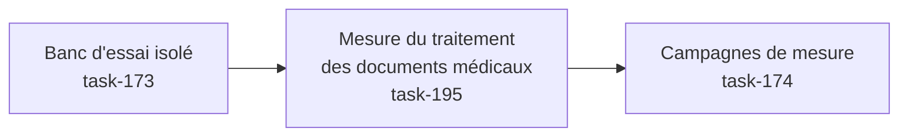

# E015 — Tests de charge de la messagerie

> **Statut** : 🟢 Fonctionnellement complet — intégration en attente
> **Modèle** : task-driven
> **Version** : 1.3
> **Auteur** : PO forge (ADR-2026-07-25-B)
> **Audience** : PO, direction, exploitant HDS — la vue ingénierie vit dans [E015-Changelogs.md](E015-Changelogs.md)
> **Dernière mise à jour** : 2026-07-27

---

<!-- toc:start — section générée par /tech-writer ; ne pas éditer manuellement -->

## Sommaire

- [1. Vision](#1-vision)
- [2. Objectifs métier](#2-objectifs-métier)
- [3. Acteurs concernés](#3-acteurs-concernés)
- [4. Features de l'EPIC](#4-features-de-lepic)
- [5. Workflow entre Features](#5-workflow-entre-features)
- [6. Règles métier transverses](#6-règles-métier-transverses)
- [7. Contraintes et hypothèses](#7-contraintes-et-hypothèses)
- [8. Critères d'acceptation de l'EPIC](#8-critères-dacceptation-de-lepic)
- [9. Hors périmètre](#9-hors-périmètre)
- [10. Premiers résultats de mesure](#10-premiers-résultats-de-mesure)
- [État de couverture (2026-07-27)](#état-de-couverture-2026-07-27)
- [Synthèse fonctionnelle des changelogs](#synthèse-fonctionnelle-des-changelogs)

<!-- toc:end -->

---

## 1. Vision

À mesure que de nouveaux praticiens rejoignent la plateforme, la messagerie
sécurisée doit rester aussi réactive pour mille utilisateurs que pour dix.
Cet EPIC dote la plateforme d'un **banc d'essai de charge** : un environnement
qui simule des centaines de boîtes aux lettres et de messages, sans aucune
donnée de santé réelle et sans solliciter les serveurs de messagerie MSSanté
de production, afin de **mesurer la réactivité du service et de détecter les
baisses de performance avant qu'elles n'atteignent les utilisateurs**.

---

## 2. Objectifs métier

- [ ] Objectif 1 : pouvoir vérifier, à la demande, que la messagerie tient la
      charge attendue (temps de réponse maîtrisés) sans dépendre d'un
      environnement réel ni de données patient.
- [ ] Objectif 2 : disposer d'une mesure de référence des temps de réponse,
      pour détecter toute régression de performance avant une mise en
      production.
- [ ] Objectif 3 : garantir que ce dispositif de test n'introduit **aucun
      risque** — jamais de donnée de santé, jamais activable en production.

---

## 3. Acteurs concernés

| Acteur | Rôle dans l'EPIC |
|--------|------------------|
| Direction / pilotage | Bénéficiaire : preuve que le service tient la montée en charge avant d'accueillir de nouveaux praticiens |
| Exploitant / hébergeur HDS | Bénéficiaire : anticipation du dimensionnement et de la stabilité serveur |
| Équipe technique | Réalise et exécute les campagnes de mesure, garantit l'isolement du banc |
| Médecin / secrétariat | Bénéficiaire indirect : une messagerie qui reste fluide quand la plateforme grandit |

---

## 4. Features de l'EPIC

> Le bilan d'avancement par feature (statut, couverture, tasks contributives)
> est consigné en fin de document, dans la section *État de couverture*.

| Fonctionnalité | Ce que l'équipe peut faire | Tasks | Statut |
|---|---|---|---|
| Banc d'essai isolé | Simuler des centaines de boîtes et de messages fictifs, en lieu et place des serveurs de messagerie réels, avec une latence réseau réaliste — sans aucune donnée de santé | task-173 | 🟢 Livré |
| Mesure du traitement des documents médicaux | Mesurer le parcours complet d'un message porteur d'un compte-rendu : réception, ouverture de la pièce jointe, extraction du document médical et du résultat de biologie associé | task-195 | 🟡 Livré, en attente d'intégration |
| Campagnes de mesure | Rejouer six usages types sous charge — consulter ses dossiers, lire, rechercher, envoyer, extraire les documents médicaux d'un compte-rendu, et un profil mêlant les cinq — puis lire les temps de réponse sur le tableau de bord de supervision, avec un rapport par campagne et une mesure de référence opposable | task-174 | 🟡 Livré, en attente d'intégration |
| Interrupteurs de fonctionnalités résilients | Garantir que les fonctions pilotées par interrupteur (dont l'analyse des comptes-rendus) restent dans leur dernier état connu si le service d'interrupteurs faiblit, au lieu de se désactiver silencieusement — avec une alerte d'exploitation quand cela survient | task-199 | 🟡 Livré, en attente d'intégration |
| Passage à l'échelle des connexions | Permettre au service de servir 1000 praticiens sans que le nombre de connexions à la base de données ne devienne le plafond — via un multiplexeur de connexions, validé d'abord sur le banc | task-200 | 🟡 Livré, en attente d'intégration |

---

## 5. Workflow entre Features

Le banc d'essai doit exister avant les campagnes de mesure : on met d'abord en
place l'environnement simulé (boîtes, messages, latence réaliste), puis on
exécute les scénarios de charge qui s'appuient dessus.

Entre les deux s'ajoute une étape de fidélité indispensable : le banc doit
reproduire **exactement** la manière dont la messagerie ouvre les pièces jointes
d'un message reçu. Le premier environnement simulé restituait correctement les
boîtes, les dossiers et les messages, mais échouait à livrer une pièce jointe
volumineuse morceau par morceau — c'est pourtant ainsi que la messagerie procède
en fonctionnement réel. Résultat : l'extraction des documents médicaux ne
s'exécutait jamais sur le banc, et les campagnes de mesure n'auraient mesuré que
la navigation, en laissant de côté le traitement le plus coûteux. Le serveur de
messagerie du banc a donc été remplacé par un logiciel de référence, fidèle sur
ce point (task-195). Les campagnes de mesure portent désormais sur la chaîne
complète, telle que le praticien la sollicite.

La dernière étape outille la mesure elle-même (task-174) : chaque usage type est
rejoué à la demande, avec un nombre de praticiens simulés et une durée
paramétrables, et chaque campagne s'achève sur un verdict. Les temps de réponse
attendus sont inscrits dans le dispositif : une campagne qui passe sous la cible
est déclarée en échec, sans interprétation. Les mesures s'affichent sur le
tableau de bord de supervision déjà en place, à côté de la consommation du
serveur, ce qui permet de rapprocher un ralentissement ressenti d'une cause
serveur observée au même instant.

---

## 6. Règles métier transverses

| Règle | Description | Statut |
|---|---|---|
| Isolement total des données | Le banc n'utilise **que** des données synthétiques : aucune donnée de santé, aucune identité patient réelle, aucun contenu médical | ✅ Respecté (task-173) |
| Jamais en production | Le dispositif de test est désactivé par défaut et **techniquement bloqué** en environnement de production | ✅ Respecté (task-173) |
| Neutralité du produit | Le banc ne modifie pas l'application livrée aux praticiens : il agit uniquement par configuration et données de test | ✅ Respecté (task-173) |
| Fidélité de la mesure | Le banc doit solliciter la messagerie exactement comme un serveur réel : c'est l'environnement de test qui s'aligne sur le produit, jamais le produit qui s'adapte à l'outil de mesure | ✅ Respecté (task-195) |
| Verdict automatique, pas d'interprétation | Les temps de réponse attendus sont inscrits dans le dispositif de mesure : une campagne qui passe sous la cible est déclarée en échec d'elle-même, sans lecture humaine des chiffres | ✅ Respecté (task-174) |
| Mesure de référence opposable | Chaque campagne se compare à une mesure de référence datée et conservée avec le produit, pour distinguer une variation normale d'une régression | ✅ Respecté (task-174) |

---

## 7. Contraintes et hypothèses

- Le banc s'exécute en local ou en intégration continue, jamais sur un
  environnement hébergeant des données de santé (HDS).
- Les mesures obtenues valent pour l'environnement du banc : elles renseignent
  les tendances et les régressions, pas les chiffres absolus d'un déploiement
  de production.

---

## 8. Critères d'acceptation de l'EPIC

- [x] L'ensemble des features de l'EPIC est livré et vérifié.
- [x] Le banc d'essai fonctionne de bout en bout sans données réelles (task-173).
- [x] Le banc exerce réellement la réception d'un compte-rendu et l'extraction du
      document médical qu'il contient (task-195).
- [x] Une mesure de référence des temps de réponse est établie et documentée
      (task-174).

---

## 9. Hors périmètre

- Les tests de charge sur les environnements déployés ou hébergeant des
  données réelles.
- L'optimisation des performances elles-mêmes (objet de l'EPIC E011) — E015
  fournit l'instrument de mesure, pas les optimisations.
- La simulation du comportement propre des serveurs MSSanté réels (quotas,
  bannissements) : seul le réseau est approché.

---

## 10. Premiers résultats de mesure

La première campagne de référence a été conduite le 25 juillet 2026 sur le banc
d'essai, avec dix praticiens simulés disposant chacun de dix messages porteurs
d'un compte-rendu, sous une latence réseau représentative d'un serveur MSSanté
distant. Ces chiffres valent pour un poste de développement : ils donnent des
ordres de grandeur et une référence de comparaison, pas les temps d'un
déploiement de production.

### Temps de réponse observés

| Action du praticien | Temps de réponse courant |
|---|---|
| Afficher la liste des dossiers de sa boîte | environ 15 millisecondes |
| Afficher une liste de cinq messages | environ 19 millisecondes |
| Ouvrir le contenu d'un message | environ 8 millisecondes |
| Rechercher dans ses messages | environ 180 millisecondes |
| Envoyer un message sécurisé | environ 1,1 seconde |
| Extraire les documents médicaux d'un lot de cinq comptes-rendus | environ 3,6 secondes |

Sur un profil composite mêlant ces usages, la messagerie a traité **5 832
demandes en deux minutes, soit 46 par seconde, sans une seule erreur**.

La première connexion à une boîte est celle qui paie la latence du réseau : le
dialogue avec le serveur de messagerie demande sept échanges successifs, si bien
que 100 millisecondes de latence en ajoutent environ 700 au total. Les
consultations suivantes réutilisent la connexion déjà ouverte et répondent en une
quinzaine de millisecondes. Sur la campagne de référence, la messagerie a
réutilisé une connexion existante 4 774 fois contre 21 ouvertures nouvelles — le
mécanisme de réutilisation fonctionne et c'est lui qui explique la réactivité en
usage courant.

### Combien d'actions un praticien peut-il enchaîner ?

La messagerie protège le service en plafonnant chaque praticien à **100 demandes
par tranche de 10 secondes**. Au-delà, les demandes excédentaires sont **refusées
immédiatement** : il n'y a pas de file d'attente. C'est un réglage de la
plateforme livrée, pas une particularité du banc d'essai.

La tranche de 10 secondes est **fixe** et non glissante : elle repart à zéro à
intervalle régulier. Un praticien dont les actions arrivent par à-coups peut donc
être freiné avant d'atteindre le rythme nominal de dix actions par seconde — les
premiers refus ont été observés dès **huit actions par seconde** en rythme
soutenu. L'usage humain courant — consulter, lire, répondre, envoyer — reste très
loin de ce plafond, qui vise les enchaînements automatisés.

### La campagne à grande échelle : 200 praticiens (27 juillet 2026)

La campagne « à très grande volumétrie » annoncée à la version 1.2 a été
conduite : **200 praticiens simulés, 100 messages chacun, cinq minutes de
charge soutenue**. Verdict final : **280 355 demandes traitées à 915 par
seconde, 0,02 % d'erreurs**, temps de réponse courants tenus (dossiers en
29 millisecondes, extraction des documents médicaux d'un lot de cinq en
2,3 secondes), et la vérification d'étanchéité confirmée — **aucune boîte n'a
jamais reçu le message d'un autre praticien**, y compris pendant les pannes
provoquées par la montée en charge.

Ce résultat n'a pas été obtenu du premier coup, et c'est là toute la valeur du
banc : trois limites d'infrastructure, invisibles à dix praticiens, ont cédé
l'une après l'autre à deux cents — chacune a été identifiée, corrigée et
documentée à l'attention de l'équipe système (mémoire de la base de données,
plafond de connexions, comportement du poste sous tempête de connexions). Les
règles de dimensionnement qui en résultent, jusqu'au palier 1000 praticiens,
sont consignées dans le dossier DevOps.

La campagne a aussi révélé une fragilité de la plateforme elle-même : sous
charge, le service d'interrupteurs de fonctionnalités ne suivait plus, et
l'analyse des comptes-rendus s'est désactivée **silencieusement** — sans
erreur visible, ni pour le praticien, ni pour l'exploitant. C'est l'origine
directe de la feature « Interrupteurs de fonctionnalités résilients »
(task-199) et du chantier « Passage à l'échelle des connexions » (task-200).

### Deux mesures à reprendre

- **L'envoi de message.** Les boîtes du banc ne disposent pas de dossier
  « Éléments envoyés » : la copie du message expédié ne peut pas y être archivée,
  et le temps mesuré pour un envoi intègre cette tentative infructueuse. Le
  message part bien et le praticien n'est pas affecté ; la mesure sera reprise
  quand le banc fournira ce dossier.
- **La recherche.** L'index de recherche du banc est incomplet : les documents
  les plus longs n'y sont pas encore référencés. Le temps mesuré est donc plus
  favorable que la réalité et sera repris une fois cette limite levée.

---

## État de couverture (2026-07-27)

| Feature | Statut | Couverture | Tasks contributives |
|---|---|---|---|
| Banc d'essai isolé | 🟢 Livré | Environnement simulé + vérification bout-en-bout en place | task-173 |
| Mesure du traitement des documents médicaux | 🟡 Livré, en attente d'intégration | Vérifié sur un lot de messages porteurs de comptes-rendus : 4 messages sur 5 aboutissent à un document médical et un résultat de biologie exploitables ; le 5ᵉ ne portait pas de document exploitable dans le jeu de test | task-195 |
| Campagnes de mesure | 🟡 Livré, en attente d'intégration | Six usages types rejouables à la demande, verdict automatique sur les temps de réponse attendus, remontée sur le tableau de bord de supervision, rapport par campagne et mesure de référence datée ; campagne à grande échelle conduite (200 praticiens, verte) ; deux mesures à reprendre (envoi, recherche) | task-174 |
| Interrupteurs de fonctionnalités résilients | 🟡 Livré, en attente d'intégration | Dernier état connu servi quand le service d'interrupteurs est injoignable, repli déclaré par interrupteur, alerte d'exploitation dédiée, une seule ligne de journal par fenêtre au lieu d'une par échec ; 10 tests dédiés ; vérification finale sur banc au plan de test manuel | task-199 |
| Passage à l'échelle des connexions | 🟡 Livré, en attente d'intégration | Multiplexeur de connexions intégré au banc, et séparation des deux usages de la base : le trafic courant passe par le multiplexeur, la création d'un nouveau dossier praticien reste en direct — de sorte qu'un multiplexeur saturé n'empêche jamais l'arrivée d'un praticien. Compatibilité établie par mesure : 40 demandes simultanées absorbées par 3 connexions réelles au lieu de 40 ; l'analyse sémantique des comptes-rendus (recherche par similarité) fonctionne à travers le multiplexeur. Hors banc, aucun changement de comportement. **Reste dû** : la campagne comparative 200 praticiens à travers le multiplexeur, qui seule permettra de conclure sur la tenue en charge | task-200 |

**Couverture EPIC consolidée : 5 features livrées sur 5** (les cinq attendent
leur intégration). L'EPIC est **fonctionnellement complet et éprouvé à
l'échelle** : le banc est opérationnel, il mesure la chaîne complète de
traitement des documents médicaux, les campagnes de mesure sont outillées avec
une référence opposable, et la campagne à grande volumétrie (200 praticiens) a
été conduite avec succès — en produisant au passage les règles de dimensionnement
de l'infrastructure jusqu'au palier 1000 praticiens et deux chantiers de
robustesse, tous deux livrés (task-199, task-200).

Deux réserves à porter au bilan, sans quoi il serait trompeur :

- deux mesures restent à reprendre — l'envoi et la recherche, pour les raisons
  exposées au chapitre *Premiers résultats de mesure* ;
- le passage à l'échelle des connexions est **établi comme compatible, pas
  encore comme performant** : la brique est livrée et vérifiée
  fonctionnellement, mais la campagne comparative qui doit prouver l'absence de
  dégradation des temps de réponse n'a pas encore été conduite. Le palier 1000
  praticiens n'est donc pas encore déverrouillé.

---

## Synthèse fonctionnelle des changelogs

**Technique / observabilité** (sans impact utilisateur direct)

- v1.0 — Mise en place d'un banc d'essai de charge isolé pour la messagerie :
  simulation de boîtes et de messages fictifs en lieu et place des serveurs
  réels, latence réseau réaliste, activation opt-in jamais disponible en
  production, aucune donnée de santé. Vérification automatisée de bout en bout
  du parcours de messagerie sur cet environnement simulé. (task-173)
- v1.1 — Le banc mesure désormais la chaîne complète : la réception d'un message
  porteur d'un compte-rendu, l'ouverture de sa pièce jointe et l'extraction du
  document médical et du résultat de biologie s'exécutent réellement sur
  l'environnement simulé, ce qui était impossible auparavant. Le stockage des
  boîtes de test sur disque lève par ailleurs la limite de volumétrie qui bornait
  le banc, ouvrant la voie à des campagnes de grande ampleur. (task-195)
- v1.2 — Les campagnes de mesure sont outillées : six usages types (consulter ses
  dossiers, lire, rechercher, envoyer, extraire les documents médicaux d'un
  compte-rendu, et un profil mêlant les cinq) se rejouent à la demande, avec un
  nombre de praticiens simulés et une durée paramétrables. Les temps de réponse
  attendus sont inscrits dans le dispositif, qui déclare lui-même une campagne en
  échec lorsqu'elle passe sous la cible, et les mesures s'affichent sur le tableau
  de bord de supervision à côté de la consommation du serveur. Une mesure de
  référence datée est conservée avec le produit comme garde anti-régression.
  (task-174)

- v1.3 — Les fonctions pilotées par interrupteur (dont l'analyse des
  comptes-rendus) ne dépendent plus d'un appel réseau à chaque évaluation : le
  service conserve un état local, rafraîchi périodiquement. Si le service
  d'interrupteurs devient injoignable, le dernier état connu continue de
  s'appliquer, une alerte d'exploitation est levée, et le journal ne reçoit
  qu'une ligne par minute au lieu d'une par échec. (task-199)

- v1.4 — Un multiplexeur de connexions est intégré au banc, en réponse au
  plafond que la campagne à grande échelle avait mis au jour. Deux usages de la
  base sont désormais distingués : le trafic courant passe par le multiplexeur,
  tandis que la création du dossier d'un nouveau praticien reste en accès
  direct — un multiplexeur saturé ou arrêté ne peut donc jamais empêcher
  l'arrivée d'un praticien. Vérifié par mesure : 40 demandes simultanées sont
  absorbées par 3 connexions réelles au lieu de 40, et l'analyse sémantique des
  comptes-rendus continue de fonctionner à travers le multiplexeur — c'était le
  point d'incertitude technique de l'étude. Hors banc, aucun changement de
  comportement. La campagne comparative qui doit prouver l'absence de
  dégradation des temps de réponse reste à conduire. (task-200)

**Ce que la mesure a appris sur le service**

- v1.2 — La messagerie plafonne chaque praticien à 100 demandes par tranche de
  10 secondes, sans file d'attente : au-delà, la demande est refusée
  immédiatement. La tranche étant fixe, un enchaînement par à-coups peut déclencher
  ce refus dès huit actions par seconde, en deçà du rythme nominal. L'usage humain
  courant en reste très éloigné. (task-174)
- v1.3 — À 200 praticiens simulés, la campagne à grande échelle a tenu **915
  demandes par seconde pendant cinq minutes avec 0,02 % d'erreurs** et une
  étanchéité parfaite entre boîtes. Elle a établi que le nombre de connexions à
  la base de données croît avec le **nombre de praticiens équipés**, pas avec le
  trafic — c'est la donnée qui dimensionne l'infrastructure, consignée avec les
  règles de calcul jusqu'au palier 1000 praticiens dans le dossier DevOps. Elle
  a aussi révélé que le service d'interrupteurs de fonctionnalités cédait sous
  charge en désactivant silencieusement l'analyse des comptes-rendus — corrigé
  par la task-199. (campagne du 2026-07-27)

---

*Documentation vivante de l'EPIC E015 — vue produit. Détails d'ingénierie dans [E015-Changelogs.md](E015-Changelogs.md).*
