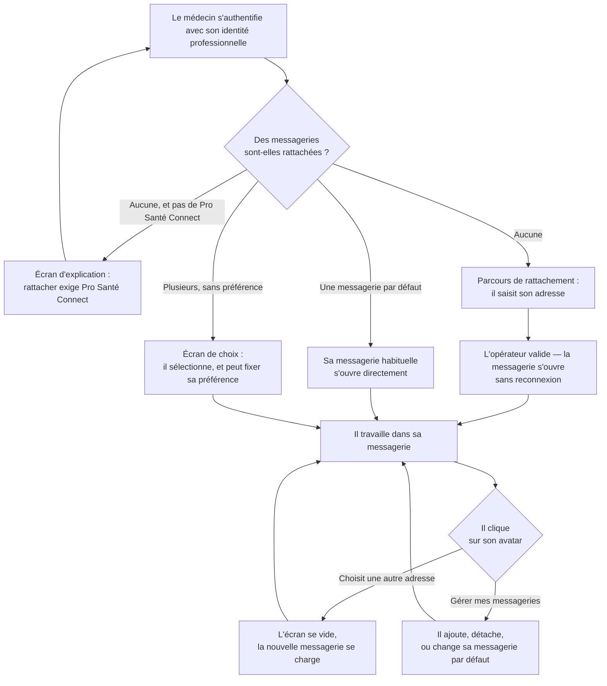

# E016 — Socle multi-tenant : registre des tenants, comptes multi-messageries et journal d'audit mutualisé

> **Statut** : 🟡 En cours
> **Modèle** : task-driven
> **Version** : 1.12
> **Auteur** : PO forge
> **Audience** : PO, médecin, direction produit, conformité — la vue ingénierie vit dans [E016-Changelogs.md](E016-Changelogs.md)
> **Dernière mise à jour** : 2026-09-16

---

<!-- toc:start — section générée par /tech-writer ; ne pas éditer manuellement -->

## Sommaire

- [1. Vision](#1-vision)
- [2. Objectifs métier](#2-objectifs-métier)
- [3. Acteurs concernés](#3-acteurs-concernés)
- [4. Features de l'EPIC](#4-features-de-lepic)
- [5. Workflow entre Features](#5-workflow-entre-features)
- [6. Règles métier transverses](#6-règles-métier-transverses)
- [7. Contraintes et hypothèses](#7-contraintes-et-hypothèses)
- [8. Critères d'acceptation de l'EPIC](#8-critères-dacceptation-de-lepic)
- [9. Hors périmètre](#9-hors-périmètre)
- [État de couverture (2026-09-16)](#état-de-couverture-2026-09-16)
- [Synthèse fonctionnelle des changelogs](#synthèse-fonctionnelle-des-changelogs)

<!-- toc:end -->

---

## 1. Vision

Un médecin n'a pas toujours une seule adresse de messagerie sécurisée de santé.
Il peut en détenir plusieurs — une personnelle, une au nom de sa structure, parfois
chez des opérateurs différents — et toutes lui appartiennent au titre de la même
identité professionnelle. Jusqu'ici, la plateforme n'en connaissait qu'une : pour
en changer, il fallait se déconnecter, se reconnecter, et reconfigurer.

Cet EPIC fait entrer le multi-messagerie dans le produit. Le médecin s'authentifie
**une fois** avec sa carte ou son application d'identité professionnelle, et
retrouve **toutes** les messageries qui relèvent de cette identité. Il passe de
l'une à l'autre d'un clic sur son avatar, comme on change de compte dans une
messagerie grand public — sans jamais se réauthentifier, et sans que rien d'une
messagerie ne déborde sur l'autre.

En arrière-plan, le même chantier dote la plateforme de ce qui lui manquait pour
tenir ses engagements de conservation : la capacité de savoir quels comptes
existent, lesquels sont dormants, et d'appliquer les durées d'effacement à tous —
y compris à ceux qui ne se connectent plus. Et il remet la traçabilité des accès
aux données de santé sur une assise qui tient quand le nombre de praticiens
augmente.

---

## 2. Objectifs métier

- [ ] Un médecin peut rattacher plusieurs messageries sécurisées à son compte unique
- [ ] Il passe de l'une à l'autre sans se déconnecter ni se réauthentifier
- [ ] Aucune donnée d'une messagerie n'est visible depuis le contexte d'une autre
- [ ] Le premier rattachement se fait dans le parcours d'entrée, sans reconnexion
- [ ] Les durées de conservation s'appliquent à tous les comptes, dormants compris
- [ ] La traçabilité des accès reste consultable et tenable à l'échelle du parc
- [ ] L'application transmise au poste du praticien s'allège de ce qui ne lui sert pas

---

## 3. Acteurs concernés

| Acteur | Rôle dans l'EPIC |
|--------|------------------|
| Médecin généraliste | Détient une ou plusieurs messageries sécurisées ; les rattache, les ouvre, passe de l'une à l'autre, en détache |
| Opérateur de messagerie sécurisée | **Seule autorité** du rattachement : une messagerie n'est ajoutée que si l'opérateur accepte le médecin sur cette boîte |
| Structure d'exercice | Détentrice des adresses organisationnelles, partagées par plusieurs praticiens |
| Délégué à la protection des données | Destinataire des garanties de cloisonnement et de conservation |
| Exploitant | Suit l'état du parc, la dormance et l'application des durées d'effacement |

---

## 4. Features de l'EPIC

> Le bilan d'avancement par feature (statut, couverture, tasks contributives) est
> consigné en fin de document, dans la section *État de couverture*.

| Fonctionnalité | Ce que le praticien peut faire | Tasks | Statut |
|---|---|---|---|
| **Plusieurs messageries, une seule connexion** | Retrouver, après une authentification unique, toutes les messageries qui relèvent de son identité professionnelle | task-303, task-304, task-308 | ✅ Livrée |
| **Changer de messagerie en direct** | Cliquer sur son avatar et ouvrir une autre de ses messageries : l'écran se vide et se recharge sur la nouvelle boîte, sans reconnexion | task-304 | ✅ Livrée |
| **Rattacher sa première messagerie** | Entrer son adresse dès le premier accès et travailler immédiatement, sans se déconnecter ni se reconnecter — l'opérateur de messagerie vérifie l'accès avant que le rattachement n'aboutisse | task-304, task-308 | ✅ Livrée |
| **Gérer ses messageries** | Ajouter une messagerie, en détacher une, la **rattacher à nouveau**, désigner celle qui s'ouvre par défaut, comprendre pourquoi l'une est indisponible — et, en détachant la **dernière**, être déconnecté proprement au lieu de rester enfermé | task-304, task-309, task-310, task-312, task-313, task-314 | 🟡 Complète en code — écran **atteignable** (task-309), détachement **sans impasse** (task-312, task-313) et **sans connexion laissée ouverte chez l'opérateur** (task-310) : **mergés**. Une ligne détachée n'offre plus que « Rattacher » (task-314), en attente de merge |
| **Conservation appliquée à tous les comptes** | Être assuré que les durées d'effacement s'appliquent aussi aux comptes qui ne servent plus, y compris à ceux d'un praticien qui a quitté le service | task-299, task-312 | ✅ Livrée — l'effacement à échéance **s'exécute** depuis task-312 (**mergée**) |
| **Traçabilité des accès à l'échelle du parc** | Consulter l'historique de ses propres accès — et les trier — sans que la croissance du parc n'en dégrade la tenue | task-300, task-312 | ✅ Livrée — écriture et retrait de l'historique hérité **mergés** |
| **Accès des équipes sécurité à la traçabilité** | *(indisponible — en attente d'arbitrage : voir §7)* | — | ⛔ Bloquée |
| **Réactivité vérifiée en multi-messagerie** | *(abandonnée — décision humaine du 2026-09-15 : l'outil de mesure existe, la campagne dédiée n'est pas poursuivie)* | task-311 | ⛔ Abandonnée |
| **Application allégée au poste** | Recevoir une application débarrassée de composants qui ne lui servaient pas | task-305 | ✅ Livrée |

---

## 5. Workflow entre Features

Le parcours du médecin, de la connexion au changement de messagerie :

Deux points structurent ce parcours :

- **Le choix à la connexion dépend d'une préférence, pas d'un réglage local.** La
  messagerie par défaut suit le médecin d'un poste à l'autre ; s'il n'en a pas
  désigné, l'écran de choix revient — c'est là qu'il la fixe.
- **Le changement de messagerie est une rupture nette.** Tout ce qui était affiché
  disparaît avant que la nouvelle messagerie ne se charge : messages, tableau de
  bord, dossiers patients, signature. Rien ne subsiste d'une boîte à l'autre.
- **Un compte sans messagerie n'est pas un compte en panne.** Depuis task-304, le
  médecin qui se connecte sans qu'aucune messagerie ne lui soit rattachée voit un
  écran qui l'explique et propose la seule action utile — et non un blocage. S'il
  s'est connecté sans Pro Santé Connect, l'écran le dit sans lui offrir un
  formulaire qui échouerait de toute façon : c'est l'opérateur de messagerie qui
  valide le rattachement, et il exige cette identité.
- **Hors ligne, le médecin lit ses messages.** Sans Pro Santé Connect, sa messagerie
  habituelle s'ouvre quand même, directement, et un bandeau permanent annonce la
  lecture seule dès le premier écran. Écrire, répondre ou classer sont visiblement
  désactivés — jamais masqués, pour qu'il sache que la fonction existe et pourquoi
  elle ne répond pas.

---

## 6. Règles métier transverses

| # | Règle | Statut |
|---|---|---|
| RG-1 | **L'opérateur de messagerie est seul juge du rattachement.** Une messagerie n'est ajoutée au compte que si l'opérateur accepte le médecin sur cette boîte. La plateforme n'accorde aucun accès de sa propre initiative | ✅ Implémenté (task-308) |
| RG-2 | **Le changement de messagerie reste dans la même identité professionnelle.** Le médecin ne peut passer qu'entre des messageries relevant de l'identité avec laquelle il s'est authentifié | ✅ Implémenté (task-303) |
| RG-3 | **Aucune donnée ne traverse une bascule.** Messages, dossiers patients, brouillons, signature et notifications de la messagerie quittée disparaissent avant que la suivante ne s'affiche | ✅ Implémenté (task-304) |
| RG-4 | **Une adresse de structure reste cloisonnée par praticien.** Deux médecins partageant la même adresse organisationnelle ne voient ni les rattachements, ni l'historique d'accès l'un de l'autre | ✅ Implémenté (task-300) — et le cloisonnement est désormais **tenu par la base elle-même**, plus par un filtre applicatif (task-312) |
| RG-5 | **Détacher une messagerie n'efface rien.** Le détachement retire l'accès ; les données restent soumises aux durées de conservation en vigueur | ✅ Implémenté (task-303) |
| RG-6 | **Les durées de conservation s'appliquent à tous les comptes.** Un compte qui ne sert plus est purgé à échéance comme les autres — la dormance ne le soustrait pas à la règle | ✅ Implémenté (task-299) — et **réellement exécuté** depuis task-312, qui a branché la purge du journal mutualisé |
| RG-7 | **Les changements d'accès sont tracés.** Rattacher, détacher, changer de messagerie par défaut, ouvrir et fermer une session de messagerie laissent une trace consultable | ✅ Implémenté (task-303) — chaque trace désigne la messagerie **concernée** et non celle qui était ouverte au moment du geste (task-312) |
| RG-8 | **La consultation de l'historique reste strictement personnelle.** Un médecin ne voit que ses propres accès ; aucun accès transverse n'est ouvert par cet EPIC | ✅ Implémenté (task-300) |

---

## 7. Contraintes et hypothèses

- **Un arbitrage est en attente** sur l'accès des équipes d'exploitation et de
  sécurité à l'historique des accès. Le produit ne dispose aujourd'hui d'aucun
  mécanisme de rôles : ouvrir cet accès sans en créer un le rendrait disponible à
  tout utilisateur authentifié, sur un historique contenant des données de santé de
  l'ensemble du parc. La question est ouverte et documentée ; aucune fonctionnalité
  ne sera livrée sur ce point avant réponse.
- **La mutualisation de l'historique des accès a été validée** au titre de la
  protection des données (2026-09-13). L'analyse d'impact doit être mise à jour en
  conséquence : nouvelle base porteuse de données de santé, mesures de cloisonnement,
  effacement planifié.
- **Le mode de panne devient global** sur la traçabilité : une indisponibilité
  ralentit l'ensemble des praticiens au lieu d'un seul. Un tampon absorbe trois
  heures d'indisponibilité ; au-delà, l'action tracée est refusée plutôt que perdue.
- **Adresses organisationnelles** : une même adresse peut relever de plusieurs
  praticiens. Chacun en a sa propre vue, cloisonnée.
- **Hypothèse produit** : le médecin veut choisir sa messagerie, pas toutes les voir
  fusionnées. Une boîte de réception unifiée n'est pas l'objet de cet EPIC.

---

## 8. Critères d'acceptation de l'EPIC

- [ ] Toutes les fonctionnalités du §4 sont livrées et validées
- [ ] Un médecin disposant de deux messageries chez deux opérateurs les rattache et passe de l'une à l'autre sans se réauthentifier
- [ ] Après un changement de messagerie, aucune donnée de la messagerie précédente n'est visible
- [ ] Un médecin qui arrive sans messagerie en rattache une et travaille immédiatement, sans reconnexion
- [ ] La messagerie par défaut le suit d'un poste à l'autre
- [ ] Un médecin ne voit jamais une messagerie relevant d'une autre identité professionnelle
- [ ] Les durées de conservation s'appliquent aux comptes dormants
- [ ] La réactivité du service est mesurée avec plusieurs messageries par praticien et reste dans les objectifs

---

## 9. Hors périmètre

- **La boîte de réception unifiée** (voir les messages de toutes ses messageries
  dans un même écran) : le médecin choisit une messagerie à la fois. Cet EPIC rend
  la fusion techniquement possible, il ne la livre pas.
- **Le rapprochement des dossiers patients entre messageries** : un même patient vu
  depuis deux messageries du même médecin reste deux dossiers distincts.
- **L'accès des équipes sécurité à l'historique** : en attente d'arbitrage (§7).
- **La suppression des données d'un praticien qui quitte le service** : la dormance
  déclenche l'application des durées de conservation, elle ne crée aucune règle de
  suppression nouvelle. La conservation du dossier médical relève d'un arbitrage
  distinct.

---

## État de couverture (2026-09-16)

| Feature | Statut | Couverture | Tasks contributives |
|---|---|---|---|
| Plusieurs messageries, une seule connexion | ✅ Livrée | 100 % | task-303, task-304, task-308 (**mergées**) |
| Changer de messagerie en direct | ✅ Livrée | 100 % | task-304 (**mergée**) |
| Rattacher sa première messagerie | ✅ Livrée | 100 % | task-304, task-308 (**mergées**) |
| Gérer ses messageries | 🟡 Complète en code | 90 % | task-304, task-309, task-310, task-312, task-313 (**mergées**) + task-314 (en attente de merge) |
| Conservation appliquée à tous les comptes | ✅ Livrée | 100 % | task-299, task-312 (**mergées**) |
| Traçabilité des accès à l'échelle du parc | ✅ Livrée | 100 % | task-300, task-312 (**mergées**) |
| Accès des équipes sécurité à la traçabilité | ⛔ Bloquée | 0 % | — |
| Réactivité vérifiée en multi-messagerie | ⛔ Abandonnée | — | task-311 (**mergée** — outil de mesure réparé) |
| Application allégée au poste | ✅ Livrée | 100 % | task-305 (**mergée**) |

**Couverture EPIC consolidée : 86 %** — 6 fonctionnalités livrées sur les 8 encore au
périmètre, 1 complète en code et en attente de merge, 1 bloquée en attente d'arbitrage.

Au 2026-09-16, tout ce qui précède task-314 est **mergé**. « Gérer ses messageries »
reste la seule ligne ouverte : elle attend le merge de task-314, qui achève l'écran en
retirant d'une ligne détachée les deux actions qui n'avaient pas de sens et en lui
rendant celle qu'on y cherchait — **« Rattacher »**.
La 9ᵉ, « Réactivité vérifiée en multi-messagerie », est **sortie du périmètre** le
2026-09-15 et n'entre plus dans le calcul.
La ligne multi-messageries est **livrée de bout en bout et mergée** : le registre, la
sélection validée par l'opérateur, et les écrans sur les trois applications.

> **Ce que task-312 change, et pourquoi deux lignes montent à 90 % sans être livrées.**
> L'historique des accès vivait jusqu'ici à **deux endroits** : la base commune pour les
> traces récentes, et une table par praticien pour les anciennes. Ce partage devait être
> transitoire — une reprise devait recopier l'ancien vers le nouveau, puis le supprimer.
>
> Cette reprise n'a jamais eu lieu, et n'aura pas lieu : l'application n'est pas en
> service, il n'y a donc **aucun historique réel à reprendre**. task-312 atteint l'état
> visé en supprimant l'ancienne copie, plutôt qu'en la recopiant. L'historique des
> accès n'a plus qu'une source.
>
> **Le vrai gain n'est pas là.** En retirant l'ancienne table, on a découvert que
> l'**effacement à échéance ne s'exécutait jamais** sur la base commune : le mécanisme
> était écrit, enregistré, et personne ne l'appelait. Pire, l'ancien effacement n'était
> déclenché que par l'activité du praticien lui-même — un médecin ayant quitté le service
> ne le déclenchait donc **plus jamais**, et ses traces, porteuses d'identifiants de
> patients, restaient indéfiniment.
>
> task-312 branche cet effacement, et le rend **global** : il balaie tout l'historique
> sans dépendre de qui se connecte. C'est ce que la ligne « Conservation appliquée à tous
> les comptes » promettait depuis task-299, et qui n'était pas tenu.
>
> Les 10 % manquants sur les deux lignes ne sont pas du code : c'est le **merge**, précédé
> du test humain (règle 11).

> **Un tri qui avait cessé de trier.** L'écran d'audit propose des en-têtes de colonne
> cliquables. Seule l'ancienne source les honorait : retirer celle-ci sans rapatrier le
> tri aurait laissé des en-têtes qui ne trient plus rien, **sans message d'erreur**. Le
> tri a été rapatrié à l'identique et couvert par des tests. C'est le genre de perte qu'un
> retrait produit en silence, et qu'un scan de qualité a signalé sous une forme
> trompeuse — « paramètre inutilisé ».

> **« Gérer ses messageries » remonte à 90 %.** L'écran existait et fonctionnait, mais
> **rien n'y menait** dans l'une des trois applications : le sélecteur de messagerie,
> livré par task-304, n'y était affiché nulle part, et le seul moyen d'atteindre l'écran
> était d'en saisir l'adresse à la main. Constaté au test humain du 2026-09-14,
> **corrigé par task-309** : le sélecteur est désormais affiché en haut de la
> messagerie sur les trois applications, et une entrée **« Mes messageries »** a été
> ajoutée à la barre de navigation de celle qui en possède une — juste au-dessus de
> « Paramètres » — pour que la gestion soit atteignable depuis n'importe quel écran.
> Les 10 % restants sont le **merge**, précédé du test humain (règle 11).

> **Le détachement de la dernière messagerie était une impasse — sur les trois
> applications.** L'écran permettait de détacher sa seule messagerie, puis laissait
> le praticien connecté avec une session pointant une boîte qui n'existe plus. Chaque
> action suivante échouait, **y compris celle qui sert à rattacher une nouvelle
> messagerie** : le compte n'avait plus ni messagerie, ni moyen d'en ajouter une.
>
> Constaté au test humain du 2026-09-15 sur l'une des trois applications
> (**task-312**), puis retrouvé **à l'identique** dans le code des deux autres
> (**task-313**) — même cause, écrite trois fois. L'application **déconnecte**
> désormais le praticien dans ce cas, décision humaine du même jour.
>
> Ce n'est pas qu'un choix d'ergonomie : c'est ce qui **rouvre le compte**, sans
> assouplir aucune règle de sécurité. Une fois déconnecté, plus rien ne désigne la
> messagerie supprimée, et le parcours de rattachement redevient accessible à la
> reconnexion.
>
> Deux défauts voisins ont été corrigés au passage : l'une des applications
> **rebasculait d'elle-même** vers la messagerie tout juste détachée, en se fiant à
> une liste qu'elle n'avait pas pu rafraîchir ; et le serveur **refusait l'ordre de
> déconnexion** lui-même lorsqu'aucune messagerie n'était ouverte, ce qui affichait
> une erreur au praticien au moment précis où il demandait à sortir.
>
> **Un point de conformité reste à trancher** avant merge : la trace de clôture
> écrite dans ce cas ne nomme aucun praticien, faute d'adresse à citer. Ce n'est pas
> une perte — auparavant l'opération était refusée et **aucune** trace n'était
> écrite — mais le choix entre « ne pas tracer » et « tracer sous l'identité
> professionnelle » relève de la conformité. Voir `questions/task-313.md`.

> **Une connexion restait ouverte chez l'opérateur, pour une messagerie que le
> praticien croyait avoir retirée.** Supprimer sa messagerie fermait bien la session
> côté application, mais l'ordre de fermeture partait **après** le retrait — trop tard :
> le serveur ne reconnaissait plus l'adresse et refusait l'ordre. La connexion
> subsistait donc chez l'opérateur MSSanté jusqu'à sa propre expiration, et s'y lisait
> comme une session que personne n'avait fermée.
>
> Aucune donnée n'était en jeu et rien ne cassait à l'écran : c'est une question de
> **propreté d'exploitation**, pas de sécurité. **task-310** inverse l'ordre — on ferme
> d'abord, on retire ensuite.
>
> **Deux cas étaient concernés, dont un que personne n'avait vu.** Outre le retrait
> d'une messagerie parmi plusieurs, la déconnexion livrée le 2026-09-15 au retrait de
> la **dernière** ne fermait rien non plus : l'ordre partait une fois la session déjà
> vidée, donc sans indiquer quelle connexion fermer. Il aboutissait sans effet — ce que
> les journaux techniques ont confirmé, une fermeture comptabilisée à **zéro**. La
> correction couvre les deux.
>
> Vérification menée le 2026-09-16 à la demande de l'humain, qui doutait que le défaut
> soit encore d'actualité — la déconnexion fermant normalement les connexions. Elle
> l'était : ce chemin-là n'atteignait jamais le code qui ferme.

> **Point resté ouvert.** Les **captures des écrans mobiles** ne sont toujours pas
> produites : le harnais de vérification visuelle n'est pas versionné et reste absent du
> poste. La galerie porte encore deux captures d'écrans supprimés. Voir
> `questions/task-304.md`.

---

## Synthèse fonctionnelle des changelogs

### Technique

- **L'instrument qui mesure la tenue en charge s'était éteint sans bruit — il est
  rallumé** (task-311, **mergée**). Le banc d'essai qui vérifie que le service
  tient à mille médecins était provisionné par un mécanisme automatique que le changement
  précédent a supprimé, à juste titre : il rattachait des messageries que personne n'avait
  validées. Conséquence non vue sur le moment — le banc refusait désormais **toutes** les
  requêtes, et ne mesurait plus rien. Plus grave : s'il avait continué à répondre, il
  aurait mesuré le **mauvais** organe. L'historique des accès serait retombé dans l'ancien
  fonctionnement, celui-là même dont la refonte explique 97 % des refus de connexion
  observés à mille médecins — un essai « réussi » aurait alors validé quelque chose qui
  n'est plus en service. Le banc prépare désormais son terrain lui-même, en empruntant
  exactement le chemin d'enregistrement du produit, et refuse de tourner contre autre
  chose qu'un environnement d'essai. La mesure de réactivité en multi-messagerie
  redevient possible ; elle devra **repartir d'une référence neuve**, les essais
  antérieurs à la refonte de l'historique n'étant plus comparables.
- **La plateforme sait désormais de quoi son parc est fait** (task-299) : quels comptes
  praticiens existent, quelles messageries leur sont rattachées, et quel espace de
  données isolé correspond à chaque couple. Rien n'a bougé pour le médecin — aucune
  donnée déplacée, aucune frontière d'isolation modifiée — mais trois chantiers
  jusque-là impossibles deviennent faisables : l'application des durées de
  conservation, la mise à niveau des espaces dormants, et les comptes à plusieurs
  messageries.
- **L'historique des accès cesse de dépendre de la taille du parc** (task-300, *en
  attente de merge*). Le journal était écrit dans un espace de données par praticien :
  enregistrer une centaine d'actions revenait à ouvrir une centaine de connexions, et
  cette forme expliquait à elle seule **97 %** des refus de connexion mesurés à mille
  médecins. Le journal rejoint un espace commun où une centaine d'actions s'écrivent
  d'un seul geste. Pour le praticien, rien ne change à l'écran : il consulte le même
  historique, et **ne voit toujours que le sien** — l'isolation est désormais tenue par
  la base de données elle-même plutôt que par le découpage en espaces séparés. Effet
  secondaire de conformité : les durées d'effacement peuvent enfin s'appliquer aussi
  aux comptes qui ne servent plus, ce qui n'était pas possible tant qu'aucun balayage
  d'ensemble n'existait.
- **L'historique des accès n'a plus qu'un seul endroit où vivre** (task-312, **mergée**). Il en avait deux : l'espace commun pour les traces récentes, l'espace de chaque
  médecin pour les anciennes. Ce partage devait être transitoire — une opération de reprise
  (task-301) devait recopier l'ancien vers le nouveau, puis le supprimer. **Cette reprise
  n'a jamais eu lieu et n'aura pas lieu** : le service n'est pas en exploitation, il n'y a
  donc aucun historique réel à déplacer. L'ancienne copie est retirée, et l'écran d'audit
  lit une source unique. Pour le praticien, rien ne change — sinon que le **tri par colonne
  refonctionne** : il n'était honoré que par l'ancienne source, et aurait cessé d'agir
  silencieusement.
- **La plateforme sait de nouveau quand abandonner** une trace qu'aucune base ne pourra
  jamais accepter (task-312). Le compteur de tentatives vivait dans la partie retirée :
  sans lui, une trace définitivement invalide serait revenue en boucle, indéfiniment,
  au lieu d'être signalée.
- **Le registre distingue désormais deux informations qu'il confondait** (task-308, *en
  attente de merge*) : ce qui relève du **compte de connexion** — l'identifiant, l'adresse
  de courriel, le nom d'utilisateur — et ce qui relève du **professionnel de santé** — son
  numéro RPPS et son identité Pro Santé Connect. La seconde n'est délivrée qu'au moment où
  une messagerie est rattachée, et par l'opérateur MSSanté : elle est donc enregistrée là,
  sur le rattachement, et plus sur le compte. Rien ne change à l'écran ; ce qui change,
  c'est qu'une ligne du registre ne peut plus prétendre connaître un professionnel que
  personne n'a confirmé.
- **L'application transmise au poste du praticien s'est allégée** (task-305). Des
  composants qui n'y servaient à rien — dont un client de cache réseau — y étaient
  embarqués par une dépendance devenue inutile. Ils en sont retirés, et un garde-fou
  automatique empêche leur retour. Aucun changement visible pour le médecin : le
  rendu des messages, des synthèses et des échanges avec l'assistant est identique.

### Conformité

- **Les durées de conservation s'appliquent enfin à tous les comptes** (task-299). Un
  praticien qui cessait d'utiliser le service ne déclenchait plus jamais l'effacement
  de ses données à échéance : l'effacement était déclenché par son activité, et son
  inactivité le suspendait donc indéfiniment. La plateforme sait désormais quels
  comptes existent et depuis quand chacun ne s'est plus connecté — ce qui rend
  l'échéance applicable à tous, actifs comme dormants.
- **Et cet effacement s'exécute réellement** (task-312, **mergée**). Rendre
  l'échéance *applicable* ne suffisait pas : le mécanisme d'effacement du nouveau journal
  était écrit et déclaré, mais **rien ne l'appelait jamais**. Le seul effacement qui
  tournait portait sur l'ancienne copie, et restait déclenché par l'activité du praticien
  — donc absent, précisément, pour les comptes dormants qu'il devait couvrir. Un balayage
  d'ensemble s'exécute désormais à intervalle régulier, indépendamment de qui se connecte,
  et **inscrit lui-même dans l'historique** ce qu'il a effacé et jusqu'à quelle date.
  Les traces d'accès aux données de santé restent conservées dix ans, les traces
  techniques un an, et une durée fixée à zéro vaut conservation sans limite — un verrou
  juridique l'emporte toujours sur l'effacement, y compris quand l'effacement serait plus
  économique.

### Fonctionnalités métier

- **Une messagerie détachée ne propose plus que de la rattacher** (task-314, *en attente
  de merge*). Sur la liste des messageries, une ligne détachée offrait « Définir par
  défaut » et « Supprimer ». Ni l'une ni l'autre n'avait de sens : une messagerie
  détachée ne peut pas s'ouvrir, donc pas devenir celle qui s'ouvre par défaut ; et elle
  est déjà retirée du compte, le second bouton annonçant une suppression plus définitive
  **qui n'existe pas**. Ce qui manquait, en revanche, était le geste qu'on vient y
  chercher : **rattacher à nouveau**. Il fallait jusqu'ici retaper l'adresse dans le
  formulaire du dessous — sur une ligne qui l'affiche. Le bouton « Rattacher » apparaît
  désormais à sa place, et passe par la même vérification auprès de l'opérateur MSSanté
  que tout autre rattachement. Les deux actions sans objet sont **retirées de l'écran**
  plutôt que grisées : un bouton grisé annonce encore une action.
- **La date affichée dit enfin la bonne chose** (task-314, *en attente de merge*). Une
  ligne détachée indiquait « Rattachée le … » — une information exacte, au mauvais
  endroit. Pour une messagerie détachée, la date qui compte est celle du **détachement** :
  c'est elle qui fait courir les durées de conservation, et c'est ce que le message de
  confirmation a promis au praticien. Les dates de cet écran sont par ailleurs
  **présentées lisiblement**, là où s'affichait jusqu'ici l'horodatage technique brut.
- **Une messagerie détachée n'est pas effacée, et c'est délibéré** (task-314). La
  possibilité de la retirer définitivement de la liste a été étudiée puis **écartée sur
  vérification**. La ligne détachée est le seul objet qui relie l'historique des accès à
  la messagerie qu'il concerne ; la base ne comporte aucun garde-fou qui empêcherait sa
  suppression, si bien qu'effacer la ligne aurait rendu ces traces orphelines **sans
  qu'aucune erreur ne le signale** — sur un historique soumis à six ans de conservation
  réglementaire. Conséquence assumée, à traiter séparément : tant qu'une ligne détachée
  subsiste, l'adresse qu'elle porte ne peut pas être rattachée à un autre compte.

- **Ajouter une seconde messagerie ne demande plus de connaître une adresse par cœur** (task-309, **mergée**). L'écran qui permet d'ajouter, de retirer ou de choisir sa messagerie par défaut existait déjà — mais sur l'une des trois applications, **aucun bouton n'y conduisait** : il fallait taper son adresse dans la barre du navigateur. Le sélecteur de messagerie apparaît désormais en haut de la messagerie sur les trois applications, et une entrée **« Mes messageries »** a été ajoutée à la barre de navigation de celle qui en possède une, juste au-dessus de « Paramètres ». Le praticien dispose ainsi de deux chemins : un rapide, depuis sa messagerie, et un explicite, visible de n'importe quel écran. Au passage, le bouton **« Ajouter une messagerie » devient réellement inopérant** — et non plus seulement grisé — tant que la connexion Pro Santé Connect n'est pas établie, l'opérateur devant être consulté pour tout rattachement ; consulter les messageries déjà rattachées, elle, reste possible.
- **L'écran de rattachement se déclenche enfin pour un praticien qui n'a pas encore de
  messagerie** (task-308, **mergée**). Il existait, il était écrit sur les
  trois applications — il n'était simplement jamais atteint, parce que la plateforme
  inscrivait une messagerie d'elle-même avant que la question ne soit posée. Un praticien
  qui se connecte pour la première fois voit désormais cet écran, y saisit son adresse
  MSSanté, et entre dans sa messagerie une fois l'opérateur consulté.

### Sécurité

- **Rattacher une messagerie exige désormais l'accord de l'opérateur MSSanté** (task-308,
  *en attente de merge*). Jusqu'ici, une information portée par le jeton de connexion
  suffisait à inscrire une messagerie au nom d'un praticien — sans que l'opérateur, seul
  à faire autorité sur ce qu'un professionnel peut ouvrir, ne soit jamais consulté. Le
  rattachement passe maintenant par une vérification auprès de cet opérateur, et **rien
  n'est enregistré si elle échoue**.
- **Un compte ne peut plus changer de professionnel en silence** (task-308, **mergée**). L'identité professionnelle est enregistrée sur chaque messagerie rattachée, au
  moment où l'opérateur la confirme. Présenter l'identité d'un autre professionnel sur un
  compte déjà rattaché est refusé — et détacher toutes ses messageries ne remet pas le
  compteur à zéro : le compte reste lié au professionnel qui l'a ouvert. La
  ré-association reste ce qu'elle doit être, un acte administratif, jamais un effet de
  bord d'une requête.
- **Une trace d'accès désigne enfin la bonne messagerie** (task-312, **mergée**). Rattacher, détacher ou changer de messagerie par défaut laissait une trace qui
  portait le nom de la messagerie **ouverte à l'écran** au moment du geste — pas celle sur
  laquelle il portait. Au tout premier rattachement il n'y en avait aucune ; aux suivants,
  c'était une autre. La trace désigne désormais la messagerie concernée, ce qui est la
  condition pour que l'historique serve de preuve.

---

*Document vivant, régénéré par la forge à chaque fin de cycle. La vue ingénierie —
détail des changements, décisions techniques, dette — vit dans
[E016-Changelogs.md](E016-Changelogs.md).*
