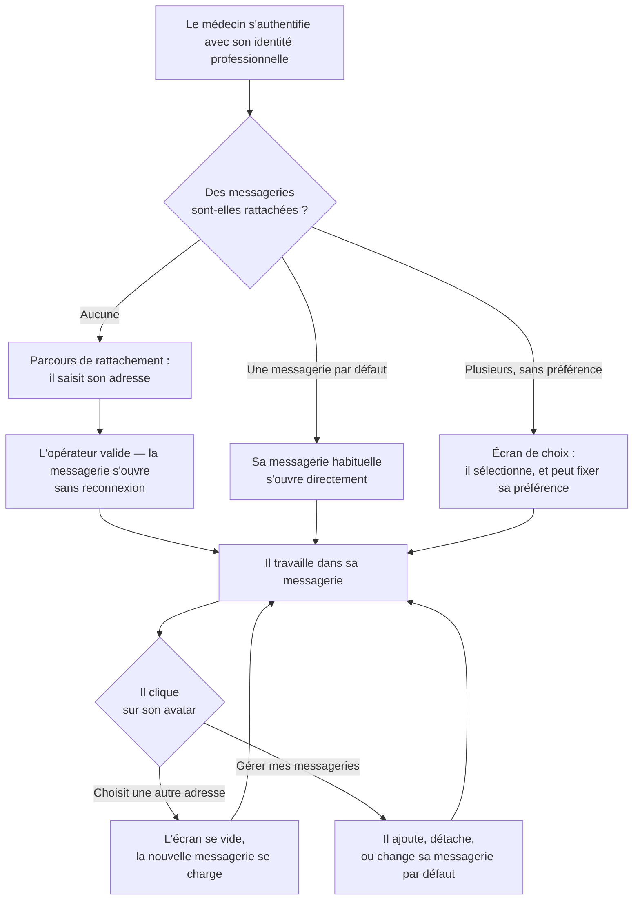

# E016 — Socle multi-tenant : registre des tenants, comptes multi-messageries et journal d'audit mutualisé

> **Statut** : 🟡 En cours
> **Modèle** : task-driven
> **Version** : 1.3
> **Auteur** : PO forge
> **Audience** : PO, médecin, direction produit, conformité — la vue ingénierie vit dans [E016-Changelogs.md](E016-Changelogs.md)
> **Dernière mise à jour** : 2026-09-13

---

<!-- toc:start — section générée par /tech-writer ; ne pas éditer manuellement -->

## Sommaire

- [1. Vision](#1-vision)
- [2. Objectifs métier](#2-objectifs-métier)
- [3. Acteurs concernés](#3-acteurs-concernés)
- [4. Features de l'EPIC](#4-features-de-lepic)
- [5. Workflow entre Features](#5-workflow-entre-features)
- [6. Règles métier transverses](#6-règles-métier-transverses)
- [7. Contraintes et hypothèses](#7-contraintes-et-hypothèses)
- [8. Critères d'acceptation de l'EPIC](#8-critères-dacceptation-de-lepic)
- [9. Hors périmètre](#9-hors-périmètre)
- [État de couverture (2026-09-13)](#état-de-couverture-2026-09-13)
- [Synthèse fonctionnelle des changelogs](#synthèse-fonctionnelle-des-changelogs)

<!-- toc:end -->

---

## 1. Vision

Un médecin n'a pas toujours une seule adresse de messagerie sécurisée de santé.
Il peut en détenir plusieurs — une personnelle, une au nom de sa structure, parfois
chez des opérateurs différents — et toutes lui appartiennent au titre de la même
identité professionnelle. Jusqu'ici, la plateforme n'en connaissait qu'une : pour
en changer, il fallait se déconnecter, se reconnecter, et reconfigurer.

Cet EPIC fait entrer le multi-messagerie dans le produit. Le médecin s'authentifie
**une fois** avec sa carte ou son application d'identité professionnelle, et
retrouve **toutes** les messageries qui relèvent de cette identité. Il passe de
l'une à l'autre d'un clic sur son avatar, comme on change de compte dans une
messagerie grand public — sans jamais se réauthentifier, et sans que rien d'une
messagerie ne déborde sur l'autre.

En arrière-plan, le même chantier dote la plateforme de ce qui lui manquait pour
tenir ses engagements de conservation : la capacité de savoir quels comptes
existent, lesquels sont dormants, et d'appliquer les durées d'effacement à tous —
y compris à ceux qui ne se connectent plus. Et il remet la traçabilité des accès
aux données de santé sur une assise qui tient quand le nombre de praticiens
augmente.

---

## 2. Objectifs métier

- [ ] Un médecin peut rattacher plusieurs messageries sécurisées à son compte unique
- [ ] Il passe de l'une à l'autre sans se déconnecter ni se réauthentifier
- [ ] Aucune donnée d'une messagerie n'est visible depuis le contexte d'une autre
- [ ] Le premier rattachement se fait dans le parcours d'entrée, sans reconnexion
- [ ] Les durées de conservation s'appliquent à tous les comptes, dormants compris
- [ ] La traçabilité des accès reste consultable et tenable à l'échelle du parc
- [ ] L'application transmise au poste du praticien s'allège de ce qui ne lui sert pas

---

## 3. Acteurs concernés

| Acteur | Rôle dans l'EPIC |
|--------|------------------|
| Médecin généraliste | Détient une ou plusieurs messageries sécurisées ; les rattache, les ouvre, passe de l'une à l'autre, en détache |
| Opérateur de messagerie sécurisée | **Seule autorité** du rattachement : une messagerie n'est ajoutée que si l'opérateur accepte le médecin sur cette boîte |
| Structure d'exercice | Détentrice des adresses organisationnelles, partagées par plusieurs praticiens |
| Délégué à la protection des données | Destinataire des garanties de cloisonnement et de conservation |
| Exploitant | Suit l'état du parc, la dormance et l'application des durées d'effacement |

---

## 4. Features de l'EPIC

> Le bilan d'avancement par feature (statut, couverture, tasks contributives) est
> consigné en fin de document, dans la section *État de couverture*.

| Fonctionnalité | Ce que le praticien peut faire | Tasks | Statut |
|---|---|---|---|
| **Plusieurs messageries, une seule connexion** | Retrouver, après une authentification unique, toutes les messageries qui relèvent de son identité professionnelle | task-303 | 🟡 Backend livré — **le médecin ne le voit pas encore** (task-304) |
| **Changer de messagerie en direct** | Cliquer sur son avatar et ouvrir une autre de ses messageries : l'écran se vide et se recharge sur la nouvelle boîte, sans reconnexion | task-304 | 🔜 À faire |
| **Rattacher sa première messagerie** | Entrer son adresse dès le premier accès et travailler immédiatement, sans se déconnecter ni se reconnecter | task-304 | 🔜 À faire |
| **Gérer ses messageries** | Ajouter une messagerie, en détacher une, désigner celle qui s'ouvre par défaut, comprendre pourquoi l'une est indisponible | task-304 | 🔜 À faire |
| **Conservation appliquée à tous les comptes** | Être assuré que les durées d'effacement s'appliquent aussi aux comptes qui ne servent plus, y compris à ceux d'un praticien qui a quitté le service | task-299 | ✅ Livrée |
| **Traçabilité des accès à l'échelle du parc** | Consulter l'historique de ses propres accès, sans que la croissance du parc n'en dégrade la tenue | task-300, task-301 | 🟡 Complète en code — écriture **mergée**, reprise de l'historique en attente de merge |
| **Accès des équipes sécurité à la traçabilité** | *(indisponible — en attente d'arbitrage : voir §7)* | — | ⛔ Bloquée |
| **Réactivité vérifiée en multi-messagerie** | Bénéficier d'un service dont la réactivité a été mesurée avec plusieurs messageries par praticien | task-306 | 🔜 À faire |
| **Application allégée au poste** | Recevoir une application débarrassée de composants qui ne lui servaient pas | task-305 | ✅ Livrée |

---

## 5. Workflow entre Features

Le parcours du médecin, de la connexion au changement de messagerie :

Deux points structurent ce parcours :

- **Le choix à la connexion dépend d'une préférence, pas d'un réglage local.** La
  messagerie par défaut suit le médecin d'un poste à l'autre ; s'il n'en a pas
  désigné, l'écran de choix revient — c'est là qu'il la fixe.
- **Le changement de messagerie est une rupture nette.** Tout ce qui était affiché
  disparaît avant que la nouvelle messagerie ne se charge : messages, tableau de
  bord, dossiers patients, signature. Rien ne subsiste d'une boîte à l'autre.

---

## 6. Règles métier transverses

| # | Règle | Statut |
|---|---|---|
| RG-1 | **L'opérateur de messagerie est seul juge du rattachement.** Une messagerie n'est ajoutée au compte que si l'opérateur accepte le médecin sur cette boîte. La plateforme n'accorde aucun accès de sa propre initiative | 🔜 À implémenter (task-303) |
| RG-2 | **Le changement de messagerie reste dans la même identité professionnelle.** Le médecin ne peut passer qu'entre des messageries relevant de l'identité avec laquelle il s'est authentifié | 🔜 À implémenter (task-303) |
| RG-3 | **Aucune donnée ne traverse une bascule.** Messages, dossiers patients, brouillons, signature et notifications de la messagerie quittée disparaissent avant que la suivante ne s'affiche | 🔜 À implémenter (task-304) |
| RG-4 | **Une adresse de structure reste cloisonnée par praticien.** Deux médecins partageant la même adresse organisationnelle ne voient ni les rattachements, ni l'historique d'accès l'un de l'autre | 🔜 À implémenter (task-300) |
| RG-5 | **Détacher une messagerie n'efface rien.** Le détachement retire l'accès ; les données restent soumises aux durées de conservation en vigueur | 🔜 À implémenter (task-303) |
| RG-6 | **Les durées de conservation s'appliquent à tous les comptes.** Un compte qui ne sert plus est purgé à échéance comme les autres — la dormance ne le soustrait pas à la règle | ✅ Implémenté (task-299) |
| RG-7 | **Les changements d'accès sont tracés.** Rattacher, détacher, changer de messagerie par défaut, ouvrir et fermer une session de messagerie laissent une trace consultable | 🔜 À implémenter (task-303) |
| RG-8 | **La consultation de l'historique reste strictement personnelle.** Un médecin ne voit que ses propres accès ; aucun accès transverse n'est ouvert par cet EPIC | 🔜 À implémenter (task-300) |

---

## 7. Contraintes et hypothèses

- **Un arbitrage est en attente** sur l'accès des équipes d'exploitation et de
  sécurité à l'historique des accès. Le produit ne dispose aujourd'hui d'aucun
  mécanisme de rôles : ouvrir cet accès sans en créer un le rendrait disponible à
  tout utilisateur authentifié, sur un historique contenant des données de santé de
  l'ensemble du parc. La question est ouverte et documentée ; aucune fonctionnalité
  ne sera livrée sur ce point avant réponse.
- **La mutualisation de l'historique des accès a été validée** au titre de la
  protection des données (2026-09-13). L'analyse d'impact doit être mise à jour en
  conséquence : nouvelle base porteuse de données de santé, mesures de cloisonnement,
  effacement planifié.
- **Le mode de panne devient global** sur la traçabilité : une indisponibilité
  ralentit l'ensemble des praticiens au lieu d'un seul. Un tampon absorbe trois
  heures d'indisponibilité ; au-delà, l'action tracée est refusée plutôt que perdue.
- **Adresses organisationnelles** : une même adresse peut relever de plusieurs
  praticiens. Chacun en a sa propre vue, cloisonnée.
- **Hypothèse produit** : le médecin veut choisir sa messagerie, pas toutes les voir
  fusionnées. Une boîte de réception unifiée n'est pas l'objet de cet EPIC.

---

## 8. Critères d'acceptation de l'EPIC

- [ ] Toutes les fonctionnalités du §4 sont livrées et validées
- [ ] Un médecin disposant de deux messageries chez deux opérateurs les rattache et passe de l'une à l'autre sans se réauthentifier
- [ ] Après un changement de messagerie, aucune donnée de la messagerie précédente n'est visible
- [ ] Un médecin qui arrive sans messagerie en rattache une et travaille immédiatement, sans reconnexion
- [ ] La messagerie par défaut le suit d'un poste à l'autre
- [ ] Un médecin ne voit jamais une messagerie relevant d'une autre identité professionnelle
- [ ] Les durées de conservation s'appliquent aux comptes dormants
- [ ] La réactivité du service est mesurée avec plusieurs messageries par praticien et reste dans les objectifs

---

## 9. Hors périmètre

- **La boîte de réception unifiée** (voir les messages de toutes ses messageries
  dans un même écran) : le médecin choisit une messagerie à la fois. Cet EPIC rend
  la fusion techniquement possible, il ne la livre pas.
- **Le rapprochement des dossiers patients entre messageries** : un même patient vu
  depuis deux messageries du même médecin reste deux dossiers distincts.
- **L'accès des équipes sécurité à l'historique** : en attente d'arbitrage (§7).
- **La suppression des données d'un praticien qui quitte le service** : la dormance
  déclenche l'application des durées de conservation, elle ne crée aucune règle de
  suppression nouvelle. La conservation du dossier médical relève d'un arbitrage
  distinct.

---

## État de couverture (2026-09-14, nuit)

| Feature | Statut | Couverture | Tasks contributives |
|---|---|---|---|
| Plusieurs messageries, une seule connexion | 🟡 Backend livré | 50 % | task-303 (PR ouverte, `awaiting-us-completion`) |
| Changer de messagerie en direct | 🔜 À faire | 0 % | task-304 |
| Rattacher sa première messagerie | 🔜 À faire | 0 % | task-304 |
| Gérer ses messageries | 🔜 À faire | 0 % | task-304 |
| Conservation appliquée à tous les comptes | ✅ Livrée | 100 % | task-299 |
| Traçabilité des accès à l'échelle du parc | 🟡 Quasi complète | 90 % | task-300 (**mergée**), task-301 (PR ouverte) |
| Accès des équipes sécurité à la traçabilité | ⛔ Bloquée | 0 % | — |
| Réactivité vérifiée en multi-messagerie | 🔜 À faire | 0 % | task-306 |
| Application allégée au poste | ✅ Livrée | 100 % | task-305 |

**Couverture EPIC consolidée : 38 %** (2 fonctionnalités livrées sur 9, 2 partielles,
1 bloquée en attente d'arbitrage, 4 à faire). Le socle est posé — la plateforme sait de
quoi son parc est fait, la ligne « traçabilité » est entièrement écrite, et le backend
multi-messageries l'est désormais aussi.

> **Pourquoi « Plusieurs messageries » est à 50 % et non à 100 %.** Tout le mécanisme
> existe côté serveur : un praticien peut rattacher plusieurs boîtes, le backend valide
> chaque sélection contre le registre et contre son identité PSC, et une bascule ferme
> proprement la session de boîte précédente. Mais **aucun écran ne le montre encore** —
> ni sélecteur, ni bascule à l'avatar, ni écran de gestion. Pour le médecin, rien n'a
> changé : c'est exactement ce que la règle 11 appelle de la plomberie, et c'est
> pourquoi la PR porte `awaiting-us-completion` au lieu d'attendre un merge. La moitié
> restante est **task-304**, et le test humain se fera sur la US assemblée.

> **Le 10 % manquant n'est pas du code.** La reprise se joue sur le parc réel, une nuit,
> sous surveillance, puis se vérifie tenant par tenant avant toute suppression. Compter
> cette fonctionnalité « livrée » avant ce passage serait confondre *écrit* et *fait*.

> **Lecture du 🟡** : la PR de task-300 est ouverte et attend le merge humain (HAG,
> règle 10). Rien n'est compté « livré » avant ce merge : c'est la seule barrière de
> validation du cycle, et l'anticiper dans un tableau d'avancement reviendrait à la
> contourner sur le papier.

---

## Synthèse fonctionnelle des changelogs

### Technique

- **La plateforme sait désormais de quoi son parc est fait** (task-299) : quels comptes
  praticiens existent, quelles messageries leur sont rattachées, et quel espace de
  données isolé correspond à chaque couple. Rien n'a bougé pour le médecin — aucune
  donnée déplacée, aucune frontière d'isolation modifiée — mais trois chantiers
  jusque-là impossibles deviennent faisables : l'application des durées de
  conservation, la mise à niveau des espaces dormants, et les comptes à plusieurs
  messageries.
- **L'historique des accès cesse de dépendre de la taille du parc** (task-300, *en
  attente de merge*). Le journal était écrit dans un espace de données par praticien :
  enregistrer une centaine d'actions revenait à ouvrir une centaine de connexions, et
  cette forme expliquait à elle seule **97 %** des refus de connexion mesurés à mille
  médecins. Le journal rejoint un espace commun où une centaine d'actions s'écrivent
  d'un seul geste. Pour le praticien, rien ne change à l'écran : il consulte le même
  historique, et **ne voit toujours que le sien** — l'isolation est désormais tenue par
  la base de données elle-même plutôt que par le découpage en espaces séparés. Effet
  secondaire de conformité : les durées d'effacement peuvent enfin s'appliquer aussi
  aux comptes qui ne servent plus, ce qui n'était pas possible tant qu'aucun balayage
  d'ensemble n'existait.
- **L'historique déjà écrit rejoint le nouveau journal, sans que le praticien voie quoi que
  ce soit** (task-301, *en attente de merge*). Les traces accumulées dans l'espace de chaque
  médecin sont recopiées vers l'espace commun, **vérifiées une à une par comptage**, puis
  seulement alors considérées comme reprises. Pendant toute l'opération, l'écran d'audit
  continue d'afficher l'historique complet — un test vérifie qu'il rend *exactement* le même
  contenu avant et après. L'ancienne copie n'est supprimée qu'après une vérification humaine
  explicite : **on ne supprime pas une preuve le jour où on la recopie.**
- **L'application transmise au poste du praticien s'est allégée** (task-305). Des
  composants qui n'y servaient à rien — dont un client de cache réseau — y étaient
  embarqués par une dépendance devenue inutile. Ils en sont retirés, et un garde-fou
  automatique empêche leur retour. Aucun changement visible pour le médecin : le
  rendu des messages, des synthèses et des échanges avec l'assistant est identique.

### Conformité

- **Les durées de conservation s'appliquent enfin à tous les comptes** (task-299). Un
  praticien qui cessait d'utiliser le service ne déclenchait plus jamais l'effacement
  de ses données à échéance : l'effacement était déclenché par son activité, et son
  inactivité le suspendait donc indéfiniment. La plateforme sait désormais quels
  comptes existent et depuis quand chacun ne s'est plus connecté — ce qui rend
  l'échéance applicable à tous, actifs comme dormants.

### Fonctionnalités métier

*Aucune entrée à ce stade.*

### Sécurité

*Aucune entrée à ce stade.*

---

*Document vivant, régénéré par la forge à chaque fin de cycle. La vue ingénierie —
détail des changements, décisions techniques, dette — vit dans
[E016-Changelogs.md](E016-Changelogs.md).*
