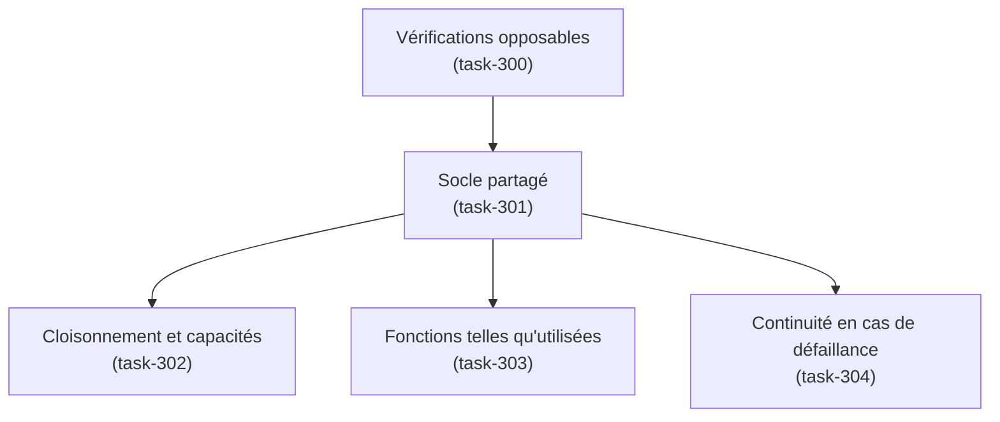

# E016 — Tests d'intégration à serveur de messagerie réel

> **Statut** : 🟡 En cours — 2 tasks livrées sur 5
> **Modèle** : task-driven
> **Version** : 1.1
> **Auteur** : PO forge (audit d'exploitation du 2026-09-11)
> **Audience** : PO, direction, exploitant HDS — la vue ingénierie vit dans [E016-Changelogs.md](E016-Changelogs.md)
> **Dernière mise à jour** : 2026-09-11

---

<!-- toc:start — section générée par /tech-writer ; ne pas éditer manuellement -->

## Sommaire

- [1. Vision](#1-vision)
- [2. Objectifs métier](#2-objectifs-métier)
- [3. Acteurs concernés](#3-acteurs-concernés)
- [4. Features de l'EPIC](#4-features-de-lepic)
- [5. Workflow entre Features](#5-workflow-entre-features)
- [6. Règles métier transverses](#6-règles-métier-transverses)
- [7. Contraintes et hypothèses](#7-contraintes-et-hypothèses)
- [8. Critères d'acceptation de l'EPIC](#8-critères-dacceptation-de-lepic)
- [9. Hors périmètre](#9-hors-périmètre)
- [État de couverture](#état-de-couverture)
- [Synthèse fonctionnelle des changelogs](#synthèse-fonctionnelle-des-changelogs)

<!-- toc:end -->

---

## 1. Vision

La messagerie sécurisée de santé rend un service que le praticien ne peut pas
vérifier lui-même : quand il ouvre un compte rendu de biologie, il fait
confiance au fait que le message affiché est bien celui que le laboratoire a
envoyé, entier, et qu'il est arrivé dans sa boîte et pas dans celle d'un
confrère.

Cette confiance repose sur une chaîne technique dont la partie la plus
délicate — le dialogue avec le serveur de messagerie — était jusqu'ici
**éprouvée presque uniquement contre des simulacres**. Les vérifications
automatiques remplaçaient le serveur par un faux serveur qui répond toujours
correctement : elles démontraient que le logiciel appelle les bonnes fonctions,
jamais qu'il obtient les bons résultats d'un vrai serveur.

L'EPIC E016 renverse cette situation. Il fait de la vérification **contre un
vrai serveur de messagerie** le mode normal, et non l'exception : un serveur
authentique est démarré à chaque vérification, on y dépose des messages dont on
connaît exactement le contenu, et on exige que le logiciel en rende compte
fidèlement — y compris quand ce serveur est lent, saturé, ou qu'il coupe la
communication.

## 2. Objectifs métier

1. **Rendre les vérifications opposables.** Une vérification qui ne s'exécute
   pas ne protège de rien. Avant cet EPIC, aucune vérification automatique ne
   tournait sur le chemin normal de livraison — elles n'existaient que sur le
   poste du développeur qui les lançait.
2. **Éprouver le cloisonnement des boîtes.** Qu'un praticien n'accède jamais à
   la messagerie d'un autre est une exigence de confidentialité. Elle était
   affirmée par la conception, démontrée par aucune vérification exécutable.
3. **Éprouver l'intégrité du contenu clinique.** Un compte rendu transporté
   dans une archive ne doit jamais arriver tronqué, y compris quand le réseau
   se dégrade — une troncature silencieuse est une perte d'information
   médicale.
4. **Éprouver la continuité du service quand le serveur va mal.** Coupure,
   lenteur, refus de connexion : ce que le praticien doit voir dans ces cas est
   un service qui reprend, pas une erreur technique.
5. **Couvrir les fonctions telles que le praticien les utilise**, c'est-à-dire
   à travers l'application complète, et non en appelant les composants internes
   un à un.

## 3. Acteurs concernés

| Acteur | Intérêt dans cet EPIC |
|---|---|
| **Praticien (PS)** | Bénéficiaire final : fiabilité de sa boîte, intégrité des comptes rendus, continuité du service |
| **PO / direction** | Visibilité sur le niveau réel de vérification du produit, et sur ce qui n'est pas encore couvert |
| **Exploitant HDS** | Comportement du service en cas de défaillance du serveur de messagerie |
| **Équipe d'ingénierie** | Vue détaillée dans [E016-Changelogs.md](E016-Changelogs.md) |

## 4. Features de l'EPIC

| Fonctionnalité | Ce que le praticien peut faire / ce qui le protège | Tasks | Statut |
|---|---|---|---|
| **Vérifications opposables à chaque livraison** | Toute proposition de changement est désormais vérifiée automatiquement avant d'être soumise ; un défaut est vu au lieu d'être découvert au hasard | task-300 | ✅ Livré |
| **Socle de vérification à serveur réel partagé** | Permet de multiplier les vérifications contre un vrai serveur sans allonger le temps de livraison | task-301 | ✅ Livré |
| **Cloisonnement et capacités de boîte éprouvés** | Garantit qu'un praticien n'accède pas à la boîte d'un autre, et que l'occupation de sa boîte est lue correctement | task-302 | 📋 À faire |
| **Vérification des fonctions telles qu'utilisées** | Les fonctions de messagerie sont éprouvées à travers l'application complète, comme le praticien les sollicite | task-303 | 📋 À faire |
| **Continuité du service en cas de défaillance serveur** | Coupure ou lenteur du serveur : le service reprend, et le contenu clinique reste intègre | task-304 | 📋 À faire |

## 5. Workflow entre Features

La première fonctionnalité conditionne toutes les autres : tant que les
vérifications ne s'exécutent pas sur le chemin normal, en ajouter davantage
n'apporte rien. Le socle partagé conditionne les trois dernières, qui sont
ensuite **indépendantes entre elles** et peuvent progresser en parallèle.

## 6. Règles métier transverses

Aucune règle de gestion Ségur (`RG-*`) n'est portée par cet EPIC : il ne
modifie aucun comportement fonctionnel du produit et n'ouvre aucun nouveau
flux. Il porte en revanche deux exigences transverses de la **PGSSI-S**, qu'il
rend vérifiables au lieu de seulement documentées :

| Exigence | Ce que l'EPIC en fait | Statut |
|---|---|---|
| **Cloisonnement des accès** — un professionnel n'accède qu'à sa propre messagerie | Devient une vérification automatique exécutable, qui échoue si la propriété est rompue | 📋 À faire (task-302) |
| **Non-fuite de données de santé dans les messages d'erreur** | Devient une vérification automatique sur le contenu des réponses d'erreur | 📋 À faire (task-303, task-304) |

Toutes les données manipulées par ces vérifications sont **synthétiques** :
aucun identifiant national de santé, aucun professionnel réel, aucun contenu
clinique authentique.

## 7. Contraintes et hypothèses

### Contraintes

- Les vérifications à serveur réel exigent un moteur de conteneurs disponible,
  sur le poste comme sur la chaîne de livraison.
- Le serveur utilisé pour les vérifications de charge (EPIC E015) est réglé
  pour mesurer des performances ; il ne doit pas être modifié pour les besoins
  de cet EPIC, sous peine de rendre les campagnes de mesure incomparables.
- Aucune donnée de santé réelle ne peut entrer dans un jeu de vérification.

### Hypothèses

- Le coût d'une vérification supplémentaire contre un vrai serveur reste
  marginal une fois le serveur démarré — hypothèse confirmée par la mesure
  initiale, et que la task-301 vise à consolider.
- Les défaillances à éprouver sont celles déjà observées en conditions réelles
  lors des campagnes de charge, et non des hypothèses de laboratoire.

## 8. Critères d'acceptation de l'EPIC

- [x] Les vérifications s'exécutent automatiquement sur le chemin normal de
      livraison, et un échec y est bloquant
- [x] Tout contournement de cette règle est nommé, justifié et daté dans un
      registre unique
- [ ] Le cloisonnement des boîtes entre praticiens est éprouvé automatiquement
- [ ] Les fonctions de messagerie sont éprouvées à travers l'application
      complète
- [ ] La continuité du service est éprouvée sur au moins cinq familles de
      défaillance serveur
- [ ] L'intégrité d'un compte rendu transporté est éprouvée sous dégradation
      réseau
- [ ] Toutes les fonctionnalités de l'EPIC sont livrées

## 9. Hors périmètre

- **La mesure de performance et de capacité** — c'est l'objet de l'EPIC E015.
  E016 éprouve la justesse du comportement, jamais son débit.
- **Les plafonds de concurrence du serveur de messagerie**, qui se mesurent
  sous charge réelle.
- **Les vérifications visuelles de l'application mobile**, couvertes par leur
  propre outillage.
- **La correction des défaillances historiques intermittentes** : l'EPIC les
  rend visibles et traçables, chacune faisant ensuite l'objet de son propre
  travail.

---

## État de couverture

*Instantané au 2026-09-11.*

| Axe | Avant l'EPIC | Aujourd'hui | Cible de l'EPIC |
|---|---|---|---|
| Vérifications exécutées sur le chemin normal de livraison | aucune | **toutes** | toutes |
| Part des vérifications s'appuyant sur un vrai serveur de messagerie | ~2 % | ~2 % | nettement supérieure |
| Fonctions éprouvées à travers l'application complète | aucune | aucune | les fonctions de messagerie |
| Familles de défaillance serveur éprouvées | 1 | 1 | 6 |
| Contournements du dispositif de vérification | non traçables | **registre, aujourd'hui vide** | registre tenu |

---

## Synthèse fonctionnelle des changelogs

### Conformité et sécurité

- **Les vérifications automatiques protègent désormais le chemin normal de
  livraison** (task-300). Elles n'étaient auparavant déclenchées que sur la
  branche de mise en production, c'est-à-dire jamais lors du travail courant.
  Toute proposition de changement est maintenant contrôlée avant soumission,
  y compris la centaine de vérifications qui s'appuient sur un vrai serveur de
  messagerie.

### Technique

- **Le socle de vérification à serveur réel est mutualisé** (task-301) : le
  serveur de messagerie est démarré une fois par exécution au lieu de deux, ce
  qui rend quasi gratuit l'ajout d'une nouvelle vérification contre un vrai
  serveur. C'est ce qui conditionne les trois fonctionnalités restantes.
- **Une tentative d'accélération a révélé un défaut de fond** (task-301) : le
  répertoire de travail utilisé pour extraire les comptes rendus est **unique
  par machine**, et son nettoyage au démarrage supprime aussi les archives en
  cours de traitement. En vérification, deux exécutions simultanées se
  détruisent mutuellement ; en production, le redémarrage d'une instance
  pourrait faire disparaître un compte rendu qu'une autre est en train de
  traiter — **sans erreur visible**. L'accélération a été abandonnée plutôt que
  de masquer le défaut ; un arbitrage est demandé.
- **Un registre unique recense les vérifications temporairement écartées**
  (task-300), chacune devant nommer le travail qui la remettra en service. Le
  registre est aujourd'hui **vide** : le relevé de référence, conduit en trois
  passes consécutives, n'a trouvé aucune vérification en défaut.

---

*Document vivant — régénéré par `/tech-writer E016` à chaque fin de cycle.*
