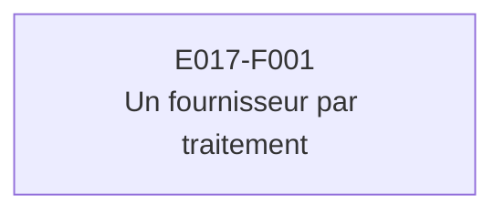

# E017 — Traitements IA en local — fournisseur commutable et souveraineté des données

> **Statut** : 🟡 En cours — 1 feature sur 1 en validation
> **Modèle** : task-driven
> **Version** : 1.0
> **Auteur** : PO forge
> **Audience** : PO, direction, équipe produit — la vue ingénierie vit dans [E017-Changelogs.md](E017-Changelogs.md)
> **Dernière mise à jour** : 2026-09-30

---

<!-- toc:start — section générée par /tech-writer ; ne pas éditer manuellement -->

## Sommaire

- [1. Vision](#1-vision)
- [2. Objectifs métier](#2-objectifs-métier)
- [3. Acteurs concernés](#3-acteurs-concernés)
- [4. Features de l'EPIC](#4-features-de-lepic)
- [5. Workflow entre Features](#5-workflow-entre-features)
- [6. Règles métier transverses](#6-règles-métier-transverses)
- [7. Contraintes et hypothèses](#7-contraintes-et-hypothèses)
- [8. Critères d'acceptation de l'EPIC](#8-critères-dacceptation-de-lepic)
- [9. Hors périmètre](#9-hors-périmètre)
- [État de couverture (2026-09-30)](#état-de-couverture-2026-09-30)
- [Synthèse fonctionnelle des changelogs](#synthèse-fonctionnelle-des-changelogs)

<!-- toc:end -->

---

## 1. Vision

Les traitements d'intelligence artificielle de la messagerie tournent sur un fournisseur choisi
capacité par capacité, local de préférence. Ces traitements sont le classement automatique, le
résumé, l'assistant, l'aide à la rédaction et la recherche. Le but est double : le contenu des
mails de santé ne quitte plus le poste ou l'hébergement, et le coût de ces traitements devient
mesurable.

---

## 2. Objectifs métier

- [ ] Le classement, le résumé, l'assistant et l'aide à la rédaction ne transmettent plus le
  contenu des mails à un prestataire extérieur, en développement comme sur le banc de charge.
- [ ] Le volume de traitement confié à chaque fournisseur est mesuré, et non plus estimé.
- [ ] Un fournisseur mal configuré empêche le service de démarrer, au lieu de retomber sans
  prévenir sur un autre prestataire.
- [ ] Les résultats de la recherche restent identiques pour le praticien quand le fournisseur
  change.

---

## 3. Acteurs concernés

| Acteur | Rôle dans l'EPIC |
|--------|------------------|
| Médecin, secrétaire médicale | Bénéficiaires : les messages sont classés, résumés et retrouvés comme avant, sans que leur contenu soit confié à un prestataire extérieur. |
| Équipe d'exploitation | Choisit le fournisseur de chaque traitement et suit le volume confié à chacun. |
| Direction, conformité | Suit ce que devient la donnée de santé traitée par l'IA (hébergement, sous-traitance, analyse d'impact). |

---

## 4. Features de l'EPIC

| # | Fonctionnalité | Ce que le praticien peut faire | Tasks | Statut |
|---|----------------|--------------------------------|-------|--------|
| E017-F001 | Un fournisseur par traitement, l'échange en local | Classement, résumé, assistant et aide à la rédaction fonctionnent comme avant. Ils sont servis par un modèle local, et la recherche garde les mêmes résultats. | task-325 | 🟡 En validation |

> Le bilan d'avancement par feature (statut, couverture, tasks contributives) est consigné en fin
> de document, dans la section *État de couverture*.

---

## 5. Workflow entre Features

**Description du workflow** :

1. **E017-F001** : l'exploitant choisit un fournisseur pour les traitements « conversationnels »
   (classement, résumé, assistant, rédaction) et un autre pour la recherche. Par défaut, en
   développement et sur le banc de charge, les premiers tournent sur un modèle local et la
   recherche reste chez le prestataire historique. Pour le praticien, rien ne change à l'écran :
   ses messages sont classés, résumés et retrouvés comme avant.

---

## 6. Règles métier transverses

| ID | Règle | Description | Statut |
|----|-------|-------------|--------|
| RG-E017-01 | Jamais de bascule silencieuse | Un fournisseur inconnu ou absent de la configuration empêche le service de démarrer, avec un message qui dit quoi corriger. Il ne retombe jamais sur un autre prestataire. | 🟡 En validation (task-325) |
| RG-E017-02 | Une recherche ne mélange pas deux modèles | La recherche ne compare un message qu'aux messages analysés par le même modèle. Quand le modèle change, les anciens messages restent introuvables par le sens, sans résultat faux, jusqu'à leur nouvelle analyse. Une recherche impossible est signalée comme telle, jamais présentée comme « aucun résultat ». | 🟡 En validation (task-325) |
| RG-E017-03 | La production ne change de prestataire que sur décision | Les environnements de production gardent leur prestataire historique. Les passer en local est une décision à qualifier : hébergement de données de santé, sous-traitance, analyse d'impact. | 🟡 En validation (task-325) |

---

## 7. Contraintes et hypothèses

### Contraintes
- Le modèle local doit tenir sur la carte graphique du poste, être bon en français, suivre des
  consignes de format et savoir déclencher les actions de l'assistant.
- Deux modèles d'analyse de texte produisent des représentations incompatibles : changer celui
  de la recherche impose de réanalyser les messages déjà indexés.
- Aucun contenu de mail ni de prompt n'apparaît dans les journaux ou les indicateurs de suivi.

### Hypothèses
- Les données traitées en développement et sur le banc de charge sont synthétiques.
- Un modèle local sur une seule carte graphique peut être plus lent sous forte charge. Cette
  lenteur est mesurée, et elle alimente le choix d'un serveur de modèles dédié.

---

## 8. Critères d'acceptation de l'EPIC

- [ ] Toutes les Features sont implémentées et validées.
- [ ] Sur la campagne de charge qui suit la livraison, aucun traitement conversationnel n'est
  confié au prestataire extérieur.
- [ ] Une même recherche rend les mêmes résultats avant et après la livraison, sur la même base.

---

## 9. Hors périmètre

- La réanalyse des messages déjà indexés avec un modèle local, qui permettra de passer aussi la
  recherche en local.
- Un serveur de modèles dédié, pour tenir la charge de 1 000 praticiens.
- Le passage en local des environnements de production et sa qualification réglementaire
  (hébergement de données de santé, analyse d'impact).

---

## État de couverture (2026-09-30)

| Fonctionnalité | Statut | Couverture | Tasks contributives |
|----------------|--------|------------|---------------------|
| E017-F001 — Un fournisseur par traitement, l'échange en local | 🟡 En validation | Choix par traitement, refus de démarrer sur une erreur de configuration, recherche limitée au modèle actif et suivi du volume livrés. La validation humaine de bout en bout est en cours. | task-325 |

---

## Synthèse fonctionnelle des changelogs

### Fonctionnalités métier

- v1.0 — En développement et sur le banc de charge, le classement, le résumé, l'assistant et l'aide
  à la rédaction tournent sur un modèle local. La recherche garde son prestataire et ses résultats.
  Pour le praticien, rien ne change à l'écran (task-325).

### Conformité réglementaire

- v1.0 — Le contenu des mails n'est plus confié à un prestataire extérieur pour les traitements
  conversationnels, en développement et sur le banc de charge. La production garde son
  prestataire tant que ce changement n'est pas qualifié (task-325).

### Sécurité

- v1.0 — Une erreur de configuration du fournisseur empêche le démarrage, au lieu de transmettre
  sans prévenir les données à un autre prestataire (task-325).

### Technique / observabilité

- v1.0 — Le volume de traitement confié à chaque fournisseur est désormais compté, traitement par
  traitement, et suivi dans le tableau de bord d'exploitation (task-325).

---

*Document vivant — maintenu par /tech-writer à partir des task files déclarant `**Epic**: E017`.*
