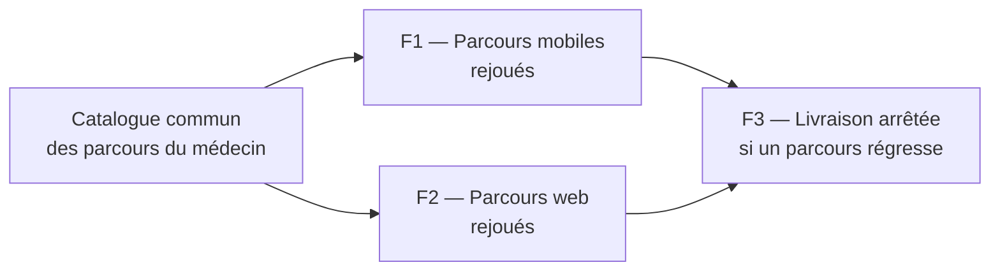

# E018 — Filet de non-régression fonctionnel — parcours e2e headless

> **Statut** : ✅ Livré — 3 features sur 3 livrées
> **Modèle** : task-driven
> **Version** : 1.2
> **Auteur** : PO forge
> **Audience** : PO, direction, équipe produit — la vue ingénierie vit dans [E018-Changelogs.md](E018-Changelogs.md)
> **Dernière mise à jour** : 2026-09-29

---

<!-- toc:start — section générée par /tech-writer ; ne pas éditer manuellement -->

## Sommaire

- [1. Vision](#1-vision)
- [2. Objectifs métier](#2-objectifs-métier)
- [3. Acteurs concernés](#3-acteurs-concernés)
- [4. Features de l'EPIC](#4-features-de-lepic)
- [5. Workflow entre Features](#5-workflow-entre-features)
- [6. Règles métier transverses](#6-règles-métier-transverses)
- [7. Contraintes et hypothèses](#7-contraintes-et-hypothèses)
- [8. Critères d'acceptation de l'EPIC](#8-critères-dacceptation-de-lepic)
- [9. Hors périmètre](#9-hors-périmètre)
- [État de couverture (2026-09-29)](#état-de-couverture-2026-09-29)
- [Parcours vérifiés automatiquement (2026-09-29)](#parcours-vérifiés-automatiquement-2026-09-29)
- [Synthèse fonctionnelle des changelogs](#synthèse-fonctionnelle-des-changelogs)

<!-- toc:end -->

---

## 1. Vision

Les règles de la messagerie sont déjà protégées par des milliers de tests automatiques, mais
les **parcours** du médecin ne l'étaient pas. Un parcours, c'est par exemple : ouvrir sa boîte,
lire un compte rendu, acquitter une biologie anormale, répondre ou classer. Le seul contrôle de
ces enchaînements demandait une connexion Pro Santé Connect faite à la main. Il ne tournait donc
presque jamais.

Cet EPIC fait rejouer ces parcours **automatiquement, à chaque évolution**, sur l'application
mobile et sur l'application web. Ils tournent contre le vrai service de messagerie, avec une boîte
d'essai **entièrement fictive**. Ainsi, une modification qui casse un geste du médecin est arrêtée
avant d'arriver jusqu'à lui.

---

## 2. Objectifs métier

- [ ] Objectif 1 : qu'aucune évolution ne puisse casser un parcours courant du médecin sans être
      arrêtée avant sa mise à disposition.
- [ ] Objectif 2 : que l'application mobile et l'application web restent vérifiées sur **les
      mêmes parcours**, décrits une seule fois dans un catalogue commun.
- [ ] Objectif 3 : que ce contrôle n'introduise **aucun risque** : jamais de donnée de santé
      réelle, jamais activable en production.

---

## 3. Acteurs concernés

| Acteur | Rôle dans l'EPIC |
|---|---|
| Médecin / praticien | Bénéficiaire : les parcours qu'il utilise chaque jour sont rejoués avant chaque livraison |
| PO | Tient le catalogue des parcours à couvrir, en langage métier |
| Équipe produit | Voit un parcours cassé signalé avant la livraison, avec le geste en cause |

---

## 4. Features de l'EPIC

> Le bilan d'avancement par feature (statut, couverture, tasks contributives) est consigné en fin
> de document, dans la section *État de couverture*.

| Fonctionnalité | Ce que le praticien y gagne | Tasks | Statut |
|---|---|---|---|
| **F1 — Parcours mobiles rejoués automatiquement** | Ses gestes sur l'application mobile sont rejoués sans connexion humaine : lecture, lu/non lu, signalement, classement, envoi et réception, brouillons, acquittement d'une biologie anormale, contacts, groupes, signatures, dossiers. Un catalogue commun décrit ces parcours pour les deux applications. | task-345 | ✅ Livré |
| **F2 — Parcours web rejoués automatiquement** | Les mêmes parcours sont rejoués sur la messagerie de l'application web, sans connexion humaine et selon le même catalogue : les deux applications sont vérifiées sur les mêmes gestes. | task-346 | ✅ Livré |
| **F3 — Aucune livraison si un parcours régresse** | Une évolution qui casse un parcours, ou qui laisse une application prendre du retard sur le catalogue, est arrêtée avant d'être proposée. Chaque nouvelle fonctionnalité ajoute son propre parcours. | task-347 | ✅ Livré |

---

## 5. Workflow entre Features

Le catalogue décrit chaque parcours une seule fois, en langage métier. Chaque application le
rejoue (F1, F2). La chaîne de livraison refuse ensuite toute évolution qui en casse un (F3).

---

## 6. Règles métier transverses

| Règle | Énoncé | Statut |
|---|---|---|
| RG-E018-01 | Aucune donnée de santé réelle : identités, messages et comptes rendus sont fictifs ou issus du corpus de test officiel | ✅ Tenue (task-345) |
| RG-E018-02 | Le contournement de la connexion n'existe que dans l'outillage de test : il est absent de l'application livrée et impossible en production | ✅ Tenue (task-345) |
| RG-E018-03 | Un même parcours se vérifie à l'identique sur mobile et sur web, ou le catalogue dit pourquoi il ne s'applique pas | ✅ Tenue sur les deux applications (task-346), contrôlée à chaque livraison (task-347) |
| RG-E018-05 | Aucune évolution n'est proposée tant qu'un parcours est en échec : seule une mise à l'écart décidée par un humain, avec sa correction planifiée, lève l'arrêt | ✅ Tenue (task-347) |
| RG-E018-04 | Un parcours « vert » doit prouver ce que le serveur a enregistré, pas seulement ce que l'écran affiche | ✅ Tenue (task-345) |

---

## 7. Contraintes et hypothèses

*À compléter.*

---

## 8. Critères d'acceptation de l'EPIC

- [ ] Toutes les features de l'EPIC sont livrées
- [x] Un parcours cassé volontairement est détecté (filtre « Non lus » cassé sur le mobile : parcours en échec, livraison arrêtée)
- [x] La chaîne de livraison s'arrête sur un parcours régressé, et sur une application en retard sur le catalogue
- [ ] Un premier cycle complet d'une évolution mobile passe par le contrôle des parcours

---

## 9. Hors périmètre

- La connexion Pro Santé Connect elle-même (e-CPS, renouvellement de session, déconnexion) et
  l'annuaire national : ils restent vérifiés par le parcours manuel avec connexion humaine.
- L'appréciation visuelle des écrans, qui relève de la vérification visuelle.

---

## État de couverture (2026-09-29)

| Feature | Statut | Couverture | Tasks contributives |
|---|---|---|---|
| F1 — Parcours mobiles rejoués automatiquement | ✅ Livré | 22 parcours rejoués sans humain (3 restent manuels : connexion, renouvellement, annuaire) | task-345 |
| F2 — Parcours web rejoués automatiquement | ✅ Livré | les mêmes 22 parcours sur l'application web, aucun écart avec le mobile | task-346 |
| F3 — Aucune livraison si un parcours régresse | ✅ Livré | chaque évolution qui touche la messagerie rejoue les parcours des deux applications ; arrêt prouvé sur un parcours cassé et sur un retard de catalogue | task-347 |

**Couverture EPIC consolidée : 100 %** (3 features sur 3 livrées).

---

## Parcours vérifiés automatiquement (2026-09-29)

Dernier contrôle des parcours du médecin, rejoués sur les deux applications (task-347).

| Parcours du médecin | Application mobile | Application web |
|---|---|---|
| Filtrer la boîte de réception, basculer liste / conversation, ouvrir la recherche | ✅ | ✅ |
| Naviguer vers les dossiers Archive et Corbeille | ✅ | ✅ ¹ |
| Afficher la vue patients | ✅ | ✅ |
| Rechercher dans le carnet et interroger l'annuaire national | 👤 | 👤 |
| Changer le filtre par défaut et le retrouver après rechargement | ✅ | ✅ |
| Marquer un message lu puis non lu | ✅ | ✅ |
| Tout sélectionner et marquer lu en masse | ✅ | ✅ |
| Répondre et transférer depuis la lecture d'un message | ✅ | ✅ |
| Envoyer un message, le recevoir, le lire, le supprimer | ✅ | ✅ |
| Signaler puis ne plus signaler un message | ✅ | ✅ |
| Déplacer un message vers Archive puis le ramener | ✅ | ✅ |
| Créer un brouillon, le reprendre, le supprimer | ✅ | ✅ |
| Acquitter un compte rendu de biologie | ✅ | ✅ |
| Afficher les widgets du tableau de bord | ✅ | ✅ |
| Basculer entre texte brut et HTML à la lecture | ✅ | ✅ |
| Répondre à tous depuis la lecture d'un message | ✅ | ✅ |
| Changer la vue par défaut et la retrouver après rechargement | ✅ | ✅ |
| Rechercher un message et ouvrir la recherche avancée | ✅ | ✅ |
| Voir les pièces jointes d'un message | ✅ | ✅ |
| Créer puis supprimer un contact | ✅ | ✅ |
| Créer puis supprimer une signature | ✅ | ✅ |
| Créer puis supprimer un groupe de contacts | ✅ | ✅ |
| Créer puis supprimer un dossier | ✅ | ✅ |
| Rester connecté quand le jeton d'accès expire | 👤 | 👤 |
| Se déconnecter | 👤 | 👤 |

✅ vérifié automatiquement — 👤 vérifié à la main (connexion Pro Santé Connect, annuaire national)

¹ Réussi au second essai : parcours surveillé, sans être en échec.

Les deux applications sont vérifiées sur les mêmes parcours : aucun écart ouvert avec le catalogue.

---

## Synthèse fonctionnelle des changelogs

### Fonctionnalités métier

- v1.0 — Les parcours du médecin sur l'application mobile sont rejoués automatiquement, sans
  connexion humaine, contre le vrai service de messagerie et une boîte fictive. Le catalogue
  commun des parcours est posé pour le mobile et le web (task-345).
- v1.0 — En chemin, deux défauts visibles corrigés : le trombone des messages avec pièce jointe
  s'affiche de nouveau dans la liste, et le menu des dossiers se referme après un choix sur
  téléphone (task-345).

- v1.1 — Les mêmes parcours sont rejoués sur la messagerie de l'application web, selon le même catalogue. Mobile et web sont vérifiés sur les mêmes gestes, sans aucun écart (task-346).

- v1.2 — Toute évolution qui touche la messagerie rejoue ces parcours avant d'être proposée. Un parcours en échec, ou une application en retard sur le catalogue, arrête la livraison. Chaque nouvelle fonctionnalité du médecin ajoute son parcours au catalogue (task-347).

### Sécurité

- v1.0 — Le contournement de la connexion n'existe que dans l'outillage de test. Il exige une clé
  propre à chaque exécution, n'a aucune valeur par défaut et reste impossible en production
  (task-345).
- v1.2 — Un parcours ne peut être mis à l'écart du contrôle que par un humain, et seulement avec sa correction planifiée (task-347).

---

*Document vivant — maintenu par /tech-writer à partir des task files déclarant `**Epic**: E018`.*
