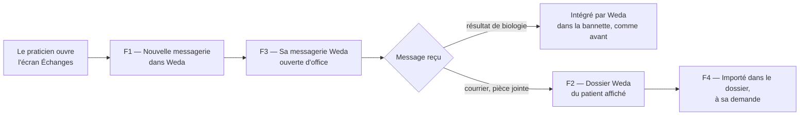

# E019 — Intégration de la nouvelle messagerie dans Weda

> **Statut** : 🟡 En cours — 2 fonctionnalités sur 4 validées
> **Modèle** : task-driven
> **Version** : 1.1
> **Auteur** : PO forge
> **Audience** : PO, direction, équipe produit — la vue ingénierie vit dans [E019-Changelogs.md](E019-Changelogs.md)
> **Dernière mise à jour** : 2026-10-10

---

<!-- toc:start — section générée par /tech-writer ; ne pas éditer manuellement -->

## Sommaire

- [1. Vision](#1-vision)
- [2. Objectifs métier](#2-objectifs-métier)
- [3. Acteurs concernés](#3-acteurs-concernés)
- [4. Features de l'EPIC](#4-features-de-lepic)
- [5. Workflow entre Features](#5-workflow-entre-features)
- [6. Règles métier transverses](#6-règles-métier-transverses)
- [7. Contraintes et hypothèses](#7-contraintes-et-hypothèses)
- [8. Critères d'acceptation de l'EPIC](#8-critères-dacceptation-de-lepic)
- [9. Hors périmètre](#9-hors-périmètre)
- [État de couverture (2026-10-10)](#état-de-couverture-2026-10-10)
- [Synthèse fonctionnelle des changelogs](#synthèse-fonctionnelle-des-changelogs)

<!-- toc:end -->

---

## 1. Vision

Le praticien Weda traite aujourd'hui sa messagerie sécurisée de santé dans l'écran Échanges. Cet
EPIC y installe la **nouvelle messagerie** : il y lit, trie et répond à ses messages, **sans se
reconnecter et sans quitter Weda**, dans la boîte que Weda connaît.

Quand il le décide, il **importe un document reçu dans le dossier patient Weda**, en quelques clics.
La réception, et l'arrivée des résultats de biologie dans la bannette, restent assurées par Weda,
comme aujourd'hui.

Le praticien passe librement de l'écran actuel à la nouvelle messagerie.

---

## 2. Objectifs métier

- [ ] Objectif 1 : que le praticien lise et traite sa messagerie sécurisée dans Weda avec la
      nouvelle expérience, sans seconde connexion, dans la boîte que Weda connaît.
- [ ] Objectif 2 : qu'un document reçu soit importé dans le bon dossier patient quand le praticien
      le demande, sans jamais créer ni modifier une identité patient à son insu.
- [ ] Objectif 3 : que la nouvelle messagerie ne change rien à la réception : aucun résultat de
      biologie n'est perdu ni reçu en double.
- [ ] Objectif 4 : que le praticien puisse revenir à l'écran actuel à tout moment, sans perte.

---

## 3. Acteurs concernés

| Acteur | Rôle dans l'EPIC |
|---|---|
| Médecin / praticien | Utilisateur principal : lit, trie, répond, importe ses documents dans le dossier patient |
| Secrétariat médical | Conserve l'écran actuel dans cette première version |
| Cabinet | Unité d'activation : la nouvelle messagerie est proposée cabinet par cabinet |
| Exploitation de l'éditeur | Active l'intégration cabinet par cabinet, et peut la désactiver |

---

## 4. Features de l'EPIC

> Le bilan d'avancement par feature (statut, couverture, tasks contributives) est consigné en fin
> de document, dans la section *État de couverture*.

| Fonctionnalité | Ce que le praticien peut faire | Tasks | Statut |
|---|---|---|---|
| **F1 — La nouvelle messagerie dans l'écran Échanges** | Ouvrir sa messagerie dans Weda sans se reconnecter. Elle ne dialogue avec le dossier patient que si l'intégration est activée pour son cabinet. | task-356 | 🟢 Validée, en attente de mise en ligne |
| **F2 — Le dossier Weda du patient d'un document reçu** | Voir, sous un message, le dossier Weda du patient concerné (trouvé par son INS), ou des correspondances possibles à vérifier, puis l'ouvrir en un clic. | task-357 | 🟢 Validée, en attente de mise en ligne |
| **F3 — La messagerie que Weda connaît, ouverte d'office** | Retrouver dans Weda la messagerie que Weda connaît, même s'il en a choisi une autre par défaut. Si elle n'est pas encore rattachée à son compte, la rattacher, l'adresse déjà saisie. Passer ensuite librement à ses autres messageries. | task-362 | ⚪ À faire |
| **F4 — Importer un document reçu dans le dossier patient** | Importer, quand il le décide, une pièce jointe, le document d'un compte rendu ou le message lui-même dans le dossier d'un patient : destination, classification, commentaire, post-it. Le message reste dans sa boîte de réception. | task-363 | ⚪ À faire |

---

## 5. Workflow entre Features

1. Le praticien ouvre l'écran Échanges : la nouvelle messagerie s'affiche, sans nouvelle connexion
   (F1).
2. Elle s'ouvre sur la messagerie que Weda connaît (F3). Il peut ensuite passer à une autre de ses
   messageries.
3. Un résultat de biologie rejoint la bannette par la réception de Weda, comme aujourd'hui. La
   nouvelle messagerie ne l'importe pas.
4. Pour un courrier ou une pièce jointe, il voit le dossier Weda du patient concerné (F2). Il y
   importe le document quand il le décide (F4), et le message reste dans sa boîte de réception.

---

## 6. Règles métier transverses

| Règle | Énoncé | Statut |
|---|---|---|
| RG-E019-01 | Weda reste seul à écrire dans le dossier patient : la nouvelle messagerie demande, Weda vérifie les droits du praticien et importe | 🟡 Tenue pour la recherche et l'ouverture du dossier, import à venir (task-363) |
| RG-E019-02 | Aucune identité patient n'est créée ni modifiée depuis la nouvelle messagerie. Seule l'INS vérifiée désigne un dossier d'office ; un rapprochement par nom, prénom et date de naissance reste une proposition à vérifier | 🟡 Tenue à l'affichage du dossier, import à venir (task-363) |
| RG-E019-03 | L'intégration s'active cabinet par cabinet, par un interrupteur fermé tant qu'il n'a pas été explicitement ouvert | ✅ Tenue (task-356) |
| RG-E019-04 | Hors de Weda (onglet séparé, autre navigateur), la nouvelle messagerie ne propose aucune action sur le dossier patient | ✅ Tenue (task-356) |
| RG-E019-05 | Les résultats de biologie restent intégrés par Weda seul, à la réception : la nouvelle messagerie n'en importe aucun, et importer un document ne déplace ni ne supprime le message | ⚪ À faire (task-363) |
| RG-E019-06 | Aucune donnée de santé (identité, INS, contenu de document) n'apparaît dans les journaux | ✅ Tenue (task-356) |
| RG-E019-07 | Dans Weda, la nouvelle messagerie s'ouvre toujours sur la messagerie que Weda connaît ; le praticien passe ensuite librement à ses autres messageries | ⚪ À faire (task-362) |

---

## 7. Contraintes et hypothèses

### Contraintes
- La structure de la base de données de Weda ne change pas.
- La réception reste celle d'aujourd'hui : Weda relève la boîte, intègre les résultats de biologie
  dans la bannette et range les messages dans l'écran actuel. La nouvelle messagerie ne la remplace
  pas.
- La messagerie sécurisée de santé exige la connexion Pro Santé Connect du praticien. La réception
  se fait donc tant qu'une page de Weda est ouverte, comme aujourd'hui.
- Importer un document ne déplace ni ne supprime le message. La réception de Weda ne lit que la
  boîte de réception : un message sorti trop tôt priverait la bannette d'un résultat de biologie.

### Hypothèses
- Le praticien a une boîte connue de Weda, et c'est elle que la nouvelle messagerie ouvre. Un compte
  peut en porter plusieurs : il passe ensuite de l'une à l'autre librement.
- Le praticien est seul titulaire de sa boîte ; le secrétariat reste sur l'écran actuel dans cette
  première version.

---

## 8. Critères d'acceptation de l'EPIC

- [ ] Toutes les features de l'EPIC sont livrées
- [x] Un praticien connecté à Weda ouvre la nouvelle messagerie sans se reconnecter
- [ ] Dans Weda, la nouvelle messagerie s'ouvre sur la boîte que Weda connaît, même si le praticien
      en a choisi une autre par défaut
- [ ] Un document importé depuis la nouvelle messagerie apparaît dans le dossier patient comme s'il
      avait été classé depuis l'écran actuel
- [ ] Pendant le pilote, les résultats de biologie arrivent dans la bannette comme avant, sans perte
      ni doublon
- [ ] Le praticien revient à l'écran actuel à tout moment, sans perte de message

---

## 9. Hors périmètre

- La création d'un dossier patient à partir d'un document reçu, et la vérification d'identité par le
  téléservice INSi depuis la nouvelle messagerie : elles restent dans l'écran actuel pour cette
  première version.
- Le classement automatique, sans geste du praticien, des documents dont l'identité est vérifiée.
- La réception par la nouvelle messagerie, et l'intégration des résultats de biologie et des
  messages HPRIM : elles restent à Weda. Le mode où la nouvelle messagerie remplacerait l'écran
  actuel pour tout un cabinet, étudié le 2026-10-09, est en attente.
- Le compteur de messages non lus de l'en-tête de Weda, et l'envoi d'un document depuis le dossier
  patient : ils restent ceux de l'écran actuel.
- Les messageries MSSanté de première génération et Medimail, qui conservent l'écran actuel.
- L'usage de la nouvelle messagerie en dehors de Weda pour agir sur le dossier patient.

---

## État de couverture (2026-10-10)

| Feature | Statut | Couverture | Tasks contributives |
|---|---|---|---|
| F1 — La nouvelle messagerie dans l'écran Échanges | 🟢 Validée, en attente de mise en ligne | affichage dans Échanges, connexion sans ressaisie, activation par cabinet, rien hors de Weda | task-356 |
| F2 — Le dossier Weda du patient d'un document reçu | 🟢 Validée, en attente de mise en ligne | dossier trouvé par INS vérifiée, correspondances signalées « à vérifier », ouverture du dossier en un clic dans Weda | task-357 |
| F3 — La messagerie que Weda connaît, ouverte d'office | ⚪ À faire | — | task-362 |
| F4 — Importer un document reçu dans le dossier patient | ⚪ À faire | — | task-363 |

**Couverture EPIC consolidée : 50 %** (2 fonctionnalités sur 4 validées).

---

## Synthèse fonctionnelle des changelogs

### Fonctionnalités métier

- v1.0 — La nouvelle messagerie s'affiche dans l'écran Échanges de Weda. Le praticien déjà
  connecté à Weda y entre directement, sans nouvelle connexion (task-356).

- v1.1 — Sous chaque message qui contient un document médical, le praticien voit le dossier Weda du
  patient concerné, trouvé par son INS vérifiée. À défaut, il voit des correspondances possibles,
  signalées « à vérifier ». Il ouvre le dossier en un clic dans Weda (task-357).

### Sécurité

- v1.0 — La nouvelle messagerie ne dialogue avec Weda que si l'intégration a été explicitement
  activée pour le cabinet, et jamais lorsqu'elle est ouverte en dehors de Weda. Weda n'accepte les
  demandes que de la messagerie qu'il affiche lui-même (task-356).
- v1.1 — Aucune identité patient n'est créée ni modifiée depuis la nouvelle messagerie. La recherche
  du dossier reste limitée au cabinet du praticien (task-357).

---

*Document vivant — maintenu par /tech-writer à partir des task files déclarant `**Epic**: E019`.*
