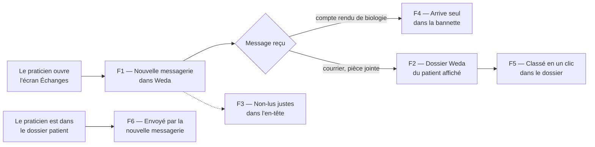

# E019 — Intégration de la nouvelle messagerie dans Weda

> **Statut** : 🟡 En cours — 2 fonctionnalités sur 6 validées
> **Modèle** : task-driven
> **Version** : 1.1
> **Auteur** : PO forge
> **Audience** : PO, direction, équipe produit — la vue ingénierie vit dans [E019-Changelogs.md](E019-Changelogs.md)
> **Dernière mise à jour** : 2026-10-10

---

<!-- toc:start — section générée par /tech-writer ; ne pas éditer manuellement -->

## Sommaire

- [1. Vision](#1-vision)
- [2. Objectifs métier](#2-objectifs-métier)
- [3. Acteurs concernés](#3-acteurs-concernés)
- [4. Features de l'EPIC](#4-features-de-lepic)
- [5. Workflow entre Features](#5-workflow-entre-features)
- [6. Règles métier transverses](#6-règles-métier-transverses)
- [7. Contraintes et hypothèses](#7-contraintes-et-hypothèses)
- [8. Critères d'acceptation de l'EPIC](#8-critères-dacceptation-de-lepic)
- [9. Hors périmètre](#9-hors-périmètre)
- [État de couverture (2026-10-10)](#état-de-couverture-2026-10-10)
- [Synthèse fonctionnelle des changelogs](#synthèse-fonctionnelle-des-changelogs)

<!-- toc:end -->

---

## 1. Vision

Le praticien Weda traite aujourd'hui sa messagerie sécurisée de santé dans l'écran Échanges. Cet
EPIC y installe la **nouvelle messagerie** : il y lit, trie et répond à ses messages, **sans se
reconnecter et sans quitter Weda**.

Pour chaque document reçu, la nouvelle messagerie lui montre le dossier patient Weda
correspondant et le lui fait **classer en un clic**. Les résultats de biologie continuent d'arriver
seuls dans la bannette de résultats.

La bascule se fait **cabinet par cabinet**, et elle est réversible.

---

## 2. Objectifs métier

- [ ] Objectif 1 : que le praticien lise et traite sa messagerie sécurisée dans Weda avec la
      nouvelle expérience, sans seconde connexion.
- [ ] Objectif 2 : qu'un document reçu soit classé dans le bon dossier patient en un clic, sans
      jamais créer ni modifier une identité patient à son insu.
- [ ] Objectif 3 : qu'aucun résultat de biologie ne soit perdu ni reçu en double lors de la
      bascule d'un cabinet.
- [ ] Objectif 4 : que chaque cabinet puisse être basculé, puis rebasculé, sans perte.

---

## 3. Acteurs concernés

| Acteur | Rôle dans l'EPIC |
|---|---|
| Médecin / praticien | Utilisateur principal : lit, trie, répond, classe ses documents dans le dossier patient |
| Secrétariat médical | Conserve l'écran actuel dans cette première version |
| Cabinet | Unité de bascule : la nouvelle messagerie s'active pour tout le cabinet |
| Exploitation de l'éditeur | Active l'intégration cabinet par cabinet, et peut la désactiver |

---

## 4. Features de l'EPIC

> Le bilan d'avancement par feature (statut, couverture, tasks contributives) est consigné en fin
> de document, dans la section *État de couverture*.

| Fonctionnalité | Ce que le praticien peut faire | Tasks | Statut |
|---|---|---|---|
| **F1 — La nouvelle messagerie dans l'écran Échanges** | Ouvrir sa messagerie dans Weda sans se reconnecter. Elle ne dialogue avec le dossier patient que si l'intégration est activée pour son cabinet. | task-356 | 🟢 Validée, en attente de mise en ligne |
| **F2 — Le dossier Weda du patient d'un document reçu** | Voir, sous un message, le dossier Weda du patient concerné (trouvé par son INS), ou des correspondances possibles à vérifier, puis l'ouvrir en un clic. | task-357 | 🟢 Validée, en attente de mise en ligne |
| **F3 — Le bon nombre de messages non lus partout dans Weda** | Voir dans l'en-tête de Weda, sur toutes les pages, le nombre réel de messages non lus de sa nouvelle messagerie. | task-358 | ⚪ À faire |
| **F4 — Les résultats de biologie arrivent seuls dans la bannette** | Recevoir ses comptes rendus de biologie directement dans la bannette de résultats, une seule fois, même s'il a déjà rangé le message. | task-359 | ⚪ À faire |
| **F5 — Classer un document reçu en un clic** | Classer un courrier ou une pièce jointe dans le dossier du patient : destination, classification, commentaire, post-it. Le message est ensuite marqué « Classé dans Weda ». | task-360 | ⚪ À faire |
| **F6 — Envoyer un document Weda par la nouvelle messagerie** | Depuis le dossier patient, cliquer sur « Envoyer par MSSanté » et retrouver le message prêt dans la nouvelle messagerie, avec le document joint. | task-361 | ⚪ À faire |

---

## 5. Workflow entre Features

1. Le praticien ouvre l'écran Échanges : la nouvelle messagerie s'affiche, sans nouvelle connexion
   (F1).
2. À l'arrivée d'un compte rendu de biologie, le résultat rejoint seul la bannette, une seule fois
   (F4).
3. Pour un courrier ou une pièce jointe, il voit le dossier Weda du patient concerné (F2). Il l'y
   classe en un clic (F5).
4. Depuis le dossier d'un patient, il envoie un document par la nouvelle messagerie (F6).
5. Sur toutes les pages de Weda, l'en-tête lui indique ses messages non lus (F3).

---

## 6. Règles métier transverses

| Règle | Énoncé | Statut |
|---|---|---|
| RG-E019-01 | Weda reste seul à écrire dans le dossier patient : la nouvelle messagerie demande, Weda vérifie les droits du praticien et classe | 🟡 Tenue pour la recherche et l'ouverture du dossier, classement à venir (task-357) |
| RG-E019-02 | Aucune identité patient n'est créée ni modifiée depuis la nouvelle messagerie. Seule l'INS vérifiée désigne un dossier d'office ; un rapprochement par nom, prénom et date de naissance reste une proposition à vérifier | 🟡 Tenue à l'affichage du dossier, classement à venir (task-357) |
| RG-E019-03 | L'intégration s'active cabinet par cabinet, par un interrupteur fermé tant qu'il n'a pas été explicitement ouvert | ✅ Tenue (task-356) |
| RG-E019-04 | Hors de Weda (onglet séparé, autre navigateur), la nouvelle messagerie ne propose aucune action sur le dossier patient | ✅ Tenue (task-356) |
| RG-E019-05 | Un résultat de biologie n'entre qu'une fois dans la bannette, et n'est jamais perdu, même si le message est rangé avant son traitement | ⚪ À faire (task-359) |
| RG-E019-06 | Aucune donnée de santé (identité, INS, contenu de document) n'apparaît dans les journaux | ✅ Tenue (task-356) |

---

## 7. Contraintes et hypothèses

### Contraintes
- La structure de la base de données de Weda ne change pas : ce que Weda doit retenir d'un message
  (pris en charge, classé) est porté par la messagerie elle-même.
- Pour un cabinet basculé, l'ancienne chaîne de réception de Weda n'est plus utilisée : la nouvelle
  messagerie la remplace entièrement, réception de la biologie comprise.
- La messagerie sécurisée de santé exige la connexion Pro Santé Connect du praticien. La réception
  se fait donc tant qu'une page de Weda est ouverte, comme aujourd'hui ; ce qui arrive pendant une
  absence est rattrapé au retour.

### Hypothèses
- Les opérateurs de messagerie sécurisée conservent les marqueurs posés sur un message ; c'est déjà
  le cas avec l'écran actuel de Weda.
- Le praticien est seul titulaire de sa boîte ; le secrétariat reste sur l'écran actuel dans cette
  première version.

---

## 8. Critères d'acceptation de l'EPIC

- [ ] Toutes les features de l'EPIC sont livrées
- [x] Un praticien connecté à Weda ouvre la nouvelle messagerie sans se reconnecter
- [ ] Un cabinet pilote bascule sans perte ni doublon de résultat de biologie
- [ ] Un document classé depuis la nouvelle messagerie apparaît dans le dossier patient comme s'il
      avait été classé depuis l'écran actuel
- [ ] Un cabinet basculé peut revenir à l'écran actuel sans perte de message

---

## 9. Hors périmètre

- La création d'un dossier patient à partir d'un document reçu, et la vérification d'identité par le
  téléservice INSi depuis la nouvelle messagerie : elles restent dans l'écran actuel pour cette
  première version.
- Le classement automatique, sans geste du praticien, des documents dont l'identité est vérifiée.
- Les messageries MSSanté de première génération et Medimail, qui conservent l'écran actuel.
- L'usage de la nouvelle messagerie en dehors de Weda pour agir sur le dossier patient.

---

## État de couverture (2026-10-10)

| Feature | Statut | Couverture | Tasks contributives |
|---|---|---|---|
| F1 — La nouvelle messagerie dans l'écran Échanges | 🟢 Validée, en attente de mise en ligne | affichage dans Échanges, connexion sans ressaisie, activation par cabinet, rien hors de Weda | task-356 |
| F2 — Le dossier Weda du patient d'un document reçu | 🟢 Validée, en attente de mise en ligne | dossier trouvé par INS vérifiée, correspondances signalées « à vérifier », ouverture du dossier en un clic dans Weda | task-357 |
| F3 — Le bon nombre de messages non lus partout dans Weda | ⚪ À faire | — | task-358 |
| F4 — Les résultats de biologie arrivent seuls dans la bannette | ⚪ À faire | — | task-359 |
| F5 — Classer un document reçu en un clic | ⚪ À faire | — | task-360 |
| F6 — Envoyer un document Weda par la nouvelle messagerie | ⚪ À faire | — | task-361 |

**Couverture EPIC consolidée : 33 %** (2 fonctionnalités sur 6 validées).

---

## Synthèse fonctionnelle des changelogs

### Fonctionnalités métier

- v1.0 — La nouvelle messagerie s'affiche dans l'écran Échanges de Weda. Le praticien déjà
  connecté à Weda y entre directement, sans nouvelle connexion (task-356).

- v1.1 — Sous chaque message qui contient un document médical, le praticien voit le dossier Weda du
  patient concerné, trouvé par son INS vérifiée. À défaut, il voit des correspondances possibles,
  signalées « à vérifier ». Il ouvre le dossier en un clic dans Weda (task-357).

### Sécurité

- v1.0 — La nouvelle messagerie ne dialogue avec Weda que si l'intégration a été explicitement
  activée pour le cabinet, et jamais lorsqu'elle est ouverte en dehors de Weda. Weda n'accepte les
  demandes que de la messagerie qu'il affiche lui-même (task-356).
- v1.1 — Aucune identité patient n'est créée ni modifiée depuis la nouvelle messagerie. La recherche
  du dossier reste limitée au cabinet du praticien (task-357).

---

*Document vivant — maintenu par /tech-writer à partir des task files déclarant `**Epic**: E019`.*
